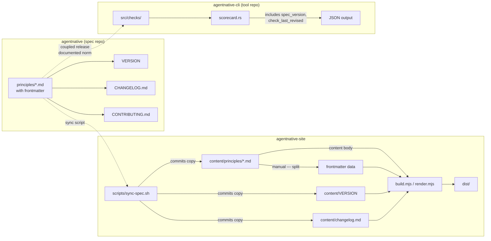

# feat: Implement spec governance model across three repos

## Overview

Establish a formal governance model for the agent-native CLI standard by splitting concerns across three repos:
`agentnative` (spec), `agentnative-cli` (checker tool), and `agentnative-site` (website). Adds per-principle calver,
per-check calver, AI-native contribution requirements, cross-repo routing, and a coupled release protocol.

## Problem Frame

The agent-native CLI standard spans two public repos with no formal governance. Issues have no clear home, versioning
tracks the overall spec but not individual principles or checks, and contributors (human and agent) have no guidance on
AI disclosure, search-before-create, or human signoff. The current issue templates are mechanical scaffolding without
the policy layer. (see origin: `docs/brainstorms/spec-governance-requirements.md`)

## Requirements Trace

- R1. Spec repo holds canonical principle text, governance docs, issue templates, CC BY 4.0 license
- R2. Site repo consumes spec content via committed copy with sync script, scopes templates to site concerns, updates
  /about routing
- R3. Tool repo scopes templates to checker concerns, links to spec repo for governance
- R4. Per-principle calver with `last-revised` dates displayed on site and changelog
- R5. Per-check calver with revision dates in `anc check --output json` and displayed on scorecard pages
- R6. Coupled release protocol — principle PRs must reference check review PRs (documented norm + PR template field)
- R7. AI-native contributions — disclosure always (R7.1-R7.2 all repos), human co-sign for spec changes and PRs
  (R7.3-R7.4 spec repo), follow-up comment disclosure as documented norm (R7.5)
- R8. Cross-repo routing via config.yml contact links and canonical CONTRIBUTING.md

## Scope Boundaries

- Full governance implementation across all three repos
- Per-principle and per-check calver metadata
- AI disclosure fields on all issue/PR templates across all three repos
- Cross-repo routing infrastructure
- Coupled release enforcement via PR template and documented protocol

### Deferred to Separate Tasks

- Community submission flow for adding tools to the registry (separate feature)
- Automated cross-repo issue transfer (manual transfer for now, same-org)
- Formal RFC process with stages (explicitly rejected — single-author spec, single gate)
- GitHub Discussions on any repo (explicitly rejected)
- Principle revision dates in `anc check --output json` (requires cross-repo content dependency; deferred until sync
  mechanism is proven)

## Context & Research

### Relevant Code and Patterns

- `content/principles/p{n}-*.md` — current principle files (no frontmatter, manual copies from vault)
- `src/build/build.mjs` — 11-step SSG pipeline, step 11 has invariant checks (SHA256 byte-match between dist/*.md and
  content/*.md)
- `src/build/render.mjs` — markdown renderer via unified (remark-parse, remark-gfm, rehype-slug, shikijs), extracts
  title from H1 only, does NOT strip frontmatter (no remark-frontmatter plugin)
- `src/build/shell.mjs` — HTML page wrapper, footer currently hardcodes version string
- `.github/ISSUE_TEMPLATE/` — YAML-based form templates (pressure-test, grade-a-cli, false-positive as redirect,
  config.yml)
- `content/about.md` — contributing section with deep-linked issue template URLs pointing at `brettdavies/agentnative`
- `RELEASES.md` — branching model (main/dev/release/*), guard workflows, squash-merge policy
- Tool repo `src/checks/{behavioral,source,project}/` — checks map 1:1 to principles
- Tool repo `src/scorecard.rs` — `Scorecard` struct with `schema_version: "1.1"`, `SCHEMA_VERSION` const
- Tool repo `src/principles/registry.rs` — `Requirement` struct (id, principle, level, summary, applicability)

### Institutional Learnings

- **Cross-repo artifact sync:** Commit a copy into the consumer repo with a one-line sync script. Producer CI runs
  `--check` drift guard. Never fetch at build time or use symlinks. (solutions:
  `cross-repo-artifact-sync-commit-over-fetch`)
- **CalVer changelog:** CalVer breaks SemVer-defaulting tooling in four ways (tag patterns, link prefixes, branch
  detection, date headers). Adapt cliff.toml accordingly. (solutions: `calver-changelog-as-committed-artifact`)
- **Norm vs mechanism:** When a spec says "the gate refuses unless X" but no code enforces it, the spec is aspirational.
  At single-maintainer scale, a documented norm with template enforcement is proportionate; a hard CI gate adds
  maintenance cost without meaningful protection. (solutions: `norm-vs-mechanism-blind-spot`)
- **Calver-pinned headers:** Add `# Canonical version: YYYY.MM.DD` to detect drift across repo copies. (solutions:
  `calver-pin-for-per-repo-config-drift-detection`)

## Key Technical Decisions

- **Content mechanism:** Commit-a-copy with sync script (not submodule, not build-time fetch). Rationale: reproducible
  offline builds, explicit version pinning, no submodule checkout complexity. Per institutional learning. The
  requirements doc listed "git submodule, subtree, or build-time fetch" as options (R2.1); this plan resolves to
  commit-a-copy as a superior alternative per solutions doc evidence.
- **Drift detection:** Site-repo CI checks that `scripts/sync-spec.sh --check` passes (compares committed copies against
  what a fresh sync would produce). Does NOT require cross-repo access — the sync script only validates local state. The
  spec repo does not run drift checks against the site repo (avoids cross-repo credential complexity).
- **Changelog location:** Spec repo holds it (tracks spec evolution, not site evolution). Site renders it from the
  committed copy.
- **Spec version location:** `VERSION` file at spec repo root. Site build reads it from the committed copy at
  `content/VERSION`.
- **Rename execution order:** (1) Publish crate with updated `repository` URL, (2) rename repo on GitHub, (3) update all
  cross-repo URL references in site repo, (4) create new spec repo. Steps 1-3 land in a single session to minimize the
  broken-link window. The crates.io `repository` link will briefly point to a non-existent URL between publish and
  rename (small window, acknowledged).
- **Coupled release enforcement:** PR template required field + documented protocol in CONTRIBUTING.md. NOT a hard CI
  gate. Rationale: single-maintainer project, norm-vs-mechanism learning — a CI gate adds maintenance cost without
  meaningful protection at this scale. The PR template field is the mechanism; CONTRIBUTING.md is the documentation.
- **Frontmatter handling:** Manual `---` splitting in `render.mjs` before passing content to the unified pipeline. No
  new dependency (no `gray-matter`, no `remark-frontmatter`). Rationale: only 7 files with trivial frontmatter
  (`last-revised: YYYY-MM-DD`); a regex split on the first `---...---` block is sufficient and avoids adding a library
  for a 5-line function. The unified pipeline must NOT receive raw frontmatter — remark would parse `---` as a thematic
  break (`
`), corrupting HTML output.
- **Misrouted issue protocol:** Transfer to correct repo (same org enables this), add `misrouted` label before transfer.
- **R7.5 (comment disclosure):** Documented norm in CONTRIBUTING.md, not enforced by automation (GitHub cannot gate
  comment formatting).
- **False-positive template (site repo):** Remains as a contact-link redirect in `config.yml` per R2.5 ("already done").
  The real false-positive template lives in the tool repo (R3.1). Site repo does NOT have a false-positive.yml form
  template.

## Open Questions

### Resolved During Planning

- **Q1 (Content mechanism):** Commit-a-copy with sync script. The principles are small (7 files), the build is SSG with
  no fetch step, and the solutions doc has a proven pattern. A `scripts/sync-spec.sh` pulls from the spec repo and
  commits the result. Site CI does not need network access to the spec repo at build time.
- **Q2 (Changelog location):** Spec repo. It tracks spec evolution. The site renders it from the committed copy
  alongside principle content.
- **Enforcement mechanism for R6.1:** PR template field (required) + documented protocol. Not a hard CI gate (see Key
  Technical Decisions for rationale).
- **Rename order:** Publish → rename → update site references → create spec repo.
- **Frontmatter library:** None. Manual `---` splitting. See Key Technical Decisions.
- **Drift guard architecture:** Site-repo-local only. `sync-spec.sh --check` compares committed state against fresh sync
  output without needing to access the spec repo.
- **spec_version source in tool repo:** A `SPEC_VERSION` const baked into the binary at compile time (same pattern as
  `SCHEMA_VERSION`). Updated manually when a new spec version is released.

### Deferred to Implementation

- Exact regex pattern for frontmatter `---` block extraction (must handle edge cases like `---` in content)
- Whether `sync-spec.sh` uses `gh api` or `git archive` or shallow clone to fetch spec repo content
- Exact formatting of the revision date on principle pages (date locale, position relative to title)
- Whether the Homebrew tap formula needs a homepage URL update (likely yes — verify during Unit 1)

## High-Level Technical Design

> *This illustrates the intended approach and is directional guidance for review, not implementation specification. The
> implementing agent should treat it as context, not code to reproduce.*

**Cross-repo flow:**

1. Spec repo is the source of truth for principles, version, and changelog
2. Site repo holds a committed copy synced via script; site CI validates local consistency
3. Tool repo references spec version as a compiled-in const; coupled release is a documented norm with PR template
   enforcement

## Implementation Units

- [ ] **Unit 1: Rename tool repo and update cross-repo references**

**Goal:** Rename the GitHub repo, update crate metadata, and fix all cross-repo URL references to close the
broken-link window before the new spec repo claims the `agentnative` name.

**Requirements:** R3 (precondition), R8.1 (routing accuracy)

**Dependencies:** None — this must happen first.

**Files:**

- Modify: tool repo `Cargo.toml` (repository, homepage fields → `brettdavies/agentnative-cli`)
- Modify: tool repo `README.md` (badge URLs, clone instructions)
- Modify: tool repo `AGENT.md` (any self-references)
- Modify: site repo `content/about.md` (contributing links → `agentnative-cli`)
- Modify: site repo `content/check.md` (repo link → `agentnative-cli`)
- Modify: site repo `registry.yaml` (`anc` entry repo field → `brettdavies/agentnative-cli`)
- Modify: site repo `README.md` (any tool repo references)
- Modify: site repo `AGENT.md` (any tool repo references)
- Modify: site repo `.github/ISSUE_TEMPLATE/config.yml` (contact link URL → `agentnative-cli`)

**Approach:**

- Publish a crate release with updated `Cargo.toml` `repository` and `homepage` URLs BEFORE the rename
- Execute GitHub rename via `gh repo rename agentnative-cli`
- Immediately update ALL references across site repo in a single PR (grep for `brettdavies/agentnative` excluding the
  spec-repo name pattern)
- Check Homebrew tap formula for homepage/url that needs updating
- This batching closes the broken-link window: by the time Unit 2 creates the new `agentnative` repo, no existing link
  points at the old name

**Patterns to follow:**

- Existing release workflow in tool repo (`release.yml` → `finalize-release.yml`)
- Cargo.toml field conventions already in place

**Test scenarios:**

- Happy path: `cargo install agentnative` still works after rename (crate name unchanged)
- Happy path: `gh repo view brettdavies/agentnative-cli` resolves correctly
- Happy path: All site repo links point to `brettdavies/agentnative-cli` (grep verification)
- Edge case: Old URL `github.com/brettdavies/agentnative` still redirects (before spec repo claims it)
- Edge case: crates.io shows updated repository URL after publish (brief dead-link window between publish and rename)
- Integration: Site build succeeds after URL updates

**Verification:**

- `anc --version` works from a fresh `cargo install agentnative`
- `grep -r "brettdavies/agentnative[^-]" .` in site repo returns zero results (excluding docs/plans/)
- No broken links in tool repo README or CI

---

- [ ] **Unit 2: Create spec repo (agentnative) with governance structure**

**Goal:** Create the new `agentnative` repo with canonical principle text, governance docs, and proper structure.

**Requirements:** R1.1, R1.2, R1.3, R1.4, R1.5, R1.6, R4.1, R7.1, R7.2, R7.3, R7.4, R7.5, R7.6, R8.2

**Dependencies:** Unit 1 (rename must complete and all references updated, so the `agentnative` name is available and
no existing link will accidentally resolve here)

**Files:**

- Create: `README.md` (links to anc.dev and tool repo `brettdavies/agentnative-cli`)
- Create: `LICENSE` (CC BY 4.0)
- Create: `CONTRIBUTING.md` (canonical routing doc, graduated AI gate policy, coupled release protocol, R7.5 comment
  norm, misrouted-issue protocol)
- Create: `VERSION` (single line, e.g., `0.1.1`)
- Create: `CHANGELOG.md` (initial: grouped by principle with baseline revision date)
- Create: `principles/p1-non-interactive-by-default.md` through `principles/p7-bounded-resource-usage.md` (with
  `last-revised: 2026-04-20` frontmatter)
- Create: `.github/ISSUE_TEMPLATE/config.yml` (blank issues disabled, contact links to site and tool repos)
- Create: `.github/ISSUE_TEMPLATE/pressure-test.yml` (R7.1 AI disclosure, R7.2 agent instructions, R7.3 human reviewer)
- Create: `.github/ISSUE_TEMPLATE/grade-a-cli.yml` (R7.1, R7.2)
- Create: `.github/ISSUE_TEMPLATE/spec-question.yml` (R7.1, R7.2)
- Create: `.github/pull_request_template.md` (R7.4 human reviewer field, R6.1 linked check review field)

**Approach:**

- Principle files copied from current `content/principles/` with YAML frontmatter prepended: `last-revised: 2026-04-20`
  (baseline — all principles share the initial date)
- CONTRIBUTING.md is the canonical routing document (R8.2): where to file what, AI disclosure policy, human co-sign
  requirements, coupled release protocol (with examples of valid PR body text), comment disclosure norm (R7.5),
  misrouted issue handling (transfer + `misrouted` label)
- Issue templates follow the YAML form pattern established in the site repo (required fields via `validations`)
- PR template includes a required "Linked check review" section with guidance: paste a PR URL from
  `brettdavies/agentnative-cli/pull/NNN` or write "no check changes needed" with brief justification
- Repo settings: description "The agent-native CLI standard", topics (`agent-native`, `cli`, `standard`), branch
  protection on main

**Patterns to follow:**

- Site repo `.github/ISSUE_TEMPLATE/` form structure (YAML, validations, dropdowns)
- Site repo `RELEASES.md` branching model (main/dev/release/*)
- Guard workflows from site repo (guard-main-docs, guard-release-branch)

**Test scenarios:**

- Happy path: Filing an issue via pressure-test template requires AI disclosure field
- Happy path: pressure-test template requires human reviewer field (R7.3)
- Happy path: PR template includes linked check review section
- Edge case: Agent-facing instructions in collapsed `
` render correctly on GitHub
- Integration: `config.yml` contact links resolve to correct repos (site + tool)
- Integration: CONTRIBUTING.md routing covers all issue types defined in R1.3

**Verification:**

- All templates render correctly on GitHub (preview via `gh issue create --web`)
- CONTRIBUTING.md provides clear routing for all issue types
- Branch protection rules applied to main

---

- [ ] **Unit 3: Add per-check calver to tool repo and render on scorecard pages**

**Goal:** Add `last-revised` metadata to each check, include revision dates and spec version in JSON output, and
render check dates on the site's scorecard pages.

**Requirements:** R5.1, R5.2, R5.3, R5.4

**Dependencies:** Unit 1 (rename complete)

**Files:**

- Modify: tool repo `src/principles/registry.rs` (add `last_revised` field to `Requirement` struct)
- Modify: tool repo `src/scorecard.rs` (add `spec_version` to `Scorecard`, `check_last_revised` to `CheckResultView`)
- Modify: tool repo check definition files in `src/checks/` (add `last_revised` metadata per check)
- Test: tool repo `tests/` (verify JSON output includes new fields)
- Modify: site repo `src/build/scorecards.mjs` (read `check_last_revised` from scorecard JSON, render on page)
- Modify: site repo scorecard page template (display revision date per check result)
- Modify: site repo `scorecards/*.json` (re-generated with new fields)

**Approach:**

- Each check gets a `last_revised: &'static str` field (YYYY-MM-DD format) in its definition
- Initial baseline: all checks share `2026-04-20` since none have been independently revised
- `Scorecard` struct gains a `spec_version: String` field from a `SPEC_VERSION` const (same pattern as `SCHEMA_VERSION`)
- `CheckResultView` gains `check_last_revised: String` field
- Schema version bumped to "1.2" to signal new fields
- Site-side: `scorecards.mjs` reads `check_last_revised` from each result and renders it as a subtle date label beside
  the check result. Graceful fallback: if field is missing (older JSON), show nothing.
- Re-run `anc check` for all scored registry tools to regenerate scorecard JSON with new fields

**Patterns to follow:**

- Existing `Requirement` struct pattern in `registry.rs`
- Existing `CheckResultView` serialization in `scorecard.rs`
- `SCHEMA_VERSION` const pattern for new `SPEC_VERSION` const
- Existing scorecard rendering in site repo `scorecards.mjs`

**Test scenarios:**

- Happy path: `anc check --output json` includes `spec_version` in envelope
- Happy path: Each check result in JSON includes `check_last_revised` date string
- Happy path: `check_last_revised` matches the date in the check's definition
- Happy path: Scorecard page for a tool shows revision date next to each check
- Edge case: A check with no explicit last-revised defaults to the baseline date
- Edge case: Scorecard JSON missing `check_last_revised` (older JSON) — site renders gracefully without date
- Integration: Scorecard JSON remains backward-compatible (new fields are additive)
- Integration: Site build succeeds with both old-format and new-format scorecard JSON

**Verification:**

- `anc check --command <tool> --output json | jq '.spec_version'` returns a version string
- `anc check --command <tool> --output json | jq '.results[0].check_last_revised'` returns a date
- `/score/<tool>` page shows check revision dates
- Schema version is "1.2"

---

- [ ] **Unit 4: Update site build to parse frontmatter and render revision dates**

**Goal:** Update the build pipeline to parse `last-revised` frontmatter from principle files and render it on
principle pages.

**Requirements:** R4.1, R4.4

**Dependencies:** None (site-repo-only change, prepares for Unit 5's synced content)

**Files:**

- Modify: `content/principles/p1-non-interactive-by-default.md` through
  `content/principles/p7-bounded-resource-usage.md` (add `last-revised: 2026-04-20` frontmatter)
- Modify: `src/build/render.mjs` (add manual `---` frontmatter extraction before unified pipeline)
- Modify: `src/build/build.mjs` (pass extracted frontmatter data to shell template, update invariant check)
- Modify: `src/build/shell.mjs` (render revision date in principle page HTML)
- Test: `tests/` (verify revision date appears in rendered output)

**Approach:**

- Add YAML frontmatter block to each principle file: `---\nlast-revised: 2026-04-20\n---`
- In `render.mjs`, add a `extractFrontmatter(source)` function that:
- Splits on the first `---...---` block using a regex anchored to the start of the file
- Returns `{ data: { lastRevised: 'YYYY-MM-DD' }, content: '...' }`
- Passes only the `content` body to the unified pipeline (remark must NOT see the `---` delimiter)
- Build fails fast if a principle file is missing frontmatter or has an invalid date format
- Invariant check (step 11): update to compare `dist/p{n}.md` against the FULL source file including frontmatter (the
  markdown twin preserves frontmatter for agent consumers). This means the byte-copy step also copies the full file — no
  stripping needed for the `.md` twin
- The HTML rendering receives the date separately via the `extractFrontmatter` output and renders "Last revised: April
  20, 2026" in the principle page header area

**Patterns to follow:**

- Existing title extraction from H1 in `render.mjs`
- Existing HTML template parameter passing in `shell.mjs`
- Existing invariant check pattern in build.mjs step 11

**Test scenarios:**

- Happy path: Principle page at `/p1` displays "Last revised: April 20, 2026"
- Happy path: Build succeeds with frontmatter in all 7 principle files
- Happy path: `dist/p1.md` preserves frontmatter (byte-identical to source)
- Edge case: Principle file missing frontmatter — build errors explicitly naming the file
- Edge case: Invalid date format in frontmatter (e.g., "April 2026") — build errors
- Edge case: Principle content contains `---` (as thematic break) — frontmatter extraction only matches the leading
  block, not content `---`
- Integration: Invariant check passes (dist/*.md === content/*.md byte-for-byte)
- Integration: HTML output does NOT contain `
` from frontmatter delimiters

**Verification:**

- `bun run build` succeeds
- Each principle page HTML contains the revision date
- No `
` at top of principle pages (frontmatter correctly stripped from HTML path)
- Invariant checks pass
- Playwright tests verify date rendering on principle pages

---

- [ ] **Unit 5: Implement content sync mechanism (spec repo -> site repo)**

**Goal:** Create the sync script for consuming spec content in the site repo, with a local consistency check.

**Requirements:** R2.1

**Dependencies:** Unit 2 (spec repo must exist with principle files), Unit 4 (frontmatter parsing in place)

**Files:**

- Create: `scripts/sync-spec.sh` (fetches principle files, VERSION, CHANGELOG from spec repo, commits copy)
- Modify: `.github/workflows/ci.yml` or create new workflow (add `sync-spec.sh --check` step)
- Create: `content/VERSION` (committed copy of spec repo VERSION file)

**Approach:**

- `scripts/sync-spec.sh` (two modes):
- Default mode: shallow-clones spec repo into temp dir, copies `principles/*.md`, `VERSION`, `CHANGELOG.md` into
    `content/`. Adds calver-pinned header comment to each copy. Exits 0 if files changed (caller commits).
- `--check` mode: runs the same copy logic to a temp dir, diffs against current `content/`. Exits non-zero if any file
    differs (signals drift). Does NOT require network access to spec repo — it validates that committed copies are
    self-consistent with what the script WOULD produce if run. Wait — this does require network access to compare
    against the spec repo. Revised approach: `--check` validates that committed copies have valid structure (frontmatter
    present, calver header present, no corruption). True cross-repo drift detection is a manual responsibility
    (maintainer runs sync periodically).
- Actually simplest: `--check` mode fetches spec repo and compares. This runs in CI where network is available. The
    "offline build" guarantee is about `bun run build` not needing network, not about CI.
- Site repo CI gains a `sync-check` job that runs `scripts/sync-spec.sh --check` and fails if drift detected
- Site build itself (`bun run build`) reads from `content/` as before — always offline, no network needed
- Calver-pinned header in committed copies for quick visual drift detection

**Patterns to follow:**

- Solutions doc "cross-repo-artifact-sync-commit-over-fetch" pattern
- Solutions doc "calver-pin-for-per-repo-config-drift-detection" header pattern

**Test scenarios:**

- Happy path: Running `scripts/sync-spec.sh` copies all 7 principle files + VERSION + CHANGELOG
- Happy path: `--check` mode passes when committed copies match spec repo content
- Happy path: Site builds successfully from committed copies (offline, no network)
- Edge case: Spec repo has a new principle file (P8) — `--check` detects drift, sync copies it
- Error path: Spec repo unreachable — sync script fails with clear error (network issue)
- Error path: `--check` fails when a principle was edited in spec repo but sync not run in site repo
- Integration: `bun run build` succeeds without network (build reads only from content/)

**Verification:**

- `scripts/sync-spec.sh` produces files matching spec repo content
- `scripts/sync-spec.sh --check` exits 0 when in sync, non-zero when drifted
- Site builds offline after a sync
- CI job catches intentional desync

---

- [ ] **Unit 6: Migrate issue templates and update routing**

**Goal:** Move spec-governance templates to spec repo, scope remaining templates, add AI disclosure fields, update
cross-repo routing across all three repos.

**Requirements:** R2.2, R2.3, R2.4, R2.5, R3.1, R3.2, R7.1, R7.2, R8.1, R8.3

**Dependencies:** Unit 2 (spec repo exists with its templates)

**Files:**

- Remove: site repo `.github/ISSUE_TEMPLATE/pressure-test.yml` (moved to spec repo in Unit 2)
- Remove: site repo `.github/ISSUE_TEMPLATE/grade-a-cli.yml` (moved to spec repo in Unit 2)
- Remove: site repo `.github/ISSUE_TEMPLATE/false-positive.yml` (replaced by contact link in config.yml per R2.5)
- Modify: site repo `.github/ISSUE_TEMPLATE/config.yml` (contact links: spec repo for governance, tool repo for false
  positives and checker bugs)
- Create: site repo `.github/ISSUE_TEMPLATE/site-bug.yml` (site-specific: build, design, performance, deployment;
  includes R7.1 AI disclosure + R7.2 agent instructions)
- Modify: site repo `content/about.md` (contributing section rewritten: brief intro + links to spec repo CONTRIBUTING.md
  for routing)
- Create: tool repo `.github/ISSUE_TEMPLATE/config.yml` (R3.2 blank issues disabled, contact link to spec repo for
  governance questions)
- Create: tool repo `.github/ISSUE_TEMPLATE/false-positive.yml` (R3.1, R7.1, R7.2)
- Create: tool repo `.github/ISSUE_TEMPLATE/feature-request.yml` (R3.1, R7.1, R7.2)
- Create: tool repo `.github/ISSUE_TEMPLATE/scoring-bug.yml` (R3.1, R7.1, R7.2)

**Approach:**

- Site repo: remove all governance templates. `false-positive.yml` becomes a contact link in `config.yml` pointing to
  the tool repo (R2.5 — it was already a redirect, now formalized as a contact link). Keep only `site-bug.yml` as the
  actual form template.
- All templates across all three repos include R7.1 AI disclosure field (required textarea) and R7.2 agent instructions
  (collapsed `
` block with search-before-create guidance)
- Tool repo gets three scoped templates + config.yml routing to spec repo
- `content/about.md` contributing section: brief "How to contribute" intro, then links to spec repo CONTRIBUTING.md as
  the canonical routing document (R8.3)

**Patterns to follow:**

- Existing YAML form template structure in site repo (required fields, dropdowns, textareas)
- R7.2 agent instructions: collapsed `
` block with search guidance, disclosure format, CONTRIBUTING link

**Test scenarios:**

- Happy path: Filing an issue on site repo shows only `site-bug` template (no pressure-test, grade-a-cli, or
  false-positive)
- Happy path: config.yml contact links resolve to correct repos
- Happy path: AI disclosure field is required on all form templates across all three repos
- Happy path: Tool repo issue creation shows three scoped templates
- Edge case: Agent following R7.2 instructions in details block can search existing issues
- Integration: /about page links correctly route to spec repo CONTRIBUTING.md
- Integration: Tool repo config.yml contact link routes spec questions to spec repo

**Verification:**

- `gh issue create --web` on site repo shows only site-scoped template
- `gh issue create --web` on tool repo shows three checker-scoped templates
- Contact links in all three repos' config.yml resolve correctly
- /about page contributing section verified end-to-end

---

- [ ] **Unit 7: Changelog page and footer version from spec repo**

**Goal:** Display the spec changelog grouped by principle with revision dates, and read the spec version dynamically
for the site footer.

**Requirements:** R4.5

**Dependencies:** Unit 4 (frontmatter parsing), Unit 5 (changelog and VERSION synced from spec repo)

**Files:**

- Modify: `content/changelog.md` (structure: entries grouped by principle and date — initially seeded from sync)
- Modify: `src/build/build.mjs` (read `content/VERSION`, pass to shell template)
- Modify: `src/build/shell.mjs` (replace hardcoded version with dynamic read from VERSION)
- Test: verify changelog renders correctly with grouped entries and footer shows dynamic version

**Approach:**

- The changelog is authored in the spec repo and synced to `content/changelog.md` (via Unit 5)
- Format: entries grouped by principle (P1-P7) with `last-revised` date per section
- The build reads `content/VERSION` at build time and passes the value to `shell.mjs`
- Replace the hardcoded version string in `shell.mjs` footer with the dynamic value
- Build fails fast if `content/VERSION` is missing (fail fast — this is a required input after Unit 5)

**Patterns to follow:**

- Existing changelog page rendering (commit `407ee18`)
- Existing footer version display in `shell.mjs` (currently hardcoded — change to parameterized)

**Test scenarios:**

- Happy path: Changelog page shows entries grouped by principle with revision dates
- Happy path: Footer displays spec version from `content/VERSION`
- Edge case: VERSION file missing — build fails explicitly with clear error message
- Edge case: VERSION file contains trailing newline — stripped cleanly
- Integration: After sync, changelog content matches spec repo's CHANGELOG.md

**Verification:**

- `/changelog` page renders with principle-grouped entries
- Footer shows correct spec version string (matches `content/VERSION` content)
- Build fails clearly if VERSION file is absent

## System-Wide Impact

- **Interaction graph:** Spec repo principles → sync script → site `content/` → build pipeline (frontmatter split →
  unified → HTML + markdown twins). Tool repo check output → scorecard JSON → site `scorecards.mjs` → scorecard pages.
  PR template field → documented coupled-release norm.
- **Error propagation:** Missing frontmatter fails site build immediately (fail fast in `render.mjs`). Missing VERSION
  fails build immediately. Drift detected in site CI surfaces as a failing `sync-check` job. Coupled-release violation
  visible in PR review (template field empty) — not blocked by automation.
- **State lifecycle risks:** The rename-then-create sequence has a brief window where the crates.io `repository` link
  points to a non-existent URL (between publish and rename). This is minimized by doing both in the same session. After
  spec repo creation, the old `agentnative` name resolves to the spec repo — all site references are already updated in
  Unit 1 so no link breaks.
- **API surface parity:** The `anc check --output json` schema change (new fields: `spec_version`, `check_last_revised`)
  is additive and backward-compatible. Schema version bumps from "1.1" to "1.2". Consumers parsing JSON will not break
  (new fields ignored by old parsers).
- **Integration coverage:** The sync script `--check` mode needs testing with intentional drift (modify spec repo, don't
  sync, verify CI catches it). Scorecard page rendering with old-format JSON needs testing (graceful fallback). These
  cannot be proven with unit tests alone.
- **Unchanged invariants:** The `anc` crate name, binary name, and `cargo install agentnative` command remain identical.
  The site URL (anc.dev) is unchanged. All existing principle page URLs (/p1 through /p7) unchanged. Scorecard JSON
  `results[]` array structure unchanged (fields added, not restructured). The SHA256 invariant check remains active
  (byte-match dist/*.md against source).

## Risks & Dependencies

| Risk | Mitigation |
|------|------------|
| GitHub redirect consumption: new spec repo claims old name | Unit 1 updates ALL cross-repo references before Unit 2 creates the spec repo |
| crates.io brief dead link (between publish and rename) | Same-session execution minimizes window; crates.io itself has a "repository" link, not a hard dependency |
| Frontmatter `---` parsed as thematic break by remark | Manual extraction BEFORE unified pipeline; test verifies no `
` at page top |
| Drift goes undetected if CI `sync-check` is flaky | `--check` mode is deterministic (same inputs → same output); flakiness only from network (spec repo unavailable) |
| Coupled release not enforced by CI | Proportionate to single-maintainer scale; PR template field is visible in review; can add CI gate later if contributors grow |
| Invariant check breaks when frontmatter added | Same PR adds frontmatter AND updates invariant logic — never in separate commits |

## Documentation / Operational Notes

- Spec repo CONTRIBUTING.md is the canonical routing document — site and tool repos link to it (R8.2)
- After implementation, verify the /about page satisfies the "30-second routing" success criterion
- `scripts/sync-spec.sh` usage documented in site repo AGENTS.md for future maintainers
- Coupled-release protocol documented in spec repo CONTRIBUTING.md with examples of valid PR body text
- Homebrew tap formula (`brettdavies/homebrew-tap`) may need homepage URL update — verify during Unit 1

## Sources & References

- **Origin document:**
  [docs/brainstorms/spec-governance-requirements.md](docs/brainstorms/spec-governance-requirements.md)
- Related code: `src/build/build.mjs`, `src/build/render.mjs`, `src/build/shell.mjs`, `content/about.md`
- Related solutions: `cross-repo-artifact-sync-commit-over-fetch`, `norm-vs-mechanism-blind-spot`,
  `calver-pin-for-per-repo-config-drift-detection`, `calver-changelog-as-committed-artifact`
- External docs: CC BY 4.0 license text, GitHub issue template YAML form spec
