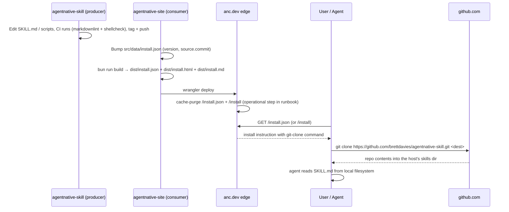

# feat: Publish agent-native-cli skill via dedicated repo and anc.dev install endpoints

## Overview

Ship a single-skill distribution model for `agent-native-cli` (ANC):

1. **Public producer repo `brettdavies/agentnative-skill`** holds the bundle at the repo root. `git clone` directly into
   a host's skills directory IS install.
2. **`anc.dev/install.json`** — canonical, machine-readable install manifest. Lists per-host clone commands, the
   upstream commit pin (advisory, set to producer HEAD at site build time), and metadata (version, description,
   principles_url).
3. **`anc.dev/install`** — HTML rendering of the same JSON for humans. Templated from `/install.json` at build time; one
   source of truth, no drift possible.

The JSON is the install spec. The HTML is a polished render of the JSON. Update path is `git pull` in the install
directory. No marketplace.json, no plugin manifests, no per-tool dot-directories, no install scripts piped from URLs.

**Architecture pivots, 2026-04-24 → 2026-04-27.** Originally drafted around a marketplace.json + universal-manifest
design borrowed from `every-marketplace`/Claude Code plugin machinery. After inspecting `garrytan/gstack`'s install
model, simplified to single-repo direct-clone. After document-review surfaced verify-procedure incoherence, multi-host
coverage gaps, and SoT drift risk, simplified further to **agent-primary** (JSON canonical, HTML rendered from JSON) and
deferred `/skill/<name>` URL pattern entirely to v2. Net result: 7 implementation units → 5, single source of truth, no
per-file SHA pinning, no separate machine-readable surface beyond the install manifest itself. The history of why each
choice was rejected lives in the planning conversation; this document is the current shape.

## Problem Frame

The `agent-native-cli` skill is the north-star standard `anc.dev` exists to communicate. Today it lives privately at
`~/dev/agent-skills/agent-native-cli/`. A human visitor has no friction-free install path; an agent visiting the site
has no native install path at all. The site describes the standard but does not distribute it.

The fix: publish the skill bundle as a public, self-contained, git-cloneable repo, and use `anc.dev` to publish the
canonical install instruction in two presentations (JSON for agents, HTML for humans) sharing one source of truth.

(see origin: `.context/compound-engineering/todos/001-ready-p2-serve-anc-skill-from-endpoint.md`)

## Requirements Trace

- **R1.** A versioned skill bundle exists with documented schema (frontmatter conventions per agentskills.io, `VERSION`
  file at repo root).
- **R2.** `GET https://anc.dev/install.json` returns a structured response any compliant agent can act on without
  re-prompting a human (canonical, machine-readable).
- **R3.** The response carries an advisory upstream commit pin set to producer HEAD at site build time. Verify means
  "your installed clone matches what the site advertised" — a freshness probe, not a reproducibility lock.
- **R4.** The endpoints satisfy the seven `agent-native-cli` principles — bounded responses, structured output,
  actionable errors, etc. The endpoints are their own reference implementation.
- **R5.** Install verified end-to-end on every host advertised in the JSON manifest's `install` map. v1 ships
  claude_code, codex, cursor, opencode; each must have a passing e2e test before release.
- **R6.** No `curl | sh` path is introduced. The only executable is `git`, against a content- addressed GitHub repo.

## Pre-conditions

These are environmental facts the plan assumes — not deliverables.

- **`anc.dev` is in production.** URL pattern (`/install`, `/install.json`) is final.
- **Skill source-of-truth lives at `~/dev/agent-skills/agent-native-cli/`** (private repo on the author's machine) and
  migrates to the new public repo in Unit 1.
- **In-flight CLI repo rename** (`brettdavies/agentnative` → `brettdavies/agentnative-cli`) proceeds independently. This
  plan does not block on it and does not re-name it.

## Scope Boundaries

- **Not** introducing a `curl | sh` installer.
- **Not** serving skill file bytes from `anc.dev` — agents fetch from `github.com/brettdavies/agentnative-skill`.
- **Not** adding D1/KV/R2 bindings; the Worker stays asset-only with content-negotiation headers.
- **Not** changing existing site routes (`/p1`, `/llms.txt`, `/score/<tool>`, etc.).
- **Not** publishing additional skills in v1 — only `agent-native-cli`.
- **Not** shipping a multi-host installer (`install.sh`) or per-host symlink fan-out — agents and humans run the
  per-host clone command from `/install.json`.
- **Not** building a Claude Code plugin marketplace at `anc.dev`.
- **Not** building an upstream-pin drift guard or generator script.
- **Not** shipping a `/skill/<name>` URL pattern in v1. The JSON manifest is the install instruction surface; per-skill
  metadata surfaces are a v2 concern when N>1.

### Deferred to Separate Tasks

- **`/skill/<name>` URL pattern + per-skill JSON manifest** — relevant when a second skill ships.
- **Multi-host install script** detecting installed agent CLIs and symlinking the bundle into each. v1 assumes the user
  runs the right per-host command from `/install.json`.
- **Submission to upstream marketplaces** (e.g., `anthropics/claude-plugins-official`).
- **`docs/solutions/` compounding** of the agent-primary single-skill distribution pattern: post-ship via `/compound`.
- **Codex / Cursor flavor of the ANC skill** — if the seven principles ever benefit from framework-specific variants,
  the durable pattern is a single repo with author-time projections (every-marketplace v3 style) rather than sibling
  repos. Sibling repos would be an emergency hatch only.
- **Refresh of existing site artifacts** that reference the old private path (`STATUS.md`, `docs/DESIGN.md`,
  `docs/VOICE.md`, etc.) — folded into Unit 5.
- **Signed release tags + `git verify-tag`** as a tier-2 verification path. v1 trusts GitHub's commit-SHA durability +
  branch+tag protection; signed tags are belt-and-suspenders for v2.

## Context & Research

### Relevant Code and Patterns

- **gstack's install model** (`garrytan/gstack`, inspected at `~/dev/agent-skills/gstack/`): the canonical reference for
  "single repo IS install dir." gstack ships multiple skills under one repo + a `setup` adapter. Our v1 ships one skill,
  no setup adapter, but the doctrine ("the cloned repo IS what the host loads") is shared.
- **Site Worker entrypoint:** `src/worker/index.ts` (the only router). Routes are content-negotiation + asset serving
  via `env.ASSETS.fetch`. Adding `/install.json` and `/install` is build-time asset emission.
- **Worker headers:** `src/worker/headers.ts` branches on markdown / hashed-asset / HTML. JSON responses need a new
  branch detected by file extension `.json`, not URL prefix (forward-compat with future routes).
- **Subdirectory build pattern:** `src/build/build.mjs` lines 283–305 (the `/score/<tool>` per-entry emission). The
  `/install` + `/install.json` pair follows the same shape.
- **Existing JSON-style endpoints:** none. `/llms.txt`, `/sitemap.xml`, `/robots.txt` are text.
- **Skill bundle source (current location):** `~/dev/agent-skills/agent-native-cli/` (~30 files, ~50 KB).

### Institutional Learnings

- **`docs/solutions/best-practices/cloudflare-workers-static-assets-custom-headers-2026-04-14.md`** — any `_headers`
  file no-ops on Worker-backed responses. All headers in `src/worker/headers.ts`.
- **`docs/solutions/configuration-fixes/wrangler-placement-smart-wrong-for-static-asset-site-2026-04-14.md`** — no
  `placement: smart`. Asset-only stays.
- **Global `~/.claude/CLAUDE.md` SHA-pinning rule** — applies to the upstream commit SHA in `/install.json`. 40-char
  commit hash, not a tag or branch.
- **Cross-repo doctrine** (`cross-repo-artifact-sync-commit-over-fetch-20260420.md`) — applies at the leanest scale:
  site vendors a single string (the upstream commit SHA at site build time).

### External References

- **agentskills.io** ([specification](https://agentskills.io/specification)) — open standard (initial release Dec 2025,
  governed at `github.com/agentskills/agentskills`). Normatively defines per-skill SKILL.md format. 35+ adopters consume
  the same SKILL.md byte-for-byte. Marketplace and packaging out of scope.
- **gstack** (`github.com/garrytan/gstack`) — single-repo direct-clone install model and per-host adapter pattern.
- **`@every-env/compound-plugin@3.x`** (every-marketplace v3) — Claude-format SoT + author-side conversion to per-tool
  projections + install-time CLI for the long tail. Right shape for multi-component plugins; rejected for v1 as
  over-spec for a single skill.
- **Host skill directory paths** (verified at planning time, re-verify in Unit 4): Claude Code
  `~/.claude/skills/<name>/`; Codex `~/.codex/skills/<name>/`; Cursor `~/.cursor/skills/<name>/`; OpenCode
  `~/.config/opencode/skills/<name>/`.

### Slack Context

Not gathered. User did not request Slack search.

## Key Technical Decisions

- **Agent-primary architecture.** `/install.json` is canonical. `/install` HTML is a templated render of `/install.json`
  at build time. One source, two presentations. Eliminates byte-equivalence drift between machine and human surfaces
  because there's only one source.
- **Producer repo: `brettdavies/agentnative-skill`** — public, gstack-style. Bundle lives at the repo root (SKILL.md,
  checklists/, references/, scripts/, templates/). Cloning the repo IS installing the skill. Repo name parallels the
  family naming (`agentnative-spec`, `-cli`, `-site`, `-skill`).
- **Repo-name vs install-dir asymmetry is mitigated by always-explicit destination.** A bare `git clone <url>` would
  produce `agentnative-skill/` directory, but the SKILL.md frontmatter declares `name: agent-native-cli`. To avoid
  host-discovery confusion, the canonical install command in `/install.json` and `/install` ALWAYS includes the
  destination path: `git clone --depth 1 <url> ~/.claude/skills/agent-native-cli`. Documented as a footgun in the
  install page; verified by an e2e test that asserts a bare clone produces the wrong dir name (defensive fail-loud
  check).
- **Install model: `git clone --depth 1` directly into the host's skills dir.** No tmp dirs, no copy step, no install
  script, no `.installed-from` marker. `.git/` stays intact for native `git pull` updates.
- **Update model: `git pull`** runs in the install directory. No site involvement, no API calls, no daemons.
- **Pinning posture: advisory, pin == HEAD.** The manifest's `source.commit` is set to producer HEAD at site build time.
  `git clone --depth 1` naturally lands on HEAD. Verify is a freshness probe: pin == HEAD = installed at the canonical
  version; pin lags HEAD = site needs redeploy. No reproducibility lock — that's deferred to v2 if needed.
- **Single git commit SHA replaces per-file SHAs.** Whole-bundle content-addressing via the git commit. Drift detection
  via the freshness check above.
- **Headers (in `src/worker/headers.ts`, NOT `_headers`)**, detected by **file extension** rather than URL prefix
  (forward-compat with `/skill/<name>` HTML pages in v2):
- For `.json` assets: `Content-Type: application/json; charset=utf-8`, `Cache-Control: public, max-age=300,
  s-maxage=86400, stale-while-revalidate=60`, `Access-Control-Allow-Origin: *`, `X-Robots-Tag: noindex`.
- The Worker's CN-rewrite (`Accept: text/markdown` → `.md` twin) MUST skip `.json` paths explicitly so `Accept:
  text/markdown` against `/install.json` doesn't 404.
- **`/install` HTML is render-only.** No authored markdown source for the install page. The build emitter reads
  `src/data/install.json` and renders both the JSON payload and a human-facing HTML page using a static template + the
  existing unified+rehype pipeline for code-block highlighting.
- **No CORS-open on `/install` HTML.** CORS-open is appropriate for the JSON manifest (machine endpoint, multi-origin
  agents). The HTML page keeps the site's standard headers.
- **All four hosts in v1 manifest, all e2e-verified.** `claude_code`, `codex`, `cursor`, `opencode` install commands
  ship in `/install.json`. R5 requires each to have a passing e2e install test before release. Adding more hosts = small
  follow-up PR per host.

## Open Questions

### Resolved During Planning

- **Skill home repo:** `brettdavies/agentnative-skill` (new public repo).
- **Primary consumer:** agent-primary; `/install.json` canonical, `/install` templated.
- **`/skill/<name>` URL pattern:** deferred to v2 entirely. v1 has only `/install.json`.
- **Pinning:** advisory; pin == HEAD at site build time.
- **Multi-host coverage:** all four hosts (claude_code, codex, cursor, opencode) ship in v1, all e2e-verified.
- **Repo-name asymmetry:** mitigated by always-explicit destination in install command.

### Deferred to Implementation

- **Exact path of the data file.** Recommended: `src/data/install.json` (single file, full v1 manifest,
  hand-maintained). Implementer may pick `src/data/install/manifest.json` if future-proofing for N data files.
- **Whether the HTML render uses a JS template literal or a markdown-with-placeholders template through the unified
  pipeline.** Markdown-template path keeps existing code-highlighting; JS template is simpler. Implementer picks; both
  are forward-compatible.
- **`agentnative-skill` repo's CI scope.** At minimum: markdownlint on SKILL.md and references, shellcheck on scripts.
  Plus the `github-repo-setup` skill defaults applied at repo creation.
- **Whether to verify cursor's actual skill directory path against Cursor 2.5+ docs** at implementation time, or trust
  the planning-time best knowledge. Unit 4 e2e test settles it.

## Output Structure

This plan creates one new repo plus changes in this site repo.

**New producer repo (`brettdavies/agentnative-skill`):**

```text
SKILL.md                       # the skill itself, at the repo root
README.md
LICENSE
CHANGELOG.md
VERSION                        # single-line semver
SECURITY.md                    # vulnerability disclosure channel
.gitattributes                 # * text=auto eol=lf for shell-script line-ending discipline
checklists/
  new-tool.md
references/
  framework-idioms.md
  framework-idioms-other-languages.md
  principles-deep-dive.md
  project-structure.md
  rust-clap-patterns.md
scripts/
  check-compliance.sh
  checks/
    check-p1-non-interactive.sh
    check-p2-structured-output.sh
    check-p3-progressive-help.sh
    check-p4-error-types.sh
    check-p4-exit-codes.sh
    check-p4-process-exit.sh
    check-p4-try-parse.sh
    check-p5-safe-retries.sh
    check-p6-completions.sh
    check-p6-global-flags.sh
    check-p6-sigpipe.sh
    check-p6-timeout.sh
    check-p7-output-clamping.sh
    check-code-env-flags.sh
    check-code-naked-println.sh
    check-code-unwrap.sh
    check-project-dependencies.sh
    _helpers.sh
templates/
  agents-md-template.md
  clap-main.rs
  error-types.rs
  output-format.rs
.github/
  CODEOWNERS                   # @brettdavies on scripts/** for mandatory review before tag
  workflows/
    ci.yml                     # markdownlint + shellcheck
.gitignore
```

**Consumer repo (this repo, `brettdavies/agentnative-site`):**

```text
src/
  build/
    install.mjs                # NEW — emit /install.json + /install + /install.md twin
  data/
    install.json               # NEW — full v1 manifest, hand-maintained, vendored
  worker/
    headers.ts                 # MODIFY — JSON-extension branch
    index.ts                   # MODIFY — skip CN rewrite for .json paths
.github/
  workflows/
    skill-availability.yml     # NEW — daily git ls-remote against producer repo
tests/
  worker.test.ts               # MODIFY — JSON-extension header tests + CN-rewrite skip test
  regression.test.ts           # MODIFY — install.json shape + HTML render parity assertion
  e2e/
    agents.e2e.ts              # MODIFY — 4-host install verification + bare-clone footgun check
docs/
  DESIGN.md                    # MODIFY — document /install + /install.json contracts
  VOICE.md                     # MODIFY — add /install register declaration
AGENTS.md                      # MODIFY — note new endpoints
RELEASES.md                    # MODIFY — append "Skill releases" section
STATUS.md                      # MODIFY — mark todo done, link published skill
```

## High-Level Technical Design

> *This illustrates the intended approach and is directional guidance for review, not implementation
> specification. The implementing agent should treat it as context, not code to reproduce.*

### `/install.json` shape (canonical)

`GET https://anc.dev/install.json`:

```jsonc
{
  "schema_version": 1,
  "type": "agent-skill",
  "name": "agent-native-cli",
  "version": "0.1.0",
  "description": "Build CLI tools that AI agents can operate reliably.",
  "principles_url": "https://anc.dev/p1",
  "license": "MIT",
  "source": {
    "type": "git",
    "url": "https://github.com/brettdavies/agentnative-skill.git",
    "commit": "<40-char SHA — set to producer HEAD at site build time>"
  },
  "install": {
    "claude_code": "git clone --depth 1 https://github.com/brettdavies/agentnative-skill.git ~/.claude/skills/agent-native-cli",
    "codex":       "git clone --depth 1 https://github.com/brettdavies/agentnative-skill.git ~/.codex/skills/agent-native-cli",
    "cursor":      "git clone --depth 1 https://github.com/brettdavies/agentnative-skill.git ~/.cursor/skills/agent-native-cli",
    "opencode":    "git clone --depth 1 https://github.com/brettdavies/agentnative-skill.git ~/.config/opencode/skills/agent-native-cli"
  },
  "verify": {
    "command": "git -C <install-dir> rev-parse HEAD",
    "expected": "<same 40-char SHA as source.commit>",
    "semantics": "advisory freshness probe; mismatch means upstream has moved past the site's pin"
  },
  "update": "cd <install-dir> && git pull --ff-only",
  "uninstall": "rm -rf <install-dir>",
  "install_page_html": "https://anc.dev/install"
}
```

`<install-dir>` is the destination from the matching `install.<host>` command — agents substitute.

### `/install` HTML (rendered from `/install.json`)

Sections, in order:

1. Title + lede
2. **Choose your host** — table mapping host name → install command (from `install.<host>`). Each row has a copy-button.
3. **What this does** — clone repo to host's skills dir; `.git/` preserved for updates.
4. **Already installed?** — recovery path for collision (`cd <dir> && git pull` if it's a prior install of this skill;
   `rm -rf <dir>` and re-clone otherwise).
5. **Update** — `cd <dir> && git pull --ff-only`. Pinning: `git checkout <tag>` after pull.
6. **Uninstall** — `rm -rf <dir>`.
7. **Trust model** — third-person paragraph: piping shell from URL is rejected; install uses git against a
   content-addressed commit at a specific repo. Scripts are open-source and visible at the producer repo before they
   execute on the user's machine.
8. **Verify** — pin freshness check (cosmetic).
9. **Programmatic** — pointer to `/install.json` for agents.

### Data flow



The site is touched once per skill release (to bump `install.json`). Skill content changes never touch the site repo.

## Implementation Units

- [x] **Unit 1: Bootstrap `brettdavies/agentnative-skill` and migrate the bundle**

**Target repo:** `brettdavies/agentnative-skill` (new). **Operator prerequisite:** local clone of the private source at
`~/dev/agent-skills/agent-native-cli/` (author's machine).

**Goal:** Stand up the public producer repo with the bundle, security gates, and basic CI. Migrate via clean-room
re-commit (no private-repo history import).

**Requirements:** R1.

**Dependencies:** None.

**Files:**

- Create: `brettdavies/agentnative-skill` repo via `gh repo create --private` (private staging window). Apply
  `github-repo-setup` skill defaults: branch protection on `main` (force-push disabled, deletion disabled, required CI
  checks), tag protection (no force-push, no deletion on `v*` pattern), CODEOWNERS for `scripts/**`.
- Create at repo root: `SKILL.md`, `README.md`, `LICENSE` (MIT), `CHANGELOG.md`, `VERSION` (`0.1.0`), `SECURITY.md`
  (vulnerability disclosure), `.gitignore`, `.gitattributes` (`* text=auto eol=lf`, `*.sh text eol=lf`).
- Migrate from `~/dev/agent-skills/agent-native-cli/` via clean-room re-commit: `checklists/`, `references/`,
  `scripts/`, `templates/`. Reference the prior internal version in the initial commit message (no `git filter-repo`
  import — avoids leaking private repo paths, branch names, or authorship metadata).
- Create: `.github/CODEOWNERS` requiring `@brettdavies` review on `scripts/**`.
- Create: `.github/workflows/ci.yml` running `markdownlint-cli2` on `*.md` and `shellcheck` on `scripts/**/*.sh`. CI
  must pass for merge to `main` (enforced by branch protection).
- Tag `v0.1.0` (signed if local key is configured; unsigned acceptable for v1).
- After verifying end-to-end install on Claude Code, run `gh repo edit --visibility public` as the FINAL step paired
  with the site PR (Units 2–5) opening.

**Approach:**

- Migration is clean-room: copy files, audit `.md` frontmatter for any private-repo references, re-commit. Do NOT
  preserve git history from the private repo.
- The `github-repo-setup` skill defaults must be confirmed to include force-push prevention and tag protection — name
  them in Unit 1 verification rather than delegating to skill internals.
- Repo stays private until v0.1.0 is tagged and the site's `install.json` is queued for release. Public flip is the
  final coordinated cutover with the site PR.

**Patterns to follow:**

- `garrytan/gstack` repo layout (multi-skill, but same "repo IS install dir" doctrine).
- `agentskills.io` SKILL.md frontmatter conventions.
- `github-repo-setup` skill defaults for brettdavies repos.

**Test scenarios:**

- Happy path: a clean clone produces a directory whose root is the skill bundle (SKILL.md at root, with `checklists/`,
  `references/`, `scripts/`, `templates/` subdirs).
- Happy path: `markdownlint-cli2 *.md references/*.md checklists/*.md` exits zero.
- Happy path: `shellcheck scripts/*.sh scripts/checks/*.sh` exits zero.
- Edge case: a fresh Claude Code session can read `SKILL.md` from `~/.claude/skills/agent-native-cli/` after `git clone
  --depth 1 ... ~/.claude/skills/agent-native-cli`.
- Test expectation: `scripts/check-compliance.sh` is a Rust-CLI checker (requires `Cargo.toml` in target path);
  structural verification is `--help` exits zero, NOT running the checker against the skill repo itself.
- Edge case: branch protection prevents force-push to `main` (verified by attempting and expecting refusal).
- Edge case: tag protection prevents `v0.1.0` tag deletion or move.

**Verification:**

- Repo settings match `github-repo-setup` standards (force-push disabled, tag protection on, CI required, CODEOWNERS for
  `scripts/**`).
- A clean Claude Code session shows the skill in the skill list after the canonical clone command.
- Repo is publicly visible at github.com/brettdavies/agentnative-skill (after the cutover step).

---

- [x] **Unit 2: Site `/install.json` build emitter + Worker JSON-headers branch**

**Goal:** Emit the canonical install manifest from the vendored data file and serve it with appropriate headers.

**Requirements:** R1, R2, R3, R4, R5 (substrate).

**Dependencies:** Unit 1 (the producer repo URL and tag must exist before the manifest references them).

**Files:**

- Create: `src/data/install.json` — full v1 manifest, hand-maintained. Required keys: `schema_version`, `type`, `name`,
  `version`, `description`, `principles_url`, `license`, `source` (with `type`, `url`, `commit`), `install` (per-host
  map), `verify`, `update`, `uninstall`, `install_page_html`.
- Create: `src/build/install.mjs` with:
- `loadInstallData()` — reads + validates `src/data/install.json` (required keys, commit is 40-char hex, `install` map
  non-empty, version is semver). Fails the build with file path
- reason on invalid input.

- `emitInstallJson(data)` — writes `dist/install.json` (stable JSON: keys sorted, two-space indent, trailing newline).
- Modify: `src/build/build.mjs` — call `loadInstallData()` then `emitInstallJson()`.
- Modify: `src/worker/headers.ts` — add a JSON-extension branch (detected by URL ending in `.json`, not URL prefix)
  setting:
- `Content-Type: application/json; charset=utf-8`
- `Cache-Control: public, max-age=300, s-maxage=86400, stale-while-revalidate=60`
- `Access-Control-Allow-Origin: *`
- `X-Robots-Tag: noindex`
- Skip the `Link: <...>; rel="alternate"` and `X-Llms-Txt` headers that the default HTML branch emits (no markdown twin
  for `.json` paths).
- Modify: `src/worker/index.ts` — `Accept: text/markdown` content-negotiation rewrite must skip paths ending in `.json`
  (otherwise `Accept: text/markdown` against `/install.json` rewrites to `/install.md` which doesn't apply).

**Approach:**

- The JSON file IS the source of truth. The build emitter validates and copies; it does not synthesize fields. (Future
  enhancement: emitter could template `verify.expected` from `source.commit`, but for v1 they are co-edited by hand at
  release time.)
- File-extension-based header detection (`.json`) is forward-compat with `/skill/<name>` HTML pages in v2 — URL-prefix
  detection (`^/skill/`) would mis-apply JSON headers there.

**Patterns to follow:**

- `src/build/scorecards.mjs` `loadRegistry` (lines 41–87) for shape validation.
- `src/worker/headers.ts` existing branch structure.

**Test scenarios:**

- Happy path: with valid `src/data/install.json`, build emits `dist/install.json` with all required keys, byte-stable
  across runs (sorted keys, indent).
- Happy path: GET `/install.json` returns the JSON with the headers above.
- Edge case: missing required key in `install.json` fails the build with file path + missing key.
- Edge case: `commit` field that isn't 40-char hex fails the build.
- Edge case: empty `install` map fails the build (R5: at least one host must be advertised).
- Edge case: `Accept: text/markdown` against `/install.json` returns the JSON (no 404 from CN rewrite).
- Edge case: trailing slash on `/install.json/` is handled per existing static-asset rules.
- Edge case: staging host (`*.workers.dev`) keeps `X-Robots-Tag: noindex` (already added by `isStagingHost`).
- Integration: every `install.<host>` value is a valid `git clone --depth 1` invocation with a destination path matching
  the host's skills directory convention.

**Verification:**

- `bun run build` produces `dist/install.json` matching the schema.
- `curl https://anc.dev/install.json` returns valid JSON parseable by `jq`.
- Headers visible via `curl -I` match the spec above.

---

- [x] **Unit 3: Site `/install` HTML rendering (templated from `/install.json`)**

**Goal:** Render a human-facing install page from `/install.json` data plus a static prose template. Preserve site
code-block highlighting via the existing unified pipeline.

**Requirements:** R6 (no curl|sh on the human page either).

**Dependencies:** Unit 2 (`src/data/install.json` must exist and be loaded).

**Files:**

- Modify: `src/build/install.mjs` — add `emitInstallHtml(data)` and `emitInstallMarkdown(data)`.
- Markdown approach: build a markdown string from a static template + per-host install table interpolated from
  `data.install`, with the trust-model paragraph and other prose sections static. Run through the existing
  unified+remark-rehype+shiki pipeline to produce HTML; write the markdown intermediate as `dist/install.md` (twin for
  content-negotiated agents).
- Modify: `src/build/build.mjs` — call `emitInstallHtml()` and `emitInstallMarkdown()` after `emitInstallJson()`.
- Modify: `src/build/sitemap.mjs` — add `/install` to the sitemap (humans index).
- Modify: `src/build/llms.mjs` — add `/install` and `/install.json` entries to `llms.txt` and a section in
  `llms-full.txt`.

**Approach:**

- The HTML template is render-only; no authored markdown source for the install page lives under `content/`. The build
  emitter holds the prose template and interpolates per-host commands from `data.install`.
- Trust-model paragraph wording: VOICE.md Register 1 (third-person, confident verdict, failure mode first). The
  paragraph lives as static prose in the emitter — it doesn't change per release.
- Already-installed handling: render a section showing the recovery path (cd + git pull if same origin; rm -rf +
  re-clone otherwise).

**Patterns to follow:**

- `src/build/render.mjs` for unified+rehype invocation.
- `src/build/llms.mjs` for the per-section header format on the `.md` twin.
- VOICE.md Register 1 (`/install` register declaration is added in Unit 5).

**Test scenarios:**

- Happy path: `bun run build` emits `dist/install.html` and `dist/install.md`; both contain the per-host install
  commands from `data.install` byte-for-byte.
- Happy path: `dist/install.md` contains the canonical command from `data.install.claude_code` exactly (substring match
  — the canonical command is the SoT).
- Happy path: `dist/install.html` contains a code block with the canonical command syntax-highlighted.
- Happy path: `dist/sitemap.xml` includes `/install`.
- Happy path: `dist/llms.txt` includes `/install` and `/install.json`.
- Edge case: changing `data.install.claude_code` propagates to `dist/install.html` and `dist/install.md` on next build
  (no separate edit required).

**Verification:**

- A browser visit to `https://anc.dev/install` renders the page with all per-host commands highlighted.
- `curl -H 'Accept: text/markdown' https://anc.dev/install` returns the markdown twin.
- The clone command on the page matches `/install.json`'s value byte-for-byte.

---

- [x] **Unit 4: Tests + 4-host e2e install verification + synthetic availability probe**

**Goal:** Hold the contract: built artifacts exist, JSON-HTML parity holds, install verified end-to-end on every
advertised host, repo availability monitored daily.

**Requirements:** R2, R3, R4, R5.

**Dependencies:** Units 1 + 2 + 3.

**Files:**

- Modify: `tests/regression.test.ts` — assert `dist/install.json`, `dist/install.html`, `dist/install.md` all exist;
  assert `install.json`'s `install.claude_code` value appears byte-for-byte in `install.html` and `install.md`.
- Modify: `tests/worker.test.ts` — JSON-extension header tests for `/install.json`; CN-rewrite skip test (`Accept:
  text/markdown` against `/install.json` returns JSON not 404); negative test for unrelated `.json` paths.
- Modify: `tests/e2e/agents.e2e.ts` — for EACH host advertised in `install.json`'s `install` map:
- Fetch `/install.json`, extract the host's install command.
- Run the command in a sandboxed temp HOME directory (override `~/.claude`, `~/.codex`, `~/.cursor`,
  `~/.config/opencode` to point at a clean tmpdir).
- Assert SKILL.md exists at the expected install path.
- Assert `git -C <install-dir> rev-parse HEAD` resolves to a 40-char SHA reachable on github.com.
- Assert `git ls-remote --exit-code origin <commit>` succeeds (commit is reachable on the producer's default branch).
- Modify: `tests/e2e/agents.e2e.ts` — bare-clone footgun check: run `git clone --depth 1 <url>` (no destination) and
  assert the resulting directory is named `agentnative-skill` (not the skill name) — confirms the asymmetry mitigation
  matters and the install command's explicit destination is non-optional.
- Create: `.github/workflows/skill-availability.yml` — scheduled daily workflow that runs `git ls-remote
  https://github.com/brettdavies/agentnative-skill.git HEAD` and fails the run on any non-zero exit. Catches
  repo-visibility regressions between e2e runs.

**Approach:**

- Regression-level (fast, no network): structural shape and JSON-HTML byte-equivalence on `dist/`.
- E2E-level (deep-check, network): runs in `deep-check.yml`, NOT the fast `ci.yml` PR gate. Live GitHub `git clone` +
  `git ls-remote`.
- Synthetic probe: independent of CI, runs daily, alerts on visibility regression.
- The e2e clones into a sandboxed HOME — avoids polluting the runner's actual skill directories.

**Patterns to follow:**

- `tests/regression.test.ts` byte-equivalence patterns.
- `tests/e2e/agents.e2e.ts` existing agent-flow tests.

**Test scenarios:**

- Happy path: regression test passes after `bun run build`.
- Happy path: 4-host e2e clones succeed, each lands SKILL.md at the expected per-host path, each pinned commit is
  reachable on github.com.
- Happy path: synthetic probe workflow exits zero against the live repo.
- Edge case: regression test fails when `install.json` and `install.html` disagree on the canonical command.
- Edge case: e2e test fails when GitHub returns 404 for any host's clone (catches repo deletion or visibility
  regression).
- Error path: bare-clone footgun check produces `agentnative-skill/` directory — passes the test (the test ASSERTS the
  asymmetry exists, so the install command MUST always include destination).
- Integration: site PR's CI fails if `install.json`'s `commit` references a SHA not yet pushed to github.com (cross-repo
  deploy ordering check).

**Verification:**

- `bun test` passes locally and in `ci.yml`.
- `deep-check.yml` runs the 4-host e2e suite green against staging.
- The skill-availability workflow runs daily and stays green.

---

- [x] **Unit 5: Documentation + cross-references**

**Goal:** Document the new endpoints, the release procedure, the VOICE register for `/install`, and refresh existing
artifacts that reference the old private path.

**Requirements:** R1 (versioned manifest *documented*).

**Dependencies:** Units 1 – 4.

**Files:**

- Modify: `docs/DESIGN.md` — add §3.X "Skill distribution" describing `/install` (HTML) and `/install.json` (canonical
  machine surface), header contract, JSON schema, and the cache-purge step on release.
- Modify: `docs/VOICE.md` — add `/install` to Surface-Specific Notes: HTML page is mixed-register (Register 2 imperative
  for command sections, Register 1 third-person for the trust-model paragraph). The JSON is data-only, no voice register
  applies.
- Modify: `AGENTS.md` — add a paragraph naming `/install` and `/install.json` with one-line purposes.
- Modify: `RELEASES.md` — append a "Skill releases" section with the four-step procedure:

1. In `agentnative-skill`: edit, commit, tag (`v0.x.y`), push.
2. In `agentnative-site`: bump `src/data/install.json` (version, source.commit).
3. Open a site PR; CI runs the e2e check; deploy after merge.
4. Run cache-purge against `/install` and `/install.json` via Cloudflare cache-purge API (operational step — required
   for security-relevant pin updates within the 24h s-maxage window).

- Modify: `STATUS.md` — mark this todo as done; reference the published skill repo.
- Modify: site README if it references `~/dev/agent-skills/agent-native-cli/`.
- Modify: `.context/compound-engineering/todos/001-ready-p2-serve-anc-skill-from-endpoint.md` — flip status to
  `complete`; add a Work Log entry summarizing the architecture pivots and final shape.

**Approach:**

- Co-locate the JSON schema with `docs/DESIGN.md` (no separate spec file in v1).
- The cache-purge step is operational, not a build-time concern — surface it in the runbook so release engineers know to
  run it.

**Patterns to follow:**

- `docs/DESIGN.md` existing §3.4 / §3.5 for endpoint contract documentation.
- `RELEASES.md` for operational playbooks (no separate `RUNBOOK.md`).

**Test scenarios:**

- Test expectation: none (documentation). `markdownlint-cli2` in CI is the regression gate.

**Verification:**

- A reader who has never seen this work can answer: how do I install the skill, how do I update it, how do I publish a
  new skill release, what's the contract between the producer and the site, what voice register applies to the install
  page.

## System-Wide Impact

- **Interaction graph:** Worker stays asset-only. JSON-extension branch in `headers.ts`. CN-rewrite skip in `index.ts`
  for `.json` paths. No new bindings. No `placement: smart`.
- **Error propagation:** Build-time errors in `install.json` validation must fail the build hard (fail-fast). Same
  posture as `loadRegistry`.
- **State lifecycle risks:** Stale pin is the dominant risk; mitigated by Unit 4's e2e + the daily synthetic probe. At
  runtime there is no mutable state.
- **API surface parity:** `/install.json` is net-new surface. Future skills (when N>1) get `/skill/<name>` per-skill
  manifests; the current schema is forward-compatible.
- **Integration coverage:** R5 requires e2e on every advertised host. v1 = 4 hosts, 4 tests.
- **Unchanged invariants:** All existing routes (`/`, `/p<n>`, `/score/<tool>`, `/llms.txt`, `/sitemap.xml`,
  `/robots.txt`, `/og-image.png`) keep current behavior, headers, and cache policy. The Worker stays asset-only.

## Risks & Dependencies

| Risk                                                                       | Mitigation                                                                                                                                |
| -------------------------------------------------------------------------- | ----------------------------------------------------------------------------------------------------------------------------------------- |
| `agentnative-skill` repo accidentally made private                         | Unit 1 verifies repo settings; Unit 4 daily synthetic probe catches visibility regressions within 24h                                     |
| Force-push or tag rewrite on producer repo                                 | Unit 1 enforces force-push prohibition + tag protection at repo creation; flagged in `github-repo-setup` defaults                         |
| Pinned commit not yet pushed when site PR runs CI                          | Unit 4 cross-repo deploy ordering check fails fast with a clear error message                                                             |
| Stale pin lingers indefinitely                                             | Unit 4 e2e asserts pin reachability; freshness probe (pin == HEAD) is documented; manual bump in runbook                                  |
| Repo-name vs install-dir asymmetry (bare clone produces wrong dir)         | Install command always specifies destination; Unit 4 footgun e2e asserts the asymmetry exists so the explicit destination is non-optional |
| Cache budget masks security-relevant pin updates for up to 24h             | Runbook includes cache-purge step on release; security-class updates require the purge                                                    |
| Shell scripts in producer repo execute on user machines                    | CODEOWNERS for `scripts/**` requires review; CI runs shellcheck; SECURITY.md provides disclosure channel; signed tags deferred to v2      |
| `_headers` file accidentally introduced (no-ops on Worker)                 | Solutions doc forbids; reviewer / linter catches. All header logic in `src/worker/headers.ts`                                             |
| Trust regression: someone proposes `curl https://anc.dev/install.sh \| sh` | Trust-model paragraph on `/install` documents the rejection; PR review catches                                                            |
| Windows host install regressions (line endings, path separators)           | `.gitattributes` enforces `eol=lf` on shell scripts in producer repo; documented as known limitation for v1 (no Windows e2e coverage)     |
| Schema v1 evolves and v2 ships before v1 consumers update                  | Reserved for major-version bumps; emit `Deprecation` header on v1 only when v2 lands. Out of scope for v1                                 |

## Documentation / Operational Notes

- **Skill release procedure** (in `RELEASES.md`):

1. `cd ~/dev/agentnative-skill` — edit, commit, tag `v0.x.y`, push.
2. `cd ~/dev/agentnative-site` — bump `src/data/install.json` (`version` and `source.commit`).
3. PR to `dev`; CI runs e2e to verify pin reachability and 4-host install. Deploy after merge.
4. **Cache-purge** `/install.json` and `/install` via Cloudflare cache-purge API. Required for security-relevant
   updates; recommended for all releases to keep the s-maxage budget honest.

- **User update procedure** (on `/install` page): `cd ~/.claude/skills/agent-native-cli && git pull`. For pinning: `git
  checkout <tag>` after pulling.
- **User collision recovery** (on `/install` page): if `~/.claude/skills/agent-native-cli/` already exists, `cd` into it
  and check `git remote get-url origin`. If it matches the producer URL, `git pull`. If it doesn't, `rm -rf` and
  re-clone — but only after confirming no local changes are at risk.
- **Monitoring:** Cloudflare Worker analytics + the daily skill-availability probe. No new dashboards for v1.
- **Privacy:** the manifests carry no PII; CORS-open is intentional and correct for the JSON manifest. The HTML page
  does not get CORS-open headers.
- **Silent staleness limitation:** users who install once and never `git pull` stay on whatever commit they cloned. v1
  has no notification channel; agents that poll `/install.json` see the current pin. Documented in the install page; v2
  may add a self-check in the bundle.
- **`docs/solutions/` compounding** post-ship via `/compound`:

1. Agent-primary single-skill distribution pattern (JSON canonical, HTML rendered) and when to choose it over
   marketplace machinery.
2. Repo-name vs install-dir asymmetry mitigation via always-explicit destination.

## Sources & References

- **Origin todo:** `.context/compound-engineering/todos/001-ready-p2-serve-anc-skill-from-endpoint.md`
- Related code:
- `src/worker/index.ts`, `src/worker/accept.ts`, `src/worker/headers.ts`
- `src/build/build.mjs`, `src/build/scorecards.mjs`, `src/build/util.mjs`
- `tests/worker.test.ts`, `tests/regression.test.ts`, `tests/e2e/agents.e2e.ts`
- `wrangler.jsonc`, `AGENTS.md`, `docs/DESIGN.md`, `docs/VOICE.md`, `RELEASES.md`
- Related plans:
- `docs/plans/2026-04-23-001-feat-sync-spec-plan.md` (sibling vendoring pattern)
- `docs/plans/2026-04-14-001-feat-v0-scaffold-milestones-plan.md` (Worker scaffold context)
- Related solutions docs:
- `docs/solutions/best-practices/cloudflare-workers-static-assets-custom-headers-2026-04-14.md`
- `docs/solutions/best-practices/byte-equivalence-regression-tests-for-copied-design-artifacts-2026-04-14.md`
- `docs/solutions/configuration-fixes/wrangler-placement-smart-wrong-for-static-asset-site-2026-04-14.md`
- `docs/solutions/architecture-patterns/cross-repo-artifact-sync-commit-over-fetch-20260420.md`
- External:
- [agentskills.io specification](https://agentskills.io/specification) — open standard for SKILL.md format. 35+ adopters
  consume the same SKILL.md byte-for-byte.
- [`garrytan/gstack`](https://github.com/garrytan/gstack) — single-repo direct-clone install model and per-host adapter
  pattern.
- [`@every-env/compound-plugin@3.x`](https://www.npmjs.com/package/@every-env/compound-plugin) — cross-tool plugin
  packaging via author-side conversion. Reviewed and rejected for v1; pattern noted for future multi-component scope.
