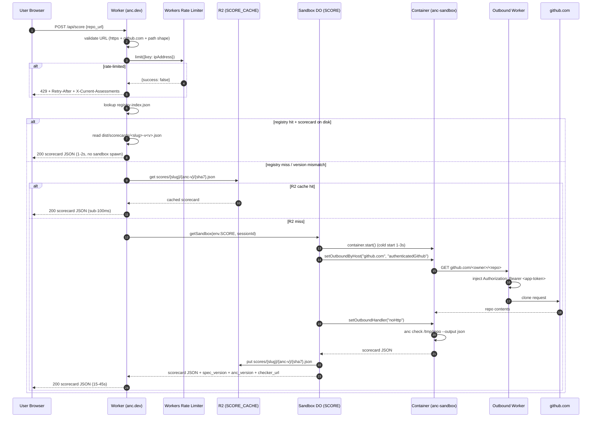

# feat: Live Scoring via Cloudflare Sandbox + Worker (v2)

## Overview

Ship the "paste a GitHub repo URL → get an `anc` scorecard in 15-45s" surface that the Show HN launch positions as the
viral hook. The site is asset-only today; v2 adds the first dynamic Worker route (`/api/score`), the first Durable
Object + Containers + R2 bindings the repo has ever shipped, and a v2 Cloudflare Sandbox image that is a strict superset
of the launch-week batch image at `docker/score/Dockerfile`.

This plan is the Deep follow-on to the 2026-04-17 architectural brainstorm (origin doc) and the 2026-04-17 CEO design.
Both are partially superseded — the CF stack moved (Containers + Sandboxes GA on 2026-04-13, SDK pin shifted to 0.8.x,
TLS interception is now default, Outbound Workers shipped 2026-03-26), and the launch-week image set the Debian-slim +
glibc baseline that the Alpine+musl framing in the CEO design no longer matches. The plan absorbs the brainstorm and
design as inputs and is the authoritative implementation contract going forward.

Live scoring is gated on launch — this work lands after Show HN, not before.

## Problem Frame

The agent-native standard is abstract without evidence. The `anc` linter is invisible without a public surface. The
viral loop is "user pastes their repo URL, gets a 4/7 scorecard with three things to fix, shares it." The leaderboard is
supporting evidence; the live scorer is what gets shared.

Today the Worker (`src/worker/index.ts`) is asset-only: every request is proxied to `env.ASSETS` with one CN branch and
one header-policy layer. There is no DO, no R2, no Containers, no `migrations` block. The launch-week batch image at
`docker/score/Dockerfile` (Debian-trixie-slim + Linuxbrew + uv + bun + cargo-binstall + 100 pre-baked tools + an `anc`
binary baked in) is the foundation v2 inherits.

See origin: [docs/brainstorms/live-scoring-spike.md](../brainstorms/live-scoring-spike.md). Cross-tracker tie-in: the
launch-readiness plan (`docs/plans/2026-04-28-001-feat-show-hn-launch-readiness-plan.md`) explicitly defers live scoring
to this plan.

## Requirements Trace

- **R1. Paste-URL endpoint.** `POST /api/score` accepts a GitHub repo URL, validates it, and returns an `anc`-shaped
  scorecard JSON. Form lives at `/score`. Agent-native twin at `/api/score.md` (markdown via `Accept: text/markdown`)
  and `/api/score.json` extension fast-path.
- **R2. Memoization.** Repeat requests for the same `(repo, anc-version, commit-sha)` triple return from R2 in sub-100ms
  cache hit. Cache key: `scores/{repo-slug}/{anc-version}/{commit-sha7}.json`.
- **R3. Rate limit + abuse prevention.** Workers Rate Limiting binding gates the unknown-tool path. Per-IP
  unauthenticated quota; documented headers so clients can self-govern (SSL Labs pattern).
- **R4. Registry fast path.** When the pasted URL is in `registry.yaml` AND a fresh scorecard exists on disk
  (`scorecards/<name>-v<version>.json`), serve it inline with no sandbox spawn (1-2s).
- **R5. Cost ceiling.** Total infra spend ≤$10/mo at 50 unknown-tool runs/day, ≤$30/mo at 500 runs/day. HN spike (~10k
  runs over 2-4h) ≤$50.
- **R6. Security.** (a) URL validation rejects non-GitHub, non-HTTPS, file://, internal IPs; (b) two-phase egress policy
  — `setOutboundByHost("github.com", "authenticatedGithub")` during clone, then `setOutboundHandler("noHttp")` during
  scoring; (c) GitHub App token injected via Outbound Workers, never visible to the sandbox workload.
- **R7. Agent-native content negotiation.** `/api/score` honors `Accept: text/markdown` (returns rendered scorecard
  markdown), `Accept: application/json` (default), and the `.md` / `.json` URL-suffix twin pattern already used by
  `/install`.

Every scorecard response MUST include `spec_version`, `anc_version`, and `checker_url` (link back to the running
checker) per the SoT contract.

## Scope Boundaries

- v2 covers GitHub-hosted repos only. Bitbucket, GitLab, self-hosted git → not in scope.
- v2 does NOT replace the batch-scoring pipeline; the launch leaderboard is still served from committed
  `scorecards/*.json`. v2 augments with on-demand scoring for not-yet-scored repos.
- v2 does NOT introduce GPU passthrough — current Containers schema does not support it.
- No authenticated-user concept (no GitHub OAuth, no user accounts). Future iteration.

### Deferred to Separate Tasks

- **`/skill/<name>` URL pattern**: separate plan, v2 of skill-distribution. Out of scope here.
- **Launch-week batch scoring**: in flight on `feat/anc100-leaderboard`. The image v2 inherits is being scored now; this
  plan does not re-touch that image.
- **`cf` CLI registry investigation**: confirm whether the `cf` entry recently added to `registry.yaml` is
  Cloudflare-published or third-party (`brettdavies/cf` / community). Separate task — does not block v2.
- **Non-GitHub providers (GitLab, Bitbucket)**: v3 if ever.
- **Score-diff history per repo**: Phase 2 of the live scorer. R2 keying by commit SHA already supports this; the
  query/render path is deferred.

## Context & Research

### Relevant Code and Patterns

- **`src/worker/index.ts`** (~55 LOC). Asset-only today. v2 adds path-prefix branch above the asset call: `if
  (pathname.startsWith('/api/score')) return handleScore(...)`. Keep the asset-first invariant intact.
- **`src/worker/headers.ts`** — pure post-processor. The `.json` branch (`tests/worker.test.ts:156` documents
  forward-compat) already covers CORS `*` + `noindex` + short cache + `application/json` for any `*.json` path.
  `/api/score.json` inherits the right headers for free; `/api/score` (no extension) needs either an `/api/` case in
  `applyHeaders` or direct header setting in the score handler.
- **`src/worker/accept.ts`** — RFC-7231 q-value content negotiation via the `accepts` package. Reuse verbatim for
  `/api/score.md` agent path.
- **`src/build/build.mjs:228-252`** — sub-page loop next to `check`/`about`/`changelog`/`methodology`. The new `/score`
  form page slots in here. Client JS in `src/client/live-score.ts` referenced via `extraScripts: ['/js/live-score.js']`
  (leaderboard pattern at `build.mjs:280`).
- **`src/build/install.mjs` + `src/data/install.json`** — closest architectural precedent: single-source data → emits
  HTML + MD + canonical JSON. `/score` + `/api/score` + `/api/score.md` should follow the same shape.
- **`src/build/scorecards-render.mjs:buildScorecardBody`** — the existing per-tool page renderer. Reuse for the
  live-score result UI so the form page renders the same scorecard shape.
- **`docker/score/Dockerfile`** — launch-week image. Lines 14-17 already document v2 as a strict superset (same base +
  install layers; only the entrypoint stage diverges). v2 adds a `FROM base AS sandbox-runtime` stage that copies in the
  CF Sandbox server binary (`COPY --from=docker.io/cloudflare/sandbox:<pinned> /container-server/sandbox /sandbox`) and
  swaps ENTRYPOINT.
- **`registry.yaml` + `src/build/scorecards.mjs:loadRegistry()`** — the registry → scorecard lookup. Build-time step
  emits `dist/registry-index.json` (mapping `owner/repo` → `tool` entry) for fast Worker-side detection.
- **`tests/worker.test.ts:26 makeEnv`** — stub-env testing pattern. Reusable for stubbing `env.SCORE` (DO),
  `env.SANDBOX` (Containers), `env.SCORE_CACHE` (R2) without `wrangler dev`.

### Institutional Learnings

-

[docs/solutions/architecture-patterns/cf-sandbox-secure-cli-execution-2026-04-17.md](../solutions/architecture-patterns/cf-sandbox-secure-cli-execution-2026-04-17.md)
— THE foundational v2 doc. Prescribes Alpine+musl 100-200MB image. **This plan supersedes the Alpine framing**: v2 stays
glibc + Debian-slim per launch-week constraints. See Key Technical Decisions for the trade-off rationale. -
[docs/solutions/architecture-patterns/cached-theater-live-fallback-2026-04-17.md](../solutions/architecture-patterns/cached-theater-live-fallback-2026-04-17.md)
— two-path split. Known inputs (registry tools) → static JSON, 95%+ traffic, $0 marginal. Unknown inputs → live
container, R2-cached on `(input, version)`. Cost model: 100% cached = $0; 90/10 = ~$2/mo; 50/50 = ~$25/mo. Client-side
"theater": minimum 2s spinner via `Promise.all([fetch, setTimeout(2000)])`. -
[docs/solutions/best-practices/cloudflare-workers-static-assets-custom-headers-2026-04-14.md](../solutions/best-practices/cloudflare-workers-static-assets-custom-headers-2026-04-14.md)
— headers must live in Worker code, not `_headers`. Already the pattern at `src/worker/headers.ts`. -
[docs/solutions/best-practices/account-id-out-of-public-repo-2026-04-14.md](../solutions/best-practices/account-id-out-of-public-repo-2026-04-14.md)
— `account_id` stays out of `wrangler.jsonc`. Already enforced; v2 does not change this. -
[docs/solutions/developer-experience/cloudflare-api-token-headless-wrangler-1password-2026-04-13.md](../solutions/developer-experience/cloudflare-api-token-headless-wrangler-1password-2026-04-13.md)
— mint a v2-scoped CF token: `Workers Scripts: Write` + `Containers: Write` + `Durable Objects: Write` + `R2 Storage:
Write`. -
[docs/solutions/best-practices/versioned-scorecard-filenames-and-non-github-registry-2026-04-20.md](../solutions/best-practices/versioned-scorecard-filenames-and-non-github-registry-2026-04-20.md)
— R2 key includes `anc-version`. An `anc` upgrade auto-invalidates without manual purging. Schema:
`scores/{repo-slug}/{anc-version}/{commit-sha7}.json`. -
[docs/solutions/best-practices/sot-contract-for-spec-repos-with-downstream-consumers-2026-04-22.md](../solutions/best-practices/sot-contract-for-spec-repos-with-downstream-consumers-2026-04-22.md)
— every live `/api/score` response must include `spec_version`, `anc_version`, and a checker link. Trust-and-verify. -
[docs/solutions/best-practices/cross-repo-artifact-consumption-static-sites-2026-04-21.md](../solutions/best-practices/cross-repo-artifact-consumption-static-sites-2026-04-21.md)
— network-free builds. v2 does not build-time fetch from sibling repos. Vendor `coverage-matrix.json` and registry data
into `src/data/`. -
[docs/solutions/logic-errors/accept-header-q-value-parsing-content-negotiation-2026-04-14.md](../solutions/logic-errors/accept-header-q-value-parsing-content-negotiation-2026-04-14.md)
— use the `accepts` package (already in repo) for `/api/score.md` agent path. -
[docs/solutions/best-practices/rust-url-validation-https-only-with-localhost-exception-2026-04-20.md](../solutions/best-practices/rust-url-validation-https-only-with-localhost-exception-2026-04-20.md)
— validate pasted URL at the Worker boundary. HTTPS-only, host allowlist (`github.com`). Reject `file://`, `http://`,
internal IPs. -
[docs/solutions/best-practices/workflow-dispatch-on-deploy-for-recovery-2026-04-14.md](../solutions/best-practices/workflow-dispatch-on-deploy-for-recovery-2026-04-14.md)
— `deploy.yml` must include `workflow_dispatch` with `ref` input. Already present; verify v2 deploys still honor it
after the Container build step is added.

### External References

- [Cloudflare Sandbox SDK — overview](https://developers.cloudflare.com/sandbox/)
- [Sandbox configuration (Wrangler)](https://developers.cloudflare.com/sandbox/configuration/wrangler/)
- [Sandbox Dockerfile reference](https://developers.cloudflare.com/sandbox/configuration/dockerfile/)
- [Outbound traffic guide](https://developers.cloudflare.com/sandbox/guides/outbound-traffic/)
- [Containers pricing](https://developers.cloudflare.com/containers/pricing/)
- [Containers limits + instance types](https://developers.cloudflare.com/containers/platform-details/limits/)
- [Container class lifecycle](https://developers.cloudflare.com/containers/container-class/)
- [R2 pricing](https://developers.cloudflare.com/r2/pricing/)
- [Workers Rate Limiting binding](https://developers.cloudflare.com/workers/runtime-apis/bindings/rate-limit/)
-

[2026-04-13 Sandbox GA + outbound handlers + TLS](https://developers.cloudflare.com/changelog/post/2026-04-13-sandbox-outbound-workers-tls-auth/)

- [2025-11-21 active-CPU pricing](https://developers.cloudflare.com/changelog/post/2025-11-21-new-cpu-pricing/)
-

[2026-03-24 Docker Hub images directly](https://developers.cloudflare.com/changelog/post/2026-03-24-docker-hub-images/)

- [SSL Labs assessment cache + cool-off pattern](https://www.ssllabs.com/about/terms.html) — header-driven concurrency
  (`X-Max-Assessments` / `X-Current-Assessments`), `fromCache` / `startNew` query params, deliberately slow assessments
  as trust signal.
- Internal research synthesis: `docs/research/2026-04-28-cloudflare-live-scoring-v2.md`
- Repo research handoff: `.context/handoffs/2026-04-27-001-live-scoring-v2-research.md`

## Key Technical Decisions

- **Image base: glibc + Debian-trixie-slim, NOT Alpine + musl.** The launch-week batch image at
  `docker/score/Dockerfile` is glibc; the host-built `anc` binary requires GLIBC 2.39 (Debian Trixie ships 2.41).
  Migrating to Alpine forces musl cross-compilation of `anc` AND breaks every prebuilt-binary install path the launch
  image relies on (cargo-binstall, brew bottles, uv wheels) since most upstream tools publish glibc binaries only. The
  Alpine path saves ~3 GB image size at the cost of weeks of toolchain rework. Stay glibc. Image size budget (~3.5-4.5
  GB) fits `standard-1` (8 GB disk) comfortably. Supersedes the Alpine framing in
  [docs/solutions/architecture-patterns/cf-sandbox-secure-cli-execution-2026-04-17.md](../solutions/architecture-patterns/cf-sandbox-secure-cli-execution-2026-04-17.md)
  and the CEO design doc.
- **Sandbox SDK pin: `@cloudflare/sandbox@0.8.x` (≥0.8.9).** Runtime outbound handlers require 0.8.9+. Mirror tag
  exactly in Dockerfile (`COPY --from=docker.io/cloudflare/sandbox:<same-version> ...`) — SDK warns on mismatch.
  Brainstorm's 0.7.0 pin is stale.
- **Instance type: `standard-1` (1/2 vCPU, 4 GiB, 8 GB).** Fits the pre-baked image. Custom instance type (`{ vcpu: 1,
  memory_mib: 4096, disk_mb: 6000 }`) is a follow-up if image stays under 4 GB and we want to trim the memory bill.
  Memory + disk are billed-as-provisioned; CPU active-only.
- **DO + Containers pairing: SQLite-backed DO (`new_sqlite_classes`).** Mandatory for Container DOs; key-value backend
  not supported. One container per DO instance. Keying: `env.SCORE.idFromName(<deterministic-session-id>)`.
- **R2 cache key: `scores/{repo-slug}/{anc-version}/{commit-sha7}.json`.** Includes `anc-version` per the
  versioned-scorecard pattern so `anc` upgrades auto-invalidate. Content-addressed by 7-char commit SHA — never
  invalidated within a version. `?fromCache=false` query param forces re-score (SSL Labs pattern).
- **Two-phase egress (non-negotiable).** Phase 1: `setOutboundByHost("github.com", "authenticatedGithub")` — Outbound
  Worker injects GitHub App token from binding, sandbox workload never sees it. Phase 2: `setOutboundHandler("noHttp")`
  before `anc check` runs. TLS interception is now default (per-instance ephemeral CA, never leaves sidecar).
- **Rate limit primitive: Workers Rate Limiting binding (Option A).** Built-in, no DO scaffold. Counters are
  per-CF-location, not global — fine for abuse protection. Upgrade to a DO-based global counter (Option B) only if
  location-local proves insufficient. Initial config: `simple: { limit: 10, period: 60 }` per IP for the unknown-tool
  path. Registry fast-path is unmetered (it's a static JSON read).
- **Latency budget: 15-45s with live progress for unknown-tool path.** SSL Labs prior art: deliberate slowness is a
  trust signal. Tools that complete in 2s read as superficial. Client renders a progress timeline (clone → install →
  score → render) so the wait feels rigorous, not broken. Registry fast-path stays at 1-2s + 2s minimum theater
  (`Promise.all([fetch, setTimeout(2000)])`) — never below 2s for visual polish.
- **Headers in Worker code, not `_headers`.** Per
  [docs/solutions/best-practices/cloudflare-workers-static-assets-custom-headers-2026-04-14.md](../solutions/best-practices/cloudflare-workers-static-assets-custom-headers-2026-04-14.md).
- **URL validation at Worker boundary.** HTTPS-only. Host allowlist: `github.com` only. Reject `file://`, `http://`,
  internal IPs (RFC1918), `localhost`, `0.0.0.0`. Reject paths that aren't `/{owner}/{repo}` shape. Reject `.git` suffix
  or strip it. Reject query string + fragment.
- **Container image registry: Docker Hub direct (since 2026-03-24).** `image: "docker.io/<ns>/<repo>:<tag>"` in
  `wrangler.jsonc` — no push-to-CF-registry round-trip. Build + push runs in `.github/workflows/deploy.yml` before
  `wrangler deploy`. Image lives at `docker.io/brettdavies/anc-sandbox:<tag>`.
- **Registry-index emission at build time.** `src/build/registry-index.mjs` emits `dist/registry-index.json` (mapping
  `owner/repo` → tool entry) so the Worker can do an O(1) lookup without parsing YAML at request time. YAML parsing in a
  Worker is expensive; precomputed JSON is free.

## Open Questions

### Resolved During Planning

- **Image base (Alpine vs Debian-slim)**: chosen Debian-slim glibc per launch-week constraints. Documented above.
- **SDK pin (0.7.x vs 0.8.x)**: 0.8.x (≥0.8.9). Outbound runtime handlers are non-negotiable for security.
- **Instance type (`basic` vs `standard-1`)**: `standard-1`. `basic` (4 GB disk) does not fit the pre-baked image.
- **Rate limit primitive (binding vs DO)**: Workers Rate Limiting binding for v2. Upgrade later if needed.
- **R2 cache key shape**: `scores/{repo-slug}/{anc-version}/{commit-sha7}.json`. Includes `anc-version`.
- **Container image registry**: Docker Hub direct (post-2026-03-24 capability).
- **Registry-fast-path detection**: precomputed `dist/registry-index.json` at build time.

### Deferred to Implementation

- **Exact `anc check` invocation flags for the live path.** Need to confirm `anc` accepts a clone path + binary path
  simultaneously. The brainstorm assumed `--binary <path>`; verify against `anc --help` at implementation time. If
  absent, add to `agentnative-cli` as a prereq.
- **GitHub App token scope.** `repo:read` is sufficient for public clone. Private repo support is a future iteration;
  for now, public-only is fine and simplifies the threat model.
- **Outbound Worker shape for token injection.** The Outbound Workers API (2026-03-26) lets a Worker function receive
  container HTTP and inject auth headers. Concrete Worker code is implementation-time; design intent is "container makes
  unauthenticated git request, Worker adds `Authorization: Bearer <app-token>` from a binding."
- **Polling vs streaming for progress.** Initial design is client polling `/api/score?session=<id>` every 2s. WebSocket
  / SSE upgrade is deferred unless polling proves to be too chatty.
- **Concurrency semantics during HN spike.** `max_instances: 10` is the initial cap; if the spike sustains we raise.
  Containers concurrent limits (1,500 `standard-1` per account) are well above any realistic spike.
- **Whether `/api/score` exposes `fromCache=false` to all callers or only authenticated.** SSL Labs exposes it publicly
  with the cool-off — start there, tighten if abuse seen.

## Output Structure

```text
docker/
  sandbox/                          # NEW — v2 image variant (strict superset of docker/score/)
    Dockerfile                      # FROM base (shared layers) + sandbox-runtime stage
    README.md                       # build + push instructions, registry pin, troubleshooting
src/
  build/
    registry-index.mjs              # NEW — emits dist/registry-index.json at build time
  client/
    live-score.ts                   # NEW — form submit + fetch + 2s theater + progress polling
  worker/
    index.ts                        # MODIFIED — adds /api/score path-prefix branch
    score/                          # NEW — Worker-side score handler module
      handler.ts                    # /api/score route entry; URL validate + cache lookup + DO route
      validate.ts                   # URL validation (HTTPS, github.com, RFC1918 reject)
      registry-lookup.ts            # registry-index.json hit-test
      cache.ts                      # R2 read/write keyed by scores/{slug}/{anc-version}/{sha7}.json
      do.ts                         # Sandbox DO class (extends Sandbox); session lifecycle
      sandbox-exec.ts               # two-phase egress + anc check + result parsing
      outbound-handler.ts           # GitHub token injection via Outbound Worker
      content-negotiation.ts        # /api/score.md vs /api/score.json branching
dist/
  registry-index.json               # NEW — emitted artifact (gitignored)
  score.html                        # NEW — paste-URL form page
  score.md                          # NEW — markdown twin of /score
  js/
    live-score.js                   # NEW — bundled output of src/client/live-score.ts
tests/
  worker.test.ts                    # MODIFIED — adds /api/score branch tests
  score-handler.test.ts             # NEW — unit tests for score/handler.ts
  score-validate.test.ts            # NEW — URL validation table
  score-cache.test.ts               # NEW — R2 cache read/write
  e2e/
    score.e2e.ts                    # NEW — Playwright form-submit happy path (chromium project)
    score-live.e2e.ts               # NEW — opt-in live sandbox project (excluded from default suite)
docs/
  plans/
    2026-04-28-002-feat-live-scoring-cf-sandbox-plan.md  # this file
wrangler.jsonc                      # MODIFIED — adds containers, durable_objects, migrations,
                                    #   r2_buckets, ratelimits bindings (parallel for env.staging)
.github/workflows/
  deploy.yml                        # MODIFIED — adds docker build + push step before wrangler deploy
```

## High-Level Technical Design

> *This illustrates the intended approach and is directional guidance for review, not implementation specification.
> The implementing agent should treat it as context, not code to reproduce.*



The shape: Worker is the gatekeeper (validate, rate-limit, registry-lookup, R2-lookup). DO + Sandbox is the heavy-lift
fallback. Outbound Worker is the security primitive that keeps the GitHub App token off the sandbox workload. R2 is the
memoization layer. Registry-fast-path serves from a static asset (the JSON committed alongside the registry);
cache-fast-path serves from R2; cold-path spins the sandbox.

## Implementation Units

- [ ] **Unit 1: Build-time registry index emission**

**Goal:** Emit `dist/registry-index.json` at build time — a precomputed map from `owner/repo` (and canonical URL) to the
tool entry. Pure build-step change; no CF dependencies.

**Requirements:** R4 (registry fast path).

**Dependencies:** None.

**Files:**

- Create: `src/build/registry-index.mjs`
- Modify: `src/build/build.mjs` (insert step after `loadRegistry` near `build.mjs:228-252`)
- Test: `tests/registry-index.test.ts`

**Approach:**

- Read `registry.yaml` via existing `loadRegistry()` (`src/build/scorecards.mjs`).
- For each tool, derive the GitHub `owner/repo` (from `repo:` field, or parse from `url:`).
- Emit `dist/registry-index.json` with shape `{ "owner/repo": { name, binary, version, language, ... } }`.
- Add to `dist/sitemap.xml`? No — it's an internal lookup, not a user URL.
- Add to regression tests so changes to `registry.yaml` are reflected.

**Patterns to follow:**

- `src/build/install.mjs` — single-source data → emits canonical JSON. Same pattern.

**Test scenarios:**

- Happy path: registry with 3 tools → `registry-index.json` has 3 entries keyed by `owner/repo`.
- Edge case: tool with `url:` only (no `repo:`) → entry keyed by parsed `owner/repo` from URL.
- Edge case: tool with neither `repo:` nor `url:` → entry skipped, build warning emitted (not a failure).
- Edge case: two tools with same `owner/repo` (fork) → second wins, build warning.
- Integration: `dist/registry-index.json` exists after `bun run build`; regression test asserts presence.

**Verification:** `bun run build` produces `dist/registry-index.json` with one entry per scorable tool;
`tests/regression.test.ts` includes a structural assertion on the index shape.

- [ ] **Unit 2: v2 sandbox image (Dockerfile superset)**

**Goal:** Build `docker/sandbox/Dockerfile` as a strict superset of `docker/score/Dockerfile`. Same base + same install
layers (1-7); divergent entrypoint stage that copies the CF Sandbox server binary.

**Requirements:** R5 (cost ceiling — image must fit `standard-1`), R6 (security — sandbox binary controls egress).

**Dependencies:** None (parallel with Unit 1). Launch-week batch image must be stable first.

**Files:**

- Create: `docker/sandbox/Dockerfile`
- Create: `docker/sandbox/README.md`
- Test: `tests/dockerfile-superset.test.ts` (asserts shared-layer SHA equivalence with `docker/score/Dockerfile` via a
  parsed-Dockerfile comparison)

**Approach:**

- Multi-stage. First stage `FROM base` reuses lines 44-124 of `docker/score/Dockerfile` byte-identically (consider
  extracting shared layers to `docker/base/Dockerfile.shared` and `INCLUDE`-ing — or, simpler, just copy and add a test
  that diffs the two). Default to copy + diff-test, refactor only if drift occurs.
- New stage `FROM base AS sandbox-runtime`:
- `COPY --from=docker.io/cloudflare/sandbox:<pinned-0.8.x> /container-server/sandbox /sandbox`.
- ENTRYPOINT `["/sandbox"]`. The container-server handles all Sandbox SDK protocol; our workload is `anc check` invoked
  via `sandbox.exec()` from the Worker.
- Image size goal: ≤4.5 GB (fits `standard-1` 8 GB disk with headroom).
- Pin Cloudflare sandbox tag exactly to the npm SDK version; SDK warns on mismatch.

**Patterns to follow:**

- `docker/score/Dockerfile:14-17` — the v2-aware comment header.
-

[docs/solutions/architecture-patterns/cf-sandbox-secure-cli-execution-2026-04-17.md](../solutions/architecture-patterns/cf-sandbox-secure-cli-execution-2026-04-17.md)
— overall structure (NOT the Alpine/musl base — superseded).

**Test scenarios:**

- Happy path: `docker build -f docker/sandbox/Dockerfile .` succeeds, resulting image runs and `/sandbox` responds to
  health check.
- Edge case: shared layers in `docker/sandbox/Dockerfile` byte-equal the corresponding lines in
  `docker/score/Dockerfile` (drift test).
- Edge case: image size ≤5 GB (regression assertion).
- Integration: image runs in `wrangler dev --local` mode; `sandbox.exec("anc --version")` returns the baked-in version.

**Verification:** Image builds, fits `standard-1`, runs `anc --version` via the Sandbox SDK. README documents the
build-and-push workflow.

- [ ] **Unit 3: wrangler.jsonc — DO + Containers + R2 + ratelimits bindings**

**Goal:** Add the first DO + Containers + R2 + ratelimits bindings the repo has ever shipped. This is a one-way
migration gate.

**Requirements:** R1 (endpoint), R2 (memoization), R3 (rate limit). Foundational for Units 4-7.

**Dependencies:** Unit 2 (image must exist for Containers binding to reference).

**Files:**

- Modify: `wrangler.jsonc` (top-level + `env.staging` parallel bindings)
- Modify: `src/worker-configuration.d.ts` (regenerated via `bun run types`)
- Modify: `package.json` (verify `bun run types` runs `wrangler types`)
- Test: regression check that `wrangler deploy --dry-run` succeeds

**Approach:**

- Add to top-level `wrangler.jsonc`:
- `containers: [{ class_name: "Sandbox", image: "docker.io/brettdavies/anc-sandbox:<tag>", instance_type: "standard-1",
  max_instances: 10 }]`
- `durable_objects: { bindings: [{ class_name: "Sandbox", name: "SCORE" }] }`
- `migrations: [{ tag: "v1", new_sqlite_classes: ["Sandbox"] }]` — must be `new_sqlite_classes`, not legacy
  `new_classes`.
- `r2_buckets: [{ binding: "SCORE_CACHE", bucket_name: "anc-score-cache" }]`
- `ratelimits: [{ name: "SCORE_LIMITER", namespace_id: "1001", simple: { limit: 10, period: 60 } }]`
- Mirror all bindings in `env.staging` with staging-suffixed bucket name + DO namespace so prod traffic isn't poisoned:
  `anc-score-cache-staging` etc.
- Migrations array is the ONE-WAY gate. First deploy creates the DO class. Plan documents the rollback procedure (a
  follow-up migration to delete the class) in the Operational Notes section.
- Account for the 2026-03-24 Docker Hub support: `image:` accepts `docker.io/...` directly.

**Patterns to follow:**

-

[docs/solutions/best-practices/account-id-out-of-public-repo-2026-04-14.md](../solutions/best-practices/account-id-out-of-public-repo-2026-04-14.md)
— `account_id` stays out of the file.

- [docs/research/2026-04-28-cloudflare-live-scoring-v2.md](../research/2026-04-28-cloudflare-live-scoring-v2.md) §2 —
  verified Wrangler syntax for Containers bindings.

**Test scenarios:**

- Happy path: `wrangler deploy --dry-run` exits 0 with the new bindings.
- Happy path: `bun run types` regenerates `src/worker-configuration.d.ts` to expose `SCORE`, `SANDBOX`, `SCORE_CACHE`,
  `SCORE_LIMITER` on `Env`.
- Integration: staging deploy succeeds; staging Worker's bindings are distinct from prod (different DO namespace ID,
  different R2 bucket).

**Verification:** Both prod and staging deploys succeed; type generation includes all four new bindings; the migrations
entry is recorded as v1 (visible in `wrangler deployments list` after the first deploy).

- [ ] **Unit 4: Worker `/api/score` route handler**

**Goal:** Add the `/api/score` path-prefix branch in `src/worker/index.ts`. URL validate → rate limit → registry-index
lookup → R2 cache lookup → DO route. Returns scorecard JSON.

**Requirements:** R1 (endpoint), R3 (rate limit), R4 (registry fast path), R6 (URL validation), R7 (content
negotiation).

**Dependencies:** Unit 1 (registry-index), Unit 3 (bindings).

**Files:**

- Modify: `src/worker/index.ts`
- Create: `src/worker/score/handler.ts`
- Create: `src/worker/score/validate.ts`
- Create: `src/worker/score/registry-lookup.ts`
- Create: `src/worker/score/cache.ts`
- Create: `src/worker/score/content-negotiation.ts`
- Test: `tests/worker.test.ts` (new `describe('/api/score …')` block)
- Test: `tests/score-handler.test.ts`
- Test: `tests/score-validate.test.ts`
- Test: `tests/score-cache.test.ts`

**Approach:**

- In `src/worker/index.ts.fetch`, add path-prefix branch above the asset call: `if (pathname.startsWith('/api/score'))
  return handleScore(request, env);`. Keeps asset-first invariant.
- `validate.ts`: URL must be `https://github.com/{owner}/{repo}` (optional `.git` suffix, stripped). Reject all else.
  Return `400` with `{error: "invalid_url", details}` on miss.
- Rate limit: `await env.SCORE_LIMITER.limit({ key: ipAddress })`. On `success: false` return `429` with `Retry-After:
  60` and `X-Current-Assessments`/`X-Max-Assessments` headers (SSL Labs pattern).
- `registry-lookup.ts`: fetch `dist/registry-index.json` via `env.ASSETS.fetch(...)` (it's a static asset). Cache the
  parsed map in module scope for the isolate's lifetime. On hit, fetch `dist/scorecards/<name>-v<version>.json` and
  return inline.
- `cache.ts`: On registry miss, compute key `scores/{owner-repo}/{anc-version}/{sha7}.json` and check
  `env.SCORE_CACHE.get(key)`. Hit → return. Miss → fall through to DO.
- `content-negotiation.ts`: `Accept: text/markdown` or `.md` extension → return rendered scorecard markdown. `Accept:
  application/json` or default → JSON. Reuse `src/worker/accept.ts:detectPreference`.
- All responses include `spec_version`, `anc_version`, `checker_url` per the SoT contract.
- `?fromCache=false` query bypasses R2 and forces a DO/sandbox round-trip.

**Patterns to follow:**

- `src/worker/index.ts` branch shape (asset-first invariant).
- `src/worker/headers.ts` — add `/api/` case to `isJson()` so existing JSON header policy applies.
-

[docs/solutions/best-practices/rust-url-validation-https-only-with-localhost-exception-2026-04-20.md](../solutions/best-practices/rust-url-validation-https-only-with-localhost-exception-2026-04-20.md)
— URL validation rules (HTTPS, host allowlist, reject internal IPs). -
[docs/solutions/logic-errors/accept-header-q-value-parsing-content-negotiation-2026-04-14.md](../solutions/logic-errors/accept-header-q-value-parsing-content-negotiation-2026-04-14.md)
— `accepts` package usage pattern.

**Test scenarios:**

- Happy path (registry hit): `POST /api/score {repo_url:"https://github.com/BurntSushi/ripgrep"}` → 200, scorecard
  matches `dist/scorecards/ripgrep-v<v>.json`. Latency ≤2s in test (no real sandbox, just static read).
- Happy path (R2 hit): repo not in registry but in R2 cache → 200, scorecard from R2.
- Happy path (R2 miss): repo not in registry, not in R2 → DO route stub asserts called.
- Edge case: URL with `.git` suffix → normalized.
- Edge case: URL with query string → rejected as `invalid_url`.
- Edge case: URL with branch (`/tree/main`) → rejected (URL-paste flow targets default branch only).
- Error path: non-HTTPS → 400.
- Error path: non-github.com → 400.
- Error path: localhost / 127.0.0.1 / 192.168.x.x / 10.x.x.x → 400.
- Error path: rate-limited → 429 with `Retry-After`.
- Integration: `Accept: text/markdown` → markdown response with same `spec_version` / `anc_version` / `checker_url`.
- Integration: `?fromCache=false` bypasses R2, even on hit.
- Integration: response headers include CORS `*`, `noindex`, short cache (verified via the existing
  `tests/worker.test.ts:156` JSON-extension forward-compat path).

**Verification:** All test scenarios pass. `tests/worker.test.ts` describes both registry-hit and registry-miss paths.
URL validation matrix is exhaustive.

- [ ] **Unit 5: Sandbox-side scoring logic (DO + container exec)**

**Goal:** Implement the Sandbox DO class and the two-phase egress + `anc check` flow inside the container.

**Requirements:** R1, R5 (cost ceiling — bounded execution time), R6 (two-phase egress), R7 (response shape).

**Dependencies:** Unit 2 (image), Unit 3 (bindings), Unit 4 (Worker routes to DO).

**Files:**

- Create: `src/worker/score/do.ts`
- Create: `src/worker/score/sandbox-exec.ts`
- Create: `src/worker/score/outbound-handler.ts`
- Test: `tests/score-do.test.ts` (unit tests with stubbed `Container` + `getSandbox`)

**Approach:**

- `do.ts`: Sandbox DO class extends the Sandbox base class. Implements `score(repoUrl)` RPC method.
- `sandbox-exec.ts` orchestrates:

1. Generate `sessionId` from `crypto.randomUUID()`.
2. `getSandbox(env.SCORE, sessionId, { sleepAfter: "5m" })` (shorter than default 10m to release resources faster).
3. `sandbox.setOutboundByHost("github.com", "authenticatedGithub")` — Phase 1.
4. `sandbox.exec("git clone --depth 1 https://github.com/<owner>/<repo> /tmp/repo")`. Capture commit SHA from `git
   rev-parse HEAD`.
5. `sandbox.setOutboundHandler("noHttp")` — Phase 2.
6. Look up registry tool by `owner/repo`. If known, run `anc check --command /tmp/repo/target/release/<binary> --output
   json`; if unknown, run source-only `anc check /tmp/repo --output json`. Confirm exact `anc` invocation flags at
   implementation time.
7. Parse JSON. Add `spec_version`, `anc_version`, `checker_url`.
8. Return scorecard. DO writes-through to R2 (Unit 6).

- `outbound-handler.ts`: implements the Worker function that intercepts container egress, injects `Authorization: Bearer
  <github-app-token>` from a binding, forwards to `github.com`. Token lives in `env.GITHUB_APP_TOKEN` (Workers secret),
  never visible to the sandbox process.
- Total budget: 60s timeout on `sandbox.exec()`. Hard fail beyond — return 504 to user.

**Patterns to follow:**

- [docs/research/2026-04-28-cloudflare-live-scoring-v2.md](../research/2026-04-28-cloudflare-live-scoring-v2.md) §5 —
  Outbound Workers + named handlers + runtime API.
-

[docs/solutions/architecture-patterns/cf-sandbox-secure-cli-execution-2026-04-17.md](../solutions/architecture-patterns/cf-sandbox-secure-cli-execution-2026-04-17.md)
— two-phase egress design.

**Test scenarios:**

- Happy path: known-tool repo → clone + bin score → JSON returned. Stubbed sandbox; assert two `setOutbound*` calls in
  correct order.
- Happy path: unknown-tool repo → clone + source-only score → JSON returned with `binary: null`.
- Edge case: clone fails (404 repo) → DO returns `{error: "clone_failed", status: 404}` to Worker; Worker returns 404 to
  user.
- Edge case: `anc check` exits non-zero with a parseable error JSON → preserve and forward.
- Error path: 60s timeout → DO returns `{error: "timeout"}` to Worker; Worker returns 504.
- Error path: `setOutboundHandler` call fails → DO returns 500; user-visible error message scrubs internals.
- Integration: response includes `spec_version`, `anc_version`, `checker_url`.
- Integration: GitHub App token never appears in `sandbox.exec()` stdout/stderr (assert via stubbed exec capture).

**Verification:** Two-phase egress is provably enforced (test asserts the second handler call is `noHttp` BEFORE `anc
check` is exec'd). Token never leaks to sandbox. Timeout is honored.

- [ ] **Unit 6: R2 cache (read on hit, write on miss)**

**Goal:** R2 read on every cache-fast-path; R2 write on every successful sandbox round-trip. Key:
`scores/{owner-repo}/{anc-version}/{sha7}.json`.

**Requirements:** R2 (memoization), R5 (cost ceiling — repeat runs ~free).

**Dependencies:** Unit 3 (R2 binding), Unit 5 (DO produces scorecard).

**Files:**

- Modify: `src/worker/score/cache.ts` (extend Unit 4 stub)
- Modify: `src/worker/score/sandbox-exec.ts` (write-through after success)
- Test: `tests/score-cache.test.ts` (extend Unit 4 stub)

**Approach:**

- `get(key)`: `await env.SCORE_CACHE.get(key, "json")`. Null → miss.
- `put(key, scorecard)`: `await env.SCORE_CACHE.put(key, JSON.stringify(scorecard), { httpMetadata: { contentType:
  "application/json", cacheControl: "public, max-age=86400, s-maxage=86400" } })`.
- Key includes `anc-version` per
  [docs/solutions/best-practices/versioned-scorecard-filenames-and-non-github-registry-2026-04-20.md](../solutions/best-practices/versioned-scorecard-filenames-and-non-github-registry-2026-04-20.md)
  so `anc` upgrades auto-invalidate.
- Custom domain on the bucket → CDN-cacheable via Smart Tiered Cache (auto-enabled for R2 origins since 2024-11-20).
  Sub-50ms cache hits at the edge.
- `?fromCache=false` query param skips R2 read but does not skip R2 write.

**Patterns to follow:**

- [docs/research/2026-04-28-cloudflare-live-scoring-v2.md](../research/2026-04-28-cloudflare-live-scoring-v2.md) §7 — R2
  caching strategy.

**Test scenarios:**

- Happy path: write then read → matches.
- Happy path: read on miss → null.
- Edge case: very large scorecard (10 MB hypothetical) → succeeds (R2 has no realistic per-object cap for our scorecards
  which are <100 KB).
- Edge case: `anc-version` change → cache miss for old key (assert via stubbed env).
- Error path: R2 write fails (network) → DO logs but does not fail the request — user still gets a result, cache is
  best-effort.
- Integration: full round-trip — first request misses cache, sandbox runs, writes; second identical request hits cache,
  no sandbox spawn, sub-100ms total.

**Verification:** Cache hits eliminate sandbox spawns for repeat queries. R2 write failures do not block user responses.
Key shape includes `anc-version`.

- [ ] **Unit 7: Rate limiting (Workers Rate Limiting binding)**

**Goal:** Per-IP rate limit on the unknown-tool sandbox path. Registry fast-path is not rate-limited (it's a
static-asset read).

**Requirements:** R3 (rate limit + abuse prevention).

**Dependencies:** Unit 3 (binding), Unit 4 (handler).

**Files:**

- Modify: `src/worker/score/handler.ts` (call `env.SCORE_LIMITER.limit` before sandbox path)
- Test: `tests/score-rate-limit.test.ts`

**Approach:**

- Inside `handler.ts`, AFTER URL validation but BEFORE registry-lookup: call `await env.SCORE_LIMITER.limit({ key:
  <ipAddress> })`. Get IP from `request.headers.get("CF-Connecting-IP")`.
- On `success: false` return `429` with:
- `Retry-After: 60`
- `X-Max-Assessments: 10`
- `X-Current-Assessments: <count>` (best-effort; binding doesn't expose count, so emit cap as ceiling)
- Body: `{error: "rate_limited", retry_after_seconds: 60}`
- Initial config: `simple: { limit: 10, period: 60 }` per IP. Tunable via the wrangler.jsonc namespace.
- Counters are per-CF-location (not global). Acceptable for abuse protection; if a single attacker rotates through PoPs,
  upgrade to a DO-based global counter (Option B from the research).

**Patterns to follow:**

- SSL Labs header pattern (X-Max-Assessments / X-Current-Assessments + cool-off).

**Test scenarios:**

- Happy path: first 10 requests in 60s → 200. 11th → 429 with `Retry-After: 60`.
- Happy path: registry-fast-path requests are NOT rate-limited (assert via stubbed limiter not called).
- Edge case: missing `CF-Connecting-IP` → fall back to `request.headers.get("x-forwarded-for")` or sentinel; log but
  don't reject.
- Error path: 429 response body shape matches the documented schema.
- Integration: rate-limit reset after 60s — 11th request at t=61 returns 200.

**Verification:** Sandbox path is rate-limited, registry path is not. 429 responses include `Retry-After` and
informative headers.

- [ ] **Unit 8: Site-side UX (`/score` form page + client JS)**

**Goal:** A user-facing page at `/score` with a paste-URL form, 2s minimum theater, progress polling, scorecard render.
Markdown twin at `/score.md`.

**Requirements:** R1 (endpoint), R7 (agent-native CN — `/score.md`).

**Dependencies:** Unit 4 (`/api/score` exists).

**Files:**

- Create: `src/build/score-page.mjs` (or fold into `build.mjs` sub-page loop)
- Create: `src/client/live-score.ts` (form submit + fetch + theater + render)
- Modify: `src/build/build.mjs` (add `/score` to sub-page loop near `build.mjs:228-252`)
- Modify: `dist/sitemap.xml` builder (add `/score`)
- Test: `tests/e2e/score.e2e.ts` (Playwright, chromium project)
- Test: `tests/e2e/score-live.e2e.ts` (opt-in live sandbox project, excluded from default suite — mirrors the `install`
  project's exclusion pattern)

**Approach:**

- `/score` HTML: form with single URL input + submit button. Below: a progress timeline (4 steps: validate, clone,
  install, score) that fills in as polling returns intermediate states. Below that: scorecard render area (initially
  empty).
- Client JS: on submit, `Promise.all([fetch('/api/score', {method:'POST', body:{repo_url}}), new Promise(r =>
  setTimeout(r, 2000))])`. Minimum 2s spinner per
  [docs/solutions/architecture-patterns/cached-theater-live-fallback-2026-04-17.md](../solutions/architecture-patterns/cached-theater-live-fallback-2026-04-17.md).
- For the unknown-tool path that takes 15-45s, implement progress polling: server-side, the DO writes session state to
  R2 under `sessions/{sessionId}.json` with `phase: clone|install|score`. Client polls `/api/score?session=<id>` every
  2s. Initial implementation: fake-progress (timer-driven on client) is acceptable while real polling is wired up.
- Render scorecard via a client-side adaptation of `src/build/scorecards-render.mjs:buildScorecardBody`. The render
  function should be made isomorphic (run on server during build, run on client for live results) — this is the
  long-tail refactor and may need a follow-up.
- `/score.md` is a static markdown twin describing the form (not interactive), pointing agents to `/api/score` as the
  actual API endpoint.

**Patterns to follow:**

- `src/build/install.mjs` + `src/data/install.json` — single-source data → HTML + MD + JSON.
- `build.mjs:280` — `extraScripts: ['/js/live-score.js']` pattern for leaderboard-style client JS injection.
-

[docs/solutions/architecture-patterns/cached-theater-live-fallback-2026-04-17.md](../solutions/architecture-patterns/cached-theater-live-fallback-2026-04-17.md)
— 2s minimum theater.

**Test scenarios:**

- Happy path (Playwright chromium): paste a known-tool URL → form spinner shows for ≥2s → scorecard renders.
- Happy path: paste an invalid URL → form shows inline error from `/api/score` 400 response.
- Edge case: paste a non-GitHub URL → inline error, no network round-trip beyond the validation 400.
- Edge case: 429 response → form shows "Try again in 60s" message with countdown.
- Integration (live sandbox project, opt-in): paste a real unknown repo → progress timeline animates → scorecard renders
  within 60s.
- Integration: `/score.md` markdown twin is in sitemap and renders agent-friendly description.

**Verification:** Default Playwright suite (chromium) covers the form happy path with mocked `/api/score`. The opt-in
`score-live` Playwright project covers a real sandbox round-trip (excluded from default suite, runs manually + nightly).

- [ ] **Unit 9: Tests (worker route + sandbox integration + e2e)**

**Goal:** Consolidate test coverage. Worker route tests live alongside Unit 4. Sandbox integration tests live alongside
Unit 5. E2E tests live alongside Unit 8. This unit is for the cross-cutting bits: regression assertions, contract
assertions, smoke tests in CI.

**Requirements:** All R1-R7 verifiable via tests.

**Dependencies:** Units 4, 5, 6, 7, 8.

**Files:**

- Modify: `tests/regression.test.ts` (add `/api/score` schema assertion, registry-index.json shape, scorecard response
  includes `spec_version`/`anc_version`/`checker_url`)
- Modify: `tests/build.test.ts` (assert `dist/registry-index.json` exists)
- Create: `tests/score-contract.test.ts` (cross-validates `/api/score` JSON ↔ committed `scorecards/*.json` ↔
  `dist/registry-index.json`)
- Test files for Units 1, 4, 5, 6, 7, 8 are owned by those units.

**Approach:**

- Regression: `/api/score` response shape = `{ schema_version, spec_version, anc_version, checker_url, ...scorecard }`.
  All four keys mandatory.
- Regression: `registry-index.json` contains every `tools[].name` from `registry.yaml`.
- Cross-validation: every `dist/scorecards/<name>-v<v>.json` is reachable via `/api/score` registry-fast-path (stubbed
  Worker, no real sandbox).
- CI: add a smoke step in `.github/workflows/deploy.yml` that hits `/api/score` against a pinned known-tool URL after
  each staging deploy; fail the deploy if it returns non-200 or missing `anc_version`.

**Patterns to follow:**

- `tests/regression.test.ts` (282 LOC) — hash-based contracts, structural assertions.
- `tests/worker.test.ts:26 makeEnv` — stub-env pattern.

**Test scenarios:**

- Contract: `/api/score` response is valid against the documented schema.
- Contract: `dist/registry-index.json` is in sync with `registry.yaml`.
- Smoke (CI, post-deploy): staging `/api/score` for `BurntSushi/ripgrep` returns 200 + valid scorecard.

**Verification:** Full `bun test` + `playwright test` (chromium project) passes locally and in CI. Smoke test runs on
every staging deploy.

- [ ] **Unit 10: Documentation + RELEASES.md update + monitoring runbook**

**Goal:** Document the new system. Update RELEASES.md with v2 release procedure. Create a monitoring runbook. Update
CHANGELOG via PR-template flow.

**Requirements:** Operational readiness.

**Dependencies:** Units 1-9 land first.

**Files:**

- Modify: `RELEASES.md` (add v2 release procedure: build + push image, deploy migration, smoke test, rollback)
- Create: `docs/runbooks/live-scoring-monitoring.md` (cost-watch checklist, alert thresholds, common failures)
- Modify: `README.md` (mention `/score` in the user-facing surface)
- Modify: `docs/brainstorms/live-scoring-spike.md` (Status block — see "Inline updates" below)

**Approach:**

- RELEASES.md additions:
- Image build + push step (Docker Hub, SHA pin in `wrangler.jsonc`).
- Migration v1 (one-way gate). Document rollback (follow-up migration with `deleted_classes`).
- Smoke test post-deploy.
- Runbook contents:
- Cost-watch for first 30 days: daily R2 storage, DO requests, Container vCPU-seconds. Thresholds: R2 >$1/mo, Container
  >$15/mo trigger a review.
- Common failures: clone timeout (network), `anc check` exit non-zero (real fail vs runner bug), R2 write fail
  (best-effort, alert if sustained).
- Alert: 5xx rate >1% over 10min → page (whatever paging we wire up).
- Manual rollback: redeploy previous image tag in `wrangler.jsonc`; DO migrations are sticky so the DO class stays.
- CHANGELOG: filled via PR template's `## Changelog` section per the global CLAUDE.md rule. Include "Live scoring via
  Cloudflare Sandbox + Worker — paste a GitHub URL at /score, get a scorecard in 15-45s." User-facing only.

**Patterns to follow:**

- Existing `RELEASES.md` structure.
- Global CLAUDE.md PR template + changelog rule.

**Test scenarios:**

Test expectation: none — pure docs unit. No behavioral change.

**Verification:** RELEASES.md rev'd, runbook committed, README mentions `/score`.

## System-Wide Impact

- **Interaction graph.** New entry point: `/api/score` (Worker) → `SCORE_LIMITER` (binding) → `ASSETS` (registry-index
  JSON) → `SCORE_CACHE` (R2) → `SCORE` (DO) → `Sandbox` (Container) → `outbound-handler` (Outbound Worker) →
  `github.com` (external). Static surface unchanged: `/`, `/scorecards`, `/install`, `/check`, `/about`, `/changelog`,
  `/methodology`, `/score/<name>` per-tool pages all continue to be served from `dist/`.
- **Error propagation.** Worker → user: 400 (validation), 429 (rate-limit), 404 (clone failed), 504 (timeout), 500
  (sandbox unavailable). Sandbox failures inside DO are caught and returned as JSON; never raw exceptions.
  Token-injection failures in Outbound Worker → 500 to user, log internals (never echo token).
- **State lifecycle risks.** Container disk resets on sleep — cloned `/tmp/repo` does NOT survive sleep. DO state
  (SQLite) DOES survive. Session IDs are short-lived (5min `sleepAfter`). R2 cache is content-addressed by commit SHA so
  partial-write risk is contained: a half-written cache entry is no worse than a miss.
- **API surface parity.** `/api/score` follows the `/install` pattern: `.json` (default), `.md` (markdown), HTML form at
  `/score`. Agent-native parity preserved. Headers (CORS, noindex, short cache) inherited from existing `applyHeaders`
  JSON branch via the forward-compat hook in `tests/worker.test.ts:156`.
- **Integration coverage.** Two integration scenarios mocks alone cannot prove: (1) two-phase egress sequence
  (allowedHosts → noHttp before `anc check`); (2) GitHub App token does not leak into sandbox stdout/stderr. Both must
  have integration tests with stubbed-but-realistic Sandbox SDK behavior, and the live-sandbox Playwright project
  (`score-live`) exercises the real path nightly.
- **Unchanged invariants.** Asset-first invariant of the existing Worker (every non-`/api/score` request hits
  `env.ASSETS`) is preserved — the `/api/score` branch is additive. The `applyHeaders` JSON branch behavior is
  unchanged; v2 either extends `isJson()` to match `/api/` paths or sets headers directly in the score handler. Existing
  `tests/worker.test.ts` cases all continue to pass without modification.

## Risks & Dependencies

| Risk                                                                                       | Mitigation                                                                                                                                                                           |
| ------------------------------------------------------------------------------------------ | ------------------------------------------------------------------------------------------------------------------------------------------------------------------------------------ |
| First-ever DO + Containers + R2 + migrations bindings — one-way gate                       | Stage as a pre-Show-HN dry-run on staging; verify rollback procedure (deleted_classes follow-up migration) before prod deploy. Plan documents the migration as Unit 3.               |
| Image size creeps past 8 GB → won't fit `standard-1`                                       | Size assertion in `tests/dockerfile-superset.test.ts`. Custom instance type as fallback (`{ vcpu: 1, memory_mib: 4096, disk_mb: 6000 }`). Monitor each registry-yaml addition.       |
| GitHub App token leaks into sandbox via Outbound Worker bug                                | Two-phase egress + Outbound Worker injects on the wire. Integration test asserts token never appears in `sandbox.exec` output capture. Token rotation playbook in runbook.           |
| HN spike >10× expected → cost overrun                                                      | `max_instances: 10` cap + `SCORE_LIMITER` (10 req/60s/IP). At cap, surplus traffic gets queued or 429'd. Cost ceiling: 10 instances × `standard-1` × 4h spike ≈ $25 (well under R5). |
| Cloudflare changes Sandbox SDK API mid-flight                                              | Pin `@cloudflare/sandbox@0.8.x` exact version; mirror Docker tag; review CF changelog before each version bump.                                                                      |
| `anc check` flag mismatch (planning assumed `--binary <path>` / `--command`)               | Confirm flags before Unit 5 implementation. If absent, file follow-up in `agentnative-cli` and gate Unit 5 on it.                                                                    |
| Smart Tiered Cache + R2 + custom-domain misconfig serves stale data                        | Use content-addressed keys (`anc-version` + `commit-sha7`); stale-by-construction is impossible. Cache TTL 24h + version-suffixed key.                                               |
| Two-phase egress race: `setOutboundHandler("noHttp")` not applied before `anc check` execs | Sequential `await` between the two calls. Integration test asserts the order via stubbed handler call log.                                                                           |

## Risk Analysis & Mitigation

| Risk                                                      | Likelihood | Impact   | Mitigation                                                                                                                                                          |
| --------------------------------------------------------- | ---------- | -------- | ------------------------------------------------------------------------------------------------------------------------------------------------------------------- |
| One-way DO migration in `wrangler.jsonc`                  | High       | High     | Staging dry-run; documented rollback; first deploy is its own milestone PR with manual review.                                                                      |
| Cost spike from misconfigured `max_instances`             | Med        | High     | Cap at 10 for v2. Review at 30-day mark with real traffic data. Cloudflare account-level concurrent caps (1,500 standard-1) are well above.                         |
| Token leak via Outbound Worker                            | Low        | Critical | Outbound Worker is the ONLY component that handles the token. Sandbox workload exec output is captured in tests; assert token bytes never appear. Rotate quarterly. |
| Image size creep                                          | Med        | Med      | Per-build size assertion. Each registry addition reviewed for net size impact. Custom instance type as escape hatch.                                                |
| `anc` flag drift between versions                         | Med        | Med      | Pin `anc` binary to a tagged release (the same one used for batch scoring). Plan a v2.1 to consume the latest `anc` after launch settles.                           |
| Polling chattiness (client polls every 2s for 45s)        | Low        | Low      | Only the unknown-tool path polls. Registry path is single-shot. Upgrade to SSE/WS only if poll volume is a problem.                                                 |
| HN front-page spike sustains for >4h                      | Low        | Med      | Concurrent caps absorb it. R2 cache means repeat-views cost ~$0. Active-CPU billing means idle-but-warm containers don't burn. Still monitor.                       |
| User pastes a private repo (works for them, fails for us) | Med        | Low      | Friendly 404 with copy: "anc.dev can only score public repos right now. Run `anc check .` locally for private repos."                                               |

## Documentation / Operational Notes

- **RELEASES.md.** Add v2 release procedure (Unit 10): image build + push, migration apply, smoke test, rollback steps.
  The first v2 deploy is its own PR (does not bundle other changes) so the migration is reviewable.
- **Monitoring runbook (`docs/runbooks/live-scoring-monitoring.md`).** First-30-day cost-watch checklist:
- Daily: R2 storage (free tier 10 GB), DO requests, Container vCPU-seconds.
- Weekly: total spend rollup vs R5 ceiling.
- Alerts: 5xx >1% / 10min, cost >$30/mo on day 7.
- **Cost-watch checklist for first 30 days.**
- Day 1-7: every deploy, eyeball Container vCPU-seconds in CF dashboard.
- Day 7-14: confirm cache hit ratio >80% on registry-known repos.
- Day 14-30: review by total spend + R2 storage growth.
- **Token rotation.** Quarterly. Document the rotation in the runbook; tested via staging redeploy with new token.
- **`workflow_dispatch` parity.** Verify `deploy.yml` retains `workflow_dispatch` with `ref` input after the Container
  build step is added per
  [docs/solutions/best-practices/workflow-dispatch-on-deploy-for-recovery-2026-04-14.md](../solutions/best-practices/workflow-dispatch-on-deploy-for-recovery-2026-04-14.md).

## Sources & References

### Primary Sources

- Origin brainstorm: [live-scoring-spike.md][b-spike]
- CEO design: `~/.gstack/projects/brettdavies-agentnative-site/brett-dev-design-20260417-145305.md` (absolute path,
  outside the repo)
- Internal research synthesis: [2026-04-28-cloudflare-live-scoring-v2.md][r-cf-v2]
- Repo research handoff: `.context/handoffs/2026-04-27-001-live-scoring-v2-research.md` (local-only by design)

### Solutions Docs Cited

- [cf-sandbox-secure-cli-execution-2026-04-17][s-cf-sandbox]
- [cached-theater-live-fallback-2026-04-17][s-cached-theater]
- [cloudflare-workers-static-assets-custom-headers-2026-04-14][s-cf-headers]
- [account-id-out-of-public-repo-2026-04-14][s-account-id]
- [cloudflare-api-token-headless-wrangler-1password-2026-04-13][s-cf-token]
- [versioned-scorecard-filenames-and-non-github-registry-2026-04-20][s-versioned-scorecards]
- [sot-contract-for-spec-repos-with-downstream-consumers-2026-04-22][s-sot-contract]
- [cross-repo-artifact-consumption-static-sites-2026-04-21][s-cross-repo]
- [accept-header-q-value-parsing-content-negotiation-2026-04-14][s-accept]
- [rust-url-validation-https-only-with-localhost-exception-2026-04-20][s-url-validation]
- [workflow-dispatch-on-deploy-for-recovery-2026-04-14][s-workflow-dispatch]

### External Docs

- [Cloudflare Sandbox SDK overview](https://developers.cloudflare.com/sandbox/)
- [Sandbox configuration (Wrangler)](https://developers.cloudflare.com/sandbox/configuration/wrangler/)
- [Sandbox Dockerfile reference](https://developers.cloudflare.com/sandbox/configuration/dockerfile/)
- [Outbound traffic guide](https://developers.cloudflare.com/sandbox/guides/outbound-traffic/)
- [Containers pricing](https://developers.cloudflare.com/containers/pricing/)
- [Container class lifecycle](https://developers.cloudflare.com/containers/container-class/)
- [R2 pricing](https://developers.cloudflare.com/r2/pricing/)
- [Workers Rate Limiting binding](https://developers.cloudflare.com/workers/runtime-apis/bindings/rate-limit/)
- [2026-04-13 Sandbox GA + outbound + TLS changelog][cf-2026-04-13]
- [2026-03-26 Outbound Workers changelog](https://developers.cloudflare.com/changelog/post/2026-03-26-outbound-workers/)
- [2026-03-24 Docker Hub direct images][cf-2026-03-24]
- [2025-11-21 active-CPU pricing](https://developers.cloudflare.com/changelog/post/2025-11-21-new-cpu-pricing/)

### Cross-Tracker

- Show HN launch readiness: `docs/plans/2026-04-28-001-feat-show-hn-launch-readiness-plan.md` (defers live scoring to
  this plan)
- Skill distribution v1: `docs/plans/2026-04-27-001-feat-skill-distribution-site-plan.md` (parallel pattern `/install`
  adopted here for `/score`)

[b-spike]: ../brainstorms/live-scoring-spike.md
[r-cf-v2]: ../research/2026-04-28-cloudflare-live-scoring-v2.md
[s-cf-sandbox]: ../solutions/architecture-patterns/cf-sandbox-secure-cli-execution-2026-04-17.md
[s-cached-theater]: ../solutions/architecture-patterns/cached-theater-live-fallback-2026-04-17.md
[s-cf-headers]: ../solutions/best-practices/cloudflare-workers-static-assets-custom-headers-2026-04-14.md
[s-account-id]: ../solutions/best-practices/account-id-out-of-public-repo-2026-04-14.md
[s-cf-token]: ../solutions/developer-experience/cloudflare-api-token-headless-wrangler-1password-2026-04-13.md
[s-versioned-scorecards]: ../solutions/best-practices/versioned-scorecard-filenames-and-non-github-registry-2026-04-20.md
[s-sot-contract]: ../solutions/best-practices/sot-contract-for-spec-repos-with-downstream-consumers-2026-04-22.md
[s-cross-repo]: ../solutions/best-practices/cross-repo-artifact-consumption-static-sites-2026-04-21.md
[s-accept]: ../solutions/logic-errors/accept-header-q-value-parsing-content-negotiation-2026-04-14.md
[s-url-validation]: ../solutions/best-practices/rust-url-validation-https-only-with-localhost-exception-2026-04-20.md
[s-workflow-dispatch]: ../solutions/best-practices/workflow-dispatch-on-deploy-for-recovery-2026-04-14.md
[cf-2026-04-13]: https://developers.cloudflare.com/changelog/post/2026-04-13-sandbox-outbound-workers-tls-auth/
[cf-2026-03-24]: https://developers.cloudflare.com/changelog/post/2026-03-24-docker-hub-images/
