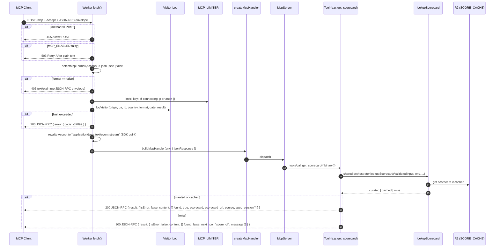
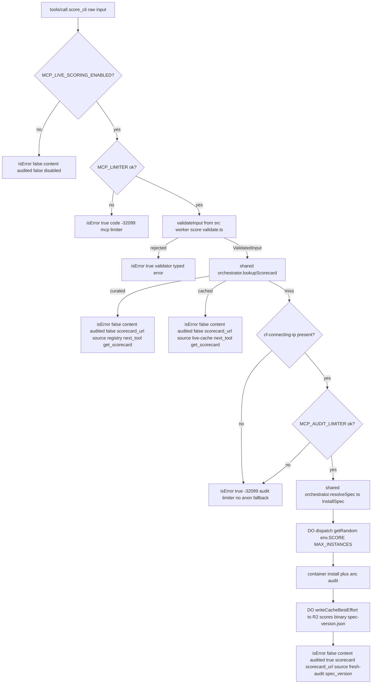

# feat: MCP server at POST /mcp on anc.dev

## Summary

Ship a public, no-auth Model Context Protocol server at `POST /mcp` on anc.dev. Nine tools across four surfaces:
registry of scored CLIs (`list_tools` / `get_tool` / `search_tools`), the ten agent-native principles (`list_principles`
/ `get_principle`), the vendored spec text (`list_spec_sections` / `get_spec_section`), and the scorecard surface
(`get_scorecard` for the cheap read-only fast path; `score_cli` for cache-miss-only fresh audits). Both scorecard tools
compose a shared `/api/score` orchestration core (`orchestrate.ts`, extracted from the existing handler) so MCP and the
human-form path can never drift on cache semantics, DO dispatch idiom, or validation gates. Cache state is communicated
via typed `isError: false` responses with structured content -- `isError: true` is reserved for genuine tool-execution
failures (rate limit, validator rejection, infrastructure error). Five MCP resources (one concrete + four URI templates)
cover the same data addressably. The wire contract: Accept-negotiated JSON vs SSE with JSON-wins-ties, `406 text/plain`
on neither MIME, `-32099` JSON-RPC envelope on rate-limit breach, instructions string at handshake, structured visitor
log fires AFTER the rate-limit gate with `gate_result` so log volume stays bounded under attack. Two rate-limit bindings
enforce a hard cost ceiling: `MCP_LIMITER` (60 / 60s per IP, anon-fallback OK) gates all MCP calls; `MCP_AUDIT_LIMITER`
(5 / 60 min per IP, NO anon fallback) gates only the one tool that can spin a container. Two env-var kill switches give
the operator a surgical zero-deploy off-switch: `MCP_ENABLED` for the whole surface, `MCP_LIVE_SCORING_ENABLED` for the
cost-bearing audit tool only. No `Access-Control-Allow-Origin` -- the endpoint is server-to-agent JSON-RPC, not
browser-to-server. Full discoverability set: `/.well-known/mcp` JSON pointer, `/.well-known/ai.txt`,
`/.well-known/security.txt`, an `llms.txt` Programmatic Access section, and a `/mcp-docs/` HTML page with its
`/mcp-docs.md` twin documenting the wire contract.

---

## Problem Frame

anc.dev today is a structured surface for humans — leaderboard, per-tool scorecards, principle pages, a live-score form
gated behind Turnstile, an audit how-to. Agent consumers reach the same data over markdown twins (`.md` siblings of
every HTML page) and the `llms.txt` index. That works for crawlers and for agents that have already been pointed at the
site. It does not work for agents probing via the emerging structured-access conventions: there is no `.well-known/mcp`
pointer, no JSON-RPC entrypoint, no surface that lets an agent ask "give me curl's scorecard" or "is this CLI
agent-native?" and receive a structured answer in one round-trip.

Two trends make the gap worth closing now. The `.well-known/mcp` convention is on the trajectory that
`.well-known/openid-configuration` was on in 2014 — emerging, ratifies within 12-24 months, then becomes the default
probe path for every agent that wants structured access. And the sister site streamsgrp.com shipped its own `/mcp` 36
hours ago, so the architectural pattern — `agents/mcp` + `@modelcontextprotocol/sdk` per-request server, build-emitted
catalog at `/_internal/mcp-catalog.json`, Accept-driven JSON/SSE, CF Rate Limiting binding, structured visitor log — is
hot, tested, and proven to compose with Workers Static Assets' asset-first dispatch.

The product question this plan answers: how does anc.dev expose its catalog to agents at a cost the operator can absorb?
The user pays for every container run that `score_cli` triggers, so the architecture must enforce a hard rule: **never
bypass the cache.** `get_scorecard` is the fast read-only tool over the registry-index and the R2 live-score cache;
`score_cli` runs only on cache miss. The two tools are perfectly symmetric — each succeeds exactly when it makes sense
to use it — and the only path to a fresh container audit goes through one tool that the rate-limit binding throttles
hard.

---

## Requirements

| ID  | Requirement                                                                                                                                                                                                                                                                                                                                                                                                                                                                                                                                                                 |
| --- | --------------------------------------------------------------------------------------------------------------------------------------------------------------------------------------------------------------------------------------------------------------------------------------------------------------------------------------------------------------------------------------------------------------------------------------------------------------------------------------------------------------------------------------------------------------------------- |
| R1  | `POST /mcp` accepts MCP streamable-HTTP requests at spec revision `2025-06-18`. Other methods return `405 Method Not Allowed` with `Allow: POST`.                                                                                                                                                                                                                                                                                                                                                                                                                           |
| R2  | The server negotiates `application/json` vs `text/event-stream` from the client's `Accept` header. JSON wins ties; q-values resolve unequal preferences. Absent / `*/*` → JSON. Neither MIME acceptable → `406 Not Acceptable` with `Content-Type: text/plain; charset=utf-8` and a single-line explanation body.                                                                                                                                                                                                                                                           |
| R3  | The server advertises nine tools: `list_tools`, `get_tool`, `search_tools`, `list_principles`, `get_principle`, `list_spec_sections`, `get_spec_section`, `get_scorecard`, `score_cli`. Schemas live on `tools/list`.                                                                                                                                                                                                                                                                                                                                                       |
| R4  | The server advertises one concrete resource (`anc://registry`) and four URI templates (`anc://tool/{slug}`, `anc://principle/{n}`, `anc://spec/{section}`, `anc://scorecard/{binary}`) via `resources/list` and `resources/templates/list`.                                                                                                                                                                                                                                                                                                                                 |
| R5  | `get_scorecard` always returns `isError: false`. On registry or R2-cache hit: structured content `{ found: true, scorecard, scorecard_url, source: "registry" \| "live-cache", spec_version }`. On miss: structured content `{ found: false, next_tool: "score_cli", message }`. `isError: true` is reserved for genuine tool-execution failures (rate limit, malformed input, infrastructure error).                                                                                                                                                                       |
| R6  | `score_cli` composes the shared `/api/score` orchestration pipeline (per KTD-7). On registry or R2-cache hit: returns `isError: false` with structured content `{ audited: false, scorecard_url, source, next_tool: "get_scorecard", message }`. On miss: runs the shared pipeline's fresh-audit path and returns `isError: false` with `{ audited: true, scorecard, scorecard_url, source: "fresh-audit", spec_version }`. The DO owns the R2 write; the MCP layer never writes the cache directly.                                                                        |
| R7  | All MCP calls are gated by `MCP_LIMITER` (60 / 60s per IP, keyed on `cf-connecting-ip`, fallback to shared `anon` bucket when header absent). `score_cli` cache-miss audits are additionally gated by `MCP_AUDIT_LIMITER` (5 / 60 min per IP). For the audit limiter only, missing `cf-connecting-ip` returns the `-32099` envelope immediately without consulting a shared bucket. On breach, return a `-32099` JSON-RPC error envelope at HTTP 200 (not 429).                                                                                                             |
| R8  | The server logs one structured INFO line per `POST /mcp` request AFTER the rate-limit gate decision, carrying `origin`, `user_agent`, `ip`, `country`, `format`, and `gate_result: "passed" \| "rate_limited"`. Null-emit-explicit; snake_case. Logging after the gate bounds Workers Logs cost under attack while still recording the denial.                                                                                                                                                                                                                              |
| R9  | The server advertises a free-form `instructions` string at handshake summarizing wire-contract facts (tool count, resource count, rate limits, spec revision, errors, docs URL). The same facts appear in `/mcp-docs.md` and in `AGENTS.md`; each numeric fact is asserted in tests so drift breaks the build.                                                                                                                                                                                                                                                              |
| R10 | The build pipeline emits `dist/_internal/mcp-catalog.json` containing the denormalized projection of the registry, principles, and spec sections. The `/_internal/` segment is hard-404'd from public access; the Worker reads it via `env.ASSETS.fetch` and bypasses the interceptor by not re-entering dispatch.                                                                                                                                                                                                                                                          |
| R11 | Discoverability surfaces ship in full: `dist/.well-known/mcp` (JSON pointer), `dist/.well-known/ai.txt`, `dist/.well-known/security.txt`, an `## Programmatic access` section in the existing `dist/llms.txt`, and the `content/mcp.md` source rendered to `dist/mcp-docs.html` + `dist/mcp-docs.md` twins.                                                                                                                                                                                                                                                                 |
| R12 | The MCP spec revision (`2025-06-18`), the SDK version, the well-known pointer, and the handshake instructions are pinned in lockstep. A drift between any two breaks tests.                                                                                                                                                                                                                                                                                                                                                                                                 |
| R13 | The change ships on the existing single-Worker entrypoint. `POST /mcp` sits ABOVE the asset-first dispatch in `src/worker/index.ts` and returns the MCP handler's response directly (carries its own `application/json` content-type from `enableJsonResponse: true`), never through `applyHeaders`.                                                                                                                                                                                                                                                                        |
| R14 | The change ships behind anc.dev's existing staging-leads-production discipline. `env.staging.main` exercises `/mcp` first; production gets the same wiring on the next release cycle. Two env-var kill switches: `MCP_ENABLED` (gates the entire `/mcp` branch; full-surface emergency off-switch) and `MCP_LIVE_SCORING_ENABLED` (gates only `score_cli`; cost-emergency off-switch -- read tier stays alive serving cached scorecards via `get_scorecard`). Both default `false` in production, `true` in staging. Surgical off via `wrangler secret put` -- zero deploy. |
| R15 | `POST /mcp` returns no `Access-Control-Allow-Origin` header. The endpoint is server-to-agent JSON-RPC, not browser-to-server. Browser-origin POSTs fail the same-origin check and are blocked client-side. A future use case needing browser access gets its own KTD revision.                                                                                                                                                                                                                                                                                              |

---

## Key Technical Decisions

### KTD-1. `agents/mcp` + `@modelcontextprotocol/sdk` per-request server

**Decision.** Build the MCP server using `createMcpHandler` from the `agents` SDK (the same primitive Cloudflare's docs
MCP server uses) paired with `McpServer` from `@modelcontextprotocol/sdk`. Instantiate a fresh `McpServer` plus a fresh
handler per incoming request — never a module-level singleton.

**Rationale.** `createMcpHandler` binds the server to a single transport; a module-level singleton throws "Server is
already connected to a transport" on the second request. This is the load-bearing constraint surfaced by streamsgrp's U0
spike and worth preserving as the first KTD here.

**Alternatives ruled out.** Hand-rolling JSON-RPC dispatch was rejected because the SDK already handles message framing,
stream/json mode switching, schema validation via Zod, and the `resources/templates/list` distinction. Using
Cloudflare's `McpAgent` Durable Object pattern was rejected because state lives in `/_internal/mcp-catalog.json` and R2;
a DO would add a second state surface for no gain.

### KTD-2. Stateless capability surface

**Decision.** Do not pass `sessionIdGenerator`. The `WorkerTransport` runs in stateless mode (no `Mcp-Session-Id` header
returned, no `resources/subscribe`, no progress notifications).

**Rationale.** Every tool call is independent of every other tool call. There is no per-session state to maintain; the
catalog is read-only and the audit tool is idempotent under cache. Stateful mode would force a session-store binding (DO
or KV) for no surfaced capability. Mirrors streamsgrp.

### KTD-3. `score_cli` cache-miss-only, never bypasses cache; typed-state responses

**Decision.** `score_cli` and `get_scorecard` both compose the shared `/api/score` orchestration pipeline (per KTD-7) as
their top-of-funnel entry point. The pipeline's `lookupScorecard()` call is run first; both tools branch on its result.
There is no `force` flag; no path through the MCP surface ever bypasses the cache.

Both tools return `isError: false` for all cache-state outcomes -- a registry hit, an R2-cache hit, and a cache miss are
all successful tool executions returning typed state in `content`. `isError: true` is reserved for genuine
tool-execution failures: rate-limit breach, `validateInput` rejection, infrastructure error (R2 unreachable, DO
timeout).

- `get_scorecard`: hit -> `{ found: true, scorecard, scorecard_url, source: "registry" | "live-cache", spec_version }`.
  Miss -> `{ found: false, next_tool: "score_cli", message }`.
- `score_cli`: hit -> `{ audited: false, scorecard_url, source: "registry" | "live-cache", next_tool: "get_scorecard",
  message }`. Miss -> `{ audited: true, scorecard, scorecard_url, source: "fresh-audit", spec_version }`.

**Rationale.** The operator pays for every container run. Cost is the binding constraint. The `score_cli` /
`get_scorecard` separation is honest about latency (tool selection IS the cost signal) only if cache is universally
respected. A `force` flag re-introduces the "sometimes fast, sometimes 30s" ambiguity the split exists to prevent. The
`isError: false` typed-state response shape aligns with MCP `CallToolResult` semantics -- `isError` means the tool
failed to execute, not that the answer was "not found." Agent harnesses that log `isError: true` as a failure don't
false-trip on routine cache misses; the typed-state body carries the routing.

**Cache lifecycle is inherited from the existing `/api/score` pipeline.** R2 entries written by `score_cli` use the same
key shape (`scores/<binary>/<spec-version>.json`) and lifecycle (no TTL today) as `/api/score`. Binary-key validation is
inherited from `validateInput` (which the shared pipeline runs first). If the operator later adds TTL, eviction, or
key-shape changes, that's a refactor of `src/worker/score/cache.ts` that benefits both surfaces -- not MCP-specific.

**Side effect.** `score_cli` is, in effect, "fill the cache." On miss, R2 gets a new write (by the DO via
`writeCacheBestEffort`, not by the MCP layer); on hit, R2 is untouched and the agent is redirected to `get_scorecard`.
Symmetric: `get_scorecard` succeeds with `found: true` exactly when `score_cli` returns `audited: false`;
`get_scorecard` succeeds with `found: false` exactly when `score_cli` succeeds with `audited: true`.

### KTD-4. Two rate-limit bindings: `MCP_LIMITER` + `MCP_AUDIT_LIMITER`

**Decision.** Add two new Cloudflare Rate Limiting bindings.

- `MCP_LIMITER`: 60 requests / 60 seconds per IP, keyed on `cf-connecting-ip`, fallback to shared `anon` bucket when the
  header is absent. Gates every `POST /mcp` request. The visitor log fires AFTER this gate's decision (per R8) carrying
  `gate_result: "passed" | "rate_limited"` so denied requests are still recorded once without unbounded log volume.
- `MCP_AUDIT_LIMITER`: 5 fresh audits / 60 minutes per IP, keyed on `cf-connecting-ip`. **No anon fallback.** When the
  header is absent, return the `-32099` envelope immediately without consulting a shared bucket -- the audit budget is
  too cost-sensitive to share across all anon-fallback consumers globally. Gates only `score_cli` cache-miss audits,
  checked after the shared pipeline's `lookupScorecard()` returns `miss` but before DO dispatch. On breach, return
  `-32099 rate limit exceeded -- fresh audits limited to 5 per hour per source`.

**Namespace IDs.** Following the existing per-env odd/even convention in `wrangler.jsonc` (`SCORE_LIMITER` 1001
top-level / 1002 staging; `SCORE_LIMITER_IP` 1003 / 1004): allocate `MCP_LIMITER` 1005 / 1006, `MCP_AUDIT_LIMITER` 1007
/
1008. Each env-block redeclares the binding with its own ID; staging and production rate-limit counters never share
state. The production-cutover step is "confirm namespace IDs are distinct per env," NOT "confirm stable between envs."

**Rationale.** The cost profiles of the read tools and the audit tool diverge by three orders of magnitude. One shared
limiter would either be too loose for cost protection or too tight for catalog probes. Two bindings let the read surface
stay responsive (catalog probes can't be starved by audit floods on another IP) while pinning the audit-per-IP ceiling
honestly. The existing `SCORE_LIMITER` is keyed on `<session-id>:<sha256(input)>` and gated by Turnstile; the MCP path
has no Turnstile / session, so it gets its own keying.

**Anon-bucket asymmetry.** The read tier accepts a shared `anon` bucket because per-request cost is trivial and a small
flood from anon callers is recoverable. The audit tier rejects on missing `cf-connecting-ip` because container-run cost
is non-trivial and a shared `anon` audit budget is a DoS vector (distributed attackers without a real IP would exhaust
the global audit budget for all legitimate anon-fallback consumers).

**Ceiling-derivation caveat.** Both ceilings (60/60s, 5/60min) are pre-data placeholders sized from streamsgrp parity.
Expected steady-state traffic on anc.dev's `/mcp` is unknown at planning time. After 14 days of visitor-log data, tune
symmetrically (up if too tight is blocking legitimate use, down if cost actuals diverge from model). The Risks section
records the placeholder status.

**Anti-decision.** Do NOT reuse `SCORE_LIMITER`. Its keying assumes a session-id; the MCP path has none. Cross-keying
the same binding would couple human form submitters and agent probes into one budget for no benefit.

### KTD-5. Build-emitted catalog at `/_internal/mcp-catalog.json`

**Decision.** A new build pipeline stage emits `dist/_internal/mcp-catalog.json`, denormalized from the existing
registry-index, the principles content, and the vendored spec sections. The Worker loads it once per isolate via
`env.ASSETS.fetch` and caches the parsed object in module scope. The `/_internal/` segment is hard-404'd from public
access in `src/worker/index.ts`; the Worker's own asset fetch bypasses the interceptor by not re-entering dispatch.

**Rationale.** The catalog data is already public-by-design (it's the registry-index plus principles plus spec text).
Putting it at `/_internal/` is a discoverability / surface-hygiene decision, not a security one — agents talk to MCP
through `POST /mcp`, not through the asset URL. Per-isolate caching is correct: a deployed Worker version ships with an
immutable bundle; a fresh deploy ships a new isolate; the in-module cache is the right lifetime.

**Anti-decision.** Do NOT load the catalog at request time from the source files (registry-index.json, content/*.md,
src/data/spec/*). The pipeline stage exists to produce the denormalized projection so the Worker doesn't re-parse
markdown or rebuild the denormalization per request.

### KTD-6. MCP tools compose `/api/score`'s shared orchestration; the cache resolver is a single source of truth

**Decision.** Refactor `src/worker/score/handler.ts` to extract its post-input-validation core orchestration into a
shared internal helper (working name `src/worker/score/orchestrate.ts`; final path decided at U5). Both `/api/score` and
the MCP `get_scorecard` + `score_cli` tools compose this helper. The helper's responsibilities, in order:

1. Accept a `ValidatedInput` and the env bindings the orchestration needs (`SCORE`, `SCORE_CACHE`, the indexes
   `registryIndex` + `hintsIndex`, `specVersion`).
2. Call `lookupScorecard(input, env, registryIndex, hintsIndex, { specVersion })` -- the existing function exported from
   `src/worker/score/registry-lookup.ts` (NOT `handler.ts`). Returns `{kind: "curated", entry, scorecard_url,
   anc_version}` | `{kind: "cached", scorecard, anc_version, tool_version}` | `{kind: "miss"}`.
3. On the caller's intent (read-only vs run-fresh-on-miss), either return the lookup result for the caller to shape into
   a typed-state response, or proceed into resolve-spec + DO dispatch + return the fresh scorecard.

The MCP tools wrap the orchestrator with MCP-specific gates upstream (kill switch, `MCP_LIMITER`, `MCP_AUDIT_LIMITER`)
and response-shape transformations downstream (map the orchestrator's result kind to the typed-state envelope per
KTD-3). `/api/score` keeps its existing human-form gates upstream (kill switch, Turnstile, session-issue,
`SCORE_LIMITER`) and its existing JSON response shaping downstream.

**Rationale.** The user's directive: reuse, don't duplicate. Sharing the orchestration core means MCP and the human-form
path can never drift on cache-hit semantics, key shapes, DO dispatch idiom, or response correctness. A future refactor
of the resolver, the install-spec resolver, or the DO pool benefits both surfaces at once. The hermetic surface for each
caller is the per-surface gates (Turnstile vs MCP_LIMITER, session vs anon-rejection), not the orchestration body.

**Anti-decision.** Do NOT call `lookupScorecard` from MCP tool code with a fresh ad-hoc `ValidatedInput` synthesized
inside the tool. The orchestrator owns the call so the surrounding gates and result-mapping stay consistent.

### KTD-7. `score_cli` composes the shared orchestrator as its top-of-funnel; no MCP-specific cache write, no MCP-specific DO dispatch

**Decision.** `score_cli`'s implementation in `src/worker/mcp/tools/scorecard-audit.ts` is a thin wrapper:

1. Verify `MCP_LIVE_SCORING_ENABLED` is truthy. If not, return `isError: false` with content `{ audited: false, message:
   "live scoring is currently disabled by the operator; cached scorecards remain available via get_scorecard" }`.
2. Run `validateInput(rawInput)` from `src/worker/score/validate.ts`. On rejection, return `isError: true` with the
   validator's typed error (this is the security-load-bearing gate -- HTTPS-only, github.com exact-match, homoglyph
   guard, branch-name regex, shell-metacharacter exclusion, unsupported-PM rejection all live here).
3. Compose the shared orchestrator with intent `run_fresh_on_miss`. The orchestrator runs `lookupScorecard`. On hit
   (`curated` or `cached`), `score_cli` shapes the typed-state "already cached" response and returns. On miss,
   `score_cli` checks `MCP_AUDIT_LIMITER` (rejecting on missing `cf-connecting-ip`, per KTD-4), and on pass delegates
   back to the orchestrator which performs `resolveSpec()` -> DO dispatch via `getRandom(env.SCORE, MAX_INSTANCES)` (the
   existing post-2026-05-18-incident pool pattern) -> the DO's own `writeCacheBestEffort` write.
4. Shape the orchestrator's result into the typed-state response (per KTD-3).

The MCP layer never writes R2 directly; the DO owns cache writes via `writeCacheBestEffort` against the canonical key
shape `scores/<binary>/<spec-version>.json` (`src/worker/score/cache.ts`). The MCP layer never calls `idFromName(...)`
on the `SCORE` namespace; the pool pattern is inherited from the orchestrator.

**Rationale.** Turnstile is a human-form gate; the MCP path has no human. Sessions exist to bind `SCORE_LIMITER` to
repeated calls within a single human's audit flow; the MCP path uses `MCP_AUDIT_LIMITER` with a different keying. These
gates live above the orchestrator; the orchestrator itself is gate-agnostic. The DO pool pattern was chosen explicitly
after the 2026-05-18 cascading-timeout incident to spread load across `MAX_INSTANCES` instead of queuing serially behind
one container session -- the MCP path inherits the same protection.

**Anti-decision.** Do NOT write the cache from the Worker side in the MCP path. The DO already writes via
`writeCacheBestEffort` using the correct key shape; a Worker-side write with key `<binary>` would silently bypass the
cache the read tier uses. Do NOT use `env.SCORE.idFromName(scoringHash)` for DO dispatch; the pool pattern is the only
correct dispatch idiom in this codebase. Do NOT register a separate "concurrent calls coalesce on same DO id" test
expectation; the pool pattern deliberately does not coalesce.

### KTD-8. Spec revision pinned in lockstep across four surfaces

**Decision.** The MCP spec revision constant lives at the existing `src/worker/spec-version.gen.ts` (already used by the
live-score handler) or a new sibling constant — decided at U3 once the import surface is concrete. The constant is
referenced by:

1. The handshake `instructions` string (constructed in the Worker).
2. The `/.well-known/mcp` pointer (constructed at build time).
3. The `content/mcp.md` documentation body (authored as prose).
4. The test assertions in `tests/worker/mcp.test.ts` and `tests/build/mcp-catalog.test.ts`.

The tests assert the literal value, so a bump in any one source breaks the build until all four are updated together.

**Rationale.** Streamsgrp's KTD-1 acknowledgement was that parallel prose is the price of authoring the wire contract
twice (machine-readable instructions + human-readable docs). The tests are the drift gate. Same posture here.

### KTD-9. Server identity `anc`, URI prefix `anc://`

**Decision.** `serverInfo.name = 'anc'`, `serverInfo.version = '0.1.0'`. Resource URIs use the `anc://` scheme.

**Rationale.** Matches the CLI binary brand and the public-facing site domain stem. Distinguished from `agentnative`
(the spec repo) and `anc.dev` (the FQDN). Short, memorable, consistent.

### KTD-10. MCP branch sits above asset-first dispatch; handler response returned directly; no CORS

**Decision.** In `src/worker/index.ts`, the `POST /mcp` branch lands AFTER the existing `/score/*` and `/check` ->
`/audit` redirect branches but BEFORE the `/_internal/` 404 interceptor and the asset fetch. The MCP handler's
`Response` carries `Content-Type: application/json` (or `text/event-stream` for SSE), `Cache-Control: no-store`, and NO
`Access-Control-Allow-Origin` header. Returned directly -- NOT through `applyHeaders`.

**Rationale.** `applyHeaders` is for asset-derived responses (HTML, markdown, JSON discoverability files). MCP responses
have a different cacheability profile; running them through `applyHeaders` would strip the `no-store` directive and risk
mis-applying the static asset's Cache-Control.

**CORS posture: server-to-agent, not browser-to-server.** Omitting `Access-Control-Allow-Origin` means browser-origin
POSTs fail the browser's same-origin check and are blocked client-side. This is the deliberate posture: MCP clients are
agent runtimes (Claude Code, Codex, Cursor, custom CLIs) that don't issue CORS preflights; browser-origin POSTs to
`/mcp` would let any malicious web page trigger `score_cli` runs charged against the visitor's `cf-connecting-ip`, not
the attacker's. If a future use case needs in-page agent access, it gets its own KTD revision, an explicit allow-list,
and an MCP_AUDIT_LIMITER policy designed for browser traffic.

### KTD-11. Two-stage env-var kill switch: `MCP_ENABLED` + `MCP_LIVE_SCORING_ENABLED`

**Decision.** Two env-var kill switches gate the MCP surface independently:

- `MCP_ENABLED` -- gates the entire `/mcp` branch in `src/worker/index.ts`. When falsy, the dispatch short-circuits to
  `503 Service Unavailable` with `Retry-After: 3600` and a one-line plain-text body. No JSON-RPC envelope -- the surface
  is off, not in-error.
- `MCP_LIVE_SCORING_ENABLED` -- gates only the `score_cli` tool in `src/worker/mcp/tools/scorecard-audit.ts`. When
  falsy, `score_cli` returns `isError: false` with content `{ audited: false, message: "live scoring is currently
  disabled by the operator; cached scorecards remain available via get_scorecard" }`. The read tier (`get_scorecard` and
  the seven catalog tools) stays alive.

Both default `false` in production and `true` in staging via the per-env `vars` block in `wrangler.jsonc`. Turning a
switch is `wrangler secret put MCP_ENABLED false` (or the corresponding `MCP_LIVE_SCORING_ENABLED`) -- zero deploy, zero
PR cycle.

**Rationale.** A no-auth public surface that triggers container runs needs a surgical Day-1 off-switch. `wrangler
rollback` is destructive-coarse (it rolls back every production change since deploy, including unrelated ones); a
follow-up PR is hours-to-days. The two-stage split lets a cost emergency (audit budget overrun) disable the expensive
tool while keeping the read tier serving cached scorecards. A surface emergency (security issue, schema bug, abuse
pattern at the dispatch layer) takes the whole endpoint offline.

**Anti-decision.** Do NOT couple the two switches into one. If both go off together, surface-level emergencies and
cost-level emergencies share a single response surface (503 vs `audited: false` typed-state), which conflates two
different operator intents. Two switches, two response shapes, two emergency paths.

---

## High-Level Technical Design

### Component map

```mermaid
flowchart LR
  subgraph build["Build pipeline (bun src/build/build.mjs)"]
    A[registry-index + principles + spec] --> B[11-mcp-catalog.mjs]
    B --> C[/_internal/mcp-catalog.json]
    D[schema constants] --> E[11-discovery-emit.mjs]
    E --> F[.well-known/mcp]
    E --> G[.well-known/ai.txt]
    E --> H[.well-known/security.txt]
    I[content/mcp.md] --> J[07-subpages.mjs]
    J --> K[/mcp-docs/ + /mcp-docs.md]
    L[existing llms.txt] --> M[09-llms-emit.mjs adds Programmatic access section]
  end

  subgraph worker["Worker (src/worker/index.ts)"]
    N[POST /mcp branch] --> N0{MCP_ENABLED?}
    N0 -- no --> N1[503 Retry-After]
    N0 -- yes --> O[detectMcpFormat from Accept]
    O --> Q[MCP_LIMITER]
    Q --> P[visitor-log gate_result]
    P --> R[buildMcpHandler]
    R --> S[McpServer + 9 tools + 5 resources]
  end

  subgraph shared["Shared orchestration src/worker/score/orchestrate.ts"]
    SO[validateInput] --> SL[lookupScorecard registry-lookup.ts]
    SL --> SR[resolveSpec on miss when intent run_fresh_on_miss]
    SR --> SD[DO dispatch getRandom MAX_INSTANCES]
    SD --> SC[Sandbox DO writeCacheBestEffort to R2]
  end

  C -.loaded per isolate.-> S
  S --> T[get_scorecard / score_cli compose shared orchestrator]
  T --> SO
```

### `POST /mcp` request lifecycle



### `score_cli` decision tree



### Tool catalog (succinct contract)

| Tool                 | Inputs                                                                  | Returns                                                                                                                                                                                                                                                                                                      |
| -------------------- | ----------------------------------------------------------------------- | ------------------------------------------------------------------------------------------------------------------------------------------------------------------------------------------------------------------------------------------------------------------------------------------------------------ |
| `list_tools`         | (none)                                                                  | Array of summary records: `slug`, `name`, `binary`, `install`, `version`, `score_pct`, `scorecard_url`, `audit_profile`                                                                                                                                                                                      |
| `get_tool`           | `slug: string`                                                          | Full registry record by slug                                                                                                                                                                                                                                                                                 |
| `search_tools`       | `score_min?`, `score_max?`, `audit_profile?`, `principle_min_score?`    | Filtered registry rows; AND semantics; missing fields treated as no constraint                                                                                                                                                                                                                               |
| `list_principles`    | (none)                                                                  | Array of `{ n, slug, title, level_summary }` for the eight principles                                                                                                                                                                                                                                        |
| `get_principle`      | `n: 1..8`                                                               | Single principle: `n`, `slug`, `title`, `body_markdown`, list of MUST/SHOULD/MAY requirements with `audit_id`s                                                                                                                                                                                               |
| `list_spec_sections` | (none)                                                                  | Array of `{ slug, title, level, parent_slug? }` from the vendored spec table of contents at the current `spec_version`                                                                                                                                                                                       |
| `get_spec_section`   | `slug: string`                                                          | Full section: `slug`, `title`, `body_markdown`, `spec_version`                                                                                                                                                                                                                                               |
| `get_scorecard`      | `{ binary?, slug?, install?, github_url? }` (ValidatedInput-compatible) | `isError: false` always for cache-state outcomes. Hit: `{ found: true, scorecard, scorecard_url, source: "registry"\|"live-cache", spec_version }`. Miss: `{ found: false, next_tool: "score_cli", message }`                                                                                                |
| `score_cli`          | `{ binary?, slug?, install?, github_url? }` (ValidatedInput-compatible) | `isError: false` always for cache-state outcomes. Hit: `{ audited: false, scorecard_url, source, next_tool: "get_scorecard", message }`. Miss: `{ audited: true, scorecard, scorecard_url, source: "fresh-audit", spec_version }`. `isError: true` only for rate-limit / validator / infrastructure failures |

---

## Output Structure

```text
src/worker/mcp/
├── server.ts              # McpServer factory; createMcpHandler wiring; per-request build
├── catalog.ts             # /_internal/mcp-catalog.json loader; per-isolate cache; types
├── instructions.ts        # buildInstructions(env): handshake summary string
├── visitor-log.ts         # logVisitor(request, { format, gate_result }): structured INFO line
├── tools/
│   ├── index.ts           # registerTools(server, catalog, env): aggregates all 9
│   ├── registry.ts        # list_tools, get_tool, search_tools
│   ├── principles.ts      # list_principles, get_principle
│   ├── spec.ts            # list_spec_sections, get_spec_section
│   ├── scorecard-read.ts  # get_scorecard (composes shared orchestrator)
│   └── scorecard-audit.ts # score_cli (composes shared orchestrator; checks MCP_LIVE_SCORING_ENABLED)
└── resources.ts           # registerResources(server, catalog): concrete + 4 templates

src/worker/score/
├── orchestrate.ts         # NEW: shared core extracted from handler.ts; both /api/score and MCP tools compose it
├── handler.ts             # MODIFIED: human-form gates wrap orchestrate.ts; body slims to the gates + response shaping
├── registry-lookup.ts     # UNCHANGED: lookupScorecard stays here; orchestrator calls it
├── resolve-spec.ts        # UNCHANGED: resolveSpec stays here; orchestrator calls it
├── validate.ts            # UNCHANGED: validateInput stays here; both surfaces call it upstream of orchestrate
├── do.ts                  # UNCHANGED: Sandbox DO; writeCacheBestEffort is the only R2 writer
└── cache.ts               # UNCHANGED: cache key shape + put/get

src/worker/
└── accept.ts              # MODIFIED: add detectMcpFormat alongside existing detectPreference + detectScorePreference

src/build/
├── 11-mcp-catalog.mjs      # NEW: emit dist/_internal/mcp-catalog.json (runs after 10-sitemap, before runInvariantChecks)
├── 11a-discovery-emit.mjs  # NEW: emit dist/.well-known/{mcp,ai.txt,security.txt}
├── 09-llms-emit.mjs        # MODIFIED: add ## Programmatic access section
├── 07-subpages.mjs         # MODIFIED: include 'mcp' in subPages list
├── build.mjs               # MODIFIED: register new stages with explicit imports (filename numbering stays preferred)
└── shell.mjs               # MODIFIED: add Programmatic access nav/footer link to /mcp-docs/

content/
└── mcp.md                  # NEW: wire-contract docs source

tests/
├── worker/mcp.test.ts                  # NEW: handshake, tools, resources, errors (bun-test)
├── worker/mcp-dispatch.test.ts         # NEW: pickMcpFormat, 405, 406, JSON-RPC error envelope, log-after-gate
├── worker/mcp-audit.test.ts            # NEW: score_cli composing orchestrator; mocked DO+R2
├── e2e/mcp.spec.ts                     # NEW: live-staging Playwright smoke
├── e2e/discoverability.spec.ts         # NEW: .well-known/mcp + ai.txt + security.txt live smoke
├── build/mcp-catalog.test.ts           # NEW: catalog projection invariants
└── build/discovery-emit.test.ts        # NEW: well-known pointer + ai.txt + security.txt shape

src/worker/index.ts                     # MODIFIED: POST /mcp branch with MCP_ENABLED gate + no CORS
wrangler.jsonc                          # MODIFIED: MCP_LIMITER (1005/1006) + MCP_AUDIT_LIMITER (1007/1008) bindings; MCP_ENABLED + MCP_LIVE_SCORING_ENABLED vars per env
AGENTS.md                               # MODIFIED: MCP wire-contract section
README.md                               # MODIFIED: brief MCP pointer
```

**Notes on what's NOT in the tree.** No `src/worker/mcp/accept.ts` (F12: detectMcpFormat is added to the existing
`src/worker/accept.ts`). No `runFreshAudit` helper file (F2/F3: the fresh-audit path lives inside the shared
`orchestrate.ts`; the MCP layer never writes the cache directly). No `tests/worker-integration/mcp.test.ts` (F13: the
vitest-pool-workers layer isn't added unless score_cli's integration uncovers an MCP-specific concern at execution time;
bun unit + Playwright e2e cover the surface). No `src/worker/score/run-fresh-audit.ts` (subsumed by `orchestrate.ts`).

---

## Implementation Units

### U1. Spike — verify `createMcpHandler` composes with anc's existing Worker exports [shipped]

**Goal.** Prove that `createMcpHandler` from `agents/mcp` + `McpServer` from `@modelcontextprotocol/sdk` compose cleanly
with anc's existing Worker entrypoint, which already re-exports `ContainerProxy` (CF Sandbox SDK) and `Sandbox` (the
live-scoring DO class) from `src/worker/index.ts`. Output: confirmation that KTD-1, KTD-2, KTD-10 all stand, or a
refined approach if any conflict surfaces.

**Requirements:** R1, R13

**Dependencies:** none

**Files:**

- `spike/u1-mcp-composition/` (new — disposable spike directory; deleted in U2 commit)

**Approach.**

- Read the `cloudflare:building-mcp-server-on-cloudflare` skill and `cloudflare:agents-sdk` skill references.
- Build a Worker that imports `createMcpHandler` + `McpServer`, registers TWO tools: (a) a no-op `spike_handshake` tool
  that returns a literal string, and (b) a `spike_do_fetch` tool that calls a stub Sandbox DO via `getRandom(env.SCORE,
  MAX_INSTANCES)` against a `/health` endpoint. Re-export `ContainerProxy` from `@cloudflare/sandbox` and re-export a
  minimal `Sandbox` DO class (mirroring the existing `src/worker/index.ts` exports). Wire to a throwaway
  `wrangler.jsonc` with `nodejs_compat`, the same `compatibility_date`, a stub `ASSETS` binding, and a real `SCORE`
  durable-objects binding pointed at the stub class with `MAX_INSTANCES=2`.
- Run `wrangler dev --local`. Exercise both tools end-to-end:
- `POST /mcp initialize` returns a valid handshake (KTD-1, KTD-2).
- `POST /mcp tools/call spike_handshake` returns the literal string (handler dispatch works).
- `POST /mcp tools/call spike_do_fetch` returns the DO's `/health` response (composition works at runtime --
  `ContainerProxy` resolution does NOT throw on first DO fetch, which is the load-bearing risk per the existing comment
  in `src/worker/index.ts:26-31`; the spike's earlier handshake step would pass even if this were broken).
- If composition is clean → KTDs hold; proceed to U2 and delete the spike.
- If composition surfaces an issue (e.g., the Sandbox SDK's `ctx.exports.ContainerProxy` resolution conflicts with the
  MCP handler, or `agents/mcp` versions disagree with `@modelcontextprotocol/sdk`) → update the relevant KTD with the
  discovered constraint or alternative primitive. Re-run the spike against the revised decision. Document the discovery
  in this plan as a KTD revision before continuing.

**Patterns to follow:**

- `cloudflare:building-mcp-server-on-cloudflare` skill
- `cloudflare:agents-sdk` skill
- streamsgrp's `spike/u0-mcp-composition/` shape (see streamsgrp commit `dc37722`)

**Test scenarios:**

Test expectation: none — U1 is a discovery + de-risk step, not feature-bearing. The spike code is disposable.

**Verification.** `wrangler dev --local` boots the spike. `POST /mcp initialize` returns a JSON-RPC `2.0` envelope
carrying `result.serverInfo.name` and `result.protocolVersion === "2025-06-18"`. `POST /mcp tools/call spike_do_fetch`
returns the DO's `/health` response without a runtime `ContainerProxy is undefined` error -- this is the load-bearing
check that the handshake-only test would silently pass. Spike directory deleted before U2 lands.

---

### U2. Build pipeline — MCP catalog emit + content/mcp.md authoring [shipped]

**Goal.** A new build stage emits `dist/_internal/mcp-catalog.json` containing the denormalized projection the Worker
needs (registry, principles, spec sections). Author `content/mcp.md` as the wire-contract documentation source so the
existing prose-page pipeline renders it to `dist/mcp-docs.html` + `dist/mcp-docs.md`.

**Requirements:** R10, R11, R12

**Dependencies:** U1

**Files:**

- `src/build/11-mcp-catalog.mjs` (new — denormalization + emit)
- `src/build/build.mjs` (modified -- register `emitMcpCatalog` with an explicit import plus call after `buildSitemap`
  and before `runInvariantChecks` so invariants can cover the catalog. Anc's `build.mjs` today uses explicit imports per
  the file-header comment naming numbering as "decorative"; the filename `11-mcp-catalog.mjs` is preferred so file order
  matches execution order if a future refactor enforces numeric ordering. Converting `build.mjs` to enforce filename
  numbering is OOS for this plan.)

- `content/mcp.md` (new — wire-contract docs with frontmatter; mirrors the shape of `content/about.md`)
- `src/build/07-subpages.mjs` (modified — add `'mcp'` to the `subPages` registration list so the page renders)
- `src/build/10-sitemap.mjs` (modified — add `/mcp-docs/` to the sitemap)
- `src/build/shell.mjs` (modified — add a `Programmatic access` nav link or footer link to `/mcp-docs/`; nav vs footer
  decided at unit time based on chrome density)
- `tests/build/mcp-catalog.test.ts` (new)
- `tests/build/discovery-emit.test.ts` (new — placeholder; actual `.well-known` emit lands in U6 but the test file
  scaffolds here so U6's diff is smaller)

**Approach.**

- The catalog projection mirrors streamsgrp's shape: `{ generated_at, registry, principles, spec_sections }`.
- `registry` is the existing `registry-index.json` rows (already emitted by `08-scorecards-emit.mjs`) projected down to
  the fields the MCP `list_tools` / `get_tool` / `search_tools` tools expose. The projection is the place to drop any
  fields not safe for agent consumption (none identified today; the registry-index is already public).
- `principles` is the eight principle markdown bodies (`content/principles/*.md`) plus the MUST/SHOULD/MAY rows drawn
  from the existing coverage-matrix JSON (the coverage matrix stays vendored on-site for agents that want the full
  row-level detail; MCP exposes the principle-level summary only).
- `spec_sections` is the vendored spec at `src/data/spec/` projected to a table of contents (slug, title, level) plus
  per-section body bodies addressable by slug. The current vendored `VERSION` (0.5.0 at plan time) is captured in
  `catalog.spec_version`.
- The new stage runs AFTER `08-scorecards-emit.mjs` (it needs the emitted registry-index) and AFTER `09-llms-emit.mjs`
  (so llms.txt has been finalized; the catalog generation is read-only with respect to llms). Numbered `11-` to fit
  cleanly between `10-sitemap.mjs` and `12-minify-dist.mjs`.
- `content/mcp.md` is authored as standard subpage markdown (frontmatter: `title`, `description`, `slug: /mcp-docs/`,
  `current: ''`). Body mirrors streamsgrp's `content/mcp.md` adapted for the anc surface: endpoint URL, Accept-header
  negotiation table, the nine tools, the five resources, error layers, rate limits (both bindings), spec revision pin,
  discovery siblings. The mcp-docs URL must match the `documentation` URL that the `/.well-known/mcp` pointer will
  advertise in U6 (`https://anc.dev/mcp-docs.md`).
- Coordinate the three-registration pattern (subPages list + sitemap + nav/footer) per
  `docs/solutions/conventions/new-content-page-requires-three-registrations-2026-05-21.md`.

**Execution note.** Author `tests/build/mcp-catalog.test.ts` first against a small fixture. The projection logic should
be invariant-checked (every registry row carries `binary`, every principle carries `n`, every spec section carries a
non-empty body) before the emit stage code is finalized.

**Patterns to follow:**

- `src/build/08-scorecards-emit.mjs` (existing pipeline-stage shape)
- streamsgrp `src/build/08-mcp-catalog.mjs` (denormalization pattern, public-fact gate not required here)
- `docs/solutions/conventions/new-content-page-requires-three-registrations-2026-05-21.md`

**Test scenarios.**

- Catalog file exists at `dist/_internal/mcp-catalog.json` after `bun run build`.
- Catalog `generated_at` is a valid ISO-8601 Z-suffixed timestamp.
- Catalog `registry` length matches `dist/registry-index.json` length (no rows dropped).
- Every catalog `registry` row carries non-empty `slug`, `binary`, `name`, `install`.
- Catalog `principles` has length 8; principle numbers are exactly `1..8`.
- Every catalog `principles` row carries non-empty `slug`, `title`, `body_markdown`.
- Catalog `spec_sections` is non-empty; every section carries non-empty `slug`, `title`, `body_markdown`.
- Catalog `spec_version` equals the contents of `src/data/spec/VERSION` (trimmed).
- `content/mcp.md` renders to both `dist/mcp-docs.html` and `dist/mcp-docs.md` after build.
- `dist/sitemap.xml` includes `<loc>https://anc.dev/mcp-docs/</loc>`.

**Verification.** `bun run build` completes without error. `jq '.spec_version' dist/_internal/mcp-catalog.json` returns
the live VERSION string. `dist/mcp-docs.html` opens with the wire-contract content; `dist/mcp-docs.md` is the authored
markdown twin.

---

### U3. MCP Worker module — server factory, read-only tools, resources, instructions, visitor log, catalog loader [shipped]

**Goal.** The full MCP module under `src/worker/mcp/`, MINUS the `score_cli` tool. Eight tools (`list_tools`,
`get_tool`, `search_tools`, `list_principles`, `get_principle`, `list_spec_sections`, `get_spec_section`,
`get_scorecard`), five resources, the instructions builder, the visitor log, and the catalog loader. `get_scorecard`
uses the existing `lookupScorecard()` resolver. `score_cli` is registered as a stub that returns `isError: not
implemented yet` so the tool count is honest at the handshake; U5 makes it real.

**Requirements:** R3, R4, R5, R8, R9, R10

**Dependencies:** U2

**Files:**

- `src/worker/mcp/server.ts` (new — McpServer factory; KTD-1 per-request build)
- `src/worker/mcp/catalog.ts` (new — `loadCatalog(env)` reads `/_internal/mcp-catalog.json`; module-scoped cache;
  `Catalog` types)
- `src/worker/mcp/instructions.ts` (new — `buildInstructions(env)` returns the handshake summary string per R9)
- `src/worker/mcp/visitor-log.ts` (new — `logVisitor(request, { format })` per R8)
- `src/worker/mcp/tools/index.ts` (new — `registerTools(server, catalog, env)` calls each tool's register fn)
- `src/worker/mcp/tools/registry.ts` (new — `list_tools`, `get_tool`, `search_tools`)
- `src/worker/mcp/tools/principles.ts` (new — `list_principles`, `get_principle`)
- `src/worker/mcp/tools/spec.ts` (new — `list_spec_sections`, `get_spec_section`)
- `src/worker/mcp/tools/scorecard-read.ts` (new -- `get_scorecard` composes the shared orchestrator from
  `src/worker/score/orchestrate.ts` with intent `lookup_only`; maps the orchestrator result to the typed-state response
  per KTD-3)
- `src/worker/mcp/tools/scorecard-audit.ts` (new -- `score_cli` stub returning `isError: false` with content `{ audited:
  false, message: "score_cli is registered for tool-count parity at the handshake; the audit path lands in U5" }`)
- `src/worker/score/orchestrate.ts` (new -- shared orchestration core; extracted from handler.ts in U5 but the import
  surface is reserved here so `scorecard-read.ts` has its dependency in place at the time the file lands. The
  orchestrator's lookup-only intent is the smaller half of the extraction and ships in U3; the run-fresh-on-miss intent
  is completed in U5.)
- `src/worker/score/handler.ts` (modified -- begin extracting the post-input-validation core into `orchestrate.ts`; U3
  lands the lookup-only path; U5 completes the run-fresh-on-miss path)
- `src/worker/mcp/resources.ts` (new — `registerResources(server, catalog)`: 1 concrete + 4 templates per R4)
- `package.json` (modified — add deps: `agents`, `@modelcontextprotocol/sdk`, `zod`)
- `tests/worker/mcp.test.ts` (new — bun-test layer; matches streamsgrp's pattern using stubbed `env.ASSETS` fixture)
- `tests/bun-setup.ts` (new or modified — register `cloudflare:workers` test pool; mirror streamsgrp's setup)

**Approach.**

- `server.ts` builds a fresh `McpServer` per request (KTD-1, KTD-2): no `sessionIdGenerator`; capabilities `{tools: {},
  resources: {}}`; pass `instructions` from `buildInstructions(env)`. Returns the handler cast through the agents SDK's
  expected signature.
- `catalog.ts` mirrors streamsgrp's catalog loader exactly: module-scoped `let cached: { env, catalog } | null`, fetched
  via `env.ASSETS.fetch(new Request('https://assets.local/_internal/mcp-catalog.json'))`, parsed once, re-used.
  `resetCatalogCacheForTests()` is exported so bun tests start fresh per file.
- `instructions.ts` builds the prose summary referencing nine tools, five resources, both rate limits (60/60s general
- 5/60min audit), spec revision `2025-06-18`, error layers, and the canonical docs URL `https://anc.dev/mcp-docs.md`.
  The numeric facts are pulled from a small module-local constants block so a change in the constant rewrites the
  handshake string; the tests assert each digit explicitly so the constant + instructions + docs page + well-known
  pointer can never drift.

- `visitor-log.ts` mirrors streamsgrp byte-for-byte: structured object passed to `console.log` (workers-logs
  auto-extracts fields per `docs/solutions/tooling-decisions/workers-logs-console-log-object-auto-extraction.md`).
  Payload: `origin`, `user_agent`, `ip`, `country`, `format` (the negotiated mode, json or sse).
- Each tool's input schema uses Zod via the SDK's `server.tool(name, description, schema, handler)` signature.
  Descriptions are written for agent introspection — terse, contract-shaped, lookup-friendly. Match streamsgrp's
  descriptive register.
- `get_scorecard` composes the shared orchestrator (`src/worker/score/orchestrate.ts`) with intent `lookup_only`. The
  orchestrator runs `validateInput` first, then `lookupScorecard` from `src/worker/score/registry-lookup.ts` with the
  full 5-param signature (ValidatedInput, env, registryIndex, hintsIndex, opts). The tool maps the result kinds: on
  `curated`, fetches the scorecard JSON via `env.ASSETS.fetch` against the registry URL and returns `{ found: true,
  scorecard, scorecard_url, source: "registry", spec_version }`; on `cached`, returns the inline JSON the resolver
  already produces as `{ found: true, scorecard, scorecard_url, source: "live-cache", spec_version }`; on `miss`,
  returns `{ found: false, next_tool: "score_cli", message: "no cached scorecard for <binary>; call score_cli to audit
  it" }`. All three return `isError: false` -- cache state is data, not failure. `isError: true` is reserved for
  `validateInput` rejection, infra error, or asset-fetch failure on the curated path.
- `score_cli` stub: returns `isError: false` with content `{ audited: false, message: "score_cli is registered for
  tool-count parity at the handshake; the audit path lands in U5" }`. The tool count in instructions matches reality at
  every commit boundary.
- Resources: `anc://registry` is the concrete resource that returns the full catalog `registry` array. The four
  templates (`anc://tool/{slug}`, `anc://principle/{n}`, `anc://spec/{section}`, `anc://scorecard/{binary}`) return the
  same data as the corresponding `get_*` tools but addressable by URI. Per streamsgrp's `src/worker/mcp/resources.ts`
  pattern, templates do NOT supply a `list:` callback (enumeration bloats the spec's resource/templates distinction and
  isn't load-bearing).

**Patterns to follow:**

- streamsgrp's `src/worker/mcp/{server,catalog,instructions,visitor-log,tools,resources}.ts` — direct architectural
  parallel
- `docs/solutions/tooling-decisions/workers-logs-console-log-object-auto-extraction.md` — structured logging pattern
- Existing `lookupScorecard()` at `src/worker/score/registry-lookup.ts:210` -- the cache resolver. It is already
  exported; no new wrapper file is needed. The shared `src/worker/score/orchestrate.ts` calls it once with the full
  `(ValidatedInput, env, registryIndex, hintsIndex, opts)` signature.
- Existing `src/worker/score/validate.ts` `validateInput()` -- the load-bearing input gate (HTTPS-only, github.com
  exact-match, homoglyph guard, branch-name regex, shell-metacharacter exclusion, unsupported-PM rejection).

**Test scenarios.**

- `tools/list` returns exactly 9 tool entries (`list_tools`, `get_tool`, `search_tools`, `list_principles`,
  `get_principle`, `list_spec_sections`, `get_spec_section`, `get_scorecard`, `score_cli`).
- Every tool entry carries a non-empty `description` and a JSON-schema-shaped `inputSchema`.
- `resources/list` returns exactly 1 entry (`anc://registry`); `resources/templates/list` returns 4 templates.
- `tools/call list_tools` returns a non-empty array of summary records; each carries `binary` and `slug`.
- `tools/call get_tool { slug: "<known-fixture-slug>" }` returns the full registry record.
- `tools/call get_tool { slug: "does-not-exist" }` returns `isError: false` with content `{ found: false, message }`
  naming the missing slug. (Look-not-found is data, not failure.)
- `tools/call search_tools { score_min: 80 }` returns only rows where `score_pct >= 80`.
- `tools/call list_principles` returns exactly 8 entries; numbers `1..8` all present.
- `tools/call get_principle { n: 3 }` returns the principle body matching the fixture.
- `tools/call list_spec_sections` returns the table-of-contents shape; every row carries `slug` + `title` + `level`.
- `tools/call get_spec_section { slug: "<fixture-slug>" }` returns the section body with `spec_version` carried.
- `tools/call get_scorecard { binary: "<curated-fixture>" }` returns `isError: false` with content `{ found: true,
  scorecard, scorecard_url, source: "registry", spec_version }`.
- `tools/call get_scorecard { binary: "<r2-cached-fixture>" }` returns `isError: false` with content `{ found: true,
  scorecard, scorecard_url, source: "live-cache", spec_version }`.
- `tools/call get_scorecard { binary: "never-audited" }` returns `isError: false` with content `{ found: false,
  next_tool: "score_cli", message }`. Asserting `isError !== true` is the typed-state contract.
- `tools/call get_scorecard { binary: "" }` returns `isError: true` (validateInput rejection -- distinct from
  cache-miss). Confirms the security gate's error envelope is preserved for genuine failures.
- `tools/call score_cli { binary: "anything" }` returns the U3 stub: `isError: false` with content `{ audited: false,
  message: "...implemented in U5" }`.
- The instructions string carries the literal `9` (tool count), `5` (total resources: 1 concrete + 4 templates), `60`,
  `60`, `5`, `60` (rate-limit digits), `2025-06-18` (spec revision), `https://anc.dev/mcp-docs.md`.
- `resources/read { uri: "anc://registry" }` returns the full catalog registry array as JSON.
- `resources/read { uri: "anc://tool/<fixture-slug>" }` returns the same data as `get_tool`.
- `resources/read { uri: "anc://principle/5" }` returns the same data as `get_principle { n: 5 }`.
- `resources/read { uri: "anc://spec/<fixture-slug>" }` returns the same data as `get_spec_section`.
- `resources/read { uri: "anc://scorecard/<fixture-binary>" }` returns the scorecard contents on hit. On miss, returns a
  JSON-RPC `-32002 Resource not found` error envelope per MCP spec 2025-06-18 `resources/read` semantics. Same shape
  applies to `anc://tool/<unknown-slug>`, `anc://principle/<out-of-range-n>`, and `anc://spec/<unknown-slug>` -- all
  four templates use `-32002` consistently. (Resource error envelope is distinct from the typed-state `isError: false`
  used by the tool surface; resources use the JSON-RPC error layer because there's no `CallToolResult` container.)

**Verification.** `bun test tests/worker/mcp.test.ts` is green. The handshake response carries exact tool / resource
counts. Every tool returns either a valid result or a well-shaped `isError`. Instructions string asserts pass.

---

### U4. Worker dispatch — `POST /mcp` branch, MCP_ENABLED gate, Accept-negotiated JSON/SSE, MCP_LIMITER, log-after-gate, no CORS [shipped]

**Goal.** Wire the MCP module into `src/worker/index.ts`. Add the two new rate-limit bindings + `MCP_ENABLED` env var to
`wrangler.jsonc`. The `/mcp` route is reachable end-to-end with `wrangler dev --env staging --local`; the eight
implemented tools work; the `score_cli` stub returns its U3 placeholder; the kill switch, rate-limit, 405, 406, and
`-32099` envelopes all return correctly. Browser-origin POSTs fail same-origin check.

**Requirements:** R1, R2, R7, R8, R13, R14, R15

**Dependencies:** U3

**Files:**

- `src/worker/index.ts` (modified -- add the `POST /mcp` branch above `/_internal/` interceptor; add `MCP_ENABLED` gate
  before format negotiation; import `detectMcpFormat` from the existing `src/worker/accept.ts`; add `jsonRpcError`
  helper; add `MCP_LIMITER` gate; add visitor-log fire AFTER the gate decision with `gate_result`; add SDK
  Accept-rewrite shim; ensure the response carries no `Access-Control-Allow-Origin`)
- `src/worker/accept.ts` (modified -- add `detectMcpFormat(request)` as a third export alongside `detectPreference` and
  `detectScorePreference`. Reuses the same `accepts` package + shim pattern; returns `'json' | 'sse' | false` against
  `['application/json', 'text/event-stream']` with JSON wins ties; absent / empty / `*/*` -> `'json'`.)
- `wrangler.jsonc` (modified -- add `MCP_LIMITER` (namespace_id 1005 top-level, 1006 staging) and `MCP_AUDIT_LIMITER`
  (1007 top-level, 1008 staging) to the existing `ratelimits` array, mirroring the existing per-env odd/even pattern.
  Add `MCP_ENABLED` and `MCP_LIVE_SCORING_ENABLED` to the `vars` block in BOTH env.staging (default `"true"`) and
  top-level / production (default `"false"`). Per-env namespace_ids are distinct; cross-env state never leaks.)
- `tests/worker/headers.test.ts` (modified -- verify that `/mcp` responses bypass `applyHeaders`, carry no
  `Access-Control-Allow-Origin`, and carry `Cache-Control: no-store`)
- `tests/worker/mcp-dispatch.test.ts` (new -- tests `detectMcpFormat`, 405, 406, MCP_ENABLED gate, JSON-RPC error
  envelope on rate-limit breach, visitor-log fires with `gate_result`)

**Approach.**

- `detectMcpFormat(request)` lives in `src/worker/accept.ts` alongside the two existing detectors (per F12: reuse, don't
  duplicate). Returns `'json'` for absent / empty / `*/*` Accept; uses the `accepts` package (already a dep) for the
  q-value-correct match against `['application/json', 'text/event-stream']`. Returns `false` when neither MIME is
  acceptable.
- The MCP branch in `src/worker/index.ts` sits AFTER `isScorePath` (which already handles `/api/score` etc.) and AFTER
  the `/check` -> `/audit` redirect, but BEFORE the `/_internal/` 404 interceptor and the asset fetch.
- **Step 1: MCP_ENABLED gate.** Read `env.MCP_ENABLED`. If not the string `"true"`, return `503 Service Unavailable`
  with `Retry-After: 3600` and a one-line plain-text body. No JSON-RPC envelope -- the surface is off, not in-error.
- **Step 2: Method check.** Non-POST returns `405 Method Not Allowed` with `Allow: POST` and `Content-Type: text/plain;
  charset=utf-8`.
- **Step 3: Format check.** `detectMcpFormat` returning `false` returns `406 Not Acceptable` with `Content-Type:
  text/plain; charset=utf-8` and a one-line body. No JSON-RPC envelope -- pre-JSON-RPC rejection.
- **Step 4: Rate-limit gate FIRST, visitor log SECOND.** Per F20, the log fires AFTER the rate-limit gate decision so
  Workers Logs cost is bounded under attack. `env.MCP_LIMITER?.limit({ key: cf-connecting-ip ?? 'anon' })`. On `success:
  false`, log once with `gate_result: "rate_limited"` and return `jsonRpcError(-32099, 'rate limit exceeded')` at HTTP
  200 with `Content-Type: application/json`. On `success: true`, log once with `gate_result: "passed"` and proceed.
- **Step 5: SDK Accept-rewrite shim.** The agents SDK's `WorkerTransport` strictly requires `Accept: application/json,
  text/event-stream`; rewrite the incoming request's Accept to that exact value before passing it to the handler, while
  building the handler in the matching `jsonResponse` mode from `detectMcpFormat`'s result.
- **Step 6: Response.** The handler `Response` is returned directly (NOT through `applyHeaders` per KTD-10). The handler
  already sets `Content-Type: application/json` for JSON mode and the SSE framing headers for SSE mode. The Worker
  explicitly does NOT add an `Access-Control-Allow-Origin` header (KTD-10 CORS posture). The Worker adds `Cache-Control:
  no-store` to the handler's response headers if not already set.

**Patterns to follow:**

- streamsgrp `src/worker/index.ts` lines 154-220 — the MCP dispatch block. Port the structure verbatim, adapting only
  the Env interface and the catalog binding names.
- The existing `src/worker/score/content-negotiation.ts` for Accept-pattern conventions.

**Test scenarios.**

- `POST /mcp` with `env.MCP_ENABLED !== "true"` returns 503 + `Retry-After: 3600` + text/plain body. No JSON-RPC
  envelope.
- `POST /mcp` with `env.MCP_ENABLED === "true"` and `Accept: application/json` returns 200 + JSON, with the MCP
  handler's content-type.
- `POST /mcp` with `Accept: text/event-stream` returns 200 + SSE framing.
- `POST /mcp` with no Accept returns 200 + JSON (default).
- `POST /mcp` with `Accept: */*` returns 200 + JSON.
- `POST /mcp` with `Accept: application/json;q=0.5, text/event-stream;q=0.9` returns 200 + SSE.
- `POST /mcp` with `Accept: text/csv` returns 406 + text/plain body; NO JSON-RPC envelope.
- `GET /mcp` returns 405 + `Allow: POST` header.
- `PUT /mcp`, `DELETE /mcp`, `PATCH /mcp` all return 405 + `Allow: POST`.
- When `env.MCP_LIMITER.limit` returns `{ success: false }`, `POST /mcp` returns 200 + JSON-RPC `{ jsonrpc: "2.0", id:
  null, error: { code: -32099, message: "rate limit exceeded" } }`. Content-type is `application/json; charset=utf-8`.
- When `env.MCP_LIMITER` is undefined (test env without limiter binding), the request passes through to the handler.
- The visitor log fires exactly once per POST request, AFTER the rate-limit gate decision, with `format` set to `'json'`
  or `'sse'` and `gate_result: "passed" | "rate_limited"`. The log captures denied requests once without unbounded
  volume under sustained attack.
- The `/mcp` response carries `Cache-Control: no-store` and bypasses `applyHeaders` -- asserted by checking the response
  does NOT carry the `Link: rel=alternate`, `X-Llms-Txt`, or other site-wide headers that `applyHeaders` adds.
- The `/mcp` response does NOT carry an `Access-Control-Allow-Origin` header (KTD-10 CORS posture).
- An `OPTIONS /mcp` preflight is not handled by the MCP branch -- it falls through to the asset-first dispatch and gets
  a 404 from CF Static Assets, which is the deliberate browser-blocked posture.
- Asset-first dispatch for non-`/mcp` paths is unchanged: `/about.md`, `/score/curl`, `/`, `/audit` all still work.
- `/_internal/mcp-catalog.json` returns 404 from the public path (the interceptor still hits).

**Verification.** `bun test` is green. `wrangler dev --env staging --local` starts; `curl -X POST
http://localhost:8787/mcp -H 'content-type: application/json' -H 'accept: application/json' --data '{"jsonrpc":"2.0",
"id":1,"method":"initialize","params":{"protocolVersion":"2025-06-18","capabilities":{},"clientInfo":{"name":"curl",
"version":"0"}}}'` returns a valid JSON-RPC handshake response with `serverInfo.name === "anc"`.

---

### U5. Complete the shared-pipeline extraction; replace `score_cli` stub with real implementation [shipped-as-U5a]

**Goal.** Complete the `orchestrate.ts` extraction begun in U3 by lifting the run-fresh-on-miss path out of
`handler.ts`. Both `/api/score` (existing) and `score_cli` (new) compose `orchestrate.ts` as their core. Replace the U3
`score_cli` stub: it now wraps the orchestrator with the MCP-specific gates (`MCP_LIVE_SCORING_ENABLED`,
`MCP_AUDIT_LIMITER`) and maps the orchestrator's result to the typed-state response per KTD-3. The MCP layer never
writes R2 and never calls `idFromName` -- both are owned by the orchestrator's pool dispatch and the DO's
`writeCacheBestEffort` respectively.

**Requirements:** R5, R6, R7, R14

**Dependencies:** U4 (dispatch wired so tests can exercise `score_cli` via real `POST /mcp`)

**Files:**

- `src/worker/score/orchestrate.ts` (modified -- complete the run-fresh-on-miss intent: `resolveSpec` ->
  `getRandom(env.SCORE, MAX_INSTANCES)` dispatch -> DO returns scorecard with its own R2 write via
  `writeCacheBestEffort`. Both intents (`lookup_only`, `run_fresh_on_miss`) live in this file.)
- `src/worker/score/handler.ts` (modified -- the existing `/api/score` handler now calls the orchestrator instead of
  inlining the orchestration. Human-form gates -- kill switch, Turnstile, session-issue, `SCORE_LIMITER` -- stay above
  the orchestrator call. Response shaping stays below. The handler body slims significantly.)
- `src/worker/mcp/tools/scorecard-audit.ts` (modified -- replace stub with real `score_cli`. Composes the orchestrator
  with intent `run_fresh_on_miss`. MCP-specific gates: `MCP_LIVE_SCORING_ENABLED`, `validateInput`, `MCP_AUDIT_LIMITER`
  with no-anon-fallback rejection on missing `cf-connecting-ip`. Maps orchestrator result to typed-state response.)
- `wrangler.jsonc` (already modified in U4 -- confirm `MCP_AUDIT_LIMITER` namespace_ids 1007 top-level / 1008 staging
  are allocated; confirm `MCP_LIVE_SCORING_ENABLED` is in both env vars blocks)
- `tests/worker/mcp-audit.test.ts` (new -- bun-test; mocks the DO + R2 to verify `score_cli`'s gate ordering, typed
  responses, and orchestrator delegation without spinning a real container)
- `tests/worker/score-orchestrate.test.ts` (new -- unit tests for `orchestrate.ts` directly, both intents, against
  stubbed DO + R2)
- `tests/worker/score-handler.test.ts` (modified -- existing /api/score tests now assert the orchestrator-composition
  shape; behavior contract is unchanged)
- `content/mcp.md` (modified -- `score_cli` section updated from "implemented in U5" placeholder to real semantics)

**Approach.**

`score_cli` flow (matches the decision tree in HTD):

1. **Kill switch.** Verify `env.MCP_LIVE_SCORING_ENABLED === "true"`. If not, return `isError: false` with content `{
   audited: false, message: "live scoring is currently disabled by the operator; cached scorecards remain available via
   get_scorecard" }`. No DO call, no validator call.
2. **Validate input.** Call `validateInput(raw)` from `src/worker/score/validate.ts`. On rejection, return `isError:
   true` with the validator's typed error envelope. This is the security-load-bearing gate; the MCP path runs the same
   validator as `/api/score` (HTTPS-only, github.com exact-match, homoglyph guard, branch-name regex,
   shell-metacharacter exclusion, unsupported-PM rejection).
3. **Compose orchestrator with intent `run_fresh_on_miss`.** The orchestrator runs `lookupScorecard` first. On `curated`
   -> return `isError: false` with `{ audited: false, scorecard_url, source: "registry", next_tool: "get_scorecard",
   message }`; the DO is NOT invoked. On `cached` -> return `isError: false` with `{ audited: false, scorecard_url,
   source: "live-cache", next_tool: "get_scorecard", message }`; the DO is NOT invoked. On `miss` -> proceed to step 4.
4. **MCP_AUDIT_LIMITER gate with no-anon-fallback.** Read `cf-connecting-ip`. If absent, return `isError: true` with
   `-32099` envelope and message `"fresh audits require a source IP; missing cf-connecting-ip is not
   rate-limit-keyable"`. If present, call `env.MCP_AUDIT_LIMITER.limit({ key: ip })`. On `success: false`, return
   `isError: true` with `-32099` envelope and message `"audit rate limit exceeded -- 5 fresh audits per hour per
   source"`. The DO is NOT invoked.
5. **Delegate the fresh-audit path back to the orchestrator.** It calls `resolveSpec` -> `getRandom(env.SCORE,
   MAX_INSTANCES)` dispatch (the post-2026-05-18-incident pool pattern; never `idFromName`) -> the DO runs the audit,
   the DO calls `writeCacheBestEffort` (the only R2 writer in this codebase), the DO returns the scorecard JSON.
6. **Shape the response.** `isError: false` with `{ audited: true, scorecard, scorecard_url:
   \`https://anc.dev/score/live/${binary}\`, source: "fresh-audit", spec_version }`.

The MCP layer never writes R2. The MCP layer never invokes `idFromName`. The MCP layer never calls Turnstile or
session-issue or touches `SCORE_LIMITER` -- those gates live in `handler.ts` above the orchestrator call, which is
parallel to (not shared with) the MCP path.

**Execution note.** Write the orchestrator unit tests first against stubbed DO + R2. The mocking pattern must mirror the
binding shape exactly per
`docs/solutions/integration-issues/cloudflare-workers-do-mock-must-mirror-binding-shape-2026-05-15.md` to avoid the
test-pass-prod-fail trap that PR #94 surfaced.

**Patterns to follow:**

- `src/worker/score/handler.ts` -- existing `/api/score` orchestration. U5 LIFTS this code into `orchestrate.ts` rather
  than copying it; both surfaces compose the same orchestrator afterward (per F2: reuse, don't duplicate).
- `src/worker/score/do.ts:174-176` -- `writeCacheBestEffort` is the canonical R2 writer; the MCP path inherits it via
  the DO, never re-implements it.
- `src/worker/score/registry-lookup.ts:210` -- `lookupScorecard`, the cache resolver. The orchestrator's only call site.
- `docs/solutions/integration-issues/cloudflare-workers-do-mock-must-mirror-binding-shape-2026-05-15.md` -- DO mock
  pattern.

**Test scenarios.**

- `tools/call score_cli` with `env.MCP_LIVE_SCORING_ENABLED !== "true"` returns `isError: false` with `{ audited: false,
  message: ".*disabled by the operator.*" }`. The validator is NOT invoked; the DO is NOT invoked.
- `tools/call score_cli { binary: "<curated-binary>" }` returns `isError: false` with `{ audited: false, scorecard_url,
  source: "registry", next_tool: "get_scorecard", message }`. The DO is NOT invoked.
- `tools/call score_cli { binary: "<r2-cached-binary>" }` returns `isError: false` with `{ audited: false,
  scorecard_url, source: "live-cache", next_tool: "get_scorecard", message }`. The DO is NOT invoked.
- `tools/call score_cli { binary: "<never-audited>" }` triggers the orchestrator's fresh-audit path. The DO is invoked
  exactly once via `getRandom`; `writeCacheBestEffort` writes the scorecard to R2 under
  `scores/<binary>/<spec-version>.json`. The response is `isError: false` with `{ audited: true, scorecard,
  scorecard_url, source: "fresh-audit", spec_version }` and `spec_version` matches `src/data/spec/VERSION`.
- `tools/call score_cli { install: "brew install valid" }` (no `binary`, install-command kind) flows through
  `validateInput` -> ValidatedInput.kind=`install-command` -> orchestrator -> resolveSpec.
- `tools/call score_cli { install: "go install ../../../../etc/passwd@latest" }` is REJECTED by `validateInput` with
  `isError: true` carrying the validator's shell-metacharacter-exclusion message. The orchestrator is NOT invoked; the
  DO is NOT invoked.
- `tools/call score_cli` without `cf-connecting-ip` and a fresh-audit-requiring binary returns `isError: true` with
  `-32099` and a message naming the missing-IP cause. The MCP_AUDIT_LIMITER binding is NOT called.
- When `env.MCP_AUDIT_LIMITER.limit` returns `{ success: false }`, `score_cli` returns `isError: true` with `-32099` and
  message matching `/audit rate limit exceeded.*5 fresh audits per hour/`. The DO is NOT invoked.
- `MCP_LIMITER` and `MCP_AUDIT_LIMITER` are independent -- burning the audit limiter does not affect read-tool budget;
  burning the general limiter blocks audit calls at the dispatch layer per U4.
- After a successful `score_cli` audit, a subsequent `get_scorecard { binary: <same> }` call returns the freshly written
  R2 scorecard with `source: "live-cache"`.
- DO dispatch uses `getRandom(env.SCORE, MAX_INSTANCES)`. The test asserts the pool pattern by spying on the namespace
  call; `idFromName` is NOT called from any path in the MCP layer.
- `score_cli` does NOT invoke the Turnstile-verify function from `src/worker/score/turnstile.ts` (assert via spy).
- `score_cli` does NOT invoke `issue()` from `src/worker/score/session.ts` (assert via spy).
- `score_cli` does NOT touch `SCORE_LIMITER` (assert via spy).
- The orchestrator's `lookup_only` intent (called by `get_scorecard` from U3) and `run_fresh_on_miss` intent (called by
  `score_cli`) share the same `lookupScorecard` invocation -- a test confirms both intents call it identically and the
  result mapping diverges only after the lookup.
- The existing `/api/score` handler's behavior contract (Turnstile gate, session issue, SCORE_LIMITER, response shape)
  is unchanged after the orchestrate.ts lift; existing /api/score tests stay green.

**Verification.** `bun test tests/worker/mcp-audit.test.ts tests/worker/score-orchestrate.test.ts
tests/worker/score-handler.test.ts` is green. A local `wrangler dev --env staging --local` exercise with
`MCP_LIVE_SCORING_ENABLED=true`: `score_cli { slug: "ripgrep" }` returns the typed-state `{ audited: false, ..., source:
"registry" }`; `score_cli { install: "brew install some-new-cli" }` triggers a real container run (slower) and returns
`{ audited: true, scorecard, source: "fresh-audit" }`. With `MCP_LIVE_SCORING_ENABLED=false`, every `score_cli` call
returns `{ audited: false, message: "...disabled by the operator" }` without invoking validateInput or the DO.

---

### U6. Discoverability surfaces — `.well-known/mcp` JSON pointer, `ai.txt`, `security.txt`, llms.txt Programmatic Access section [shipped]

**Goal.** Ship the four public discoverability surfaces. `/.well-known/mcp` advertises the MCP endpoint, spec revision,
transport, and documentation URL. `/.well-known/ai.txt` declares AI-training and agent-access posture.
`/.well-known/security.txt` carries RFC 9116 vulnerability-reporting contact. The existing `dist/llms.txt` gets a new
`## Programmatic access` section listing the MCP endpoint and the well-known pointer URLs.

**Requirements:** R11, R12

**Dependencies:** U2 (mcp-docs URL must exist for the well-known pointer to advertise it)

**Files:**

- `src/build/11a-discovery-emit.mjs` (new — emits `.well-known/{mcp,ai.txt,security.txt}`; mirrors streamsgrp's
  `src/build/07-well-known.mjs` shape exactly)
- `src/build/build.mjs` (modified — register the new stage AFTER `11-mcp-catalog.mjs`)
- `src/build/09-llms-emit.mjs` (modified — add `## Programmatic access` section between the H1+summary and `##
  Principles`)
- `src/build/llms.mjs` (modified — add a `programmaticAccess` argument to `buildLlmsIndex` with the two URLs)
- `tests/build/discovery-emit.test.ts` (filled in — placeholder created in U2; now exercises shape invariants)
- `tests/build/llms-emit.test.ts` (modified — assert the new `## Programmatic access` section + URLs)

**Approach.**

- `.well-known/mcp` JSON shape (mirrors streamsgrp byte-for-byte):

  ```json
  {
    "mcp_endpoint": "https://anc.dev/mcp",
    "version": "2025-06-18",
    "description": "agent-native CLI standard registry — scorecards, principles, spec",
    "transport": "streamable-http",
    "documentation": "https://anc.dev/mcp-docs.md"
  }
  ```

- `.well-known/ai.txt` mirrors streamsgrp's template; substitutions:
- `Programmatic-API: https://anc.dev/mcp`
- `Contact: mailto:97-boss-beetle@icloud.com` (operator's canonical inbox; apex aliases on anc.dev are not provisioned
  today, so the discoverability surfaces point at the real address)
- `.well-known/security.txt` mirrors streamsgrp's RFC 9116 shape:
- `Contact: mailto:97-boss-beetle@icloud.com`
- `Expires:` one-year-out ISO timestamp via the existing `expiresInOneYearIso` util (port from streamsgrp if not already
  in `src/build/util.mjs`)
- `Canonical: https://anc.dev/.well-known/security.txt`
- llms.txt Programmatic Access section — inserted between the summary line and the existing `## Principles` block:

  ```markdown
  ## Programmatic access

  - [MCP server (streamable HTTP)](https://anc.dev/mcp)
  - [Well-known MCP pointer](https://anc.dev/.well-known/mcp)
  - [MCP wire contract](https://anc.dev/mcp-docs.md)
  ```

**Patterns to follow:**

- streamsgrp `src/build/07-well-known.mjs` (port verbatim, swap site URL + description text)
- `docs/solutions/architecture-patterns/unified-late-stage-minify-with-byte-stable-exclusions-2026-06-02.md` — the
  minify stage already excludes `.json` and `/.well-known/*`-shaped paths; confirm `.well-known/mcp` (no `.json`
  extension) is on the exclusion list so the JSON stays byte-stable.

**Test scenarios.**

- `dist/.well-known/mcp` exists after build; contents are valid JSON.
- Parsed JSON has exactly the keys `mcp_endpoint`, `version`, `description`, `transport`, `documentation`.
- `mcp_endpoint` equals `https://anc.dev/mcp`; `version` equals `2025-06-18`; `transport` equals `streamable-http`;
  `documentation` equals `https://anc.dev/mcp-docs.md`.
- `dist/.well-known/security.txt` exists; lines start with `Contact:`, `Expires:`, `Preferred-Languages:`, `Canonical:`.
- `Expires:` line carries a valid ISO-8601 Z-suffixed timestamp at least 300 days in the future at build time.
- `dist/.well-known/ai.txt` exists; carries `User-Agent: *`, `Allow: /`, `Allow-AI-Training: yes`, `Allow-Inference:
  yes`, `Programmatic-API: https://anc.dev/mcp`.
- `dist/llms.txt` contains exactly one `## Programmatic access` section.
- The Programmatic access section lists three links: MCP endpoint, well-known pointer, mcp-docs.md.
- The Programmatic access section appears BEFORE `## Principles` (read order is intentional — the H1 summary, then
  programmatic access, then human-readable index).
- The minify stage does not modify any `.well-known/*` file (byte-stability assertion).

**Verification.** `bun run build` succeeds. `curl http://localhost:8787/.well-known/mcp | jq '.mcp_endpoint'` returns
`"https://anc.dev/mcp"` when running staging locally. `curl http://localhost:8787/llms.txt | grep -A 4 "Programmatic
access"` shows the three expected links.

---

### U7. Test layer — Playwright live-staging smoke; bun unit consolidation

**Goal.** Two test layers exercise the MCP surface end to end. Bun unit tests authored alongside U3/U4/U5 handle the
fast inner loop. A new Playwright e2e smoke runs against the deployed staging host. U7 adds the Playwright layer and
confirms the bun coverage from earlier units forms a coherent suite. **No vitest-pool-workers layer is added** -- per
F13 the integration risk for `score_cli` is already covered by inheritance from `/api/score`'s shared-pipeline tests
(via the orchestrator extraction in U5); read tools are pure functions over catalog data testable via bun-test against
stubbed `env.ASSETS`. If at execution time score_cli's integration uncovers an MCP-specific concern that bun +
Playwright can't surface, add the vitest layer then.

**Requirements:** R1, R2, R3, R4, R5, R6, R7, R8, R9, R11, R14, R15

**Dependencies:** U2, U3, U4, U5, U6

**Files:**

- `tests/e2e/mcp.spec.ts` (new -- Playwright suite for staging host; raw JSON-RPC envelopes; no SDK round-trip in v1)
- `tests/e2e/discoverability.spec.ts` (new -- Playwright smoke for `.well-known/mcp` + llms.txt section + mcp-docs pages
  on the live staging host)
- `playwright.config.ts` (modified if needed -- ensure new specs are picked up)
- `tests/e2e/_fixtures/access-headers.ts` (modified if the staging host requires auth headers for live smokes; confirm
  against the existing pattern)

**Approach.**

- Playwright e2e smoke: exercises the live staging host. Skip when `STAGING_URL` or the Access service-token env vars
  are absent (mirrors the existing pattern in `tests/e2e/_fixtures/access-headers.ts`). Tests POST raw JSON-RPC
  envelopes to `/mcp` -- full SDK round-trip (`StreamableHTTPClientTransport`) is deferred to a v2 plan.
- Discoverability Playwright smoke: hits `/.well-known/mcp`, `/.well-known/ai.txt`, `/.well-known/security.txt`,
  `/llms.txt`, `/mcp-docs.md`, `/mcp-docs/` on the live staging host and asserts shape invariants.
- Bun unit coverage consolidation: confirm every tool / resource / error envelope from U3+U4+U5 has at least one bun
  test exercise.

**Trade-off note.** Vitest-pool-workers would add workerd-parity coverage in a middle layer between bun unit (shimmed
workerd) and Playwright e2e (deployed staging). For the MCP path specifically:

- The read tools (8 of 9) are pure functions over catalog data; bun-test against stubbed `env.ASSETS` is sufficient.
- `score_cli` composes the shared orchestrator (per U5); the orchestrator's integration is covered by `/api/score`'s
  existing test suite, which the F2 refactor preserves.
- The `MCP_LIMITER` and `MCP_AUDIT_LIMITER` binding behaviors are workerd-runtime-sensitive; the Playwright e2e against
  deployed staging is the canonical test layer for them.

If post-launch operations surface an MCP-specific workerd regression that bun unit + Playwright e2e fail to catch (e.g.,
agents SDK's `WorkerTransport` behaving differently against real workerd than against bun-test's shim), add the
vitest-pool-workers layer in a follow-up plan with `tests/worker-integration/mcp.test.ts` and the corresponding deps.

**Patterns to follow:**

- streamsgrp `tests/e2e/mcp.spec.ts` -- direct port shape (JSON-RPC envelope assertions)
- streamsgrp `tests/e2e/discoverability.spec.ts` -- direct port shape
- `docs/solutions/best-practices/byte-equivalence-regression-tests-for-copied-design-artifacts-2026-04-14.md` -- same
  posture for the MCP catalog (byte-stable across re-runs)

**Test scenarios.**

Playwright e2e (staging):

- `POST /mcp initialize` returns a valid JSON-RPC handshake with `serverInfo.name === "anc"` and `protocolVersion ===
  "2025-06-18"`.
- `POST /mcp tools/list` returns 9 tools, each with `inputSchema`.
- `POST /mcp tools/call list_tools` returns the full registry against the deployed catalog; count matches the deployed
  `/registry-index.json` count.
- `POST /mcp tools/call get_scorecard { slug: "ripgrep" }` returns the registry-curated scorecard inline with `source:
  "registry"`.
- `POST /mcp tools/call get_principle { n: 1 }` returns principle 1's body.
- `POST /mcp resources/templates/list` returns the four templates with the expected URI patterns.
- `POST /mcp` with `Accept: text/csv` returns 406 + text/plain.
- `GET /mcp` returns 405 + `Allow: POST`.
- `tools/call list_principles` returns 10 entries.
- Response does NOT carry `Access-Control-Allow-Origin` (KTD-10 / R15 CORS posture).

Playwright discoverability (staging):

- `GET /.well-known/mcp` returns valid JSON with `mcp_endpoint`, `version: "2025-06-18"`, `documentation`.
- `GET /.well-known/security.txt` carries `Contact: mailto:97-boss-beetle@icloud.com` and valid `Expires:`.
- `GET /.well-known/ai.txt` carries `Programmatic-API: https://anc.dev/mcp`.
- `GET /llms.txt` contains `## Programmatic access` section with three expected links.
- `GET /mcp-docs.md` returns the markdown twin; `GET /mcp-docs/` returns the HTML rendering.
- `GET /mcp-docs.md` carries the same nine tool names and five resource URIs as `tools/list` and
  `resources/templates/list` respectively (text equality on the tool name strings -- drift gate).

**Verification.** `bun test` is green (full suite including bun unit). `bun run test:e2e` is green when `STAGING_URL` is
set after staging deploy. CI runs the full bun suite on every PR and the e2e suite on post-staging-deploy.

---

### U8. Documentation sweep — AGENTS.md MCP section, README.md MCP pointer, `content/mcp.md` finalization

**Goal.** The on-site documentation is consistent and complete. `content/mcp.md` was scaffolded in U2 with a stub
`score_cli` section; U5 updated it; U8 confirms it's the canonical wire contract. AGENTS.md gets a new MCP section
disclosing the surface to agent consumers (matches streamsgrp's commit `f07424b` posture). README.md gets a brief
pointer in the "for agents" subsection (if one exists; otherwise add one).

**Requirements:** R9, R11, R12

**Dependencies:** U6 (well-known URL must be live), U7 (test count for the drift assertion must be stable)

**Files:**

- `AGENTS.md` (modified — new `## MCP server` section disclosing endpoint URL, tool count + names, resource count +
  URIs, rate limits, visitor-log posture, spec revision, error layers)
- `README.md` (modified — single-sentence "Agents reach anc.dev's data via POST /mcp; full contract at /mcp-docs.md")
- `content/mcp.md` (modified — final pass; confirm every numeric fact matches `instructions.ts`, the well-known pointer,
  and the test assertions)
- `RELEASES.md` (modified — add an entry covering the MCP endpoint shipping, the two new rate-limit bindings, and any
  operational considerations for the next release)
- `RELEASES-RATIONALE.md` (modified — add the cost-control rationale for the cache-never-bypassed rule + the two
  separate rate limiters)

**Approach.**

- AGENTS.md section: streamsgrp's commit `f07424b` ships a "discoverability, visitor log, 406 shape" block — port the
  structure adapted for anc's surface. Include the visitor-inventory disclosure (we log one structured line per call;
  this is the public posture for a no-auth catalog), the 406 shape, the rate-limit ceilings (and the audit-specific
  5/hour ceiling), and the cache-never-bypassed cost-control rationale.
- README.md: brief, one-to-two sentence pointer. The wire contract lives at `/mcp-docs.md`; the README is the brochure.
- content/mcp.md: final reconciliation pass. Numeric fact audit against:

1. `src/worker/mcp/instructions.ts` constants
2. `dist/.well-known/mcp` JSON
3. `tests/worker/mcp.test.ts` literal assertions
4. `wrangler.jsonc` rate-limit `limit` / `period` values All four must agree. The U7 tests assert each digit explicitly;
   this unit confirms the prose matches.

**Patterns to follow:**

- streamsgrp commit `f07424b` for the AGENTS.md disclosure pattern
- streamsgrp `content/mcp.md` (the canonical wire-contract shape)
- The existing anc AGENTS.md / RELEASES.md voice (terse, decision-shaped, no marketing prose)

**Test scenarios.**

- The `tests/build/mcp-catalog.test.ts` "instructions string" assertion catches any drift between `instructions.ts` and
  the documented numeric facts. (Tested in U3; reasserted here.) That assertion is the drift gate; no separate
  docs-drift test is added (U3's coverage is mandatory and sufficient).

**Verification.** `bun run build` succeeds with no fact drift. `content/mcp.md` references reads cleanly end to end.
AGENTS.md's MCP section can be linked from anywhere and stands alone. RELEASES.md entry is complete enough that a
release reader understands the surface, the cost gate, and the rollout posture.

---

## Scope Boundaries

### In scope

Everything listed in Implementation Units U1-U8.

### Out of scope (true non-goals)

- **Authentication / authorization on `/mcp`.** The catalog is public-by-design; the MCP server inherits that posture.
  Adding auth (OAuth, API keys, signed JWTs) is a non-goal of this product.
- **Stateful MCP capabilities** (`resources/subscribe`, progress notifications, sampling). Stateless mode is the
  decision per KTD-2.
- **Agent SDK round-trip in tests.** Playwright e2e exercises raw JSON-RPC envelopes only. A full
  `StreamableHTTPClientTransport` round-trip in tests is a v2 deferral.
- **Cost-attribution per agent / per origin beyond the visitor log.** The visitor log gives operator-side observability;
  a billing-grade attribution surface is out of scope.
- **`force_refresh` flag on `score_cli`.** Explicitly ruled out by KTD-3 + the operator's hard cost constraint. Cache is
  never bypassed via the MCP surface.

### Deferred to follow-up work

- **U5b: handler.ts refactor to compose `orchestrate.runFreshOnly`.** U5a (the score_cli landing) extracted the
  run-fresh pipeline into `orchestrate.runFreshOnly` and composed it from the MCP surface. `handler.ts` continues to
  inline its own copy of the run-fresh pipeline because it has ~3,360 lines of test coverage across four files asserting
  specific telemetry tiers, share-URL derivations, and response shapes at each pipeline stage. The lift is a
  straightforward switch on the orchestrator's discriminated kind, but the per-tier telemetry assertions need focused
  updates. U5b owns that work; until it lands, the run-fresh pipeline is duplicated (orchestrator + inlined handler
  copy) and the two slices have to stay behaviorally identical. The orchestrator was written as a straight substitution
  of handler.ts's existing slice precisely so the lift in U5b is mechanical.
- **Automatic re-audit of cached scorecards on `spec_version` bump.** Today re-audits are operator-owned via the
  build/release flow. A future enhancement could trigger background re-audits when the vendored spec version changes,
  surfacing fresh data without per-agent cost. Out of scope here; needs its own cost-modeling.
- **MCP transport version bump beyond `2025-06-18`.** When the MCP spec ratifies a new revision, the SDK bump + the four
  lockstep surfaces (instructions, well-known, docs, tests) will need a coordinated update. Track separately.
- **Adding `coverage_matrix` as an MCP tool / resource.** Explicitly dropped from v1 per the user's call: the vendored
  on-site `coverage-matrix.json` is sufficient. Add later only if visitor-log data shows agents repeatedly asking for
  it.
- **Operator re-audit cadence and policy.** Cache staleness (binary version bumps, anc spec version bumps) is downstream
  of `/mcp` and shared by multiple consumers (`/api/score`, registry leaderboard, MCP). Designing the cache-refresh
  policy belongs in a separate plan that addresses all consumers. The two kill switches (`MCP_LIVE_SCORING_ENABLED`
  specifically) give the operator a clean path: ship `MCP_LIVE_SCORING_ENABLED=false` in production until the staleness
  question has a documented answer.

---

## Risks & Dependencies

### Risks

- **Pre-data rate-limit ceilings.** `MCP_LIMITER` (60/60s) and `MCP_AUDIT_LIMITER` (5/60min) are placeholders sized from
  streamsgrp parity. anc.dev's actual traffic profile is unknown at planning time. Risk both directions: too tight
  blocks legitimate agent use ("legitimate" is shaped by the agent ecosystem and may move quickly); too loose lets cost
  overruns through. Mitigation: ship at streamsgrp parity, review visitor-log data at 14 days, tune symmetrically.
  Detection: visitor log carries `gate_result`; CF Containers metric carries the audit cost.
- **`install` string security gate dropped accidentally.** The `score_cli` security posture depends on routing every
  request through `validateInput` from `src/worker/score/validate.ts` (HTTPS-only, github.com exact-match,
  shell-metacharacter exclusion, homoglyph guard). A refactor that bypasses the validator opens shell-injection at the
  container layer. Mitigation: the shared `orchestrate.ts` extraction in U5 is the architectural defense -- both
  `/api/score` and `score_cli` compose the same orchestrator, which calls `validateInput` as its first step. A future
  refactor that drops the call breaks both surfaces' tests, not just MCP.
- **`anon`-bucket DoS on MCP_AUDIT_LIMITER.** Mitigated by KTD-4's no-anon-fallback rule for the audit limiter
  specifically: missing `cf-connecting-ip` returns `-32099` immediately rather than consuming a shared global bucket.
- **R2 cache lifecycle inherited from `/api/score`.** No TTL, no eviction, no MCP-specific binary-key validation. The
  binary-key shape is enforced upstream by `validateInput` (the same validator the human-form path uses), so attacker
  key seeding is bounded by what passes the validator. Cache grows unboundedly today; this is a pre-existing pipeline
  state, not new to MCP. If cache cost actuals warrant TTL or eviction, that's a refactor of `src/worker/score/cache.ts`
  that benefits both surfaces -- tracked as a downstream concern, not an MCP-plan deliverable.
- **SDK version drift between `agents` and `@modelcontextprotocol/sdk`.** The two packages must agree on the spec
  revision. If the agents SDK bumps but the @modelcontextprotocol/sdk doesn't (or vice versa), the handshake breaks
  silently. Mitigation: pin both via Bun's lockfile; the U7 test asserts the handshake `protocolVersion` literally; a
  Dependabot bump that flips the version fails CI before merge.
- **Catalog projection drift between registry-index and MCP catalog.** If `08-scorecards-emit.mjs` adds a field to
  registry-index but `11-mcp-catalog.mjs` doesn't pick it up, agents see a stale projection. Mitigation: the catalog
  test asserts row counts match between the two artifacts; field additions are caught by the schema check.
- **`/_internal/mcp-catalog.json` 404 interceptor bypass.** A bug in `src/worker/index.ts` could expose the internal
  catalog at the public URL. Mitigation: U4 tests assert `/_internal/mcp-catalog.json` returns 404 from the public path;
  the Worker's own `env.ASSETS.fetch` bypasses by not re-entering dispatch (streamsgrp pattern).
- **Mocked-DO test pass + prod failure.** The DO mocking pattern must mirror the binding shape exactly per the existing
  solutions doc; getting this wrong is a re-occurrence of PR #94 (Sandbox `fetch()` missing). Mitigation: U5's
  orchestrator unit tests + the F2 shared-pipeline refactor mean MCP and `/api/score` share the same DO mock fixtures;
  divergence between them is caught at the orchestrator test layer.
- **MCP_LIMITER and MCP_AUDIT_LIMITER namespace_id collision.** CF Rate Limiting bindings must have unique
  `namespace_id` values within an account. Mitigation: U4 allocates 1005-1008 following the existing odd/even per-env
  pattern; production cutover step verifies distinct per env.
- **MCP_ENABLED / MCP_LIVE_SCORING_ENABLED type coercion.** Env vars arrive as strings. A truthy-check that uses `!!`
  treats `"false"` as truthy. Mitigation: the gate checks `=== "true"` literally; tests assert the bug doesn't regress.

### Dependencies

- The vendored `agents` package + `@modelcontextprotocol/sdk` package are already used by streamsgrp at known versions;
  mirror those versions for v1.
- `lookupScorecard()` in `src/worker/score/registry-lookup.ts` is the load-bearing helper for KTD-6. Signature is
  `(ValidatedInput, CacheEnv, RegistryIndex, DiscoveryHintsIndex, { specVersion, skipCache? })`. The shared orchestrator
  in U5 is its only call site after the refactor.
- `validateInput()` in `src/worker/score/validate.ts` is the load-bearing security gate for both surfaces. KTD-7 names
  it explicitly; the shared orchestrator calls it as its first step.
- `resolveSpec()` in `src/worker/score/resolve-spec.ts` is the install-spec resolver; called by the orchestrator on the
  `run_fresh_on_miss` path.
- `getRandom()` from `@cloudflare/containers` is the canonical DO dispatch idiom (the post-2026-05-18-incident pool
  pattern). The orchestrator uses it; the MCP layer never calls `idFromName` on the `SCORE` namespace.
- `writeCacheBestEffort()` in `src/worker/score/cache.ts` (called from the DO at `src/worker/score/do.ts:174-176`) is
  the only R2 writer. The MCP layer never writes R2.
- The existing CF Sandbox DO + R2 bucket + Container image are reused as-is. No new DO class, no new R2 bucket, no new
  container image.
- The build pipeline already emits `dist/registry-index.json` (used in U2). Adding a new build stage is done via
  explicit import in `build.mjs` (filename numbering is preferred but currently advisory per the existing comment).

---

## Test Strategy

### Two layers

| Layer                         | Pool               | Lives at                                                     | Runs on             |
| ----------------------------- | ------------------ | ------------------------------------------------------------ | ------------------- |
| Bun unit                      | `bun:test`         | `tests/worker/*.test.ts`, `tests/build/*.test.ts`            | Every PR + local    |
| Playwright e2e (live staging) | `@playwright/test` | `tests/e2e/mcp.spec.ts`, `tests/e2e/discoverability.spec.ts` | Post-staging-deploy |

A vitest-pool-workers middle layer is intentionally NOT added in v1 (see U7 trade-off note). If post-launch operations
surface an MCP-specific workerd regression that bun unit + Playwright e2e fail to catch, add the layer in a follow-up
plan.

### Coverage targets

- Every tool's happy path (9 tools).
- Every tool's `isError` path (`get_scorecard` miss, `score_cli` hit, slug-not-found for `get_tool` / `get_principle` /
  `get_spec_section`, rate-limit breach for both limiters, audit limiter breach specifically).
- Every resource (1 concrete + 4 templates) returned via `resources/list` + `resources/templates/list` and reachable via
  `resources/read`.
- Every transport-level rejection path (405, 406, -32099 rate-limit, malformed JSON-RPC).
- Every discoverability surface (`.well-known/mcp` shape, `ai.txt` shape, `security.txt` shape, llms.txt section
  presence + URLs, mcp-docs.md + mcp-docs/ presence).
- Numeric-fact drift gate: every literal digit in `instructions.ts` is asserted in tests so the instructions ↔ docs ↔
  well-known pointer can't drift silently.

### Test-data fixtures

- `tests/worker/_fixtures/catalog.json` -- a small synthetic catalog (3 tools, 2 principles, 2 spec sections) used by
  the bun-test layer to keep assertions explicit and fast.
- Playwright e2e reads the live staging deployment.

### CI wiring

- The bun-test layer runs in the existing `bun test` step. No new test script needed for v1.
- The Playwright e2e suite already runs post-staging-deploy via the existing CI workflow; new specs are picked up
  automatically.

---

## Operational / Rollout Notes

### Staging-first promotion

R14 dictates the rollout: the change lands in `dev` via squash PRs (one per unit). Each PR's CI exercises bun unit
tests, lint, build, and `wrangler deploy --dry-run`. The `dev` push deploys to `env.staging` via the existing CI flow,
surfacing the change on the staging host (where `MCP_ENABLED=true` and `MCP_LIVE_SCORING_ENABLED=true` by default).
Playwright e2e runs against the staging host. When all green and the operator has eyeballed the surface, the production
cherry-pick (per the existing `release/<date>-<slug>` flow) deploys the same wiring to production -- but with
`MCP_ENABLED=false` and `MCP_LIVE_SCORING_ENABLED=false` as production defaults, requiring an explicit `wrangler secret
put` to enable.

### Pre-merge gate per PR

For each unit's PR, confirm before requesting auto-merge:

- `bun test` green
- `bun run lint` green
- `bun run build` succeeds (catches catalog emit + well-known emit failures)
- `wrangler deploy --dry-run` succeeds against `env.staging` (catches binding-config errors)
- For U4 and U5: explicit local exercise via `wrangler dev --env staging --local` + `curl -X POST /mcp` to confirm the
  path works end to end.

### Production cutover checklist

When the production cherry-pick is being prepared:

1. Confirm `MCP_LIMITER` and `MCP_AUDIT_LIMITER` namespace_ids are DISTINCT per env in `wrangler.jsonc` per the existing
   odd/even convention (1005 top-level / 1006 staging for MCP_LIMITER; 1007 / 1008 for MCP_AUDIT_LIMITER). Staging and
   production never share rate-limit counters.
2. Run the discoverability Playwright smoke against staging one final time.
3. Verify `dist/.well-known/mcp` advertises `https://anc.dev/mcp` (not staging URL) — confirm the build's `SITE_URL` /
   `resolveBaseUrl()` picks up the production env.
4. Tail Workers Logs for ~60 minutes post-deploy to observe visitor-log entries; confirm the first real probes match
   expected shape.
5. After 7 days of production traffic, review `MCP_AUDIT_LIMITER` budget actuals; tune ceiling if needed.

### Rollback

Three rollback paths, in order of preference:

1. **Surgical kill switch (fastest, zero-deploy).** `wrangler secret put MCP_ENABLED false` -- the `/mcp` branch
   short-circuits to 503 immediately on the next request. Use for surface-level emergencies (abuse pattern, schema bug,
   security issue). For cost-only emergencies, use `wrangler secret put MCP_LIVE_SCORING_ENABLED false` to keep the read
   tier alive serving cached scorecards.
2. **Wrangler rollback (coarse).** Revert to the prior production deploy via `wrangler rollback`. Reverts every other
   production change in the same window, not just MCP. Use only if the kill switches don't help (e.g., the kill switch
   itself has a bug) AND the production-change window since deploy is small.
3. **Follow-up PR removing the branch.** Hours-to-days. Use if a permanent removal is warranted; the kill switches keep
   the surface off until the PR lands.

The `MCP_LIMITER` / `MCP_AUDIT_LIMITER` bindings can be left in place between rollback and re-deploy; they're inert when
nothing references them. The `dist/_internal/mcp-catalog.json` artifact is harmless if left orphaned; the public 404
interceptor stays. R2 entries written by prior `score_cli` audits remain in the cache and are read by the existing
`/api/score` path; rolling back the MCP surface does not invalidate the cache the human-form path serves.

---

## Sources & Research

### Local repo (anc.dev — agentnative-site)

- `src/worker/index.ts` -- existing Worker dispatch, asset-first + score routes
- `src/worker/accept.ts` -- existing Accept-negotiation home; `detectMcpFormat` added here (per F12)
- `src/worker/score/handler.ts` -- `/api/score` handler; the core orchestration is extracted to `orchestrate.ts` in U5
- `src/worker/score/registry-lookup.ts` -- `lookupScorecard()` at line 210 (load-bearing for KTD-6); 5-param signature
  `(ValidatedInput, CacheEnv, RegistryIndex, DiscoveryHintsIndex, opts)`
- `src/worker/score/validate.ts` -- `validateInput()`; the load-bearing security gate for both `/api/score` and
  `score_cli`
- `src/worker/score/resolve-spec.ts` -- `resolveSpec()` install-spec resolver
- `src/worker/score/do.ts` -- existing `Sandbox` DO class; `writeCacheBestEffort` at lines 174-176 is the canonical R2
  writer (load-bearing for KTD-7 anti-decision)
- `src/worker/score/cache.ts` -- canonical R2 key shape `scores/<binary>/<spec-version>.json` and the
  `writeCacheBestEffort` helper
- `src/worker/spec-version.gen.ts` -- existing spec-version constant module (host for the MCP revision const)
- `src/build/build.mjs` -- pipeline orchestrator (new stages registered with explicit imports per U2; numbering is
  decorative today)
- `src/build/08-scorecards-emit.mjs` -- registry-index.json producer (consumed by U2)
- `src/build/09-llms-emit.mjs` -- llms.txt emit (modified in U6)
- `src/build/llms.mjs` -- `buildLlmsIndex()` (modified in U6)
- `src/build/07-subpages.mjs` -- subpages renderer (registers `mcp` in U2)
- `src/data/spec/VERSION` -- vendored spec version (currently 0.5.0)
- `src/data/spec/` -- vendored spec content (source for U2 spec_sections projection)
- `content/principles/` -- principle markdown files (source for U2 principles projection)
- `wrangler.jsonc` -- bindings + env split (modified in U4 to add MCP_LIMITER 1005/1006, MCP_AUDIT_LIMITER 1007/1008,
  MCP_ENABLED and MCP_LIVE_SCORING_ENABLED vars per env)
- `package.json` -- dep tree (modified in U3 for new MCP deps: `agents`, `@modelcontextprotocol/sdk`, `zod`)
- `AGENTS.md`, `README.md`, `RELEASES.md`, `RELEASES-RATIONALE.md` -- disclosure surfaces (modified in U8)

### Cross-repo template (streamsgrp — shipped 2026-06-03 / 2026-06-04)

- `src/worker/mcp/{server,catalog,instructions,visitor-log,tools,resources}.ts` — direct architectural template; port
  shape, adapt content
- `src/worker/index.ts` lines 154-220 — dispatch block template
- `src/build/07-well-known.mjs` — `.well-known/*` emit template
- `src/build/08-mcp-catalog.mjs` — catalog projection template (drop the public-fact gate; anc doesn't have private
  facts)
- `tests/worker/mcp.test.ts` -- bun-test fixture pattern
- `tests/e2e/mcp.spec.ts`, `tests/e2e/discoverability.spec.ts` -- Playwright pattern
- `content/mcp.md` — wire-contract docs template (adapt to anc nine tools + five resources)
- `docs/plans/2026-06-03-001-feat-agent-native-site-rewrite-plan.md` — the umbrella plan; U0, U6, U7, U8 of that plan
  map to U1, U6, U4, U3+U5 of this plan respectively
- Recent commits exercising the surface: `dc37722` (spike), `b61a424` (catalog), `f3ba3cb` (transport), `3c22f7e`
  (worker tests), `d0abe23` (vitest+playwright), `4ceb0f1` (Accept negotiation + 406), `7931c81` (docs URL + caching),
  `bb17fbf` (instructions + visitor log), `f07424b` (AGENTS disclosure)

### Compounded solutions docs (relevant)

- `docs/solutions/conventions/new-content-page-requires-three-registrations-2026-05-21.md` — coordination required when
  adding `content/mcp.md`
- `docs/solutions/integration-issues/cloudflare-workers-do-mock-must-mirror-binding-shape-2026-05-15.md` — the DO mock
  pattern U5 must follow
- `docs/solutions/tooling-decisions/workers-logs-console-log-object-auto-extraction.md` — the structured-log shape for
  the visitor inventory log
- `docs/solutions/architecture-patterns/unified-late-stage-minify-with-byte-stable-exclusions-2026-06-02.md` —
  byte-stable `.well-known/*` and `_internal/*` exclusion in the minify stage
- `docs/solutions/best-practices/byte-equivalence-regression-tests-for-copied-design-artifacts-2026-04-14.md` — pattern
  for keeping the MCP catalog byte-stable across re-runs

### External (referenced but not load-bearing for KTDs)

- MCP specification revision `2025-06-18` (the SDK's pinned target; the lockstep version this plan adopts)
- Cloudflare Agents SDK + `createMcpHandler` (used as-is from the `agents` package)
- `accepts` npm package (existing dep; used for q-value-correct Accept negotiation)
