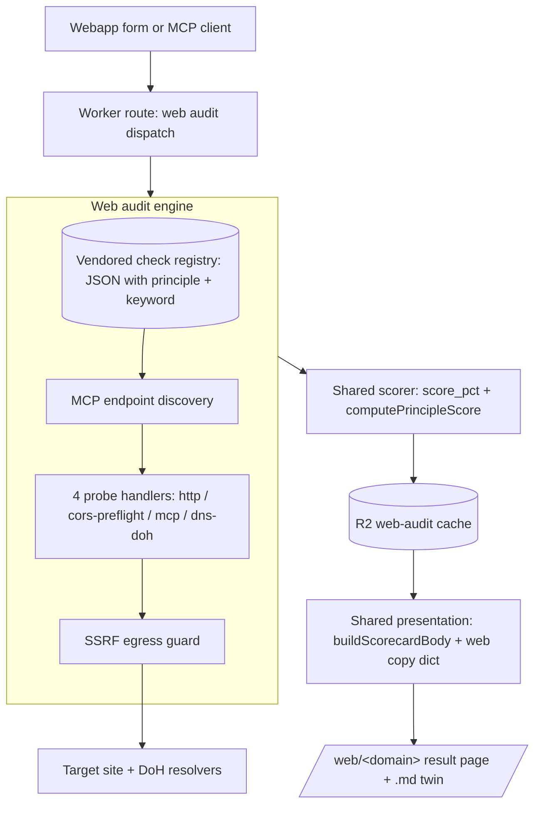
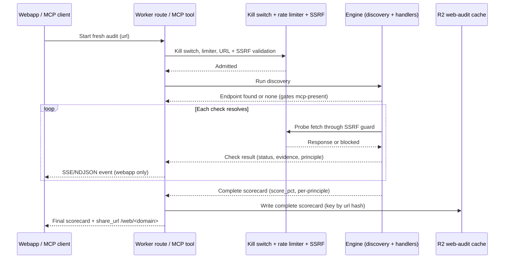

Product Contract preservation: n/a (solo bootstrap; no upstream requirements doc).

## Summary

anc.dev today audits CLI tools for agent-readiness. This adds a second audit mode: auditing WEBSITES and their MCP
servers against the same eight principles, delivered as both a direct webapp form and a set of MCP tools. The web audit
runs entirely in-Worker as pure network probes (HTTP, JSON-RPC over streamable-HTTP, CORS, DNS-over-HTTPS) with no
container and no Durable Object, streams per-check results to the browser and MCP clients as each check resolves, caches
the complete scorecard to R2, and renders through the existing shared scorecard presentation. The site repositions from
"agent-native CLI standard" to a unified "agent-readiness auditor" spanning CLI and web.

---

## Problem Frame & Scope

The site's job-to-be-done expands from "tell the reader what it means for a CLI to be agent-native and link to the
linter that measures it" to "measure agent-readiness of the two surfaces agents actually touch: CLIs and
websites/MCP-servers." The 32-check web audit (extracted from the `agent-web-audit` skill) probes MCP server shape,
MCP/agent discovery surfaces, machine-readable content surfaces, HTML affordances, crawl policy, and auth discovery.
Every check maps cleanly onto the existing P1-P8 principle taxonomy and the MUST/SHOULD/MAY keyword scale, so web
results become anc scorecards isomorphic with CLI scorecards and reuse the same presentation.

In scope (this repo, agentnative-site, only):

- In-Worker TypeScript web-audit engine (registry-driven, 4 probe handlers, MCP endpoint discovery, SSRF guard,
  orchestrator, scoring).
- Streaming audit route (SSE/NDJSON) + R2 cache + metered gate/limiter + kill switch.
- Shareable web result pages under a `/web/<domain>` namespace with markdown twins.
- A separate, curated web leaderboard.
- Presentation reuse via the shared `buildScorecardBody()`/`buildScorecardMarkdown()` with a web copy dictionary.
- Four MCP tools (audit, get, list, remediation) with progress streaming.
- Static canonical remediation docs per check plus templated evidence-injection for the MCP-shape checks.
- A separate, mirrored web scorecard JSON schema doc.
- Positioning/copy generalization across the site, routed through design skills.

Out of scope (see Scope Boundaries):

- No container or Durable Object for the web audit.
- No LLM-generated or personalized remediation prose.
- No auth-gated auditing (public URLs only, plus SSRF guards).
- No web badge.
- Skill deprecation, agentnative-skill refresh, and agentnative-spec formalization (coordinated follow-ups, not
  implemented here).

---

## Requirements

- **R1** The site runs a website agent-readiness audit entirely in-Worker as pure network probes, with no container and
  no Durable Object.
- **R2** The audit is registry-driven from a single in-repo data source that carries every check's principle (P1-P8) and
  keyword (MUST/SHOULD/MAY) fields.
- **R3** The audit implements four probe handlers (http, cors-preflight, mcp JSON-RPC, dns-doh) faithful to the
  extracted contracts.
- **R4** The audit discovers the target's MCP endpoint (well-known cards first, then common-path initialize probes)
  before running MCP-gated checks, and marks MCP-present checks `n_a` when no endpoint is found.
- **R5** All outbound probe fetches pass an SSRF guard that blocks private, loopback, link-local, and cloud-metadata
  destinations and caps redirect hops.
- **R6** The audit scores results using the anc scorecard model (`score_pct` plus per-principle scores via the shared
  scoring functions), not the skill's A-F grade.
- **R7** The audit streams per-check results to the webapp (SSE/NDJSON) as each check resolves; the MCP surface returns
  a single terminal complete scorecard (no progress notifications, per the stateless-mode constraint). The complete
  scorecard is written to R2 on completion.
- **R8** Every audit yields a cached, public, shareable result page under `/web/<domain>` with a markdown twin, rendered
  from the cached complete scorecard.
- **R9** The MCP surface exposes `audit_website` (fresh, streaming, cache+return), `get_website_audit` (cached read),
  `list_website_audits` (curated web board), and `get_web_remediation` (static remediation reader).
- **R10** Fresh web audits are gated by a kill switch and a rate limiter mirroring the existing MCP audit-tier posture
  (no anon fallback, burst limiter plus KV hourly window).
- **R11** Web results render through the shared `buildScorecardBody()`/`buildScorecardMarkdown()` using a web copy
  dictionary, with CLI-only header fields (tier, language, install, repo) omitted for web targets.
- **R12** The site publishes a separate web leaderboard page seeded from a curated web registry, kept distinct from the
  CLI leaderboard and the `/score/*` namespace.
- **R13** Failed checks surface static canonical remediation content, with the MCP-shape checks additionally injecting
  the audit's own evidence into a templated block; no generated prose.
- **R14** The site defines and publishes a separate, mirrored web scorecard JSON schema doc parallel to the CLI
  scorecard schema; agentnative-spec is untouched.
- **R15** The site repositions to a unified "agent-readiness auditor" across CLI and web (nav, hero, methodology,
  leaderboards), with all visual and typographic work routed through the design skills.
- **R16** Web audits carry no badge surface (CLI badge unchanged).
- **R17** The CLI scorecard schema doc (`content/scorecard-schema.md`) is reconciled to the current emitted
  `schema_version` (0.7), preserving the historical `Added in 0.6` field annotations, and guarded against future version
  drift.

---

## Key Technical Decisions (KTDs)

- **KTD-1: In-Worker TypeScript engine, not a container.** The web audit is pure network I/O
  (HTTP/MCP/CORS/DNS-over-HTTPS) with no binary to install, unlike the CLI live-score which must `brew install` and run
  `anc audit` inside a Sandbox container. The four handlers and all pure functions port 1:1 from the extracted Python to
  Worker `fetch()` + `JSON.parse()` + `RegExp`. This keeps cost inside the Worker request budget (no billable container
  seconds) and removes an entire failure surface. Consequence: the site already requires the Workers PAID plan
  (Containers + Durable Objects for the CLI live-score path are both paid-only bindings), so the
  1000-subrequest-per-request ceiling applies, not the free-tier 50. The real constraint is wall-clock plus subrequest
  count, not CPU: discovery + 32 checks + DoH fan-out must complete under a per-audit deadline and a per-check timeout,
  with bounded concurrency, and comfortably fits under the 1000-subrequest ceiling. (SRP: the engine is I/O only;
  scoring/presentation stay separate.)
- **KTD-2: No Durable Object, which AVOIDS the append-only DO-migration risk.** The CLI live-score path carries a
  Sandbox DO pinned at production migration tag `v1`; every wrangler push whose migration tag list is a subset of
  applied tags fails CF API 10074, and DO schema changes are append-only. The web audit introduces zero DO classes and
  zero new migration tags, so it sidesteps that class of deploy hazard entirely. R2 is the only new persistence, reusing
  the existing `SCORE_CACHE` bucket under a new `audits/web/` prefix; the CLI's 7-day expiry lifecycle is scoped to the
  `scores/` prefix only and does not apply here (see KTD-13/U6 for the web-audit cache lifecycle). (This is the single
  most important divergence from the CLI live-score architecture.)
- **KTD-3: Registry-as-data, single in-repo source (STAR).** The 32-check registry is vendored into this repo as one
  canonical data file, normalized to JSON at build time (Workers have no YAML runtime; mirror the existing
  `registry.yaml` -> `dist/registry-index.json` build pattern), with `principle` and `keyword` fields added per check.
  No cross-repo sync; the site becomes the canonical web-audit implementation. (STAR: one source for checks; DRY: the
  same data drives the engine, scoring, and remediation lookup.)
- **KTD-4: Re-express in anc vernacular; no mapping layer.** Web results are anc scorecards. The skill's tiers translate
  `required` -> MUST, `recommended` -> SHOULD, `optional` -> MAY; the skill's 7 categories become internal
  implementation labels while the P1-P8 principles are the display taxonomy. All 32 checks fit P1-P8 with zero new
  terminology (P5 has zero web checks, which is expected for stateless surfaces). The engine emits `results[]` with
  `group: "P1".."P8"`, `status`, `label`, `evidence` so the shared renderer consumes them unchanged. (DRY: no
  translation shim between engine output and presentation.)
- **KTD-5: web engine computes its own `badge.score_pct`; `computePrincipleScore` is reused only for per-principle
  rollup.** The shared presentation reads `badge.score_pct` straight from the scorecard JSON; it does not compute it
  (the shared code branches only on `fail`/`warn` for display). The web engine therefore computes `badge.score_pct`
  itself via a site-owned credit-weighting formula, using each check's `weight` from the registry and crediting MUST and
  SHOULD outcomes, with MAY checks informational only, discarding the skill's separate weighted A-F grade entirely.
  `computePrincipleScore` is reused only for the per-principle partial rollup shown in the card, not for the headline
  percentage. This web scoring formula is new site code, documented in the web schema (U14). No badge threshold is
  surfaced (no web badge). (DRY: one presentation path; the score computation itself is site-owned and single-sourced.)
- **KTD-6: Stream to webapp (SSE/NDJSON); MCP is terminal-only by construction.** The audit streams each check result to
  the webapp over SSE/NDJSON as it resolves, so a 32-check run feels live in the browser. The site's MCP server runs in
  stateless per-request mode (no `sessionIdGenerator`), which disables progress notifications entirely (`server.ts`);
  this is not a client-compatibility gap, it is a constraint of the current stateless factory. Consequently the MCP
  `audit_website` tool returns a single terminal complete scorecard with no progress streaming (confirmed decision);
  enabling MCP progress would require stateful sessions and would reintroduce the Durable Object complexity KTD-2
  deliberately avoids. The complete scorecard is written to R2 on completion; the shareable `/web/<domain>` page renders
  the cached complete scorecard statically. (SRP: streaming transport is the webapp route's concern, not the engine's;
  the engine yields results via an async iterator regardless of which surface consumes them.)
- **KTD-7: SSRF guard as a mandatory egress gate.** Every probe fetch flows through one guard that resolves the target,
  rejects private RFC1918, loopback, link-local (169.254/16, fc00::/7, fe80::/10), and cloud-metadata (169.254.169.254)
  destinations, caps redirect hops, and re-validates each redirect hop against the same blocklist to blunt
  DNS-rebinding. The audit accepts any public URL by policy; the guard is the compensating control. (SRP: one guard
  module, called by every handler; SRP-clean because handlers never fetch directly.)
- **KTD-8: Separate web leaderboard and `/web/<domain>` namespace.** Domain identity is not binary identity, so web
  results live under `/web/<domain>` (parallel to `/score/live/<binary>`) and the web leaderboard is a distinct page
  seeded from a curated web registry, distinct from the CLI `/scorecards` board and the `/score/*` namespace. The brand
  stays unified; only the URL and board namespaces separate. The web board is curated/seeded, not auto-populated from
  arbitrary audited URLs. (SRP: web cache, web routes, and web leaderboard are separate modules from their CLI
  counterparts.)
- **KTD-9: Reuse `buildScorecardBody()` via a web copy dictionary.** The shared renderer already omits CLI-only header
  fields when absent on the `tool` object (`tier`, `language`, `repo`, `install`), so a web `tool` shape of `{ name, url
  }` renders cleanly. Web-specific audience/explanatory copy is added by extending the copy dictionaries with new keys;
  no renderer branching. The CLI-specific "Reproduce locally" CTA and badge-embed sections are suppressed for web via
  existing `opts` toggles or a thin web-CTA note. (DRY: one renderer; STAR: copy lives in one dictionary.)
- **KTD-10: Separate, mirrored web scorecard JSON schema.** Consistent with the separate-leaderboard decision, the site
  publishes a web scorecard schema doc parallel to `content/scorecard-schema.md` (CLI, schema_version 0.7). The web
  schema is site-owned with its own starting version (0.1), independent of the CLI schema and of agentnative-spec. (The
  CLI doc `content/scorecard-schema.md` is stale at 0.6; that is a pre-existing incidental bug, reconciled in U17.) The
  web schema documents the web `tool` shape (`name`, `url`), the web-specific evidence fields per handler, and the
  shared `badge`/`results`/`coverage_summary`/`summary` blocks. agentnative-spec is untouched (YAGNI:
  site-owns-web-shape until a second consumer exists). (STAR: the schema doc is the single published contract for the
  web scorecard JSON.)
- **KTD-11: No web badge.** Web audits produce a score and a shareable page but no embeddable badge (websites have no
  README embedding convention, and the design system rejects badge-stamp tropes). The CLI badge surface is unchanged.
  The shared renderer's badge-embed section is suppressed for web results.
- **KTD-12: `get_web_remediation` mirrors the existing content-serving MCP tool.** The existing
  `get_spec_section`/`get_principle` tools are "dumb" readers that return static catalog content by key with a typed
  found/not-found envelope. `get_web_remediation(check_id)` mirrors that exact pattern against the static remediation
  catalog, so an MCP-only agent with no HTML-site access can still fetch the fix doc. (DRY: same reader shape, same
  envelope contract.)
- **KTD-13: Complete-only caching; partials are live-view-only.** Only a complete audit is written to R2, made shareable
  at `/web/<domain>`, and leaderboard-eligible. If a run hits the per-audit deadline, the webapp shows partial results
  marked incomplete, but nothing is persisted as a shareable result (the user retries). This keeps the cache/scorecard
  contract complete-only and avoids junk shareable pages. (Resolves the wall-time/partial Open Questions into a settled
  contract.)

---

## High-Level Technical Design

### Component / architecture diagram



### Sequence diagram: streaming fresh audit



### Principle mapping table (all 32 checks)

The engine tags each check with its principle group and keyword. The `keyword` column below is mechanically derived from
each check's source `tier` in the agent-web-audit source registry (required->MUST, recommended->SHOULD, optional->MAY)
and is not hand-typed. This table is a proposed default for the vendored registry's `principle` and `keyword` fields:
the user ratified "all 32 checks fit P1-P8, zero new terms" but not the exact per-check P-number, so the `principle`
column is tunable registry data (U1), sanity-checked but not authoritative.

| Check ID                 | Principle | Keyword |
| ------------------------ | --------- | ------- |
| mcp-initialize           | P2        | MUST    |
| mcp-capabilities         | P2        | SHOULD  |
| mcp-tools-list           | P2        | MUST    |
| mcp-unknown-method       | P4        | SHOULD  |
| mcp-get-fast-fail        | P4        | SHOULD  |
| mcp-cors-preflight       | P6        | SHOULD  |
| mcp-cors-actual          | P6        | SHOULD  |
| well-known-mcp-card      | P8        | SHOULD  |
| mcp-usage-doc            | P8        | MAY     |
| llms-txt                 | P2        | SHOULD  |
| llms-full-txt            | P2        | MAY     |
| openapi                  | P2        | SHOULD  |
| json-schemas             | P2        | MAY     |
| accept-markdown          | P2        | MAY     |
| root-meta-description    | P3        | SHOULD  |
| root-link-rel            | P3        | SHOULD  |
| noscript-fallback        | P1        | SHOULD  |
| schema-org-jsonld        | P2        | MAY     |
| semantic-html            | P3        | MAY     |
| robots                   | P7        | SHOULD  |
| sitemap                  | P7        | MAY     |
| robots-ai-rules          | P7        | SHOULD  |
| content-signals          | P7        | SHOULD  |
| security-txt             | P4        | MAY     |
| web-bot-auth             | P6        | MAY     |
| link-headers             | P3        | SHOULD  |
| api-catalog              | P8        | MAY     |
| a2a-agent-card           | P8        | MAY     |
| agent-skills             | P8        | MAY     |
| dns-aid                  | P8        | MAY     |
| oauth-discovery          | P1        | MAY     |
| oauth-protected-resource | P1        | MAY     |

Distribution: P1: 3, P2: 9, P3: 4, P4: 3, P5: 0, P6: 3, P7: 4, P8: 6 (sums to 32). Keyword counts are the real
mechanical tiers from the source registry: MUST (required) 2, SHOULD (recommended) 15, MAY (optional) 15.

---

## Output Structure

New files and directories this feature creates (repo-relative):

```text
src/
  data/
    web-audit/
      registry.yaml                 # vendored 32-check registry + principle/keyword fields (STAR source)
  build/
    13-web-audit-registry.mjs       # normalize registry.yaml -> dist/_internal/web-audit-registry.json
    14-web-scorecards-emit.mjs      # emit curated web result pages + web leaderboard from seed audits
    web-leaderboard-render.mjs      # buildWebLeaderboardBody (separate from scorecards-render.mjs)
  worker/
    audit-web/
      engine.ts                     # orchestrator: discovery + handler dispatch + async result iterator
      discovery.ts                  # MCP endpoint discovery
      handlers/
        http.ts                     # http probe handler
        cors-preflight.ts           # cors-preflight probe handler
        mcp.ts                      # mcp JSON-RPC probe handler
        dns-doh.ts                  # dns-over-https probe handler
      assert.ts                     # pure assert_http port
      ssrf.ts                       # SSRF egress guard
      scorecard.ts                  # map engine results -> anc scorecard shape (group/status/evidence)
      cache.ts                      # R2 read/write; key: audits/web/<url-hash>/<SPEC_VERSION>.json
      registry.ts                   # in-isolate registry loader (per-isolate singleton)
      route.ts                      # /api/audit-web streaming dispatch + /web/<domain> result page
      copy.ts                       # web audience/CTA copy dictionary
    mcp/
      tools/
        web-audit.ts                # audit_website, get_website_audit, list_website_audits
        web-remediation.ts          # get_web_remediation (mirrors get_spec_section)
content/
  web-scorecard-schema.md           # mirrored web scorecard JSON schema doc
  remediation/
    web/                            # static canonical remediation docs, one per check id
      mcp-initialize.md
      ...                           # (one per check; MCP-shape checks carry an evidence-template block)
  web-audit.md                      # "Audit your website" landing/how-to page (+ .md twin auto)
tests/
  web-audit-assert.test.ts
  web-audit-handlers.test.ts
  web-audit-ssrf.test.ts
  web-audit-discovery.test.ts
  web-audit-scoring.test.ts
  web-audit-scorecard-format.test.ts
  web-audit-cache.test.ts
  web-audit-routes.test.ts
  web-audit-mcp-tools.test.ts
  web-remediation.test.ts
e2e/
  web-audit.spec.ts                 # streaming form + result page + markdown twin
```

---

## Implementation Units

### Phase A: Engine

### U1. Vendor and normalize the check registry as the single in-repo source

- **Goal:** Establish one canonical in-repo data file for all 32 checks, carrying `principle` and `keyword` fields,
  normalized to JSON at build time for Worker consumption.
- **Requirements:** R2, R6.
- **Dependencies:** none.
- **Files:** `src/data/web-audit/registry.yaml`, `src/build/13-web-audit-registry.mjs`,
  `tests/web-audit-scoring.test.ts` (registry shape assertions), emits `dist/_internal/web-audit-registry.json`.
- **Approach:** Port the extracted registry (32 checks, 4 handler types, `mcp_discovery` config with `protocol_version:
  "2025-06-18"`, per-check `weight`, `title`, `hint`, `applies_to`, `with`) into `registry.yaml`. Add a `principle`
  (P1-P8) field per the mapping table above, plus each check's source `tier` (required/recommended/optional). The build
  step derives `keyword` mechanically from `tier` (required->MUST, recommended->SHOULD, optional->MAY) rather than
  accepting a hand-authored `keyword` value, and asserts there is no hand-authored keyword drift. Both `keyword` and
  `principle` are tunable registry data, not fixed contracts. Add a build step mirroring `src/build/registry-index.mjs`
  (js-yaml load -> JSON writeFile) that emits `dist/_internal/web-audit-registry.json`; wire it into the build
  orchestrator alongside the other `dist/_internal/*.json` projections. The engine and remediation catalog both read
  this one source (STAR/DRY).
- **Execution note:** none (pure data + build-time transform).
- **Patterns to follow:** `src/build/registry-index.mjs` (yaml -> JSON emit), `dist/_internal/mcp-catalog.json`
  (per-isolate JSON projection).
- **Test scenarios:** happy: every check has id/category/tier/principle/keyword/handler/weight/title/hint -> validate ->
  all present and principle in P1-P8, keyword in {must,should,may}. edge: tier `optional` maps to keyword `may` for all
  15 -> validate -> consistent. error: a check missing `principle` -> build validation -> aborts with a named error; a
  check whose derived keyword would differ from any hand-authored value -> build assertion -> aborts (no keyword drift).
  integration: normalized JSON round-trips to 32 entries -> load in test -> count is 32, and
  required/recommended/optional counts are exactly 2/15/15 -> derived MUST/SHOULD/MAY counts match.
- **Verification:** `dist/_internal/web-audit-registry.json` contains 32 checks each with a valid principle and keyword;
  build fails loudly on any missing/invalid field.

### U2. Pure assertion + JSON-RPC parse port

- **Goal:** Port the pure `assert_http`, `parse_jsonrpc`, and grade-free helpers to TypeScript with byte-faithful regex
  and status semantics.
- **Requirements:** R3.
- **Dependencies:** U1.
- **Files:** `src/worker/audit-web/assert.ts`, `tests/web-audit-assert.test.ts`.
- **Approach:** Implement `assertHttp(expect, response)` covering `status` (membership), `content_type`
  (case-insensitive regex), `header_present`, `header_regex` (name + pattern), and `body_regex` (multiline,
  case-insensitive). Implement `parseJsonRpc(response)` handling both `application/json` and `text/event-stream`
  (extract first `data:` line, `JSON.parse`). Lowercase all header keys at the boundary. No I/O in this module.
- **Execution note:** test-first (pure logic with subtle regex-flag semantics; fixtures pin behavior).
- **Patterns to follow:** the extracted `assert_http`/`parse_jsonrpc` contracts; existing pure-function test style in
  `tests/*.test.ts`.
- **Test scenarios:** happy: `{status:[200], body_regex:"^#|\\]\\(https"}` against a 200 llms.txt body -> assert -> pass
  with reasons. edge: `Accept: text/markdown;q=0.1` style multi-value header regex -> assert -> matches by regex not
  substring. error: response with network error dict (`status:null`) -> assert -> fail immediately with error reason.
  integration: event-stream body with `data: {json}` -> parseJsonRpc -> returns parsed object; malformed body -> returns
  null.
- **Verification:** assertion outcomes match the extracted fixtures for every case; SSE and plain-JSON both parse.

### U3. SSRF egress guard

- **Goal:** Provide one mandatory guard that every probe fetch passes through, blocking
  private/loopback/link-local/cloud-metadata destinations and capping redirect hops.
- **Requirements:** R5.
- **Dependencies:** U1.
- **Files:** `src/worker/audit-web/ssrf.ts`, `tests/web-audit-ssrf.test.ts`.
- **Approach:** Expose a `guardedFetch(url, init, deadline)` that: enforces HTTPS/HTTP-only scheme; canonicalizes the
  host to a normalized IP BEFORE range-checking (parse decimal, octal, and hex IP literal forms, dotted-quad forms,
  `0.0.0.0`, IPv4-mapped IPv6 forms like `[::ffff:a.b.c.d]`, and CGNAT `100.64.0.0/10`); range-checks the
  canonicalized/normalized IP, not just the raw hostname string; rejects non-public hostnames; sets `redirect: "manual"`
  and follows at most a fixed hop cap (e.g., 3-5), re-validating each `Location` target through the same
  canonicalization + range-check before the next hop; and wraps the fetch in an `AbortController` deadline. Blocklist
  enumerates: private RFC1918 (10.0.0.0/8, 172.16.0.0/12, 192.168.0.0/16), loopback (127.0.0.0/8, ::1), link-local
  (169.254.0.0/16, fe80::/10), unique-local (fc00::/7), CGNAT (100.64.0.0/10), and cloud metadata (169.254.169.254).
  Reject literal IP hosts that fall in any range (after canonicalization) and reject hostnames that resolve there where
  determinable; explicitly document the DNS-rebinding residual (Workers cannot pre-resolve, so per-hop revalidation plus
  the metadata-IP block is the compensating control, and canonicalization closes the encoding-bypass gap but not the
  rebinding gap). Every handler calls `guardedFetch`, never `fetch` directly (SRP).
- **Execution note:** test-first (security boundary; malicious-input coverage is the point).
- **Patterns to follow:** `hostnameAllowed()` in `src/worker/score/do.ts` (allowlist-style matcher, inverted here to a
  blocklist); `redirect: "manual"` guidance from the porting notes.
- **Test scenarios:** happy: `https://example.com/` -> guardedFetch -> allowed. edge: `http://[::1]/`,
  `http://127.0.0.1/`, `http://169.254.169.254/latest/meta-data/`, `http://10.1.2.3/`, `http://192.168.0.5/`,
  `http://metadata.google.internal/` -> guardedFetch -> each blocked with a typed reason; one case per encoding class --
  decimal IP (`http://2130706433/` for 127.0.0.1), octal IP (`http://0177.0.0.1/`), hex IP (`http://0x7f.0.0.1/`),
  `http://0.0.0.0/`, IPv4-mapped IPv6 (`http://[::ffff:127.0.0.1]/`), and CGNAT (`http://100.64.0.1/`) -> guardedFetch
  -> each canonicalized then blocked; an alt-metadata host (`http://metadata.google.internal/`) -> guardedFetch ->
  blocked. error: a 200 that 302-redirects to `http://169.254.169.254/` -> guardedFetch -> blocked at the redirect hop,
  not followed. integration: hop count exceeding the cap -> guardedFetch -> aborted; deadline exceeded -> aborted.
- **Verification:** every enumerated malicious target is blocked; a redirect into a blocked range is refused mid-chain;
  the public happy path still succeeds.

### U4. Probe handlers (http, cors-preflight, mcp, dns-doh)

- **Goal:** Implement the four probe handlers faithful to the extracted contracts, each fetching only through the SSRF
  guard.
- **Requirements:** R3, R5.
- **Dependencies:** U2, U3.
- **Files:** `src/worker/audit-web/handlers/http.ts`, `src/worker/audit-web/handlers/cors-preflight.ts`,
  `src/worker/audit-web/handlers/mcp.ts`, `src/worker/audit-web/handlers/dns-doh.ts`,
  `tests/web-audit-handlers.test.ts`.
- **Approach:** `http` resolves `path` or first `path_any` candidate, issues the method with headers under a per-check
  timeout, and evaluates via `assertHttp`; never follows redirects silently (guarded manual). `cors-preflight` issues
  OPTIONS with Origin/ACRM/ACRH and passes on 200/204 + present `Access-Control-Allow-Origin`. `mcp` builds the JSON-RPC
  payload per op (`initialize`/`tools-list`/`error`) with `Accept: application/json, text/event-stream` and
  `protocolVersion: 2025-06-18`, parses via `parseJsonRpc`, and evaluates serverInfo/capabilities/tools/error-code/CORS
  assertions; returns `n_a` when no endpoint discovered. `dns-doh` substitutes `{host}`, queries DoH resolvers with
  `Accept: application/dns-json`, passes on `Status:0` with non-empty `Answer[]`, treats `Status:3` as
  definitive-absent, and falls back resolvers only on resolver-level failure. Each handler returns a uniform `{ status,
  evidence[] }` with handler-specific evidence fields.
- **Execution note:** test-first (handler contracts are load-bearing; the audit's correctness rests here).
- **Patterns to follow:** the extracted handler request-flows and evidence structures; `guardedFetch` from U3 for all
  egress.
- **Test scenarios:** happy: http handler on a stubbed 200 `/llms.txt` -> run -> pass with url+status evidence; mcp
  initialize on a stubbed serverInfo response -> run -> pass recording serverInfo/protocolVersion/capabilities. edge:
  http `path_any` where the second candidate matches -> run -> pass on second; cors-preflight 204 with ACAO -> run ->
  pass; dns-doh first name NXDOMAIN, second name Status:0 -> run -> pass. error: mcp with no discovered endpoint -> run
  -> `n_a`; dns-doh all resolvers network-fail -> run -> fail with reasons. integration: mcp against an SSE
  (`text/event-stream`) tools/list -> run -> parses tools array + input-schema count.
- **Verification:** each handler reproduces the extracted pass/fail/na outcomes for representative inputs; all egress is
  routed through the guard.

### U5. Discovery + orchestrator + scoring

- **Goal:** Run MCP endpoint discovery, dispatch all applicable checks concurrently under a deadline yielding results as
  they resolve, and produce an anc scorecard.
- **Requirements:** R1, R4, R6, R7.
- **Dependencies:** U1, U4.
- **Files:** `src/worker/audit-web/discovery.ts`, `src/worker/audit-web/engine.ts`, `src/worker/audit-web/scorecard.ts`,
  `tests/web-audit-discovery.test.ts`, `tests/web-audit-scoring.test.ts`.
- **Approach:** `discovery.ts` probes `mcp_discovery.well_known` cards first (extract
  `mcp_endpoint`/`url`/`transport.endpoint`), then POSTs `initialize` to `common_paths`, returning `(endpoint|null,
  evidence[])`. `engine.ts` exposes an async iterator that runs discovery, then fans out checks with bounded concurrency
  under a per-audit deadline and a per-check timeout, gating `applies_to: mcp-present` to `n_a` when no endpoint, and
  yields each `{ id, principle, status, evidence }` as it resolves (this is the streaming source; transport is the
  route's concern per KTD-6). `scorecard.ts` maps engine results into the anc scorecard shape: each result becomes a
  `results[]` row with `group` = the check's principle, `status` in the site's status vocabulary
  (`pass`/`fail`/`n_a`/`skip`, mapping internal error/timeout states to `skip` or `error`), `label` = check title,
  `evidence` = a compact human string derived from the evidence object. Because the shared presentation only reads
  `badge.score_pct` from the JSON and never computes it, `scorecard.ts` itself computes `badge.score_pct` via a new,
  site-owned credit-weighting formula driven by each check's registry `weight`, crediting MUST and SHOULD outcomes with
  MAY treated as informational only; this formula is new site code, not a port of the skill's A-F grade.
  `computePrincipleScore` is reused only to produce the per-principle partial/rollup shown in the card, not the headline
  percentage. `coverage_summary`/`summary` are derived consistent with the CLI scorecard shape.
- **Execution note:** test-first (discovery gating and score derivation are correctness-critical).
- **Patterns to follow:** the extracted discovery algorithm and scoring rollup;
  `computePrincipleScore`/`extractTopIssues` semantics in `src/shared/scorecard-format.mjs`.
- **Test scenarios:** happy: well-known card exposing `mcp_endpoint` -> discovery -> returns endpoint, mcp-present
  checks run. edge: no card, `initialize` succeeds on `/mcp` common path -> discovery -> endpoint found via probe; no
  endpoint anywhere -> mcp-present checks emit `n_a` and are excluded from score. error: a single check throws/times out
  -> engine -> that check yields `error`/`skip`, the run still completes and scores. integration: full stubbed 32-check
  run -> engine+scorecard -> `results[]` grouped by P1-P8, `score_pct` matches a hand-computed MUST+SHOULD rollup.
- **Verification:** discovery gates MCP checks correctly; the produced scorecard is structurally identical to a CLI
  scorecard (same `badge`/`results`/`coverage_summary` shape) and scores via the shared model.

### Phase B: Surface / API

### U6. R2 web-audit cache

- **Goal:** Read/write the complete web scorecard to R2 under a stable, collision-safe key derived from the normalized
  URL.
- **Requirements:** R7, R8.
- **Dependencies:** U5.
- **Files:** `src/worker/audit-web/cache.ts`, `tests/web-audit-cache.test.ts`.
- **Approach:** Mirror `src/worker/score/cache.ts`. Key shape `audits/web/<url-hash>/<SPEC_VERSION>.json` where
  `<url-hash>` is a hex SHA-256 of the normalized URL (lowercased host, canonical scheme, no fragment, normalized
  trailing slash) computed via `crypto.subtle`, plus a stored `target_url` field so the result page can display and the
  `/web/<domain>` route can cross-check. The cache is complete-only per KTD-13: only a complete scorecard is ever
  written; a run that hits the per-audit deadline is never persisted here (the webapp shows its partial results live but
  does not cache them). Refuse-to-cache-half-state on missing required fields; best-effort writes (log, never throw).
  Reuse the existing `SCORE_CACHE` R2 bucket (no new binding). The existing 7-day expiry lifecycle is prefix-scoped to
  `scores/` and configured out-of-band (not in wrangler.jsonc); the new `audits/web/` prefix does NOT inherit it and
  defaults to no expiry (an out-of-band lifecycle rule for `audits/web/` may be added later if a window is wanted).
  Provide `keyFor(url)` and `get`/`put` with the same discipline as the CLI cache.
- **Execution note:** none (data wrapper; behavior verified by tests but not a novel algorithm).
- **Patterns to follow:** `src/worker/score/cache.ts` (key derivation, half-state refusal, best-effort writes,
  malformed-entry delete).
- **Test scenarios:** happy: put then get a complete scorecard -> round-trips. edge: two URLs differing only by trailing
  slash normalize to the same key -> get -> single entry (no collision, no split). error: put with an empty spec_version
  -> throws (half-state refusal). integration: corrupted stored JSON -> get -> returns null and best-effort deletes.
- **Verification:** normalized-URL keys are deterministic and collision-safe; reads survive corrupted entries; writes
  never throw to the caller.

### U7. Streaming audit route + metered gate + kill switch + limiter

- **Goal:** Add the `/api/audit-web` streaming dispatch that admits a request through kill switch, limiter, and SSRF
  validation, runs the engine, streams per-check SSE/NDJSON, and writes the cache on completion.
- **Requirements:** R1, R5, R7, R10.
- **Dependencies:** U3, U5, U6.
- **Files:** `src/worker/audit-web/route.ts`, `src/worker/index.ts` (dispatch wiring), `wrangler.jsonc` (new limiter +
  kill-switch binding), `tests/web-audit-routes.test.ts`.
- **Approach:** Add an `isWebAuditPath()` check to the dispatch in `src/worker/index.ts` above the asset-first fallback
  (mirroring how `isScorePath` and the `/mcp` branch sit above `env.ASSETS.fetch`). The web-audit handler receives an
  `ExecutionContext ctx` third parameter, threaded from `fetch(request, env, ctx)` at the dispatch site (mirroring how
  the `/mcp` branch already forwards `ctx` at `index.ts:481`; `handleScore`/`handleLiveScorePage` currently do not
  receive it, and this route is the second handler to need it). The route: reads `WEB_AUDIT_ENABLED` (kill switch; falsy
  -> 503 Retry-After); validates and normalizes the URL and runs the SSRF guard pre-flight; checks `WEB_AUDIT_LIMITER`
  burst plus a KV hourly window keyed on `cf-connecting-ip` with no anon fallback (mirroring the audit-tier posture in
  `scorecard-audit.ts`); on cache hit returns the cached scorecard; on miss tees the engine's async iterator into two
  branches -- one streams SSE/NDJSON events to the client as each check resolves, the other accumulates the complete
  scorecard -- and wraps the R2 write in `ctx.waitUntil(...)` so a client disconnect mid-stream still caches the
  completed result (per KTD-13, only if the run actually completes; a deadline-exceeded run is still never cached). The
  response includes a `share_url` of `/web/<domain>` once cached. Add `WEB_AUDIT_LIMITER` to `ratelimits` (a fresh
  `namespace_id`, `simple:{limit:5,period:60}`) in both prod and `env.staging`, and add `WEB_AUDIT_ENABLED` to the `Env`
  interface as an optional secret-backed kill switch covering both the webapp route and the MCP fresh path; the MCP path
  additionally respects the existing global `MCP_ENABLED`. Define the feature's two contracts explicitly: the
  `/api/audit-web` POST request body is `{ url }`; the SSE/NDJSON event schema is a per-check event `{ id, principle,
  keyword, status, evidence }` followed by a terminal `{ scorecard, share_url }` event.
- **Execution note:** test-first for the gate ordering and SSRF pre-flight; the streaming happy path is covered by the
  e2e unit (U16).
- **Patterns to follow:** the `/mcp` and `isScorePath` dispatch blocks in `src/worker/index.ts`; the kill-switch + burst
- KV-hourly + no-anon posture in `src/worker/mcp/tools/scorecard-audit.ts`; `consumeHourlyBudget` in the same file.
- **Test scenarios:** happy: enabled, under limit, cache miss -> route -> streams events then final scorecard +
  share_url. edge: cache hit -> route -> returns cached scorecard without re-running; client disconnects mid-stream
  after the engine still completes -> route -> the `ctx.waitUntil`-wrapped R2 write still lands and the result is cached
  and shareable. error: kill switch off -> 503 Retry-After; missing `cf-connecting-ip` -> gated error (no anon
  fallback); private-URL input -> rejected by SSRF pre-flight. integration: limiter breach -> gated error envelope;
  dispatch precedence -> `/api/audit-web` handled before asset-first fallback.
- **Verification:** the gate chain matches the CLI audit-tier posture; blocked URLs never reach the engine; the stream
  terminates with a cached, shareable result; a mid-stream client disconnect does not prevent the completed result from
  being cached.

### U8. Shareable `/web/<domain>` result page + markdown twin

- **Goal:** Serve the cached complete web scorecard at `/web/<domain>` (and `.md` twin) through the shared renderer.
- **Requirements:** R8, R11.
- **Dependencies:** U6, U9.
- **Files:** `src/worker/audit-web/route.ts` (result-page handler), `src/worker/index.ts` (route wiring + `.html` ->
  canonical 301), `tests/web-audit-routes.test.ts`.
- **Approach:** Add a `parseWebResultPath()` with a strict domain-slug regex (bounded length, no path traversal,
  lowercased) mirroring `parseLiveScorePath`. On GET, look up the cached scorecard by the normalized URL for that
  domain, 404 with a "not audited yet" body on miss, and on hit call `buildScoreWebSummaryBody`/`Markdown` (thin
  wrappers over the shared renderer, parallel to `summary-render.ts`) with the web `tool` shape and web copy.
  Content-negotiate HTML vs markdown via the existing `detectPreference`; the `.md` suffix always wins; 301 the `.html`
  form to the canonical path. Set `noindex` on the result page headers (like the live-score page).
- **Execution note:** test-first for path parsing and content negotiation; visual output verified via the design unit
  (U11) and e2e (U16).
- **Patterns to follow:** `src/worker/score/summary-render.ts` (`parseLiveScorePath`, shell-template substitution,
  HTML/markdown headers, not-found rendering); the `/score/live/<binary>.html` -> canonical 301 in
  `src/worker/index.ts`.
- **Test scenarios:** happy: `/web/example.com` with a cached scorecard -> handler -> 200 HTML rendered via shared body.
  edge: `/web/example.com.md` -> handler -> 200 markdown twin; `Accept: text/markdown` on the suffix-less path ->
  markdown. error: `/web/example.com` with no cache -> 404 "not audited yet"; malformed domain slug -> null (falls
  through). integration: `/web/example.com.html` -> 301 to `/web/example.com`.
- **Verification:** the result page renders the cached scorecard through the shared renderer with a markdown twin,
  content negotiation matches the rest of the site, and unaudited domains 404 cleanly.

### Phase C: Presentation & IA

### U9. Web presentation wrappers + copy dictionary

- **Goal:** Provide thin web-specific wrappers over the shared renderer plus a web copy dictionary, with CLI-only fields
  omitted and the badge/reproduce sections suppressed for web.
- **Requirements:** R11, R16.
- **Dependencies:** U5.
- **Files:** `src/worker/audit-web/copy.ts`, `src/worker/audit-web/route.ts` (wrapper builders) or a dedicated
  `src/worker/audit-web/summary-render.ts`, `src/shared/scorecard-format.mjs` (extend copy dictionaries with web keys
  only), `tests/web-audit-scorecard-format.test.ts`.
- **Approach:** Build the web `tool` object as `{ name: domain, url }` so the shared header emits only the URL link
  (tier/language/repo/install are absent and already conditionally skipped). Add web audience/explanatory keys to the
  copy dictionaries in the shared module (additive; no existing-key changes, no renderer branching). Suppress the CLI
  badge-embed and "Reproduce locally" CTA for web by passing a web CTA note via the existing `ctaNoteHtml` opt and
  relying on `badge.eligible` being unset/false (no web badge, KTD-11); if a cleaner suppression is needed, add a
  minimal `opts` toggle rather than fork the renderer. Verify the web scorecard shape flows through
  `buildScorecardBody`/`buildScorecardMarkdown` without CLI-specific breakage.
- **Execution note:** none for the wrapper logic; any visual tuning routes through U11's design skills.
- **Patterns to follow:** `src/worker/score/summary-render.ts` (thin wrappers, breadcrumb/CTA overrides via opts); the
  conditional header-field rendering in `buildScorecardBody` (lines that emit `tier`/`language`/`repo`/`url` only when
  present).
- **Test scenarios:** happy: web scorecard `{ tool:{name,url}, badge, results, coverage_summary }` -> buildScorecardBody
  -> renders header URL, score badge, P1-P8 groups, no tier/language/install rows. edge: web audience key present ->
  renderAudienceBanner -> web copy shown; no badge section emitted for web. error: web tool missing `url` -> renders
  name-only header without throwing. integration: markdown twin for the same web scorecard -> buildScorecardMarkdown ->
  parallel structure, principle links absolute.
- **Verification:** the shared renderer consumes web scorecards unchanged, CLI-only chrome is absent, no web badge
  appears, and copy is sourced from one dictionary.

### U10. Web leaderboard + curated web registry seed

- **Goal:** Publish a separate curated web leaderboard page seeded from a small web registry, distinct from the CLI
  board and `/score/*` namespace.
- **Requirements:** R12.
- **Dependencies:** U6, U9.
- **Files:** `src/build/web-leaderboard-render.mjs`, `src/build/14-web-scorecards-emit.mjs`, a web seed list (curated
  entries; e.g. `src/data/web-audit/seed.yaml`), `src/styles/site.css` (leaderboard variant classes, routed through
  design), `tests/web-audit-scorecard-format.test.ts` (leaderboard body shape).
- **Approach:** Create `buildWebLeaderboardBody()` parallel to `buildLeaderboardBody()` but with web columns (domain,
  URL, score, principles) and no tier/language columns and no "ANC 100" CLI hero. Seed the board from a curated web
  registry (the web board is curated, not auto-populated from arbitrary audited URLs per KTD-8), rendering each seed's
  committed web scorecard. Curated web leaderboard entries are build-time static pages committed to the repo,
  independent of R2, so they never expire regardless of the R2 lifecycle applied to on-demand audits (U6); on-demand
  user audits live in R2 only. Route the page at a distinct URL (e.g. `/web` or `/web-scorecards`) separate from
  `/scorecards`. Emit per-seed result pages at build time so curated web entries have canonical pages parallel to
  `/score/<slug>`, and cross-link from the web leaderboard.
- **Execution note:** none for structure; column/spacing/visual choices route through U11's design skills.
- **Patterns to follow:** `src/build/scorecards-render.mjs` (`buildLeaderboardBody`, tier-count/eligible-count
  derivation), `src/build/08-scorecards-emit.mjs` (per-tool emission orchestration).
- **Test scenarios:** happy: a seed list of web entries -> buildWebLeaderboardBody -> table rows with domain + score +
  principles, no tier/lang columns. edge: empty seed list -> renders an empty-state, not a broken table. error: a seed
  entry missing its scorecard -> excluded with a build warning (mirrors CLI loadScoredTools). integration: web
  leaderboard URL is distinct from `/scorecards` and links to `/web/<domain>` pages.
- **Verification:** a curated web leaderboard renders at its own URL with web-appropriate columns and links to
  per-domain result pages; the CLI board is unchanged.

### U11. Positioning and copy generalization (design-orchestration unit)

- **Goal:** Reposition the site to a unified "agent-readiness auditor" across CLI and web (nav, hero, methodology, audit
  landing, both leaderboards), producing the visual and typographic changes through the design skills rather than ad-hoc
  CSS.
- **Requirements:** R15.
- **Dependencies:** U8, U10.
- **Files:** `content/_intro.md`, `content/_use.md`, `content/audit.md`, `content/web-audit.md` (new),
  `src/build/shell.mjs` (nav + footer), `src/build/06-homepage.mjs` (hero + entry), methodology content,
  `src/styles/site.css` and `src/styles/foundation.css` (only via the skills below). Test expectation: none for the
  prose/IA edits; the design changes are verified by the design-skill sign-off and the e2e smoke.
- **Approach:** Generalize the hero lede and use-case copy from "CLI tools are how AI agents touch everything else" to
  cover both CLI and web surfaces; add a web audit entry (form or card) and a `/web-audit` how-to page; add nav entries
  for the web audit and web leaderboard; update methodology to document the web audit layers (in-Worker probes,
  discovery, principle mapping). This is a design-orchestration unit, not a CSS-writing unit: route all typography and
  contrast work through `/typeset`, all spacing/hierarchy/anti-pattern work through `/design-review`, and the overall
  interface pass through `/impeccable` (which loads the project's PRODUCT.md/DESIGN.md banned-pattern list). No direct
  CSS edits from taste, even one-liners (project rule). The redesign must clear the banned-pattern audit (no
  dashboard/landing tropes, no AI-slop palette).
- **Execution note:** smoke/design-skill verification (no test scenarios; correctness is a design-quality judgment
  enforced by the skills).
- **Patterns to follow:** existing positioning in `content/_intro.md`; nav/footer structure in `src/build/shell.mjs`;
  the mandatory design-skill routing recorded in PRODUCT.md.
- **Test scenarios:** none -- design-orchestration unit; visual correctness is verified by `/typeset`, `/design-review`,
  and `/impeccable` sign-off plus the e2e smoke, not unit tests.
- **Verification:** the unified positioning ships, both audit modes are discoverable from nav and home, methodology
  documents the web layers, and every visual change carries a design-skill sign-off with no banned patterns.

### Phase D: MCP

### U12. MCP web-audit tools (audit_website, get_website_audit, list_website_audits)

- **Goal:** Register the three primary web-audit MCP tools with the audit-tier gate posture; `audit_website` returns a
  single terminal complete scorecard (no progress streaming, per the stateless-mode constraint).
- **Requirements:** R7, R9, R10.
- **Dependencies:** U5, U6, U7.
- **Files:** `src/worker/mcp/tools/web-audit.ts`, `src/worker/mcp/tools/index.ts` (registration wiring),
  `src/worker/mcp/tools/index.ts` `RegisterToolsEnv` (extend with the web-audit env),
  `tests/web-audit-mcp-tools.test.ts`.
- **Approach:** `get_website_audit(url)` is the cheap read path: normalize+SSRF-validate the URL, R2 cache lookup,
  return `{ found:true, scorecard, share_url }` on hit or `{ found:false, next_tool:"audit_website" }` on miss (cache
  state is data, not failure; `isError:false`). `audit_website(url)` is the metered fresh path mirroring `score_cli`:
  kill switch (`WEB_AUDIT_ENABLED`, plus the existing global `MCP_ENABLED`), URL validation + SSRF, `cf-connecting-ip`
  presence (no anon fallback -> -32099), `WEB_AUDIT_LIMITER` burst + KV hourly window, run the engine, and return a
  single terminal complete scorecard + `share_url` -- no progress notifications, because the site's MCP server runs in
  stateless per-request mode which disables them (per KTD-6). `list_website_audits()` returns the curated web board
  summaries from the seed registry. Register all three via `registerWebAuditTools()` added to `registerTools()` in the
  aggregator.
- **Execution note:** test-first for the gate ordering and typed envelopes; the terminal-only fresh path is
  smoke-verified against an MCP client in e2e.
- **Patterns to follow:** `src/worker/mcp/tools/scorecard-audit.ts` (`score_cli` gate chain, `jsonRpcError32099`,
  `consumeHourlyBudget`, typed-state responses) and `src/worker/mcp/tools/scorecard-read.ts` (`get_scorecard`
  cache-state-as-data envelopes); `registerTools()` in `src/worker/mcp/tools/index.ts`.
- **Test scenarios:** happy: `get_website_audit` cache hit -> `{found:true, scorecard, share_url}`; `audit_website`
  enabled + under limit + miss -> runs, caches, returns final scorecard with no progress notifications. edge:
  `get_website_audit` miss -> `{found:false, next_tool:"audit_website"}`; `audit_website` cache hit -> returns cached
  without re-running. error: kill switch off -> disabled message; missing `cf-connecting-ip` -> -32099; SSRF-blocked URL
  -> isError:true typed reason. integration: `list_website_audits` -> curated board summaries; three tools appear in
  `tools/list` in registration order.
- **Verification:** the three tools honor the audit-tier posture (no anon fallback, burst + hourly), return
  cache-state-as-data envelopes, and `audit_website` returns a single terminal complete scorecard on the fresh path (no
  progress notifications).

### U13. get_web_remediation MCP tool + static remediation catalog

- **Goal:** Serve static per-check remediation content by check id through a reader tool that mirrors the existing
  content-serving tool, with evidence-templated guidance for the MCP-shape checks.
- **Requirements:** R9, R13.
- **Dependencies:** U1, U12.
- **Files:** `src/worker/mcp/tools/web-remediation.ts`, `content/remediation/web/*.md` (one per check id), a build step
  to project the remediation catalog into `dist/_internal/` (extend U1's build step or add a sibling),
  `tests/web-remediation.test.ts`.
- **Approach:** Author one static canonical remediation doc per check id (DRY: reused across all audits), each keyed by
  check id and carrying the fix guidance from the check's `hint` plus a fuller how-to. For the MCP-shape checks
  (initialize, tools-list, unknown-method, get-fast-fail, cors-preflight, cors-actual, capabilities), include an
  evidence-template block the audit fills from that run's evidence (the audit personalizes by selecting/ordering failed
  checks and injecting evidence inline; no generated prose per KTD/Round-4). Project the catalog into a
  `dist/_internal/web-remediation.json` keyed by check id, loaded per-isolate. `get_web_remediation(check_id)` mirrors
  `get_spec_section`: return `{ found:true, remediation }` or `{ found:false, message }` (both `isError:false`), so an
  MCP-only agent without HTML-site access can read the fix.
- **Execution note:** test-first for the reader tool's found/not-found envelope; content is prose (no scenarios beyond
  lookup).
- **Patterns to follow:** `src/worker/mcp/tools/spec.ts` (`get_spec_section` reader shape, typed found/not-found),
  `src/worker/mcp/tools/principles.ts` (catalog-backed reader); the per-isolate catalog projection pattern.
- **Test scenarios:** happy: `get_web_remediation("mcp-initialize")` -> `{found:true, remediation}` with the fix doc.
  edge: an MCP-shape check id -> remediation carries the evidence-template block. error: unknown check id ->
  `{found:false, message}` with `isError:false`. integration: every check id in the registry has a remediation entry ->
  lookup all 32 -> no misses.
- **Verification:** every check id resolves to static remediation content; MCP-shape checks carry an evidence template;
  unknown ids return a typed not-found without error.

### Phase E: Remediation & Schema

### U14. Web scorecard JSON schema doc

- **Goal:** Define and publish a separate, mirrored web scorecard JSON schema doc parallel to the CLI scorecard schema,
  leaving agentnative-spec untouched.
- **Requirements:** R14.
- **Dependencies:** U5, U9.
- **Files:** `content/web-scorecard-schema.md` (+ `.md` twin auto), `src/build/shell.mjs` (footer link parallel to the
  CLI "Scorecard schema" link), `tests/web-audit-scorecard-format.test.ts` (shape conformance assertion).
- **Approach:** Author `content/web-scorecard-schema.md` mirroring `content/scorecard-schema.md`'s structure (CLI
  schema_version 0.7 at HEAD; the mirror anchor is 0.7, not the stale 0.6 in the CLI doc): top-level fields
  (`schema_version`, `spec_version`, `tool`, `badge`, `results`, `coverage_summary`, `summary`, plus web-specific
  `target_url`, `mcp_endpoint`, `mcp_discovery`), the web `tool` shape (`name`, `url` -- no `binary`/`install`), and the
  per-handler evidence fields (http, cors-preflight, mcp, dns-doh). State the web schema's own starting version, 0.1,
  independent of the CLI schema's 0.7 and of agentnative-spec. Document the site-owned `score_pct` credit-weighting
  formula (per KTD-5): how per-check `weight` and MUST/SHOULD credit (MAY informational) combine into `badge.score_pct`,
  since the shared presentation only reads this value and never computes it. Add a footer link so the web schema is a
  discoverable published surface. Add a test asserting a produced web scorecard conforms to the documented top-level
  fields (the doc is the contract, STAR).
- **Execution note:** none for the prose; the conformance test guards drift.
- **Patterns to follow:** `content/scorecard-schema.md` (field-by-field table, present-state prose); footer link wiring
  in `src/build/shell.mjs`.
- **Test scenarios:** happy: an engine-produced web scorecard -> validate against documented top-level fields ->
  conforms. edge: web `tool` has `url` and no `binary` -> doc + validator -> accepted. error: a scorecard missing a
  documented required field -> conformance test -> fails loudly. integration: footer link resolves to the schema page
  and its markdown twin.
- **Verification:** the web schema is published, footer-linked, and pinned by a conformance test so engine output cannot
  silently drift from the documented contract.

### U17. Reconcile the CLI scorecard schema doc to schema_version 0.7 (drift guard)

- **Goal:** Correct the stale current-version references in the CLI scorecard schema doc to the version `anc` actually
  emits (0.7), and add a build guard so the documented current version cannot silently drift from the site's supported
  set again.
- **Requirements:** R17.
- **Dependencies:** none.
- **Files:** `content/scorecard-schema.md`, `src/build/scorecards.mjs` (guard wiring),
  `tests/scorecard-schema-version.test.ts`.
- **Approach:** In `content/scorecard-schema.md`, update the two stale current-version references (the example JSON
  `"schema_version": "0.6"` and the field-table line "Current: 0.6.") to 0.7, which is what every committed scorecard
  emits and the maximum of the build's `SUPPORTED_SCHEMA_VERSIONS` (`{0.5, 0.6, 0.7}` in `src/build/scorecards.mjs`).
  Leave the historical `Added in 0.6.` annotations (on `opt_out`, `n_a`, `tier`, `status`) unchanged: they record when a
  field was introduced and remain correct. If the 0.7 bump introduced or renamed any documented field versus 0.6, note
  that delta in the field tables (verify against the anc scorecard source at implementation time; if 0.7 was a version
  bump with no doc-visible field change, state that plainly). Add a guard test asserting the doc's stated current
  `schema_version` equals `max(SUPPORTED_SCHEMA_VERSIONS)`, so the doc and the build's supported set cannot diverge
  again. This is a discrete fix of a pre-existing bug, separate from the web feature, and lands as its own standalone PR
  cut from `dev` (see PR and Landing Strategy), not part of the web-audit branch stack; U14 mirrors the corrected 0.7
  doc.
- **Execution note:** none (doc correction plus a drift-guard test).
- **Patterns to follow:** `src/build/scorecards.mjs` (`SUPPORTED_SCHEMA_VERSIONS`, `compareVersions`); existing
  build-invariant tests.
- **Test scenarios:** happy: the guard reads the documented current version and `SUPPORTED_SCHEMA_VERSIONS` and asserts
  they match (0.7). edge: the `Added in 0.6.` annotations remain present and unchanged so field history is preserved.
  error: a future doc edit setting a current version absent from `SUPPORTED_SCHEMA_VERSIONS`, or below its maximum,
  makes the guard fail loudly. integration: `SUPPORTED_SCHEMA_VERSIONS` gains a new maximum and the guard flags the doc
  as stale until it is updated.
- **Verification:** the doc's current-version references read 0.7, the historical annotations are intact, and the guard
  test fails if the documented current version ever drifts from the build's supported maximum.

### Phase F: Tests & Verification

U15 removed; its cross-cutting content-negotiation and dispatch-precedence tests fold into U7 and U8.

### U16. End-to-end streaming + result-page + design smoke

- **Goal:** Exercise the streaming audit form, the shareable result page and markdown twin, and the MCP fresh path
  end-to-end against a local Worker.
- **Requirements:** R7, R8, R9, R15.
- **Dependencies:** U7, U8, U11, U12.
- **Files:** `e2e/web-audit.spec.ts`, Playwright config (existing), a controllable stub target for probes so the e2e is
  deterministic.
- **Approach:** Add a Playwright spec that drives the web audit form, asserts per-check results stream in (SSE/NDJSON
  progressively populate the UI), lands on `/web/<domain>` with the rendered scorecard, and fetches the `.md` twin. Add
  an MCP smoke that calls `audit_website` against the stub and observes a single terminal complete scorecard (no
  progress notifications, per the stateless-mode constraint), and `get_web_remediation` for a failed check. Run against
  `wrangler dev --env staging --local --port 8787` (bind previews to 8787 per project rule) with `WEB_AUDIT_ENABLED` set
  on staging. Because Playwright's webServer is unconditional and BASE_URL is hardcoded to localhost, the stub target
  and staging bindings must be in place before the run (a controllable stub, not a live third-party site, keeps the e2e
  deterministic).
- **Execution note:** smoke/e2e verification (full-stack behavior, not unit logic).
- **Patterns to follow:** existing Playwright setup and the `deep-check.yml` e2e workflow; the CLI live-score e2e flow
  (paste -> stream -> share URL).
- **Test scenarios:** happy: submit a stub URL -> UI streams check rows -> lands on `/web/<domain>` with score. edge:
  `.md` twin fetch -> markdown renders. error: kill switch off on staging -> form shows disabled state. integration: MCP
  `audit_website` against the stub -> single terminal complete scorecard, no progress notifications;
  `get_web_remediation` -> fix doc.
- **Verification:** the full streaming path, the shareable result page and twin, and the MCP fresh path work end-to-end
  locally with deterministic stub targets.

---

## Scope Boundaries

### Deferred to Follow-Up Work

- **agent-web-audit skill deprecation:** the skill (separate repo) is deprecated once the site is the canonical
  web-audit implementation; the deprecation is a coordinated follow-up, not a unit here.
- **agentnative-skill web refresh:** the `agentnative` skill is refreshed to point agents at the site's web-audit MCP
  endpoint/webapp; coordinated follow-up.
- **agentnative-spec formalization:** the web scorecard shape stays site-owned; formalizing it into agentnative-spec is
  deferred (YAGNI until a second consumer).
- **Web badge:** no web badge is designed or shipped; a future sharing surface (structured data, social cards) is out of
  scope.

### Non-Goals (true boundaries, not deferrals)

- No container and no Durable Object for the web audit (in-Worker only; this is the deliberate architecture,
  KTD-1/KTD-2).
- No LLM-generated or personalized remediation prose (static canonical docs + evidence injection only, KTD/Round-4).
- No auth-gated auditing (public URLs only; SSRF guards are the compensating control).

---

## PR and Landing Strategy

This work does not merge to `dev` automatically. Implementation lands on a series of stacked feature branches, each cut
from the previous so later branches build on earlier ones. No branch merges into `dev` until the code is reviewed and
explicitly approved by the maintainer. PRs may open for review, but auto-merge is disabled: a human review-and-approve
gate precedes every merge to `dev`.

Suggested stack (phase-aligned; branch granularity is adjustable at implementation time, but the no-auto-merge-to-`dev`
gate is fixed):

1. Phase A engine (U1-U5).
2. Phase B surface/API (U6-U8), built on 1.
3. Phase C presentation and IA (U9-U11), built on 2.
4. Phase D MCP (U12-U13), built on 3.
5. Phase E remediation and schema (U14), built on 4.
6. Phase F verification (U16), built on 5.

U17 (the CLI scorecard schema doc reconciliation) is NOT part of the stack. It lands as its own standalone PR cut
directly from `dev`, because it fixes a pre-existing bug unrelated to the web-audit feature: it carries no dependency on
the stacked branches, touches only `content/scorecard-schema.md` plus a drift-guard test, and merges on its own review
cadence.

Each branch is independently reviewable, and the maintainer approves before any merge to `dev`. Production ships later
via the repo's existing release flow (a release branch cherry-picked to `main`), not directly from these feature
branches.

---

## Open Questions

- **Wall-time budget and per-check timeout tuning (deferred, non-blocking):** the exact per-audit deadline and per-check
  timeout that keep a 32-check + discovery run inside the Worker wall-clock/subrequest budget (1000-subrequest ceiling
  on the paid plan, per KTD-1) for slow targets need empirical tuning during U5/U7. Non-blocking: the partial-result
  contract is settled by KTD-13, so this is a tuning note, not an open policy question.
- **Templated-remediation scope (deferred):** whether any check beyond the MCP-shape set warrants an evidence-template
  block (e.g. robots-ai-rules, content-signals); default is MCP-shape only per Round 4, revisit in U13.
- **Web-leaderboard seed list (deferred):** the exact curated seed set for the initial web board (the test-fixture
  roster of brettdavies/* and known agent-native sites is the natural starting point); finalize during U10.
- **Discovery round-trip cap (deferred):** the exact number of well-known + common-path probes before discovery gives
  up; default follows the extracted algorithm, tune in U5 against the wall-time budget.
- **`/web/<domain>` vs URL-hash pathing (deferred):** whether the shareable path uses the human-readable domain or a URL
  hash for privacy when a URL carries a sensitive path; this plan commits `/web/<domain>`, so paths beyond the bare
  domain resolve to the domain's audit; revisit only if sensitive-path exposure becomes a concern.

---

## System-Wide Impact

- **MCP contract additions:** four new tools (`audit_website`, `get_website_audit`, `list_website_audits`,
  `get_web_remediation`) join the existing nine in `tools/list`, for thirteen total; the aggregator registration order
  determines their introspection order. `audit_website` is the second metered tool alongside `score_cli`, though it
  returns a single terminal response rather than streaming progress.
- **Rate-limiter and cost surface:** one new rate limiter (`WEB_AUDIT_LIMITER`) plus a KV hourly window reusing
  `SCORE_KV`; a new kill switch (`WEB_AUDIT_ENABLED`) covering both the webapp route and the MCP fresh path (the MCP
  path also respects the existing global `MCP_ENABLED`). No new billable compute (in-Worker), but the subrequest fan-out
  (up to 32 probes + discovery + DoH) raises per-request subrequest usage, which stays within the paid-plan
  1000-subrequest ceiling.
- **Positioning/copy change touching all pages:** the unified "agent-readiness auditor" repositioning changes nav,
  footer, hero, methodology, and both leaderboards; every page's shell reflects the new IA.
- **Content-negotiation for `/web/*.md`:** the new `/web/<domain>` route joins the site-wide markdown-twin invariant,
  and the web schema and web-audit how-to pages get `.md` twins like every other page.
- **Shared module extension:** the shared copy dictionaries in `src/shared/scorecard-format.mjs` gain web keys
  (additive), keeping the renderer single-source for CLI and web.

---

## Risks & Dependencies

- **Worker wall-clock and subrequest count for 32 checks + discovery:** a slow target can push discovery + 32 probes +
  DoH fan-out toward the wall-clock/subrequest budget. The site is on the Workers paid plan (already required by the
  existing Containers/Durable Objects), so the applicable ceiling is 1000 subrequests, not the free-tier 50 (KTD-1); the
  risk is framed as wall-clock plus subrequest count, not CPU. Mitigation: bounded concurrency, per-check timeout,
  per-audit deadline, and the complete-only cache/partial-result contract (KTD-13). This is the primary technical risk
  of the in-Worker approach.
- **SSRF:** auditing arbitrary public URLs is an egress risk. Mitigation: the mandatory SSRF guard (U3) with host
  canonicalization before range-checking, per-redirect-hop revalidation, and metadata-IP blocking; residual
  DNS-rebinding is bounded by the metadata block and hop revalidation.
- **MCP is terminal-only by construction, not a compatibility risk:** the site's MCP server runs in stateless
  per-request mode, which disables progress notifications outright regardless of client support (KTD-6); this is a fixed
  constraint of the current server factory, not a variable compatibility risk to mitigate. The final complete scorecard
  is always the guaranteed contract on the MCP surface.
- **Third-party-site flakiness/timeouts:** target sites time out or return odd content; the audit must degrade to
  `fail`/`error`/`skip` per check without failing the whole run (covered in U5 error scenarios).
- **Cache-key and shareable-URL collisions:** distinct URLs that normalize to the same key would collide. Mitigation:
  deterministic normalized-URL SHA-256 keying with a stored `target_url` (U6), tested for trailing-slash and case
  equivalence.
- **Design-skill iteration time:** routing all visual work through `/typeset`, `/design-review`, and `/impeccable` (U11)
  adds iteration cost. Accepted: the project rule forbids ad-hoc CSS from taste, and the banned-pattern audit is a hard
  gate.

---

## Sources & Research

- `src/shared/scorecard-format.mjs` -- shared `buildScorecardBody`/`buildScorecardMarkdown`, `computePrincipleScore`,
  `extractTopIssues`, `PRINCIPLE_NAMES`, copy dictionaries; the single presentation and scoring source reused for web.
- `src/worker/index.ts` -- asset-first dispatch, `/mcp` branch, `isScorePath`/live-score routing, content-negotiation
  rewrite; the extension points for the web route and result page.
- `src/worker/mcp/tools/index.ts`, `src/worker/mcp/server.ts` -- MCP tool aggregator and per-request server factory;
  where the web tools register.
- `src/worker/mcp/tools/spec.ts`, `src/worker/mcp/tools/principles.ts` -- the existing static content-serving reader
  tools (`get_spec_section`, `get_principle`) that `get_web_remediation` mirrors.
- `src/worker/mcp/tools/scorecard-audit.ts`, `src/worker/mcp/tools/scorecard-read.ts` -- the metered audit-tier gate
  posture (`score_cli`) and cache-state-as-data envelopes (`get_scorecard`) that the web tools follow.
- `src/worker/score/cache.ts`, `src/worker/score/summary-render.ts` -- the R2 cache key discipline and the
  shareable-result-page pattern (`/score/live/<binary>`) mirrored for `/web/<domain>`.
- `src/worker/score/do.ts` (`hostnameAllowed`) -- the allowlist matcher inverted into the SSRF blocklist.
- `wrangler.jsonc` -- bindings, rate limiters, R2 `SCORE_CACHE`, `SCORE_KV`, and the append-only DO migration tag `v1`
  that the web audit deliberately does not touch.
- `content/scorecard-schema.md` -- the CLI scorecard schema (schema_version 0.7 at HEAD; the doc text is stale at 0.6, a
  pre-existing incidental bug, reconciled in U17) that the mirrored web schema parallels.
- `src/build/registry-index.mjs`, `src/build/scorecards-render.mjs`, `registry.yaml` -- the registry-as-data build
  pattern (yaml -> `dist/*.json`) and the leaderboard renderer the web registry and web leaderboard parallel.
- MCP protocol version pin `2025-06-18` -- used verbatim in discovery and the `mcp` handler's `initialize`/`tools/list`
  payloads.
- The `agent-web-audit` skill -- source of the 32-check registry, four probe handlers, discovery algorithm, and scoring
  model being ported in-Worker; deprecated as a coordinated follow-up once the site is canonical.
