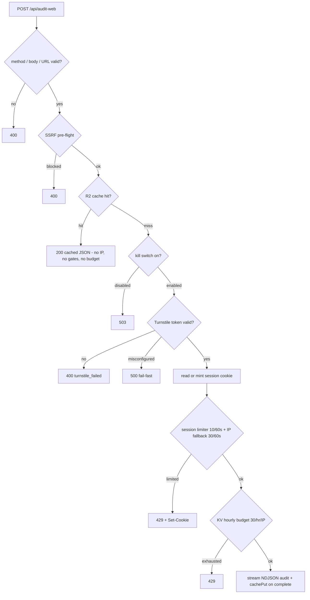
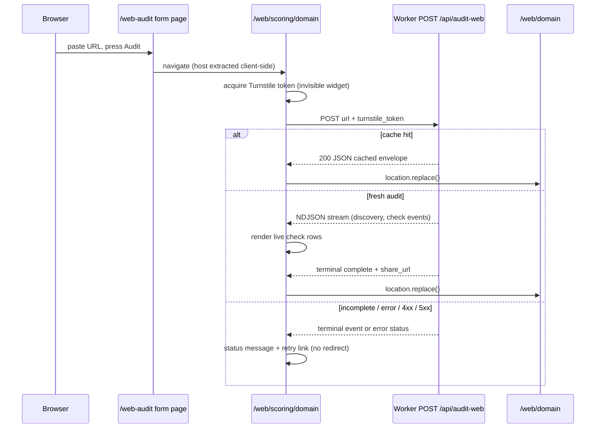

# Web-Audit Gate Parity, Scoring-Page Flow, and Prompt Dedup - Plan

## Goal Capsule

- **Objective:** land three refinements to the web-audit feature: (A) the fresh-audit path adopts the binary
  live-scoring gate waterfall by reusing its modules, (B) pressing Audit navigates immediately to a new
  `/web/scoring/<domain>` streaming page that forwards to `/web/<domain>`, and (C) skill pages and result-page per-check
  blocks become prose-only with a copy-prompt button that never renders the prompt in HTML.
- **Authority:** this plan's Product Contract and KTDs record user-confirmed decisions and are settled; repo conventions
  (AGENTS.md) govern anything the plan leaves open; the implementer decides remaining details.
- **Landing strategy:** the web audit (#197 `0d49c03`, #198 `32452fd`, #199 `3123dac`) and the design-system-port
  rebrand (#201 `e4269ed`) have landed to `dev` per the landing sequence in
  `docs/plans/2026-07-13-001-feat-web-audit-rebrand-landing-plan.md`, so the three constraints that held this work are
  cleared: the web audit is live on the dev/staging Worker for U7's e2e gate; the rebrand's rewrites of
  `src/client/web-audit.ts` and `src/worker/audit-web/summary-render.ts` are already in `dev`, so this work rebases onto
  them once rather than fighting a parallel rebase; and the settled base is now `dev` itself. Cut a fresh stack from
  `dev` — one branch per workstream is the natural cut — squashing into an eventual PR to dev. The `WEB_AUDIT_LIMITER`
  retune and the `HOURLY_AUDIT_CEILING` 5 → 30 bump (KTD-3, KTD-4) can still be cherry-picked ahead of the rest if
  fresh-audit debugging exhausts the current 5/hr budget (`HOURLY_AUDIT_CEILING` is still 5 on `dev`).
- **Stop conditions:** stop only for genuine blockers — a missing secret on an environment, a Cloudflare binding
  validation failure that the plan's binding scheme cannot satisfy, or deployed reality contradicting a plan assumption.
  Everything else is implementer judgment.
- **Execution profile:** code. Unit tests green per unit; the opt-in staging e2e suite is the final gate (two
  consecutive green runs).

---

## Product Contract

### Summary

Bring the web audit's abuse posture, submit flow, and remediation-content surfaces in line with the deliberate design of
the binary live-scoring pipeline: cache served as data ahead of every gate, Turnstile + session-keyed rate limiting on
the human path, a dedicated in-progress page instead of in-place streaming, and single-rendered prompts.

### Problem Frame

The web audit shipped with a simpler gate stack than the binary `/api/score` pipeline: no Turnstile, no session limiter,
an IP-presence requirement, and a 5-per-hour budget that e2e re-runs already exhausted once. The binary pipeline's
ordering (unmetered read tiers, then kill switch → Turnstile → session limiter + IP fallback) was chosen deliberately
and is documented in
`docs/solutions/architecture-patterns/cf-worker-gate-ordering-before-cost-bearing-outbounds-2026-05-20.md`; the web
audit should replicate it rather than reinvent it. Separately, the submit UX streams results into the form page and only
then redirects, which reads as a jarring double-experience; and the fix-skill pages render the same Goal/Fix text twice
(prose sections and again inside the copy-paste prompt fence), as do the result page's per-check blocks.

### Requirements

**Gate parity (workstream A)**

- R1. Cached audit results are served as data ahead of every gate — no client IP, no Turnstile, no limiter or budget
  spend, and served even when the operator kill switch is off — on both entry points (HTTP route and MCP `audit_website`
  tool).
- R2. The fresh-audit HTTP path requires a Turnstile token (`turnstile_token` in the POST body), verified via the same
  module `/api/score` uses. Tokenless direct POST is no longer a supported surface; agents use the MCP tool.
- R3. The fresh-audit HTTP path is rate-limited by a session-cookie limiter (10/60s, keyed `<sid>:<sha256(canonical
  target)>`) with a coarse per-IP fallback (30/60s), mirroring the binary numbers and key shape. The MCP tool keeps its
  IP-keyed burst limiter (no Turnstile, no cookies — MCP cannot carry either).
- R4. The KV hourly budget stays as a backstop on both entry points, raised from 5 to 30 fresh audits per hour per IP
  (one shared counter, as today). Every prose surface that states the old numbers moves in lockstep.
- R5. Missing `TURNSTILE_SECRET` or `SESSION_HMAC_SECRET` on the fresh path fails fast with a 500, matching the binary
  handler's `service_misconfigured` posture — the route must not accept fresh-audit traffic with the bot-defense layer
  silently disabled.
- R6. The session cookie is threaded onto every fresh-path response, including 429s and the streaming 200, so a session
  survives rate-limit bounces.

**Submit flow (workstream B)**

- R7. Submitting the `/web-audit` form navigates immediately to `/web/scoring/<domain>` — no results render on the form
  page.
- R8. The scoring page acquires a Turnstile token, POSTs the audit, streams the per-check rows live, and forwards to
  `/web/<domain>` on the `complete` event using `location.replace()` (the scoring page never enters history; no
  back-button trap).
- R9. A cache-hit response forwards to `/web/<domain>` immediately, also via `location.replace()`.
- R10. Non-happy terminal states (`incomplete`, `error` events; 400/429/503 responses; Turnstile failure) render a
  status message with a retry affordance on the scoring page. `incomplete` never redirects — `/web/<domain>` would 404.
- R11. The scoring page carries a `<noscript>` fallback pointing at the MCP tool and the `.md` surfaces, honoring the
  site's no-dead-controls rule.

**Prompt dedup (workstream C)**

- R12. Skill pages (`/web-audit/skill/<id>`) render as prose-only HTML (Goal, Fix, Resources, Verify); the full
  copy-paste prompt is placed on the clipboard by a Copy-prompt button without being rendered on the page. The `.md`
  twin keeps its prompt section so fetch-only agents lose nothing.
- R13. The `/web/<domain>` result page's per-check blocks get the same treatment: prose plus Copy-prompt button, no
  rendered prompt fence in HTML; the `.md` twin keeps the fence.
- R14. Prompt content stays single-source: `src/data/web-audit/remediation.yaml` remains the only prose origin for skill
  pages, result-page blocks, and the `get_web_remediation` MCP tool.

**Landing (workstream D)**

- R15. Work lands as a fresh stack of feature branches cut from `dev` (the web audit and rebrand having already landed),
  squashing into an eventual PR to `dev`.

### Scope Boundaries

- The MCP `audit_website` tool's gate *mechanisms* are unchanged (IP burst + hourly budget); only its
  cache-vs-kill-switch ordering and its user-facing copy change.
- No scorecard schema change: `WEB_SCHEMA_VERSION` stays 0.2, the R2 cache key is untouched, and no cache purge is
  needed.
- Production promotion of the web audit (setting `WEB_AUDIT_ENABLED` on prod) stays out of scope; prod currently lacks
  the var, so the scoring page's 503 branch is the default prod experience until promotion.
- Deferred to follow-up work: http-only target support through the browser flow. The scoring URL carries only the host;
  the page reconstructs `https://<host>/`. Rare http-only sites audit via the MCP tool (which accepts full URLs).

---

## Planning Contract

### Key Technical Decisions

- KTD-1. **Import the binary's gate modules; do not lift or copy them.** `src/worker/score/turnstile.ts`
  (`verifyTurnstile`, `TurnstileEnv`) and `src/worker/score/session.ts` (`newSession`/`issue`/`read`, `SessionEnv`,
  `SessionConfigError`) are self-contained, under the 200-line trigger, and score-agnostic. Cross-domain imports have
  precedent (`mcp/tools/web-audit.ts` already imports from `audit-web/`). A lift to a shared directory touches
  `handler.ts` plus ~6 test files for zero behavior gain — YAGNI. The `__Host-anc-session` cookie is `Path=/`, so
  sessions minted by `/api/score` are already valid on `/api/audit-web` by construction.
- KTD-2. **Cache-as-data beats the kill switch on both entry points.** The binary pipeline serves curated/cached results
  before its metered gates, kill switch included; the web-audit route and the MCP tool both adopt that ordering. This
  keeps the route comment's parity claim true and matches the gate-ordering solution doc. Consequence: body parse, URL
  validation, and SSRF still precede the cache read (the cache key needs the URL), and the 503 kill-switch response only
  fires on cache miss.
- KTD-3. **Retune `WEB_AUDIT_LIMITER` to the session role; add `WEB_AUDIT_LIMITER_IP`.** `WEB_AUDIT_LIMITER` changes
  from 5/60s IP-keyed to 10/60s keyed `<sid>:<sha256(canonical target)>` for the HTTP path; a new `WEB_AUDIT_LIMITER_IP`
  binding (30/60s, namespace ids 1011 prod / 1012 staging per the odd/even convention) is the coarse fallback. The MCP
  tool needs an IP-keyed burst limiter still — it switches to keying `WEB_AUDIT_LIMITER_IP` (its semantics are per-IP)
  so the two bindings keep single roles. Not reusing `SCORE_LIMITER`/`SCORE_LIMITER_IP`: separate capabilities keep
  separate budgets, matching the existing per-capability binding convention. `env.staging.ratelimits` is
  replace-not-merge — mirror the full list there.
- KTD-4. **Hourly budget: one shared counter, ceiling 5 → 30.** `HOURLY_AUDIT_CEILING` in
  `src/worker/audit-web/limiter.ts` is a one-constant change, user-confirmed to apply to both entry points. The
  stale-copy surfaces that must move with it: the route's 429 message (`route.ts`), the MCP tool description and
  `-32099` error text (`mcp/tools/web-audit.ts`), `src/worker/mcp/instructions.ts`, the `wrangler.jsonc` limiter
  comments, and AGENTS.md's limiter prose.
- KTD-5. **Turnstile misconfiguration is fail-fast.** `verifyTurnstile` returning `misconfigured` and
  `SessionConfigError` both map to a 500 on the fresh path, mirroring `score/handler.ts`. Staging uses the always-passes
  test sitekey/secret pair, so e2e POSTs pass with `turnstile_token: "x"`.
- KTD-6. **The scoring page is Worker-rendered and JS-required.** It auto-runs on load (direct visits and shares
  included — the cache absorbs revisits), uses `location.replace()` for both forward hops, and tears down the Turnstile
  widget on `pagehide` per the bfcache pattern in `src/client/live-score.ts`. Error copy mirrors the `live-score.ts`
  taxonomy (`turnstile_failed`, `rate_limited` with retry-after, kill-switch, misconfigured).
- KTD-7. **Sitekey delivery via `{{BODY}}` injection, not a shell fork.** The shared `score-live-shell.html` template
  has no sitekey placeholder and no extra-script slot; the Worker injects the `<meta name="turnstile-sitekey">` tag and
  the scoring page's `<script>` tag inside the body substitution at request time. The homepage-only sitekey substitution
  in `src/worker/index.ts` stays untouched.
- KTD-8. **Copy-without-render uses a hidden escaped source node plus a client-attached button.**
  `src/client/clipboard.ts` gains a second attach path for elements carrying the prompt in a data attribute (or hidden
  `<template>`); the button is attached client-side so no-JS renders show no dead control (the site's own design rule),
  with visible links to the `.md` twin / skill page as the no-JS affordance. Reuse the existing `flashCopied` feedback —
  snapshot via `innerHTML` if the button carries an icon (see
  `docs/solutions/ui-bugs/flash-copied-textcontent-clobbers-svg-icon-2026-04-29.md`).
- KTD-9. **Skill-page build diverges HTML from markdown at render time, single source retained.**
  `src/build/15-web-audit-skills.mjs` renders two shapes from one assembled structure: HTML = prose + hidden prompt
  node; markdown = prose + prompt fence. The agent-skills discovery digest is computed on the served markdown and will
  churn once — accepted.
- KTD-10. **`scoring` is a reserved segment under `/web/`.** The new dispatch branch sits above `parseWebResultPath` in
  `src/worker/index.ts` and captures both `/web/scoring/<domain>` and bare `/web/scoring`, mirroring the reserved `live`
  segment under `/score/`.

### High-Level Technical Design

Fresh-path gate waterfall after workstream A (HTTP route; the MCP tool shares steps 1–4 and 7 but keeps IP-presence + IP
burst in place of steps 5–6):



Browser flow after workstream B:



### Sequencing

U1 → U2 (parity copy depends on U1's numbers) → U3 → U4 (page before client) → U5 → U6 (clipboard mechanism before
skill-page consumer) → U7 (e2e last). U1/U3/U5 open the three workstream branches; U7 rides the last branch.

---

## Implementation Units

### U1. HTTP route gate parity

- **Goal:** `POST /api/audit-web` adopts the binary gate waterfall: cache-as-data ahead of the kill switch, then
  Turnstile → session mint/read → session limiter + IP fallback → raised hourly budget → stream.
- **Requirements:** R1 (route half), R2, R3 (route half), R4, R5, R6.
- **Dependencies:** none.
- **Files:** `src/worker/audit-web/route.ts`, `src/worker/audit-web/limiter.ts`, `src/worker/index.ts` (Env type),
  `wrangler.jsonc`, `AGENTS.md`, `tests/web-audit-routes.test.ts`, `tests/wrangler-config.test.ts`.
- **Approach:** reorder `handleWebAudit` per the HTD flowchart. `WebAuditRouteEnv` extends `TurnstileEnv & SessionEnv`
  and gains `WEB_AUDIT_LIMITER_IP`; `WebAuditRouteDeps` gains a `turnstileFetch` seam (mirror the existing `probeFetch`
  pattern) so tests never swap `globalThis.fetch`. Parse `turnstile_token` from the JSON body alongside
  `url`/`site_type`. Thread `Set-Cookie` onto the streaming 200 and every fresh-path error response, following
  `score/handler.ts`'s `setCookie` pattern. Bump `HOURLY_AUDIT_CEILING` to 30 and update the route's 429 copy, the
  `wrangler.jsonc` limiter comments and binding configs (retune `WEB_AUDIT_LIMITER` to `{limit: 10, period: 60}`, add
  `WEB_AUDIT_LIMITER_IP` `{limit: 30, period: 60}` ids 1011/1012, mirrored into `env.staging.ratelimits` —
  replace-not-merge), and AGENTS.md's limiter prose.
- **Patterns to follow:** `src/worker/score/handler.ts` steps 4a–4c (gate block ordering, `setCookie` threading,
  misconfigured → 500 mapping); the existing `cache-first gate ordering` describe in `tests/web-audit-routes.test.ts`.
- **Test scenarios:**
- Cache hit with `WEB_AUDIT_ENABLED` unset (kill-switched) returns 200 cached JSON — extends the cache-first describe.
- Cache hit with no `cf-connecting-ip`, a throwing limiter, and no Turnstile token returns 200 with zero KV reads
  (existing test stays green).
- Cache miss with kill switch off returns 503 (existing test, now asserted on miss only).
- Fresh path with missing/invalid `turnstile_token` returns 400 `turnstile_failed`; with absent `TURNSTILE_SECRET`
  returns 500; with absent `SESSION_HMAC_SECRET` returns 500.
- Fresh path with valid token mints a session cookie: `Set-Cookie` present on the streaming 200 and on a limiter-429.
- Session limiter keyed `<sid>:<sha256(target)>`: same session + same target hits the limiter stub with the expected
  key; IP fallback consulted when the session limiter passes.
- Hourly budget: 31st fresh audit in an hour bucket 429s; message says 30.
- **Verification:** `bun test` green; `bun run lint`; `bun run deploy:dryrun` accepts the new bindings.

### U2. MCP tool parity

- **Goal:** `audit_website` serves cached results ahead of its kill switches and states the new limits; gates otherwise
  unchanged (IP presence, burst via the per-IP binding, hourly budget).
- **Requirements:** R1 (MCP half), R3 (MCP half), R4 (copy surfaces).
- **Dependencies:** U1.
- **Files:** `src/worker/mcp/tools/web-audit.ts`, `src/worker/mcp/instructions.ts`, `tests/web-audit-mcp-tools.test.ts`,
  `tests/worker-mcp-dispatch.test.ts` (if it pins tool descriptions).
- **Approach:** move the `cacheGet` short-circuit above the `MCP_ENABLED`/`WEB_AUDIT_ENABLED` checks; switch the burst
  call to the per-IP binding per KTD-3; update the tool description and `-32099` error strings to the new numbers
  (10/60s session applies only to HTTP — the MCP strings describe the MCP posture: burst + 30/hr).
- **Test scenarios:**
- Warm cache + `WEB_AUDIT_ENABLED` unset returns the cached scorecard, not the disabled message.
- Cache miss + kill switch off returns the disabled message (existing behavior preserved on miss).
- Fresh path still requires `cf-connecting-ip` and consumes the burst limiter and hourly budget.
- **Verification:** `bun test` green.

### U3. `/web/scoring/<domain>` route

- **Goal:** Worker-rendered scoring page: validated domain slug, sitekey meta + script injected via body substitution,
  correct headers, `scoring` reserved.
- **Requirements:** R7 (server half), R11 (noscript markup).
- **Dependencies:** none (parallel with U1).
- **Files:** `src/worker/audit-web/route.ts` (new `parseWebScoringPath` + `handleWebScoringPage`), `src/worker/index.ts`
  (dispatch above `parseWebResultPath`), `tests/web-audit-routes.test.ts`, `tests/worker.test.ts` (dispatch pins if
  any).
- **Approach:** match `^/web/scoring/<slug>$` with `DOMAIN_SLUG_RE` + `esc()` exactly like `renderNotFound`; bare
  `/web/scoring` renders a "start an audit at /web-audit" pointer (reserved segment per KTD-10). Render through the
  cached shell-template loader; the body carries the status slot, the empty results table (same `.audit-table` markup
  the form page uses today), the `<meta name="turnstile-sitekey">` (substituted from `env.TURNSTILE_SITEKEY`; empty on
  unprovisioned envs — the client disables with MCP-pointer copy, mirroring `live-score.ts`), the `<script defer
  src="/js/web-audit-scoring.js">` tag, and a `<noscript>` block pointing at the MCP tool and `/web/<domain>.md`.
  Headers: `text/html`, `Cache-Control: no-store` (the page is transient and sitekey-bearing), `X-Robots-Tag: noindex`.
  GET/HEAD only, 405 otherwise. The `.md` twin / content-negotiation answer for this transient page is a short markdown
  pointer to `/web/<domain>.md` and the MCP tool (site invariant: every page answers markdown).
- **Test scenarios:**
- `/web/scoring/example.com` renders 200 HTML containing the sitekey meta, script tag, and noscript block; invalid slug
  (`/web/scoring/EXAMPLE..com`) 404s; bare `/web/scoring` renders the pointer page; `/web/scoring/a/b` 404s.
- Sitekey substitution: env with sitekey set → content in meta; unset → empty content.
- `POST /web/scoring/x` → 405; markdown negotiation returns the pointer text; `no-store` and `noindex` headers present.
- `parseWebResultPath('/web/scoring')` no longer resolves as a domain lookup (reserved).
- **Verification:** `bun test` green; browse the page under `bun run dev` in both themes (AGENTS.md browser-verify
  gate).

### U4. Scoring-page client and form slim-down

- **Goal:** the streaming experience moves to the scoring page; the form page only navigates.
- **Requirements:** R7 (client half), R8, R9, R10, R11.
- **Dependencies:** U1 (token contract), U3 (page exists).
- **Files:** `src/client/web-audit-scoring.ts` (new), `src/client/web-audit.ts`, `content/web-audit.md`,
  `src/build/01-assets.mjs` (one more `bundleClient` entry), `tests/build.test.ts` (asset pins if any).
- **Approach:** the new client reads the domain from `location.pathname`, reconstructs `https://<host>/`, lazy-loads
  Turnstile and acquires a token on load (reuse the acquire/execute/teardown patterns from `live-score.ts`, including
  `pagehide` teardown), POSTs with `turnstile_token`, then branches exactly like today's `web-audit.ts`: JSON → cached
  envelope (`location.replace(share_url)`) or error taxonomy copy; NDJSON → render check rows into the results table,
  `complete` → `location.replace(share_url)`, `incomplete`/`error` → status + "try again at /web-audit" link, never a
  redirect. Move the row-rendering helpers rather than duplicating them. `web-audit.ts` slims to: validate input,
  extract host (URL coercion mirroring the server's `coerceUrl`), navigate to `/web/scoring/<host>` with `location.href`
  (the form page should stay in history). Remove the results table and streaming markup from `content/web-audit.md`;
  keep the example chips; update the page's agent-facing copy (tokenless POST no longer supported — point at MCP).
- **Test scenarios:** client code is exercised by the e2e suite (U7); unit-test the pure helpers if any land outside the
  DOM (host extraction). `Test expectation: none beyond helpers — DOM client covered by e2e.`
- **Verification:** manual flow on `bun run dev` (staging env vars locally): submit → scoring page → live rows → result
  page; cache-hit revisit → immediate forward; back button from the result page lands on the form page, not the scoring
  page.

### U5. Copy-prompt mechanism and result-page dedup

- **Goal:** prompts disappear from result-page HTML; a client-attached Copy-prompt button carries them; markdown twin
  unchanged in spirit.
- **Requirements:** R13, R14.
- **Dependencies:** none (parallel); U6 consumes the mechanism.
- **Files:** `src/client/clipboard.ts`, `src/worker/audit-web/summary-render.ts`,
  `tests/web-audit-scorecard-format.test.ts` (or wherever `buildWebSummaryBody` is pinned), `styles/` if the button
  needs placement CSS.
- **Approach:** `summary-render.ts` `renderCheck` drops the `<pre><code>` prompt block and instead emits a hidden
  carrier: an element with the assembled prompt in a `data-copy-text` attribute (attribute-escaped via the existing
  `escHtml` — quotes escaped, newlines survive `getAttribute`). `clipboard.ts` gains `attachDataButtons()`: for each
  `[data-copy-text]` carrier, insert a `Copy prompt` button client-side and wire it to the shared `copyText` +
  `flashCopied` (snapshot via `innerHTML` per the SVG-icon learning). No-JS renders show the prose plus the existing
  `Fix skill` and resources links — no dead controls. `buildWebSummaryMarkdown` keeps its prompt fence verbatim.
- **Patterns to follow:** existing `attachPreButtons` structure in `clipboard.ts`; `assembleRemediation` stays the
  single prompt assembler.
- **Test scenarios:**
- `buildWebSummaryBody` output for a fixable failing check contains the `data-copy-text` carrier with the exact
  assembled prompt (escaped) and no `<pre>` prompt block; passing checks carry none.
- Markdown twin still contains the ```text prompt fence.
- Prompt content in the carrier equals `assembleRemediation(...).prompt` byte-for-byte after HTML-unescaping
  (single-source guard).
- **Verification:** `bun test`; visual check of a result page in both themes (button placement, flash feedback).

### U6. Skill-page dedup

- **Goal:** skill-page HTML is prose-only with the Copy-prompt button; markdown twin keeps the prompt section.
- **Requirements:** R12, R14.
- **Dependencies:** U5 (clipboard mechanism).
- **Files:** `src/build/15-web-audit-skills.mjs`, `tests/web-audit-skills.test.ts`, `tests/build-discovery-emit.test.ts`
  (digest pins).
- **Approach:** split `buildSkillMarkdown` into an assembly step and two renderings per KTD-9: the served markdown keeps
  `## Copy-paste prompt` with the fence; the HTML rendering replaces that section with the `data-copy-text` carrier
  (skill pages already load `clipboard.js` via the shell) and keeps Goal/Fix/Resources/Verify prose. Drop the prompt's
  `Goal:`/`Fix:` duplication pressure by leaving prose as the page body — the prompt text itself is unchanged (still
  self-contained one-liners) so `get_web_remediation` and result-page prompts stay identical.
- **Test scenarios:**
- Skill HTML for a check contains the carrier and Goal/Fix prose, and does not contain the fenced prompt text.
- Skill `.md` still contains `## Copy-paste prompt` and the fence.
- Discovery-index digests recompute cleanly (update pins once).
- **Verification:** `bun test`; `bun run build` emits both twins; visual check of one skill page.

### U7. E2e suite update and staging validation

- **Goal:** the opt-in staging suite covers the new flow and gates, and passes twice consecutively against one
  deployment.
- **Requirements:** R2 (e2e token posture), R7–R10, R12–R13 assertions.
- **Dependencies:** U1–U6 deployed to staging.
- **Files:** `tests/e2e/web-audit.e2e.ts`, `playwright.config.ts` (only if a new project/env var is needed — not
  expected).
- **Approach:** form test: fill input, submit, expect URL `/web/scoring/<domain>`, then race "streamed row visible on
  the scoring page" against "URL replaced to `/web/<domain>`" (cache-hit tolerance per
  `docs/solutions/best-practices/live-target-e2e-design-for-server-side-state.md`), assert the result page either way,
  and assert the scoring URL is not in history (back returns to the form page). Direct-POST tests add `turnstile_token:
  "x"` (staging always-passes secret). Skill-page test inverts: HTML lacks the fenced prompt, carries the copy
  mechanism; `.md` keeps `Copy-paste prompt`. Add a tokenless-POST test asserting 400 `turnstile_failed` on cache
  miss... skip if it burns budget — prefer asserting on a cache-hit-free synthetic domain only if budget-safe; otherwise
  cover tokenless rejection in unit tests only.
- **Test scenarios:** as above; green = two consecutive full-suite passes against the same staging deployment.
- **Verification:** deploy the stack tip to staging, run `bun run test:e2e` twice; both green. Local-parity rule applies
  — no punting to CI.

---

## Verification Contract

| Gate                 | Command                                                                | Applies to        |
| -------------------- | ---------------------------------------------------------------------- | ----------------- |
| Unit tests           | `bun test`                                                             | every unit        |
| Lint                 | `bun run lint`                                                         | every unit        |
| Build                | `bun run build`                                                        | U3–U6             |
| Wrangler dry-run     | `bun run deploy:dryrun`                                                | U1 (bindings), U3 |
| Staging e2e (opt-in) | `ANC_STAGING_BASE_URL=… bun run test:e2e` — two consecutive green runs | U7                |
| Browser verify       | both themes on `bun run dev` (port 8787)                               | U3, U4, U5, U6    |

## Definition of Done

- All fifteen requirements are implemented and traced to green tests; the U1 gate-ordering unit tests pin the waterfall
  on both entry points.
- Every prose surface stating limiter numbers (route copy, MCP tool strings, `instructions.ts`, `wrangler.jsonc`
  comments, AGENTS.md) states the new numbers.
- The stack tip deploys to staging cleanly and the full opt-in e2e suite passes twice consecutively.
- Branches are a fresh stack cut from `dev` (the web audit and rebrand already landed), squashing into an eventual PR to
  `dev`.
- No dead-end or experimental code remains in the diff; abandoned approaches are removed.
