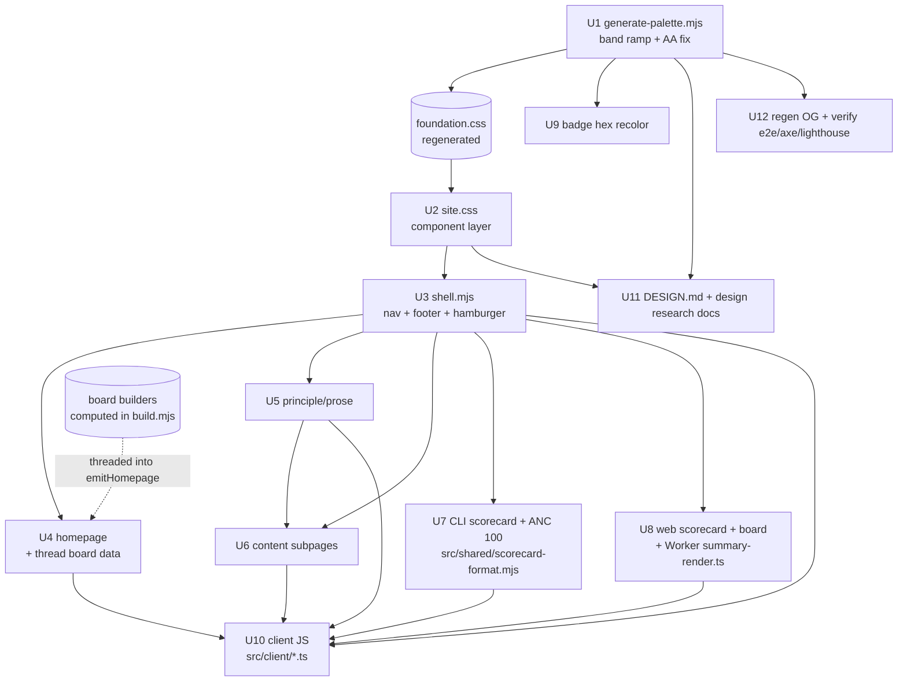

# Design System Port — Instrument Redesign - Plan

**Complete.** Implemented as 16 commits on `feat/design-system-port` (stacked on `feat/web-audit-refine-e2e`, pushed
2026-07-13; PR pending). Full Verification Contract green locally: build + `deploy:dryrun`, 1276 unit tests, 110 e2e
across chromium/mobile-android/mobile-ios/tablet (axe light+dark per archetype, no-JS toggle proof, 390/768/1440
overflow sweep), lint, Lighthouse budgets, and two-run byte-identical OG regeneration. Per-unit **Shipped** notes and
risk outcomes below record the as-built deltas.

## Goal Capsule

Port the approved "instrument" design system from the local prototypes into the live `agentnative-site` build so every
page ships the new look. The design is decided and proven; this plan is the production port, not a design exploration.

- **Authority hierarchy:** the design is captured by the prototype screenshots in
  `.context/design-overhaul/prototype-shots/` (homepage, prose, CLI scorecard, web scorecard — light/dark, mobile) and
  the prototype sources `.context/design-overhaul/prototypes/` (`home.html`, `prose.html`, `base.css`; the two scorecard
  `.html` files were zeroed and must be re-exported — the screenshots are the authoritative contract for those). Repo
  conventions (generated `foundation.css`, additive `site.css`, `AGENTS.md`) govern *how* it lands. Where they conflict,
  repo conventions win on mechanism, screenshots win on appearance.
- **Stop conditions:** every page renders the new system in `bun run build`; light and dark both pass axe contrast;
  responsive holds at 390/768/1440 with no horizontal overflow; e2e, lint, and Lighthouse budgets stay green.
- **Scope:** whole-site port. It lands in reviewable slices at natural merge points (U1–U3 token+shell foundation, then
  per-archetype fan-out) even though it is one plan — the slice boundaries are the merge boundaries.

---

## Product Contract

### Summary

Replace the current "styled-markdown" presentation with the prototyped instrument identity: a generated score-band color
ramp, a reusable meter/spec-index/toggle component layer, a grouped nav with mobile hamburger, the provider-icon footer,
and a homepage whose `CLI ⇆ Web` toggle drives the leaderboard, principles/checks, and demo input together — reading
board data threaded into the homepage build. Light and dark are each designed, not inverted, and token changes flow
through `generate-palette.mjs`.

### Problem Frame

The live site reads as lightly-styled markdown: one narrow column per page, a flat hairline-divided principle list, an
undesigned nav, timid monochrome — amateur to the skeptical engineer who decides in 60 seconds whether to trust the
standard (`BRAND.md`). The foundation is sound (OKLCH palette via `generate-palette.mjs`, Uncut Sans + Monaspace Xenon,
a real type scale); the failure is page-level composition. A full design session produced and validated an "instrument"
system (measurement as the visual language: score-meters, the MUST/SHOULD/MAY tri-color as structure, committed color,
solid surfaces) that avoids the saturated 2026 editorial-mono lane. It now moves from throwaway prototypes into the real
build.

### Requirements

**Design tokens & palette**

- R1. The score-band ramp (`--band-low` / `--band-mid` / `--band-high` and vivid `--band-*-bar` fill variants) is
  generated by `generate-palette.mjs` for light and dark, as a grading axis distinct from the MUST/SHOULD/MAY obligation
  tiers.
- R2. `--fg-muted` is darkened (light) / brightened (dark) to clear WCAG AA (≥4.5:1) for small text; the current value
  fails at ~4.1:1.
- R3. `--meter-track` and the meter-fill sheen tokens are generated alongside the ramp.
- R4. `foundation.css` and the generator's `color-analysis.md` are regenerated from the script, never hand-edited.

**Shared shell & component layer**

- R5. The nav is grouped and ships a mobile hamburger — a CSS-checkbox that reveals a link panel, with 44px touch
  targets, a keyboard close path, and defined focus order; the tagline hides on narrow widths.
- R6. The footer keeps the current "Ask an AI" provider icons, the `Source: spec · cli · site · skill` row, and the
  version/schema/llms/MCP meta row, restyled.
- R7. A reusable component layer lives in `site.css`: score-meter, score-band classes, spec-index rows, segmented
  toggle, surface/score cards, status chips, and a token-based `:focus-visible` ring.

**Homepage**

- R8. The hero shows the headline "The agent-native standard" (no "CLI"), a one-line subhead, primary/secondary CTAs,
  and a live scorecard proof panel with a meter.
- R9. A `CLI ⇆ Web` toggle drives, together, the leaderboard, the principles-vs-web-checks section, and the demo input.
  It reuses the existing board builders (no new data model), which requires threading the already-computed leaderboard
  and web entries into the homepage build (a new `emitHomepage` argument and a build-order change so board data is
  computed before the homepage emits).
- R10. The unifying framing is "Two surfaces, one bar" — the CLI is anc's standard (8 principles), the web is an audit
  against external specs (MCP, llms.txt, OpenAPI); copy must not claim anc owns a single web standard.

**Reading & content pages**

- R11. Principle (`/p{N}`) and prose pages use the reading-optimized treatment: strong hierarchy, MUST/SHOULD/MAY as
  tinted requirement groups (not side-stripes), tier tags, consistent code blocks, prev/next.
- R12. Every remaining content subpage inherits the restyled system — `about`, `methodology`, `install`, `contribute`,
  `changelog`, `badge`, `audit`, `web-audit`, and the schema/reference pages `scorecard-schema`, `web-scorecard-schema`,
  `mcp-skill`, `mcp` (the full `emitSubPages` set). The audit and web-audit landings get the instrument-flavored hero +
  form.

**Scorecards, boards & badge**

- R13. The per-tool CLI scorecard and the ANC 100 board adopt the instrument look — score header with meters, scored
  P1–P8 rows with pass/warn/fail and inline remediation, leaderboard rows with graded meters — preserving the existing
  tier filter and agent-optimized toggle.
- R14. The per-site web scorecard (both the static build and the Worker-rendered on-demand result page) and the web
  leaderboard adopt the category-grouped check treatment (`✓ / ! / ✕ / –`, band-colored category scores, per-check
  remediation).
- R15. The badge SVG's six existing band fills are recolored to the new ramp's resolved sRGB hues. The six eligibility
  thresholds and cohort count are unchanged (collapsing them is a spec-side scoring change, out of scope).

**Cross-cutting**

- R16. Light and dark are each intentionally designed (dark depth from raised surfaces + edge highlights, not shadows);
  both pass axe contrast.
- R17. All pages are responsive with no horizontal overflow at 390/768/1440; long code/remediation wraps on mobile.
- R18. The design degrades without JS: the toggle renders a usable CLI default, and existing no-JS hiding of the theme
  toggle and copy buttons is preserved. (Tier filtering is already JS-driven today; the port does not regress it and
  does not claim it works JS-off.)
- R19. `DESIGN.md` and `docs/research/design/*` are updated; `BRAND.md` changes (if any) route upstream to the spec repo
  (it is vendored), not edited here.

### Scope Boundaries

**In scope:** all page templates and renderers (including the shared `src/shared/scorecard-format.mjs` and the Worker
`src/worker/audit-web/summary-render.ts`), `site.css`, `foundation.css` (via generator), `shell.mjs`,
homepage/subpage/board/badge renderers, client JS (`src/client/*.ts`), `DESIGN.md`, `docs/research/design/*`.

**Out of scope (product identity):**

- Spec/principle content and copy (except the decided homepage hero framing). No requirement-text edits.
- Scoring/eligibility logic: no new audit checks, scorecard fields, pages, or threshold changes (including the badge's
  six-band thresholds).
- The MCP server, the audit/scoring engines, and the registry data model.

#### Deferred to Follow-Up Work

- Motion polish beyond hover/toggle transitions (orchestrated first-load reveals).
- `BRAND.md` brand-voice revisions — owned upstream in `agentnative-spec`.
- ~~`/coverage` and `/skill` pages~~ — resolved: they render in `08-scorecards-emit.mjs` and were pulled into the
  shared reading treatment there (trivial wrapper; no bespoke work needed).

---

## Planning Contract

### Key Technical Decisions

- KTD1. **Palette stays generated.** The band ramp, `--band-*-bar`, `--meter-track`, and the `--fg-muted` AA fix are
  added to `scripts/design/generate-palette.mjs` (new `HUE_BAND_LOW/MID/HIGH` constants + scale entries mirroring the
  `--must/--should/--may` emit); `foundation.css` is regenerated. Score bands (grading: fail/warn/pass) are a separate
  axis from MUST/SHOULD/MAY (obligation) — both generated. Never hand-edit `foundation.css`. Interim prototype values
  live in `.context/design-overhaul/prototypes/base.css`.
- KTD2. **Components consolidate in `site.css`.** The prototype's `base.css` plus per-page component CSS become the
  additive `site.css` layer (~39KB today, refactored in place — it has multiple current consumers). Class-name changes
  must land in every renderer that emits those classes in the same slice, including the shared and Worker renderers (see
  KTD3-adjacent), to avoid style drift.
- KTD3. **Shared shell in `shell.mjs`; shared markup is wider than the build.** Nav (grouped + hamburger) and the
  provider-icon footer are emitted by `shell.mjs`. Inline SVG icons carry explicit `width`/`height` attributes — iOS
  Safari paints `viewBox`-only inline SVG as 0×0 (Sources). The per-tool scorecard markup is not in the page emitters:
  `buildScorecardBody` lives in `src/shared/scorecard-format.mjs` (shared by the static build and the Worker
  `/score/live` route), and per-site web result pages are rendered on demand by
  `src/worker/audit-web/summary-render.ts`. Restyle work must reach these, not just the `08-`/`14-` emit wrappers.
- KTD4. **Toggle is CSS-first, but the mechanism is unproven and the data must be threaded.** The `CLI ⇆ Web` toggle
  targets hidden radios + `:has()` to swap three panes with no JS; existing `site.css` uses `:has()` only for a trivial
  layout hook, so U4 validates the three-pane fan-out with a DOM proof before committing (fallback: a small JS toggle,
  which would revise the no-JS claims in R18/DoD). The leaderboard reuses `buildLeaderboardBody` /
  `buildWebLeaderboardBody`, but the homepage does not currently receive that data — U4 threads the already-computed
  leaderboard/web entries into `emitHomepage` and reorders `build.mjs` so they compute first. No new data model, but
  real integration work. *Proven:* the pre-flight DOM proof and a JS-disabled e2e confirm the three-pane swap in both
  directions; the JS fallback was not needed. The proof runner is kept at `docs/research/design/prove-has-toggle.mjs`.
- KTD5. **Regenerate the genuinely-generated artifacts; hand-edit the badge.** A palette change regenerates
  `foundation.css`, `color-analysis.md`, and the OG card (its Playwright HTML→PNG render reads `foundation.css` tokens —
  Sources). The badge SVG is **not** script-generated: `src/build/badge.mjs` holds six hand-maintained hex constants
  (`BAND_EXEMPLARY = '#005da1'`, …). U9 hand-edits those hex values to the new ramp's resolved sRGB; the badge is
  excluded from the "regenerated from scripts" set.
- KTD6. **No-JS degradation preserved.** The site already hides the theme toggle and copy buttons when JS is off (the C6
  pattern in `site.css`). The surface toggle must show a usable CLI default without JS; the hamburger is a CSS checkbox
  (JS-free open), with Escape-to-close added by the enhancement script.

### High-Level Technical Design

Dependency and data flow across the port:

Sequencing: U1 → U2 → U3 is the critical path (tokens → components → shell) and the first mergeable slice. U4–U9 fan out
once the shell exists. U10 follows the pages it enhances. U11/U12 close out docs, generated artifacts, and verification.

---

## Implementation Units

### Unit Index

| U-ID | Title                                                       | Key files                                                                                                                                       | Depends on |
| ---- | ----------------------------------------------------------- | ----------------------------------------------------------------------------------------------------------------------------------------------- | ---------- |
| U1   | Palette generator: band ramp + AA muted fix + meter tokens  | `scripts/design/generate-palette.mjs`, `src/styles/foundation.css`, `docs/research/design/color-analysis.md`                                    | —          |
| U2   | `site.css` component layer                                  | `src/styles/site.css`                                                                                                                           | U1         |
| U3   | Shell: grouped nav + hamburger, provider-icon footer        | `src/build/shell.mjs`, `src/styles/site.css`                                                                                                    | U2         |
| U4   | Homepage: hero + surface toggle + threaded board data       | `src/build/06-homepage.mjs`, `src/build/build.mjs`, `src/styles/site.css`                                                                       | U2, U3     |
| U5   | Principle/prose reading treatment                           | `src/build/build.mjs`, `src/build/render.mjs`, `src/styles/site.css`                                                                            | U2, U3     |
| U6   | Content subpages + audit/web-audit landings                 | `src/build/07-subpages.mjs`, `src/styles/site.css`                                                                                              | U3, U5     |
| U7   | CLI scorecard + ANC 100 board                               | `src/shared/scorecard-format.mjs`, `src/build/scorecards-render.mjs`, `src/build/08-scorecards-emit.mjs`, `src/styles/site.css`                 | U2, U3     |
| U8   | Web scorecard (build + Worker) + web board                  | `src/build/web-leaderboard-render.mjs`, `src/build/14-web-scorecards-emit.mjs`, `src/worker/audit-web/summary-render.ts`, `src/styles/site.css` | U2, U3     |
| U9   | Badge hex recolor                                           | `src/build/badge.mjs`, `content/badge.md`                                                                                                       | U1         |
| U10  | Client JS: toggle enhancement, copy-prompt, hamburger close | `src/client/*.ts`, `src/build/01-assets.mjs`, `src/styles/site.css`                                                                             | U3–U8      |
| U11  | Design docs refresh                                         | `DESIGN.md`, `docs/research/design/must-should-may-preview.html`                                                                                | U1, U2     |
| U12  | Regenerate OG + verify e2e/axe/lighthouse                   | `scripts/og/*`, `tests/**`, `.lighthouserc.json`                                                                                                | U1–U10     |

### U1. Palette generator: band ramp + AA muted fix + meter tokens

- **Goal:** Generate the score-band ramp, meter tokens, and AA-compliant muted token; regenerate `foundation.css`.
- **Requirements:** R1, R2, R3, R4.
- **Dependencies:** none.
- **Files:** `scripts/design/generate-palette.mjs`, `src/styles/foundation.css` (generated),
  `docs/research/design/color-analysis.md` (generated).
- **Approach:** Add `HUE_BAND_LOW=26`, `HUE_BAND_MID=70`, `HUE_BAND_HIGH=150` and light/dark scale entries mirroring the
  `--must/--should/--may` emit. Emit `--band-low/mid/high` (AA text shades), `--band-*-bar` (vivid UI-fill shades,
  decoupled so fills run brighter than the 4.5:1 text), and `--meter-track`. Lower `--fg-muted` lightness (light ≈
  `52%`, dark ≈ `63%`). Extend the script's existing contrast/APCA assertion pass to the new tokens; if it rejects a
  chosen shade, adjust lightness/chroma until it passes. Regenerate via `bun run scripts/design/generate-palette.mjs`.
- **Patterns to follow:** existing `HUE_MUST/SHOULD/MAY`, `LIGHT_SCALE`/`DARK_SCALE`, `mk()`, the three emit blocks;
  prototype targets in `base.css`.
- **Execution note:** generation/config — verify by regenerating and diffing, not unit tests.
- **Test scenarios:** Test expectation: none — generated stylesheet, verified by U12's contrast/axe gates and a
  regeneration diff. Confirm the generator's own contrast assertions pass for the new tokens.
- **Verification:** `foundation.css` contains the new tokens in `:root`, media-dark, and both `[data-theme]` blocks; the
  generator's contrast check passes; re-running is idempotent (no diff on second run).
- **Shipped:** `HUE_BAND_LOW/MID/HIGH` plus light/dark band, `*-bar`, and `--meter-track` entries; `gray-500` retuned
  (light 52%, dark 63%). New per-token WCAG + APCA assertions fail the run before either file is written; dark
  `fg-muted`'s APCA floor is pinned at its shipped level (WCAG AA is the hard gate — lifting L past ~67 would collapse
  the muted tier into `gray-600`). Regeneration is byte-idempotent.

### U2. `site.css` component layer

- **Goal:** Build the instrument component layer on `foundation.css`, replacing the old hero/principle/footer
  composition.
- **Requirements:** R7, R11 (substrate), R16, R17.
- **Dependencies:** U1.
- **Files:** `src/styles/site.css`.
- **Approach:** Port the prototype components into the additive layer: `.meter` (track + sheen fill + band coloring;
  define its rendering at 0/100 and for an unscored/absent value — empty track), score-band helpers, `.spec` index rows,
  the segmented `.seg` toggle, surface/score cards, status chips, and the token-based `:focus-visible` ring. Add the
  spacing scale, radius, `--ease`, and a subtle shadow scale as `site.css`-local tokens, plus the dark-mode elevation
  rules (edge-highlight + raised bands). Refactor the existing `Hero`, `Principle listing`, and `Footer` sections in
  place; keep the RFC-keyword, Shiki-bridge, tier-filter, and agent-toggle sections.
- **Patterns to follow:** existing `site.css` section structure; `base.css` + prototype `<style>` blocks.
- **Test scenarios:** Test expectation: none directly — proven via U4–U8 page e2e/axe/visual checks.
- **Verification:** the component classes render in the U4 build; no regression in the RFC-keyword or code-block
  treatment.
- **Shipped:** spacing/radius/motion/elevation tokens plus meter (with unscored/zero/full states), band and status-chip
  helpers, seg toggle, card, board, spec index, buttons, container, and a zero-specificity focus ring. Dark elevation
  is token-indirected (`--shadow-card`, `--band-surface-bg`, `--seg-bg`, `--field-bg`) so the light/dark fork lives in
  one block.

### U3. Shell: grouped nav + hamburger, provider-icon footer

- **Goal:** Emit the grouped nav (with an accessible hamburger) and the restyled provider-icon footer for every page.
- **Requirements:** R5, R6, R16, R17, R18.
- **Dependencies:** U2.
- **Files:** `src/build/shell.mjs`, `src/styles/site.css`.
- **Approach:** In `emitShell`, restructure the header into grouped links + a CSS-checkbox hamburger (44px target) that
  reveals a link panel via `:has()`; hide the tagline under 640px. Specify the open-panel keyboard story: a focusable
  close control in the panel, Escape-to-close (wired in U10, since CSS can't handle Escape), and the tab order into the
  panel. Keep the `AI_PROVIDERS` SVG footer, the source row, and the meta row; add explicit `width`/`height` to each
  inline provider SVG (iOS 0×0 fix). Preserve the skip link, theme-init inline script, and no-JS hiding.
- **Patterns to follow:** current `emitShell`/`emitShellTemplate`; `AI_PROVIDERS`; the iOS-SVG solution (Sources);
  nav/footer sections in `site.css`.
- **Test scenarios:** Covers R5/R6. Nav renders grouped links on desktop; at 390px inline links hide and the hamburger
  toggles the panel. A focusable close control is present in the open panel and Escape closes it (with U10). Footer
  renders all five provider icons at non-zero rendered size, plus source and meta rows. Skip link focusable. No-JS:
  hamburger still opens.
- **Verification:** e2e asserts nav landmarks + footer rows in both viewports and the panel open/close keyboard path;
  axe finds no new violations.
- **Shipped:** six grouped links with `aria-current` derived from the canonical path; the hamburger checkbox is
  visually hidden but focusable across the 44px target (pointer + Space work JS-free); provider icons in 42px circles
  with explicit SVG dimensions; methodology/coverage/contribute moved to the footer meta row. Deviation: the theme
  control collapsed to the single cycle button here (theme.ts rewritten) rather than in U10, so the shell landed
  coherent in one slice.

### U4. Homepage: hero + surface toggle + threaded board data

- **Goal:** Rebuild the homepage with the instrument hero and the `CLI ⇆ Web` toggle, fed by board data threaded into
  the homepage build.
- **Requirements:** R8, R9, R10, R16, R17, R18.
- **Dependencies:** U2, U3.
- **Files:** `src/build/06-homepage.mjs`, `src/build/build.mjs`, `src/styles/site.css`.
- **Approach:** First, a `:has()` pre-flight: build the throwaway three-pane DOM skeleton driven by the radio set with
  zero JS and confirm one radio change swaps the leaderboard, principles/checks, and input panes; if the panes can't
  share a `:has()`-reachable ancestor, record the JS-fallback and revise the no-JS claims in KTD4/R18/DoD before
  continuing. Then extend `emitHomepage`'s signature to accept the computed CLI leaderboard and web entries, and reorder
  `build.mjs` so `computeLeaderboard` / the web-entries load run before `emitHomepage`. Compose hero (H1 "The
  agent-native standard", subhead, CTAs, meter'd scorecard proof) from `content/_intro.md` + `_use.md`. The leaderboard
  pane renders CLI rows from `buildLeaderboardBody` and web rows from `buildWebLeaderboardBody`; the principles pane
  swaps 8 CLI principles for the 5 web categories; the input swaps `Score a binary` / `Audit a site`; rubric captions
  swap per surface. CLI is the no-JS default.
- **Patterns to follow:** `emitHomepage({ ... })` and the `build.mjs:199` call site; `computeLeaderboard` and the
  web-entries load in `08-`/`14-` emit; the board data builders; prototype `home.html` + homepage screenshots.
- **Execution note:** gate the rest of U4 on the `:has()` proof — the CSS-first / JS-budget premise depends on it.
- **Test scenarios:** Covers R8/R9/R10. Hero renders headline + both CTAs + a meter'd scorecard. Default (no JS, no
  interaction) shows the CLI leaderboard + 8 principles. Activating the web radio swaps to the web leaderboard + 5
  categories + the `Audit a site` input + web rubric (assert the three panes flip together, JS off). Leaderboard rows
  show band meters + scores sourced from the threaded builders (assert a known tool/site appears). No horizontal
  overflow at 390/768/1440.
- **Verification:** e2e drives the toggle via the label and asserts the three panes swap; the homepage build receives
  non-empty board data; axe passes light+dark.
- **Shipped:** proof gate passed (see KTD4). `emitScorecardSurface` and the web-seed load run before `emitHomepage`;
  `emitWebScorecardSurface` accepts the preloaded seed. The hero proof card renders the top tool's real score and
  principles-met count; the live-score form keeps its full client contract restyled as the board try-form; the web
  pane form is a plain GET to /web-audit. `bandOf`/`renderMeter` live in the shared scorecard-format module. The
  unstyled mini-TOC scaffolding left the shell; `_intro.md` carries the decided H1 + subhead.

### U5. Principle/prose reading treatment

- **Goal:** Apply the reading-optimized treatment to principle pages and the prose register.
- **Requirements:** R11, R16, R17.
- **Dependencies:** U2, U3.
- **Files:** `src/build/build.mjs` (principle render), `src/build/render.mjs`, `src/styles/site.css`.
- **Approach:** Render `/p{N}` with the reading column (≤~52rem measure), tier-colored `P#` + tier tag, MUST/SHOULD/MAY
  as tinted requirement groups (full borders / bg tint, never side-stripes), inline RFC-keyword coloring (existing
  `.rfc-*`), dark code blocks, an "audited by `anc audit`" callout, and prev/next. Preserve the locked H1-slug invariant
  and the markdown-twin emit.
- **Patterns to follow:** the principle render + slug-pinning in `build.mjs`; `render.mjs` pipeline; prototype
  `prose.html`; existing `.rfc-*` classes.
- **Test scenarios:** Covers R11. A `/p{N}` page renders the tier tag, correctly-colored requirement groups, code
  blocks, and a working prev/next. Locked-slug invariant holds (H1 id equals the filename slug, once). Requirement
  groups use full borders/tints, not `border-left`.
- **Verification:** principle-page e2e passes with updated selectors; the slug invariant assertion doesn't throw; axe
  passes.
- **Shipped:** two-pass principle emit (the pager needs neighbor titles); crumb + tier-colored head + audit-note ahead
  of the Requirements section; the displayed H1 drops its "P{n}:" prefix (the markdown twin keeps authored bytes and
  the locked-slug invariant holds); `.normative` restyled as tinted full-border groups; the Definition heading is
  visually hidden so its paragraph reads as the lede; code blocks read dark in both themes inside `.doc`.

### U6. Content subpages + audit/web-audit landings

- **Goal:** Restyle the full `emitSubPages` set; give the audit landings the instrument hero + form.
- **Requirements:** R12, R16, R17.
- **Dependencies:** U3, U5.
- **Files:** `src/build/07-subpages.mjs`, `src/styles/site.css`.
- **Approach:** The shared shell + reading treatment cascade to every subpage in the `subPages` list — `about`,
  `methodology`, `install`, `contribute`, `changelog`, `badge`, `audit`, `web-audit`, `scorecard-schema`,
  `web-scorecard-schema`, `mcp-skill`, `mcp`; verify each renders correctly (the schema/reference pages are
  content-heavy and inherit the reading treatment). U6 owns the `badge` doc-page styling (U9 owns only the SVG). Give
  `audit` and `web-audit` an instrument hero + score/audit input consistent with the homepage demo. Keep the
  three-registration convention (subpage list + sitemap + nav) consistent with any nav grouping change. Confirm whether
  `/coverage` and `/skill` render outside `emitSubPages`; if trivial, pull them in, else note as deferred.
- **Patterns to follow:** `emitSubPages`; the `subPages` list; the three-registration solution (Sources); prototype
  hero/form.
- **Test scenarios:** Covers R12. Each of the 12 subpages renders with the new nav/footer/reading treatment;
  `audit`/`web-audit` show the instrument hero + input; the schema pages render their content in the reading treatment.
  No page 404s from a missed registration.
- **Verification:** sitemap and nav still list the same routes; e2e smoke-loads each subpage; axe passes.
- **Shipped:** all twelve subpages render inside `.doc`; both landings get the `audit-hero` card — web-audit keeps its
  live streaming form (all `data-web-audit-*` hooks intact), and the CLI landing's Score input hands off to the
  homepage scorer via `?score=`. `/coverage` + `/skill` pulled into the doc treatment (see Deferred). Also fixed here:
  the llms.txt e2e's expectedPages list had drifted from the subPages source of truth and was failing before this
  branch.

### U7. CLI scorecard + ANC 100 board

- **Goal:** Adopt the instrument look for the per-tool scorecard and the CLI leaderboard, restyling the shared renderer
  so both the static build and the Worker `/score/live` route pick it up.
- **Requirements:** R13, R16, R17.
- **Dependencies:** U2, U3.
- **Files:** `src/shared/scorecard-format.mjs` (the real `buildScorecardBody` markup),
  `src/build/scorecards-render.mjs`, `src/build/08-scorecards-emit.mjs`, `src/styles/site.css`.
- **Approach:** In `src/shared/scorecard-format.mjs`, render the score header (name, site + global meters, summary
  chips, command) and scored P1–P8 rows with pass/warn/fail status and inline copy-paste remediation on non-pass rows;
  the class-name changes from U2 must land here (this file feeds both the static build and the Worker live route). In
  the leaderboard body, render rows with band meters + scores, keeping the existing tier-filter pills and
  agent-optimized toggle (both JS-driven — unchanged behavior). Status text is one size up from row meta. Keep the
  markdown-twin outputs.
- **Patterns to follow:** `buildScorecardBody` in `src/shared/scorecard-format.mjs`; `buildLeaderboardBody` in
  `scorecards-render.mjs`; existing tier-filter/agent-toggle CSS; CLI-scorecard screenshots
  (`prototype-shots/cli-scorecard-*.png` — the `.html` prototype was zeroed and needs re-export).
- **Test scenarios:** Covers R13. A per-tool scorecard (static build and the Worker `/score/live` render) shows the
  meter'd header, all principle rows with correct status coloring, and remediation on warn/fail. The board renders band
  meters and the tier filter still filters rows. Remediation `<pre>` wraps on mobile (no overflow).
- **Verification:** scorecard/leaderboard e2e passes with updated selectors; the Worker live route renders the new
  markup; tier filter works; axe passes light+dark.
- **Shipped:** the shared renderer emits crumb, hero (mono name, command chip, coverage/failing/warning/audit-stamp
  chips, twin band score cells), and "Eight principles, scored" rows with composed copy-paste remediation prompts on
  non-pass rows. Deviation: the Top Issues and Spec Coverage table sections folded into those chips/rows (the
  now-uncalled `renderCoverageSummary` was removed). The board's score column renders band meters (sorting still reads
  `data-sort`); the audience banner lost its side-stripe; `principleTier` moved into the shared module.

### U8. Web scorecard (build + Worker) + web board

- **Goal:** Adopt the category-grouped check treatment for the per-site scorecard in both the static build and the
  on-demand Worker render, plus the web board.
- **Requirements:** R14, R16, R17.
- **Dependencies:** U2, U3.
- **Files:** `src/build/web-leaderboard-render.mjs`, `src/build/14-web-scorecards-emit.mjs`,
  `src/worker/audit-web/summary-render.ts` (on-demand result-page render), `src/styles/site.css`.
- **Approach:** Render the site header with site + global meters and summary chips; group checks by category with `✓ / !
  / ✕ / –` marks, band-colored category scores, and per-check remediation on warn/fail. Apply the same treatment in
  `summary-render.ts` so live-audit result pages don't keep old markup/classes after U2 rewrites `site.css`. Web board
  rows use band meters. Preserve markdown twins and the seed/registry data path.
- **Patterns to follow:** `buildWebLeaderboardBody`, `emitWebScorecardSurface`, `loadWebSeed`; `summary-render.ts`;
  web-scorecard screenshots (`prototype-shots/web-scorecard-*.png` — the `.html` prototype was zeroed and needs
  re-export).
- **Test scenarios:** Covers R14. A per-site scorecard (static + Worker on-demand) shows category cards with correct
  per-check marks/status and remediation on non-pass; the web board shows band meters; category score color matches its
  band. Mobile: check rows stack, remediation wraps, no overflow.
- **Verification:** web scorecard/leaderboard e2e passes; the Worker result-page render uses the new markup; axe passes
  light+dark.
- **Shipped:** `/web/<domain>` renders catcards (C1–C5 id, category tier, band-colored rollup) with mark-led check
  rows (pass ✓, missing !, broken/error ✕, n/a –) keeping the Goal/Result/Fix/Resources detail and prompt; web board
  columns render band meters. Dead CSS from the replaced layouts (breadcrumb, summary, score badges, top-issues) was
  pruned.

### U9. Badge hex recolor

- **Goal:** Recolor the badge SVG's six band fills to the new ramp; the badge doc page is restyled by U6.
- **Requirements:** R15.
- **Dependencies:** U1.
- **Files:** `src/build/badge.mjs`.
- **Approach:** Hand-edit the six hex constants (`BAND_EXEMPLARY`, `BAND_STRONG`, `BAND_SOLID`, `BAND_QUALIFIED`,
  `BAND_BELOW`, `BAND_CRITICAL`) to the new ramp's resolved sRGB hues, keeping the existing six thresholds
  (85/80/75/70/50) and cohort semantics. The badge SVG can't read OKLCH CSS variables, so these stay static hex
  maintained by hand (KTD5).
- **Patterns to follow:** `badgeColor` / `renderBadgeSvg` in `badge.mjs` and its band-contract comments.
- **Test scenarios:** Covers R15. `badgeColor` returns the recolored hex for representative scores at each of the six
  thresholds; the rendered SVG uses them; cohort count unchanged.
- **Verification:** badge unit tests pass with the new colors; a sample badge reads consistently with on-site meters.
- **Shipped:** Solid `#00792f`, Qualified `#a46400`, Critical `#b63230` — the ramp's resolved sRGB; all clear the
  ≥4.75:1 white-text contract. Exemplary, Strong, and the below-floor orange are unchanged because their source hues
  did not move.

### U10. Client JS: toggle enhancement, copy-prompt, hamburger close

- **Goal:** Make the interactive affordances functional while keeping the CSS-first defaults.
- **Requirements:** R9 (enhancement), R13/R14 (copy), R5 (Escape-to-close), R18.
- **Dependencies:** U3–U8.
- **Files:** `src/client/*.ts` (bundled to `dist/js/*` by `bundleClient` in `src/build/01-assets.mjs`),
  `src/styles/site.css`.
- **Approach:** Wire `copy prompt` via `src/client/clipboard.ts`; keep `theme.ts`; add Escape-to-close for the hamburger
  panel and only the minimal enhancement the CSS-first toggle needs (it must already work JS-off). Author client code as
  TypeScript entry points bundled by `bundleClient` (not `public/js/*`). Stay within the JS budget; hide JS-only
  controls when JS is off (existing C6 pattern).
- **Patterns to follow:** existing `src/client/theme.ts`, `clipboard.ts`, `leaderboard.ts`; the `bundleClient` calls in
  `01-assets.mjs`; the C6 no-JS hiding rules.
- **Test scenarios:** Covers R18. Copy button writes the remediation prompt to the clipboard. Toggle and hamburger work
  JS-off (CSS-only) and enhanced JS-on; Escape closes the open nav panel. No JS-only control is visible when scripting
  is off.
- **Verification:** e2e covers a copy interaction, a JS-off toggle path, and Escape-close; Lighthouse JS budget not
  regressed.
- **Shipped:** a new `nav.ts` bundle (loaded from every shell) closes the open panel on Escape and refocuses the
  hamburger; `clipboard.ts` wires `[data-copy-prompt]` and stops attaching its generic pill to remediation bodies;
  `live-score.ts` prefills from `?score=` and `web-audit.ts` from `?url=`. Fix: `web-audit.ts` resolves chips, status,
  and results against the audit-hero section (they became form siblings in U6). As-built note: the original commit
  landed with `web-audit.ts` emptied by a local file-truncation fault; restored in a follow-up commit.

### U11. Design docs refresh

- **Goal:** Bring the in-repo design docs current with the shipped system.
- **Requirements:** R19.
- **Dependencies:** U1, U2.
- **Files:** `DESIGN.md`, `docs/research/design/must-should-may-preview.html` (and the generator-owned
  `color-analysis.md`, regenerated in U1).
- **Approach:** Update `DESIGN.md` §4 to describe the instrument system, the score-band ramp, the
  meter/spec-index/toggle components, and the light/dark treatment — present-tense, no change-narration. Refresh the
  MUST/SHOULD/MAY preview HTML against the new tokens. Do not edit `BRAND.md` (vendored); note any brand-voice change as
  an upstream follow-up.
- **Patterns to follow:** existing `DESIGN.md` §4 structure; the present-state doc rules in `AGENTS.md`.
- **Test scenarios:** Test expectation: none — documentation. Verified by review + markdownlint.
- **Verification:** `DESIGN.md` describes the shipped tokens/components; markdownlint passes; `BRAND.md` unchanged.
- **Shipped:** DESIGN.md §4.1 (band/meter tokens + corrected muted note), §4.11 (the shipped layout), and a new §4.15
  documenting the instrument component layer; the preview HTML gained a band/meter section and its block-treatment
  note describes the shipped tinted groups. `BRAND.md` untouched.

### U12. Regenerate OG + verify e2e/axe/lighthouse

- **Goal:** Regenerate palette-dependent generated artifacts and prove the whole port green.
- **Requirements:** R4, R16, R17 (verification).
- **Dependencies:** U1–U10.
- **Files:** `scripts/og/*` (regenerated OG image), `tests/**`, `.lighthouserc.json`.
- **Approach:** Regenerate the OG card (`bun run og`) and favicon if palette-dependent; confirm byte-determinism
  (two-run `sha256sum`). Decide whether per-tool badge SVGs also need a determinism check now that they carry hand-hex
  (they are deterministic by construction, so a diff-on-regen check suffices). Run the full gate suite and update
  snapshots/selectors the redesign moved. Add axe assertions covering light and dark on a representative page per
  archetype.
- **Patterns to follow:** the deterministic OG HTML→PNG pattern (Sources); existing Playwright/axe e2e and
  `.lighthouserc.json` budgets.
- **Test scenarios:** Covers R16/R17. axe passes on homepage, a principle page, a CLI scorecard, and a web scorecard in
  both themes. No horizontal overflow at 390/768/1440 on each archetype. OG regeneration is deterministic across two
  runs.
- **Verification:** `bun run build`, `bun test`, `bun run test:e2e`, `bun run lint`, and the Lighthouse run all pass; OG
  two-run `sha256sum` matches.
- **Shipped:** OG card regenerated with the decided framing plus the instrument signature — a brand-row meter reading
  anc's real self-audit (100); two-run byte-identical. The OG generator and the Playwright config honor `PW_CHANNEL`
  (scoped to Chromium-family projects; WebKit runs managed). Mobile overflow fixes across archetypes (inline-code
  wrap, hero shrink, fixed-layout audit tables, staged board column collapse at 900/720/560). New e2e gates: axe
  light+dark on a CLI scorecard, a web scorecard, the board, and the web-audit landing, plus a no-overflow sweep of
  every archetype at 390/768/1440. Full contract green; see the completion note at the top.

---

## Verification Contract

- **Build:** `bun run build` produces `dist/` with all pages restyled; `bun run deploy:dryrun` succeeds.
- **Unit:** `bun test`.
- **E2E + a11y:** `bun run test:e2e` (Playwright) including `axe-playwright` on homepage, `/p{N}`, a CLI scorecard, and
  a web scorecard, each in light and dark.
- **Lint:** `bun run lint` (Biome + markdownlint).
- **Perf:** the Lighthouse run in `.lighthouserc.json` stays within budget (JS budget in particular — the toggle is
  CSS-first, contingent on the U4 `:has()` proof).
- **Contrast:** every changed foreground/background pair clears WCAG AA for its text size; U1's generator assertions
  re-verify the band + muted tokens.
- **Determinism:** OG card regeneration is byte-identical across two runs (`sha256sum`).
- **Responsive:** no horizontal overflow at 390 / 768 / 1440 on each archetype (`scrollWidth ≤ clientWidth`).

---

## Definition of Done

**Global**

- Every page type ships the instrument system in `bun run build`: homepage (working surface toggle), principle/prose
  pages, all `emitSubPages` content subpages, CLI + web scorecards (static build and Worker on-demand renders) and
  boards, badge, audit landings.
- Light and dark both pass axe contrast; both read as intentionally designed.
- Responsive holds at 390/768/1440 with no horizontal overflow; the mobile hamburger opens and closes by pointer and
  keyboard.
- `foundation.css`, `color-analysis.md`, and the OG card are regenerated from their scripts; the badge hex is
  hand-updated to match the ramp; none of the genuinely-generated files are hand-edited.
- The full Verification Contract suite is green.
- `DESIGN.md` + `docs/research/design/*` describe the shipped system; `BRAND.md` untouched.
- No dead scaffolding in the diff; the zeroed scorecard prototype `.html` files are re-exported (or the plan's authority
  is left as the screenshots); abandoned-attempt code removed.

**Per unit:** each unit's Verification bullet is satisfied and its cited requirements met.

---

## Risks & Dependencies

- **Wrong-renderer drift.** The per-tool scorecard markup lives in `src/shared/scorecard-format.mjs` (shared with the
  Worker live route) and the on-demand web result page in `src/worker/audit-web/summary-render.ts`; restyling only the
  `08-`/`14-` emit wrappers leaves those on old markup after `site.css` changes. Mitigate: U7/U8 target the
  shared/Worker renderers explicitly. *Outcome:*
  both shared/Worker renderers restyled in U7/U8; unit + e2e pins updated in the same commits.
- **`:has()` three-pane mechanism unproven.** The CSS-first, no-JS homepage toggle rests on a `:has()` fan-out the repo
  hasn't used at this complexity. Mitigate: U4 gates on a DOM proof and records a JS fallback (which would revise the
  no-JS DoD). *Outcome:* proven; fallback unused. The proof runner is kept at
  `docs/research/design/prove-has-toggle.mjs` and a JS-disabled e2e guards it.
- **Homepage board-data threading.** `emitHomepage` doesn't receive leaderboard data today; U4 threads it and reorders
  the build. Real integration work, not a styling-only change. *Outcome:* landed —
  scorecards + web seed compute first; the seed loads once and is shared.
- **Badge is hand-maintained hex, not generated.** A future palette change won't auto-update the badge; U9 edits hex by
  hand and the badge stays out of the "regenerated from scripts" set. Collapsing its six bands to three is out of scope
  (spec-side scoring change). *Outcome:* recolored by hand; a comment in `badge.mjs` marks the fills for re-resolution
  on ramp changes.
- **Large port, staged.** Whole-site scope; land at the U1–U3 / per-archetype slice boundaries and verify each against
  the gate suite before the next. *Outcome:* landed as unit-boundary commits on one branch, each verified before the
  next; the commit boundaries still line up with the slice boundaries if review wants stacked PRs.
- **iOS Safari SVG 0×0.** Inline provider/meter SVGs need explicit dimensions. Mitigate per KTD3. *Outcome:* explicit
  width/height on every inline SVG plus an e2e bounding-box guard.
- **Vendored `BRAND.md`.** Editing it locally is overwritten on the next `sync-prose-tooling.sh`; brand-voice changes
  are upstream. *Outcome:* untouched.
- **Zeroed scorecard prototypes.** `cli-scorecard.html` and `web-scorecard.html` in
  `.context/design-overhaul/prototypes/` are 0 bytes; the authoritative contract for those archetypes is the surviving
  screenshots in `prototype-shots/`. Re-export the HTML if a live reference is wanted. *Outcome:* the screenshots
  stayed the authority; no re-export was needed.

---

## Sources / Research

- Design contract: `.context/design-overhaul/prototype-shots/` (screenshots, all four archetypes, light/dark + mobile)
  and `.context/design-overhaul/prototypes/` (`home.html`, `prose.html`, `base.css`; the two scorecard `.html` files are
  zeroed).
- Palette generator: `scripts/design/generate-palette.mjs` (`HUE_MUST/SHOULD/MAY`, `LIGHT_SCALE`/`DARK_SCALE`, `mk()`,
  three-block emit) → `src/styles/foundation.css`.
- Per-tool scorecard markup: `src/shared/scorecard-format.mjs` (`buildScorecardBody`, shared by static build + Worker
  `/score/live`). Wrappers: `src/build/scorecards-render.mjs`, `src/build/08-scorecards-emit.mjs`.
- Web result pages: `src/worker/audit-web/summary-render.ts` (on-demand Worker render);
  `src/build/web-leaderboard-render.mjs`, `src/build/14-web-scorecards-emit.mjs`.
- Homepage + board threading: `src/build/06-homepage.mjs` (`emitHomepage`), `src/build/build.mjs:199` (call site),
  `computeLeaderboard` / web-entries load in the `08-`/`14-` emit sections.
- Client JS: `src/client/*.ts` (`clipboard.ts`, `theme.ts`, `leaderboard.ts`, …) bundled by `bundleClient` in
  `src/build/01-assets.mjs`.
- Badge: `src/build/badge.mjs` (six hand-maintained hex band constants; thresholds 85/80/75/70/50).
- Subpage set: `src/build/07-subpages.mjs` `subPages` list (12 pages).
- Shell + footer: `src/build/shell.mjs` (`emitShell`, `AI_PROVIDERS`).
- OG depends on `foundation.css` tokens:
  `docs/solutions/best-practices/og-deterministic-html-render-pattern-20260430.md`.
- iOS inline-SVG 0×0: `docs/solutions/ui-bugs/ios-safari-svg-icons-zero-intrinsic-size-2026-04-29.md`.
- Content-page registration convention:
  `docs/solutions/conventions/new-content-page-requires-three-registrations-2026-05-21.md`.
- Brand/voice contract: `BRAND.md` (opinionated / precise / inviting; vendored from `agentnative-spec`).
