# Web-Audit and Rebrand Landing Sequence - Plan

## Goal Capsule

- **Objective:** land the 49-commit stack on `feat/design-system-port` as four sequential `dev` deployments: three for
  the web audit (reusing PRs #197, #198, #199 re-sliced to fresh boundaries) and one new PR for the design-system-port
  rebrand (opened as #201). #195 becomes the canonical home for the MCP-descriptor-path fix and lands first. All five
  merged to `dev`: #195 (`fef13e1`), #197 (`0d49c03`), #198 (`32452fd`), #199 (`3123dac`), #201 (`e4269ed`).
- **Authority:** the deployment slicing, the staging-only scope, and the #195-canonical decision are user-confirmed and
  settled (this run's scoping gate). Repo conventions (AGENTS.md, the global git/CI rules) govern anything left open;
  the implementer decides remaining details.
- **Landing strategy:** bottom-up sequential squash-merge to `dev`. Each PR's existing head branch is re-pointed with a
  force-push (which updates the PR in place); branches are never renamed and PRs are never closed. All four target `dev`
  and deploy to dev/staging only.
- **Base precondition:** every offset and rebase in this plan is measured against `origin/dev` (`0a4f28a` at authoring).
  Local `dev` can lag — `git fetch` and hard-reset local `dev` to `origin/dev` before any offset math or rebase, and
  re-derive slice tips from live `git log origin/dev..` rather than trusting cached SHAs. `origin/dev` already contains
  #196 and #200 (a staged-file pre-commit lint gate), so those are the base, not stack commits; every reused-branch
  force-push and rebase must pass that lint gate.
- **Stop conditions:** stop only for genuine blockers: a `dev` push deploy that fails (binding/migration error, CF API
  10074), an unrecoverable rebase conflict during the #195 reconciliation or any per-slice `rebase --onto` replay, a red
  CI run, or a staging e2e suite that will not go green after honest local reproduction. Everything else is implementer
  judgment.
- **Execution profile:** code (release engineering). The existing unit/e2e suites are the per-slice gate; the opt-in
  web-audit staging e2e (two consecutive green runs) gates the web audit before the rebrand PR opens.

---

## Problem Frame

`feat/design-system-port` is a strict linear stack of 49 commits on `origin/dev` (`0a4f28a`; local `dev` may lag it, so
all offsets below count from `origin/dev`). It bundles two distinct efforts — the web audit (32 commits) and the
design-system-port rebrand (17 commits) — that must land as separate deployments. Three open PRs (#197, #198, #199)
already point at nested checkpoints inside the web-audit portion, but their boundaries are lopsided (#197 carries 21
commits, #198 and #199 two to three each) and six web-audit commits plus the entire rebrand sit on no PR at all. A
fourth open PR, #195, is a draft that re-implements a fix already present in the stack.

The task is to re-slice the stack into four clean deployments, reuse the three existing PRs without closing or renaming
them, resolve the #195 duplication, and land everything to dev/staging in an order that keeps each `dev` push deploy
green.

### Current topology (one linear chain, `origin/dev` → `design-system-port`)

| Offset  | Tip commit | Branch / PR                            | Content                                                             |
| ------- | ---------- | -------------------------------------- | ------------------------------------------------------------------- |
| [1-21]  | `10f7736`  | #197 `feat/web-audit-fair-scoring`     | Web-audit base (Phases A-F) + fairness foundation                   |
| [22-24] | `0df8100`  | #198 `feat/web-audit-applicability`    | Alias eval rule, auth-md/webmcp probes, site-type + scoped llms.txt |
| [25-26] | `0ff6821`  | #199 `feat/web-audit-skills-redirects` | 301 alias redirects, per-check fix skills                           |
| [27-32] | `c5ee979`  | `feat/web-audit-refine-e2e` (no PR)    | Remediation prompts, result page, e2e, cache-fix, concepts          |
| [33-49] | `482fba0`  | `feat/design-system-port` (no PR)      | The rebrand (17 commits)                                            |

Nesting is strict: #197 ⊂ #198 ⊂ #199 ⊂ refine-e2e ⊂ design-system-port. `2f6f39d` (offset [7], inside #197's current
slice) is the stack's MCP-descriptor-path fix. #195 (`e128033`) is a different implementation of the same fix.

### Target deployments (after re-slice)

| Deployment | PR                             | Commits               | Merged (squash) | Content                                                               |
| ---------- | ------------------------------ | --------------------- | --------------- | --------------------------------------------------------------------- |
| 0          | #195 (make ready)              | its 2 commits         | `fef13e1`       | Canonical MCP-descriptor-path fix + import sort                       |
| 1          | #197 (re-point down)           | [1-8] minus `2f6f39d` | `0d49c03`       | Web audit v1 (Phases A-F)                                             |
| 2          | #198 (re-point)                | [9-24]                | `32452fd`       | Fairness scoring + applicability + new checks                         |
| 3          | #199 (re-point up)             | [25-32]               | `3123dac`       | Skills/redirects + remediation, result page, e2e, cache-fix, concepts |
| 4          | #201 from `design-system-port` | [33-49]               | `e4269ed`       | The rebrand + the handoff's landing tasks                             |

---

## Requirements

- **R1.** The web audit lands as three sequential `dev` deployments, separate from the rebrand deployment.
- **R2.** PRs #197, #198, #199 are reused and updated in place via force-push to their existing head branches. Their
  branches are never renamed (a rename closes the PR) and the PRs are never closed.
- **R3.** The stack is re-sliced to: #197 = web-audit base feature (Phases A-F, [1-8] with `2f6f39d` dropped); #198 =
  fairness + applicability refinements ([9-24]); #199 = skills/redirects + the remediation/result-page/e2e/cache-fix/
  concepts tail ([25-32]).
- **R4.** #195 is canonical for the MCP-descriptor-path fix: it lands first, the stack's `2f6f39d` is dropped, and the
  downstream references are reconciled onto #195's `src/worker/mcp/descriptor-paths.ts`.
- **R5.** The rebrand lands as a new fourth PR opened from `design-system-port` ([33-49]); the design-system-port
  handoff's landing tasks (CI-to-green, restyled-Worker-surface e2e, both-theme browser verify) are executed as part of
  this deployment.
- **R6.** All four deployments target `dev` and deploy to dev/staging only. Production promotion to anc.dev (via a
  `release/<date>-<slug>` cherry-pick to main) is deferred for both efforts, and the web audit stays feature-flagged off
  on prod (`WEB_AUDIT_ENABLED` unset).
- **R7.** After every merge to `dev`, the `dev` push deploy is watched to green before the next slice is rebased or
  landed.
- **R8.** The opt-in web-audit staging e2e suites pass two consecutive times against the same deployment before the
  rebrand PR is opened.
- **R9.** Every reused PR's title and body is re-authored to match its re-sliced content through the mandatory `/tmp` +
  `/unslop` + `--body-file` flow, with no AI-attribution trailers.

---

## Key Technical Decisions

- **KTD-1. Force-push updates a PR; renaming its branch closes it.** Re-pointing a PR's existing head branch with `git
  push --force-with-lease` updates the PR in place — number, open state, and review history preserved. `gh pr edit`
  retitles and re-bodies without closing it either. Only renaming the branch (or deleting it) closes a PR. Therefore
  every re-slice force-pushes the same branch name and edits metadata through `gh pr edit --body-file`; nothing renames.
- **KTD-2. Sequential squash-merge with `rebase --onto origin/dev`.** The branches are a strict nested stack all
  targeting `dev`. Land bottom-up: squash-merge each slice, then `git fetch` and rebase the remaining stack onto the
  updated `origin/dev` with `git rebase --onto origin/dev <prior-slice-tip> <branch>` so only the commits after
  `<prior-slice-tip>` replay. Patch-equivalent commits already collapsed into `origin/dev` drop automatically on replay.
  Always rebase onto `origin/dev`, never the bare local `dev`, which can lag. This is the mechanism, applied once per
  slice.
- **KTD-3. "#195 canonical" is a path reconciliation plus a guard-preservation, not a clean drop.** `e128033` (#195) and
  `2f6f39d` (stack) are different implementations: #195 lands constants in `src/worker/mcp/descriptor-paths.ts`; the
  stack uses `src/worker/mcp-descriptor-paths.ts`. They are not patch-equivalent, so the rebase will not auto-drop
  `2f6f39d`. Two reconciliation moves (U2): (1) delete `src/worker/mcp-descriptor-paths.ts` and repoint the three
  references (`src/worker/index.ts`, `tests/agent-readiness-discovery.test.ts`, `tests/e2e/discoverability.e2e.ts`) to
  #195's path; (2) preserve `2f6f39d`'s export-surface guard — it adds an assertion to the pre-existing
  `tests/worker-entry-exports.test.ts` (already on `origin/dev`), which #195 does not touch, so dropping `2f6f39d` drops
  that guard. Re-apply the guard delta independently of the descriptor-paths module path. Blast radius is those files
  only. (This is why #195-canonical is the more-work fork: choosing #195's implementation means its version lacks the
  export-surface guard that lives only in `2f6f39d`, and that coverage must be carried over by hand.)
- **KTD-4. Staging-only scope for all four.** Everything lands to `dev` and stops at the dev/staging deploy. anc.dev
  promotion is a separate release effort, deferred for both the web audit and the rebrand. The web audit stays off on
  prod regardless of promotion timing.
- **KTD-5. Deploy-watch after every merge.** `dev` pushes auto-deploy. The web-audit slices modify `wrangler.jsonc`
  (rate-limit binding config and comments); the rebrand slice does not touch `wrangler.jsonc` at all. No Durable-Object
  migration tags change across the stack, so the append-only CF API 10074 hazard is unlikely — but binding deltas still
  deploy per-merge, so each `dev` push is watched to green before the next slice rebases.
- **KTD-6. The rebrand rides cleanly on top.** `design-system-port` is a linear descendant of the web-audit tip with no
  `wrangler.jsonc` changes and no conflict with web-audit files (they are sequential in one chain, not parallel). Its PR
  rebases onto the post-web-audit `origin/dev` without the file-collision cost that would exist if the two were
  developed in parallel — a property this sequencing preserves.

---

## High-Level Technical Design

Landing sequence (bottom-up; each box is a `dev` deployment, watched to green before the next rebase):

```mermaid
flowchart TB
  P195[#195 make-ready: canonical MCP-path fix] --> M195{squash-merge to dev}
  M195 --> D0[dev deploy 0 - watch green]
  D0 --> RECON[U2 reconcile stack onto origin/dev+#195:\ndrop 2f6f39d, swap descriptor-paths refs, re-apply export guard]
  RECON --> S197[re-point #197 -> rebased Phases A-F, force-push, retitle]
  S197 --> M197{squash-merge #197 to dev}
  M197 --> D1[dev deploy 1 - watch green]
  D1 --> S198[fetch + rebase --onto origin/dev, re-point #198 -> fairness+applicability, force-push, retitle]
  S198 --> M198{squash-merge #198 to dev}
  M198 --> D2[dev deploy 2 - watch green]
  D2 --> S199[fetch + rebase --onto origin/dev, re-point #199 -> skills/redirects+tail, force-push, retitle]
  S199 --> M199{squash-merge #199 to dev}
  M199 --> D3[dev deploy 3 - watch green]
  D3 --> E2E[U6 web-audit staging e2e: two consecutive greens]
  E2E --> PNEW[U7 open new PR from design-system-port -> dev]
  PNEW --> MNEW{squash-merge rebrand to dev}
  MNEW --> D4[dev deploy 4 - watch green]
  D4 --> VER[U8 rebrand staging verify: e2e + axe + overflow + both themes]
```

---

## Scope Boundaries

### In scope

- Re-slicing and reusing #197/#198/#199 in place; opening one new PR for the rebrand.
- The #195 canonical reconciliation.
- Landing all four deployments to `dev` and watching each dev/staging deploy green.
- Web-audit opt-in staging e2e validation and the rebrand's staging verification.

### Deferred to Follow-Up Work

- Production promotion to anc.dev for both efforts (`release/<date>-<slug>` cherry-pick to main).
- anc.dev web-audit seed regeneration (waits on the eventual prod promotion).
- Flipping `WEB_AUDIT_ENABLED` on prod.
- Plan-004 (web-audit gate parity, scoring-page flow, prompt dedup) — sequenced after this landing per that plan's Goal
  Capsule. Its `HOURLY_AUDIT_CEILING` 5 → 30 bump can be cherry-picked early only if U6's staging e2e exhausts the
  current 5/hr fresh-audit budget.
- First-load motion polish and upstream `BRAND.md` voice revisions (plan-recorded rebrand deferrals).

### Out of scope

- Any new feature code or behavior change. This is a landing plan; the code is already written and locally verified.
- Scorecard/schema changes (`WEB_SCHEMA_VERSION` stays 0.2).

---

## Implementation Units

### U0. Sync the base to `origin/dev` [shipped]

- **Goal:** all offset math and rebases run against the true base, not a stale local `dev`.
- **Requirements:** precondition for R3, R4, R7.
- **Dependencies:** none.
- **Files:** none — a working-tree sync operation.
- **Approach:** `git fetch origin`, then confirm `git rev-list --count dev..origin/dev` is 0; if not, hard-reset local
  `dev` to `origin/dev`. Re-derive every slice tip from live `git log origin/dev..<branch>` before trusting the SHAs in
  this plan (they were captured at `origin/dev` = `0a4f28a` and drift as `dev` moves). Note the #200 pre-commit lint
  gate now on `origin/dev`: every subsequent force-push and rebase resolution must satisfy it.
- **Test expectation:** none — verified by `dev` matching `origin/dev` and the offset re-derivation.
- **Verification:** `git rev-list --count dev..origin/dev` is 0; the re-derived slice tips match the plan's `origin/dev`
  frame (or the plan's SHAs are updated to the current frame).

### U1. Land #195 as the canonical MCP-path fix [shipped: #195 `fef13e1`]

- **Goal:** #195's fix reaches `dev` first so it becomes the base the web-audit stack rebases onto.
- **Requirements:** R4, R7.
- **Dependencies:** U0.
- **Files:** none edited here — this is a PR-readiness + merge operation on
  `cursor/fix-worker-export-map-constants-dda1` (`src/worker/mcp/descriptor-paths.ts`, `src/worker/index.ts`,
  `tests/agent-readiness-discovery.test.ts`, `tests/e2e/discoverability.e2e.ts` land via the merge).
- **Approach:** rebase #195 forward onto `origin/dev` — it is behind by #196 and #200, so this is mandatory, not
  conditional. Confirm the two commits (`ef6e5ea` import sort, `e128033` the fix) build and test green on the rebased
  tip. Mark the draft ready, re-author title/body via the `/tmp` + `/unslop` + `--body-file` flow, watch CI to green,
  squash-merge to `dev`, watch the `dev` push deploy to green.
- **Execution note:** verify `bun test` + `bun run build` on the rebased #195 before marking ready — this branch has not
  been through CI yet (CI runs on the `pull_request` trigger, so marking ready fires #195's first run).
- **Test expectation:** none new — covered by the existing suite the merge carries and the dev deploy watch.
- **Verification:** #195 shows merged; `dev` deploy green; `src/worker/mcp/descriptor-paths.ts` present on `dev`.

### U2. Reconcile the web-audit stack onto `origin/dev`+#195 (drop `2f6f39d`) [shipped]

- **Goal:** the full web-audit stack replays cleanly onto the new `origin/dev`, using #195's descriptor-path module,
  dropping the stack's duplicate, and preserving `2f6f39d`'s export-surface guard.
- **Requirements:** R3, R4.
- **Dependencies:** U1.
- **Files:** delete `src/worker/mcp-descriptor-paths.ts`; repoint `src/worker/index.ts`,
  `tests/agent-readiness-discovery.test.ts`, `tests/e2e/discoverability.e2e.ts` to `src/worker/mcp/descriptor-paths.ts`;
  keep `2f6f39d`'s export-surface assertion in `tests/worker-entry-exports.test.ts` (pre-existing file, guard
  re-applied).
- **Approach:** `git fetch`, then rebase the web-audit range (`origin/dev`..`feat/web-audit-refine-e2e`) onto
  `origin/dev`, dropping `2f6f39d` (KTD-3). Because the two implementations differ, the drop surfaces a conflict at the
  three reference sites and the deleted-vs-stack module; resolve by adopting #195's path everywhere and deleting the
  stack's module. Separately re-apply `2f6f39d`'s export-surface assertion onto the already-present
  `tests/worker-entry-exports.test.ts` so entry-export coverage survives the drop. This one reconciliation rebase
  produces clean rebased tips for the [1-8], [9-24], and [25-32] slices used by U3-U5.
- **Execution note:** this is the highest-risk step — run the full `bun test` + `bun run build` on the rebased tip
  before any force-push. If the export guard cannot be cleanly re-applied, record it as an open item rather than
  dropping coverage silently.
- **Test scenarios:**
- After reconciliation, no file references `mcp-descriptor-paths` (stack path); all resolve `mcp/descriptor-paths`.
- `bun test` green on the rebased `feat/web-audit-refine-e2e` tip, including the entry-export guard.
- `bun run build` and `bun run deploy:dryrun` succeed on the rebased tip.
- **Verification:** rebased stack builds and tests green; `2f6f39d` no longer present; grep for the stack path returns
  nothing; the export-surface assertion is present.

### U3. Deployment 1 — re-slice and land #197 (web audit v1, Phases A-F) [shipped: #197 `0d49c03`]

- **Goal:** #197 becomes the base-feature deployment and merges to `dev`.
- **Requirements:** R1, R2, R3, R7, R9.
- **Dependencies:** U2.
- **Files:** PR metadata for #197; branch `feat/web-audit-fair-scoring` re-pointed to the rebased [1-8] tip.
- **Approach:** re-point `feat/web-audit-fair-scoring` to the rebased Phase-A-F tip (the [1-8] slice, `2f6f39d` already
  dropped), force-push with `--force-with-lease` (updates PR #197 in place — KTD-1). Retitle to the base-feature scope
  (its current "fairness scoring foundation" title no longer matches [1-8]) and rewrite the body via the `/tmp` +
  `/unslop` + `--body-file` flow. Watch CI to green (it runs on the `pull_request` trigger), verify `statusCheckRollup`
  conclusions explicitly, squash-merge to `dev`, watch the `dev` push deploy to green.
- **Test expectation:** none new — the merge carries Phases A-F unit + e2e coverage; slice integrity is the gate.
- **Verification:** #197 still open and merged (not closed), branch name unchanged; CI green; `dev` deploy green.

### U4. Deployment 2 — re-slice and land #198 (fairness + applicability) [shipped: #198 `32452fd`]

- **Goal:** the fairness scoring and applicability refinements land as the second deployment.
- **Requirements:** R1, R2, R3, R7, R9.
- **Dependencies:** U3.
- **Files:** PR metadata for #198; branch `feat/web-audit-applicability` re-pointed to the rebased [9-24] tip.
- **Approach:** after #197's squash lands on `dev`, `git fetch` and `git rebase --onto origin/dev <rebased-197-tip>
  feat/web-audit-applicability` so only [9-24] replay. Re-point and force-push (updates #198 — KTD-1), retitle/re-body
  via the mandatory flow, watch CI green, squash-merge to `dev`, watch the `dev` deploy green.
- **Test expectation:** none new — carries the fairness/applicability unit coverage.
- **Verification:** #198 open and merged, branch unchanged; CI green; `dev` deploy green.

### U5. Deployment 3 — re-slice and land #199 (skills/redirects + tail) [shipped: #199 `3123dac`]

- **Goal:** the skills, redirects, remediation, result-page, e2e, cache-fix, and concepts commits land as the third
  deployment, completing the web audit on `dev`.
- **Requirements:** R1, R2, R3, R7, R9.
- **Dependencies:** U4.
- **Files:** PR metadata for #199; branch `feat/web-audit-skills-redirects` re-pointed to the rebased [25-32] tip
  (extends it from its current [25-26] to include the [27-32] tail).
- **Approach:** after #198 lands, `git fetch` and `git rebase --onto origin/dev <rebased-198-tip>
  feat/web-audit-skills-redirects` so [25-32] replay. This extends #199 past its current tip to the end of the web
  audit. Force-push (updates #199 — KTD-1), retitle/re-body, watch CI green, squash-merge to `dev`, watch the `dev`
  deploy green.
- **Test expectation:** none new — carries the tail's e2e + cache-hit coverage.
- **Verification:** #199 open and merged, branch unchanged; CI green; `dev` deploy green; the full web audit is on
  `dev`.

### U6. Web-audit staging e2e gate [shipped]

- **Goal:** the web audit is validated on staging before the rebrand lands.
- **Requirements:** R8.
- **Dependencies:** U5 (web audit deployed to staging).
- **Files:** none edited — runs `tests/e2e/web-audit.e2e.ts` and the `staging-mcp` project against staging.
- **Approach:** with the web audit on the staging Worker, run the opt-in suites (`--project=web-audit` and
  `staging-mcp`) using `ANC_STAGING_BASE_URL` and the Cloudflare Access service-token creds. Require two consecutive
  green runs against the same deployment. If the 5/hr fresh-audit budget bites during re-runs, cherry-pick plan-004's
  `HOURLY_AUDIT_CEILING` bump (deferred cross-ref) rather than punting the gate.
- **Execution note:** local-parity rule applies — reproduce failures locally against staging, do not defer to CI.
- **Test scenarios:**
- Streaming form flow reaches the result page (cache-hit tolerance per the live-target e2e pattern).
- MCP `audit_website` and the web tools respond with the expected shapes on staging.
- Two full-suite passes against one deployment.
- **Verification:** two consecutive green opt-in runs recorded.

### U7. Deployment 4 — open a new PR for the rebrand and land it [shipped: #201 `e4269ed`]

- **Goal:** the design-system-port rebrand lands as its own deployment, separate from the web audit.
- **Requirements:** R1, R5, R6, R7, R9.
- **Dependencies:** U6.
- **Files:** new PR from `feat/design-system-port` → `dev`; branch rebased onto the post-web-audit `origin/dev`.
- **Approach:** `git fetch` and rebase `feat/design-system-port` onto `origin/dev` (the [1-32] web-audit commits are now
  in `dev`, so only [33-49] remain). Open a new PR to `dev` filling the repo template via the `/tmp` + `/unslop` +
  `--body-file` flow. Execute the handoff's landing tasks as this deployment: confirm the branch is intact after rebase
  (spot-check `src/client/web-audit.ts` is the restored ~6.7KB, not the emptied `f84d7f3` state), do not regenerate
  `public/og-image.png` (committed artifact; a Linux re-render drifts bytes), watch CI to green, squash-merge to `dev`,
  watch the `dev` deploy green.
- **Test expectation:** none new — carries the rebrand's build/e2e/axe coverage; verified live in U8.
- **Verification:** new PR merged to `dev`; `dev` deploy green; `src/client/web-audit.ts` intact.

### U8. Rebrand staging verification [shipped]

- **Goal:** the restyled surfaces are confirmed on staging in both themes.
- **Requirements:** R5.
- **Dependencies:** U7.
- **Files:** none edited — runs the design-port e2e (updated `tests/e2e/web-audit.e2e.ts` selectors), axe, and the
  overflow sweep against staging; browser-verify both themes.
- **Approach:** run the restyled-Worker-surface e2e (`/web/<domain>`, `/score/live/<binary>`, the /web-audit streaming
  form) against staging with Access creds; run axe light+dark per archetype and the 390/768/1440 no-overflow sweep;
  browse both themes on the staging Worker.
- **Test scenarios:**
- Restyled `/web/<domain>`, live-score, and streaming-form surfaces render and pass axe in light and dark.
- No horizontal overflow at 390/768/1440.
- **Verification:** e2e + axe + overflow green on staging; both themes visually confirmed.

---

## Verification Contract

| Gate                   | Command                                                                                          | Applies to                      |
| ---------------------- | ------------------------------------------------------------------------------------------------ | ------------------------------- |
| Base sync              | `git fetch && git rev-list --count dev..origin/dev` returns 0                                    | U0, before each rebase          |
| Unit tests             | `bun test`                                                                                       | U1, U2, and every merged slice  |
| Lint                   | `bun run lint`                                                                                   | U1-U5, U7                       |
| Build                  | `bun run build`                                                                                  | U2, and each slice before merge |
| Wrangler dry-run       | `bun run deploy:dryrun`                                                                          | U2-U5 (binding deltas)          |
| CI to green            | `gh pr checks <pr> --watch` then explicit `statusCheckRollup` verify                             | U1, U3, U4, U5, U7              |
| dev deploy watch       | `gh run watch <id> --exit-status` on the `dev` push, then `conclusion == success`                | after every merge (R7)          |
| Web-audit staging e2e  | `ANC_STAGING_BASE_URL=… bun x playwright test --project=web-audit` (+ `staging-mcp`), two greens | U6                              |
| Rebrand staging verify | design-port e2e + axe + 390/768/1440 overflow + both themes                                      | U8                              |

---

## Risk Analysis & Mitigation

- **Stale base offsets (U0).** Local `dev` is behind `origin/dev` at authoring, and the plan's offsets/SHAs count from
  `origin/dev`. An implementer who computes slices or rebases against a stale local `dev` gets off-by-one boundaries and
  fails to auto-drop already-merged commits. Mitigation: U0 syncs `dev` to `origin/dev` and re-derives tips from live
  `git log` before any offset math; every rebase in this plan uses `origin/dev` explicitly, never the bare local ref.
- **#195 reconciliation conflict (KTD-3, U2).** The path divergence plus the export-guard preservation means the
  `2f6f39d` drop is a manual resolve across three reference sites, a module delete, and re-applying an 18-line assertion
  to a pre-existing test. Mitigation: do it once in U2, run the full suite and build on the rebased tip before any
  force-push; if the export guard cannot be re-applied cleanly, record it as an open item rather than losing coverage.
  Reversibility note: the recommended alternative (close #195, keep `2f6f39d` canonical) remains available if the
  reconciliation proves costlier than expected — surfacing this keeps the door open.
- **Stacked-rebase conflicts after each squash-merge (KTD-2, U4/U5).** Each slice rebases onto a moved `origin/dev`.
  Mitigation: `git fetch` first, `rebase --onto origin/dev` to replay only the target slice, `--force-with-lease` to
  avoid clobbering, re-run unit + build per slice before merge. Resolve conflicts in favor of the replayed slice; an
  unrecoverable per-slice conflict is a stop condition, same as the #195 reconciliation.
- **`dev` push deploy failure (KTD-5, R7).** Binding deltas deploy per-merge. Mitigation: watch each `dev` push to green
  before rebasing the next slice; stop on any binding error or CF API 10074. No DO-migration tags change across the
  stack, so the append-only hazard is unlikely but not assumed away.
- **CI triggers on PRs, not branch pushes.** `ci.yml` (with `ci-stub.yml` for docs-only PRs) runs on `pull_request` to
  `dev`, so opening or updating each reused PR triggers CI; branch force-pushes alone do not. Mitigation: watch each
  PR's checks to green and verify `statusCheckRollup` conclusions explicitly (a completed watcher is not a green
  watcher). The scheduled `deep-check` workflow is separate — confirm any red there is pre-existing and unrelated before
  treating it as a blocker.
- **New pre-commit lint gate (#200).** `origin/dev` now carries a staged-file pre-commit lint gate that the reused
  branches have never run against. Mitigation: expect it to fire during force-push/rebase resolution; keep resolutions
  lint-clean and let it run rather than bypassing it.
- **OG image byte-drift.** Re-rendering `public/og-image.png` on Linux drifts bytes (font rasterization). Mitigation: do
  not regenerate it (U7); it is a committed artifact and the palette is unchanged.
- **Web-audit e2e budget exhaustion (U6).** The 5/hr fresh-audit budget has burned out once before. Mitigation: the
  plan-004 `HOURLY_AUDIT_CEILING` bump is a one-constant cherry-pick if it recurs.
- **Accidental PR closure (R2).** Renaming or deleting a reused branch closes its PR. Mitigation: only ever force-push
  the same branch name and edit metadata via `gh pr edit`; never rename.

---

## Definition of Done

- Local `dev` matches `origin/dev` and all slice tips are re-derived from the live base before any rebase.
- #195 is merged to `dev` first; `2f6f39d` is dropped from the web-audit stack; the three descriptor-path references
  resolve #195's `src/worker/mcp/descriptor-paths.ts`; the export-surface guard survives; the full suite is green.
- #197, #198, #199 are each force-pushed to their re-sliced tips (branches never renamed, PRs never closed), retitled
  and re-bodied to match, and squash-merged to `dev` in order — each followed by a green `dev` deploy.
- The web-audit opt-in staging e2e passes two consecutive times against one deployment.
- A new PR from `design-system-port` is opened, filled per template, taken through green CI, and squash-merged to `dev`;
  the `dev` deploy is green and `src/client/web-audit.ts` is intact.
- The rebrand staging verification (e2e + axe + overflow + both themes) passes.
- Production promotion, anc.dev seed regen, `WEB_AUDIT_ENABLED`-on-prod, and plan-004 remain deferred and recorded as
  such.
- No abandoned branches or dead-end PR state remains; #195/#197/#198/#199 end merged, the rebrand PR merged.
