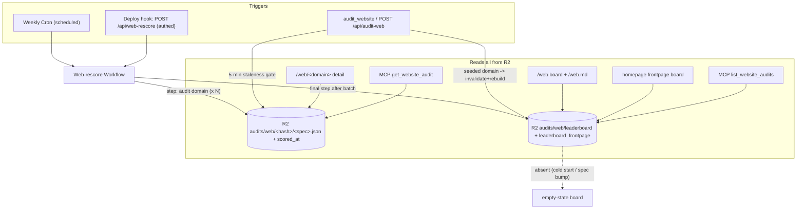

# feat: Web-audit R2 single-funnel (dynamic leaderboard + weekly rescore)

## Summary

Make R2 the single source of truth for every web-audit read surface, so the funnel no longer forks by "top of funnel."
Today the `/web` leaderboard, the homepage web board, and the MCP `list_website_audits` tool render committed
`scorecards/web/*.json` snapshots baked in at build time, while `/web/<domain>` and `get_website_audit` read R2-first. A
fresh audit updates R2 but not the build-static surfaces, so the same domain shows two scores (leaderboard 73% vs
detail/MCP 95% after the anc.dev release).

The redesign: drop committed web scorecards; keep only the domain **list** in `seed.yaml`, projected to a runtime
`web-seed.json`. A weekly Cloudflare Cron plus a post-deploy authed hook drives a **Cloudflare Workflow** that rescores
every seeded domain (one audit per step) and, as a final step after the batch completes, rebuilds two R2 aggregate
objects (`leaderboard`, `leaderboard_frontpage`). Every read surface reads R2: the board and homepage read the
aggregate, `/web/<domain>` and `get_website_audit` read per-domain R2, and `list_website_audits` reads the aggregate.
On-demand audits of a board domain invalidate and rebuild the aggregate; a 5-minute staleness gate suppresses redundant
re-runs. Cold start (fresh deploy or a `SPEC_VERSION` bump that rotates every R2 key) is handled by the deploy hook plus
an empty-state board.

This restores the CLI's single-funnel property (its curated catalog feeds `/scorecards`, `list_tools`, and
`get_scorecard` identically) — inverted for the web, where the shared source is R2 rather than a committed catalog,
because web scores churn.

---

## Problem Frame

**Current forked funnel** (confirmed by reading the surfaces):

| Surface                                 | Source                                            | Freshness        |
| --------------------------------------- | ------------------------------------------------- | ---------------- |
| `/web` board (`dist/web.html`)          | committed `scorecards/web/*.json` -> static build | frozen at deploy |
| homepage web board                      | committed seed via `06-homepage.mjs`              | frozen at deploy |
| `list_website_audits` (MCP)             | committed `index.json` projection                 | frozen at deploy |
| `/web/<domain>` detail                  | R2-first, committed projection on miss            | live or frozen   |
| `get_website_audit` (MCP)               | R2-first, committed projection on miss            | live or frozen   |
| `audit_website` / `POST /api/audit-web` | runs engine -> writes R2 (no `scored_at`)         | fresh            |

A fresh audit writes R2, so the R2-first surfaces move while the build-static surfaces stay frozen. Four read surfaces,
two sources.

**Reference pattern (CLI, do not change):** the curated catalog is the single source for `/scorecards`, `list_tools`,
and `get_scorecard`; R2 is only for arbitrary non-leaderboard tools. No fork. The web audit half-migrated the
detail/`get` paths to R2 but left the board/`list`/homepage on committed seeds.

**Why not mirror the CLI verbatim:** web audits are cheap, fast, and high-churn — the board should reflect fresh scores,
not a frozen commit. So the single source becomes **R2**, refreshed by a scheduled rescore.

---

## Requirements

Traceable to the locked design decisions from the originating conversation.

- **R1** — Every read surface resolves through R2: board + homepage read a leaderboard aggregate; `/web/<domain>` +
  `get_website_audit` read per-domain R2; `list_website_audits` reads the aggregate.
- **R2** — No committed web scorecards. `seed.yaml` keeps only the domain list, projected to a runtime `web-seed.json`
  the Worker reads.
- **R3** — A weekly Cloudflare Cron and a post-deploy authed hook both start a rescore that covers **all** seeded
  domains.
- **R4** — Rescore fans out (one audit per Workflow step) to respect Worker subrequest/CPU/deadline limits, not a serial
  loop in one invocation.
- **R5** — The cached payload carries `scored_at`; there is no R2 object TTL. "Expiry" is a logical staleness check that
  gates re-scoring only.
- **R6** — Two R2 aggregate objects: `leaderboard` (full board) and `leaderboard_frontpage` (top-N for the homepage),
  rebuilt once after a rescore batch finishes.
- **R7** — Any on-demand rescore of a board domain (via `audit_website` or `POST /api/audit-web`) invalidates and
  rebuilds the aggregate.
- **R8** — A 5-minute staleness gate: an on-demand audit re-runs only when the cached entry is older than 5 minutes;
  otherwise it serves cached.
- **R9** — Cold start (fresh deploy, empty R2, or a `SPEC_VERSION` bump that rotates every key) is handled by the deploy
  hook plus an empty-state ("scoring in progress") board; nothing is committed as a fallback.
- **R10** — The CLI scorecard funnel, the scoring engine/checks, and the existing rate-limit/Turnstile gates are
  unchanged.
- **R11** — Only one full-board rescore batch runs at a time. Overlapping triggers (weekly cron, deploy hook, a second
  deploy) coalesce or no-op rather than double-spending the audit budget.

---

## Key Technical Decisions

**KTD1 — Cloudflare Workflows for the rescore fan-out.** A single `scheduled()` invocation cannot audit the whole board
(each audit is ~25-35 subrequests with a 25s deadline; a serial loop blows Worker limits). A Workflow fans out one audit
per step and runs a **final "rebuild aggregate" step only after all audits complete** — the completion barrier R6 needs,
plus durability and retries. *Alternatives:* Queues (no native batch barrier; the aggregate rebuild would need a
countdown tracker in KV or a lazy rebuild-on-read) and a Durable Object orchestrator (reuses the repo's DO pattern but
hand-rolls batch progress + retries). Workflows is the cleanest fit for "rebuild once after the batch finishes."

**KTD2 — R2 for the aggregate, rebuilt on write.** Store `leaderboard` and `leaderboard_frontpage` in the existing
`SCORE_CACHE` bucket under `audits/web/<kind>/<SPEC_VERSION>.json`; rebuild them from the per-domain R2 entries when a
batch finishes and on any on-demand board-domain rescore. No new binding; a board read is a single object fetch.
*Alternative:* KV (faster small-object reads) adds a second store and a KV write per rescore for marginal latency gain
on a weekly-churn object.

**KTD3 — Logical staleness, no R2 TTL.** Add `scored_at` (ISO-8601) to the cached payload. Reads always return the entry
regardless of age (R5: the board serves "expired" entries). The 5-minute threshold (R8) gates only whether an on-demand
request re-runs. The existing `Cache-Control: max-age=300` stays as the edge header.

**KTD4 — Cold start = deploy hook + empty-state, no committed fallback.** The post-deploy hook starts the Workflow so a
fresh deploy or a `SPEC_VERSION` bump (which rotates every per-domain and aggregate key) repopulates R2 under the new
version. Until the first batch lands, the board and homepage render an empty-state. Dropping the committed projection
fallback (R2) means an unpopulated key yields empty-state, not a stale commit.

**KTD5 — Homepage frontpage board stays zero-JS via server-side inject.** The homepage is a static asset built zero-JS.
To keep that while going live, serve `/` through a Worker route that injects the `leaderboard_frontpage` rows into the
static shell server-side (mirrors the existing homepage MCP-descriptor / origin-rewrite inject patterns in
`src/worker/index.ts`), rather than adding a client fetch. Empty-state when the aggregate is absent. *Alternative:* a
client-side fetch of a frontpage endpoint — rejected to preserve the zero-JS homepage.

**KTD6 — Weekly cadence, all-domains-per-run via the Workflow.** `triggers.crons` runs weekly; each run rescores the
whole board (R3) through the Workflow fan-out (R4). Freshness between weekly runs comes from on-demand audits (R7) and
the deploy hook.

---

## High-Level Technical Design

Rescore + read funnel:

The Workflow's final step is the completion barrier: per-domain audits write R2 first, then a single aggregate rebuild
reads them back and writes the two board objects.

---

## Scope Boundaries

**In scope:** the eight implementation units below — cache layer, rescore Workflow, cron + deploy-hook wiring, on-demand
invalidation + staleness gate, runtime leaderboard renderer + dynamic `/web`, per-domain reads dropping the committed
fallback, homepage server-side inject, and cutover/tests/verification.

**Out of scope (unchanged):**

- The CLI scorecard funnel (`scorecards/*.json`, `/scorecards`, `list_tools`, `get_scorecard`, `score_cli`).
- The web-audit engine, registry, checks, and remediation content.
- The Turnstile / rate-limiter / kill-switch gates on the on-demand paths (reused as-is).

### Deferred to Follow-Up Work

- Sharding the rescore across multiple cron ticks if the board grows past a single Workflow instance's practical
  step/duration budget (revisit when the seed list is large; all-domains-per-run is fine at current board size).
- Historic web-scorecard retention (a dev-only archive of prior scores) — YAGNI for now.

---

## Prerequisites

- **Cloudflare Workflows must be enabled on the account** before U2. Confirm via `wrangler` (a `workflows` binding
  deploys cleanly) and the Cloudflare dashboard. If Workflows is unavailable on the plan, that is a blocker — resolve it
  or fall back to the Queues alternative in KTD1 before the fan-out work starts.

---

## Implementation Units

### U1. Cache layer: `scored_at` + aggregate + staleness helpers

**Goal:** Extend `cache.ts` so the payload carries `scored_at`, and add read/write helpers for the two aggregate objects
plus a staleness check.

**Requirements:** R5, R6, R8.

**Dependencies:** none.

**Files:** `src/worker/audit-web/cache.ts`, `tests/web-audit-cache.test.ts`.

**Approach:** Add `scored_at: string` to `CachedWebAudit`; set it in `put` (ISO now) and validate it in
`isCachedWebAudit` (tolerate legacy entries missing it — treat absent `scored_at` as maximally stale so they re-score).
Add `aggregateKeyFor(kind, specVersion)` -> `audits/web/<kind>/<SPEC_VERSION>.json` for `kind in {leaderboard,
leaderboard-frontpage}`; `getAggregate`/`putAggregate` mirroring `get`/`put` (malformed-entry delete, best-effort
write). Add `isStale(scoredAt, thresholdMs)`.

**Patterns to follow:** the existing `keyFor` / `get` / `put` / `isCachedWebAudit` shape in the same file;
refusal-to-cache-half-state and malformed-delete behavior.

**Test scenarios:**
- `put` stamps `scored_at`; `get` round-trips it.
- Legacy payload without `scored_at` reads back as stale (drives a re-score), not rejected as corrupt.
- `getAggregate` returns null on miss; `putAggregate` then `getAggregate` round-trips a board array.
- Malformed aggregate object is deleted and returns null.
- `isStale` true past the threshold, false within it, true when `scored_at` is absent.

**Verification:** cache unit tests pass; `keyFor` behavior unchanged for existing per-domain entries.

### U2. Web-rescore Workflow

**Goal:** A Cloudflare Workflow that audits every seeded domain (one per step) then rebuilds both aggregates in a final
step.

**Requirements:** R3, R4, R6.

**Dependencies:** U1.

**Files:** `src/worker/audit-web/rescore-workflow.ts` (new), `tests/web-audit-rescore-workflow.test.ts`,
`src/worker/audit-web/seed.ts` (new — runtime seed loader reading `web-seed.json`).

**Approach:** A `WorkflowEntrypoint` whose `run` loads the seed list from `web-seed.json` (via `ASSETS`), emits one
`step.do("audit:<domain>")` per domain that runs `runWebAudit` to completion and `cachePut`s the result (with
`scored_at`), then a final `step.do("rebuild-aggregate")` that reads the per-domain entries back and `putAggregate`s
`leaderboard` (full, sorted) and `leaderboard-frontpage` (top-N). Steps give per-domain retry + isolation; the final
step is the completion barrier. A per-domain audit failure is logged and skipped (the domain is absent from that board
rebuild), never failing the whole run. The run is idempotent and re-triggerable; single-flighting is enforced at the
trigger (U3, R11) via a stable instance id, so overlapping starts coalesce onto the in-flight instance.

**Patterns to follow:** `audit_website`'s engine-to-completion loop in `src/worker/mcp/tools/web-audit.ts`;
`14-web-scorecards-emit.mjs` `index` shape for the aggregate row fields (domain, url, name, description, score_pct,
score.relative/global).

**Test scenarios:**
- Given a stubbed seed of 3 domains and a stubbed engine, the run audits each and writes 3 per-domain R2 entries with
  `scored_at`.
- The final step rebuilds both aggregates from the per-domain entries; `leaderboard-frontpage` is the top-N slice.
- A single domain whose audit throws is skipped (2 entries written, run still completes, aggregate omits it).
- The aggregate rebuild runs after all audit steps (ordering asserted via step sequence).

**Verification:** workflow unit tests pass with a stubbed engine + R2; no reliance on live network.

### U3. Cron trigger, deploy hook, and bindings

**Goal:** Wire the weekly cron and the post-deploy authed hook to start the Workflow, and add the bindings.

**Requirements:** R3, R9.

**Dependencies:** U2.

**Files:** `src/worker/index.ts` (add `scheduled()`; add the `POST /api/web-rescore` authed route),
`src/worker/audit-web/route.ts` (rescore endpoint handler + auth check), `wrangler.jsonc` (`triggers.crons`, `workflows`
binding, `WEB_RESCORE_SECRET` var/secret — top-level and `env.staging`), `.github/workflows/deploy.yml` (post-deploy
step), `src/worker/worker-configuration.d.ts` (binding types), `tests/web-audit-rescore-endpoint.test.ts`.

**Approach:** Both triggers start the Workflow through a single-flight helper (R11): `create` with a stable instance id
(or a running-instance check) so a second start while a batch is in flight coalesces onto it instead of launching a
concurrent batch. `scheduled(controller, env, ctx)` calls the helper directly. A `POST /api/web-rescore` handler checks
a shared secret header against `WEB_RESCORE_SECRET` using a constant-time comparison (avoid a timing oracle on the
secret) and calls the same helper; unauthenticated calls get 401. `wrangler.jsonc`: set `triggers.crons` to a weekly
schedule at top level and `env.staging` (replacing the deliberate empty `crons`), add the `workflows` binding, and bind
`WEB_RESCORE_SECRET`. `deploy.yml` adds a step after each `wrangler deploy` that `curl`s the rescore endpoint with the
secret (from repo/env secrets) so a deploy repopulates R2 under the current `SPEC_VERSION`.

**Patterns to follow:** the existing metered-endpoint auth shape and `env.staging` binding-override structure in
`wrangler.jsonc`; the staging Turnstile-secret pattern for staging-vs-prod secret handling.

**Test scenarios:**
- `POST /api/web-rescore` with the correct secret starts the Workflow (stubbed `create`) and returns 202.
- Missing/wrong secret returns 401 and does not start the Workflow.
- `scheduled()` starts the Workflow once per invocation.
- A start while a batch instance is already running coalesces (no second concurrent instance created).
- `wrangler deploy --dry-run` (staging + prod config) parses with the new bindings + cron.

**Verification:** dry-run parses; endpoint unit tests pass; deploy.yml step present and secret-gated. **Execution
note:** verify the `wrangler.jsonc` migration/binding changes with a dry-run before any real deploy; the empty-`crons`
override exists precisely to force this deliberate decision.

### U4. On-demand invalidation + 5-minute staleness gate

**Goal:** After an on-demand audit of a board domain, rebuild the aggregate; add the staleness gate so a
cached-but-stale entry re-runs.

**Requirements:** R7, R8.

**Dependencies:** U1, U2 (shares the aggregate-rebuild helper).

**Files:** `src/worker/mcp/tools/web-audit.ts` (`audit_website`), `src/worker/audit-web/route.ts` (`handleWebAudit` /
`POST /api/audit-web`), `tests/web-audit-mcp-tools.test.ts`, `tests/web-audit-routes.test.ts`.

**Approach:** In both on-demand paths, after a successful `cachePut` of a domain that is in the seed list, trigger an
aggregate rebuild (extract the U2 rebuild into a shared helper callable outside the Workflow, or enqueue a single-step
rebuild). Replace the current "cache hit always short-circuits" with the staleness gate: a hit whose `scored_at` is
within 5 minutes serves cached; a hit older than 5 minutes falls through to the fresh-audit path (still subject to the
existing kill-switch/limiter/Turnstile gates). Off-board domains write per-domain R2 only (no aggregate touch),
unchanged.

**Patterns to follow:** the existing gate-ordering + `cachePut` calls in `audit_website` and `handleWebAudit`; the
seed-membership check reuses the U2 seed loader.

**Test scenarios:**
- On-demand audit of a seeded domain rebuilds the aggregate (stubbed helper called with the domain present).
- On-demand audit of a non-seeded domain writes per-domain R2 but does not rebuild the aggregate.
- Cache hit younger than 5 min serves cached (no engine run).
- Cache hit older than 5 min re-runs (engine invoked), subject to the existing gates.
- Kill-switch off + stale hit: still served from cache (cache state is data, ahead of the kill switch).

**Verification:** MCP-tool and route tests pass; the staleness gate does not bypass the rate-limiter/Turnstile gates on
the fresh path.

### U5. Runtime leaderboard renderer + dynamic `/web` route

**Goal:** Render `/web` and `/web.md` from the aggregate at request time, with an empty-state.

**Requirements:** R1, R9.

**Dependencies:** U1.

**Files:** `src/worker/audit-web/leaderboard-render.ts` (new — runtime TS port of the board HTML/markdown render),
`src/worker/audit-web/route.ts` (`handleWebLeaderboard` for `/web` + `/web.md`), `src/worker/index.ts` (dispatch `/web`
and `/web.md` to the new handler ahead of the asset-first fallback), `tests/web-audit-leaderboard-route.test.ts`.

**Approach:** Port the board render (rows, sort attributes, `.md` twin) from `src/build/web-leaderboard- render.mjs`
into a runtime TS module the Worker imports; keep the client sort script unchanged (it operates on rendered rows).
`handleWebLeaderboard` reads the `leaderboard` aggregate, renders the full page (HTML) or the `.md` twin, and returns an
empty-state ("scoring in progress") when the aggregate is absent. Route `/web`
+ `/web.md` in `src/worker/index.ts` before the asset dispatch so the static `dist/web.html` no longer serves
the board.

**Patterns to follow:** `handleWebResultPage`'s page/`.md`-twin shaping via the Worker's runtime renderer
`src/worker/audit-web/summary-render.ts` (`buildWebSummaryBody`/`buildWebSummaryMarkdown`) — the build-time `emitShell`
is not importable in the Worker, so the runtime board render must use the same runtime shell the result page uses; the
content-negotiation + Cache-Control conventions already in the web routes.

**Test scenarios:**
- Aggregate present: `/web` renders board rows for each entry; `/web.md` renders the markdown twin.
- Aggregate absent: both render the empty-state, HTTP 200, no server error.
- Sort attributes (`data-global`/`data-relative`) present so the existing client sort still works.
- `/web` no longer falls through to `dist/web.html`.

**Verification:** route tests pass; `/web` is served dynamically; empty-state renders on a cold aggregate.

### U6. Per-domain + list reads drop the committed fallback

**Goal:** `/web/<domain>`, `get_website_audit`, and `list_website_audits` read only R2 (per-domain or aggregate); remove
the committed-projection fallbacks.

**Requirements:** R1, R2.

**Dependencies:** U1, U5.

**Files:** `src/worker/audit-web/route.ts` (`handleWebResultPage` — drop `loadCuratedScorecard`),
`src/worker/mcp/tools/web-audit.ts` (`resolveScorecard` — drop `loadCuratedProjection`; `list_website_audits` — read the
`leaderboard` aggregate), `tests/web-audit-mcp-tools.test.ts`, `tests/web-audit-routes.test.ts`.

**Approach:** `resolveScorecard` returns the per-domain R2 entry or null (no `loadCuratedProjection`).
`get_website_audit` on a miss returns `{ found:false, next_tool:"audit_website" }` (unchanged shape).
`handleWebResultPage` renders a not-found / "not yet scored" state on an R2 miss instead of the committed projection.
`list_website_audits` reads `getAggregate("leaderboard")` and maps to the summary shape (empty array when absent).
Remove the now-dead `loadCuratedProjection` / `loadCuratedScorecard` helpers.

**Patterns to follow:** the existing `resolveScorecard` / `list_website_audits` return shapes (preserve them);
`handleWebResultPage`'s existing rendering.

**Test scenarios:**
- `get_website_audit` hit from R2 returns `found:true`; miss returns `found:false, next_tool`.
- `/web/<domain>` on an R2 hit renders the scorecard; on a miss renders the not-yet-scored state (no committed
  fallback).
- `list_website_audits` returns aggregate entries; empty array when the aggregate is absent.
- The `CURATED_ANC` / committed-projection fixtures are removed from the tests without leaving dead asserts.

**Verification:** MCP-tool + route tests pass; no code path reads `/_internal/web-scorecards/*`.

### U7. Homepage frontpage board via server-side inject

**Goal:** The homepage web board reflects `leaderboard_frontpage` from R2, zero-JS, with an empty-state.

**Requirements:** R1, R9.

**Dependencies:** U1, U5.

**Files:** `src/worker/index.ts` (route `/` through a handler that injects the frontpage rows into the static homepage
shell), `src/build/06-homepage.mjs` (stop building the web board rows from the committed seed; emit a stable placeholder
region the Worker fills), `src/worker/audit-web/leaderboard-render.ts` (a frontpage-rows renderer shared with U5),
`tests/web-audit-homepage-inject.test.ts`.

**Approach:** `06-homepage.mjs` emits the homepage with a marked, empty web-board region (keeps the CLI board static).
The Worker's `/` handler fetches the static shell via `ASSETS`, reads `getAggregate("leaderboard-frontpage")`, renders
the frontpage rows, and injects them into the marked region (empty-state copy when absent) before returning. Reuse the
U5 renderer for row markup.

**Patterns to follow:** the existing homepage-inject / origin-rewrite handling in `src/worker/index.ts` (server-side
HTML rewrite of a static asset); the CLI board rows in `06-homepage.mjs` for row structure.

**Test scenarios:**
- Aggregate present: `/` injects frontpage rows into the marked region.
- Aggregate absent: `/` injects the empty-state copy; page still renders 200.
- The CLI board region is untouched by the inject.
- No client JS is required for the web board to display.

**Verification:** homepage-inject tests pass; the homepage remains zero-JS; the web board is live.

### U8. Cutover, docs, and staging verification

**Goal:** Remove the committed web scorecards and the static leaderboard build, update the seed projection, refresh
docs/preflight, and verify end-to-end on staging.

**Requirements:** R2, R9, R10.

**Dependencies:** U1-U7.

**Files:** delete `scorecards/web/*.json`; `src/build/14-web-scorecards-emit.mjs` (emit runtime
`dist/_internal/web-seed.json` from `seed.yaml`; stop emitting `dist/web.html`, per-seed projections, and `index.json`);
`src/build/web-leaderboard-render.mjs` (retire the static-build render or reduce to shared helpers now living in the
runtime module); `src/data/web-audit/seed.yaml` (unchanged shape — domain list only);
`docs/runbooks/web-audit-operations.md` (replace the "regenerate a committed web seed" section with the new
cron/deploy-hook rescore + empty-state ops); `scripts/release/preflight.sh` / `scripts/release/postflight.sh`
(web-surface gates read the dynamic board + aggregate, not the committed seed); affected tests (`tests/build.test.ts`,
`tests/web-audit-scorecard-format.test.ts`, any test asserting committed `scorecards/web/*`).

**Approach:** Cut over the build to emit only the runtime seed projection; delete the committed scorecards and their
build path; update the runbook so operators trigger/verify a rescore instead of committing a seed; update
preflight/postflight web assertions to the dynamic surfaces. Then a staging pass: deploy the branch, hit `POST
/api/web-rescore` (staging secret) to run the Workflow, and verify R2 per-domain + aggregates populate, `/web` +
homepage render live, MCP `list_website_audits` matches `get_website_audit`, and the cold-start empty-state renders
before the first batch.

**Patterns to follow:** the existing preflight/postflight web gates; the staging CF Access + rescore-secret handling.

**Test scenarios:**
- `bun run build` emits `dist/_internal/web-seed.json` and no longer emits `dist/web.html` or
  `dist/_internal/web-scorecards/*`.
- `web-seed.json` carries `{domain,url,name,description}` for each `seed.yaml` entry; malformed entries are skipped with
  a warning (mirrors current loader behavior).
- No test or build path references `scorecards/web/*.json`.
- Build integrity check passes (leaderboard entry count sourced from the seed, not committed scorecards).

**Test expectation:** the staging e2e is manual verification (documented steps), not an automated test.

**Verification:** build emits the seed projection only; committed scorecards gone; runbook + preflight updated; staging
shows a single R2-sourced funnel (board == detail == MCP) after a rescore, and an empty-state before one. **Execution
note:** land the read-side units (U5-U7) and the write-side units (U1-U4) before the U8 cutover deletes the committed
seeds, so the board is never sourced from a deleted file mid-migration.

---

## Risks & Dependencies

- **`SPEC_VERSION` key rotation (primary correctness concern).** Per-domain and aggregate keys embed `SPEC_VERSION`; a
  spec bump orphans every entry, emptying the board until the deploy hook's Workflow finishes. Mitigation: the deploy
  hook (U3) fires the rescore on every deploy, and the empty-state (U5/U7) covers the gap. Verify the deploy-hook path
  in the U8 staging pass specifically after a simulated version change.
- **Workflow instance limits.** All-domains-per-run assumes the board fits one Workflow instance's step and duration
  budget. Fine at current board size; the deferred sharding item covers growth. Flag if the seed list grows large.
- **Aggregate vs batch races.** Full-board batches are single-flighted (R11), so two never run at once. During a running
  batch the aggregate serves the prior snapshot (acceptable per R5); a single-domain on-demand rebuild (U4) concurrent
  with the batch's final rebuild resolves last-writer-wins (minor, self-heals next batch).
- **Deploy-hook secret management.** `WEB_RESCORE_SECRET` must exist in prod + staging (wrangler secret) and in the
  deploy workflow's secret store; a missing secret makes the post-deploy pass a silent 401. The U3 tests assert the 401
  path; the deploy step should fail loudly on non-2xx.
- **Dependency ordering.** U8 (delete committed seeds) must land after U5-U7 (dynamic reads) or the board briefly has no
  source.

---

## System-Wide Impact

- **Operators:** the "regenerate and commit a web scorecard" runbook step disappears; rescoring is a
  cron/deploy-hook/on-demand operation. Preflight/postflight web gates change from asserting committed seeds to
  asserting the live aggregate.
- **Agents (MCP):** `list_website_audits` and `get_website_audit` now always agree with the board and each other (single
  funnel). Response shapes are preserved.
- **Repo hygiene:** `scorecards/web/*.json` leaves the tree; the just-merged #221 seed regen becomes moot once this
  lands (expected).
- **Deploy:** a new post-deploy step and a weekly cron; a new Workflows binding and secret.

---

## Open Questions (execution-time)

- Exact weekly cron expression and `leaderboard_frontpage` top-N count (pick sensible defaults at implementation; both
  are trivially tunable).
- Whether the on-demand aggregate rebuild (U4) reuses the Workflow's final-step helper directly or runs a one-shot
  rebuild inline — decide when the U2 helper's shape is concrete.
- The precise marker/injection mechanism for the homepage web-board region (U7) — resolve against the actual
  `06-homepage.mjs` output and the existing inject helpers.

---

## Sources & Research

Codebase (read during triage): `src/worker/audit-web/cache.ts`, `src/worker/mcp/tools/web-audit.ts`,
`src/worker/audit-web/route.ts`, `src/worker/index.ts`, `src/build/14-web-scorecards-emit.mjs`,
`src/build/web-leaderboard-render.mjs`, `src/build/06-homepage.mjs`, `src/data/web-audit/seed.yaml`, `wrangler.jsonc`,
`.github/workflows/deploy.yml`. Reference pattern: the CLI catalog funnel (`/scorecards` + `list_tools` +
`get_scorecard`). Institutional learning:
`docs/solutions/architecture-patterns/cached-theater-live-fallback-2026-04-17.md` (pre-computation vs live fallback for
scoring services) — this plan moves the web surface from committed-precompute to live-R2-with-scheduled-refresh.
