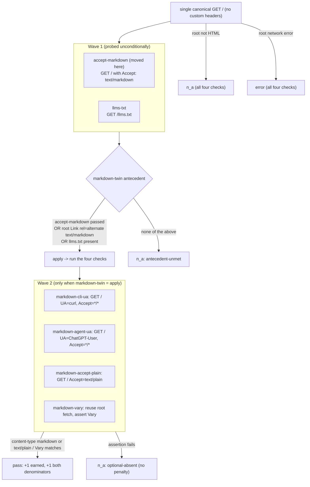

# feat: reward markdown-to-agents web-audit checks (MAY, gated by a markdown-twin antecedent)

## Summary

Add four MAY-tier web-audit checks that reward a site for serving its markdown twin to agents, mirroring the content
negotiation this site just shipped: (a) a bare CLI User-Agent (curl) receives markdown, (b) an AI on-demand user-fetch
User-Agent (ChatGPT-User) receives markdown, (c) `Accept: text/plain` returns markdown, and (d) the negotiated response
carries `Vary: Accept, User-Agent`. All four are gated by a new `markdown-twin` antecedent that flips them to `n_a` when
the audited site exposes no markdown twin at all, so they are a bonus for sites that already ship markdown, never a
penalty for sites that do not. These are agent-friendliness probes the anc auditor runs against other people's sites;
the site being audited is the subject, not this repo.

The work is registry + antecedent + remediation + tests, plus the wave-1 reordering of one existing check so the
antecedent can read its result. No scorecard-envelope change, no schema-version bump.

---

## Problem Frame

The web-audit registry (`src/data/web-audit/registry.yaml`) already rewards one markdown affordance: `accept-markdown`
(SHOULD) checks that `Accept: text/markdown` on `/` returns markdown. This site's just-shipped content negotiation
(`src/worker/accept.ts`, `src/worker/headers.ts`) goes further: it hands the markdown twin to bare CLI/library
User-Agents and to AI user-fetchers (ChatGPT-User, Claude-User, Perplexity-User) when the client states no content-type
preference, treats `Accept: text/plain` as a markdown request, and emits `Vary: Accept, User-Agent` so a shared cache
never serves one client the wrong variant.

The auditor should recognize and reward these same behaviors on the sites it grades, but only for sites that already
ship markdown. The product framing from the request: "contingent on shipping any md at all, the website owner MAY also
do these to improve their agent friendliness." So the checks are MAY-tier (registry `tier: optional`), and an antecedent
gates them to `n_a` when the site exposes no markdown twin.

Two facts about the audit's scoring model shape the design (`src/worker/audit-web/score.ts`,
`content/web-scorecard-schema.md`):

- A MAY check that is applicable but simply absent finalizes to `n_a` (`na_reason: optional-absent`) and is excluded
  from both scores. So these checks reward good behavior; their absence costs nothing. This is exactly the MAY semantics
  the framing asks for.
- The GLOBAL score denominator (`universeMaxOf`) sums every registry check at its tier weight regardless of
  applicability. Adding four MAY checks raises that denominator by 4 (from 78 to 82) for every audited site, so a site
  that does not adopt them sees a small GLOBAL dip. This is the intended "raising the bar" behavior of the global score
  and matches how every prior check addition behaved; the RELATIVE (headline) score is unaffected for non-adopters
  because the checks land as `n_a`.

---

## Requirements

- **R1** Add a MAY check that passes when a bare CLI/library User-Agent stating no content-type preference receives the
  markdown twin from `/`.
- **R2** Add a MAY check that passes when an AI on-demand user-fetch User-Agent (ChatGPT-User as the representative)
  stating no content-type preference receives the markdown twin from `/`.
- **R3** Add a MAY check that passes when `Accept: text/plain` on `/` returns markdown.
- **R4** Add a MAY check that passes when the negotiated response carries `Vary` listing both `Accept` and `User-Agent`.
- **R5** Gate R1-R4 by a `markdown-twin` antecedent that resolves `apply` only when the site exposes a markdown twin (an
  HTML root plus any of: `accept-markdown` passed, a `text/markdown` `rel="alternate"` Link header on the root, or
  `/llms.txt` present), and `n_a` otherwise. A non-HTML root resolves `n_a`; a root network failure resolves `error`
  (consistent with the existing `html-root` token).
- **R6** Each new check has a matching 1:1 entry in `src/data/web-audit/remediation.yaml` (title, goal, fix, resources)
  so the build's registry-to-remediation coverage validation passes and each check gets a generated
  `/web-audit/skill/<id>` page.
- **R7** New checks are scored with the existing MAY treatment: `pass` earns weight 1 in both scores; an applicable miss
  finalizes to `n_a` (no penalty); an unmet antecedent finalizes to `n_a` with `na_reason: antecedent-unmet`.
- **R8** The scorecard envelope (`schema_version`) and the registry `version` are unchanged: only new check rows are
  added, no field is added or reshaped.
- **R9** Existing tests that hardcode the registry size, the universe max, or the wave-1 source set are updated to the
  new totals, and new tests cover the antecedent, the wave-1 reorder, and end-to-end behavior of the four checks.
- **R10** `content/web-audit.md`'s "Content for agents" description is updated to mention the new markdown-to-agents
  rewards (consumer-facing doc; ships through the same PR).

---

## Key Technical Decisions

### KTD1. Four separate checks, not one combined check

Each of the four behaviors is an independently-remediable implementation effort (UA sniffing for CLI clients, UA
sniffing for AI user-fetchers, `text/plain` negotiation, and cache-correct `Vary`). Splitting them gives partial credit,
per-behavior remediation and skill pages, and matches the registry's existing granular philosophy (`accept-markdown`,
`root-meta-description`, `noscript-fallback` are each their own check). The `http` handler takes one header set per
check, so combining (a) and (b) would force a single representative UA and lose the CLI-vs-agent distinction.
Alternative (one "serves markdown to agents" check) is rejected under Alternatives Considered.

### KTD2. New `markdown-twin` antecedent folds the HTML-root precondition in

The registry schema allows one antecedent token per check (`antecedent: <token>`), but the new checks need two
conditions: the root is an HTML page (a markdown twin is an affordance of an HTML page) AND the site ships markdown.
`markdown-twin` folds both in: it returns `error` on root network failure, `n_a` on a non-HTML root, then `apply` when
any markdown signal holds. This keeps the single-token schema intact and mirrors how `html-root` already special-cases
the root.

### KTD3. The antecedent's markdown signal is a three-way disjunction, with `accept-markdown` moved to wave 1

`markdown-twin` resolves `apply` when any of these holds: `accept-markdown` passed, the root advertises a
`text/markdown` `rel="alternate"` Link header, or `/llms.txt` is present. To read `accept-markdown`'s result, the
antecedent resolver needs it in the wave-1 `sources` map, so `accept-markdown` moves into `WAVE1_CHECK_IDS`
(`src/worker/audit-web/antecedents/waves.ts`). Its own gating (`html-root`) and final result are unchanged; only its
probe order moves earlier. Cost: on a non-HTML root, `accept-markdown` now probes before being gated to `n_a`, one extra
subrequest for API-only sites (negligible against the ~25s per-audit deadline and the existing ~15-20 subrequests). The
Link-header and llms.txt disjuncts already catch faithful mirrors of this site (which emit the Link alternate on every
HTML response and publish llms.txt); the `accept-markdown` disjunct additionally catches sites that negotiate markdown
without advertising it. Alternative (drop `accept-markdown`, detect via Link + llms.txt only, no wave change) is under
Alternatives Considered.

### KTD4. `markdown-vary` reuses the canonical root fetch; the content probes fetch fresh

The `http` handler reuses the single canonical root fetch only when `path === /`, method GET, and no custom headers
(`src/worker/audit-web/handlers/http.ts`). `markdown-vary` sends no headers, so it reuses the root fetch and asserts its
`Vary` header (zero extra subrequest). The three content probes (R1-R3) send custom headers (a User-Agent or an
`Accept`), so each is a fresh subrequest, which is required because they test client-specific negotiation.

### KTD5. No status expectation on the content probes, so a miss lands as `n_a`, not `broken`

The three content probes use `expect: { content_type: "markdown|text/plain" }` with no `status`/`status_below` key. Per
the `http` handler's `classifyMiss`, an assertion failure without a status expectation classifies as `absent`, and a MAY
`absent` finalizes to `n_a` (no penalty). This is deliberate: a markdown-shipping site that does not UA-sniff or honor
`text/plain` should forgo the reward, not be penalized, which is the MAY contract. Adding a `status` expectation would
flip misses to `broken` (a penalty) and violate the framing. `markdown-vary` likewise uses only `header_regex`, so a
missing `Vary` also lands as `n_a`.

### KTD6. Category `content-for-agents`, principle `P2`, weight `1`

All four join the existing `content-for-agents` category next to `accept-markdown`. Principle `P2` (machine-parseable
content for agents) matches `accept-markdown`. Weight `1` is the MAY convention (the per-check `weight` field is not
consulted by the scorer today, but the build requires a positive integer). No `category_order` change.

### KTD7. No schema-version or registry-version bump

The scorecard envelope gains no field and changes no shape; it carries more result rows and a slightly larger
`coverage_summary.may.total` for markdown sites. `content/web-scorecard-schema.md`'s `coverage_summary` example is
illustrative, not a contract on the count, so it needs no change. `WEB_SCHEMA_VERSION` stays `0.2` and the registry
`version` stays `1`.

---

## High-Level Technical Design

Antecedent resolution and wave flow for the new checks (the audit runs wave 1 unconditionally, resolves antecedents from
wave-1 results plus the single root fetch, then runs wave 2):



The four checks (all `content-for-agents`, `tier: optional` -> keyword `may`, `principle: P2`, `weight: 1`, `antecedent:
markdown-twin`, `handler: http`):

| id                      | Probe                                                      | Assertion                                                         | Reuses root fetch?  |
| ----------------------- | ---------------------------------------------------------- | ----------------------------------------------------------------- | ------------------- |
| `markdown-cli-ua`       | `GET /` with `User-Agent: curl/...`, `Accept: */*`         | `content_type: markdown\|text/plain`                              | no (custom headers) |
| `markdown-agent-ua`     | `GET /` with `User-Agent: ChatGPT-User/...`, `Accept: */*` | `content_type: markdown\|text/plain`                              | no (custom headers) |
| `markdown-accept-plain` | `GET /` with `Accept: text/plain`                          | `content_type: markdown\|text/plain`                              | no (custom headers) |
| `markdown-vary`         | `GET /` (no headers)                                       | `header_regex` on `vary` requiring both `accept` and `user-agent` | yes                 |

Scoring deltas: registry check count 36 -> 40 (tier distribution 3 MUST / 15 SHOULD / 18 MAY -> 3 / 15 / 22);
`universeMaxOf` 78 -> 82.

---

## Implementation Units

### U1. Move `accept-markdown` into the wave-1 source set

**Goal:** Make `accept-markdown`'s probe result available to antecedent resolution so `markdown-twin` (U2) can read it.

**Requirements:** R5, R9.

**Dependencies:** none.

**Files:**
- `src/worker/audit-web/antecedents/waves.ts` (modify: add `'accept-markdown'` to `WAVE1_CHECK_IDS`)
- `tests/web-audit-antecedents-waves.test.ts` (modify: add `'accept-markdown'` to the expected membership list)

**Approach:**
- Add `'accept-markdown'` to the `WAVE1_CHECK_IDS` set. Update the module comment to note it is a wave-1 source because
  the `markdown-twin` antecedent reads its pass/fail (WHY-only, no plan/KTD identifier in the comment).
- No engine change: the engine already probes every wave-1 check unconditionally, stores its outcome in `sources`, and
  applies the check's own gate (`html-root`) afterward, so `accept-markdown`'s final result is unchanged. Precedent:
  `openapi` is already a wave-1 source gated by its own `api-surface` antecedent and finalizes correctly, which is the
  same shape this move relies on.

**Patterns to follow:** the existing `WAVE1_CHECK_IDS` entries and their comment (notably `openapi`).

**Test scenarios:**
- `WAVE1_CHECK_IDS.has('accept-markdown')` is `true`.
- Every existing wave-1 id is still present (guard against accidental deletion).

**Verification:** `bun test tests/web-audit-antecedents-waves.test.ts` passes; the engine still finalizes
`accept-markdown` as before (covered by U6's end-to-end pass case and existing engine tests).

### U2. Add the `markdown-twin` antecedent token, resolver, and evidence

**Goal:** Introduce the gate that flips the four new checks to `n_a` when the site ships no markdown twin.

**Requirements:** R5.

**Dependencies:** U1 (the resolver reads `accept-markdown` from wave-1 `sources`).

**Files:**
- `src/worker/audit-web/registry.ts` (modify: add `'markdown-twin'` to the `AntecedentToken` union)
- `src/build/13-web-audit-registry.mjs` (modify: add `'markdown-twin'` to the `WEB_AUDIT_ANTECEDENTS` set)
- `src/worker/audit-web/antecedents/content.ts` (modify: add the `markdownTwin` resolver to `contentResolvers` and its
  unmet-evidence string to `contentEvidence`)
- `tests/web-audit-antecedents-content.test.ts` (modify: add `markdown-twin` resolver cases)

**Approach (directional resolver sketch; the comment states the constraint, no identifiers):**

```ts
// A markdown twin is an affordance of an HTML page: a non-HTML root has no twin to serve.
const markdownTwin: AntecedentResolver = (ctx) => {
  if (ctx.root === null || ctx.root.status === null) return 'error';
  if (!rootContentType(ctx).includes('text/html')) return 'n_a';
  const link = ctx.root.headers.link ?? '';
  const advertisesMdAlternate = /rel=["']?alternate["']?/i.test(link) && /text\/markdown/i.test(link);
  return sourcePassed(ctx, 'accept-markdown') || sourcePassed(ctx, 'llms-txt') || advertisesMdAlternate
    ? 'apply'
    : 'n_a';
};
```

- Import `rootContentType` alongside the existing `sourcePassed` from `./context` in `content.ts`.
- Evidence string (shown on a gated-out row): `site exposes no markdown twin (no text/markdown negotiation, no markdown
  alternate link, no llms.txt)`.
- Adding the token to the `AntecedentToken` union without a resolver is a compile error: `index.ts` composes `RESOLVERS`
  and `UNMET_EVIDENCE` as full `Record<AntecedentToken, ...>` via spreads, so the resolver and evidence MUST land in the
  same change. This is the intended fail-fast.
- Adding the token to the union without adding it to the build's `WEB_AUDIT_ANTECEDENTS` set makes the build abort the
  moment U3's registry references it, so both edits ship together.

**Patterns to follow:** `docsSite` / `rootLlmsTxt` in `src/worker/audit-web/antecedents/content.ts` (resolver + evidence
+ `satisfies Partial<Record<...>>`), and `htmlRoot` in `src/worker/audit-web/antecedents/root.ts` (the `error` on
network failure, `n_a` on non-HTML pattern).

**Test scenarios (use the `ctx` / `htmlRoot` / `outcome` helpers in `tests/web-audit-antecedents-helpers.ts`):**
- `apply` when `accept-markdown` passed: `ctx({ sources: new Map([['accept-markdown', outcome('pass')]]) })`.
- `apply` when `/llms.txt` present: `ctx({ sources: new Map([['llms-txt', outcome('pass')]]) })`.
- `apply` when the root advertises a markdown alternate: `ctx({ root: { ...htmlRoot(), headers: { 'content-type':
  'text/html; charset=utf-8', link: '</index.md>; rel="alternate"; type="text/markdown"' } } })`.
- `n_a` when the root is HTML but none of the three signals holds (default `ctx()` with an empty `sources`).
- `n_a` when the root is not HTML even if llms.txt passed: root content-type `application/json`, `sources` has
  `llms-txt` pass -> still `n_a` (the HTML precondition wins).
- `error` when the root failed at the network level: `ctx({ root: null })`.
- The Link disjunct does not false-positive on a non-markdown alternate: a `link` header with `rel="alternate"` but
  `type="application/json"` and no `text/markdown` -> `n_a`.

**Verification:** `bun test tests/web-audit-antecedents-content.test.ts` passes; `bunx tsc --noEmit` (or the repo's
typecheck) is clean, proving the union/resolver/evidence are complete.

### U3. Add the four checks to the registry

**Goal:** Register `markdown-cli-ua`, `markdown-agent-ua`, `markdown-accept-plain`, `markdown-vary`.

**Requirements:** R1, R2, R3, R4, R6, R7.

**Dependencies:** U2 (checks reference `antecedent: markdown-twin`).

**Files:**
- `src/data/web-audit/registry.yaml` (modify: append the four checks to the `content-for-agents` section, after
  `accept-markdown`)

**Approach (directional YAML; final wording refined at implementation):**

```yaml
  - id: markdown-cli-ua
    category: content-for-agents
    tier: optional
    principle: P2
    site_types: [all]
    antecedent: markdown-twin
    weight: 1
    title: Bare CLI User-Agent receives the markdown twin
    handler: http
    with:
      path: /
      headers: { User-Agent: "curl/8.7.1", Accept: "*/*" }
      expect: { content_type: "markdown|text/plain" }
    hint: 'Serve the markdown twin to shell HTTP clients (curl/wget/library UAs) that state no content-type preference, so scripted fetches get source, not HTML chrome.'

  - id: markdown-agent-ua
    category: content-for-agents
    tier: optional
    principle: P2
    site_types: [all]
    antecedent: markdown-twin
    weight: 1
    title: AI user-fetch User-Agent receives the markdown twin
    handler: http
    with:
      path: /
      headers: { User-Agent: "ChatGPT-User/1.0 (+https://openai.com/bot)", Accept: "*/*" }
      expect: { content_type: "markdown|text/plain" }
    hint: 'Serve the markdown twin to AI on-demand user-fetchers (ChatGPT-User, Claude-User, Perplexity-User) that state no content-type preference.'

  - id: markdown-accept-plain
    category: content-for-agents
    tier: optional
    principle: P2
    site_types: [all]
    antecedent: markdown-twin
    weight: 1
    title: Accept text/plain returns the markdown twin
    handler: http
    with:
      path: /
      headers: { Accept: "text/plain" }
      expect: { content_type: "markdown|text/plain" }
    hint: 'Treat Accept text/plain as a markdown request: return the raw markdown source, not HTML chrome.'

  - id: markdown-vary
    category: content-for-agents
    tier: optional
    principle: P2
    site_types: [all]
    antecedent: markdown-twin
    weight: 1
    title: Negotiated responses carry Vary Accept, User-Agent
    handler: http
    with:
      path: /
      expect:
        header_regex: { name: vary, pattern: "(?=.*accept)(?=.*user-agent)" }
    hint: 'Emit Vary: Accept, User-Agent when the markdown twin is negotiated on the same URL, so shared caches never serve one client the wrong variant.'
```

- The `Accept: "*/*"` on the two UA probes makes the UA heuristic fire against a site that mirrors this repo's
  `detectPreference`, which treats `*/*` as "no content-type preference" (see `src/worker/accept.ts`). A site whose
  logic only fires the UA path when `Accept` is entirely absent may not be detected; this is acceptable because the
  reference contract treats `*/*` and absent identically (recorded as an Open Question).
- `markdown-vary` intentionally has no `headers` key so the `http` handler reuses the canonical root fetch.
- The `header_regex` pattern uses two lookaheads so it matches `Vary` regardless of token order and is case-insensitive
  (the handler compiles it with the `i` flag).

**Patterns to follow:** the existing `accept-markdown` and `root-meta-description` entries in the same section.

**Test scenarios:** covered by U5 (count/distribution) and U6 (behavior); the build's own registry validation
(`normalizeWebAuditRegistry`) rejects a malformed entry (unknown antecedent, missing field, bad tier), which
`tests/build.test.ts` exercises.

**Verification:** the build (`bun run build` or the repo's build entry) emits `dist/_internal/web-audit-registry.json`
with 40 checks and no error; `markdown-twin` resolves without an "unknown antecedent" abort.

### U4. Add the four remediation entries

**Goal:** Keep registry-to-remediation 1:1 and generate a `/web-audit/skill/<id>` page per new check.

**Requirements:** R6.

**Dependencies:** U3 (ids must match).

**Files:**
- `src/data/web-audit/remediation.yaml` (modify: append four entries keyed by the new ids)

**Approach:**
- One entry per id with `title` (matching the registry title), `goal` (one-line imperative), `fix` (markdown, a short
  paragraph explaining how to serve the twin to that client class or emit `Vary`), and `resources` (doc links).
  Suggested resources: RFC 7763 (`text/markdown`) for the content probes; RFC 9110 section on `Vary` / MDN `Vary` for
  `markdown-vary`; the OpenAI/Anthropic/Perplexity crawler-UA docs for `markdown-agent-ua`.
- `normalizeWebRemediation` asserts 1:1 coverage and rejects `body`/`evidence_template`/`{{evidence}}` fields and a
  non-`http(s)` resource url, so keep the shape exactly like the `accept-markdown` entry.

**Patterns to follow:** the `accept-markdown` remediation entry (`src/data/web-audit/remediation.yaml`).

**Test scenarios:** covered by U5 / `tests/web-remediation.test.ts` (1:1 coverage) and `tests/web-audit-skills.test.ts`
(skill-page and skills-index counts, which derive from `checks.length` and stay green only when registry and remediation
stay 1:1).

**Verification:** the build emits `dist/_internal/web-remediation.json` with no "no remediation entry" / "orphan
remediation" abort; four new `/web-audit/skill/<id>` pages generate.

### U5. Update hardcoded registry-size, universe-max, and tier-distribution assertions

**Goal:** Bring existing tests to the new totals.

**Requirements:** R8, R9.

**Dependencies:** U3.

**Files:**
- `tests/web-audit-scoring.test.ts` (modify: `checks.length` 36 -> 40 at both assertion sites; `universeMax` 78 -> 82;
  and the tier-distribution assertions at all three sites, `optional`/`may` 18 -> 22: the `{ required: 3, recommended:
  15, optional: 18 }` object, the `{ must: 3, should: 15, may: 18 }` object, and the "3/15/18 tier distribution, so
  universeMax is unchanged" test's numbers and message -> 3/15/22 and 82)
- `tests/web-audit-routes.test.ts` (modify: `checks.length` 36 -> 40)
- `tests/web-remediation.test.ts` (modify: `checkIds.length` 36 -> 40, and the "no misses across all 36" title string ->
  40; this file is named in U4's prose but was omitted here, and its assertion reds CI if left at 36)

**Approach:**
- Update literals only; do not change the assertions' intent. The two-score parity fixture
  (`tests/web-audit-two-score.test.ts`, `tests/fixtures/web-audit-score-parity.json`) uses a synthetic universe
  (5/15/16), not the real registry, so it is decoupled from this change; run it to confirm, but expect no edit. The
  Python mirror `scripts/scoring/score_model.py` is likewise formula-only and pinned by that synthetic fixture, so it
  needs no change.

**Test scenarios:** the updated assertions pass; the two-score parity test and `score_model.py` parity remain green with
no fixture edit.

**Verification:** `bun test tests/web-audit-scoring.test.ts tests/web-audit-routes.test.ts
tests/web-audit-two-score.test.ts` passes.

### U6. End-to-end engine tests for the four checks

**Goal:** Prove the gating and pass/optional-absent behavior against a synthetic fetch.

**Requirements:** R1, R2, R3, R4, R5, R7.

**Dependencies:** U1, U2, U3.

**Files:**
- `tests/web-audit-markdown-rewards.test.ts` (create) OR extend `tests/web-audit-antecedents-engine.test.ts` following
  its existing `runWebAudit` + injected `fetchImpl` pattern.

**Approach:**
- Drive `runWebAudit` with a `fetchOptions.fetchImpl` that emulates a site mirroring this repo's negotiation: returns
  HTML with `Link: </index.md>; rel="alternate"; type="text/markdown"` and `Vary: Accept, User-Agent` for a plain `GET
  /`; returns `text/markdown` when the request carries a CLI UA + `Accept: */*`, an AI user-fetch UA + `Accept: */*`, or
  `Accept: text/markdown`/`Accept: text/plain`. Assert all four new checks land `pass`.
- Drive a second `fetchImpl` for a site that ships no markdown (HTML root, no markdown alternate Link, no llms.txt,
  returns HTML regardless of UA/Accept). Assert the four checks land `n_a` with `na_reason: antecedent-unmet`.
- Drive a third `fetchImpl` for a markdown-shipping site that does NOT UA-sniff and does not honor `text/plain` and
  omits `Vary` (root advertises the markdown alternate Link so the antecedent still holds, but the client probes come
  back HTML / no Vary). Assert the four checks land `n_a` with `na_reason: optional-absent` (applicable, unimplemented,
  no penalty).
- Assert a scoring consequence on the all-pass case: `coverage_summary.may.verified` includes the four, and the four
  contribute to `earned`; on the antecedent-unmet case they are excluded from `score.relative`.

**Patterns to follow:** `tests/web-audit-antecedents-engine.test.ts` (engine wiring with an injected `fetchImpl`) and
`tests/web-audit-handlers.test.ts` (per-handler request/response shaping).

**Test scenarios:** the three site shapes above (all-pass, antecedent-unmet, optional-absent), plus a spot check that
`markdown-vary` reuses the root fetch (the injected `fetchImpl` records one `GET /` with no custom headers, not two).

**Verification:** `bun test tests/web-audit-markdown-rewards.test.ts` passes; the full web-audit test group is green.

### U7. Update the web-audit content doc

**Goal:** Describe the new rewards to human readers of the audit page.

**Requirements:** R10.

**Dependencies:** U3.

**Files:**
- `content/web-audit.md` (modify: extend the "Content for agents" bullet)

**Approach:**
- Extend the existing bullet to note that beyond `Accept: text/markdown`, the audit rewards serving the markdown twin to
  bare CLI/library User-Agents and AI user-fetchers, honoring `Accept: text/plain`, and emitting `Vary: Accept,
  User-Agent`. Present-state prose only; no changelog narration in the doc body.

**Test scenarios:** `Test expectation: none -- prose-only content change.` (Any content-render or build test that
snapshots this page updates its snapshot.)

**Verification:** the page renders; `bun run build` succeeds.

---

## Scope Boundaries

**In scope:** the four MAY checks, the `markdown-twin` antecedent, the `accept-markdown` wave-1 move, remediation
entries, the doc update, and the test updates above.

### Deferred to Follow-Up Work

- **Post-deploy rescore of seeded domains.** `src/data/web-audit/seed.yaml` is a domain list only; scorecards live in R2
  and refresh via the weekly rescore Workflow, the post-deploy hook, and on-demand audits. After this ships, trigger a
  rescore (per `docs/runbooks/web-audit-operations.md`) so seeded domains, including anc.dev (which now serves the twin
  to agents and should pass all four), pick up the new checks. No file edit; operational only.
- **Retiering to SHOULD.** If real audit data shows these behaviors are table-stakes, promote one or more from MAY to
  SHOULD in a later change; that would penalize absence and is out of scope for the "MAY bonus" framing.
- **Probing every AI user-fetch UA.** `markdown-agent-ua` sends one representative (ChatGPT-User); a site honoring the
  pattern honors Claude-User and Perplexity-User too. A multi-UA probe is deferred.

### Non-Goals

- Changing this site's own content negotiation (already shipped).
- Any scorecard-envelope or `schema_version` change.
- Changing the scoring formula or per-tier weights.

---

## Cross-Feature Contention (Feature 2: markdown frontmatter)

A sibling worker is planning Feature 2 (a MAY check for markdown frontmatter) that also adds to
`src/data/web-audit/registry.yaml` and `src/data/web-audit/remediation.yaml`. Compose cleanly as follows:

- **Shared `markdown-*` id prefix.** This plan uses `markdown-cli-ua`, `markdown-agent-ua`, `markdown-accept-plain`,
  `markdown-vary`. Feature 2 should use `markdown-frontmatter` (or similar under the same prefix). No id collision; the
  shared prefix groups them in the `content-for-agents` category.
- **Reuse the `markdown-twin` antecedent.** Feature 2's frontmatter check is also contingent on the site shipping
  markdown, so it should reuse the `markdown-twin` antecedent this plan introduces rather than defining a second
  near-identical token. This plan's three-way disjunction resolver (`accept-markdown` passed OR a `text/markdown` Link
  alternate OR `/llms.txt`) is the AUTHORITATIVE `markdown-twin` definition and must win any merge: Feature 2's narrower
  fallback (a bare `accept-markdown` check) is a stopgap only for the case this plan does not land, and must be REPLACED
  by this disjunction, never merely referenced (a narrow definition would silently drop the two disjuncts R5 requires).
  Whichever feature lands first adds `markdown-twin` (union in `src/worker/audit-web/registry.ts`, set in
  `src/build/13-web-audit-registry.mjs`, resolver in `src/worker/audit-web/antecedents/content.ts`); the other rebases
  and references the token. If both add it independently, expect a merge conflict in those three files, resolved by
  keeping this plan's disjunction definition.
- **Cumulative test counts.** Both features bump the hardcoded `checks.length` (currently 36) and `universeMax`
  (currently 78, tier distribution 3/15/18). This plan targets 40 checks / universeMax 82 / 3-15-22. With Feature 2's
  one MAY check, the cumulative total is 41 checks / universeMax 83 / 3-15-23. The feature that merges SECOND must
  reconcile every count-bearing assertion to the running total rather than its own standalone number:
  `tests/web-audit-scoring.test.ts` (`checks.length`, `universeMax`, and both tier-distribution objects),
  `tests/web-audit-routes.test.ts` (`checks.length`), and `tests/web-remediation.test.ts` (`checkIds.length` and its
  title string).
- **Append order in the YAML files.** Both append to the `content-for-agents` section of `registry.yaml` and to
  `remediation.yaml`. Appending at distinct points (this plan after `accept-markdown`) reduces line-adjacent conflict
  risk, but a merge conflict in these two data files is still likely and is a trivial keep-both resolution.

---

## Risks & Dependencies

- **Outbound User-Agent override on Cloudflare Workers (load-bearing for R1, R2).** `guardedFetch`
  (`src/worker/audit-web/ssrf.ts`) forwards caller headers verbatim with no forced User-Agent, so the handler layer can
  set a custom UA; unit tests with an injected `fetchImpl` prove the handler SENDS the UA. Whether the production
  Workers runtime forwards a caller-set `User-Agent` on egress is a runtime question the injected-fetch tests cannot
  answer. Mitigation: a staging e2e that audits a known markdown-serving host (anc.dev staging) and asserts
  `markdown-cli-ua` / `markdown-agent-ua` pass. Recorded as an Open Question with a concrete verification.
- **GLOBAL-score dip for non-adopters.** `universeMaxOf` grows by 4, so every site's GLOBAL score can dip slightly until
  it adopts the checks. This is the intended global-score semantics and matches every prior check addition; the RELATIVE
  headline is unaffected for non-adopters. Seeded-board GLOBAL scores shift on the next rescore.
- **Antecedent over-broadening via llms.txt.** Including `/llms.txt` in the `markdown-twin` disjunction means a site
  with llms.txt but no per-page twin passes the antecedent and shows the four checks as `optional-absent` ("Not
  implemented, optional") rather than `antecedent-unmet` ("Not applicable"). This is a nudge, arguably better UX, and
  matches the request's stated disjunction. A stricter variant (drop llms.txt) is an Open Question.

---

## Alternatives Considered

- **One combined "serves markdown to agents" check.** Rejected: loses partial credit and per-behavior remediation /
  skill pages, and the `http` handler takes one header set per check so it cannot probe multiple UAs in one check
  (KTD1).
- **`markdown-twin` via Link + llms.txt only (no wave change).** Detect the twin without `accept-markdown`, avoiding the
  wave-1 move and touching one fewer file. Rejected as the primary because it misses sites that negotiate markdown
  without advertising the Link alternate and without llms.txt, and because the request's stated disjunction names
  `accept-markdown` explicitly (KTD3). Kept as the fallback if the wave-1 move proves undesirable.
- **Adding a `status` expectation to the content probes.** Rejected: it flips a miss from `absent` (-> MAY `n_a`, no
  penalty) to `broken` (a penalty), violating the MAY "bonus, never a penalty" framing (KTD5).

---

## Assumptions & Open Questions

- **Assumption:** The audit's target sites that mirror this repo emit the `text/markdown` `rel="alternate"` Link header
  on HTML responses (this repo does), so the Link disjunct reliably detects faithful mirrors.
- **Assumption:** `Accept: "*/*"` on the UA probes triggers the UA heuristic on a faithful mirror (this repo treats
  `*/*` as no-preference). Sites that only fire the UA path on an entirely absent `Accept` may not be detected.
- **Open Question (verification required):** Does the production Workers runtime forward a caller-set `User-Agent` on
  `guardedFetch` egress? Resolve with a staging e2e against a known markdown host before relying on R1/R2 in production;
  if it does not, `markdown-cli-ua` / `markdown-agent-ua` degrade to `optional-absent` even for compliant sites, and the
  fallback is to drop those two checks or probe via a header the runtime does forward.
- **Open Question (product):** Should `/llms.txt` count as a markdown-twin signal in the antecedent, or should the gate
  require a real per-page twin (accept-markdown pass or the Link alternate)? This plan includes llms.txt per the
  request; the stricter variant is a one-line resolver change.
- **Open Question (id naming):** Confirm `markdown-cli-ua` / `markdown-agent-ua` / `markdown-accept-plain` /
  `markdown-vary` compose with Feature 2's `markdown-frontmatter` id; adjust if Feature 2 chose a conflicting prefix.

---

## Sources & Research

- Shipped behavior mirrored by these checks: `src/worker/accept.ts` (`MARKDOWN_UA_TOKENS`, `detectPreference`) and
  `src/worker/headers.ts` (`Vary: Accept, User-Agent`, markdown `Link` alternate).
- Audit engine: `src/worker/audit-web/engine.ts` (two-wave flow), `src/worker/audit-web/antecedents/*` (resolution),
  `src/worker/audit-web/handlers/http.ts` (probe + root reuse), `src/worker/audit-web/assert.ts` (`assertHttp`),
  `src/worker/audit-web/score.ts` + `src/worker/audit-web/scorecard.ts` (two-score model),
  `src/worker/audit-web/ssrf.ts` (header forwarding).
- Data + build: `src/data/web-audit/registry.yaml`, `src/data/web-audit/remediation.yaml`,
  `src/build/13-web-audit-registry.mjs` (registry + remediation validation), `src/build/15-web-audit-skills.mjs`
  (skill-page generation), `src/data/web-audit/seed.yaml` (domain list only).
- Contracts + tests: `content/web-scorecard-schema.md`, `content/web-audit.md`, `tests/web-audit-scoring.test.ts` (count
  36 / universeMax 78 / 3-15-18), `tests/web-audit-routes.test.ts`, `tests/web-audit-antecedents-waves.test.ts`,
  `tests/web-audit-antecedents-content.test.ts`, `tests/web-audit-antecedents-engine.test.ts`,
  `tests/web-audit-two-score.test.ts` (synthetic universe, decoupled).
- Prior art: `docs/solutions/architecture-patterns/agent-readiness-audit-surface-2026-07-01.md` (standards landscape,
  Accept-negotiated surfaces as an agent-readiness axis).
