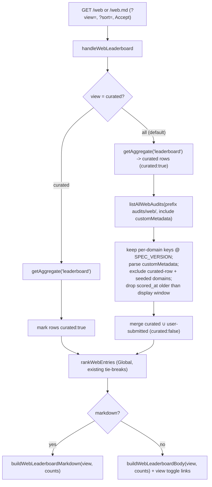

# feat: /web leaderboard all-vs-curated view toggle

## Summary

The `/web` agent-readiness leaderboard renders only the ~52 ANC-curated seed domains today. Its data source (the R2
`leaderboard` aggregate) is built exclusively from the seed list, so user-submitted on-demand audits, which do write
their own per-domain R2 entries, never appear on the board. This plan adds an **all-cache view** (every currently-cached
site, curated plus user-submitted) as the default, plus a zero-JS **toggle** to a **curated-only** view. Per-domain
result pages already resolve user-submitted audits, so the only surface changing is the board list itself. The board
list stays narrow (rank, site, description, two scores) — full per-site markdown is Feature 5's territory.

The all-view enumerates cached sites at render time via an R2 `list()` over the `audits/web/` prefix, reading a small
set of score fields from R2 custom metadata (written at cache-put time) so no per-object body fetch is needed. A
user-submitted entry is shown until its cached audit passes a logical display-expiry window keyed on `scored_at`,
implementing "shown until their cache entry expires" in code. Curated rows keep their richer seed-sourced labels and are
never expiry-filtered. The homepage teaser board and the `list_website_audits` MCP tool stay curated (out of scope).

---

## Problem Frame

`/web` is served by `handleWebLeaderboard` (`src/worker/audit-web/route.ts`), which reads a single materialized R2
aggregate object (`audits/web/leaderboard/<SPEC_VERSION>.json`) and renders it. That aggregate is produced only by
`rebuildWebAggregates` (`src/worker/audit-web/aggregate.ts`), which iterates the seed list
(`src/data/web-audit/seed.yaml`, 52 domains) and reads each seeded domain's per-domain R2 entry. Consequences:

- **User-submitted audits are invisible on the board.** An on-demand audit (HTTP `POST /api/audit-web` or the
  `audit_website` MCP tool) writes a per-domain entry at `audits/web/<sha256(url)>/<SPEC_VERSION>.json` and, via
  `rebuildAggregatesIfSeeded`, rebuilds the aggregate **only when the audited domain is seeded**. An unseeded audit
  refreshes no board surface at all. Its result page (`/web/<domain>`) works (it reads per-domain R2 directly via
  `lookupByDomain`), but the site never lists on `/web`.
- **The board hardcodes "curated" copy** at `src/worker/audit-web/leaderboard-render.ts` (the hero meta line and the
  methodology footer), so even a UI that showed everything would mislabel it.
- **No expiry story exists for on-demand entries.** The `audits/web/` R2 prefix has no lifecycle rule (the CLI's 7-day
  rule is scoped to `scores/`; see `src/worker/audit-web/cache.ts` header), so on-demand entries never physically
  expire. "Shown until their cache entry expires" therefore has to be defined by this feature.

The feature: make `/web` show all cached sites by default, distinguish user-submitted from curated rows, drop
user-submitted rows once they age out, and offer a curated-only filter — all under the site's zero-JS constraint (the
toggle must be a server-rendered control, not client JS), and working for both the HTML board and its `/web.md` twin.

---

## Requirements

- **R1** — `/web` (HTML) defaults to an **all-cache view**: every currently-cached site scored under the active
  `SPEC_VERSION`, curated seed domains plus non-expired user-submitted on-demand audits.
- **R2** — A **zero-JS toggle** switches between the all view and a **curated-only** view (the ~52 seed domains). No
  client-side JS framework; the control is a server-rendered navigation (query parameter), giving each view a
  shareable/bookmarkable URL.
- **R3** — The toggle works identically for the markdown twin: `/web.md` (all) and the curated variant. It also composes
  with `Accept`-header markdown negotiation (`detectPreference`) so `/web` with `Accept: text/markdown` still serves the
  markdown board in the requested view.
- **R4** — User-submitted rows are **visually and textually distinguished** from curated rows in both HTML and markdown.
- **R5** — A user-submitted site is shown in the all view **until its cached audit expires**, implemented as a logical
  display window on the entry's `scored_at`. Once past the window it disappears from the all view. Curated rows are
  never expiry-filtered.
- **R6** — View-aware counts and copy replace the hardcoded "curated" strings: the all view states the total plus the
  curated/user-submitted breakdown; the curated view states the curated count.
- **R7** — The board list stays **narrow**: rank, site, description, Global, Relative in HTML; rank, site, Global,
  Relative, Source in markdown. Full category-split / per-check remediation output is explicitly out of scope (Feature 5
  owns per-site result markdown).
- **R8** — The homepage teaser board (`src/worker/index.ts`) and the `list_website_audits` MCP tool stay **curated and
  unchanged**.
- **R9** — Enumerating all cached sites must honor R2 `list()` pagination and must not require a per-object body fetch
  on the render path.

---

## Key Technical Decisions

### KTD1 — Enumerate the all view by render-time R2 `list()` over `audits/web/`, reading scores from custom metadata

The all view is built at request time: read the existing `leaderboard` aggregate for the curated rows, then
`SCORE_CACHE.list({ prefix: 'audits/web/', include: ['customMetadata'] })` (paginated) to discover non-seeded cached
domains. Each per-domain entry carries the board-relevant fields (`domain`, `name`, `score_pct`, `relative`, `global`,
`scored_at`) in R2 **custom metadata** written at put time, so the list needs no body `get()` per object.

Rationale:

- **Correct expiry with no lag.** Filtering listed entries by `scored_at` at render is the exact, deterministic
  implementation of R5 — an entry vanishes the moment it ages out, with no "rebuild lag" window that a materialized
  aggregate would introduce.
- **Zero write-path and zero rescore coupling.** The on-demand write paths and the weekly rescore Workflow are
  untouched. The rescore never audits unseeded domains, so user-submitted entries naturally age and drop out; no rescore
  change is needed for correctness.
- **KISS / YAGNI.** No third aggregate kind, no rebuild races, no new invalidation call sites. `/web` is a secondary,
  low-QPS page; one R2 `list()` per uncached render is acceptable.

Cost note: R2 `list()` with `include` returns fewer keys per page than a bare list, so pagination engages sooner. The
helper loops the cursor. See Open Questions for the page-size / metadata-survival verification and the edge-cache
deferral.

Alternative (documented, not chosen): a materialized `leaderboard-all` aggregate — see Alternatives.

### KTD2 — Write board fields into R2 custom metadata at cache-put time

`put` in `src/worker/audit-web/cache.ts` gains a `customMetadata` object derived from the scorecard: `domain` (host of
the normalized URL), `name` (`scorecard.tool.name` when present), `score_pct`, `relative`, `global`, and `scored_at`
(the same ISO stamp already stored in the body). Values are strings (R2 metadata is string-valued); readers parse
numbers. This is the single write site for all web-audit caching (on-demand HTTP, MCP tool, and rescore all funnel
through `put`), so one change covers every path.

Backward-compat: entries written before this change lack custom metadata. The all-view list **skips** entries missing
required metadata rather than body-fetching them. "Self-heals" applies to seeded and rescored entries: seeded domains
re-score within a week via the rescore Workflow (and seeded rows come from the aggregate anyway, not the list), so they
regain metadata on the next cycle. An **unseeded** user-submitted entry does not self-heal on its own — the rescore
Workflow only re-audits seeded domains, so a metadata-less unseeded entry stays absent from the all view until a
**manual or agent-driven re-audit** of that domain rewrites it through `put`. Documented as a transitional gap, not a
defect (see Deferred to Follow-Up Work for the optional backfill).

### KTD3 — Toggle is a `?view=` query parameter, default `all`, curated as `?view=curated`

`/web` and `/web.md` accept `?view=all` (default when absent or unrecognized) and `?view=curated`. Rationale:

- Works uniformly for HTML and the markdown twin (query parameters are orthogonal to path and to `Accept` negotiation).
- No route collision. A path segment (`/web/curated`) would collide with the `/web/<domain>` result route
  (`parseWebResultPath` would treat `curated` as a domain) and with `/web/curated.md`; a query parameter avoids
  reserved-segment handling entirely. `isWebLeaderboardPath` already matches on pathname only, so routing is unaffected.
- Each view has a distinct shareable URL and a distinct edge-cache key.

The visible control is two plain `<a>` links styled as the existing segmented control (`.tier-filters`), marking the
active view. Plain links = zero JS. The existing Global/Relative **sort** control (JS progressive enhancement over
`?sort=`) is unchanged and layers on top; the view links preserve the current `?sort=` value so switching view keeps the
chosen sort.

**Known limitation (sort preservation is server-render-only).** The view links carry `?sort=` only when it is present in
the URL at server-render time. Because sort is a client-only enhancement, a user who reordered the board via the JS sort
control **without** a `?sort=` param in the URL loses that sort on a view switch (the toggle links are plain anchors
that reload the default server order). Acceptable for a secondary page under the zero-JS constraint. If this proves
annoying, the sort JS could additionally rewrite the view links' `href`s to append the active `?sort=` on toggle — a
progressive enhancement, not required for the feature.

### KTD4 — Default view is `all`; curated is the opt-in filter

The feature's framing ("display ALL sites ... plus a toggle to filter to only the curated set") makes all the default
and curated the subset. Chosen accordingly. The trade-off (all-default puts the R2 `list()` on the hotter path, and a
noisy user-submitted set could dilute the default board's signal) is real; curated-default is the documented alternative
and remains a one-line switch if the all-default proves noisy.

### KTD5 — Logical display-expiry window, physical R2 cleanup deferred

R5's "expires" is implemented as a logical window: a new constant `WEB_ALL_BOARD_DISPLAY_MAX_AGE_MS` in `cache.ts`
(recommended 30 days, tunable). The all-view list drops non-seeded entries whose `scored_at` is older than the window
(reusing `isStale`). Physical R2 object deletion (a lifecycle rule on `audits/web/`, or a sweep) is **deferred** — it is
storage/list-bloat hygiene, not a display-correctness requirement, and `audits/web/` lifecycle is not managed in
`wrangler.jsonc` today (it would be an out-of-band CF operation). If added later, the lifecycle TTL should be `>=` the
display window so nothing vanishes early. See Deferred to Follow-Up Work.

---

## High-Level Technical Design

Request-time data flow for `/web` (and `/web.md`), by resolved view:

Key invariants:

- Curated rows always come from the `leaderboard` aggregate (rich seed labels, never expiry-filtered).
- The R2 `list()` runs only for the all view. The curated view remains a single aggregate `get()` (unchanged behavior).
- User-submitted rows depend on custom metadata; missing-metadata entries are skipped (self-healing).

---

## Implementation Units

### U1. Custom-metadata write + all-cache enumeration helper (`cache.ts`)

**Goal:** Give every web-audit cache write the board fields in R2 custom metadata, and add a render-time enumeration
helper for the all view. Advances R1, R5, R9, KTD1, KTD2, KTD5.

**Requirements:** R1, R5, R9.

**Dependencies:** none.

**Files:**
- `src/worker/audit-web/cache.ts` (modify `put`; add `WEB_ALL_BOARD_DISPLAY_MAX_AGE_MS`; add `listAllWebAudits` + a
  `WebListedAudit` type)
- `tests/web-audit-cache.test.ts` (extend)

**Approach:**
1. In `put`, build a `customMetadata` record from the scorecard: `domain` (`new URL(normalizeTargetUrl(url)).host`),
   `name` (`scorecard.tool?.name` when a non-empty string, else the domain), `score_pct`, `relative`
   (`scorecard.score?.relative`), `global` (`scorecard.score?.global`), and `scored_at` (the ISO stamp already in the
   payload). All values stringified. Pass `{ httpMetadata, customMetadata }` to `SCORE_CACHE.put`. Preserve the existing
   refusal-to-cache-half-state guards.
2. Add `export const WEB_ALL_BOARD_DISPLAY_MAX_AGE_MS = 30 * 24 * 60 * 60_000;` with a WHY comment (logical display
   expiry for user-submitted board rows; tunable; keep `>=` any future R2 lifecycle TTL).
3. Add `listAllWebAudits(env, opts)` where `opts = { specVersion, excludeDomains: ReadonlySet<string>, now?: number,
   maxAgeMs?: number }` returning `WebListedAudit[]` (`{ domain, name, score_pct, score: { relative, global }, scored_at
   }`):
   - Loop `SCORE_CACHE.list({ prefix: 'audits/web/', include: ['customMetadata'], cursor })` until not `truncated`.
   - Keep only per-domain keys at the current spec — shape `audits/web/<sha256>/<specVersion>.json` (this excludes the
     `leaderboard` / `leaderboard-frontpage` aggregate keys and other spec versions). Do **not** interpolate
     `specVersion` raw into a `RegExp`: it contains dots that a raw pattern treats as any-char (matching e.g. `0x3x0`).
     Split the key on `/`, require exactly four segments, match the sha segment against `[0-9a-f]{64}`, and compare the
     trailing segment as the literal string `` `${specVersion}.json` `` — the version is never a regex.
   - Read `customMetadata`; skip entries missing any required field or with unparseable numbers.
   - Skip when `excludeDomains.has(domain)` (seeded domains come from the aggregate).
   - Skip when `isStale(scored_at, maxAgeMs ?? WEB_ALL_BOARD_DISPLAY_MAX_AGE_MS, now ?? Date.now())` (expired).
   - Push the normalized entry. Wrap `list()` in try/catch and log-and-return-what-we-have on error (best-effort, never
     throw to the caller), matching the module's existing error posture.

**Patterns to follow:** the existing `put`/`getAggregate` error handling and `isStale` in the same file; the
`WebAggregateEntry` shape for score fields.

**Technical design (directional):** `WebListedAudit` mirrors the score subset of `WebAggregateEntry` (`domain`, `name`,
`score_pct`, `score.relative`, `score.global`) plus `scored_at`; the route maps it into the render entry shape.

**Test scenarios (`tests/web-audit-cache.test.ts`):**
- `put` writes custom metadata carrying `domain`, `name`, `score_pct`, `relative`, `global`, `scored_at` matching the
  scorecard (assert against a Map-backed R2 mock that records the `put` options).
- `put` with a scorecard lacking `tool.name` stores `name` = the domain host.
- `put` still refuses a half-state (empty spec version; missing `target_url`) exactly as before.
- `listAllWebAudits` returns only per-domain keys at the current spec: aggregate keys (`.../leaderboard/<spec>.json`)
  and other-spec keys are excluded.
- `listAllWebAudits` excludes domains in `excludeDomains`.
- `listAllWebAudits` drops an entry whose `scored_at` is older than the display window and keeps one within it (inject
  `now`).
- `listAllWebAudits` skips an entry with missing/partial custom metadata rather than throwing.
- `listAllWebAudits` paginates: a mock returning `truncated: true` + `cursor` on the first page and the rest on the
  second yields the union.
- `listAllWebAudits` returns `[]` (not a throw) when `SCORE_CACHE.list` rejects.

### U2. View-aware board renderers + zero-JS toggle + row markers (`leaderboard-render.ts`)

**Goal:** Make the HTML and markdown board renderers view-aware: render the toggle control, view-specific counts/copy,
and a user-submitted marker on non-curated rows. Advances R2, R3, R4, R6, R7.

**Requirements:** R2, R3, R4, R6, R7.

**Dependencies:** none (pure render; U3 wires it).

**Files:**
- `src/worker/audit-web/leaderboard-render.ts` (modify `buildWebLeaderboardBody`, `buildWebLeaderboardMarkdown`; leave
  `buildFrontpageBoardRows` / `buildFrontpageBoardEmptyState` untouched)
- `src/styles/site.css` (add the `.lb-tag` rule backing the user-submitted badge and an `a.tier-filter` companion rule)
- `tests/web-audit-leaderboard-route.test.ts` (extend — render assertions exercised through the route in U3)
- `tests/web-audit-scorecard-format.test.ts` (existing renderer tests move to the `WebBoardEntry` + opts signatures; the
  markdown row assertions gain the Source column)

**Approach:**
1. Introduce a board-entry type carrying the curated flag — `export type WebBoardEntry = WebAggregateEntry & { curated:
   boolean }` — and make `rankWebEntries` generic (`<T>(entries: T[], sortKey) => (T & { rank: number })[]`) so the flag
   survives ranking and the frontpage `WebAggregateEntry[]` call still type-checks. The `RankedWebEntry` alias is
   removed: with rank expressed inline nothing consumes it.
2. Give both builders a signature that accepts the view and counts via a shared `WebBoardRenderOpts` (`{ view,
   curatedCount, userCount, sort }`): `buildWebLeaderboardBody(entries, opts)` and `buildWebLeaderboardMarkdown(entries,
   origin, opts)` with the markdown builder taking `Omit<WebBoardRenderOpts, 'sort'>` (markdown has no sort control).
   Update all call sites (U3's route plus the existing renderer tests).
3. **Toggle control (HTML, zero-JS):** two `<a>` links styled with the existing `.tier-filter` classes (reuse the visual
   language of the sort control but as navigation): "All" -> `/web` and "Curated (`{curatedCount}`)" ->
   `/web?view=curated`, the active one marked (`tier-filter--active`, `aria-current="page"`). Each link carries the
   current `?sort=` value when set. Place it near the existing sort `.tier-filters` group.
   - **Markdown twin discoverability:** `buildWebLeaderboardMarkdown` gets the same switch as a one-line pointer near
     the top of the body — `View: All | [Curated](<origin>/web.md?view=curated)` (and the mirror on the curated view) —
     with the active view rendered as plain text rather than a link, and the link origin-absolutized like every other
     link the markdown builder emits. Without it the markdown board has no in-body way to reach the other view; a bare
     `?view=curated` param is undiscoverable to a reader of `/web.md`.
4. **View-aware copy (replaces the hardcoded strings at the current lines ~71 and ~107):**
   - All view hero meta: `"{total} sites on the board ({curatedCount} curated, {userCount} user-submitted). Audit your
     own."` with a link to `/web-audit`.
   - Curated view hero meta: `"{curatedCount} curated site(s) on the board. Audit your own."`.
   - Methodology footer: describe both views — the curated set is hand-picked; the all view also lists sites audited on
     demand, which appear until their cached result ages out. Drop the absolute "The board is curated." sentence.
5. **Row markers:** on a `curated: false` row, add a small badge in the site cell — `user-submitted` (HTML) after the domain/name. Curated rows render as today. In markdown, add a
   "Source" column with `curated` / `on-demand` (keeps the table narrow, one extra column). Style the badge with a
   `.lb-tag` rule in `src/styles/site.css` built from the existing foundation tokens: `.tier-badge` metrics with neutral
   colors (`--bg-raised`, `--border-subtle`), because the tag marks the row's source, not an achievement tier.
   `a.tier-filter` gets a companion rule (no underline, inline-block): the class now styles server-rendered anchor
   links, and anchors keep the UA underline that buttons never had.
6. Empty states: keep the existing scoring-in-progress empty state; it applies per view (curated view with no curated
   rows; all view with no rows at all).

**Patterns to follow:** existing `.tier-filters` markup in `buildWebLeaderboardBody`; `escHtml` usage; the markdown
table builder already present.

**Test scenarios (through U3's route tests unless a focused render block is added):**
- All view HTML contains both toggle links, the "All" link active, and the "Curated (`N`)" link pointing to
  `/web?view=curated`.
- Curated view HTML marks the "Curated" link active and points "All" to `/web`.
- A user-submitted row renders the `user-submitted` marker; a curated row does not.
- All-view meta shows total and the curated/user-submitted breakdown; curated-view meta shows only the curated count.
- Markdown all view includes the Source column with `on-demand` for a user-submitted row and `curated` for a seeded row;
  markdown curated view lists only curated rows.
- Markdown all view carries the `View:` switch line with a live, origin-absolute
  `[Curated](<origin>/web.md?view=curated)` link; markdown curated view links back to `[All](<origin>/web.md)` and
  renders the active view as plain text, not a link. The renderer tests lock the origin-absolute convention for rows and
  switch links alike.
- Toggle links preserve a present `?sort=relative`.
- Methodology footer no longer asserts "The board is curated." and mentions the on-demand/aging-out behavior.

### U3. Route wiring: view resolution, all-cache assembly, both formats (`route.ts`)

**Goal:** Resolve `?view=`, assemble the entry set per view (curated aggregate for curated; aggregate ∪
`listAllWebAudits` for all), and render HTML or markdown with the view and counts. Advances R1, R2, R3, R5, R6, R7, R8,
KTD3, KTD4.

**Requirements:** R1, R2, R3, R5, R6.

**Dependencies:** U1, U2.

**Files:**
- `src/worker/audit-web/route.ts` (modify `handleWebLeaderboard`; import `listAllWebAudits`, `loadWebSeed`)
- `tests/web-audit-leaderboard-route.test.ts` (extend)

**Approach:**
1. Parse `const view = url.searchParams.get('view') === 'curated' ? 'curated' : 'all';` (anything else -> all, so a
   mistyped parameter never 404s a shareable URL) and validate `?sort=` to `'global' | 'relative' | null` (passed to the
   renderer for toggle-link preservation only).
2. Read the curated aggregate (`getAggregate('leaderboard')`) -> `curatedEntries` mapped to `WebBoardEntry` with
   `curated: true`. `curatedCount = curatedEntries.length`.
3. If `view === 'curated'`: entries = `curatedEntries`; `userCount = 0`.
4. If `view === 'all'`: build the exclude set from the **actually rendered curated rows** — `curatedDomainSet = new
   Set(curatedEntries.map((e) => e.domain))` — unioned with the seed set (`loadWebSeed` -> `seededSet`, which also
   catches a freshly-seeded domain not yet in the aggregate). Dedup on the curated rows, not the seed alone: a domain
   dropped from `seed.yaml` but still lingering in the possibly-stale `leaderboard` aggregate and holding a live R2
   entry is in `curatedEntries`, so keying dedup off the seed alone would render it twice. A `loadWebSeed` failure is
   tolerated (try/catch): the curated-row exclusion still dedups every domain the board actually renders. Call
   `listAllWebAudits(env, { specVersion: SPEC_VERSION, excludeDomains: <union of curatedDomainSet and seededSet> })` ->
   user-submitted `WebBoardEntry[]` with `curated: false`, `url: https://<domain>/`, `description: ''` (unseeded audits
   carry no seed description). entries = `curatedEntries.concat(userSubmitted)`; `userCount = userSubmitted.length`.
5. Branch markdown vs HTML exactly as today (`wantMarkdown` unchanged), passing `{ view, curatedCount, userCount, sort
   }` to the renderer. Set the HTML canonical to `/web` for the all view and `/web?view=curated` for the curated view.
6. Leave the response headers otherwise as today (see Open Questions on edge-caching + `Vary: Accept`; not added here).

**Patterns to follow:** the existing `handleWebLeaderboard` structure (markdown branch, shell load, `substituteShell`);
`loadWebSeed` usage in `handleWebResultPage`.

**Test scenarios (`tests/web-audit-leaderboard-route.test.ts`; extend the R2 mock with a `list` implementation):**
- `GET /web` (no param) returns the all view: curated rows plus a non-seeded cached entry present in the R2 list.
- `GET /web?view=curated` returns only curated rows; a non-seeded cached entry is absent.
- `GET /web?view=<garbage>` falls back to the all view.
- `GET /web.md` and `GET /web.md?view=curated` return the markdown board in the correct view (Source column present in
  all; curated-only rows in curated).
- `Accept: text/markdown` on `/web?view=curated` returns markdown in the curated view (negotiation composes with the
  param).
- A non-seeded entry with `scored_at` beyond the display window is absent from the all view (expiry honored end-to-end).
- A non-seeded domain that is also seeded is not duplicated (dedupe via `excludeDomains`).
- A domain present in the curated aggregate but absent from `seed.yaml` (stale-aggregate divergence) is not duplicated:
  it renders once as a curated row, excluded from the user-submitted list via the curated-domain set.
- Cold aggregate + empty list renders the scoring-in-progress empty state for both views.
- The all view's user-submitted counts match the number of non-seeded rows rendered.
- Dispatched through the top-level worker (`worker.fetch`) so `isWebLeaderboardPath` routing is exercised, matching the
  existing test's pattern.

### U4. Regression guards: homepage board and MCP tool stay curated (`index.ts`, MCP tool)

**Goal:** Lock in R8 — the homepage teaser board and `list_website_audits` remain curated and unchanged — with explicit
tests, since both read `leaderboard` / `leaderboard-frontpage` aggregates that this feature deliberately does not touch.

**Requirements:** R8.

**Dependencies:** none (assertion-only; no production change expected).

**Files:**
- `tests/web-audit-homepage-inject.test.ts` (extend)
- `tests/web-audit-mcp-tools.test.ts` (extend)

**Approach:** Add assertions that the homepage `{{WEB_BOARD_ROWS}}` injection and `list_website_audits` still derive
from the curated aggregates only and do not include a non-seeded cached entry, even when one exists in R2. No production
code changes; if a test forces one, that is a signal the scope boundary leaked.

**Test scenarios:**
- Homepage injection: with a non-seeded cached entry present in R2, the injected `{{WEB_BOARD_ROWS}}` contains only
  `leaderboard-frontpage` (seeded) rows.
- `list_website_audits` returns only curated entries with a non-seeded cached entry present; its description still reads
  as the curated board.

**Test expectation rationale:** these are boundary guards, not new behavior; they fail loudly if a later edit widens the
homepage or MCP surface.

---

## Scope Boundaries

**In scope:** the `/web` board list and its `/web.md` twin — the all/curated views, the zero-JS toggle, row distinction,
view-aware copy/counts, logical display-expiry of user-submitted rows, and custom-metadata writes enabling the
enumeration.

**Out of scope (Feature 5's territory):** per-site result pages (`/web/<domain>`) and their markdown twins
(`/web/<domain>.md`), including any move to full category-split / per-check remediation output. This plan does not touch
`src/worker/audit-web/summary-render.ts`. The board list rows stay narrow.

**Out of scope (this product's identity):** the homepage teaser board (`src/worker/index.ts`, `buildFrontpageBoardRows`,
`leaderboard-frontpage` aggregate) and the `list_website_audits` MCP tool stay curated. A non-seeded audit still does
not trigger `rebuildAggregatesIfSeeded` (it is seeded-only by design), and the rescore Workflow still audits only seeded
domains — user-submitted rows are point-in-time and age out.

### Deferred to Follow-Up Work
- **Physical R2 cleanup** of expired/old-spec `audits/web/` objects (a lifecycle rule with TTL `>=` the display window,
  or a sweep step in the rescore Workflow) — storage/list-bloat hygiene; not required for display correctness.
- **Safe edge-caching of the board** (`s-maxage` + `Vary: Accept`) if render-time `list()` cost proves material.
- **An "all" mode for `list_website_audits`** (or a sibling MCP tool) if agents want the full cached set.
- **Backfill custom metadata** for pre-existing entries (otherwise they self-heal on next audit / rescore).

---

## Alternatives Considered

- **Materialized `leaderboard-all` aggregate** (a third `WebAggregateKind`, rebuilt via an R2 `list()` sweep at each
  on-demand write and rescore-cycle end, read O(1) at render). Rejected as the primary approach: it adds a moving part
  (write-path rewiring so unseeded audits trigger a rebuild, rebuild races, a rebuild-lag window that complicates expiry
  correctness — requiring `scored_at` in the aggregate entry plus a render-time safety filter anyway). It matches the
  repo's "single materialized aggregate, O(1) render" ethos and would make an "all" MCP surface trivial, so it is the
  fallback if render-time `list()` cost or a hot all-default path demands O(1) render. Both approaches need KTD2's
  custom metadata to avoid body fetches.
- **Distinct-URL toggle (`/web/curated`, `/web/curated.md`).** Rejected: collides with the `/web/<domain>` and
  `/web/<domain>.md` result routes, forcing reserved-segment handling in `parseWebResultPath`.
- **CSS/`
` toggle rendering both lists.** Rejected: doubles payload, gives no shareable per-view URL, and does
  not translate to the markdown twin (which needs a param/URL regardless), so a query parameter is needed anyway.
- **Curated as the default view.** A reasonable alternative (preserves today's quality-controlled default, keeps the hot
  path O(1) with no `list()`, stays consistent with the curated homepage/MCP surfaces). Deferred to Open Questions
  rather than chosen, because the feature's framing makes all the default; it is a one-line switch if Brett prefers it.

---

## Risks & Dependencies

- **R2 `list()` semantics.** `include: ['customMetadata']` reduces keys-per-page and custom-metadata delivery is what
  the render depends on. Mitigation: pagination loop; skip-on-missing-metadata; verify behavior during implementation
  (Open Questions). If untenable, fall back to the materialized-aggregate alternative.
- **List growth from old-spec keys.** `list()` sees every spec version under `audits/web/`; over time this inflates the
  key count and read cost. Mitigation: the deferred R2 lifecycle rule; the current filter already ignores non-current
  keys.
- **Content-negotiation + caching.** The board already negotiates markdown via `Accept` without a `Vary` header;
  introducing `s-maxage` unsafely could cross-serve formats. This plan does not add edge-caching for that reason
  (deferred with the `Vary: Accept` requirement noted).
- **Cross-feature file contention with Feature 5** — see Cross-Feature Composition.

Dependencies: none external. No new bindings, no `wrangler.jsonc` change for the feature itself (the deferred lifecycle
rule would be out-of-band).

---

## Cross-Feature Composition (Feature 5)

Feature 5 ("all markdown results must be the full result: category split + per-check remediation") and this plan share
two files; the edits are additive and touch disjoint symbols:

- `src/worker/audit-web/route.ts` — this plan edits `handleWebLeaderboard` (the board list); Feature 5 edits
  `handleWebResultPage` and its markdown branch (the per-site result). Different functions in one file; both add
  imports. Land as separate commits to keep the diff regions disjoint.
- `src/worker/audit-web/cache.ts` — this plan modifies `put` (adds custom metadata) and adds `listAllWebAudits` +
  `WEB_ALL_BOARD_DISPLAY_MAX_AGE_MS`; Feature 5 touches the per-domain read path (read-time display enrichment), not
  `put`. Same file, disjoint symbols.
- `src/worker/audit-web/leaderboard-render.ts` — owned entirely by this plan (the LIST). Feature 5 owns
  `src/worker/audit-web/summary-render.ts` (the per-site RESULT). This plan does not touch `summary-render.ts`.

No shared symbol is edited by both plans. The `.md` surfaces are distinct routes: `/web.md` (this plan, board list,
narrow) vs `/web/<domain>.md` (Feature 5, per-site, full). If both land near-simultaneously, merge order is
interchangeable; resolve import-block conflicts in `route.ts`/`cache.ts` mechanically.

---

## Assumptions

- The web scorecard object exposes `tool.name`, `score_pct`, and `score.relative` / `score.global` at `put` time (borne
  out by `aggregate.ts` and `handleWebResultPage`, which already read these). If `score.relative` / `score.global` can
  be absent, U1 stores what exists and the all-view list skips entries without a usable score pair.
- One R2 `list()` per uncached all-view render is acceptable for a secondary page (no edge-cache added now).
- 30 days is a reasonable default display window; the exact value is tunable and flagged for confirmation.
- `/web` staying indexable (no `X-Robots-Tag`) is intentional and unchanged; canonical is set per view.

## Open Questions

- **Resolved — default view is all** (per the feature framing); curated is the opt-in filter. Flipping to
  curated-default stays a one-line change in U3 (plus swapping which toggle link is active by default) if the default
  proves noisy.
- **Resolved — display window is 30 days** (`WEB_ALL_BOARD_DISPLAY_MAX_AGE_MS`); any future R2 lifecycle TTL must be
  `>=` it.
- **R2 `list()` + `customMetadata` behavior.** A miniflare/workerd run confirms `put` persists `customMetadata` and
  `list({ include: ['customMetadata'] })` returns it per object. Still open: a drive against real R2 in staging (page
  size, metadata delivery at production scale) to close out KTD1 over the materialized-aggregate fallback.
- **Edge-caching the board.** Left off to avoid the `Vary: Accept` cross-serve hazard; revisit if render cost matters.

---

## Verification Contract

- `bun test` green, including the extended `web-audit-cache`, `web-audit-leaderboard-route`,
  `web-audit-homepage-inject`, and `web-audit-mcp-tools` suites.
- Type-check clean; no TypeScript `any` introduced (extend existing typed shapes; parse metadata into typed fields).
- Manual staging drive (`wrangler dev --env staging --local`, port 8787): `/web` shows curated + a freshly on-demand
  audited unseeded domain; `/web?view=curated` hides it; `/web.md` and `/web.md?view=curated` render the correct view; a
  user-submitted row carries the marker; toggling preserves `?sort=`.
- Homepage `/` board and `list_website_audits` unchanged with an unseeded entry present.

## Definition of Done

- R1–R9 satisfied; all four units landed with their test scenarios passing.
- Hardcoded "curated" board copy replaced with view-aware copy; no other surface mislabels the board.
- Feature 5's per-site result surfaces and `summary-render.ts` untouched; homepage and MCP tool curated and unchanged.
- Open Questions either resolved or recorded as accepted assumptions before merge.
