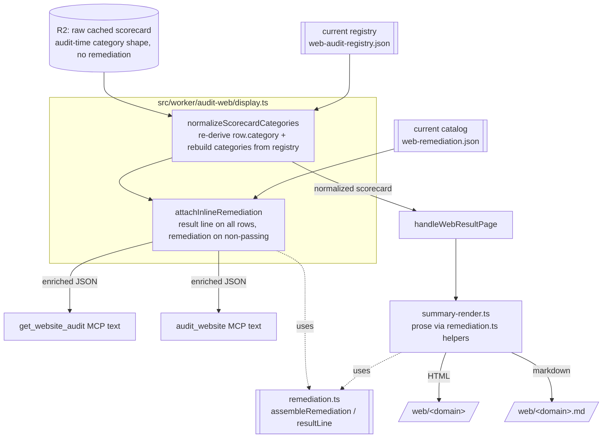

# Web-audit cached/fresh result parity via read-time display enrichment

## Summary

A fresh web audit (`audit_website`) returns the full result shape: the current split `categories[]` (API and MCP as
separate categories) plus per-check inline `remediation`. A cached read does not. `get_website_audit` returns the stored
scorecard verbatim (no `result` lines, no `remediation`, whatever category shape was stored), and every render of a
cached scorecard is only as current as the R2 artifact that backs it. This plan closes that gap by making the current
category shape and the remediation both **read-time** properties, assembled from the current registry and the current
remediation catalog whenever a cached scorecard is served, so every markdown and JSON render of a cached scorecard is
the full result regardless of when it was cached.

The mechanism is a single read-time enrichment layer (`src/worker/audit-web/display.ts`) shared by the three full-result
surfaces: the `get_website_audit` MCP text output, the `audit_website` MCP text output, and the `/web/<domain>` result
page (HTML and its `.md` twin). Storage stays lean: R2 keeps the raw scorecard (no stored remediation, no frozen
category shape), and presentation is derived on read. No `schema_version` bump.

---

## Problem Frame

Three read surfaces render a cached web scorecard, and they disagree today:

1. **`get_website_audit`** (`src/worker/mcp/tools/web-audit.ts`) returns `cached.scorecard` verbatim from R2. No
   `result` line, no inline `remediation`, and whatever `categories[]` / `results[].category` shape was stored at audit
   time.
2. **`audit_website`** (same file) calls a private `withInlineRemediation` helper on both its cache-hit and fresh paths.
   That helper adds a `result` line to every row and an inline `remediation` object to every non-passing row, but it
   does **not** re-derive categories — it preserves the stored `categories[]` and `results[].category`.
3. **`/web/<domain>`** HTML and `.md` twin (`src/worker/audit-web/summary-render.ts`, driven by `handleWebResultPage` in
   `src/worker/audit-web/route.ts`) group by the stored `scorecard.categories[]` and attach remediation at render time
   from the loaded catalog. Correct remediation, but still grouped by the **stored** category shape.

The stored category shape can lag the registry. A display-only registry change (splitting the combined `mcp-api`
category into separate `api` and `mcp` categories, retiering a check, adding a MAY check) alters the scorecard's stored
shape without rotating the `SPEC_VERSION` cache key, so cached scorecards keep the old grouping until something
re-audits them. The rescore workflow's registry-fingerprint gate
(`docs/solutions/integration-issues/web-audit-display-only-registry-change-skips-board-reflow.md`) reflows **seeded**
domains on a shape change, but that is a storage-refresh backstop for the board's scored value; it does not cover an
on-demand-audited non-seeded domain, and it does not make `get_website_audit` return remediation at all.

Net effect: a cached read is a reduced result. The requirement is that the leaderboard **list** may stay narrow, but
every per-site **markdown/JSON result** must be the full result — current category split plus per-check remediation.

---

## Requirements

- **R1.** `get_website_audit` returns the full result: `results[]` rows each carry a derived `result` line and every
  non-passing row carries an inline `remediation` object, matching the `audit_website` contract already documented in
  `content/web-scorecard-schema.md`.
- **R2.** Every cached-scorecard render (both MCP tools, the `/web/<domain>` HTML page, and the `/web/<domain>.md` twin)
  presents the **current** category shape — the split derived from the live registry — regardless of the category shape
  stored in R2 at audit time.
- **R3.** The category split and the remediation are computed at read time from a single shared source, so the three
  full-result surfaces cannot disagree. No surface hardcodes the current check set; a check is grouped and remediated by
  looking it up in the current registry and current catalog by id.
- **R4.** Read-time enrichment is score-neutral: it re-groups and annotates, it does not recompute `score_pct` /
  `score`. The stored score reflects the registry at audit time. (Score correctness across a retier stays owned by the
  rescore workflow's fingerprint reflow.)
- **R5.** Enrichment degrades gracefully. In the module: a scorecard without a `results[]` array (a minimal or malformed
  payload) passes through unchanged, and a row whose id is absent from the current registry keeps its stored category.
  At the MCP read paths (U2): a failed registry load resolves to a `null` registry, and `enrichWebScorecardForDisplay`
  owns that degrade — it skips the category split (the stored shape stands) while still attaching remediation. At the
  result page (U3): a failed registry load falls back to rendering the raw stored scorecard. A failed catalog load
  degrades to generic remediation prompts (the existing R10 behavior). A read never crashes because enrichment could not
  fully run.
- **R6.** No stored-shape change and no `schema_version` bump. R2 keeps the raw scorecard (no stored remediation).
  `content/web-scorecard-schema.md` is updated to describe the read-time behavior for both MCP read tools and the
  category-normalization guarantee.
- **R7.** New MAY checks added by sibling work (Features 1 and 2, with their `remediation.yaml` entries) flow through
  the full-result renderers automatically, because grouping and remediation are registry-/catalog-driven, not a fixed
  list.

---

## Key Technical Decisions

### KTD1. Parity by read-time enrichment, not by storing the enriched scorecard

Compute the category split and the remediation on read (option a), rather than storing the full enriched scorecard in R2
and reflowing old entries (option b) or bumping `schema_version` and migrating the cache (option c).

Rationale:

- **Remediation must not be stored.** The remediation catalog (`dist/_internal/web-remediation.json`, projected from
  `remediation.yaml`) evolves independently of any audit run. Storing remediation into each R2 object would freeze the
  fix guidance at audit time and duplicate the catalog into every scorecard, violating single-source-of-truth. The
  schema already declares remediation a read-time artifact ("Scorecard rows carry no remediation; the fix guidance is
  assembled at read time").
- **Decouples storage from presentation.** Read-time enrichment makes even an old-shape cached entry render the current
  split, without a migration or a full re-audit. Any stored schema-0.2 scorecard carries enough raw data per row (`id`,
  `status`, `keyword`, `evidence`, `na_reason?`) to be enriched; see Assumptions.
- **Option b's reflow is a storage backstop, kept but not the parity mechanism.** The rescore fingerprint gate remains
  the right tool for score correctness after a retier (it re-audits and rewrites the stored score). It stays; it does
  not need to change. Read-time enrichment complements it by covering display parity for every domain, seeded or not,
  the moment it is read.
- **Option c (schema bump + migration) is the wrong lever** for a display concern that earns no new points; it would
  rotate every cache key and discard current scores, exactly the trap the fingerprint-gate solutions doc calls out.

### KTD2. The shared source of truth is the enrichment layer, not a single serializer

The three surfaces render legitimately different projections: the MCP tools serialize a JSON scorecard; the page renders
prose (Goal / Result / Fix / Resources / copy-paste prompt). "One renderer for all three" would force a JSON dump and a
prose page through one function. Instead, the single source of truth is the **enrichment** that precedes serialization:

- **Category normalization** lives once in `src/worker/audit-web/display.ts` and is applied by every read path.
- **Remediation assembly** already lives once in `src/worker/audit-web/remediation.ts` (`assembleRemediation`,
  `resultLine`); both the MCP path (via the moved `attachInlineRemediation`) and the page path (`summary-render.ts`)
  call those same helpers.

So the category grouping and the remediation content are each computed from exactly one place; the surfaces differ only
in how they serialize the enriched result. This is the honest DRY boundary and it is what R3 requires.

### KTD3. Read-time enrichment is score-neutral; the stored score is authoritative

Re-grouping categories does not touch `score_pct` / `score`. A category split earns no points (the scorer weights each
check by its own tier in `src/worker/audit-web/score.ts`, never by category), so re-grouping a stored scorecard cannot
desync its displayed rollups from its stored score. Per-category `passed/counted` rollups are recomputed from the rows
(display counts), but the headline score is read straight from storage. A retier *would* change the score; that is out
of scope here and remains the rescore workflow's job (Open Questions OQ1).

### KTD4. Registry-driven category derivation with a stored-shape fallback

Each row's display category is re-derived from the current registry by check id. A row whose id is no longer in the
registry (a removed check) keeps its stored `category`; the rebuilt `categories[]` is the current
`registry.category_order` plus any leftover categories referenced by such rows, order-preserving, so no row is dropped
from display. This makes the renderer forward-compatible with added checks (R7) and safe against removed checks (R5).

---

## High-Level Technical Design

Read paths converge on one enrichment layer before serializing. Storage stays raw.

Notes carried in the diagram:

- The MCP tools consume `attachInlineRemediation ∘ normalizeScorecardCategories` (full JSON: split categories + per-row
  remediation).
- The page consumes `normalizeScorecardCategories` only; `summary-render.ts` keeps its prose assembly, which already
  calls the shared `remediation.ts` helpers, so both paths draw remediation from the one place (KTD2).
- The fresh streaming path (`handleWebAudit` NDJSON in `route.ts`) is unchanged: it streams raw check events for the
  in-progress JS page and caches the raw scorecard; the saved result is served through the enriched
  `handleWebResultPage`. Enrichment is a read-side concern only.

---

## Scope Boundaries

**In scope**

- A new read-time enrichment module and its wiring into the two MCP read tools and the result-page handler.
- Updating `content/web-scorecard-schema.md` to document the read-time behavior.

**Out of scope (true non-goals)**

- The leaderboard **list** scope and the curated toggle — Feature 4 owns `handleWebLeaderboard`,
  `leaderboard-render.ts`, and the aggregate. This plan does not widen or narrow the board list. `list_website_audits`
  stays a summary list, not a full-result render.
- Recomputing the score at read time (KTD3 / OQ1).
- Any change to storage (`cache.ts` `put` / `keyFor`), the streaming audit path, or the rescore fingerprint workflow.

**Deferred to Follow-Up Work**

- If OQ1 is answered "recompute at read time", that is a separate change with its own score-parity test against
  `score.ts`; not part of this plan.

---

## Implementation Units

### U1. Read-time display enrichment module

**Goal:** Create the single enrichment layer that re-derives the current category shape and attaches remediation, with
graceful degradation.

**Requirements:** R2, R3, R4, R5, R7 (advances all read-path parity).

**Dependencies:** none.

**Files:**
- `src/worker/audit-web/display.ts` (new)
- `tests/web-audit-display-enrich.test.ts` (new)

**Approach:**
- Export a structural `DisplayRegistry` interface — the registry fields the enrichment reads (`category_order`,
  `categories`, and `checks` with `id` + `category`) — so a full `WebAuditRegistry` satisfies it without coupling the
  module to the whole registry type.
- Export `normalizeScorecardCategories(stored, registry)` (registry: `DisplayRegistry`):
  1. Guard: if `stored` is not an object or has no array `results`, return `stored` unchanged (R5).
  2. Build an `id -> category` map from `registry.checks`.
  3. Map each row to a new row whose `category` is taken from the registry map by `row.id`, falling back to the row's
     stored `category` when the id is absent (KTD4). The stored `keyword` is preserved unchanged (consistent with the
     stored score and with `summary-render.ts`'s `tierChip`, which reads `row.keyword`).
  4. Rebuild `categories[]` by calling `categoryRollups(newRows, registry.category_order, registry.categories)` from
     `src/worker/audit-web/score.ts`, then appending any leftover category ids referenced by rows but absent from
     `category_order` (order-preserving), each rolled up from its rows and given a display `name` via the same
     `registry.categories[id] ?? id` fallback `categoryRollups` already uses, so a removed-check category still renders
     a name.
  5. Return `{ ...stored, categories, results: newRows }`. Do not touch `score`, `score_pct`, `summary`,
     `coverage_summary` (KTD3).
- Export `attachInlineRemediation(scorecard, catalog, origin)`: the current `withInlineRemediation` logic moved out of
  `web-audit.ts` — `result = resultLine(...)` on every row, plus an inline `remediation = assembleRemediation(...)` on
  `broken` / `absent` rows. Same guard as `normalizeScorecardCategories`. `origin` becomes a parameter (today the MCP
  helper hardcodes `SITE_URL`) so the caller controls the skill-link origin.
- Export `enrichWebScorecardForDisplay(stored, { registry, catalog, origin })` for the MCP JSON paths:
  `attachInlineRemediation` applied to the output of `normalizeScorecardCategories`. `registry` is typed
  `DisplayRegistry | null` and the enricher owns the missing-registry degrade: a `null` registry skips the category
  split (the stored shape stands) but remediation is still attached, so a failed registry load degrades the read rather
  than failing it.

**Patterns to follow:** the existing `withInlineRemediation` guard shape in `src/worker/mcp/tools/web-audit.ts`;
`categoryRollups` and its `Pick<EngineResult, 'category' | 'status'>` row contract in `src/worker/audit-web/score.ts`;
`assembleRemediation` / `resultLine` in `src/worker/audit-web/remediation.ts`.

**Test scenarios** (`tests/web-audit-display-enrich.test.ts`):
- Old-shape stored scorecard (a single combined `mcp-api` category, rows tagged `mcp-api`) normalizes to the current
  split (`api` and `mcp` as separate `categories[]` entries with rows re-tagged), given a registry whose
  `category_order` splits them. Covers R2.
- `categories[]` rollups after normalization equal `categoryRollups` over the re-derived rows (passed/counted match).
- A row whose `id` is not in the registry keeps its stored `category`, and that category appears once, appended after
  the registry order, with a correct rollup. Covers KTD4 / R5.
- A check id present in the registry and catalog but not in the prior stored set (simulating a new MAY check) is grouped
  into its registry category and, when `absent`, carries a `remediation` object from the catalog. Covers R7.
- `attachInlineRemediation`: every row gains a `result` line; `broken` and `absent` rows gain `remediation`; `pass`,
  `n_a`, `skip` rows carry `result` but no `remediation`. Matches the schema-doc contract.
- Guard: a scorecard with no `results` array (e.g. `{ score_pct: 88 }`) is returned unchanged by both functions. Covers
  R5.
- Score-neutrality: `score`, `score_pct`, `summary`, `coverage_summary` are byte-identical before and after
  normalization. Covers R4 / KTD3.
- Missing-registry fallback (caller passes a registry that lacks a row's id everywhere): rows keep stored categories, no
  throw.
- An `absent` row missing a catalog entry degrades to a generic prompt rather than dropping remediation.

**Verification:** the new test file passes; `display.ts` exports the three functions plus the `DisplayRegistry` type,
with no `any` and no plan/registry-identifier comments in the code.

### U2. Enrich the MCP read tools

**Goal:** `get_website_audit` and `audit_website` both return the enriched full result (current split categories +
per-row remediation).

**Requirements:** R1, R2, R3, R6.

**Dependencies:** U1.

**Files:**
- `src/worker/mcp/tools/web-audit.ts`
- `tests/web-audit-mcp-tools.test.ts`

**Approach:**
1. Remove the private `withInlineRemediation` helper from `web-audit.ts`; import `enrichWebScorecardForDisplay` from
   `display.ts`.
2. Add `registryOrNull` (a failed registry load resolves to `null` rather than failing the read) beside the existing
   `catalogOrEmpty`, and a shared `enrichForRead(env, scorecard)` helper that loads both and returns
   `enrichWebScorecardForDisplay(scorecard, { registry, catalog, origin: SITE_URL })`. Both MCP read tools funnel
   through this one helper, so they cannot disagree (R3); the `null`-registry degrade itself is enricher-owned (R5).
3. `get_website_audit`: after `resolveScorecard` returns a hit, return `await enrichForRead(env, scorecard)` in the
   `found: true` envelope.
4. `audit_website`: route all three scorecard-returning call sites (cache-hit short-circuit, kill-switch cached branch,
   fresh terminal) through `await enrichForRead(env, ...)`. The fresh path's own engine-run registry load is separate;
   `enrichForRead`'s re-load hits the per-isolate cache.
5. Registry and catalog loads are per-isolate cached (`registry.ts`, `remediation.ts`), so the added loads on the read
   paths are cheap.

**Patterns to follow:** the existing gate ordering and `textContent` envelopes in `web-audit.ts`; `catalogOrEmpty`
degradation.

**Test scenarios** (`tests/web-audit-mcp-tools.test.ts`, extend the existing `get_website_audit` / `audit_website`
describe blocks):
- `get_website_audit` cache hit on an old-shape stored scorecard returns split `categories[]` and rows re-tagged to the
  current categories. Covers R2.
- `get_website_audit` cache hit returns `result` on every row and `remediation` on each `absent` / `broken` row; a
  `pass` row has `result` and no `remediation`. Covers R1.
- `get_website_audit` remains `isError:false` on both hit and miss; the miss envelope (`found:false`,
  `next_tool:"audit_website"`) is unchanged.
- `audit_website` cache-hit output now carries split categories (parity with fresh) in addition to the remediation it
  already returned.
- Registry-load failure on `get_website_audit`: the tool still returns the scorecard, remediation-only (does not throw /
  does not become `isError:true`). Covers R5.
- The existing minimal-fixture test (`scorecard: { badge: { score_pct: 88 } }`) still passes — the guard returns it
  unchanged.
- Cross-tool parity: `get_website_audit` and `audit_website` return a byte-identical scorecard object for the same
  stored entry (the tool envelopes differ).

**Verification:** the MCP tool suite passes; `get_website_audit` and `audit_website` JSON outputs are shape-identical
for the same stored scorecard.

### U3. Normalize categories on the result page

**Goal:** `/web/<domain>` HTML and `.md` render the current category split for any cached scorecard, keeping remediation
rendering as-is.

**Requirements:** R2, R3, R5.

**Dependencies:** U1.

**Files:**
- `src/worker/audit-web/route.ts`
- `tests/web-audit-routes.test.ts`

**Approach:**
- In `handleWebResultPage`, after `lookupByDomain` returns a hit, load the registry and call
  `normalizeScorecardCategories(hit.scorecard, registry)` before constructing the `input` passed to
  `buildWebSummaryBody` / `buildWebSummaryMarkdown`. Wrap the registry load so a failure falls back to the raw stored
  scorecard (R5) — the page still renders, under the stored shape.
- No change to `summary-render.ts`: it groups by `sc.categories[]` and `row.category` and assembles remediation from the
  catalog it is already passed. Once it receives the normalized scorecard, both the category headers and the row
  grouping reflect the current registry, and remediation is unchanged. (This is the KTD2 boundary — the page keeps its
  prose assembly, which already uses the shared `remediation.ts` helpers.)

**Patterns to follow:** the existing catalog load + `WebSummaryInput` construction in `handleWebResultPage`; the
`loadWebAuditRegistry` usage already present in `route.ts`'s fresh path.

**Test scenarios** (`tests/web-audit-routes.test.ts`, extend the `handleWebResultPage` coverage):
- A stored old-shape scorecard (combined `mcp-api` category) rendered at `/web/<domain>` (HTML) shows separate API and
  MCP category cards, not a combined `MCP & API` section. Covers R2.
- The `.md` twin for the same stored scorecard emits separate `## API (…)` and `## MCP (…)` headings. Covers R2.
- Remediation still renders per non-passing check on both HTML and `.md` (no regression from the normalization).
- Registry-load failure: the page still renders (falls back to stored categories), status 200. Covers R5.
- A not-audited domain still renders the existing 404 not-found state (unchanged).

**Execution note:** start from a failing render test that feeds an old-shape stored fixture and asserts the split, so
the normalization wiring is proven against the exact reduced shape the bug produces.

**Verification:** the routes suite passes; an old-shape fixture renders the current split on both HTML and `.md`.

### U4. Document the read-time behavior in the schema

**Goal:** `content/web-scorecard-schema.md` states that both MCP read tools return the enriched result and that the
category shape is normalized at read time; no `schema_version` change.

**Requirements:** R1, R6.

**Dependencies:** U2, U3 (document the behavior they establish).

**Files:**
- `content/web-scorecard-schema.md`

**Approach:**
- In "Remediation on the MCP surface", change the sentence that names only `audit_website` to name both `audit_website`
  **and** `get_website_audit` as returning each row with a derived `result` line and non-passing rows with an inline
  `remediation` object.
- Add a short read-time normalization note in the `categories` section: `categories[]` and `results[].category` are
  re-derived from the current registry at read time, so every render of a cached scorecard (both MCP tools, the
  `/web/<domain>` page, and its `.md` twin) reflects the current category shape regardless of when it was cached;
  `score` and `score_pct` reflect the registry at audit time, and re-grouping earns no points. Keep `schema_version` at
  0.2.
- Present-tense only; no change-history narration (git holds that).

**Patterns to follow:** the existing prose style and table conventions in `content/web-scorecard-schema.md`.

**Test scenarios:** Test expectation: none — documentation-only change with no runtime surface. (Consumer-facing
markdown; ship on the same feature branch and PR as the code units per the branch policy.)

**Verification:** the schema page describes both read tools and the read-time normalization; no `schema_version` bump.

---

## Assumptions

- **A1.** Every stored web scorecard is schema 0.2 and carries `results[]` rows with `id`, `status`, `keyword`,
  `evidence`, and optional `na_reason` — sufficient to re-derive category and assemble remediation at read time. The web
  audit shipped at schema 0.2, so no pre-0.2 stored shape exists. (Grounded in `src/worker/audit-web/scorecard.ts` and
  `src/worker/audit-web/cache.ts`.)
- **A2.** A category split is score-neutral: `score.ts` weights each check by its own tier, not by category, so
  re-grouping cannot change the stored score. (Grounded in `src/worker/audit-web/score.ts` and the fingerprint-gate
  solutions doc.)
- **A3.** `loadWebAuditRegistry` and `loadWebRemediationCatalog` are per-isolate cached, so adding registry/catalog
  loads to the read paths is cheap and does not add per-request R2/asset round-trips after warm-up. (Grounded in
  `registry.ts` and `remediation.ts`.)
- **A4.** The observed "combined mcp-api bucket, no remediation" on cached reads comes from `get_website_audit`
  returning the stored scorecard verbatim and/or an old-shape stored artifact; read-time normalization + remediation
  fixes both without needing a re-audit.
- **A5.** `get_website_audit` should match `audit_website`'s remediation shape exactly (remediation on non-passing rows
  only), for cross-tool consistency (see OQ3).

---

## Open Questions

- **OQ1.** Should read-time enrichment ever recompute the score when the registry retiered a check since the audit?
  Recommendation: no — keep the stored score authoritative and let the rescore fingerprint reflow own score correctness
  (KTD3). Revisit only if a "live score" product need appears; it would need its own parity test against `score.ts`.
- **OQ2.** For a removed check id, keep the row (appended leftover category) or drop it from display? Recommendation:
  keep it (KTD4) so no data silently vanishes; low likelihood in practice.
- **OQ3.** Should `get_website_audit` carry remediation on passing rows too (strictly "fuller"), or match
  `audit_website` (non-passing only)? Recommendation: match `audit_website` (A5); the page shows Goal + Resources on
  passing rows as a page-only affordance, not part of the JSON contract.

---

## Risks & Dependencies

- **Behavior change to `audit_website` cache-hit output.** It now returns re-grouped categories in addition to the
  remediation it already returned. This is the intended parity, but any e2e/snapshot asserting the old grouping must be
  updated. Mitigation: the guard preserves minimal fixtures; U2 test scenarios cover the change explicitly.
- **Read-path registry/catalog dependency.** The two MCP read tools and the page now depend on a registry load. A load
  failure must degrade (R5), not fail the read. Mitigation: explicit fallback in U2/U3 and dedicated failure test
  scenarios.
- **Cross-feature file contention with Feature 4** — see System-Wide Impact.
- **No new binding, no storage change** — `cache.ts` is read-only from this plan; the streaming audit path and the
  rescore workflow are untouched.

---

## System-Wide Impact (cross-feature coupling)

- **Feature 4 (leaderboard all-cache + curated toggle)** touches `route.ts`, `cache.ts`, `leaderboard-render.ts`, and
  possibly `summary-render.ts`. This plan's `route.ts` edits are confined to `handleWebResultPage`; Feature 4's are in
  `handleWebLeaderboard` / `isWebLeaderboardPath` / aggregate wiring — different functions, so the two compose. This
  plan reads `cache.ts` only (`cacheGet`, `keyFor`, `normalizeTargetUrl`) and adds no writes, so Feature 4's storage
  changes do not conflict. This plan needs **no** change to `summary-render.ts` (U3 feeds it a normalized scorecard), so
  if Feature 4 edits `summary-render.ts` the two do not collide on the same code. Boundary: Feature 4 owns the board
  **list** (may stay narrow); this plan owns making each per-site **result** full.
- **Features 1 and 2 (new MAY checks + `remediation.yaml` entries):** the enrichment is registry-/catalog-driven
  (grouping by registry lookup, remediation by catalog lookup, both keyed on check id), so a newly added check is
  grouped and remediated automatically with no code change here (R7). U1's "new MAY check" test scenario asserts this.

---

## Verification Contract

- The full web-audit test suite passes: `bun test tests/web-audit-*.test.ts` (in particular the new
  `tests/web-audit-display-enrich.test.ts`, and the extended `tests/web-audit-mcp-tools.test.ts` and
  `tests/web-audit-routes.test.ts`).
- Type check and lint pass (project TypeScript + Biome); no `any` in any new or edited code.
- Parity check: for the same stored scorecard, `get_website_audit` and `audit_website` return shape-identical
  `categories[]` and per-row `result` / `remediation` (scorecard object; the tool envelopes differ), and
  `/web/<domain>.md` renders the same category split.
- Old-shape parity: an old-shape (combined `mcp-api`) stored fixture renders the current API/MCP split on all four
  full-result surfaces (both MCP tools, HTML page, `.md` twin).
- Local run per repo convention: `wrangler dev --env staging --local` bound to port 8787 for a manual read of a cached
  domain's `/web/<domain>` and `/web/<domain>.md`.

## Definition of Done

- `src/worker/audit-web/display.ts` exists with `normalizeScorecardCategories`, `attachInlineRemediation`,
  `enrichWebScorecardForDisplay`, and the `DisplayRegistry` structural type, fully unit-tested.
- `get_website_audit` and `audit_website` return the enriched full result; `withInlineRemediation` no longer lives in
  `web-audit.ts`.
- `handleWebResultPage` normalizes categories before rendering; HTML and `.md` show the current split for old-shape
  cached scorecards.
- `content/web-scorecard-schema.md` documents both read tools and the read-time normalization; `schema_version` stays
  0.2.
- All new/edited code follows repo conventions: no `any`; WHY-only comments with **no** `Plan`/`KTD`/`R`/`U` identifiers
  in code comments (those IDs live in this plan, not in the shipped code); pre-existing `any` in any edited file is
  cleaned up (boy-scout).
- No storage change, no new binding, no `schema_version` bump; the streaming audit path and the rescore workflow are
  untouched.

---

## Sources & Research

- `src/worker/mcp/tools/web-audit.ts` — `get_website_audit` (verbatim return), `audit_website` (`withInlineRemediation`
  on cache-hit + fresh), `resolveScorecard`.
- `src/worker/audit-web/route.ts` — `handleWebResultPage`, `lookupByDomain`, `parseWebResultPath`, the streaming
  `handleWebAudit` (unchanged boundary).
- `src/worker/audit-web/summary-render.ts` — category-grouped HTML/`.md` renderer; already calls `remediation.ts`
  helpers.
- `src/worker/audit-web/remediation.ts` — `assembleRemediation`, `resultLine` (the shared assembly, unchanged).
- `src/worker/audit-web/score.ts` — `categoryRollups` (reused for read-time rollups), per-check tier weighting
  (score-neutrality basis).
- `src/worker/audit-web/scorecard.ts` — schema 0.2 shape, `WebScorecardResultRow` fields available for enrichment.
- `src/worker/audit-web/cache.ts` — `CachedWebAudit`, read-only usage from this plan.
- `src/worker/audit-web/registry.ts` — `WebAuditRegistry` (`category_order`, `categories`, `checks`), per-isolate cache.
- `content/web-scorecard-schema.md` — schema 0.2 contract, "Remediation on the MCP surface" (read-time remediation
  already declared for `audit_website`).
- `docs/solutions/integration-issues/web-audit-display-only-registry-change-skips-board-reflow.md` — why stored
  scorecards lag a display-only registry change, and the fingerprint reflow that this plan complements (not replaces).
- `docs/plans/2026-07-17-001-refactor-web-audit-split-mcp-api-category-plan.md` — the category split that created the
  stored-vs-current shape divergence.
