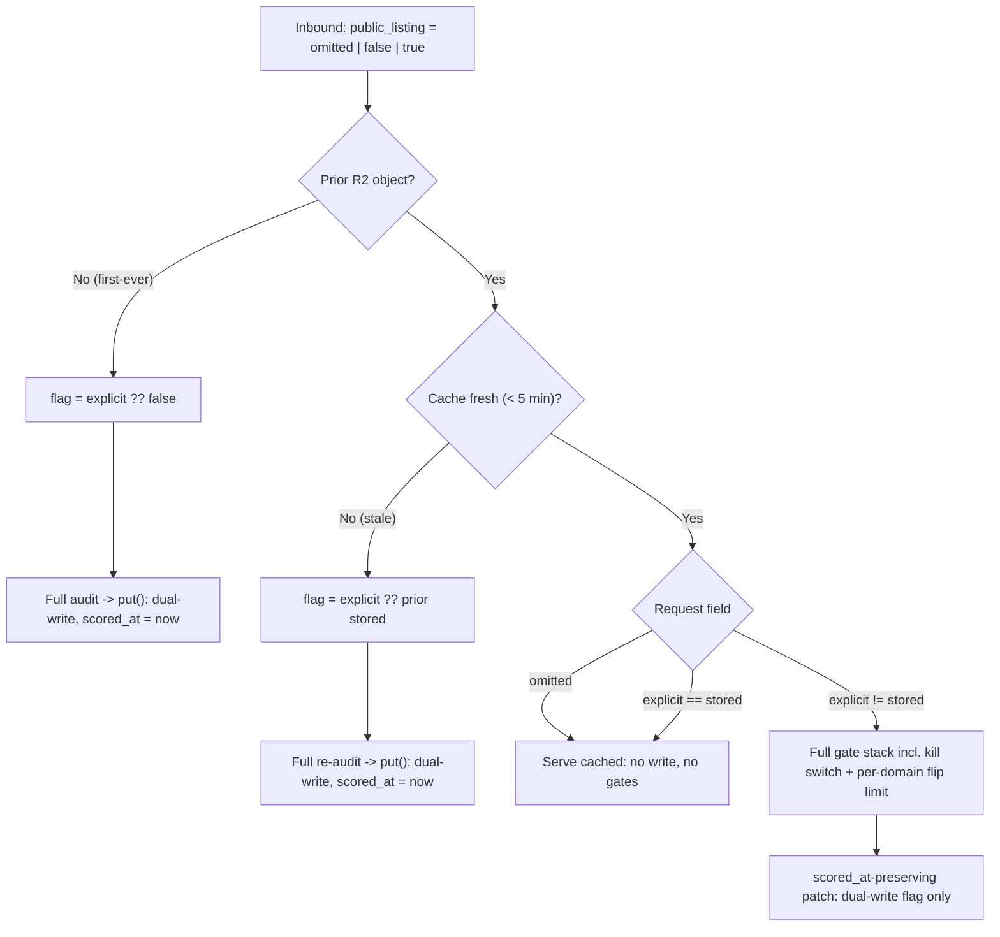
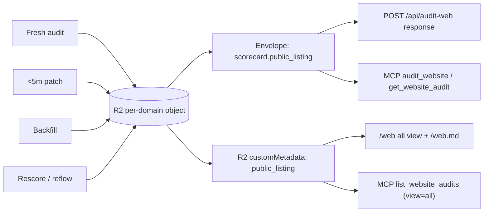

# feat: Opt-in `public_listing` gate for the web leaderboard

## Product Contract

### Summary

Make appearing on the global web leaderboard opt-in (default off) via a new additive `public_listing` boolean, across
every web submission and read surface. This plan covers the **web half only**; the CLI half and the `agentnative-skill`
repo are out of scope.

### Problem Frame

Today every successful web audit that lands in R2 is eligible for the `/web` "all" view: a site is listed whether or not
its submitter wanted public exposure. The board draws no line between "audited" and "consented to being listed."
`public_listing` draws that line: listing becomes an explicit, submitter-set choice, curated seeds excepted. Because
listing is opt-in, existing user-submitted rows must be treated as not-consented until their submitter says otherwise.

### Requirements

- **R1** — `public_listing` is an optional boolean, default off, additive to both the web scorecard envelope and the R2
  board custom metadata. `WEB_SCHEMA_VERSION` stays `0.2`.
- **R2** — All three inbound surfaces accept the flag: the web form (`POST /api/audit-web` body), the MCP
  `audit_website` param, and direct API POSTs. The submitter sets it; there is no ownership verification.
- **R3** — Write semantics: an explicit value always takes effect; a blank (omitted) value never erases a stored choice;
  a blank defaults to false only on a first-ever audit. Inside the 5-minute serve-cached window an explicit value is
  applied as a flag-only patch behind the same gate stack as a fresh audit; after the window a request re-audits and
  sets the flag.
- **R4** — Outbound: the `/web` "all" view and MCP `list_website_audits` gate non-curated rows on the flag via one
  shared predicate; the scorecard JSON exposes the field on the `POST /api/audit-web` response and both MCP read tools.
  Per-site result pages stay publicly reachable regardless of the flag; the homepage teaser stays curated-only.
- **R5** — A one-time backfill re-puts every existing per-domain R2 audit object so the stored schema matches exactly:
  user-submitted objects get `false`, curated seeds get `true`. The pass is idempotent and preserves each object's
  `scored_at`.
- **R6** — The flag stays synchronized across the envelope and the R2 custom metadata on every write path (fresh audit,
  patch, backfill, rescore/reflow). Curated seeds are always shown and are exempt from the flag predicate.
- **R7** — A flag-changing write is additionally bounded by a per-domain flip-rate limit, distinct from the hourly audit
  budget, to bound the submitter-set-flag griefing that follows from KD2.

### Key Decisions

These carry forward from the session that scoped this work. Each is a settled product decision; the Planning Contract's
KTDs instantiate the how-level choices.

- **KD1 — Additive optional field, no schema bump** (session-settled: user-directed — chosen over a `WEB_SCHEMA_VERSION`
  bump and over a metadata-only design: the field is a new optional value existing consumers can ignore, which the
  repo's additive-extension convention treats as non-breaking). Governs R1.
- **KD2 — Submitter-set, no ownership verification** (session-settled: user-directed — chosen over site-signal consent:
  the submitter of an audit is the party expressing the listing choice; griefing is bounded by a rate limit, not by
  authorization). Governs R2, R7.
- **KD3 — Explicit-wins / blank-never-erases semantics** (session-settled: user-directed — chosen over blank-erases and
  over a TTL-based model: a forgotten checkbox must not silently delist, and a re-check must not wipe a prior choice).
  Governs R3.
- **KD4 — `list_website_audits` mirrors `/web`; per-site pages and teaser unchanged** (session-settled: user-directed —
  chosen over also gating per-site result pages: the flag gates *board listing*, not reachability). Governs R4.
- **KD5 — One-time backfill over grandfathering** (session-settled: user-directed — chosen over an indefinite read-time
  "missing == false" fallback: making the stored schema exact avoids a permanent legacy branch and makes the migration
  the single forward path). Governs R5.
- **KD6 — De-seed is a two-step operator action, not a single-step reconciliation** (session-settled: user-directed —
  chosen over actively reconciling on de-seed: removing a domain from the seed leaves its stored `true` until the 30-day
  age-off, and an owner who wants it gone sooner re-requests the audit with `public_listing: false`). Governs R4.

### Scope Boundaries

In scope: the web scorecard envelope, R2 board metadata, the three web inbound surfaces, the `/web` all-view and `.md`
twin, the `list_website_audits` board tool, the two MCP read tools (`audit_website`, `get_website_audit`), the
rescore/reflow write path, the per-domain flip-rate limiter, the web-form client (including the audit-hero form markup),
and a one-time backfill.

Out of scope:

- The CLI half entirely (user CLI scores at `/api/score`, `/scorecards`, live-score share pages). No public CLI listing
  surface exists today; that is a separate scope decision, deferred by user direction.
- The `agentnative-skill` repo.
- Any change to per-site result-page reachability or `share_url` emission.
- Ownership verification or authenticated consent (explicitly rejected in KD2; griefing bounded by R7's rate limit).

#### Deferred to Follow-Up Work

- If a `GET /web/<domain>` JSON twin is ever wanted, it would be net-new (none exists today); the field is already
  exposed on the POST response and MCP read tools, so this is not required for R4.

---

## Planning Contract

### Key Technical Decisions

- **KTD1 — Dual-store the flag (envelope + R2 custom metadata), one shared writer.** Board gating reads custom metadata
  only (`listAllWebAudits` never fetches bodies), while JSON surfaces read the envelope. The flag therefore lives in
  both places and every write path must set both in a single `put` (R2 is atomic within one object write, not across
  concurrent writers — see the cross-writer-race note in Risks). "One shared writer" is a convention enforced by the
  parity tests, not by the type system: any future third write path is a fresh desync vector. Governs R6.
- **KTD2 — New `scored_at`-preserving write primitive.** `cache.ts` `put()` unconditionally re-stamps `scored_at = now`,
  which would reset the 5-minute freshness window (patch) and the 30-day all-view display age (backfill). Add a
  preserving writer used by both the patch and the backfill. R2 has no partial-metadata update, so the primitive is a
  `get -> merge flag into body + metadata -> re-put` that carries the prior `scored_at` forward. Governs R3, R5.
- **KTD3 — Model the flag as `boolean | undefined` end-to-end; collapse to `false` only at the first-ever edge.**
  "Blank-never-erases" holds only if an omitted request value stays distinct from an explicit `false` through parsing
  and threading. Chokepoints: the MCP Zod param is `z.boolean().optional()` with **no** `.default()`; the web POST body
  is strict-boolean-validated with an `=== undefined` check; the re-audit call site substitutes the prior stored value
  when the request omits it. Missing stored values coerce to `false` at read/gate boundaries but are never written on a
  read. Governs R3.
- **KTD4 — Filter is serve-time on the shared enumeration.** The `/web` all view enumerates R2 objects live per request
  (`listAllWebAudits`) and reads their custom metadata; user rows are not precomputed into an aggregate. The predicate
  is therefore applied at serve time on the shared enumeration, so a flag flip is visible immediately with no rescore
  latency. `list_website_audits` (view=all) calls the same enumeration and applies the same predicate. Governs R4.
- **KTD5 — Rescore and registry-reflow writes thread `public_listing = isSeededDomain(domain)`.** The rescore workflow
  and the registry-fingerprint reflow re-audit seeded domains through `auditDomainToCache`, which builds a fresh
  scorecard with no flag memory. Without threading, every curated re-audit would reset the stored flag to `false` and
  desync envelope/metadata. Seeded domains write `true`. Governs R6.
- **KTD6 — All patches sit behind the full gate stack, including the kill switch** (session-settled: user-directed —
  chosen over letting opt-out bypass `WEB_AUDIT_ENABLED`: "same gates as a fresh audit" is honored literally, keeping
  one code path). Accepted consequence: while audits are disabled, a user cannot opt out; their row keeps showing until
  the switch is back on. The board is not updating during that window anyway. Governs R3.
- **KTD7 — Backfill is fill-if-absent and reuses the exact per-domain key filter.** It sets the flag only when absent
  (never overwriting an explicit value, so re-runs are safe), skips aggregate and off-version keys via the same
  `PER_DOMAIN_HASH_RE` + version filter `listAllWebAudits` uses, and derives curated/user from `isSeededDomain`
  (pre-existing in `seed.ts`). Governs R5.
- **KTD8 — Per-domain flip-rate limit on flag-changing writes.** Because the flag is submitter-set with no ownership
  check (KD2) and a flip is far cheaper than a full audit, a dedicated per-domain limiter (keyed by domain hash,
  KV-backed like the existing hourly limiter) gates any write that *changes* a domain's stored `public_listing` — the
  in-window patch and an out-of-window re-audit whose resolved value differs from the stored value. Exceeding the
  per-domain flip budget returns 429; the budget is sized for legitimate owner toggling (a few flips per domain per
  rolling window) and lives in the shared flag-resolution helper so both surfaces enforce one budget. Governs R7.

### Assumptions

- The web-form checkbox is binary, so a real form submit always sends an explicit `true`/`false` (unchecked = explicit
  `false`). "Blank preserves prior" is exercised by direct API POSTs, MCP calls that omit the field, **and** a direct
  `/web/scoring/<host>` visit with no preceding form submit (U9 omits the field on that path). The checkbox loads
  unchecked (opt-in default); a prior stored `true` is not reflected back into the box (the form has no read of prior
  state), so a deliberate web re-submission with the box unchecked opts the site out. This is the intended "most-recent
  explicit action wins" behavior.
- `AMBIG-1` (stale re-audit of a legacy object that omits the field and has no stored flag): treat the missing prior as
  `false`. The backfill reaches these first, making the case rare.

---

## High-Level Technical Design

### Write-path decision logic

The caller (each inbound handler) resolves the tri-state before any write, then chooses one of three paths. A write that
*changes* the stored flag additionally consumes a per-domain flip token (KTD8).

### Truth table (authoritative for the write semantics)

`R` = request field (`omit`/`F`/`T`); `S` = stored flag (`-` = no object, `∅` = object with no flag key, `F`, `T`).
Path: `SC` = serve-cached (no write), `PATCH` = scored_at-preserving flag patch (gated + flip-limited), `AUDIT` = full
(re-)audit via `put()`.

| Cache state | S   | R    | Result stored            | Path  | scored_at |
| ----------- | --- | ---- | ------------------------ | ----- | --------- |
| first-ever  | -   | omit | F                        | AUDIT | reset     |
| first-ever  | -   | F    | F                        | AUDIT | reset     |
| first-ever  | -   | T    | T                        | AUDIT | reset     |
| fresh (<5m) | F/T | omit | unchanged                | SC    | preserved |
| fresh       | ∅   | omit | stays absent (read as F) | SC    | preserved |
| fresh       | X   | == X | unchanged                | SC    | preserved |
| fresh       | F/∅ | T    | T                        | PATCH | preserved |
| fresh       | T/∅ | F    | F                        | PATCH | preserved |
| stale (>5m) | F/T | omit | prior (caller carries)   | AUDIT | reset     |
| stale       | ∅   | omit | F (assumed)              | AUDIT | reset     |
| stale       | any | F    | F                        | AUDIT | reset     |
| stale       | any | T    | T                        | AUDIT | reset     |

### Dual-store data flow

---

## Implementation Units

### U1. Envelope field + engine threading

**Goal:** Make `public_listing` a first-class, always-resolved field on a freshly built scorecard.

**Requirements:** R1, R6 (envelope half).

**Dependencies:** none.

**Files:**
- `src/worker/audit-web/scorecard.ts`
- `src/worker/audit-web/engine.ts`
- `tests/web-audit-scorecard-format.test.ts`

**Approach:**
1. Add `public_listing?: boolean` to the `WebScorecard` interface and emit a resolved boolean in `buildWebScorecard`
   (`public_listing: meta.publicListing ?? false`) — the caller resolves the tri-state before this runs, so the `??
   false` only fires on a first-ever audit with no explicit value.
2. Add `publicListing?: boolean` to `WebScorecardMeta`.
3. Add `publicListing?: boolean` to `RunWebAuditInput` and pass it into the `buildWebScorecard` meta at the engine's
   call site.

**Patterns to follow:** mirror the existing optional-field convention (`na_reason` conditional spread, `scored_at?`
optional-with-tolerant-guard). Type as `boolean`, never `any`.

**Test scenarios:**
- Meta `publicListing: true` -> envelope `public_listing: true`.
- Meta `publicListing: false` -> envelope `public_listing: false`.
- Meta omitted -> envelope `public_listing: false` (first-ever default).
- `schema_version` remains `0.2`.

**Verification:** the scorecard-format test asserts the field's presence and default; typecheck passes.

### U2. R2 metadata field + `scored_at`-preserving dual-writer

**Goal:** Persist the flag in custom metadata and add the preserving write primitive used by the patch and backfill.

**Requirements:** R1 (metadata half), R3, R5, R6.

**Dependencies:** U1.

**Files:**
- `src/worker/audit-web/cache.ts`
- `tests/web-audit-cache.test.ts`

**Approach:**
1. `boardMetadataOf`: emit `public_listing` as a string (`String(scorecard.public_listing ?? false)`), since R2 metadata
   is string-only.
2. Add `public_listing: boolean` to `WebListedAudit` and parse it in `parseListedMetadata` (`meta.public_listing ===
   'true'`, missing coerces to `false`).
3. Add a preserving writer (e.g. `patchStoredPublicListing(env, cached, value)`): take the already-fetched
   `CachedWebAudit`, set `scorecard.public_listing = value`, rebuild custom metadata from the mutated scorecard, and
   re-put the body + metadata **carrying the prior `scored_at`** (do not restamp). It is a full object rewrite because
   R2 has no partial-metadata update.

**Patterns to follow:** `makeR2Stub` in `tests/web-audit-cache.test.ts` (captures `putOptions`/`customMetadata`,
supports `listPages`). Narrow off `unknown` as `boardMetadataOf` already does; never `any`.

**Test scenarios:**
- `boardMetadataOf` emits `public_listing: 'true'` / `'false'`.
- `parseListedMetadata` reads `'true'` -> `true`, `'false'` -> `false`, missing -> `false`.
- Preserving writer sets both envelope and metadata and keeps the prior `scored_at` unchanged.
- Preserving writer leaves all other envelope fields intact.

**Verification:** cache tests assert dual-write and `scored_at` preservation.

### U3. Web POST inbound + patch/re-audit path

**Goal:** Accept the flag on `POST /api/audit-web` and route to serve-cached / patch / re-audit per the truth table.

**Requirements:** R2, R3, R6.

**Dependencies:** U1, U2.

**Files:**
- `src/worker/audit-web/route.ts`
- `tests/web-audit-handlers.test.ts` / `tests/web-audit-routes.test.ts` (the existing handler/route tests that cover
  `handleWebAudit`)

**Approach:**
1. Body parse: add `public_listing?: unknown`; validate strictly as boolean (reject non-boolean with a 400
   `invalid_public_listing`), keeping omitted distinct from `false`.
2. Fresh-hit branch: when the request carries an explicit value that **differs** from the stored value, do not take the
   early return; fall through the full gate stack (kill switch, Turnstile, limiters), then call the preserving writer
   (U2) and return. Redundant explicit (`== stored`) and omitted both serve cached with no write.
3. Stale/miss branch: resolve the flag as `explicit ?? priorStored ?? false` (prior read from the in-scope `cached`
   object) and thread it into `runWebAudit`.
4. The patch path returns the **same response shape** as a normal audit — the patched scorecard plus `share_url` — so
   the web client's existing JSON branch (which forwards on `body.share_url`) works unchanged.

**Patterns to follow:** the hand-rolled body validation for `site_type` (strict enum check -> 400).

**Execution note:** the tri-state and gate-order rows are the risk; drive them with the truth table as the test oracle.

**Test scenarios (web surface rows of the truth table):**
- Fresh + stored `T` + omit -> serve cached, no write.
- Fresh + stored `F` + `T` -> patch to `T`, `scored_at` preserved, gates run.
- Fresh + stored `T` + `T` -> serve cached, no write (redundant).
- Stale + stored `T` + omit -> re-audit preserves `T`.
- Stale + stored `T` + `F` -> re-audit to `F`.
- First-ever + omit -> `F`; first-ever + `T` -> `T`.
- Body with `public_listing: "false"` (string) or a number -> 400 `invalid_public_listing`.
- A patch response carries `share_url` and the patched scorecard.
- With `WEB_AUDIT_ENABLED != 'true'`: an explicit-differing request in the fresh window is blocked by the kill switch
  (no patch), per KTD6.

**Verification:** route tests green across the enumerated rows.

### U4. MCP `audit_website` inbound + patch/re-audit path

**Goal:** Same inbound semantics as U3 on the MCP tool.

**Requirements:** R2, R3, R6.

**Dependencies:** U1, U2. Shares the flag-resolution + patch helper with U3 (factor the resolution and the
patch-vs-audit decision into a shared function; each handler wires its own gates, which differ per surface).

**Files:**
- `src/worker/mcp/tools/web-audit.ts`
- `tests/web-audit-mcp-tools.test.ts`

**Approach:**
1. Add `public_listing: z.boolean().optional()` to the `audit_website` input schema — **no `.default()`**, so omitted
   stays `undefined`.
2. In the handler, apply the same serve-cached / patch / re-audit decision as U3, reading the prior value from the
   in-scope `cached` object on the stale path. The patch returns the same result shape as a normal `audit_website`
   response (patched scorecard + `share_url`).
3. Confirm the read exposure is automatic: `enrichWebScorecardForDisplay` spreads the stored object, so the envelope
   field passes through `audit_website` and `get_website_audit` untouched (no enricher change).

**Patterns to follow:** the existing Zod `.optional()` params; the MCP gate order (`cf-connecting-ip`, hourly budget) as
the "same gates" for this surface.

**Test scenarios:**
- Omitted param -> `undefined` -> no-op on a re-check (does not erase stored `T`).
- Explicit `true`/`false` follow the truth table (patch in-window, re-audit when stale).
- Non-boolean param rejected by Zod.
- `audit_website` and `get_website_audit` responses include `public_listing`.

**Verification:** MCP tool tests green; both read tools expose the field.

### U5. Outbound board gating — one shared predicate

**Goal:** Gate non-curated rows on the flag in the `/web` all view and its `.md` twin.

**Requirements:** R4, R6.

**Dependencies:** U2.

**Files:**
- `src/worker/audit-web/route.ts` (`handleWebLeaderboard`)
- `src/worker/audit-web/cache.ts` (the shared predicate lives here, beside `listAllWebAudits`)
- `tests/web-audit-leaderboard-route.test.ts`

**Approach:** define one predicate `isBoardListable(row) = row.public_listing === true`, exported from a single module
(co-locate it with `listAllWebAudits` in `src/worker/audit-web/cache.ts`) and imported by both `handleWebLeaderboard`
and the MCP `list_website_audits` tool — a re-implementation in either surface is exactly the divergence the parity test
exists to catch. Apply it to the non-curated (`view === 'all'`) rows once in the handler, on the shared
`entries`/`userSubmitted` list **before** the HTML-vs-markdown renderer branch, so the two surfaces cannot diverge.
Curated rows continue to come from the aggregate and are always shown.

**Patterns to follow:** the existing `view === 'all'` enumeration; `excludeDomains` seeding for curated rows.

**Test scenarios:**
- Mixed fixture (`true`/`false`/absent user rows): only `true` rows appear on `/web?view=all`.
- `/web.md?view=all` returns the identical row set as the HTML view.
- Curated rows always present regardless of their flag.
- `view` default (curated) unchanged by this unit.

**Verification:** leaderboard-route tests assert HTML/md parity and correct gating.

### U6. `list_website_audits` mirrors `/web` (curated + opted-in)

**Goal:** Make the MCP list tool emit curated + opted-in user rows via the same predicate, with a `view` param.

**Requirements:** R4.

**Dependencies:** U5.

**Files:**
- `src/worker/mcp/tools/web-audit.ts`
- `tests/web-audit-mcp-tools.test.ts`

**Approach:**
1. Add a `view` param (default curated; `all` -> curated + opted-in). For `all`, build the curated `excludeDomains` set
   exactly as `handleWebLeaderboard` does — the leaderboard aggregate's entry domains unioned with `loadWebSeed(env)`
   domains — then enumerate via `listAllWebAudits(..., { excludeDomains })` and apply the shared predicate from U5.
   Without the exclude set, curated domains would surface as user rows and diverge from `/web?view=all`.
2. Bound the returned set (reuse the board's display cap or add a `limit`) rather than returning the entire user cache
   to the MCP client unpaginated.
3. Update the tool description from "curated" to "curated + opted-in".
4. Rewrite the two curated-only guard tests: the "non-seeded cached audit never appears" invariant becomes "appears when
   opted-in under `view=all`"; the "description says curated" assertion becomes "curated + opted-in". Add a `list()`
   (with `include: ['customMetadata']`) to the MCP test mock bucket (`makeEnv`), which currently has only
   `get`/`put`/`delete`.

**Patterns to follow:** U5's predicate (single source of truth — same imported function, not a re-implementation).

**Test scenarios:**
- `view=curated` (default) -> curated only.
- `view=all` -> curated + opted-in user rows.
- For a shared mixed fixture, `view=all` returns the same user-row set as `/web?view=all` (cross-surface parity).
- A curated domain does not appear twice under `view=all` (excludeDomains dedup).
- The two rewritten guards pass with the new contract.

**Verification:** MCP tool tests green; `/web` all and `list_website_audits` all agree on the same fixture.

### U7. Rescore + reflow flag threading

**Goal:** Keep curated objects' flag at `true` through rescore and registry-reflow re-audits.

**Requirements:** R6.

**Dependencies:** U1, U2.

**Files:**
- `src/worker/audit-web/rescore-workflow.ts`
- the rescore-workflow test (if present; otherwise add coverage alongside `tests/web-audit-cache.test.ts` fixtures)

**Approach:** in `auditDomainToCache`, thread `publicListing: isSeededDomain(env, domain)` into `runWebAudit` so every
seeded re-audit writes `public_listing: true` to both stores. This prevents a rescore or a registry-fingerprint reflow
from resetting curated objects to the default. The metadata half of "both stores" is emitted by `boardMetadataOf`, which
U2 modifies — hence the U2 dependency.

**Patterns to follow:** `isSeededDomain` / `loadWebSeed` in `src/worker/audit-web/seed.ts`.

**Test scenarios:**
- A seeded-domain rescore writes `public_listing: true` in envelope and metadata.
- A reflow that re-audits all seeded domains leaves each with `true` (no desync to `false`).

**Verification:** rescore path test asserts seeded writes carry `true`.

### U8. One-time backfill pass

**Goal:** Re-put every existing per-domain object so stored schema is exact: user -> `false`, curated -> `true`.

**Requirements:** R5, R6.

**Dependencies:** U2 (preserving writer). `isSeededDomain` is pre-existing in `seed.ts` (not produced by U7). Land the
backfill *after* U7 in production ordering so a post-backfill curated rescore does not reset a seeded flag to `false`
(see Rollout) — a deploy-ordering coupling, not a code dependency.

**Files:**
- `src/worker/audit-web/rescore-trigger.ts` (extend the `WEB_RESCORE_SECRET`-authed endpoint with a backfill action) or
  a sibling backfill module invoked from it
- `tests/web-audit-cache.test.ts` (or a dedicated backfill test) using the `makeR2Stub` `listPages` support

**Approach:**
1. Enumerate `list({ prefix: 'audits/web/', include: ['customMetadata'] })`, keeping only keys that pass the exact
   `listAllWebAudits` filter (`parts.length === 4 && PER_DOMAIN_HASH_RE.test(parts[2]) && parts[3] ===
   \`${version}.json\``). Skip aggregate keys and off-version objects.
2. For each object with **no** stored flag: `cacheGet` the body, set `public_listing = isSeededDomain(env, domain)`, and
   write via the preserving writer (U2) so `scored_at` is unchanged. Objects that already carry an explicit value are
   left untouched (fill-if-absent -> idempotent).
3. **Bound the work.** A single Worker invocation has a finite subrequest budget and each object costs 2+ subrequests
   (`cacheGet` + preserving `put`), so do not re-put the whole cache inline. Process in cursor-bounded batches — either
   host it as a self-draining Workflow the way rescore drains "regardless of board size" (`rescore-workflow.ts`), or
   process one bounded batch per secret-authed call and return a cursor. Completion protocol: **re-run until a run
   reports zero writes** (not a single re-run), bounded by the current object count (see Open Questions).
4. **Seed-load guard.** If `loadWebSeed` fails, abort the batch rather than proceeding — a failed seed load would
   misclassify curated domains as `false`, and fill-if-absent would not correct it on a later re-run.
5. Support `--dry-run` (report per-object intended change, write nothing) and log loud per-object diffs (`added
   public_listing: false`), plus a written/skipped tally per run.
6. Gate the endpoint behind the existing `WEB_RESCORE_SECRET` constant-time compare.

**Execution note:** idempotent, dry-run-first, and re-run until zero writes. Do **not** verify via `/web?view=all`
counts — the backfill stamps user rows `false` and the predicate hides `false` rows, so the board count is identical
whether the backfill ran, half-ran, or never ran. Verify via the run's written/skipped tally and per-domain
`get_website_audit` (which reads the envelope field) through the **Worker** read path; never `wrangler r2 object get`
(returns edge-cached, pre-backfill copies).

**Test scenarios:**
- User-submitted object with no flag -> `false`; curated seed with no flag -> `true`.
- Object already carrying explicit `true` -> untouched on a re-run (idempotent).
- Aggregate key (`audits/web/leaderboard/<v>.json`) and off-version keys -> skipped.
- `scored_at` preserved for every re-put.
- A batch larger than one page drains across calls until a run reports zero writes.
- `loadWebSeed` failure -> batch aborts; no curated domain stamped `false`.
- Dry-run writes nothing and reports the intended diff + tally.

**Verification:** backfill test asserts fill-if-absent, curated/user split, skip filter, `scored_at` preservation,
seed-load-failure abort, and re-run-until-zero-writes; staging drive verifies via the run tally and per-domain
`get_website_audit`, not board counts.

### U9. Web-form opt-in checkbox transport

**Goal:** Give the web form a channel to send `public_listing` in the POST body (none exists today).

**Requirements:** R2 (web-form surface).

**Dependencies:** U3.

**Files:**
- `src/build/07-subpages.mjs` (insert the opt-in checkbox `<input>` into the audit-hero form — the `data-web-audit-form`
  block — with a `data-` attribute `web-audit.ts` can query; `web-audit.ts` only reads DOM it does not create)
- `src/client/web-audit.ts`
- `src/client/web-audit-scoring.ts`
- staging e2e (`test:e2e`) coverage for the checkbox -> POST flow

**Approach:** add the opt-in checkbox to the audit-hero form markup (`07-subpages.mjs`); `web-audit.ts` reads it and
stashes its value to the scoring page via the same session-stash pattern the Turnstile token uses;
`web-audit-scoring.ts` includes `public_listing` in the `POST /api/audit-web` body. When a checkbox value **was**
stashed (a real form submit), send the explicit boolean. When **no** value is stashed — a direct visit to
`/web/scoring/<host>` with no preceding form submit — **omit** `public_listing` entirely (do not send `false`), so an
unattended shared-link re-audit preserves the prior stored choice per KTD3.

**Patterns to follow:** the existing Turnstile-token stash between `web-audit.ts` and `web-audit-scoring.ts`.

**Test scenarios:**
- Box checked -> POST body `public_listing: true`.
- Box unchecked -> POST body `public_listing: false`.
- Direct `/web/scoring/<host>` visit with no stashed checkbox value -> POST omits `public_listing` (does not send
  `false`).
- The submitted value round-trips to the stored flag (e2e: checked submission then `get_website_audit` shows `true`).

**Verification:** staging e2e drives the checkbox and asserts the stored flag.

### U10. Per-domain flip-rate limit

**Goal:** Bound listing-flip griefing with a per-domain throttle on flag-changing writes.

**Requirements:** R7.

**Dependencies:** U3, U4 (the shared flag-resolution + patch path).

**Files:**
- `src/worker/audit-web/route.ts` and `src/worker/mcp/tools/web-audit.ts` (enforce at the shared flip decision point)
- the shared flag-resolution/patch helper module (from U3/U4)
- `tests/web-audit-handlers.test.ts` / `tests/web-audit-mcp-tools.test.ts`

**Approach:** at the point where a request would *change* a domain's stored flag (the PATCH path, and a re-audit whose
resolved value differs from the stored value), consume from a per-domain flip budget keyed by the domain hash, backed by
KV like the existing hourly limiter. When the budget is exhausted, reject with 429 (`flip_rate_limited`) before the
write. The budget is small (a few flips per domain per rolling window) — enough for a legitimate owner to correct their
own choice, not enough for rapid griefing. Enforce inside the shared flag-resolution helper so the web and MCP surfaces
draw from one budget. A no-op (redundant explicit `== stored`, or omitted) does not consume budget.

**Patterns to follow:** the existing per-IP / hourly KV limiter in the audit gate stack.

**Test scenarios:**
- Flips within budget succeed; the (N+1)th flip on the same domain within the window -> 429 `flip_rate_limited`.
- The limiter is keyed by domain, not IP — flips across different domains are independent.
- A no-op (redundant explicit `== stored`, or omitted) does not consume flip budget.
- Web and MCP surfaces draw from the same per-domain budget.

**Verification:** limiter tests assert per-domain throttling and that no-op requests are free.

---

## System-Wide Impact

- **Mass one-time delist (intended).** Once the read filter is live (at deploy), every existing user-submitted row
  disappears from `/web?view=all` and `list_website_audits?view=all` until its submitter re-audits (or patches) with
  `public_listing: true` — because missing metadata reads as `false`, this happens at deploy whether or not the backfill
  has run yet. This is the designed effect of an opt-in default and should be communicated wherever the board's
  population is described.
- **Consent gap during a kill-switch outage (accepted, KTD6).** While `WEB_AUDIT_ENABLED != 'true'`, no patch runs, so a
  user cannot opt out until the switch is restored.
- **Curation overrides an opt-out.** A domain a user opted out of that later becomes a curated seed is shown again
  (curated is always shown). This follows from KD4/R6 and is a deliberate operator action (editing the seed list).
- **De-seeding a curated domain (accepted, two-step — KD6).** When a domain is removed from the seed, its last write
  left `public_listing: true`, so it renders as an opted-in user row until the 30-day display age-off clears it. Handled
  as a two-step operator action: remove it from the seed, and if the owner wants it delisted sooner they re-request the
  audit with `public_listing: false`. No single-step reconciliation is added.
- **Patch freezes the display-age clock.** The preserving writer keeps the prior `scored_at`, which also freezes the
  30-day all-view display age. A user opting in near day 30 lists only briefly before ageing off, and an opt-in patch
  never refreshes display age — only a full re-audit (>5 min) does.

## Risks & Dependencies

- **Envelope/metadata desync** is the highest-consequence bug class; KTD1's single shared writer plus the parity tests
  (U5/U6 cross-surface fixture) are the guard. It is a convention, not a type-system guarantee — a future third write
  path is a fresh desync vector.
- **Validator default trap** (KTD3): a stray `.default(false)` on the MCP param or loose coercion on the web body
  silently breaks blank-never-erases. Covered by the omitted-param and non-boolean tests.
- **No filter-ordering gate exists (and none is needed).** The read filter ships with U5/U6 code and goes live at
  deploy; there is no separate runtime toggle. It does **not** assume the field exists: `parseListedMetadata` coerces
  missing metadata to `false` (KTD3), so an unmigrated object reads as `false` and is hidden exactly like a backfilled
  one. The backfill's job is to make the stored schema exact (KD5) and set curated seeds to `true`; it is not a
  prerequisite for the board being correct, so it is safe to run after deploy. The mass-delist of existing user rows
  therefore happens at deploy, backfill or not.
- **Third-party listing-flip griefing** (consequence of KD2), bounded by U10. Because the flag is submitter-set with no
  ownership check and the filter is serve-time (instant flip), any party could otherwise delist a competitor's opted-in
  domain or re-list a domain whose owner opted out. The per-domain flip-rate limit (R7/KTD8/U10) is the bound; ownership
  verification remains out of scope per KD2. Per-site pages are already public, so this is a griefing/consent concern,
  not data disclosure.
- **Cross-writer race (low likelihood, accepted).** The preserving writer and backfill are read-merge-re-put with no
  compare-and-swap, and R2 is last-writer-wins across concurrent writers. A live opt-in patch racing the one-time
  backfill on the same key could lose one update. Likelihood is low (one-time backfill, millisecond windows); if it ever
  matters, add an `If-Match`/CAS guard.

## Rollout

1. Land U1–U10 behind the normal dev-branch squash flow (per-PR, no auto-merge without explicit go).
2. Deploy. The read-time filter is live on deploy (it ships with U5/U6, no separate enable step); existing user rows are
   delisted immediately because missing metadata reads as `false`.
3. Run the backfill `--dry-run`, review the diff + tally, then run it for real, re-running until a run reports zero
   writes. This makes the stored schema exact and sets curated seeds to `true`; it does not change the board's user-row
   visibility (already `false` either way).
4. Verify the backfill via the run's written/skipped tally and per-domain `get_website_audit` through the Worker read
   path — **not** `/web?view=all` counts (they cannot observe a to-`false` migration) and not the R2 CLI.
5. Staging e2e for the checkbox -> POST -> stored-flag round trip (U9).

## Open Questions

- **R2 object count for backfill sizing.** How many per-domain user objects exist in R2 today? This sets how many batch
  drains the backfill needs and whether a Workflow host is warranted over a batched secret-authed endpoint.

## Verification Contract

- `bun test` green, including the new/rewritten tests in `web-audit-scorecard-format`, `web-audit-cache`,
  `web-audit-handlers` / `web-audit-routes`, `web-audit-leaderboard-route`, and `web-audit-mcp-tools`.
- `tsc --noEmit` clean (client + worker configs); `biome check .` clean. No `any`.
- The truth table is fully covered by U3 + U4 tests.
- `/web?view=all` (HTML), `/web.md?view=all`, and `list_website_audits?view=all` return the same user-row set for a
  shared mixed fixture.
- The per-domain flip-rate limit rejects over-budget flips (429 `flip_rate_limited`) and leaves no-op requests free.
- Backfill is idempotent, re-runs until zero writes, aborts on seed-load failure, and preserves `scored_at`; verified
  via the run tally and per-domain `get_website_audit`, not board counts.

## Definition of Done

- `public_listing` is accepted on all three inbound surfaces with the truth-table semantics and dual-store sync.
- `/web` all-view, its `.md` twin, and `list_website_audits` (view=all) gate non-curated rows on one shared predicate;
  curated rows always show; per-site pages and the teaser are unchanged.
- The scorecard JSON exposes the field on the POST response and both MCP read tools.
- Flag-changing writes are bounded by the per-domain flip-rate limit (R7).
- The backfill has run to zero-writes and been verified (run tally + per-domain `get_website_audit`) in the target
  environment; the read-time filter is live from deploy.
- `WEB_SCHEMA_VERSION` is still `0.2`.

## Sources & Research

- Repo code map (this session): envelope/`buildWebScorecard`/`WebScorecardMeta` in `scorecard.ts`; `put()`,
  `boardMetadataOf`, `parseListedMetadata`, `listAllWebAudits`, staleness/display constants in `cache.ts`;
  `handleWebAudit` gate order + serve-cached short-circuit and `handleWebLeaderboard` in `route.ts`;
  `audit_website`/`get_website_audit`/`list_website_audits` in `mcp/tools/web-audit.ts`; seed-only rescore + reflow in
  `rescore-workflow.ts` / `rescore-trigger.ts`; `isSeededDomain` in `seed.ts`; the missing web-form transport in
  `src/build/07-subpages.mjs` + `src/client/web-audit.ts` + `web-audit-scoring.ts`.
- Institutional learnings (`docs/solutions/`): gate-a-behavior-on-a-flag and additive-shared-type-extension
  (design-patterns); one-shot migration over legacy fallback (best-practices); schema-applied-defaults-mean-
  unset-is-not-off (conventions); CF-worker gate-ordering-before-cost-bearing-outbounds and cached-theater-
  live-fallback (architecture-patterns); wrangler-r2-object-get-stale-vs-worker-read (tooling-decisions).
- Flow + edge-case analysis (this session): the truth table, the tri-state chokepoints, cross-surface parity traps,
  rescore/reflow desync, and backfill idempotency/verification.
- Document review (this session): coherence, feasibility, scope-guardian, security-lens, and adversarial reviewers.
  Applied corrections: U7/U8 dependency accuracy; the `list_website_audits` scope-list entry; corrected test filenames;
  backfill verification via tally + per-domain read (not board counts); the removed filter-ordering gate; U6
  `excludeDomains` build + result bound; U9 form-markup file + direct-link omit-field path; bounded/re-run backfill +
  seed-load guard; the shared-predicate module; PATCH response shape; and the KTD1 atomicity wording. Open judgment
  calls resolved with the user: de-seed accepts the 30-day age-off with a two-step owner escape hatch (KD6); a
  per-domain flip-rate limit was added (R7/KTD8/U10).
