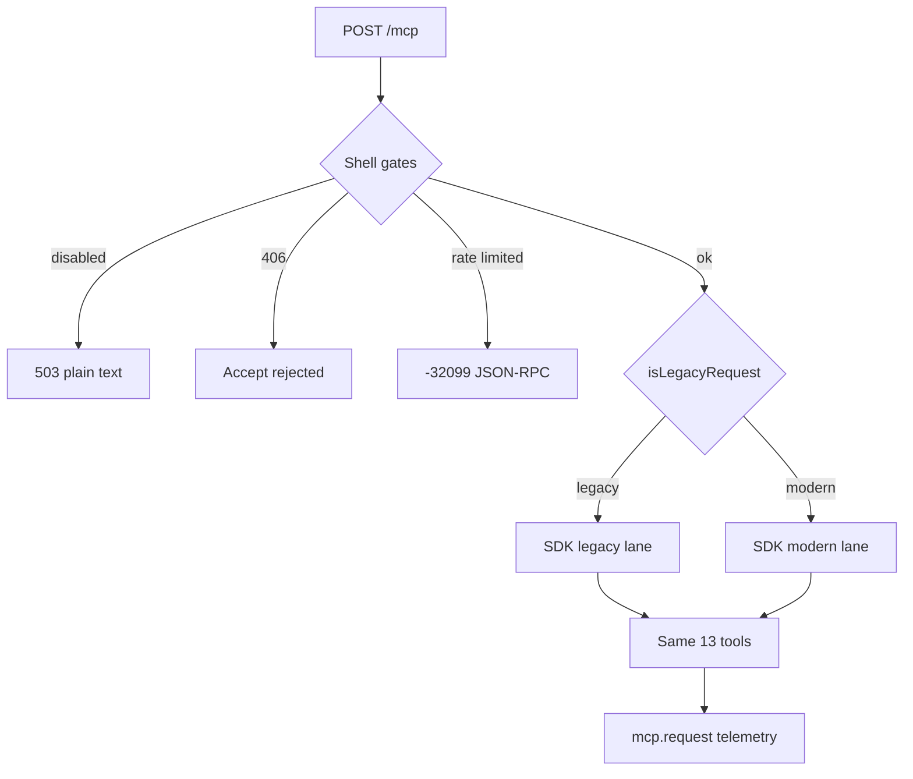

# MCP 2026-07-28 dual-protocol migration - Plan

**Target repo:** `brettdavies/agentnative-site` (anc.dev Worker MCP surface at `POST /mcp`). Prior art:
`2026-08-25-1651-feat-mcp-2026-dual-protocol-plan.md` (meum-web read-only server). All file paths below are relative
to this repository root.

## Goal Capsule

- **Objective:** Integrating agents and operators can use anc.dev's MCP catalog on spec `2026-07-28` while legacy-era
  clients (`initialize` → `tools/call`) keep working during a bounded transition, and operators can measure era mix
  precisely enough to sunset legacy without guesswork. Tool semantics, cache-state contracts, and kill-switch behavior
  stay unchanged.
- **Means:** Retarget the existing stateless MCP stack to SDK v2 (`@modelcontextprotocol/server` + `agents/mcp/server`)
  with default dual-stack (`legacy: 'stateless'`), a thin Worker orchestration shell for kill switches, multi-tier rate
  limits, and PII-free era telemetry, plus header-aware rate-limit keys on the modern lane. (KTD1, KTD2, KTD5)
- **Authority hierarchy:** session-settled KTDs in this plan > this plan's units > `AGENTS.md` § MCP server >
  `docs/runbooks/mcp-operator.md` for operational detail.
- **Execution profile:** `feat/*` branch cut from `dev`. Bun, Biome, Conventional Commits. Mirror existing
  `tests/worker-mcp.test.ts`, `tests/e2e/mcp.e2e.ts`, and `tests/worker-mcp-dispatch.test.ts` patterns.
- **Stop conditions:** Stop and surface if `agents/mcp/server` `createMcpHandler` cannot pass through SDK `legacy`
  options on the pinned `agents` version; if upgrading breaks the Worker bundle size budget materially (record
  `wrangler deploy --dry-run` delta against `dev` baseline); or if dual-stack conformance tests cannot run without a
  network fetch (use in-process `handler.fetch` per SDK migration guide).
- **Tail:** PR to `dev`; CI green (`bun run lint`, `bun run build`, `bun test`, wrangler dry-run). Update
  `docs/runbooks/mcp-operator.md` for sunset procedure and telemetry schema.

---

## Product Contract

### Summary

anc.dev's MCP server today speaks legacy MCP (`2025-06-18`) via v1 SDK types and `createMcpHandler` from `agents/mcp`.
Thirteen tools and five resources cover registry, principles, spec, scorecards, and web audits. MCP `2026-07-28` is the
current specification: stateless by default, no `initialize` handshake on the modern lane, cache hints on list/read,
and routable `Mcp-Method` / `Mcp-Name` headers. This work upgrades the server to SDK v2 while preserving legacy clients
through the SDK's built-in dual-stack, adds structured era telemetry for transition decisions, and wires header-aware
rate-limit keys on the modern lane. Cost-bearing tools (`score_cli`, `audit_website`), kill switches, and typed cache-
state responses are unchanged at the tool layer; only transport and observability change.

### Problem Frame

The server architecture is already stateless and Worker-native (no `Mcp-Session-Id`, per-request catalog reads, no
progress notifications on audits), which matches the new spec's direction. The gap is version lag (declared `2025-06-18`,
v1 imports, per-request handler rebuild workaround) and missing observability to retire legacy safely. Reimplementing
protocol routing in site code would duplicate `@modelcontextprotocol/server` and drift from Cloudflare's maintained
wrapper. The fix is retarget imports, add a thin shell for product-specific gates and logs, and bump the drift-gated
spec literals in lockstep.

### Key Decisions

- **KD1. SDK-unified dual-stack on one `/mcp` endpoint.** One tool registration graph serves both eras; the SDK routes
  legacy vs modern wire behavior. (session-settled: user-directed — chosen over manual split handlers or a second
  `/mcp/legacy` endpoint: fewer moving parts; SDK default covers this read-mostly catalog server.)
- **KD2. Defer legacy-sunset HTTP shape; log all datapoints needed to choose later.** Do not commit to JSON-RPC in-band
  vs HTTP 426 vs SDK `legacy: 'reject'` response shape in this pass. Emit telemetry that preserves method, era, outcome,
  and error codes so the sunset shape can be decided from production evidence. Governs R8, R9.
- **KD3. Module-scoped handler singleton with catalog pre-warm.** `handleMcp` awaits `loadCatalog(env)` before dispatch;
  the SDK factory reads the isolate cache synchronously. Replaces today's per-request `buildMcpHandler` rebuild.
  Governs KTD3, U1.
- **KD4. Preserve multi-tier rate limits; add era-aware keys on the shell.** Global read tier (`MCP_LIMITER`), CLI audit
  tier (`MCP_AUDIT_LIMITER` + KV hourly for `score_cli`), and web audit tier (`WEB_AUDIT_LIMITER_IP` + KV hourly for
  `audit_website`) stay. Legacy requests key `legacy:{ip}` only; modern requests key on registered `Mcp-Name` when
  present. Governs R6, R7.
- **KD5. Drift gate expands to `2026-07-28` on declared surfaces; legacy handshake still answers until sunset.** Server
  card, instructions, mcp-skill.md, and build emit constants declare the **target** revision. Legacy lane continues to
  accept `initialize` with `protocolVersion: 2025-06-18` during dual-stack. Governs R3, R4.
- **KD6. Web-audit registry checks for other sites stay legacy-shaped in this pass.** anc dogfoods MCP checks
  (`mcp-initialize`, `mcp-tools-list`, `mcp-resources-list`) against arbitrary targets; upgrading anc's own wire does
  not rewrite the ecosystem audit in this unit. Follow-up adds modern-era probes. Governs scope boundary.

### Requirements

**Protocol and SDK**

- R1. MCP POST `/mcp` serves both legacy-era and modern-era clients on the same endpoint using SDK dual-stack with
  default `legacy: 'stateless'` unless `MCP_LEGACY_ENABLED` is `'false'`, in which case the handler uses
  `legacy: 'reject'`.
- R2. Server implementation uses `@modelcontextprotocol/server` v2 `McpServer` and `createMcpHandler` from
  `agents/mcp/server` (not v1 `@modelcontextprotocol/sdk/server/mcp.js` or deprecated `agents/mcp` instance overload).
- R3. Declared spec revision is `2026-07-28` in server instructions, server card seed (`src/build/11a-discovery-emit.mjs`),
  `content/mcp-skill.md`, `AGENTS.md` MCP section, and e2e card assertions. Legacy `initialize` responses continue to
  advertise compatibility per SDK dual-stack behavior.
- R4. Modern-era list/read responses carry SDK-emitted `ttlMs` and `cacheScope` configured via
  `ServerOptions.cacheHints` for static catalog surfaces (tools list, resources list/read). Legacy-era responses do not
  require cache fields.

**Worker shell (anc-owned)**

- R5. Existing transport gates remain: `MCP_ENABLED` kill switch, `MCP_LIVE_SCORING_ENABLED` and `WEB_AUDIT_ENABLED`
  tool-level gates, Accept negotiation (406 before JSON-RPC), GET `/mcp` descriptor behavior (JSON Accept → 301 server
  card; HTML/markdown → asset dispatch), method allowlist (GET/POST), no CORS on POST, `cache-control: no-store` on POST
  responses.
- R6. Rate limiting:
  - **Legacy era:** `MCP_LIMITER` keys on `legacy:{ip}` only (coarse read-tier ceiling unchanged).
  - **Modern era:** `MCP_LIMITER` keys on `modern:{mcp-name}:{ip}` when `Mcp-Name` names a registered tool or resource
    template, otherwise `modern:{ip}` (prevents client-controlled bucket multiplication).
  - **Audit tiers:** `score_cli` and `audit_website` continue through `MCP_AUDIT_LIMITER` / `WEB_AUDIT_LIMITER_IP` and
    KV hourly windows regardless of era; modern lane may skip redundant body parse when `Mcp-Name` identifies the tool
    before dispatch.
- R7. Each MCP POST attempt emits one PII-free structured log line (`event: mcp.request`) including era, method, name
  (nullable), host, outcome, error_code (nullable), ms_bucket, response_format — including pre-handler outcomes
  (`rate_limited`, `disabled`, `accept_rejected`) before the SDK handler runs. No IP, query text, slug arguments, auth
  material, `error.message`, tool results, or raw response bodies in the log line. When extracting `error_code` from a
  JSON response body, parse only the numeric JSON-RPC `error.code` field from bodies ≤ 4 KB; use transport-level codes
  (-326xx, -32099) only, not tool-level miss payloads that may embed user arguments. Supersedes `[mcp-call]` visitor log
  shape; runbook updated.
- R8. Telemetry captures enough datapoints to decide legacy sunset without committing to a sunset response shape: era,
  JSON-RPC method (from header or classification), tool/resource name when available, HTTP status, JSON-RPC error code
  when present (per R7 guardrails), PII-free `client_name` (truncated from `initialize.params.clientInfo.name` or
  `_meta.clientInfo.name` when available), `protocol_version`, and outcome enum including `legacy_rejected`,
  `rate_limited`, `disabled`, and `live_scoring_disabled`.
- R9. Legacy-era tests continue to pass: `initialize`, `tools/list`, `tools/call` for representative tools
  (`get_scorecard`, `list_principles`, `get_website_audit`) with unchanged tool result shapes and cache-state contracts
  (`found: false` + `next_tool`, `audited: false`, kill-switch redirects).
- R10. Modern-era tests prove direct `tools/call` with required `_meta` envelope and SEP-2243 headers
  (`MCP-Protocol-Version`, `Mcp-Method`, `Mcp-Name`) without an `initialize` handshake.

**Compatibility and drift**

- R11. Resource-not-found on modern lane uses SDK v2 error semantics (`-32602`); legacy lane behavior follows SDK
  dual-stack mapping. Tests assert both where the SDK exposes distinct shapes.
- R12. Thirteen tools and five resources retain names, input schemas, and typed-state response contracts documented in
  `content/mcp-skill.md`. No duplicate tool implementations for legacy vs modern.

### Actors

- A1. **Integrating agent / MCP client** — consumes tools over legacy or modern wire.
- A2. **anc operator** — reads Workers observability logs, flips `MCP_ENABLED` / `MCP_LIVE_SCORING_ENABLED` /
  `WEB_AUDIT_ENABLED` / `MCP_LEGACY_ENABLED`, decides legacy sunset from metrics.
- A3. **Web-audit engine** — continues probing third-party MCP endpoints with legacy-shaped checks (unchanged in this
  pass).

### Key Flows

- F1. **Legacy catalog read.** A1 sends `initialize` then `tools/call get_tool {slug}` → typed hit/miss unchanged.
  **Covers R9.**
- F2. **Modern catalog read.** A1 sends `tools/call list_principles` with `_meta` + headers, no `initialize` → same tool
  payload as legacy path. **Covers R10.**
- F3. **Modern metered audit.** A1 calls `score_cli` with `Mcp-Name: score_cli` → audit-tier limiters fire; cache hit
  returns `audited: false` + `next_tool: get_scorecard`. **Covers R6, R9.**
- F4. **Legacy sunset staging flip.** A2 sets `MCP_LEGACY_ENABLED=false` → legacy `initialize` logs
  `outcome: legacy_rejected` at shell; modern request succeeds. **Covers R1, R8.**
- F5. **Kill switch.** A2 sets `MCP_ENABLED=false` → 503 plain text before SDK; log `outcome: disabled`. **Covers R5.**

### Acceptance Examples

- AE1. **When** staging receives legacy `initialize` **then** `result.protocolVersion` is compatible and instructions
  mention `2026-07-28` as the declared server revision. **Covers R3, R9.**
- AE2. **When** modern client sends `tools/list` with required headers **then** response includes `ttlMs` and
  `cacheScope` on list results; tool names match legacy `tools/list`. **Covers R4, R10.**
- AE3. **When** `Mcp-Name: score_cli` on modern lane **then** rate limiter key includes `score_cli` and
  `MCP_AUDIT_LIMITER` still applies on cache miss. **Covers R6.**
- AE4. **When** spoofed `Mcp-Name: not_a_real_tool` **then** key falls back to `modern:{ip}`, not a dedicated bucket.
  **Covers R6.**
- AE5. **When** any POST attempt completes **then** exactly one `mcp.request` log line emits with no IP field. **Covers
  R7.**
- AE6. **When** `bun test tests/worker-mcp.test.ts tests/e2e/mcp.e2e.ts` runs after `bun run build` **then** legacy and
  modern suites green. **Covers R9, R10.**

### Scope Boundaries

**In scope:** R1–R12; SDK v2 dual-stack; shell telemetry; era-aware rate-limit keys; `cacheHints`; spec bump on drift-
gated surfaces; mcp-skill.md modern quick-reference section; runbook update; `scripts/release/mcp-smoke.sh` dual-path
smoke; RELEASES preflight/postflight protocolVersion bump.

**Deferred to follow-up work**

- Web-audit registry modern-era checks (`server/discover`, header-only `tools/call`) and remediation catalog updates
  (KD6).
- Analytics Engine SQL aggregation for MCP metrics.
- Legacy sunset response shape selection (KD2); pick after telemetry review.
- MCP Apps interactive UI extension.
- MRTR elicitation and Tasks extension for long-running audits (today: terminal single-response, no progress
  notifications).
- Per-legacy-request JSON body parse for tool name in rate limiting (only if metrics show legacy abuse).
- OAuth on MCP (site remains public/no-auth).

**Outside this product's identity**

- Second MCP server or `/mcp` path split.
- Browser CORS on `POST /mcp`.
- Changes to container scoring orchestration or web-audit engine semantics beyond transport probes of self.

**Accepted transition risk:** legacy lane remains IP-only on read tier; determined actors can scrape catalog via legacy
`tools/call` until `MCP_LEGACY_ENABLED=false`. Operator trigger: if legacy share of read-tier volume exceeds advisory
threshold, expedite legacy disable per U6 runbook.

### Dependencies / Assumptions

- Pinned `agents@^0.21.0` passes `legacy` and `responseMode` through to SDK v2 (documented in
  `node_modules/agents/docs/mcp-servers.md`).
- Modern client conformance tests can use in-process `handler.fetch` without outbound network.
- Workers observability at `head_sampling_rate: 1.0` remains the metrics read path; no new infra in this pass.
- Catalog bytes are immutable per deploy; isolate-scoped handler cache matches catalog lifetime (same as today's
  `loadCatalog` module cache).

### Outstanding Questions

None blocking.

### Sources / Research

- Prior art: `2026-08-25-1651-feat-mcp-2026-dual-protocol-plan.md` (meum-web dual-protocol migration).
- MCP spec announcement: https://blog.modelcontextprotocol.io/posts/2026-07-28/
- MCP changelog: https://modelcontextprotocol.io/specification/2026-07-28/changelog
- SDK migration: https://ts.sdk.modelcontextprotocol.io/v2/migration/support-2026-07-28
- Cloudflare Agents MCP docs: `node_modules/agents/docs/mcp-servers.md`
- Shipped baseline: `docs/runbooks/mcp-operator.md`, `content/mcp-skill.md`, `docs/plans/2026-06-05-001-feat-mcp-endpoint-plan.md`
  (completed, historical).

---

## Planning Contract

### Key Technical Decisions

- KTD1. **SDK owns protocol; anc owns product shell.** Dual-era routing, handshake, header/body validation, and cache
  field emission stay in `@modelcontextprotocol/server` via `createMcpHandler(..., { legacy: 'stateless' | 'reject' })`.
  Site code in `src/worker/index.ts` owns kill switches, Accept gate, rate limit keys, GET `/mcp` tri-format dispatch,
  response header policy, and structured logs. Do not fork `isLegacyRequest` for routing unless SDK dual-stack proves
  insufficient. Instantiates KD1.
- KTD2. **Era classification for telemetry and rate keys uses SDK exports.** Use `isLegacyRequest` from
  `@modelcontextprotocol/server` for log `era` and coarse rate-limit branch; do not parse JSON-RPC bodies for era
  detection. When method/name telemetry needs finer classification, build an `InboundHttpRequest` struct from headers
  and a parsed body and pass the same `parsedBody` through to `handler.fetch` so the body is not consumed twice.
  Instantiates KD2, R7.
- KTD3. **Handler singleton (bounded cache).** Module-scoped `createMcpHandler` instances cached by `{ responseMode,
  legacy }` — at most four (`json` | `auto` × `stateless` | `reject`); production pins `responseMode` from
  `detectMcpFormat`. `handleMcp` awaits `loadCatalog(env)` before dispatch so the sync factory reads warmed catalog.
  Instantiates KD3.
- KTD4. **Cache hint values for static build-time catalog.** `tools/list`, `resources/list`, `resources/read`:
  `ttlMs: 3_600_000`, `cacheScope: 'public'`. Values live in `ServerOptions.cacheHints`; SDK emits fields on modern
  responses only. Do not attach hints to dynamic scorecard or web-audit tool results. Instantiates R4.
- KTD5. **`MCP_LEGACY_ENABLED` wrangler var.** String var, default `'true'` in staging vars block; production reads via
  `wrangler secret put` or vars as appropriate. When `'false'`, pass `legacy: 'reject'` to `createMcpHandler` and emit
  `outcome: legacy_rejected` at the shell layer when `isLegacyRequest` is true, before SDK dispatch. Instantiates R1,
  R8.
- KTD6. **Dependency pin.** Add `@modelcontextprotocol/server@2.0.0` to `package.json`; remove direct dependency on
  `@modelcontextprotocol/sdk` once worker imports are migrated (`agents` peer-deps remain satisfied).
- KTD7. **Registered name set for rate-limit keys.** Build-time set of tool names + resource template names from the
  same catalog graph used at registration; shell consults it before trusting `Mcp-Name` for bucket suffix. Spoofed names
  fall back to `modern:{ip}`. Instantiates R6.
- KTD8. **Instructions prose migrates to SDK v2 server options.** Rich onboarding copy currently in
  `buildInstructions()` moves to v2 `McpServer` constructor options so modern clients receive equivalent guidance via
  `_meta` / server identity without duplicating `content/mcp-skill.md`. Numeric literals (13 tools, 5 resources, rate
  limits, spec revision) remain drift-gated in tests. Instantiates R3.

### High-Level Technical Design

```text
POST /mcp
  │
  ├─ index.ts — anc shell
  │    MCP_ENABLED? → 503
  │    Accept ok?   → 406
  │    isLegacyRequest → era (telemetry)
  │    MCP_LEGACY_ENABLED=false + legacy? → log legacy_rejected (KTD5)
  │    rate limit key (KD4 / KTD2 / R6) — on limit: log rate_limited, return -32099
  │    await loadCatalog(env)
  │    handler.fetch(request)  [Accept rewrite shim retained for SDK]
  │    emit mcp.request log (R7–R8)
  │    no-store; no CORS
  │
  └─ agents/mcp/server → @modelcontextprotocol/server createMcpHandler
       legacy: stateless | reject
       factory → McpServer + registerTools/Resources (server.ts)
       SDK routes legacy (initialize…) vs modern (_meta, headers, cacheHints)
       tool handlers unchanged: score/orchestrate, audit-web/engine, catalog reads
```

Dual-stack is **interwoven at transport, discrete at business logic**: one `registerTools` / `registerResources`; no
duplicated tool implementations.



### Sequencing

1. U1 SDK retarget spike — prove `legacy` options and handler singleton on pinned `agents`.
2. U2 cache hints + drift-gate spec bump (`2026-07-28`).
3. U3 telemetry, `MCP_LEGACY_ENABLED`, era-aware rate keys (replaces visitor log).
4. U4 modern-era test matrix + extend legacy suite assertions.
5. U5 docs, runbook, smoke scripts, AGENTS.md.
6. U6 staging proof and advisory sunset checklist.

### Implementation constraints

- POST `/mcp` responses must not pass through `applyHeaders` (existing rule — preserves `no-store` and avoids static
  asset Cache-Control bleed).
- Audit-tier limiters and kill switches stay in tool handlers **and** may be anticipated by shell when `Mcp-Name` is
  trusted — shell anticipation must not bypass tool-level gates.
- Do not add CORS to POST `/mcp` (documented threat model in runbook).
- Local gate order after changes: `bun run build` before `bun test`.
- Bundle size: record dry-run artifact size at U1; fail review if delta is material without explicit acceptance.

---

## Implementation Units

### U1. Retarget MCP server to SDK v2 dual-stack

- **Goal:** `src/worker/mcp/server.ts` builds an SDK v2 `McpServer` and returns a module-scoped `createMcpHandler` from
  `agents/mcp/server` with `legacy: 'stateless'` by default.
- **Requirements:** R1, R2, R12
- **Dependencies:** none
- **Files:** `package.json`, `bun.lock`, `src/worker/mcp/server.ts`, `src/worker/mcp/catalog.ts`,
  `src/worker/mcp/tools/*.ts`, `src/worker/mcp/resources.ts`, `src/worker/index.ts`
- **Approach:**
  1. Add `@modelcontextprotocol/server@2.0.0`; run `bun install`. Verify `agents` peer resolution.
  2. Replace v1 imports with `@modelcontextprotocol/server` and `agents/mcp/server`.
  3. Export sync `getWarmCatalog(): Catalog` from `catalog.ts` (private cache populated by `loadCatalog`).
  4. Refactor to factory pattern: `createAncServer(catalog)` migrates all tool/resource registration to v2
     `registerTool` / `registerResource` — preserve handler logic and Zod schemas from v1 `server.tool` /
     `server.resource` calls across registry, principles, spec, scorecard-read, scorecard-audit, web-audit,
     web-remediation.
  5. Export `getMcpHandler({ jsonResponse, legacy })` caching one handler per pair; map `enableJsonResponse` to SDK
     `responseMode: 'json' | 'auto'`.
  6. Remove `@modelcontextprotocol/sdk` direct dep when no worker imports remain.
  7. Replace async `buildMcpHandler` call site in `index.ts` with `await loadCatalog(env)` + `getMcpHandler(...).fetch`.
  8. Spike: confirm `createMcpHandler` accepts `{ legacy: 'stateless' | 'reject', responseMode }` on pinned `agents`.
- **Patterns to follow:** `node_modules/agents/docs/mcp-servers.md`; existing typed-state tool contracts in
  `content/mcp-skill.md`.
- **Test scenarios:**
  - Legacy `initialize` returns server info and instructions mentioning declared revision.
  - `tools/list` exposes all 13 tool names.
  - `tools/call get_scorecard` hit/miss/`next_tool` shapes unchanged.
  - `tools/call score_cli` kill-switch and rate-limit envelopes unchanged.
  - No `@modelcontextprotocol/sdk` import under `src/worker/`.
- **Verification:** `bun run build && bun test tests/worker-mcp.test.ts tests/worker-mcp-audit.test.ts`; typecheck clean;
  dry-run bundle size recorded.

### U2. Cache hints and discovery spec bump

- **Goal:** Modern-era responses advertise cache policy for static catalog surfaces; discovery artifacts declare
  `2026-07-28`.
- **Requirements:** R3, R4, KTD4, KTD8
- **Dependencies:** U1
- **Files:** `src/worker/mcp/server.ts`, `src/worker/mcp/instructions.ts`, `src/build/11a-discovery-emit.mjs`,
  `content/mcp-skill.md`, `tests/build-discovery-emit.test.ts`, `tests/e2e/discoverability.e2e.ts`,
  `tests/worker-mcp.test.ts`
- **Approach:**
  1. Set `cacheHints` on `McpServer` constructor per KTD4.
  2. Bump `SPEC_REVISION` / `MCP_SPEC_VERSION` constants to `2026-07-28`.
  3. Update mcp-skill.md wire-level reference block and add modern quick-reference curl examples ( `_meta` + headers).
  4. Update all test literals that assert `2025-06-18` on **declared** surfaces (not legacy client probe params unless
     testing backward compat).
- **Test scenarios:**
  - Modern-era `tools/list` includes `ttlMs` and `cacheScope`.
  - Built server card seed contains `protocolVersion: 2026-07-28`.
  - Instructions / initialize still carry onboarding prose with updated revision digit.
- **Verification:** U1 tests plus `tests/build-discovery-emit.test.ts` and discoverability e2e green.

### U3. Telemetry, legacy sunset switch, and rate limit keys

- **Goal:** Operators can measure era mix, disable legacy independently, and apply finer modern rate-limit keys without
  losing audit-tier semantics.
- **Requirements:** R5, R6, R7, R8, KTD2, KTD5, KTD7
- **Dependencies:** U1
- **Files:** `src/worker/mcp/telemetry.ts` (new), `src/worker/mcp/visitor-log.ts` (remove or thin re-export),
  `src/worker/mcp/descriptor-paths.ts` or new `registered-names.ts`, `src/worker/index.ts`, `wrangler.jsonc`,
  `tests/worker-mcp-dispatch.test.ts`
- **Approach:**
  1. Add `MCP_LEGACY_ENABLED` var default `'true'` in staging; document production override in runbook.
  2. Import `isLegacyRequest` from `@modelcontextprotocol/server`; classify era before dispatch.
  3. Build rate limit key per R6; consult KTD7 registered-name set for `Mcp-Name` trust.
  4. Replace `[mcp-call]` with `mcp.request` schema (Appendix); log pre-handler outcomes (`disabled`, `accept_rejected`,
     `rate_limited`, `legacy_rejected`) and post-handler outcomes.
  5. When `MCP_LEGACY_ENABLED !== 'true'` and legacy request, emit `legacy_rejected` at shell before SDK dispatch.
  6. Preserve audit-tier limiters inside tool handlers; add tests that shell + tool gates compose correctly for
     `score_cli` and `audit_website`.
- **Done when (per concern):**
  - (a) Rate-limit key construction asserted in tests (`legacy:…`, `modern:…`, spoof fallback).
  - (b) `mcp.request` log shape frozen and tested (no IP / slug / body fields).
  - (c) `MCP_LEGACY_ENABLED=false` + legacy request → `legacy_rejected` before SDK dispatch.
- **Verification:** Extended dispatch tests green; manual `wrangler tail` spot-check documented in U6.

### U4. Modern-era test matrix

- **Goal:** CI proves modern wire shape works alongside legacy suite.
- **Requirements:** R9, R10, R11
- **Dependencies:** U1, U2
- **Files:** `tests/worker-mcp.test.ts`, `tests/worker-mcp-dispatch.test.ts`, `tests/e2e/mcp.e2e.ts`, new
  `tests/helpers/mcp-modern.ts`
- **Approach:**
  1. Add helpers building POST bodies with `_meta` (`io.modelcontextprotocol/protocolVersion`, `clientInfo`,
     `clientCapabilities`) and headers `MCP-Protocol-Version: 2026-07-28`, `Mcp-Method`, `Mcp-Name`.
  2. Drive handler via existing worker test harness / in-process `handler.fetch`.
  3. Duplicate core tool assertions for modern path without `initialize`: registry read, scorecard cache miss redirect,
     web audit read, remediation fetch.
  4. Assert resource-not-found error code on modern lane per R11.
- **Test scenarios:**
  - Modern `tools/list` same names as legacy.
  - Modern `tools/call get_scorecard` with slug returns inline entry on hit.
  - Modern `tools/call score_cli` on cache hit returns `audited: false` + `next_tool`.
  - No `initialize` in modern suite.
- **Verification:** Full MCP test files green after build.

### U5. Docs, runbook, and release smoke

- **Goal:** Operators and integrators have accurate published and release surfaces.
- **Requirements:** R3, R5, R8
- **Dependencies:** U2, U3
- **Files:** `docs/runbooks/mcp-operator.md`, `AGENTS.md`, `content/mcp-skill.md`, `scripts/release/mcp-smoke.sh`,
  `RELEASES-PREFLIGHT.md`, `RELEASES-POSTFLIGHT.md`, `src/build/llms.mjs`
- **Approach:**
  1. Replace spec revision pin section in runbook; document `MCP_LEGACY_ENABLED`, telemetry schema, example Observability
     filters (`era: legacy`, `% by era`, top-N `client_name`).
  2. Update AGENTS.md MCP section for dual-stack, modern headers, and telemetry.
  3. Extend mcp-smoke.sh with optional modern-path probe (flags or second stanza).
  4. Bump preflight/postflight `protocolVersion` expectations where they assert declared revision.
  5. Update llms.txt programmatic-access blurb if it cites protocol version literally.
- **Verification:** `markdownlint-cli2` on touched docs; smoke script runs against staging.

### U6. Staging proof and sunset checklist

- **Goal:** Staging validates dual-stack under real Worker bindings before `dev` merge confidence.
- **Requirements:** R1, R8
- **Dependencies:** U1–U5
- **Files:** `docs/runbooks/mcp-operator.md` (sunset subsection)
- **Approach:**
  1. Deploy to staging (`dev` merge path).
  2. Run legacy smoke (`initialize`, `tools/call get_scorecard`) and modern smoke (direct `tools/call` with headers).
  3. Flip `MCP_LEGACY_ENABLED=false` on staging; confirm `legacy_rejected` logs and modern path still serves.
  4. Document advisory sunset threshold: legacy < 1% of requests for 30 days **and** top-N legacy `client_name` review —
     not era percentage alone.
  5. Record SDK `legacy: 'reject'` HTTP/JSON-RPC shape observed for KD2 follow-up.
- **Verification:** Staging smoke green; runbook checklist complete.

---

## Verification Contract

| Gate                   | When   | Proves                                              |
| ---------------------- | ------ | --------------------------------------------------- |
| `bun run build`        | every U | dist/ artifacts including server card seed          |
| `bun test` (MCP subset)| U1–U4  | legacy + modern wire, dispatch, audit gates         |
| `bun run lint`         | U5     | docs + code style                                   |
| `bun run typecheck`    | U1     | v2 imports, no v1 sdk in worker graph               |
| `wrangler deploy --dry-run` | U1 | bundle accepts v2 deps; size delta recorded         |
| `bun test tests/e2e/mcp.e2e.ts` | U4 | staging/local e2e when env available        |
| `scripts/release/mcp-smoke.sh` | U6 | release path legacy + modern probes            |

Build before test: `tests/regression.test.ts` reads `dist/` directly.

---

## Definition of Done

**Global**

- MCP server speaks SDK v2 dual-stack on `/mcp`; legacy and modern test suites green.
- Server card, instructions, and mcp-skill declare `2026-07-28`.
- Structured `mcp.request` logs emit on every POST with era dimension; no PII in log lines.
- `MCP_LEGACY_ENABLED` documented and wired; default remains dual-stack.
- Thirteen tools / five resources: no duplicate implementations; cache-state contracts unchanged.
- Direct `@modelcontextprotocol/sdk` v1 dependency removed from worker graph.
- Runbook describes metric read path and staging-first legacy disable procedure.

**Per unit**

| Unit | Done when                                                                 |
| ---- | ------------------------------------------------------------------------- |
| U1   | SDK v2 handler serves legacy initialize + tools; typecheck clean; size logged |
| U2   | Cache hints on modern list; card seed `2026-07-28`; drift tests updated |
| U3   | Done-when (a)–(c) met; wrangler var documented                            |
| U4   | Modern-era tests pass without initialize                                  |
| U5   | Runbook, AGENTS.md, smoke scripts updated                                 |
| U6   | Staging dual-stack + legacy-off proof recorded                            |

**Cleanup:** No experimental second handler path, no commented-out v1 imports, no dead async `buildMcpHandler` left
alongside singleton without comment.

---

## System-Wide Impact

| Surface                    | Impact                                                                 |
| -------------------------- | ---------------------------------------------------------------------- |
| `POST /mcp`                | Dual-era wire; tool payloads unchanged                                 |
| `GET /mcp`                 | Unchanged tri-format (JSON 301 / HTML / markdown page)                 |
| Discovery JSON             | `protocolVersion` bump to `2026-07-28`                                 |
| Web-audit of **other** sites | Unchanged legacy probes (KD6)                                      |
| Web-audit of **anc.dev**   | Self-scorecard MCP checks still pass via legacy lane until follow-up   |
| Kill switches              | Unchanged semantics; `MCP_LEGACY_ENABLED` added                        |
| `[mcp-call]` logs          | Replaced by `mcp.request`; update dashboard queries                    |

---

## Risks & Dependencies

- **SDK/agents pin mismatch.** Mitigation: U1 spike; lock `agents` + `@modelcontextprotocol/server` in same commit.
- **Bundle size regression.** Mitigation: dry-run gate at U1; v2 isolated entry via `agents/mcp/server`.
- **Handler singleton + catalog staleness.** Mitigation: catalog immutable per deploy; handler cache keyed by
  `{ responseMode, legacy }` only; document isolate lifetime.
- **Legacy scrape until sunset.** Mitigation: telemetry + advisory threshold; `MCP_LEGACY_ENABLED=false` escape hatch.
- **Drift gate explosion.** Mitigation: U2 centralized constants; test helpers for revision literal.
- **Resource error code change on modern lane.** Mitigation: R11 tests; web-audit follow-up for third-party probes.
- **Accept rewrite shim interaction with v2.** Mitigation: retain shim; assert in dispatch tests.

---

## Alternative Approaches Considered

- **Manual split handlers (`/mcp` vs `/mcp/v2`).** Rejected: duplicates registration and discovery (KD1).
- **Flag-day cutover to modern only.** Rejected: breaks curl examples, older clients, and self-audit legacy probes.
- **Hand-rolled `isLegacyRequest` routing.** Rejected: duplicates SDK; use export (KTD2).
- **Per-request handler rebuild (status quo).** Rejected: transport binding workaround; v2 factory + singleton (KD3).
- **Web-audit registry rewrite in same unit.** Rejected: expands scope; KD6 defers.

---

## Documentation / Operational Notes

- `docs/runbooks/mcp-operator.md` — kill switches, telemetry, sunset procedure (U5, U6).
- `AGENTS.md` § MCP server — agent onboarding summary update (U5).
- Staging proof uses `--env staging` bindings; production follows `dev` → `release/*` → `main`.
- Record production Worker version-id before cut; no DO migration in this plan.

---

## Deferred to Follow-Up Work

- Web-audit modern-era registry checks and remediation updates (KD6).
- Capture solutions doc after land (`/ce-compound`).
- Analytics Engine MCP metrics dashboard.
- Tasks extension for async `audit_website` / `score_cli` if product wants non-blocking audits.

---

## Appendix

### Telemetry schema (`mcp.request`)

| Field              | Source / values                                                             |
| ------------------ | --------------------------------------------------------------------------- |
| `event`            | `mcp.request`                                                               |
| `era`              | `legacy` \| `modern` from `isLegacyRequest`                                 |
| `method`           | `Mcp-Method` header when present; else SDK classification when available    |
| `name`             | `Mcp-Name` header when present (nullable)                                   |
| `client_name`      | Truncated from initialize/`_meta` when available (nullable)                 |
| `protocol_version` | From `MCP-Protocol-Version` header or `_meta` when available                |
| `host`             | Request host                                                                |
| `response_format`  | `json` \| `sse` from Accept negotiation                                     |
| `outcome`          | `ok` \| `error` \| `legacy_rejected` \| `rate_limited` \| `disabled` \| `accept_rejected` \| `live_scoring_disabled` |
| `error_code`       | Numeric JSON-RPC transport code only, per R7 guardrails (nullable)          |
| `ms_bucket`        | `<50` \| `50-200` \| `200-1000` \| `>1000` ms                               |

Replaces `[mcp-call]` fields (`origin`, `user_agent`, `ip`, `country`, `format`, `gate_result`). Queries filter on
`era` and `outcome` instead of raw IP — use Cloudflare dashboard rate-limit analytics for IP triage.

### SDK vs custom code matrix

| Concern                                       | Owner                                             |
| --------------------------------------------- | ------------------------------------------------- |
| Dual-era routing                              | `@modelcontextprotocol/server` `createMcpHandler` |
| `initialize` / `server/discover` / `_meta`    | SDK                                               |
| `Mcp-Method` / `Mcp-Name` validation (modern) | SDK                                               |
| `ttlMs` / `cacheScope` emission               | SDK (values from our `cacheHints`)                |
| MRTR / `inputRequired` (future)               | SDK                                               |
| Kill switches, Accept 406, GET `/mcp` tri-format | `src/worker/index.ts`                        |
| `MCP_ENABLED`, `MCP_LEGACY_ENABLED`, scoring/audit kill switches | Wrangler vars/secrets + index.ts + tool handlers |
| Era-aware rate limit key construction         | index.ts (headers + era + registered-name set)    |
| Audit-tier limiters (burst + KV hourly)       | tool handlers (`scorecard-audit.ts`, `web-audit.ts`) |
| PII-free telemetry                            | `src/worker/mcp/telemetry.ts`                     |
| Tool/resource definitions                     | `src/worker/mcp/server.ts` + `tools/*.ts`        |

### Open Questions (deferred, non-blocking)

- **Legacy sunset HTTP shape (KD2):** Which response legacy clients see when `MCP_LEGACY_ENABLED=false` — defer until
  staging flip; telemetry in R7–R8 must capture enough to decide.
- **Web-audit modern checks (KD6):** Whether `server/discover` or header-only `tools/call` becomes the MUST probe for
  MCP-native site types — decide after dual-stack telemetry shows client migration curve.
