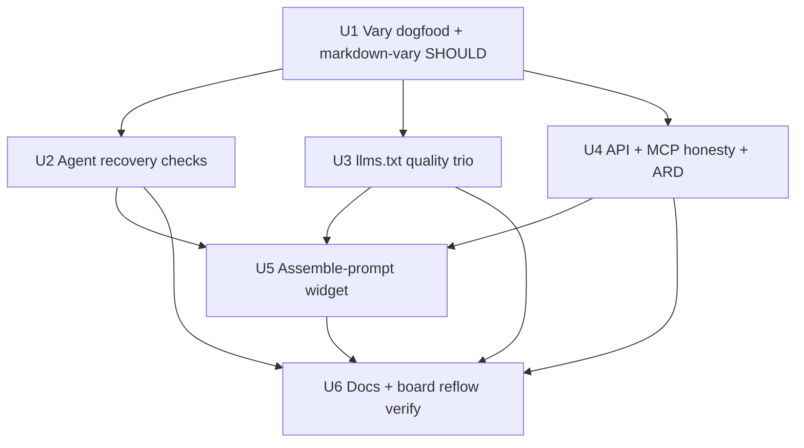
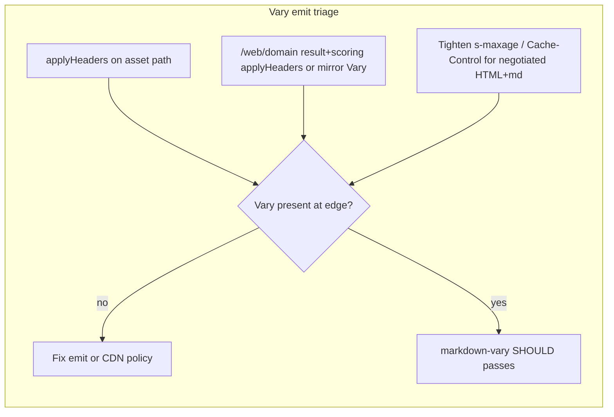

# feat: Web-audit agent-recovery checks, Vary dogfood, assemble-prompt

## Goal Capsule

- **Objective:** Close the production Vary dogfood gap, then extend the web-audit registry with agent-recovery and
  content-honesty checks that Ora/is-agentic already show matter — without SEO, commerce, or journey scoring — and give
  humans a result-page assemble-prompt control.
- **Means:** U1 fixes Vary emission / CDN interaction and retieres `markdown-vary` so absence scores as a real miss;
  subsequent units add registry + remediation + skill rows, then a client-mounted assemble-prompt widget on the result
  page (MUST default; optional SHOULD/MAY boxes).
- **Authority:** Session-settled scope from the is-agentic comparison; `src/data/web-audit/registry.yaml` +
  antecedents/handlers patterns; CONCEPTS.md web-audit vocabulary.
- **Stop when:** Production negotiated responses carry client-visible `Vary: Accept, User-Agent`; `markdown-vary` fails
  loudly when Vary is wrong; new checks and remediations ship end-to-end; assemble-prompt works on the HTML result page;
  curated board reflows after registry fingerprint change. No SEO/brand, payments, or live-journey work.

## Product Contract

### Summary

Ship one plan: (U1) fix Vary dogfood and make `markdown-vary` fail loudly, then add agent-friendly 404,
content-without-JS softened when a twin is discoverable via `llms.txt`, agent-UA reachability, three `llms.txt` quality
checks, API JSON errors + rate-limit headers (API-gated), MCP resources when advertised, optional ARD catalog, and an
assemble-prompt widget on `/web/<domain>`.

### Problem Frame

is-agentic/Ora score agent readiness with recovery and honesty checks we do not run (404 recovery, SSR content floor,
live agent-UA reachability, `llms.txt` quality, API error/rate-limit hygiene, MCP capability honesty, ARD). Our surface
already covers protocol/discovery depth they skim. Separately, production `anc.dev` negotiates markdown but responses
observed under Cloudflare cache HIT omit `Vary`, and `markdown-vary` is MAY → `optional-absent` so the miss never shows
as a failure on the public card.

### Requirements

- R1. Negotiated HTML and markdown responses expose client-visible `Vary: Accept, User-Agent` on the homepage asset path
  and on `/web/<domain>` result/scoring pages. Cross-variant edge caching is fixed so Vary reaches clients (typically by
  stopping long `s-maxage` reuse of negotiated variants). A cache-key-only fix that leaves Vary absent does not satisfy
  R2 — `markdown-vary` asserts the header.
- R2. Triage and fix why `markdown-vary` does not fail loudly on our public card: retier to SHOULD so a missing/wrong
  Vary is `absent`/`broken` in the score (not `n_a` / `optional-absent`), plus characterization tests for the emission
  path and the check.
- R3. Add an agent-friendly 404 check family: probe a nonsense path under the audited origin.
  - Baseline (REQUIRED/SHOULD as tiered in registry): response MUST be real HTTP 404 or 410 (soft-200 SPA shell =
    broken). Sites that already return correct status pass this row.
  - Full-credit sibling (SHOULD): when Accept markdown (or the negotiated twin path) is used, the 404 body is short
    markdown that includes **at least one** agent-useful recovery link (sitemap, `llms.txt`, docs index, or equivalent
    absolute/same-origin href). Zero links = miss. Remediation may recommend sitemap + `llms.txt` as the strong pattern
    and keep the curl status verify (`curl … -w "%{http_code}"` → `404`).
  - Dogfood (anc.dev itself, not the check bar): ship a 404 markdown body that links **both** sitemap and `llms.txt` as
    **fully resolved absolute URLs** for the deploy env (staging vs production), not root-relative paths. Reuse existing
    absolutify patterns: build emit via `resolveBaseUrl` / `absolutifyMarkdownLinks` in `src/build/util.mjs`
    (`PUBLIC_BASE_URL`); Worker-rendered 404s via `new URL(request.url).origin` (same posture as
    `rewriteMcpDescriptorUrls` / audit-web result `origin`).
- R4. Add a content-without-JS / SSR content floor check (H1 + minimum text in raw HTML). When root HTML fails the floor
  but a digital twin is discoverable via a passing `llms.txt` that links resolvable same-origin content, treat the floor
  check as `n_a` (not a free pass).
- R5. Add agent-UA reachability: `GET /` with a fixed user-fetcher UA and `Accept: */*` expects 2xx and not an obvious
  challenge interstitial. Distinct from `markdown-agent-ua` (Content-Type). Tier SHOULD.
- R6. Split `llms.txt` quality into three registry checks / three score rows: format, links resolve (bounded),
  when-to-use section present. Keep existing `llms-txt` presence check. Quality rows gate on `root-llms-txt`.
- R13. Dogfood MCP connect crumb: put an actionable “connect now” block in anc.dev’s `llms.txt` Programmatic access
  section (endpoint, no auth, one initialize/client-add line) and mirror a one-line pointer in
  `initialize.instructions`, with full recipes remaining STAR in `mcp-skill.md` — so agents need not fetch the skill to
  take the first step.
- R7. When `api-surface` applies, add JSON error-response and rate-limit header checks (safe probe strategy; no
  authenticated mutating routes).
- R8. When `initialize` advertises `capabilities.resources`, require `resources/list` to return at least one resource;
  otherwise `n_a`.
- R9. Add optional ARD check for `/.well-known/ai-catalog.json` (MAY; light shape assert).
- R10. Every new check ships `remediation.yaml` 1:1, `/web-audit/skill/<id>` (+ `.md`), and appears on fresh + enriched
  cached scorecards like existing checks.
- R11. Result-page assemble-prompt widget (HTML/JS only): default includes MUST failures (`broken`∪`absent`); separate
  checkboxes to include SHOULD and MAY; empty MUST set shows empty state (does not auto-pull SHOULD). Markdown twin
  stays per-check fenced prompts — no batch section required. No new MCP assemble tool.
- R12. Registry change rotates the board fingerprint so curated seeds reflow; no ghost rows for missing check ids on
  stale cards.

### Key Decisions

- KD1. Thin HTML is acceptable when a digital twin is exposed via `llms.txt` (discoverable, no guessing). Softening =
  `n_a`, not pass credit. (session-settled: user-directed — chosen over scoring thin HTML regardless of twin) Governs
  R4.
- KD2. `llms.txt` quality is three checks / three score rows. (session-settled: user-directed — chosen over one
  multi-assert row) Governs R6.
- KD3. Assemble-prompt defaults to MUST only; separate boxes for SHOULD and MAY. (session-settled: user-directed —
  chosen over MUST+SHOULD default or a single “include recommended” toggle) Governs R11.
- KD4. One plan with U1 = Vary dogfood first. (session-settled: user-directed — chosen over shipping Vary as a separate
  ahead-of-plan PR) Governs R1–R2.
- KD5. Soft-404 is not agent-friendly: require real 404/410 for the baseline row. Full-credit SHOULD sibling requires a
  markdown recovery body with **≥1** agent-useful link (session-settled: user-directed — check bar is at least one link,
  not both). anc.dev dogfood ships **both** sitemap and `llms.txt` as env-absolute URLs via existing `resolveBaseUrl` /
  request-origin absolutify (implementation preference, above the bar). Governs R3.

### Scope Boundaries

**In scope:** R1–R13; registry/handlers/antecedents/remediation/skills; result-page widget; Worker header/`applyHeaders`
paths; board fingerprint reflow; `content/web-audit.md` methodology copy updates for new categories/checks; anc.dev MCP
connect crumb in `llms.txt` + `initialize.instructions`.

**Out of scope (non-goals):** Brand/search SEO, Wikipedia, trust-page word counts, onboarding friction / free-tier /
sandbox business checks, commerce/payments (x402/ACP/UCP/AP2), live agent journeys, a11y-tree suite,
OpenAPI-as-Essential for every site type, new MCP multi-prompt assemble tool, syncing `~/.claude/skills/agent-web-audit`
(follow-up).

**Deferred to follow-up:** Unseeded public rows mid-reflow UX banner; agent-skills local script sync; optional MCP
`assembled_prompts` field if agents prove they will not compose.

### Success Criteria

- Fresh audit of a twin-negotiating origin with missing Vary shows `markdown-vary` as a SHOULD miss (not N/A).
- Production anc.dev (after deploy + cache purge / reflow) shows client-visible `Vary` on negotiated HTML and markdown
  (cache policy adjusted so HIT cannot omit it).
- New checks appear on `audit_website`, `get_website_audit` (enriched), `/web/<domain>` HTML + `.md`, and skill pages.
- Assemble-prompt copies MUST failures by default; enabling SHOULD/MAY includes those tiers; no-JS / `.md` twin still
  usable without the widget.
- Curated board scores update after fingerprint-driven rescore.
- anc.dev `llms.txt` + `initialize.instructions` carry an MCP connect crumb; `mcp-skill.md` remains the full-recipe
  STAR.

### Assumptions

- Softening for R4 gates on existing `llms-txt` pass plus at least one resolvable content link in that body for v1
  (quality checks are additive, not a circular antecedent).
- Agent-UA reachability uses a user-fetcher UA (e.g. ChatGPT-User), not training crawlers; Worker egress false positives
  are accepted as SHOULD with clear evidence.
- API probes derive a safe URL from retained OpenAPI body (after `retain_body` on `openapi`) or a documented error-path
  fallback; algorithm is specified in U4.
- ARD assert is light (JSON 200 + catalog-shaped keys), not full ARD conformance.
- Schema stays `0.2`; results are open-ended by id.
- Flow-analysis defaults Q1–Q15 in research hold unless contradicted during implementation.

## Planning Contract

### Key Technical Decisions

- KTD1. Retier `markdown-vary` from optional (MAY) to recommended (SHOULD) so missing Vary scores as `absent`/`broken`
  instead of `optional-absent` N/A. (session-settled intent: fail loudly — chosen over leaving MAY and treating N/A as
  the signal)
- KTD2. U1 investigates: (a) asset `/` already runs `applyHeaders` (Vary intended) but production HIT responses omit
  Vary under long `s-maxage` — fix so Vary reaches clients; (b) `/web/<domain>` result and `/web/scoring*` skip
  `applyHeaders` today (leaderboard `/web` already applies them) — call `applyHeaders` or mirror Vary+Link+CSP; (c) do
  not treat a cache-key-only CDN fix without client-visible Vary as satisfying R2. Prefer fixing emit/cache policy over
  weakening the check.
- KTD3. New checks follow the existing STAR chain: `registry.yaml` → `remediation.yaml` → antecedents/handlers → build
  13/15 → tests. Keyword derived from tier only.
- KTD4. No MCP assemble tool; agents compose from per-check `remediation.prompt` / `get_web_remediation`. Assemble UI is
  human-only on Worker HTML (client-mounted; no dead controls without JS).
- KTD5. Content-without-JS softening uses handler-owned `n_a` when twin discoverable via resolvable `llms.txt` links
  (KD1), not a new soft-pass status and not a fresh-fetch AntecedentToken.
- KTD6. MCP resources check needs a new `resources-list` (or equivalent) MCP handler op plus an antecedent that reads
  wave-1 initialize `capabilities.resources`.
- KTD7. Board: rely on existing registry fingerprint reflow for curated seeds; do not invent ghost rows for missing
  check ids on stale scorecards.

### High-Level Technical Design

### Sequencing

U1 first (blocks trustworthy public-card narrative). U2–U4 can proceed in parallel after U1 lands in the branch. U5
after rows exist. U6 last (docs + reflow verification).

## Implementation Units

### U1. Vary dogfood + markdown-vary fail loudly

**Goal:** Fix Vary emission / CDN interaction and make `markdown-vary` fail loudly when Vary is missing or wrong.

**Requirements:** R1, R2 — cites KTD1, KTD2, KD4

**Dependencies:** none

**Files:**
- `src/worker/headers.ts`
- `src/worker/index.ts`
- `src/worker/audit-web/route.ts` (and any result/scoring header constants)
- `src/data/web-audit/registry.yaml` (`markdown-vary` tier)
- `src/data/web-audit/remediation.yaml` (tier-facing copy if needed)
- `tests/worker.test.ts`
- `tests/web-audit-routes.test.ts`
- `tests/web-audit-markdown-rewards.test.ts`

**Approach:**
1. Characterize production: asset `/` already goes through `applyHeaders` after ASSETS fetch, yet HIT responses omit
   `Vary` under `s-maxage=86400` — prove strip/ignore vs Worker miss.
2. On `/web/<domain>` and `/web/scoring*`, call `applyHeaders` or mirror Vary+Link+CSP (leaderboard `/web` already uses
   `applyHeaders`).
3. Make Worker-emitted Vary reach clients by stopping long edge reuse of negotiated variants (e.g. tighten `SHORT_CACHE`
   / `s-maxage` for HTML+markdown); verify curl HIT/MISS still carries Vary. A cache-key-only fix without visible Vary
   does not satisfy R2.
4. Retier `markdown-vary` to recommended (SHOULD); update tests that expected `optional-absent`.
5. Curl/header assertions + unit tests; browser-verify only if CSS touched.

**Patterns to follow:** `applyHeaders` in `headers.ts`; markdown-rewards plan
`docs/plans/2026-08-03-001-feat-web-audit-md-agent-rewards-plan.md`; Accept q-value parsing solution doc.

**Test scenarios:**
- Asset HTML and markdown responses include `Vary` matching Accept and User-Agent (unit or wrangler-local).
- `/web/<domain>` HTML and markdown responses include the same Vary policy after the fix.
- `markdown-vary` with missing Vary → `absent` (not `n_a` / `optional-absent`).
- `markdown-vary` with `Vary: Accept-Encoding, User-Agent` only → still miss (negative lookahead regression).
- `markdown-vary` with `Vary: Accept, User-Agent` → pass when twin antecedent holds.

**Execution note:** Prove the CDN/header failure with a characterization test or documented curl fixture before changing
Cache-Control globally.

---

### U2. Agent recovery checks (404, content-without-JS, agent-UA)

**Goal:** Add the three agent-recovery / honesty probes with antecedents and remediations.

**Requirements:** R3, R4, R5, R10 — cites KD1, KD5, KTD3, KTD5

**Dependencies:** U1

**Files:**
- `src/data/web-audit/registry.yaml`
- `src/data/web-audit/remediation.yaml`
- `src/worker/audit-web/antecedents/` (new tokens as needed)
- `src/worker/audit-web/handlers/` (http / new handler if required)
- `src/worker/audit-web/antecedents/waves.ts` (if wave-1 deps)
- `src/build/13-web-audit-registry.mjs` (token lists)
- `src/build/15-web-audit-skills.mjs`
- `tests/web-audit-handlers.test.ts`
- `tests/web-audit-antecedents-content.test.ts`
- `tests/web-audit-antecedents-engine.test.ts`
- `tests/web-audit-skills.test.ts` (or build coverage)

**Approach:**
1. Agent-friendly 404 family: nonsense path under origin.
   - Status row: expect 404/410; soft-200 = broken (anc.dev and similar already pass).
   - Markdown recovery sibling (SHOULD): same path with Accept markdown; body is markdown with **≥1** recovery href
     (sitemap / llms.txt / docs index / equivalent). Remediation recommends sitemap + llms.txt; skill text includes the
     curl status verify.
   - anc.dev dogfood in this unit (or U6 if preferred): implement 404 markdown twin/body linking **both** sitemap and
     `llms.txt` as fully resolved absolute URLs for the deploy env — build path uses `resolveBaseUrl` /
     `absolutifyMarkdownLinks` (`src/build/util.mjs`, `PUBLIC_BASE_URL`); Worker path uses `new
     URL(request.url).origin`. Do not hardcode `https://anc.dev` in new emit code if an existing env/origin helper
     already covers the surface.
2. Content-without-JS: extend `ExpectBlock`/`assertHttp` with a min body-length assert (or a small dedicated handler)
   plus H1 regex on `/` HTML. Softening is **handler-owned** `n_a` after bounded SSRF-safe same-origin probes of links
   from retained `llms-txt` body when that check passed (KD1/KTD5) — antecedents must not fresh-fetch. Keep registry
   antecedent as `html-root` (or similar); do not invent a resolvable-twin AntecedentToken.
3. Agent-UA reachability: fixed user-fetcher UA, 2xx, cheap interstitial heuristic; SHOULD; not Content-Type markdown.

**Patterns to follow:** `http` handler + `assert.ts`; `markdown-twin` / `html-root` antecedents; fairness scoring
solution.

**Test scenarios:**
- Soft-200 SPA shell → broken on 404 status row.
- Real 404 with empty/HTML-only body → status row pass; markdown-recovery sibling miss.
- Real 404 markdown body with **one** recovery link (e.g. only `llms.txt`) → sibling pass (meets check bar).
- Real 404 markdown body with zero links → sibling miss.
- anc.dev dogfood: 404 markdown includes absolute env-based sitemap + llms.txt URLs (not `/sitemap.xml` / `/llms.txt`
  root-relative alone); staging build/origin must not emit production host.
- Thin HTML + llms.txt with dead links → content-without-JS still applies (no soften).
- Thin HTML + llms.txt with live content link → content-without-JS `n_a`.
- Agent UA 403/challenge → SHOULD miss with evidence naming UA.
- Agent UA 200 → pass.

---

### U3. llms.txt quality trio

**Goal:** Three SHOULD/MAY quality checks gated on `root-llms-txt`, keeping presence `llms-txt` intact; shape the
when-to-use bar so anc.dev’s own index can carry MCP “when to use / connect” guidance.

**Requirements:** R6, R10, R13 (when-to-use bar informs dogfood copy) — cites KD2, KTD3

**Dependencies:** U1

**Files:**
- `src/data/web-audit/registry.yaml`
- `src/data/web-audit/remediation.yaml`
- `src/worker/audit-web/handlers/` (extend http and/or scoped-llms-style)
- `src/build/13-web-audit-registry.mjs`
- `src/build/15-web-audit-skills.mjs`
- `tests/web-audit-scoped-llms.test.ts` (or new quality test)
- `tests/web-audit-handlers.test.ts`
- `tests/web-audit-skills.test.ts`

**Approach:**
1. Format: structure beyond today’s weak presence regex (H1, summary, link index — deterministic).
2. Links resolve: bounded follow of hrefs from retained `llms.txt` body (SSRF-safe, budgeted).
3. When-to-use: heading/section heuristic for when-to-use / when to use this guidance — no LLM grading. Heuristic should
   accept a short “when to use the MCP / programmatic access” style section so anc.dev’s crumb + when-to-use dogfood
   (U6) can pass the new check without inventing a second doc surface.

**Patterns to follow:** `llms-txt` retain_body; `scoped-llms` multi-fetch budget; SSRF guard.

**Test scenarios:**
- Presence passes, format fails → two distinct rows.
- Format passes, broken links → links-resolve miss with evidence.
- When-to-use section present vs absent.
- Antecedent unmet when root llms.txt absent → all three `n_a`.

---

### U4. API hygiene, MCP resources honesty, ARD

**Goal:** API-gated JSON error + rate-limit checks; MCP resources when advertised; optional ARD catalog.

**Requirements:** R7, R8, R9, R10 — cites KTD3, KTD6

**Dependencies:** U1

**Files:**
- `src/data/web-audit/registry.yaml`
- `src/data/web-audit/remediation.yaml`
- `src/worker/audit-web/handlers/mcp.ts`
- `src/worker/audit-web/antecedents/mcp.ts` / `api.ts`
- `src/worker/audit-web/antecedents/waves.ts`
- `src/build/13-web-audit-registry.mjs`
- `src/build/15-web-audit-skills.mjs`
- `tests/web-audit-antecedents-api.test.ts`
- `tests/web-audit-antecedents-mcp.test.ts`
- `tests/web-audit-handlers.test.ts`
- `tests/web-audit-skills.test.ts`

**Approach:**
1. JSON errors + rate-limit headers: `site_types`/`antecedent: api-surface`. Add `retain_body: true` on wave-1
   `openapi`; derive one non-mutating probe URL from retained OpenAPI (documented 4xx example / first safe GET) with a
   fixed well-known error-path fallback when the body is unusable.
2. MCP resources: new op; antecedent requires `capabilities.resources`; empty list or transport fail → broken.
3. ARD: MAY http probe `/.well-known/ai-catalog.json` with light body shape.

**Patterns to follow:** `openapi` / `api-catalog`; `mcp-capabilities` / `mcp-tools-list`; `api-catalog` optional shape.

**Test scenarios:**
- No api-surface → JSON/rate-limit `n_a`.
- API present, HTML error body → JSON-errors miss.
- API present, rate-limit headers present → pass.
- capabilities omit resources → resources check `n_a`.
- capabilities.resources set, empty list → broken.
- Missing ai-catalog → MAY `optional-absent` / n_a per finalizeOptional.

---

### U5. Assemble-prompt result-page widget

**Goal:** Human HTML widget that assembles fix prompts from failed rows by tier.

**Requirements:** R11 — cites KD3, KTD4

**Dependencies:** U2, U3, U4 (rows exist); can stub against existing MUST rows earlier if sequenced carefully, but
product-complete after new checks land

**Files:**
- `src/worker/audit-web/summary-render.ts`
- `src/client/` (clipboard / new small module)
- `tests/web-audit-scorecard-format.test.ts`
- `tests/content-no-form-widgets.test.ts` (ensure still green — no controls in content md)

**Approach:**
1. Emit tier/status/prompt carriers on fixable rows in `summary-render.ts` (`data-keyword`, `data-status`,
   `data-copy-text`); mount the assemble UI **client-side** (extend `clipboard.ts` or a new `src/client/` module) so
   no-JS HTML has no dead checkboxes/buttons. Not in `content/*.md`.
2. Default selection: `keyword === must` and status in `broken|absent`.
3. Checkboxes (JS): include SHOULD; include MAY (independent).
4. Copy uses existing prompt assembly strings; preserve SVG-safe copy flash.
5. Markdown twin unchanged (per-check fences only).

**Patterns to follow:** `data-copy-text` / `clipboard.ts`; content-md-twin-serves-widgets-verbatim; flash-copied SVG bug
learning.

**Test scenarios:**
- Default assembly equals concatenation of MUST failure prompts in display order.
- Enabling SHOULD adds SHOULD failures; MAY likewise.
- No MUST failures → empty state / disabled copy (does not silently include SHOULD).
- Pass / n_a rows never included.
- Content markdown sources still contain no form/button widgets.

---

### U6. Docs, methodology copy, board reflow verify

**Goal:** Update human/agent methodology copy, ship the MCP connect crumb dogfood, and verify curated board reflow after
registry fingerprint change.

**Requirements:** R12; R13; content accuracy for R3–R9; R11 staging/browser verify of assemble-prompt (light+dark) after
U5

**Dependencies:** U2, U3, U4, U5

**Files:**
- `content/web-audit.md`
- `src/build/09-llms-emit.mjs` / `src/build/llms.mjs` (Programmatic access crumb)
- `src/worker/mcp/instructions.ts` (one-line connect pointer + any new check-family mention)
- `content/mcp-skill.md` (only if a cross-link needs tightening — do not duplicate the crumb as a second tutorial)
- `docs/runbooks/web-audit-operations.md` (if rescore/fingerprint steps need a note)
- `tests/worker-mcp.test.ts` and/or llms emit / byte-equivalence tests as needed
- `tests/web-audit-rescore-workflow.test.ts` / fingerprint tests as needed
- `CONCEPTS.md` (only if a new glossary term is introduced — e.g. assemble-prompt)

**Approach:**
1. Document new check families in web-audit methodology voice (RFC, not blog).
2. MCP connect crumb (R13): in emitted `llms.txt` Programmatic access, add 3–5 actionable lines — `https://anc.dev/mcp`,
   no auth, one client-add or `initialize` curl — then “full recipes: `/mcp-skill.md`”. Mirror a single connect sentence
   in `initialize.instructions`. Do not fork a second tutorial; `mcp-skill.md` stays STAR for recipes.
3. Align anc.dev’s when-to-use / Programmatic prose with U3’s when-to-use heuristic so the dogfood index passes the new
   quality row.
4. Confirm registry fingerprint change forces curated re-audit eligibility.
5. Note stale share URLs can lag until re-audit (no ghost rows).

**Test scenarios:**
- Fingerprint change marks curated domains for rescore (existing workflow test extended if needed).
- `content/web-audit.md` mentions the new families without embedding widgets.
- Emitted `llms.txt` contains the MCP endpoint + connect crumb and still links `mcp-skill.md`.
- `initialize.instructions` mentions the connect path / docs URL without dropping existing rate-limit / tool summary.
- Test expectation for pure copy: build/content tests that already snapshot methodology stay green.

**Execution note:** After merge to staging, browser-verify assemble-prompt widget light+dark; curl-verify Vary on anc
staging/prod post-deploy; curl `llms.txt` for the MCP crumb.

## Verification Contract

- Local: `bun run build` then `bun test` (never reverse — `dist/` must match branch).
- Targeted: `tests/worker.test.ts`, `tests/web-audit-markdown-rewards.test.ts`, `tests/web-audit-routes.test.ts`,
  handler/antecedent tests for new checks, `tests/web-audit-scorecard-format.test.ts`,
  `tests/content-no-form-widgets.test.ts`, skills/build tests.
- Staging/prod: curl `Vary` on `/` HTML + markdown and `/web/<domain>`; confirm `markdown-vary` on a fresh anc.dev
  audit; exercise assemble-prompt boxes.
- MCP: `audit_website` / `get_website_audit` / `get_web_remediation` for one new check id each family.
- Visual: assemble-prompt widget only (browser light+dark) when CSS/layout touched.

## Definition of Done

- All units U1–U6 complete with enumerated tests green.
- R1–R13 satisfied; non-goals untouched.
- Session-settled KD1–KD4 and KTD1 honored.
- No interactive widgets in `content/*.md`.
- Curated board reflows after registry change; remediations 1:1 with new ids.
- Dogfood: anc.dev negotiated responses carry client-visible `Vary` under cache HIT/MISS, and `markdown-vary` is a real
  SHOULD signal.

## Appendix

### Research notes

- is-agentic is a Vercel shell over Ora (`GET https://ora.ai/api/checks` — 124 checks). Landscape already captured in
  session; no additional external research run for this plan.
- Production observation (2026-08-25): `https://anc.dev/` HTML has Link/CSP from `applyHeaders` but no `Vary`,
  `cf-cache-status: HIT`, `s-maxage=86400`. Markdown Accept response likewise lacks Vary/Link.
- `markdown-vary` today: `tier: optional` → MAY → `finalizeOptional` → `optional-absent` N/A — explains “not failing
  loudly.”
- Institutional learnings to read before implement:
  `docs/solutions/conventions/content-md-twin-serves-widgets-verbatim.md`,
  `docs/solutions/logic-errors/accept-header-q-value-parsing-content-negotiation-2026-04-14.md`,
  `docs/solutions/design-patterns/derive-cached-record-display-metadata-at-read-time.md`,
  `docs/solutions/integration-issues/web-audit-display-only-registry-change-skips-board-reflow.md`,
  `docs/solutions/design-patterns/web-audit-fairness-scoring-model.md`.

### Product Contract preservation

Product Contract authored in this bootstrap (`product_contract_source: ce-plan-bootstrap`); no separate brainstorm
enrichment. Session-settled product decisions recorded as KD1–KD4 with Governs links.
