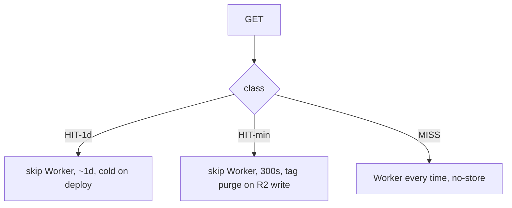
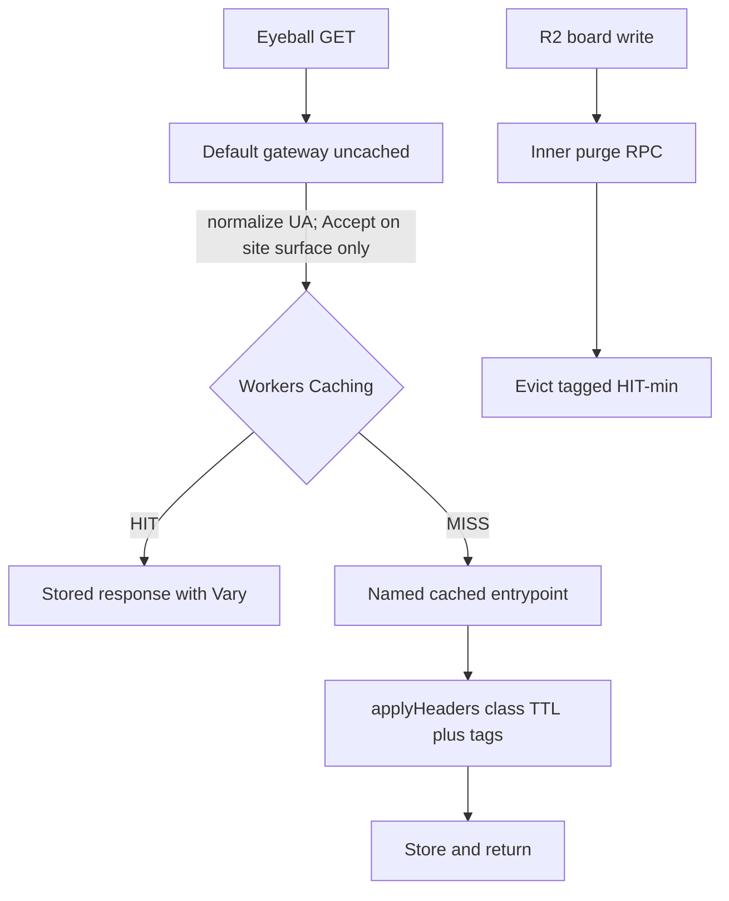
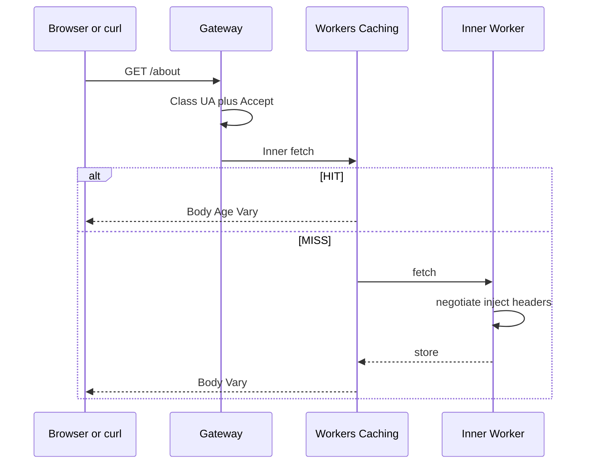

# Restore edge HIT on negotiated HTML and markdown - Plan

> **Implementation status (2026-08-26): SHIPPED to `dev` via PR #270 (`f150f83`).** U1-U6 landed. Staging skip-Worker
> HIT (`Cf-Cache-Status: HIT` plus `Age` plus `Vary: Accept, User-Agent`) passed twice after the #270 deploy. PR #271
> (`92a0d24`) retargeted the HIT-min vs HIT-1d canary onto browser `Cache-Control`, because a skip-Worker HIT does not
> replay `Cloudflare-CDN-Cache-Control`. Not yet on `main` / `anc.dev`.
>
> **Units shipped (commits on `feat/edge-hit-restore` before squash):**
>
> - **U1** (`de8fbc2`) — wrangler `^4.124.0`; `cache.enabled` plus `exports` map (`default` uncached, `Cached` cached,
>   `ContainerProxy` opted out); `cross_version_cache` unset; types regen.
> - **U2** (`bccfb77`) — `classifyGatewayRequest`; uncached default loops into `ctx.exports.Cached.fetch`.
> - **U3** (`cb42233`) — `/` and `/index.md` inject CLI table plus R2 web pane; form-silence.
> - **U4** (`970a8b5`) — HIT-1d / HIT-min / MISS in `applyHeaders`; `DESIGN.md` §3.4 P4.
> - **U5** (`72f712a`) — `Cached.purgeHitMinTags` RPC; coalesced tag purge after successful R2 writes.
> - **U6** (`8beed46`) — opt-in `tests/e2e/edge-hit.e2e.ts`; `markdown-vary` stays on `GET /`.
> - **Simplify** (`44724fc`) — shared HIT-min tag constructors; single homepage inject.
> - **Review follow-up** (`3582d87`) — Vary on GET `/mcp` JSON 301 and live-score 200s; curl GET `/mcp` markdown class;
>   strip homepage ETag/Last-Modified; `status >= 400` MISS; `/api/score` CDN `no-store` plus `Vary: Accept`.

## Goal Capsule

- **Objective:** First-view and agent TTFB on bake-at-build pages get a skip-Worker edge HIT. Live web-board URLs still
  refresh within minutes of an aggregate rewrite, a per-domain audit rewrite (including unseeded writes), or a
  `public_listing` patch. Curl-vs-browser markdown negotiation on extensionless URLs still works. A cache HIT on a
  negotiated URL still shows `Vary: Accept, User-Agent`.
- **Means:** Uncached gateway plus cached named entrypoint, three Cache-Control classes, tag purge on R2 writes (KTD1,
  KTD3, KTD7).
- **Authority:** Session-settled scope in `docs/brainstorms/2026-08-25-edge-hit-restore.md` and the accepted canvas
  `edge-hit-miss-matrix`. Staging canaries (2026-08-25) proved Workers Caching HIT keeps `Vary` and that tag purge is
  the HIT-min evict.
- **Stop:** A negotiated HIT that omits `Vary` or only has `Accept-Encoding` plus `User-Agent` does not ship. Wrangler
  that silently ignores `cache` does not ship. Homepage markdown HIT before board inject does not ship.
- **Open blockers:** None.
- **Execution profile:** Characterization on staging for skip-Worker HIT. Local `wrangler dev` cannot prove it.
- **Tail:** Abandoned canary routes (`/_canary/purge`, `X-Worker-Ran`) stay out of the diff.

---

## Product Contract

### Summary

Restore skip-Worker edge HIT on negotiated HTML and markdown without repeating the 2026-08-25 production bug (a HIT that
omitted `Vary`). Zone Cache Rules are not the lever. Workers Caching is. Live-board URLs share a 300-second edge HIT and
purge by tag on aggregate rewrite, per-domain audit rewrite (including unseeded writes), and `public_listing` patches.
Bake-at-build pages long-HIT and go cold on deploy. This plan covers the full brainstorm: format-class negotiated HIT,
path-keyed `.md` HIT, and homepage markdown boards.

### Problem Frame

After #265 / #266, negotiated HTML and markdown send `Cloudflare-CDN-Cache-Control: no-store` so clients see `Vary:
Accept, User-Agent`. That made `markdown-vary` a real SHOULD pass on `anc.dev`. Post-266 `cf-cache-status: HIT` on asset
paths is Static Assets: the Worker still runs, stamps `Vary`, and does not skip CPU or homepage R2 inject. Bake-at-build
pages (`/scorecards`, `/about`, principles) pay that cost on every request even though their bodies only change on
deploy. Live web-board URLs (`/`, `/web`, `/web/<domain>`) must not freeze behind a day-long HIT.

A zone Cache Rule on `/about` (created and deleted the same session) did not skip this Worker: Custom Domain plus
`run_worker_first` runs the Worker before zone cache. Workers Caching sits in front of the Worker and honors
`Cache-Control` and `Vary`. Staging proved a HIT there still shows `Vary` and does not cross-serve HTML vs markdown.

### Key Decisions

- KD1. Design against post-#266 production. (session-settled: user-directed — chosen over designing against the pre-Vary
  Worker.) Governs R11.
- KD2. Explicit `.md` is one representation except homepage and `/web` twins that carry live boards. (session-settled:
  user-directed — chosen over keeping `Vary` on every markdown response.) Governs R2.
- KD3. This unit includes both path-keyed `.md` HIT and negotiated extensionless HIT. (session-settled: user-directed —
  chosen over splitting UA-class work to a later unit.) Governs R1, R2, R8.
- KD4. Format-class edge cache: tiny agent-vs-browser class plus `Accept`; HIT must still show `Vary`. (session-settled:
  user-directed — chosen over Accept-only and a Worker-owned second cache.) Governs R1, R8.
- KD5. Homepage HTML and all homepage markdown include CLI + web board slices, share HIT-min, and purge together. No
  ESI. (session-settled: user-directed — chosen over HTML live / markdown TTL and over keeping `no-store` until purge
  was proven.) Governs R3, R6.
- KD6. CLI bake-at-build may long-HIT; web R2 surfaces share the homepage HIT-min class. (session-settled:
  user-directed.) Governs R3, R4.
- KD7. Do not move `markdown-vary` off `GET /`. (session-settled: user-directed.) Governs R7.
- KD8. HIT-min TTL is `max-age=300`. (session-settled: user-directed — chosen over 60 seconds.) Governs R3.
- KD9. Workers Caching is the skip-Worker cache. Zone Cache Rules are not. (session-settled: user-directed — chosen
  after a no-op zone canary and a staging Workers Caching canary that kept `Vary`.) Governs R10.

### Requirements

**Negotiation and Vary**

- R1. On an extensionless URL, `Accept` and `User-Agent` still pick HTML vs markdown the way they do after #266. A
  Workers Caching HIT on that URL still shows `Vary: Accept, User-Agent` to the client. A cache-key-only fix that leaves
  `Vary` absent does not ship.
- R7. `markdown-vary` stays a SHOULD on `GET /` and continues to fail loudly when `Vary` is missing or is only
  `Accept-Encoding` plus `User-Agent`.
- R8. Negotiated HIT keys on a tiny agent-vs-browser class plus `Accept`, not the raw `User-Agent` string. The
  client-visible `Vary` stays `Accept, User-Agent`. Exact UA values and exact `Accept` values (`*/*` vs `text/html`)
  shard unless a gateway normalizes them before the cached entrypoint.

**Cache classes**

- R2. Explicit `.md` is one representation: no `Vary`, never HTML. Live twins (`/index.md`, `/web.md`,
  `/web/<domain>.md`) still have no `Vary` and follow R3 (HIT-min). Every other `.md` follows R4 (HIT-1d).
- R3. HIT-min: `/`, `/index.md`, `/web`, `/web.md`, `/web/<domain>`, `/web/<domain>.md`, `/web?view=curated`, and
  `/web?view=all`. Edge TTL is `max-age=300`. Evict with `ctx.cache.purge({ tags })` when the R2 aggregate or that
  domain's audit is rewritten, including unseeded writes and `public_listing` patches. `/web/<domain>` tags are
  `web:{domain}` only, so a live audit does not evict other domain pages. Do not evict with path prefix `/` or `/web`
  (those over-purge). Query-string objects are distinct cache keys and share the URL's tags.
- R4. HIT-1d: bake-at-build HTML/markdown (`/scorecards`, `/score/<tool>`, `/about`, `/p1`–`/p8`, `/mcp-skill`, GET
  `/mcp` as a page, and other spec/docs pages without a live board) plus path-keyed `/llms.txt` / `.json` / `.svg`. GET
  `/mcp` JSON 301 is a distinct cache object from the HTML/markdown page (KTD8), not an unvaried HIT-1d fill. About one
  day of edge freshness. A new Worker version starts with an empty cache. `cache.cross_version_cache` stays off.
  Explicit deploy purge is not required for this class.
- R5. MISS: `/web/scoring*`, `POST /mcp`, `/api/score`, `/api/audit-web` stay CDN `no-store` every request.
- R12. Every Worker 404 is MISS (`no-store`). A pre-audit `/web/<domain>` 404 must not HIT so the first successful audit
  is visible on the next GET.
- R10. The skip-Worker HIT is Workers Caching (`cache.enabled` in wrangler). Zone Cache Rules do not skip this Worker.
  Enabling `cache` requires a wrangler that honors the key (repo pin is now `^4.124.0`).

**Homepage and docs**

- R6. Homepage HTML and every homepage markdown representation (negotiated `/` and `/index.md`) include CLI + web board
  slices. They share R3. Do not ESI or split the web pane out of the HTML. Do not inject HTML row markup into the
  markdown twin. Keep the form-silence invariant (`live-score`, Turnstile, `/api/score` stay out of `index.md`).
- R9. `DESIGN.md` header contract documents the three classes (HIT-1d, HIT-min, MISS) instead of a single HTML/`.md`
  `s-maxage=86400` story.
- R11. This work lands on production that already serves post-#266 `Vary` + `no-store` on negotiated HTML/markdown.

### Actors

- A1. Browser with `Accept: text/html` and a browser `User-Agent`.
- A2. Default curl / agent (`User-Agent: curl/…`, `Accept: */*`) expecting markdown on extensionless URLs.
- A3. R2 board writer (`putAggregate`, per-domain audit write, and `public_listing` patch).
- A4. Deploy that publishes a new Worker version.

### Key Flows

- F1. **Negotiated HIT, two clients.** A1 GETs `/about` twice: first `MISS`, second skip-Worker `HIT` with `Vary:
  Accept, User-Agent` and HTML. A2 GETs `/about` twice: markdown `HIT`, not HTML, same `Vary`. **Covers R1, R8.**
- F2. **HIT-min purge.** A3 rewrites the board aggregate. Tagged HIT-min URLs (including `/web?view=curated` and
  `/web?view=all`) miss on the next GET, then HIT again. `/about.md` and other HIT-1d URLs stay. **Covers R3.**
- F3. **HIT-1d deploy.** A4 deploys a new version. Bake-at-build URLs miss until refill. HIT-min tags from the previous
  version are not served (version is in the cache key). **Covers R4, R10.**
- F4. **Scoring shell.** GET `/web/scoring*` never HIT. **Covers R5.**
- F5. **Homepage markdown.** A2 GETs `/` and `/index.md` and sees CLI + web board slices in both, HIT-min. **Covers
  R6.**
- F6. **Unseeded audit.** A3 writes an unseeded domain audit. `/web/<domain>` and `/web?view=all` miss on the next GET.
  **Covers R3.**
- F7. **Listing patch.** A3 flips `public_listing`. `/web?view=all` misses. **Covers R3.**
- F8. **404 then audit.** A2 GETs `/web/<new-domain>` (404, MISS). After A3 writes the audit, the next GET is 200
  without waiting for TTL. **Covers R12.**

### Acceptance Examples

- AE1. **When** staging or production Workers Caching is on for a negotiated URL **and** the same browser UA repeats GET
  `/about` with `Accept: text/html`, **then** the second response is `HIT` with `Age`, a frozen body, `Vary: Accept,
  User-Agent`, and HTML. Default curl against the same URL is markdown, not HTML. **Covers R1.**
- AE2. **When** a HIT omits `Vary` or only has `Accept-Encoding` plus `User-Agent`, **then** `markdown-vary` on `GET /`
  fails loudly and that build does not ship. **Covers R7.**
- AE3. **When** `ctx.cache.purge({ tags: ["web"] })` runs, **then** `/web`, `/web.md`, and `/web?view=*` miss;
  `/web/<domain>` and `/about.md` do not. **When** `tags: ["web:{domain}"]`, **then** `/web/<domain>` and its `.md` twin
  miss. **When** `pathPrefixes: ["/about"]` is used instead, `/about.md` also misses — that is why R3 forbids prefix `/`
  and `/web`. **Covers R3.**
- AE4. **When** Chrome + `Accept: text/html` has a HIT **and** Chrome + `Accept: */*` arrives, **then** that is a
  distinct variant (still HTML via the UA heuristic) until the gateway normalizes `Accept`. Safari vs Chrome HTML shards
  until the gateway normalizes UA. **Covers R8.**
- AE5. **When** A2 fetches `/about.md`, **then** the body is markdown with no `Vary` and HIT-1d. **When** A2 fetches
  `/index.md` or `/web.md`, **then** the body is markdown with no `Vary` and HIT-min. **Covers R2, R3, R4.**
- AE6. **When** a Worker 404 is stored, **then** it is `no-store` / not HIT. **When** that URL later has an audit,
  **then** the next GET is 200. **Covers R12.**
- AE7. **When** A2 fetches `/web?view=all` after a listing change, **then** the next GET misses and shows the new row
  set. **Covers R3.**

### Scope Boundaries

**In scope:** R1–R12; Workers Caching on; dropping `no-store` on the HIT classes; format-class gateway; Cache-Tag on
HIT-min; `putAggregate` / audit-write / listing-patch purge; homepage markdown board slices; `DESIGN.md` header-contract
update; wrangler bump so `cache.enabled` takes effect.

**Out of scope:** Moving `markdown-vary` off `GET /`. ESI or splitting the web board out of homepage HTML. Caching
`/web/scoring*`, `POST /mcp`, `/api/score`, `/api/audit-web`. Accept-only negotiation (bare curl would get HTML). A
Worker-owned second cache as the primary store. Zone Cache Rules as the skip-Worker layer. `cache.cross_version_cache`.
MCP cache-purge tools. Live board rows in `/llms.txt` or `/llms-full.txt`. Adding Cursor-like UAs to the markdown
allowlist.

**Deferred for later:** None from the brainstorm's how-list; those are KTDs below.

**Outside this product's identity:** Zone Cache Rules as the skip-Worker layer.

### Dependencies / Assumptions

- Production already serves post-#266 `Vary` + negotiated `no-store` (#266 merged).
- Staging `*.workers.dev` is a valid Workers Caching proof surface (Access service-token headers did not bypass the
  cache).
- Workers Caching always uses Free-tier purge limits, regardless of the `anc.dev` zone plan.
- Zone purge and `ctx.cache.purge()` do not clear each other.
- `index.md` does not currently carry live board rows; putting CLI + web slices into every homepage markdown
  representation is in scope per R6.
- Host is not in the Workers Caching key, so `anc.dev` and `www.anc.dev` already share entries. Gateway rewrites only
  `www.anc.dev` → `anc.dev` on the production Worker. Do not rewrite staging `*.workers.dev` or localhost to `anc.dev`.

### Outstanding Questions

None blocking.

### Sources / Research

- Working brainstorm: `docs/brainstorms/2026-08-25-edge-hit-restore.md`.
- Prior Vary dogfood: `docs/plans/2026-08-25-1211-feat-web-audit-agent-recovery-plan.md` (U1), PRs #265 / #266.
- Today's headers: `src/worker/headers.ts` (`NEGOTIATED_CACHE`, `CDN_NO_STORE`, `SHORT_CACHE`).
- Cloudflare: [Workers Caching](https://developers.cloudflare.com/workers/cache/),
  [configuration](https://developers.cloudflare.com/workers/cache/configuration/),
  [Vary](https://developers.cloudflare.com/workers/cache/#content-negotiation-with-vary),
  [purge](https://developers.cloudflare.com/workers/cache/purge/),
  [cache keys](https://developers.cloudflare.com/workers/cache/cache-keys/),
  [examples](https://developers.cloudflare.com/workers/cache/examples/).
- Staging canaries (2026-08-25): Workers Caching HIT on `/about` kept `Vary` (version `2e5fb46e`, rolled back to
  `f8448633`); tag vs prefix purge (version `29acd80b`, same rollback).
- Learnings: `docs/solutions/best-practices/cloudflare-workers-static-assets-custom-headers-2026-04-14.md`,
  `docs/solutions/logic-errors/accept-header-q-value-parsing-content-negotiation-2026-04-14.md`,
  `docs/solutions/logic-errors/http-header-token-regex-prefix-sibling-false-match.md`.

---

## Planning Contract

Product Contract preservation: restructured, no scope change: R3 now names `/web?view=all`; R12 carves Worker-404 MISS
out of R3 HIT-min on `/web/<domain>`; R5's always-MISS path list is unchanged. KD1–KD9 and R1–R11 meaning unchanged.

### Key Technical Decisions

- KTD1. **Uncached default gateway, cached named inner entrypoint.** (session-settled: user-directed — chosen over
  Accept-only and a Worker-owned second cache: KD4 cannot run classification on a HIT of the default export.) Default
  `fetch` always runs, then `ctx.exports.<Cached>.fetch`. Inner `cache.enabled: true`. Cache config applies to Worker
  `fetch` entrypoints, not DO/Workflow classes. Opt `ContainerProxy` out explicitly: unlisted WorkerEntrypoints inherit
  cache-on, and a HIT there would replay sandbox egress. Do not add `Sandbox` or `WebRescoreWorkflow` as `type: worker`
  unless dry-run proves the map is exclusive. Keep `scheduled()` on the uncached default. Mirror `cache`/`exports` under
  `env.staging` as an explicit block. Instantiates KD4, KD9. Cites R1, R8, R10.
- KTD2. **HIT-min tags are `home`, `web`, and `web:{domain}`.** Same tags on every variant of a URL. `home` on `/` and
  `/index.md`. `web` on `/web`, `/web.md`, and every `/web?view=*`. Only `web:{domain}` on `/web/<domain>` and its `.md`
  twin. Never tag HTML vs markdown differently. Never use path prefix `/` or `/web`. Instantiates R3.
- KTD3. **HIT-min edge vs browser TTL is split.** Edge: `Cloudflare-CDN-Cache-Control: public, max-age=300`. Browser:
  `Cache-Control: public, max-age=0, must-revalidate` so a tag purge is visible on the next navigation. Do not ship
  `Cache-Control: no-store` as the HIT-min class until staging proves Workers Caching still stores that pair; the bypass
  table names `Cache-Control: no-store` and the 2026-08-25 canary filled from a cacheable `Cache-Control`. Instantiates
  KD8, R3.
- KTD4. **HIT-1d negotiated pages use CDN `max-age=86400` without `s-maxage` on `Cache-Control`.** Path-keyed
  `/llms.txt` / `.json` keep today's `SHORT_CACHE` (`s-maxage=86400`, no `Vary`). Negotiated HIT-1d must not re-arm the
  custom-domain zone HIT that stripped `Vary`. Instantiates R4.
- KTD5. **Pin wrangler `^4.124.0` and regenerate types in the same unit as `cache.enabled`.** Per-entrypoint cache needs
  ≥ 4.107.0. 4.81 silently ignored `cache`. Leave `cross_version_cache` unset. Instantiates R10.
- KTD6. **Staging cache stays on.** Staging is the skip-Worker proof surface. Local `wrangler dev` does not simulate
  Workers Caching HIT.
- KTD7. **Purge from the cached entrypoint only, after a successful write, coalesced per invocation.** Custom RPC
  bypasses cache; gateway `ctx.cache.purge` does not touch inner entries. R2 writers (`put`, `putAggregate`,
  `writeAuditObject`, `patchStoredPublicListing`) stay env-only and return success; they do not purge. After a
  successful write, the caller RPCs purge: `putAggregate` callers accumulate `home` and `web`; `writeAuditObject`
  callers accumulate `web` and `web:{domain}`; listing-patch callers accumulate `web`. Flush at most one purge RPC per
  isolate invocation with the union of tags. Rescore: one batched RPC per rebuild cycle (not per domain and not inside
  every `writeAuditObject`). Public-listing backfill: one `web` purge per page. Do not purge when the R2 put failed. If
  Workflow types do not expose `this.ctx.exports.<Cached>`, U1 names a self service binding as the stub. Purge failure
  logs and relies on the 300s TTL. Instantiates R3.
- KTD8. **Format-class is a cache key for `detectPreference`, not a replacement for it.** Explicit `Accept` still wins.
  Empty UA, Googlebot, and unknown UAs stay the HTML class. Normalize UA-class on every GET using values
  `detectPreference` already understands (`curl/` vs empty UA). After classifying, rewrite `Accept` on the negotiated
  HTML/markdown site surface to `text/html` or `text/markdown` so inner `detectPreference` equals the gateway class. Do
  not replace `User-Agent` with a class label absent from `MARKDOWN_UA_TOKENS`. Do not smash `Accept` on GET `/mcp`. On
  GET `/mcp`, run `detectMcpGetFormat` in the gateway and forward a canonical `Accept` (`application/json`, `text/html`,
  or `text/markdown`) so the JSON 301 and the HTML/markdown page cannot share a cache object. Do not add the JSON 301 to
  the HIT-1d page class as an unvaried URL. Instantiates R1, R8.
- KTD9. **`applyHeaders` is the only place Cache-Tag and class TTL are set.** Upstream tags are discarded by the clone
  today. MISS overlay in `withNegotiatedHeaders` must also strip `Cache-Tag`. Instantiates R2, R5, R12.

### High-Level Technical Design

Workers Caching sits in front of every `fetch` entrypoint. Classification in today's default `fetch` is too late for a
HIT. The documented pattern is a cache-disabled gateway that rewrites headers, then a named inner entrypoint the cache
can skip.

Do not put class in both rewritten headers and `ctx.props` (double-partition). `cf.cacheKey` may drop tracking query
params. It does not replace `Vary`.

### Sequencing

1. Land the wrangler pin and `exports` map so `cache` is real (U1).
2. Add the gateway before dropping CDN `no-store` (U2). Cache-on-default plus drop-`no-store` restores exact-UA
   sharding.
3. Inject homepage markdown boards before `/` is HIT-min (U4 before U3 would freeze a board-less twin).
4. Split `applyHeaders` and rewrite the tests that pin `no-store` in the same change (U4).
5. Hook purge, including unseeded writes (U5).
6. Prove skip-Worker HIT and `markdown-vary` on staging `GET /` (U6).

### Implementation constraints

- Headers that HIT must replay (`Vary`, `Link`, `Cache-Tag`, TTL) are set on the MISS path in Worker code. `_headers`
  does not apply to Worker-generated responses.
- `Set-Cookie` bypasses Workers Caching. Homepage GET must stay cookie-free.
- Free-tier purge: 5 requests/minute, burst 25, 100 operations/request. Rescore must not purge per domain.
- Enabling cache bills static-asset and `ctx.exports` requests at the standard Workers request rate. Gateway-always-run
  plus inner loopback is two request charges per eyeball GET.
- Do not bump `compatibility_date` unless the pinned wrangler requires it for `cache`.

---

## Implementation Units

### U1. Wrangler pin and per-entrypoint cache map

- **Goal:** `cache.enabled` is a real schema key, types know `ctx.cache.purge` and named exports, and every
  WorkerEntrypoint that must run is opted out.
- **Requirements:** R10
- **Dependencies:** none
- **Files:** `package.json`, `bun.lock`, `wrangler.jsonc`, `src/worker-configuration.d.ts`,
  `tests/wrangler-config.test.ts`, `tests/worker-entry-exports.test.ts`
- **Approach:**
  1. Keep wrangler `^4.124.0`.
  2. Set top-level `cache.enabled: true` with `exports.default.cache.enabled: false`.
  3. Enable cache on the named site entrypoint only.
  4. Opt `ContainerProxy` out. Leave `Sandbox` and `WebRescoreWorkflow` out of `type: worker` unless dry-run requires
     them named only to prevent inherit.
  5. Leave `cross_version_cache` unset.
  6. Mirror the same map as an explicit `env.staging` block.
  7. Regenerate Worker types. If Workflow cannot call `this.ctx.exports.<Cached>`, declare a self service binding here.
- **Execution note:** Extend `tests/wrangler-config.test.ts` and `tests/worker-entry-exports.test.ts`. Dry-run does not
  catch missing named exports.
- **Patterns to follow:** `loadWranglerConfig()` / `getStagingEnv()` mirrors already in `tests/wrangler-config.test.ts`.
- **Test scenarios:**
  - Both envs pin inner cache on, default and `ContainerProxy` cache off, `cross_version_cache` unset.
  - Named site entrypoint is a function export next to `Sandbox` / `WebRescoreWorkflow`.
  - Generated types include `cache.purge` on the cached entrypoint context.
  - Dry-run with the `cache` block succeeds on both envs and does not drop the key.
- **Verification:** Those tests and dry-run green. Pin in `package.json` is `^4.124.0`.

### U2. Format-class gateway

- **Goal:** Every eyeball GET is classified before the cached entrypoint, and HIT keys on the class rather than raw
  UA/`Accept`.
- **Requirements:** R1, R8, R10. KD4, KTD1, KTD8.
- **Dependencies:** U1
- **Files:** `src/worker/index.ts`, `src/worker/accept.ts`, `tests/worker.test.ts`, `tests/worker-mcp-dispatch.test.ts`
- **Approach:**
  1. Move today's default `fetch` body to a named `WorkerEntrypoint`.
  2. Default export becomes the gateway: classify, then rewrite `Accept` to `text/html` or `text/markdown` on the site
     surface so inner `detectPreference` matches. Rewrite `www.anc.dev` → `anc.dev` on production only. Do not replace
     `User-Agent` with a class label missing from `MARKDOWN_UA_TOKENS`.
  3. POST `/mcp` and other MISS methods still reach the inner Worker; only GET/HEAD are cached by the product.
  4. On GET `/mcp`, run `detectMcpGetFormat` before the inner fetch and forward a canonical `Accept`
     (`application/json`, `text/html`, or `text/markdown`). Do not invent a second UA heuristic. Do not smash `Accept`
     into the site-surface HTML/markdown pair.
- **Execution note:** Add characterization coverage for the classifier table before changing dispatch. After the split,
  existing `worker.fetch` tests need `ctx.exports.<Cached>.fetch`.
- **Patterns to follow:** One exported classifier from `src/worker/accept.ts`. Do not copy `MARKDOWN_UA_TOKENS`.
- **Test scenarios:**
  - Covers AE4. After normalize, Chrome `text/html` and Chrome `*/*` share one HTML class.
  - Curl `*/*` is the markdown class; Chrome `text/html` is not.
  - `Accept: text/markdown` with a browser UA is markdown (explicit Accept wins).
  - Header-less `GET /` is the HTML class (today's no-UA → HTML).
  - GET `/mcp` with `Accept: application/json` still 301s to the server-card.
  - A JSON 301 HIT on GET `/mcp` is not served to a later HTML GET `/mcp`.
  - Gateway does not cache; inner is the cached target.
- **Verification:** Classifier tests green. No cache-on-default.

### U3. Homepage markdown board slices

- **Goal:** Negotiated `/` markdown and `/index.md` carry CLI + web board slices without breaking form-silence.
- **Requirements:** R6, R3. KD5.
- **Dependencies:** U2
- **Files:** `src/build/06-homepage.mjs`, `src/worker/index.ts`, `src/worker/audit-web/leaderboard-render.ts`,
  `tests/web-audit-homepage-inject.test.ts`, `tests/worker-live-score-routing.test.ts`,
  `tests/web-audit-scorecard-format.test.ts`, `tests/e2e/homepage-score.e2e.ts`
- **Approach:**
  1. Add a markdown frontpage board renderer parallel to `buildFrontpageBoardRows` (list/table shape like `/web.md`, no
     HTML `lrow`).
  2. Inject on pathname `/`, `/index.html`, and `/index.md`, including when `servedMarkdown` is true.
  3. Keep Turnstile / live-score form tokens out of `index.md`.
  4. Store post-inject bodies so a HIT cannot contain `{{WEB_BOARD_ROWS}}`.
- **Patterns to follow:** `buildWebLeaderboardMarkdown`; form-silence in `src/build/build.mjs` and
  `tests/e2e/homepage-score.e2e.ts`.
- **Test scenarios:**
  - Covers AE / F5. Curl `GET /` and `GET /index.md` both include CLI names and the same R2 web domains.
  - Markdown twin has no `lrow` HTML and no `live-score` / Turnstile / `/api/score`.
  - HTML `/` still injects the web pane and keeps the baked CLI table.
  - Cached object is post-inject (placeholder absent).
- **Verification:** Homepage markdown tests green. Form-silence e2e still passes.

### U4. Three-class headers and DESIGN.md

- **Goal:** `applyHeaders` emits HIT-1d / HIT-min / MISS, tags HIT-min, and drops CDN `no-store` only on HIT classes.
- **Requirements:** R2, R3, R4, R5, R9, R12. KTD2, KTD3, KTD4, KTD9.
- **Dependencies:** U2, U3
- **Files:** `src/worker/headers.ts`, `src/worker/index.ts`, `src/worker/audit-web/route.ts`,
  `src/worker/score/summary-render.ts`, `DESIGN.md`, `tests/worker.test.ts`, `tests/web-audit-routes.test.ts`
- **Approach:**
  1. Split today's two buckets into three classes per KTD3/KTD4.
  2. Explicit `.md` drops `Vary` except live twins still HIT-min and still no `Vary`. Classify Vary vs HIT-min from the
     request URL (or an explicit `pathKeyedMarkdown` flag). Keep `opts.pathname` as the HTML-canonical path for
     Link/twin generation only so `/web.md` is not treated as extensionless.
  3. Extensionless negotiated URLs keep `Vary: Accept, User-Agent`.
  4. Tag per KTD2. Do not tag MISS or 404. `withNegotiatedHeaders` must strip `Cache-Tag` on scoring overlays. Every
     inner 404 is R12, including `/score/live` not-found: no-store and untagged, not the live-score `s-maxage` headers.
  5. Rewrite tests that currently require `Cloudflare-CDN-Cache-Control: no-store` on HTML/markdown.
  6. Leave `/llms.txt` and `/skill.json` `SHORT_CACHE` characterization in place.
  7. Update `DESIGN.md` §3.4 P4 to the three-class contract.
- **Execution note:** Rewrite the no-store assertions in the same change as dropping `no-store`, or CI will reject the
  HIT restore.
- **Patterns to follow:** `applyHeaders` as the single write point; `withNegotiatedHeaders` overlay for scoring
  `noStore`.
- **Test scenarios:**
  - Covers AE5. `/about.md` has no `Vary` and HIT-1d CDN TTL. `/index.md` and `/web.md` have no `Vary` and HIT-min tags.
  - Negotiated `/about` HTML and markdown keep `Vary: Accept, User-Agent` and do not send CDN `no-store`.
  - `/web.md` is no-Vary HIT-min even though Link twins use the HTML-canonical `/web` path.
  - Covers AE6. Worker 404 is `no-store` and untagged, including `/score/live/<missing>`.
  - `/web/scoring*`, POST `/mcp`, `/api/score`, `/api/audit-web` stay `no-store`.
  - `/llms.txt` and `/skill.json` still have `s-maxage=86400` and no `Vary`.
  - `/web?view=all` and `/web?view=curated` carry the `web` tag.
  - `/web/<domain>` carries only `web:{domain}`, not `web`.
- **Verification:** Worker header tests green. `DESIGN.md` matches the three classes.

### U5. Tag purge on R2 writes

- **Goal:** HIT-min URLs miss after board writes, including unseeded audits and listing patches, without over-purging
  HIT-1d.
- **Requirements:** R3. KTD2, KTD7.
- **Dependencies:** U1, U2, U4
- **Files:** `src/worker/audit-web/cache.ts`, `src/worker/audit-web/aggregate.ts`,
  `src/worker/audit-web/rescore-workflow.ts`, `src/worker/audit-web/route.ts`, `src/worker/mcp/tools/web-audit.ts`,
  `tests/web-audit-cache.test.ts`, `tests/web-audit-rescore-workflow.test.ts`, `tests/web-audit-mcp-tools.test.ts`,
  `tests/web-audit-routes.test.ts`
- **Approach:**
  1. Expose purge as an RPC on the cached entrypoint (purge is scoped to the calling entrypoint).
  2. Keep R2 writers env-only; they return success and do not purge. Callers invoke the RPC after successful writes,
     coalescing tags and flushing at most one purge per invocation, with tags per KTD7.
  3. Rescore: one batched purge per rebuild cycle, not per domain and not inside every write.
  4. Never `pathPrefixes: ["/"]` or `["/web"]`.
  5. Check purge `success`; on failure log and rely on TTL.
- **Patterns to follow:** Write topology already in `putAggregate` / `writeAuditObject` / `rebuildWebAggregates`.
- **Test scenarios:**
  - Covers AE3 / F2. Aggregate rewrite purges `home` and `web`; `/about.md` is not tagged `home`.
  - Covers F6. Unseeded audit caller purges `web` and `web:{domain}` in one flush; `/web/<other-domain>` stays.
  - Covers F7 / AE7. Listing patch purges `web`.
  - Rescore cycle issues one purge with batched tags, not one call per domain.
  - Prefix `/web` is not used.
- **Verification:** Purge-matrix unit tests green. Workflow path compiles against the RPC, not `ctx.cache` on the
  Workflow.

### U6. Skip-Worker dogfood on `GET /`

- **Goal:** Staging proves HIT keeps `Vary`, `markdown-vary` still fails loudly when it does not, and homepage HIT is
  post-inject.
- **Requirements:** R1, R7, R11. KD7.
- **Dependencies:** U2, U3, U4, U5
- **Files:** `tests/e2e/agents.e2e.ts`, `tests/web-audit-markdown-rewards.test.ts`, `tests/worker.test.ts`
- **Approach:**
  1. Keep `markdown-vary` on `GET /`.
  2. Add HIT-aware coverage that can run on staging: Age / frozen inject / `Vary` token `Accept` not `Accept-Encoding`.
  3. Do not treat `/about` HIT as a substitute for the homepage check.
  4. Do not assert `Cf-Cache-Status: HIT` in `tests/e2e/agents.e2e.ts` (that file hits `wrangler dev`).
- **Execution note:** Smoke-first on staging. `wrangler dev` is not evidence of HIT.
- **Patterns to follow:** Existing `tests/e2e/agents.e2e.ts` curl `GET /` markdown + Vary; `markdown-vary` token check.
- **Test scenarios:**
  - Covers AE1. Repeat browser GET `/about` is HIT with `Vary` and HTML; curl is markdown.
  - Covers AE2. Missing `Vary` fails `markdown-vary` on `GET /`.
  - Warm HTML HIT on `/`, then curl `*/*`, returns markdown with boards and `Vary`.
  - Warm HTML HIT, then `Accept: text/markdown`, returns markdown not the HTML object.
  - After tag purge, homepage markdown URLs miss then HIT with new web rows; `/about.md` stays.
- **Verification:** E2e green. Staging curl twice shows `HIT` + `Age` + `Vary: Accept, User-Agent` on negotiated HTML
  and markdown. No leftover canary route.

---

## Verification Contract

| Gate                                                                 | When       | Proves                                                                                                         |
| -------------------------------------------------------------------- | ---------- | -------------------------------------------------------------------------------------------------------------- |
| `bun run build` then `bun test`                                      | every unit | Header classes, classifier, inject, purge matrix. Build before test: `tests/regression.test.ts` reads `dist/`. |
| `bun x wrangler deploy --dry-run` production and staging             | U1         | `cache` block accepted; containers unchanged.                                                                  |
| `bun run types`                                                      | U1         | `ctx.cache.purge` and named exports typecheck.                                                                 |
| Playwright `tests/e2e/agents.e2e.ts` and homepage-score form-silence | U3, U6     | Curl `GET /` markdown + Vary; `index.md` has no form tokens.                                                   |
| Staging Workers Caching canary                                       | U6         | Skip-Worker HIT. Not reproducible on `wrangler dev`.                                                           |

`release:validate` is not required for landing on `dev`. Production follows the usual `dev` → `release/*` → `main` path
after staging proof.

---

## Definition of Done

**Global**

- Negotiated HIT on staging shows `Vary: Accept, User-Agent` and `Age` on the second GET.
- `markdown-vary` on `GET /` still fails a Vary-less HIT.
- Homepage `/` and `/index.md` include CLI + web slices and share HIT-min purge.
- Worker 404s do not HIT.
- Wrangler is `^4.124.0`. `cross_version_cache` is off.
- No `/_canary/purge`, no zone Cache Rule, no abandoned Worker-ran stamp.
- Abandoned-attempt code is gone from the diff.

**Per unit**

- U1: wrangler-config + entry-exports tests, dry-run, types.
- U2: classifier table + no cache-on-default.
- U3: markdown boards + form-silence.
- U4: three-class header tests + `DESIGN.md`.
- U5: purge matrix including unseeded and listing patch.
- U6: staging HIT + `markdown-vary` on `GET /`.

---

## System-Wide Impact

Agents and browsers share the same URLs with a format-class cache key. POST `/mcp` stays MISS (method BYPASS). GET
`/mcp` as a page is HIT-1d. The JSON 301 is a distinct object keyed by canonical `Accept` (KTD8). Discovery JSON is
origin-aware and follows the www/staging origin rule. `llms.txt` / `llms-full.txt` stay HIT-1d catalogs with no live
boards. Homepage GET stays cookie-free (`Set-Cookie` bypasses cache). Inner Workers Logs go quiet on HIT; the gateway
still runs every request, so logs are not skip-inner proof. Skip-Worker proof is `HIT` plus `Age`. Enabling cache
reprices formerly-free asset and `ctx.exports` requests and adds a loopback hop per eyeball GET.

| Failure                                        | What freezes                              | Backstop                                      |
| ---------------------------------------------- | ----------------------------------------- | --------------------------------------------- |
| Purge RPC from the gateway                     | HIT-min URLs                              | 300s TTL                                      |
| Purge 429 (per-domain rescore)                 | HIT-min, partial                          | TTL; untagged first fill cannot be tag-purged |
| `Cache-Control: no-store` wins over CDN public | HIT classes never store                   | Worker every request                          |
| `s-maxage` on negotiated `Cache-Control`       | Vary-stripped zone HIT                    | AE2 ship gate                                 |
| Accept smash                                   | GET `/mcp` JSON 301 gone                  | KTD8                                          |
| JSON 301 fills GET `/mcp` unvaried             | MCP skill page hidden for ~1d             | KTD8 canonical Accept                         |
| Origin smash to `anc.dev`                      | staging indexable; MCP URLs point at prod | production-only www rewrite                   |
| `ContainerProxy` inherits cache-on             | sandbox egress HIT                        | U1 opt-out                                    |
| Worker 404 stored                              | first audit invisible                     | R12                                           |

---

## Risks & Dependencies

- **Vary-stripped HIT.** Dropping CDN `no-store` without the gateway, or putting `s-maxage` on negotiated
  `Cache-Control`, repeats 2026-08-25. Mitigation: KTD1 then KTD4; AE2 as ship gate.
- **Exact-UA sharding.** Cache-on-default with `Vary: User-Agent` is the canary shape. Mitigation: KTD1.
- **Homepage HIT before inject.** Agents cache a board-less twin for 300s. Mitigation: U3 before U4.
- **Purge from the gateway.** Tags are per entrypoint. Mitigation: KTD7.
- **Rescore purge flood.** Free tier is 5/min. Post-deploy `deploy.yml` already POSTs `/api/web-rescore`. Mitigation:
  one batched RPC per cycle; live writes flush at most once per invocation (KTD7); watch the first prod hook for purge
  429s.
- **Untagged first fill.** Tag purge cannot evict what was never tagged. Mitigation: tags on every HIT-min MISS in
  `applyHeaders`.
- **www vs apex.** Host is not in the cache key. Mitigation: production-only `www.anc.dev` → `anc.dev`.
- **HIT-without-Age false GO.** Today's Static Assets HIT has no `Age`. Mitigation: skip-Worker proof is HIT plus Age.
- **HIT-min `no-store` false STOP.** Browser `Cache-Control` may look like cache-off. Mitigation: KTD3; edge proof is
  CDN header plus `Cf-Cache-Status`/`Age`.
- **No kill switch.** Emergency off is `wrangler rollback` to the recorded pre-cache-on version. Do not purge after
  rollback (version is in the key; rollback is not a new version and leftover TTL on A can serve again).

---

## Alternative Approaches Considered

- **Cache on the default export.** Skips all JS including classification. Rejected: cannot implement R8.
- **Request URL rewrite only (`?ua=html`).** Still shards on raw `Vary: User-Agent` unless the header is rewritten too.
  Rejected as the primary key.
- **Zone Cache Rules.** Already a no-op on this Custom Domain Worker. Rejected (KD9).
- **`caches.default` as primary.** No skip-Worker, no collapsing. Rejected (KD4).
- **Header-only first, boards later.** Would HIT a board-less homepage markdown. Rejected (KD5, U3 before U4).

---

## Documentation / Operational Notes

- `DESIGN.md` §3.4 P4 is the header contract (R9, U4).
- `CONCEPTS.md` already defines Format-class edge cache and HIT-1d / HIT-min / MISS.
- **Launch order:** staging (`dev`) first; production only via `release/*` → `main`. Record the current production
  version-id before the cut. Confirm this release does not add a DO migration.
- **Skip-Worker discriminator:** `Cf-Cache-Status: HIT` plus `Age` plus a frozen body. `HIT` without `Age` is Static
  Assets (Worker still ran). Missing `Cf-Cache-Status` means wrangler ignored `cache`. Skip-Worker HIT does not replay
  `Cloudflare-CDN-Cache-Control`; HIT-min vs HIT-1d on the client is browser `Cache-Control` (HIT-min: `max-age=0,
  must-revalidate`; HIT-1d: `max-age=300` without `s-maxage`).
- **Staging proof (2026-08-26):** Access service-token headers (not `Authorization`). After the #270 staging deploy,
  `bun x playwright test --project=edge-hit` passed twice (negotiated `/` and `/about` HIT + Age + Vary; `/index.md`
  HIT-min; `/about.md` HIT-1d; `/web/scoring*` and never-audited `/web/<host>` 404 not HIT). Board-write miss-then-HIT
  (`/` and `/web` miss, `/about.md` stays) remains an operator check. There is no `/_canary/purge`.
- **STOP:** Vary missing or only `Accept-Encoding` plus `User-Agent`; HTML/markdown cross-serve; board-less homepage
  HIT; 404 HIT; `/_canary/purge` not 404; zone Cache Rule back.
- **Rollback:** `wrangler rollback` to the recorded version. `cache.enabled` rolls back with it. Do not purge after
  rollback. After rollback to cache-off, negotiated HTML/markdown should have no skip-Worker `Age`.
- Gradual deploy may turn caching on at the prod cut and must finish at 100%. Version is already in the cache key.

---

## Shipped vs plan

These landed in #270 and are the working contract. They are not open product questions.

- **R12** is every Worker `status >= 400`, not only 404.
- **GET `/mcp`** with a markdown-class UA and no type preference stays markdown. `detectMcpGetFormat` still defaults
  `*/*` to HTML for browsers; the gateway maps that HTML default onto the site class when UA is already markdown. JSON
  301 stays a distinct object (KTD8) and emits `Vary: Accept, User-Agent`.
- **Live-score 200s** on extensionless `/score/live/<binary>` emit `Vary: Accept, User-Agent` and keep a ~300s TTL.
  Explicit `.md` has no Vary. They do not go through HIT-1d `applyHeaders` (that would stamp CDN `max-age=86400`).
- **`/api/score` cache-hit** keeps browser `Cache-Control: public, max-age=300` and sets `Cloudflare-CDN-Cache-Control:
  no-store` plus `Vary: Accept` so Workers Caching does not store the Accept-varied body.
- **Homepage inject** deletes `ETag` and `Last-Modified` on the rewritten body so HIT-min `must-revalidate` cannot 304
  the bake-at-build asset and skip board inject.
- **Purge** is `Cached.purgeHitMinTags` RPC only. There is no gateway `ctx.cache.purge` fallback and no self service
  binding. Workflow calls `invokeCachedPurge(this.ctx)`. Purge failure logs and relies on the 300s HIT-min TTL (KTD7).

## Deferred to Follow-Up Work

- Production cut: `release/*` → `main`. Record the current production version-id before enabling cache on `anc.dev`.
- Operator check: after a board write, `/` and `/web` miss then re-HIT; `/about.md` stays.
- R2 get/list I/O failure still HIT-min an empty board for up to 300s (`getAggregate` returns null).
- Missing `ctx.exports.Cached` silently loopbacks in-process (correct bodies, no skip-Worker HIT). Detector is the
  staging edge-hit canary.
- Capture a solutions doc for the gateway + tag vocabulary (`/ce-compound`).
- Visual-regression snapshots still deferred until the design system is stable (existing site deferral).
- Cursor-like UAs on `MARKDOWN_UA_TOKENS` stay a later allowlist change.
