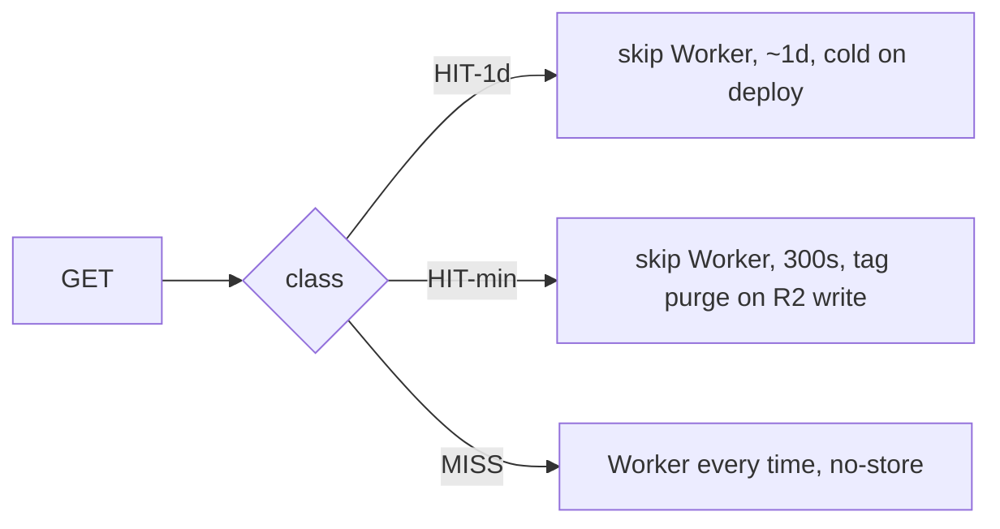

# Restore edge HIT on negotiated HTML and markdown - Plan

## Goal Capsule

- **Objective:** First-view and agent TTFB on bake-at-build pages get a skip-Worker edge HIT. Live web-board URLs still
  refresh within minutes of an R2 rewrite. Curl-vs-browser markdown negotiation on extensionless URLs still works. A
  cache HIT on a negotiated URL still shows `Vary: Accept, User-Agent`.
- **Means:** Workers Caching in front of the Worker, a tiny agent-vs-browser class plus `Accept` for negotiated
  variants, three TTL/purge classes (HIT-1d, HIT-min, MISS).
- **Authority:** Session-settled scope in `docs/brainstorms/2026-08-25-edge-hit-restore.md` and the accepted canvas
  `edge-hit-miss-matrix`. Staging canaries (2026-08-25) proved Workers Caching HIT keeps `Vary` and that tag purge is
  the HIT-min evict.
- **Open blockers:** None. Product confirmations are closed. How-level choices (gateway shape, tag names, wrangler pin)
  are deferred to planning.

## Product Contract

### Summary

Restore skip-Worker edge HIT on negotiated HTML and markdown without repeating the 2026-08-25 production bug (a HIT that
omitted `Vary`). Zone Cache Rules are not the lever. Workers Caching is. Live-board URLs share a 300-second HIT and
purge by tag when R2 is rewritten. Bake-at-build pages long-HIT and go cold on deploy.

### Problem Frame

After #265 / #266, negotiated HTML and markdown send `Cloudflare-CDN-Cache-Control: no-store` so clients see `Vary:
Accept, User-Agent`. That made `markdown-vary` a real SHOULD pass on `anc.dev`. Post-266 `cf-cache-status: HIT` on asset
paths is Static Assets: the Worker still runs, stamps `Vary`, and does not skip CPU or homepage R2 inject. Bake-at-build
pages (`/scorecards`, `/about`, principles) pay that cost on every request even though their bodies only change on
deploy. Live web-board URLs (`/`, `/web`, `/web/<domain>`) must not freeze behind a day-long HIT.

A zone Cache Rule on `/about` (created and deleted the same session) did not skip this Worker: Custom Domain plus
`run_worker_first` runs the Worker before zone cache. Workers Caching sits in front of the Worker and honors
`Cache-Control` and `Vary`. Staging proved a HIT there still shows `Vary` and does not cross-serve HTML vs markdown.

### Key Decisions

- KD1. Design against post-#266 production. (session-settled: user-directed — chosen over designing against the pre-Vary
  Worker.) Governs R11.
- KD2. Explicit `.md` is one representation except homepage and `/web` twins that carry live boards. (session-settled:
  user-directed — chosen over keeping `Vary` on every markdown response.) Governs R2.
- KD3. This unit includes both path-keyed `.md` HIT and negotiated extensionless HIT. (session-settled: user-directed —
  chosen over splitting UA-class work to a later unit.) Governs R1, R2, R8.
- KD4. Format-class edge cache: tiny agent-vs-browser class plus `Accept`; HIT must still show `Vary`. (session-settled:
  user-directed — chosen over Accept-only and a Worker-owned second cache.) Governs R1, R8.
- KD5. Homepage HTML and all homepage markdown include CLI + web board slices, share HIT-min, and purge together. No
  ESI. (session-settled: user-directed — chosen over HTML live / markdown TTL and over keeping `no-store` until purge
  was proven.) Governs R3, R6.
- KD6. CLI bake-at-build may long-HIT; web R2 surfaces share the homepage HIT-min class. (session-settled:
  user-directed.) Governs R3, R4.
- KD7. Do not move `markdown-vary` off `GET /`. (session-settled: user-directed.) Governs R7.
- KD8. HIT-min TTL is `max-age=300`. (session-settled: user-directed — chosen over 60 seconds.) Governs R3.
- KD9. Workers Caching is the skip-Worker cache. Zone Cache Rules are not. (session-settled: user-directed — chosen
  after a no-op zone canary and a staging Workers Caching canary that kept `Vary`.) Governs R10.

### Requirements

**Negotiation and Vary**

- R1. On an extensionless URL, `Accept` and `User-Agent` still pick HTML vs markdown the way they do after #266. A
  Workers Caching HIT on that URL still shows `Vary: Accept, User-Agent` to the client. A cache-key-only fix that leaves
  `Vary` absent does not ship.
- R7. `markdown-vary` stays a SHOULD on `GET /` and continues to fail loudly when `Vary` is missing or is only
  `Accept-Encoding` plus `User-Agent`.
- R8. Negotiated HIT keys on a tiny agent-vs-browser class plus `Accept`, not the raw `User-Agent` string. The
  client-visible `Vary` stays `Accept, User-Agent`. Exact UA values and exact `Accept` values (`*/*` vs `text/html`)
  shard unless a gateway normalizes them before the cached entrypoint.

**Cache classes**

- R2. Explicit `.md` is one representation: no `Vary`, never HTML. Live twins (`/index.md`, `/web.md`,
  `/web/<domain>.md`) still have no `Vary` and follow R3 (HIT-min). Every other `.md` follows R4 (HIT-1d).
- R3. HIT-min: `/`, `/index.md`, `/web`, `/web.md`, `/web/<domain>`, `/web/<domain>.md`, and `/web?view=curated`. Edge
  TTL is `max-age=300`. Evict with `ctx.cache.purge({ tags })` when the R2 aggregate or that domain's audit is
  rewritten. Do not evict with path prefix `/` or `/web` (those over-purge). Query-string objects are distinct cache
  keys and share the URL's tags.
- R4. HIT-1d: bake-at-build HTML/markdown (`/scorecards`, `/score/<tool>`, `/about`, `/p1`–`/p8`, `/mcp-skill`, GET
  `/mcp` as a page, and other spec/docs pages without a live board) plus path-keyed `/llms.txt` / `.json` / `.svg`.
  About one day of edge freshness. A new Worker version starts with an empty cache. `cache.cross_version_cache` stays
  off. Explicit deploy purge is not required for this class.
- R5. MISS: `/web/scoring*`, `POST /mcp`, `/api/score`, `/api/audit-web` stay CDN `no-store` every request.
- R10. The skip-Worker HIT is Workers Caching (`cache.enabled` in wrangler). Zone Cache Rules do not skip this Worker.
  Enabling `cache` requires a wrangler that honors the key (repo pin is now `^4.124.0`).

**Homepage and docs**

- R6. Homepage HTML and every homepage markdown representation (negotiated `/` and `/index.md`) include CLI + web board
  slices. They share R3. Do not ESI or split the web pane out of the HTML.
- R9. `DESIGN.md` header contract documents the three classes (HIT-1d, HIT-min, MISS) instead of a single HTML/`.md`
  `s-maxage=86400` story.
- R11. This work lands on production that already serves post-#266 `Vary` + `no-store` on negotiated HTML/markdown.

### Actors

- A1. Browser with `Accept: text/html` and a browser `User-Agent`.
- A2. Default curl / agent (`User-Agent: curl/…`, `Accept: */*`) expecting markdown on extensionless URLs.
- A3. R2 board writer (`putAggregate` and per-domain audit write).
- A4. Deploy that publishes a new Worker version.

### Key Flows

- F1. **Negotiated HIT, two clients.** A1 GETs `/about` twice: first `MISS`, second skip-Worker `HIT` with `Vary:
  Accept, User-Agent` and HTML. A2 GETs `/about` twice: markdown `HIT`, not HTML, same `Vary`. **Covers R1, R8.**
- F2. **HIT-min purge.** A3 rewrites the board aggregate. Tagged HIT-min URLs (including `/web?view=curated`) miss on
  the next GET, then HIT again. `/about.md` and other HIT-1d URLs stay. **Covers R3.**
- F3. **HIT-1d deploy.** A4 deploys a new version. Bake-at-build URLs miss until refill. HIT-min tags from the previous
  version are not served (version is in the cache key). **Covers R4, R10.**
- F4. **Scoring shell.** GET `/web/scoring*` never HIT. **Covers R5.**
- F5. **Homepage markdown.** A2 GETs `/` and `/index.md` and sees CLI + web board slices in both, HIT-min. **Covers
  R6.**

### Acceptance Examples

- AE1. **When** staging or production Workers Caching is on for a negotiated URL **and** the same browser UA repeats GET
  `/about` with `Accept: text/html`, **then** the second response is `HIT` with `Age`, frozen Worker-ran proof, `Vary:
  Accept, User-Agent`, and HTML. Default curl against the same URL is markdown, not HTML. **Covers R1.**
- AE2. **When** a HIT omits `Vary` or only has `Accept-Encoding` plus `User-Agent`, **then** `markdown-vary` on `GET /`
  fails loudly and that build does not ship. **Covers R7.**
- AE3. **When** `ctx.cache.purge({ tags: [<HIT-min tag>] })` runs, **then** `/`, `/web`, `/web/<domain>`, their live
  `.md` twins, and `/web?view=curated` miss; `/about.md` and `/p1` do not. **When** `pathPrefixes: ["/about"]` is used
  instead, `/about.md` also misses — that is why R3 forbids prefix `/` and `/web`. **Covers R3.**
- AE4. **When** Chrome + `Accept: text/html` has a HIT **and** Chrome + `Accept: */*` arrives, **then** that is a
  distinct variant (still HTML via the UA heuristic) until the gateway normalizes `Accept`. Safari vs Chrome HTML shards
  until the gateway normalizes UA. **Covers R8.**
- AE5. **When** A2 fetches `/about.md`, **then** the body is markdown with no `Vary` and HIT-1d. **When** A2 fetches
  `/index.md` or `/web.md`, **then** the body is markdown with no `Vary` and HIT-min. **Covers R2, R3, R4.**

### Scope Boundaries

**In scope:** R1–R11; Workers Caching on; dropping `no-store` on the HIT classes; format-class gateway; Cache-Tag on
HIT-min; `putAggregate` / audit-write purge; homepage markdown board slices; `DESIGN.md` header-contract update;
wrangler bump so `cache.enabled` takes effect.

**Out of scope:** Moving `markdown-vary` off `GET /`. ESI or splitting the web board out of homepage HTML. Caching
`/web/scoring*`, `POST /mcp`, `/api/score`, `/api/audit-web`. Accept-only negotiation (bare curl would get HTML). A
Worker-owned second cache as the primary store. Zone Cache Rules as the skip-Worker layer. `cache.cross_version_cache`.

**Deferred to planning (how, not product):** Cache-Tag vocabulary; gateway entrypoint layout; exact wrangler version (>=
4.124); whether HIT-1d uses `s-maxage=86400` to match today's path-keyed `.txt` or `max-age` only.

### Dependencies / Assumptions

- Production already serves post-#266 `Vary` + negotiated `no-store` (#266 merged).
- Staging `*.workers.dev` is a valid Workers Caching proof surface (Access service-token headers did not bypass the
  cache).
- Workers Caching always uses Free-tier purge limits, regardless of the `anc.dev` zone plan.
- Zone purge and `ctx.cache.purge()` do not clear each other.
- `index.md` does not currently carry live board rows; putting CLI + web slices into every homepage markdown
  representation is in scope per R6.

### Outstanding Questions

- **Deferred to Planning:** Cache-Tag names for HIT-min (homepage vs `/web` vs per-domain). Gateway mechanism for the
  agent-vs-browser class (named entrypoint vs request rewrite). Wrangler pin that actually enables `cache`. HIT-1d
  `Cache-Control` shape (`s-maxage=86400` vs `max-age` only).

### Sources / Research

- Working brainstorm: `docs/brainstorms/2026-08-25-edge-hit-restore.md`.
- Prior Vary dogfood: `docs/plans/2026-08-25-1211-feat-web-audit-agent-recovery-plan.md` (U1), PRs #265 / #266.
- Today's headers: `src/worker/headers.ts` (`NEGOTIATED_CACHE`, `CDN_NO_STORE`, `SHORT_CACHE`).
- Cloudflare: [Workers Caching](https://developers.cloudflare.com/workers/cache/),
  [Vary](https://developers.cloudflare.com/workers/cache/#content-negotiation-with-vary),
  [purge](https://developers.cloudflare.com/workers/cache/purge/),
  [cache keys](https://developers.cloudflare.com/workers/cache/cache-keys/),
  [Workers × zone cache](https://developers.cloudflare.com/cache/interaction-cloudflare-products/workers/).
- Staging canaries (2026-08-25): Workers Caching HIT on `/about` kept `Vary` (version `2e5fb46e`, rolled back to
  `f8448633`); tag vs prefix purge (version `29acd80b`, same rollback).
