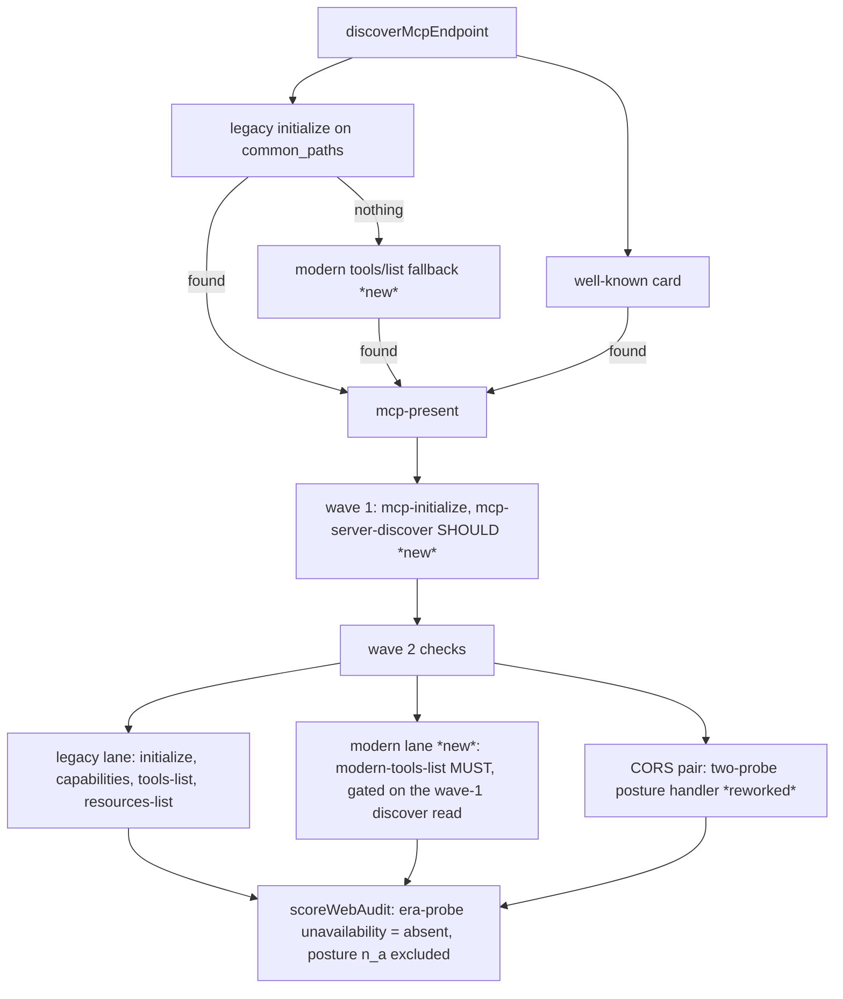
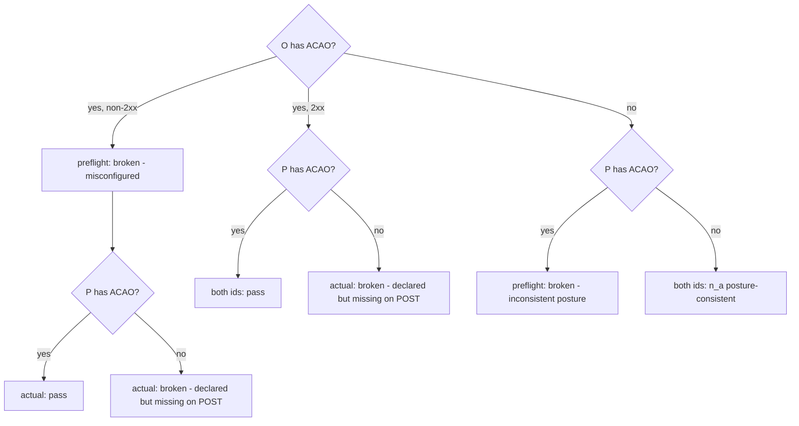

# MCP surface baseline v1 adoption - Plan

**Target repo:** `brettdavies/agentnative-site`. All file paths are repo-relative; authoritative state is `origin/dev` @
`2390687`.

**Origin:** the ratified dual-protocol triage at
`~/.gstack/projects/mcp-compare/2026-08-26-mcp-dual-protocol-triage.md`. Its "Recommended common baseline (MCP surface
baseline v1)" section is the normative target; this plan executes the agentnative-site adoption list plus the
anc-relevant joint follow-ups. All triage decisions are settled as of 2026-08-26 and are not re-litigated here.

**Sibling plan:** a meum-sites baseline-adoption plan is being authored in parallel. Shared items must stay consistent
across the two repos: the tool `title` + `annotations` style (U9), the `mcp.request` telemetry base schema (Appendix),
and the legacy-reject envelope (`-32022` with `data.supported`, U1). Shared-shape enforcement (adopted for both repos,
2026-08-26): at each shared-shape unit, re-resolve the sibling meum repo's current SHA, record it in the PR body, and
diff the mirrored shape against the sibling's current state — a recorded diff, not a prose mirror instruction.

---

## Goal Capsule

- **Objective:** Operators can run the legacy sunset from trustworthy signals: the reject lane has a distinct JSON-RPC
  code, the era-aware rate keys and kill switch are covered by repeatable tests, and every staging deploy verifies the
  live MCP surface. Audited third-party sites are scored on the era surface they actually offer: the modern `2026-07-28`
  lane earns independent credit and a deliberate no-CORS posture is not penalized. MCP clients see titled, accurately
  annotated tools.
- **Means:** Adopt the triage's baseline v1: port the meum-sites operator-surface test pattern (KD2), take the meum
  reject-code and host-validation picks (KD1, KD4), extend the site's own web-audit registry with per-era checks (KD3),
  and wire the existing release smoke into the staging deploy (KD7).
- **Authority hierarchy:** settled KDs/KTDs in this plan > this plan's units > `AGENTS.md` § MCP server >
  `docs/runbooks/mcp-operator.md` for operational detail.
- **Execution profile:** `feat/*` branches cut from `dev`, PR back to `dev` (squash). Bun, Biome, Conventional Commits.
  Local gate order: `bun run build` before `bun test` (AGENTS.md rule; `dist/` does not track branch switches).
- **Stop conditions:** Stop and surface if `createMcpHandler` on the pinned `agents` version cannot take
  `allowedHostnames` alongside `corsOptions: false` (contradicts the SDK source evidence in KTD6); if per-era registry
  entries cannot leave the legacy `mcp-initialize` / `mcp-tools-list` entries byte-stable; if an R20 dogfood divergence
  cannot be resolved by updating probe expectations to observed SDK behavior or by a shell-owned envelope fix inside
  U11's files (per the R20 divergence rule); or if evidence invalidates any session-settled KD (report
  `settled-decision-invalidated`, do not resolve silently).
- **Tail:** PRs to `dev`, CI green (`lint · build · test · wrangler`). The registry change, its count-pin updates, and
  the one resulting fingerprint reflow (KTD8) ride a single PR. Production exposure follows the normal `dev` →
  `release/*` → `main` train.

---

## Product Contract

### Summary

Adopt the cross-repo MCP baseline in agentnative-site: fix the legacy-reject error-code collision and its mislabeled
log, port the missing operator-surface test block, add modern-era (`2026-07-28`) checks and a posture-aware CORS rework
to the site's own web-audit registry, turn on SDK Host validation, declare the kill-switch binding shapes, give all 13
tools titles and accurate annotations, give the MCP surface a scheduled e2e home plus a post-deploy staging smoke, add
per-era error-code conformance probes the site itself must pass, and write the unpublished wire-protocol reference.
Server tool semantics, rate-limit ceilings, and the no-browser-CORS posture do not change.

### Problem Frame

The dual-protocol migration (PR #272/#273/#274, plan `docs/plans/2026-08-25-001-feat-mcp-2026-dual-protocol-plan.md`)
landed a converged architecture but left divergences the triage graded against meum-sites' sibling implementation. Three
are load-bearing: the legacy-reject envelope reuses the rate-limit code `-32099`, corrupting exactly the telemetry the
sunset decision depends on; the era-aware rate keys, `resolveLegacyMode`, and the `legacy_rejected` path ship with zero
test coverage despite being live operator behavior; and the site's own audit engine still probes other servers with
legacy-only, initialize-based checks while its CORS checks penalize the very posture anc.dev itself ships. The remaining
items are hardening (Host validation, declared bindings) and delivery hygiene (CI e2e, deploy smoke, doc drift).

### Key Decisions

- KD1. **Legacy-reject uses the SDK's typed `-32022` (UnsupportedProtocolVersion) with `data.supported: ["2026-07-28"]`;
  `-32099` stays rate-limit-only.** Distinct code per shell condition, both at HTTP 200. (session-settled: user-directed
  — supersedes, 2026-08-26, the triage's `-32003` pick after review surfaced the SDK's typed code for exactly this
  condition: reference clients can typed-recognize era rejection and fall back; corroborated by EmailEngine's
  independent dual-stack server documenting `-32022`.) Both repos converge; the sibling meum plan mirrors the change.
  Governs R1, R2, R4.
- KD2. **Port the meum-sites operator-surface test pattern.** Era-aware keys, spoof fallback, reject lane with
  modern-still-works, telemetry PII spies. (session-settled: user-approved — chosen over waiting for organic coverage:
  the sunset switch and era keys are live behavior with zero tests.) Governs R3.
- KD3. **Web-audit modern-era checks land now (triage-KD6 pull-forward).** Modern MUST is a header-routed `tools/list`
  probe (`MCP-Protocol-Version: 2026-07-28` + `Mcp-Method: tools/list` + `_meta` envelope with the three
  `io.modelcontextprotocol/*` keys, no initialize); `server/discover` enters at recommended tier; each era's checks are
  separate registry entries scored independently — legacy `mcp-initialize` / `mcp-tools-list` entries stay unchanged,
  dual-stack servers earn both lanes, single-era servers fail exactly the lane they lack; `mcp-cors-preflight` /
  `mcp-cors-actual` become posture-aware `n_a` — no penalty for a consistent no-CORS posture, score only partial or
  misconfigured CORS; the remediation catalog extends to every new or changed check id. (session-settled: user-directed
  — chosen over the prior plan's wait-for-client-migration-telemetry deferral: explicit directive 2026-08-26.) Governs
  R8–R14.
- KD4. **Host validation on, browser CORS still off.** Pass `allowedHostnames` to `createMcpHandler`; keep `corsOptions:
  false`; no `allowedOriginHostnames`. (session-settled: user-approved — chosen over the prior plan's blanket "no
  allowlists" instruction, which conflated Origin-CORS with Host-rebinding defense.) Governs R7.
- KD5. **`MCP_LEGACY_ENABLED` is a committed wrangler var in every environment, explicit `"true"` in production.**
  (session-settled: user-approved — chosen over the staging-only binding: the prod drill has no declared home without
  it.) Governs R5, R6.
- KD6. **All 13 tools get `title` + accurate `annotations`; `score_cli` and `audit_website` are annotated as non-read.**
  (session-settled: user-approved — chosen over readOnlyHint-everywhere: inaccurate hints are worse than none.) Governs
  R15.
- KD7. **Post-deploy MCP smoke in the staging deploy leg, non-blocking first, then blocking.** (session-settled:
  user-approved — chosen over manual-only invocation: neither repo's deploy verifies the MCP surface today.) Governs
  R17.
- KD8. **Settled non-goals.** Origin / hashed-UA telemetry reintroduction waits for one month of production
  `mcp.request` data; the Tasks extension waits for its triage-documented triggers; browser CORS on `POST /mcp` and
  either-era MUST satisfaction in the audit are outside product identity. (session-settled: user-directed.) Governs
  Scope Boundaries.
- KD9. **Error-code conformance probes and a wire-protocol reference land in this plan.** The web audit gains
  recommended-tier per-era error-code conformance checks (probe matrix in the Appendix), anc.dev must pass its own
  matrix, and an unpublished wire-protocol reference doc becomes the single starting point for a future protocol bump.
  (session-settled: user-directed — scope expansion 2026-08-26; corroborating wire evidence from EmailEngine's protocol
  reference.) Governs R19–R21.

### Requirements

**Operator surface correctness**

- R1. The legacy-reject response is JSON-RPC error `-32022` (UnsupportedProtocolVersion) at HTTP 200; its error object
  carries `data.supported: ["2026-07-28"]`, the message names `2026-07-28`, and the request `id` echoes when it is a
  string or number. The rate-limit response keeps `-32099`.
- R2. The `legacy_rejected` log line carries the actual classified method (header else parsed body, per the existing
  terminal-path pattern) and `error_code: -32022` — never a hardcoded `initialize`.
- R3. Repeatable tests cover: `legacy:{ip}` and `modern:{name}:{ip}` key construction, the spoofed-`Mcp-Name` fallback
  to `modern:{ip}`, `resolveLegacyMode` reject behavior (`MCP_LEGACY_ENABLED=false` rejects legacy while modern still
  serves), telemetry PII negatives (no IP, no tool arguments, no query text; one line per POST), and a drift assertion
  that the build-emitted `registered_tool_names` matches the served `tools/list` names. The modern `resources/read`
  matrix is re-framed: with a correct `Mcp-Name` mirroring the resource URI, an unknown resource pins the true miss code
  (expect `-32602` — the pinned SDK never emits `-32002` and maps a handler-thrown `-32002` to `-32602` at the era
  encode seam; verify at implementation); a missing or non-mirroring `Mcp-Name` pins `-32020` (header mismatch). The
  in-process suite also covers the conformance matrix where not already pinned: batch array → `-32600` (expected; verify
  at implementation — the pinned SDK's entry classifier serves all-legacy batch arrays, see U2), unknown method →
  `-32601`, unknown tool name → `-32602`, and a modern request carrying an unsupported protocol version → `-32022`
  (SDK-produced, distinct from the shell's legacy reject; verify at implementation).
- R4. Every doc that binds `-32099` to the legacy-reject lane is updated in the same pass as the code change:
  `docs/runbooks/mcp-operator.md` (kill-switch table and the 2026-08-26 drill record), `AGENTS.md` (kill-switch list and
  transport error-code list), and `content/mcp-skill.md` gains a legacy-rejected row in its client-facing error table.

**Config and host posture**

- R5. `MCP_LEGACY_ENABLED: "true"` is bound in the top-level (production) `vars` block and remains in
  `env.staging.vars`. Binding it is declaration only: `resolveLegacyMode` already treats absent as `stateless`.
- R6. The vars-vs-secrets posture is recorded per flag: `MCP_ENABLED` and `MCP_LIVE_SCORING_ENABLED` stay secrets
  (deliberate fail-closed-by-absence plus zero-deploy flip, per KTD7); `MCP_LEGACY_ENABLED` is a committed var. Runbooks
  state the flip verb per binding shape and ban `wrangler secret put` on var-bound names (Cloudflare API 10053).
- R7. `POST /mcp` validates the Host header against an explicit hostname list (production domains, staging workers.dev
  host, localhost variants) while keeping the full `access-control-*` strip. A host rejection is observable in
  telemetry: `error_code` extraction works on non-200 JSON-RPC bodies so the SDK's 403/`-32000` rejection is filterable.

**Web-audit modern era**

- R8. A new required-tier check id probes header-routed `tools/list` per KD3's wire shape and passes on a JSON-RPC
  result carrying a `tools` array.
- R9. A new recommended-tier check id probes `server/discover` with modern headers and `_meta`, passing on a well-formed
  discovery result and reading a refusal that means the method is not served here as `absent` rather than `broken`. It
  doubles as the modern lane's discriminator (KTD3).
- R10. Era independence: the legacy registry entries are unchanged; the modern lane's presence is read from
  `server/discover`, the one modern-only method on the wire, and every modern row scores `absent` when no modern lane
  was evidenced; on an era probe an era-shaped miss (a well-formed JSON-RPC error envelope whose code signals lane
  unavailability, per KTD3) scores `absent`, not `broken`; other well-formed error envelopes, malformed, and
  non-JSON-RPC responses score `broken`.
- R11. The CORS pair classifies from both probes: consistent no-CORS posture on OPTIONS and POST yields `n_a` with a
  posture-specific reason; ACAO present on one surface but not the other, or ACAO on a failing preflight, scores
  `broken`; full CORS scores `pass`.
- R12. `src/data/web-audit/remediation.yaml` carries an entry for every new check id and updated prose for both CORS ids
  (the build enforces the 1:1 mapping).
- R13. Endpoint discovery gains a modern fallback: when the legacy `initialize` probe of `common_paths` finds nothing, a
  header-routed modern probe runs, so a modern-only server is discoverable and fails exactly the legacy lane.
- R14. Rollout integrity: count-pinning tests are updated to the Phase-B totals (62 checks; required 4, recommended 35;
  `universeMax` 148 — Appendix arithmetic), the registry-fingerprint reflow re-audits seeded scorecards under the new
  universe on deploy (KTD8: no manual cache-version rotation exists; unseeded rows re-audit on stale access or age out),
  and the fingerprint reflow behavior is documented.

**Metadata and delivery**

- R15. Every tool registration carries `title` and `annotations`: `readOnlyHint: true` for the 11 read tools;
  `score_cli` and `audit_website` carry `readOnlyHint: false` with accurate hints (Appendix table). The instructions
  drift gate extends to pin their presence.
- R16. MCP e2e runs in CI: a scheduled deep-check job runs the `staging-mcp` Playwright project against staging with
  Access credentials; `tests/e2e/mcp.e2e.ts` gains modern-lane probes; era-agnostic card assertions run in the default
  local chromium project.
- R17. The staging deploy job runs the MCP smoke (core checks only) after deploy, non-blocking at first with a visible
  failure signal, with a documented promotion path to blocking.
- R18. Stale `[mcp-call]` sections are deleted from `RELEASES.md` and `RELEASES-RATIONALE.md`; `content/mcp-skill.md`
  says `Allow: GET, POST`.

**Error-code conformance and protocol reference**

- R19. The registry gains recommended-tier per-era error-code conformance checks per the Appendix probe matrix — three
  new legacy ids (malformed body, batch array, unknown tool; the existing `mcp-unknown-method` check already covers the
  legacy unknown-method probe) and five new modern ids (unknown method, missing `clientCapabilities`, header mismatch,
  version reject, resources-read miss) — each with its own remediation entry, one request against a stateless target and
  one conditional session re-ask against a target that demands one (KTD11). `-32603` (cannot be forced from outside) and
  `-32099` (triggering rate limits against third-party servers is abusive) are documented as excluded, in the registry
  comments and the reference doc.
- R20. anc.dev passes every conformance probe in its own audit; each probe's expected behavior is verified against the
  in-process handler at implementation. Divergence rule: the pinned SDK's observed behavior is the conformance authority
  — matrix expectations, remediation prose, and the U12 reference update to match observation; shell shims are reserved
  for shell-owned envelope fields; a divergence whose fix would reach outside U11's files or the shell's envelope layer
  is a stop-and-surface, not silent scope growth (KTD11 names the known contingency).
- R21. An unpublished MCP wire-protocol reference doc exists under `docs/`, cross-linked from
  `docs/runbooks/mcp-operator.md` and `AGENTS.md`, carrying the full error-code table for both lanes, the SEP-2243
  header-mirror rules, the `_meta` envelope requirements, the `-32022` + `data.supported` version-reject shape,
  cache-hint scope semantics, and the GET-posture divergence rationale.

### Actors

- A1. **MCP client** — legacy or modern era, consumes the 13 tools.
- A2. **anc operator** — reads `mcp.request` logs, flips kill switches, runs the sunset procedure, reads deploy/smoke
  signals.
- A3. **Audited site owner** — receives per-era scorecard rows and remediation guidance from the web audit.

### Key Flows

- F1. **Legacy sunset flip.** A2 edits the committed var to `"false"` (planned change, PR to `main`) or applies the
  documented emergency `--var` override → legacy POSTs answer `-32022` and log `legacy_rejected` with the real method →
  modern lane unaffected. **Covers R1, R2, R5, R6.**
- F2. **Modern-only server audited.** Discovery finds the endpoint via the modern fallback → legacy checks score
  `absent` (lane not offered) → modern checks score on their own merits → remediation for the missing lane names the
  actual gap. **Covers R8, R10, R13.**
- F3. **No-CORS server audited.** Both CORS probes see no ACAO → both rows are `n_a` with posture-specific rendering →
  no score penalty; a half-configured server scores `broken` on the inconsistent surface. **Covers R11.**
- F4. **Staging deploy.** Merge to `dev` → deploy → core MCP smoke runs with Access credentials → failure surfaces in
  the step summary without blocking the deploy (initial posture). **Covers R17.**

### Acceptance Examples

- AE1. **When** `MCP_LEGACY_ENABLED=false` and a legacy `tools/call` arrives **then** the response is HTTP 200 with
  `error.code: -32022`, `error.data.supported` listing `2026-07-28`, the request `id` echoed, and the log line shows
  `method: "tools/call"`, `outcome: "legacy_rejected"`, `error_code: -32022`. **Covers R1, R2.**
- AE2. **When** a modern request carries `Mcp-Name: not_a_real_tool` **then** the rate-limit key is `modern:{ip}`, not a
  spoofed bucket. **Covers R3.**
- AE3. **When** the audit probes a modern-only server **then** `mcp-initialize` scores `absent` and the modern
  `tools/list` check scores `pass`; **when** it probes a legacy-only server **then** `server/discover` evidences no
  modern lane and every modern row scores `absent` without a request, whatever that server would have answered. **Covers
  R8, R10, R13.**
- AE4. **When** the audit probes an endpoint with no ACAO on OPTIONS or POST **then** both CORS rows are `n_a` and the
  relative score is unaffected; **when** only one surface carries ACAO **then** the inconsistent row is `broken`.
  **Covers R11.**
- AE5. **When** `tools/list` is served **then** all 13 tools carry a non-empty `title` and an `annotations` object, with
  `readOnlyHint: false` on `score_cli` and `audit_website`. **Covers R15.**
- AE6. **When** a POST carries `Host: evil.example` **then** the response is the SDK's 403 with `error.code: -32000`, no
  `access-control-*` headers, and the log line carries `error_code: -32000`. **Covers R7.**

### Scope Boundaries

**In scope:** R1–R21 — the triage's agentnative-site adoption list, the anc-relevant joint follow-ups (tool metadata,
post-deploy smoke, shared telemetry schema doc), and the 2026-08-26 scope expansion (error-code conformance probes,
wire-protocol reference).

**Deferred to follow-up work**

- Promotion of the deploy smoke from non-blocking to blocking (criteria in Documentation / Operational Notes).
- A `workflow_dispatch` legacy-toggle leg in `deploy.yml` (revisit if a drill shows the documented flip paths are
  insufficient).
- `outputSchema` / `structuredContent` on tools — evaluated jointly with meum-sites so result contracts stay matched
  (triage D18).
- Analytics Engine MCP metrics dashboard; MCP Apps; MRTR elicitation (carried from the dual-protocol plan).
- `scripts/scoring/score_model.py` `UNIVERSE` refresh (already stale at 36 entries, guarded off `main`, referenced by no
  CI).
- Sync of the deprecated `agent-web-audit` skill's registry copy (the in-repo `src/data/web-audit/registry.yaml` is the
  STAR source; the skill is deprecated and its sync was already deferred by the agent-recovery plan).

**Settled waits (do not start early; KD8)**

- Origin / hashed-UA telemetry: wait for the first month of production `mcp.request` data — the clock starts when the
  dual-stack change reaches anc production.
- Tasks extension for async audits: triggers are `ms_bucket: >1000` dominance or client timeouts, audit scope outgrowing
  Workers wall-clock, or queued-audit product demand.

**Outside this product's identity**

- Browser CORS on `POST /mcp`; a second MCP server or `/mcp` path split.
- Either-era MUST satisfaction in the audit (a single MUST check that both eras can satisfy) — per-era independence is
  the settled model.

### Dependencies / Assumptions

- Pinned `agents@^0.21.0` + `@modelcontextprotocol/server@2.0.0`: `allowedHostnames` and `corsOptions: false` are
  independent options; host rejection responses pass through the CORS-strip wrapper (verified in SDK dist source).
- The `server/discover` response shape is derivable from the vendored SDK v2 and verifiable against anc's own dual-stack
  endpoint before assertions are pinned.
- The audit-engine changes reuse the existing `guardedFetch` SSRF guard and per-check timeout machinery unchanged.

### Outstanding Questions

None blocking. Execution-time details deferred inside units: the exact `server/discover` assertion set (U3), and whether
the repo's Access secrets are environment-scoped (U7 verifies before wiring).

### Sources / Research

- Origin triage: `~/.gstack/projects/mcp-compare/2026-08-26-mcp-dual-protocol-triage.md`.
- Reference test block: meum-sites `tests/meum-web-mcp.test.ts`, describe `meum-web MCP telemetry and legacy switch`
  (read via `git -C ~/dev/meum-sites show origin/dev:tests/meum-web-mcp.test.ts`).
- Reference reject mechanics (id echo, method classification) and host allowlists: meum-sites `workers/web/src/index.ts`
  and `workers/web/src/mcp/server.ts` (meum's shipped `-32003` is superseded by the joint `-32022` convergence; the
  sibling plan mirrors it).
- Corroboration for `-32022`, `-32020`-as-header-mismatch, and `Mcp-Name` on `resources/read`: EmailEngine MCP protocol
  docs, https://learn.emailengine.app/docs/mcp/protocol#error-codes.
- Solutions corpus (via qmd): `conventions/wrangler-kill-switches-must-be-secrets-not-vars.md` (binding-shape convention
  and its intentional-var carve-out), `integration-issues/web-audit-display-only-registry-change-skips-board-reflow.md`
  (registry-fingerprint reflow), `integration-issues/wrangler-deploy-route-propagation-lag-curl-retry.md` (post-deploy
  probe retries), `developer-experience/run-opt-in-remote-playwright-project-past-unconditional-webserver.md`
  (staging-mcp invocation), `conventions/verify-the-real-implementation-when-a-di-seam-sits-above-the-risk.md`
  (`MINIMAL_REGISTRY` fixture), `tooling-decisions/wrangler-cli-var-override-not-secret-put-for-declared-vars.md` (flip
  verbs).
- MCP spec `2026-07-28`: https://modelcontextprotocol.io/specification/2026-07-28/changelog; SDK migration:
  https://ts.sdk.modelcontextprotocol.io/v2/migration/support-2026-07-28.

---

## Planning Contract

Product Contract preservation: bootstrapped from the ratified triage; every agentnative-site adoption item and
anc-relevant joint follow-up is carried into R1–R18, the settled waits, or Deferred. No scope change against the origin.

### Assumptions

Unconfirmed planning bets made on this headless run — each owned by the cited KTD or unit; reviewers should scrutinize
these first:

- The unavailability softening reaches only the era probes, and only on the unavailability codes (`-32601`, `-32022`);
  the conformance rows and every other error envelope keep the `broken` penalty (KTD3). "Fail exactly the lane they
  lack" is read as no-credit-for-the-missing-lane without punishing a conformant single-era choice.
- `MCP_ENABLED` / `MCP_LIVE_SCORING_ENABLED` stay secrets (KTD7). The triage leaned committed vars; the repo-family
  convention doc, the in-config KTD-11 rationale, and the loss of the zero-deploy emergency flip decide the other way
  under the triage's own documented-exception clause.
- The CORS posture pair is computed by one two-probe handler per check, not cross-check engine state (KTD4).
- The CI e2e "or" resolves as both halves: a scheduled `staging-mcp` deep-check job and local card assertions in
  chromium (U7).
- The deploy smoke gets a core-checks-only script mode; the full symmetry + live-audit gates stay
  preflight/postflight-only (U8).
- `extractTransportErrorCode` widens to non-200 JSON bodies so host rejections are observable; the shared telemetry base
  schema is otherwise unchanged (KTD6).
- Deep-check's Access secrets are assumed environment-scoped until verified; the new job declares `environment: staging`
  either way (U7).
- Proposed `title` strings and annotation values (Appendix) are directional; the implementer may adjust wording, not
  accuracy.

### Key Technical Decisions

- KTD1. **Reject envelope mechanics.** `jsonRpcError` in `src/worker/index.ts` gains an `id` parameter (echo the request
  id when string or number, else `null`) and an optional `data` parameter; the reject branch emits code `-32022` with
  `data.supported: ["2026-07-28"]` and a message naming `2026-07-28`, and the reject log reuses the terminal path's
  classification (`headerMcpMethod(request) ?? classifyRpcMethod(parsedBody)`, name via `headerMcpName ??
  classifyToolName`) with `error_code: -32022`. The stale gate-order doc comment above the branch is corrected to
  include the legacy gate. Instantiates KD1 (R1, R2).
- KTD2. **Test port shape.** Extend `tests/worker-mcp-dispatch.test.ts` — it already has `makeEnv`, the `RateStub` key
  capture, `parseMcpRequestLogs`, and the deliberately short `FIXTURE_CATALOG` name list ideal for spoof-fallback cases.
  `makeEnv` gains an `MCP_LEGACY_ENABLED` option. The meum block's patterns port directly: closure-captured limiter
  keys, env-factory flag injection, serialized-line substring negatives for PII. anc adds what meum lacks: assertions on
  the `-32022` code and `data.supported` array, HTTP status, id echo, and the reject-log method for a non-initialize
  legacy call — plus the re-framed modern `resources/read` matrix per R3 (the existing modern-era `-32020` miss pin
  observed header validation, not a resource miss: the probe lacked the required `Mcp-Name` mirror). Instantiates KD2
  (R3).
- KTD3. **Modern audit probes extend `runMcp`.** New ops in the `McpWith` union (`modern-tools-list`, `server-discover`)
  with a handler-local modern-protocol constant (`2026-07-28`), header injection (`MCP-Protocol-Version`, `Mcp-Method`),
  and `_meta` in params carrying the three `io.modelcontextprotocol/*` keys (`clientCapabilities` is mandatory —
  omitting it draws `-32602`). The registry's global `mcp_discovery.protocol_version` stays `"2025-06-18"` (test-pinned;
  legacy discovery unchanged). **The modern lane is discriminated by `server/discover`, the only modern-only method on
  the wire.** Every other modern row sends a request a 2025-era server is free to answer — leniently, by serving the
  legacy handler behind it, or strictly, by refusing the version claim — so its answer is evidence about leniency, not
  about the era. Wave 1 derives an `McpModernLane` from the `mcp-server-discover` outcome: `present` when the row
  carries `supported_versions` (written on the JSON-RPC result path alone), `unevidenced` when the server answered any
  other way, `unknown` when the probe never got an answer. On `unevidenced` the six modern rows (`modern-tools-list`
  plus KTD11's five modern conformance rows) settle `absent` without issuing a request, so a legacy-only server lands
  `absent` on the modern lane rather than a free MUST pass or a penalty; on `unknown` they probe as usual, so an
  operational failure never converts into a verdict; `server-discover` is never gated on its own answer. Era-mismatch
  classification is code-sensitive and scoped to the era probes — the ops naming a method the lane could be missing
  (`initialize`, `tools-list`, `resources-list`, `error`, `modern-tools-list`, `server-discover`). On those, a
  well-formed JSON-RPC error envelope whose code signals lane unavailability (`-32601` method-not-found, or the SDK's
  `-32022` UnsupportedProtocolVersion) maps to `absent`; any other well-formed error envelope (e.g. `-32603`) and any
  malformed or non-JSON-RPC response stays `broken`, preserving the broken-surface penalty. KTD11's conformance rows
  name no such method and take no softening. One carve-out on the legacy resources read: once `mcp-initialize` observed
  the legacy lane advertising `capabilities.resources`, a `-32601` on `resources-list` is `broken`, because refusing a
  capability you advertise contradicts your own handshake and that misconfiguration has to stay visible; conditioning
  the carve-out on the legacy advertisement is what stops a modern-only server being charged for lacking a legacy lane.
  The `server/discover` row reads its own refusals as an absent lane, so the check that proves the lane is missing is
  not the one row penalized for proving it: an error envelope is judged on its code alone (`-32601`, `-32022`, and
  `-32000` — a session-required refusal is a stateful legacy server answering on its own terms, and the modern lane is
  sessionless by construction), and only an envelope-free answer is judged on its status (400 and 415, the typed-refusal
  statuses). `-32603` therefore stays `broken` however it is delivered, and a malformed 200 result or a 5xx keeps the
  penalty a server that tried to serve the method and failed has earned; 404 stays outside every arm so a dead endpoint
  earns nothing; 429, 408, and 503 mean "not now" rather than "not here" and are no era signal (the `-32099` rate-limit
  arm resolves to `error` ahead of every scoring read). All of this is handler classification: the legacy registry
  entries stay byte-stable throughout. The modern ops skip the existing `Mcp-Session-Id` attach in `runMcp` (conditional
  on `op !== 'initialize'`) so modern probes stay sessionless per the Appendix wire shape; neither op carries `Mcp-Name`
  (neither is a `tools/call` or `resources/read` — a future modern resources probe must mirror the resource URI in
  `Mcp-Name` or it draws `-32020` header mismatch). A post-sunset anc answers its legacy probes with `-32022`, landing
  in the unavailability set — all four legacy era probes then score `absent`, not `broken`, while its legacy conformance
  rows are judged on their own codes, so a `-32022` answering a `tools/call` reads `broken`. The era-neutral
  `mcp-resources` antecedent (KTD11) stays met via modern discovery evidence, so the legacy resources row probes and
  lands `absent` with the rest of its lane rather than gating `n_a`, and the modern resources row is scored on the lane
  still serving. The `http` handler is not used (it cannot carry a body). Instantiates KD3 (R8, R9, R10).
- KTD4. **CORS posture pair: one two-probe handler, both ids kept.** Each of `mcp-cors-preflight` and `mcp-cors-actual`
  invokes a posture-aware handler that issues both the OPTIONS preflight and an Origin-bearing POST, then classifies its
  own id from the pair (matrix in U4). This avoids cross-check engine state (the two checks run concurrently with no
  shared context) and keeps both check ids stable for remediation and skill pages. `n_a` carries a new posture reason:
  `ProbeOutcome` gains an optional `na_reason`, the engine passes it through, the `NaReason` union gains
  `posture-consistent`, and `resultLine` renders it as a deliberate posture rather than "not applicable". Precedent for
  handler-emitted softening: `handlers/content-without-js.ts`. Instantiates KD3 (R11).
- KTD5. **Modern discovery fallback.** `discoverMcpEndpoint` keeps its order (well-known card, then legacy `initialize`
  on `common_paths`) and appends a modern header-routed `tools/list` pass over `common_paths` when the legacy pass finds
  nothing; the first response with a `tools` result wins and discovery evidence records which probe succeeded.
  Instantiates KD3 (R13).
- KTD6. **Host allowlist and its observability.** A module-level constant in `src/worker/mcp/server.ts` (pattern: meum's
  hardcoded list): `anc.dev`, `www.anc.dev`, `agentnative-site-staging.brettdavies.workers.dev`, `localhost`,
  `127.0.0.1`. Passed as `allowedHostnames`; `corsOptions: false` stays; no `allowedOriginHostnames`. SDK evidence: the
  options are independent; `validateHostHeader` strips the port (bare `localhost` covers `localhost:8787`); the
  rejection is HTTP 403 with `-32000` and still passes through the CORS strip. Because `extractTransportErrorCode`
  currently returns `null` for non-200 responses, it widens to parse JSON-RPC codes from any JSON body within the
  existing 4 KB cap — the base schema gains no field. Supersedes the prior plan's "no allowlists" instruction (KD4).
  Instantiates KD4 (R7).
- KTD7. **Binding shape is per-flag, one shape per name.** `MCP_ENABLED` and `MCP_LIVE_SCORING_ENABLED` remain secrets —
  the repo convention (`docs/solutions` kill-switches doc) plus the in-config KTD-11 rationale: fail-closed-by-absence
  and a zero-deploy flip that survives redeploys, exactly the triage's documented-exception clause. `MCP_LEGACY_ENABLED`
  is the convention doc's intentional-var carve-out: committed `"true"` in top-level and staging vars. Flip verbs follow
  the shape: secrets flip via `wrangler secret put`; the var flips via a committed edit (planned sunset, PR-gated) or a
  transient `wrangler deploy --var` from a clean `main` checkout (documented hazards: it ships the local build and the
  next deploy reverts it). `wrangler secret put` on a var-bound name is banned in every runbook (CF API 10053).
  Instantiates KD5 (R5, R6).
- KTD8. **Registry rollout.** Any registry change flips the rescore fingerprint: the shipped KV fingerprint gate
  (`rescore-workflow.ts`) detects the shape change on deploy and forces one full seeded reflow, re-auditing every seeded
  scorecard under the new universe. No separate web-audit cache version exists to rotate — the only key component is the
  generated `SPEC_VERSION`, and bumping it is the documented wrong lever (solutions doc: it discards every current score
  and board aggregate). Unseeded cached rows re-audit on their next stale access and age out of the display within 30
  days. `universeMax` moves 116 → 148, deflating stored global scores until re-audit; land U3/U4/U11 in one PR so the
  fingerprint flips once. Instantiates KD3 (R14).
- KTD9. **CI wiring.** Deep-check gains a `staging-mcp` job (needs `preflight`, declares `environment: staging`, sets
  `ANC_STAGING_BASE_URL` + Access secrets in that job only — a workflow-global base URL would repoint every project at
  staging and disable the local `webServer`). The staging-mcp job checks out `dev`, the branch staging deploys from, so
  the specs match the deployment under test; other deep-check jobs keep the default `main` checkout (ratified
  2026-08-26). The `--project staging-mcp` selector also matches `discoverability.e2e.ts`; that is intended coverage.
  The deploy smoke step reuses the staging job's existing Access env mapping and runs the new core-checks mode under a
  step `id` with `continue-on-error: true`, teeing output to a log file; a companion step gated on the smoke step's
  outcome (`if: steps.<id>.outcome == 'failure'` — plain `if: failure()` never fires when the failing step is
  `continue-on-error`) appends that log to `$GITHUB_STEP_SUMMARY`. `--result-file` is not used (exit code + stdout is
  the CI contract). Post-deploy probes tolerate route-propagation lag with 4xx-covering retries. Instantiates KD7 (R16,
  R17).
- KTD10. **Annotations are accuracy-first.** Read tools: `readOnlyHint: true`. `score_cli` and `audit_website`:
  `readOnlyHint: false`, `destructiveHint: false`, `idempotentHint: false`, `openWorldHint: true` (they reach external
  systems and write cache/leaderboard state). Exact per-tool values in the Appendix; the drift gate pins presence and
  the non-read pair's accuracy. Instantiates KD6 (R15).
- KTD11. **Conformance-probe mechanics.** The probes extend `runMcp`'s error-op family: a raw-body override for the
  malformed and batch probes, era-shaped headers per probe, and per-probe accept sets (Appendix matrix) — a conforming
  refusal may arrive as a JSON-RPC envelope or as typed HTTP delivery, bounded so a dead or MCP-less endpoint earns
  nothing: the legacy malformed-body probe accepts an HTTP 400/415 carrying no JSON-RPC error envelope (never 404 — a
  typed refusal is the status plus the absence of an envelope, so a framework's own JSON explanation body still
  qualifies), the modern unknown-method probe accepts HTTP 404 only when the body carries the `-32601` envelope, and
  rows with no typed-HTTP arm classify an envelope-free non-200 as `broken`; the check otherwise fails on
  200-with-garbage, a wrong code, or a hang. Classification is strict: the expected code → `pass`, every other
  well-formed code → `broken`. KTD3's unavailability softening does not reach these rows, because they name no method
  the lane could be missing — an unparseable body and a JSON array carry no method at all, and an unknown tool NAME
  rides a `tools/call` the lane has already proven it serves — so an unavailability code is as wrong here as any other
  mismatched code, and an endpoint answering `-32601` to everything cannot outscore a server that answers honestly and
  imperfectly. The five modern conformance rows ride KTD3's modern-lane read and settle `absent` without a request when
  `server/discover` evidenced no modern lane. Request shape: one request per probe against a stateless target, plus one
  conditional re-ask against a target that demands a session — when a legacy conformance row draws `-32000` and wave-1
  `initialize` issued a session id, the probe re-asks once with `Mcp-Session-Id` and byte-identical body bytes, then
  classifies the second answer, so the row scores the server's error codes rather than its statefulness. A stateless
  server issues no session id, so the re-ask is unreachable for it, and the modern rows stay sessionless per the
  SEP-2243 wire shape. The modern resources-read miss probe carries the `mcp-resources` antecedent, which resolves
  era-neutrally (ratified 2026-08-26): legacy `mcp-initialize` capabilities evidence or modern resource advertisement
  (`mcp-server-discover` result evidence; U3 lands that check in the same PR) both satisfy it — extend the resolver in
  `src/worker/audit-web/antecedents/mcp.ts`, which today reads only legacy initialize capabilities. Known coherence
  contingency for R20: if the SDK's modern version-reject envelope omits `data.supported`, the shell post-processes that
  response to add it (verify at implementation before building the shim; plan-time SDK dist evidence shows the branch is
  not expected to fire — the modern version-reject is a plain JSON 400 with `data.supported` populated — and any shim is
  scoped to JSON-format responses per the `coerceMcpJsonResponse` precedent). Instantiates KD9 (R19, R20).

### High-Level Technical Design

Per-era audit flow for a target site (new elements marked):



CORS posture classification (each check id runs both probes; O = OPTIONS preflight, P = Origin-bearing POST):



### Sequencing

1. Phase A (P0, operator surface): U1 → U2.
2. Phase B (P0, audit engine): U3 → U4, with U11 alongside; land all three in one PR so the registry fingerprint flips
   once (one seeded reflow) and the count pins update once (KTD8; single-PR shape ratified 2026-08-26).
3. Phase C (P1, config and host): U5, U6 — independent of A and B.
4. Phase D (delivery): U7, U8 — U7 benefits from U2's helpers but is not blocked; U8 is independent.
5. Phase E (metadata and docs): U9, U10, U12 — anytime; U9 coordinates wording with the sibling meum plan; U12 lands
   after U1–U4 and U11 settle the wire facts it documents.

### Implementation constraints

- `POST /mcp` responses continue to bypass `applyHeaders`; `cache-control: no-store` and the full `access-control-*`
  strip are unchanged.
- Legacy registry entries (`mcp-initialize`, `mcp-tools-list`, `mcp-capabilities`, `mcp-resources-list`) stay
  byte-stable; new eras get new ids (KD3).
- The registry `keyword` field is build-derived from `tier`; never hand-author it (build aborts).
- Every new check id requires a `remediation.yaml` entry in the same commit (build enforces 1:1).
- Build before test, always (`dist/` is branch-stale otherwise).

---

## Implementation Units

| U-ID | Title                                        | Key files                                                                                                                                              | Depends on         |
| ---- | -------------------------------------------- | ------------------------------------------------------------------------------------------------------------------------------------------------------ | ------------------ |
| U1   | Legacy-reject code + log + doc lockstep      | `src/worker/index.ts`, `src/worker/mcp/instructions.ts`, `docs/runbooks/mcp-operator.md`, `AGENTS.md`, `content/mcp-skill.md`                          | —                  |
| U2   | Operator-surface test port                   | `tests/worker-mcp-dispatch.test.ts`, `tests/worker-mcp.test.ts`                                                                                        | U1                 |
| U3   | Modern-era audit checks + discovery fallback | `src/data/web-audit/registry.yaml`, `src/worker/audit-web/handlers/mcp.ts`, `src/worker/audit-web/discovery.ts`, `src/data/web-audit/remediation.yaml` | —                  |
| U4   | CORS posture rework                          | `src/worker/audit-web/handlers/cors-preflight.ts`, `handlers/mcp.ts`, `scorecard.ts`, `remediation.yaml`                                               | U3 (same PR)       |
| U5   | Host validation                              | `src/worker/mcp/server.ts`, `src/worker/mcp/telemetry.ts`                                                                                              | —                  |
| U6   | Kill-switch binding shapes                   | `wrangler.jsonc`, `docs/runbooks/mcp-operator.md`, `AGENTS.md`, `tests/wrangler-config.test.ts`                                                        | —                  |
| U7   | CI e2e homes                                 | `.github/workflows/deep-check.yml`, `tests/e2e/mcp.e2e.ts`, new card e2e                                                                               | U2 (helpers)       |
| U8   | Post-deploy staging smoke                    | `.github/workflows/deploy.yml`, `scripts/release/mcp-smoke.sh`                                                                                         | —                  |
| U9   | Tool titles + annotations                    | `src/worker/mcp/tools/*.ts`, `tests/worker-mcp.test.ts`, `tests/e2e/mcp.e2e.ts`                                                                        | —                  |
| U10  | Doc drift cleanup                            | `RELEASES.md`, `RELEASES-RATIONALE.md`, `content/mcp-skill.md`, `CONCEPTS.md`                                                                          | —                  |
| U11  | Error-code conformance probes                | `src/data/web-audit/registry.yaml`, `src/worker/audit-web/handlers/mcp.ts`, `src/data/web-audit/remediation.yaml`                                      | U3 (same PR)       |
| U12  | MCP wire-protocol reference doc              | `docs/runbooks/mcp-wire-protocol.md` (new), `docs/runbooks/mcp-operator.md`, `AGENTS.md`                                                               | U1–U4, U11 (facts) |

### U1. Legacy-reject code, log classification, and doc lockstep

- **Goal:** The reject lane emits the SDK-typed `-32022` with `data.supported` and an accurate log line, and no doc
  still binds `-32099` to it.
- **Requirements:** R1, R2, R4 (KD1, KTD1)
- **Dependencies:** none
- **Files:** `src/worker/index.ts`, `docs/runbooks/mcp-operator.md`, `AGENTS.md`, `content/mcp-skill.md`,
  `src/worker/mcp/instructions.ts`
- **Approach:**
  1. Give `jsonRpcError` an id parameter and an optional `data` parameter per KTD1; echo the request id on both the
     reject and rate-limit envelopes.
  2. Rewrite the reject branch: code `-32022` with `data.supported: ["2026-07-28"]`, message naming `2026-07-28`,
     method/name classification per KTD1, `error_code: -32022` in the log.
  3. Correct the gate-order doc comment above the MCP branch (it omits the legacy gate).
  4. Doc sweep in the same commit: runbook kill-switch table row and drill-record envelope; `AGENTS.md` kill-switch list
     (also fix the "three kill switches" count — four are listed) and transport-code list; `content/mcp-skill.md` error
     table gains a legacy-rejected row (`-32022` + `data.supported`) and frames `-32020` as header mismatch with
     `-32602` as the resource-miss code (per the pinned SDK's encode seam; `-32002` is receive-tolerated legacy compat —
     re-verify against U2's pinned observation before publishing); `instructions.ts` appends `-32022` to its error-code
     sentence.
- **Patterns to follow:** meum-sites `workers/web/src/index.ts` reject block (id echo, method classification); the code
  and `data` payload follow the SDK-typed `-32022` shape, not meum's shipped `-32003`.
- **Test scenarios:** covered by U2 (the code change and its tests are separable commits; U2 asserts the new envelope).
- **Verification:** `bun run build && bun test` green (no existing test asserts `-32099` on the reject lane); `bun run
  lint` for the touched docs; shared-shape check per the cross-repo enforcement (re-resolve the sibling meum SHA, diff
  the reject-envelope shape — `-32022` + `data.supported` — against it, record both in the PR body).

### U2. Operator-surface test port

- **Goal:** The era-aware keys, sunset switch, and telemetry PII posture have repeatable coverage.
- **Requirements:** R3 (KD2, KTD2); asserts R1/R2 outcomes
- **Dependencies:** U1
- **Files:** `tests/worker-mcp-dispatch.test.ts`, `tests/worker-mcp.test.ts` (or `tests/build-mcp-catalog.test.ts` for
  the drift assertion)
- **Approach:** extend the dispatch suite with a new describe block per KTD2; add `MCP_LEGACY_ENABLED` to `makeEnv`;
  reuse `parseMcpRequestLogs`, the `RateStub`, and `tests/helpers/mcp-modern.ts` builders.
- **Patterns to follow:** meum-sites `tests/meum-web-mcp.test.ts` block "meum-web MCP telemetry and legacy switch"
  (limiter closure capture, env-factory injection, serialized-line PII negatives).
- **Test scenarios:**
  - Modern `tools/call` with `Mcp-Name: get_scorecard` (in the fixture's registered names) → limiter key
    `modern:get_scorecard:anon`; with `cf-connecting-ip: 198.51.100.42` → `modern:get_scorecard:198.51.100.42`.
  - Covers AE2. Spoofed `Mcp-Name: not_a_real_tool` → key `modern:anon`.
  - Modern `tools/list` (no `Mcp-Name`) → key `modern:anon`.
  - Covers AE1. `MCP_LEGACY_ENABLED: 'false'` + legacy `initialize` → HTTP 200, `error.code === -32022`,
    `error.data.supported` equals `['2026-07-28']`, message contains `2026-07-28`, id echoed; exactly one `mcp.request`
    line with `outcome: 'legacy_rejected'`, `era: 'legacy'`, `error_code: -32022`.
  - `MCP_LEGACY_ENABLED: 'false'` + legacy `tools/call` → log `method: 'tools/call'` (the hardcoded-`initialize`
    regression case).
  - `MCP_LEGACY_ENABLED: 'false'` + modern `tools/list` → HTTP 200, a log line with `era: 'modern'`, `outcome: 'ok'`.
  - PII: legacy `tools/call get_scorecard {slug: 'ripgrep'}` → one line; serialized line contains neither
    `cf-connecting-ip` nor `ripgrep`; `client_name` null on bare legacy, populated (and 64-char-truncated) from modern
    `_meta` clientInfo.
  - Rate-limit envelope still `-32099` with id echoed (guards the code split).
  - Drift: the build-emitted `registered_tool_names` array equals the 13 names served by `tools/list` (real catalog, not
    the fixture).
  - Modern `resources/read` with `Mcp-Name` mirroring the resource URI and an unknown resource → the true miss code
    (expect `-32602`: the pinned SDK dist answers misses with `-32602` on every protocol revision and maps a
    handler-thrown `-32002` to it at the encode seam; verify the observed code at implementation and pin it, and pin the
    legacy-lane miss code from observation too — the in-repo "legacy remains `-32002`" comment is unverified). Re-frames
    the existing modern-era `-32020` miss pin, which observed header validation, not a resource miss.
  - Modern `resources/read` with a missing or non-mirroring `Mcp-Name` → `-32020` (header mismatch), kept as its own
    case.
  - Batch array body → expected `-32600` (verify at implementation: the pinned SDK's entry classifier routes all-legacy
    arrays to legacy serving, so a valid legacy batch may be served rather than rejected; pin the observed behavior — it
    drives U11's probe-body derivation); unknown method → `-32601`; `tools/call` with unknown tool name → `-32602` (add
    where the existing suites do not already pin them).
  - Modern request with an unsupported protocol version in header + `_meta` → SDK-produced `-32022` at HTTP 400
    (distinct from the shell's HTTP 200 legacy reject — pin the status split; verify the envelope and whether
    `data.supported` is present — feeds U11's R20 contingency).
- **Verification:** new block green in `bun test tests/worker-mcp-dispatch.test.ts` after `bun run build`; full suite
  green.

### U3. Modern-era audit checks and discovery fallback

- **Goal:** The web audit scores the modern lane independently and can discover modern-only servers.
- **Requirements:** R8, R9, R10, R12, R13, R14 (KD3, KTD3, KTD5, KTD8)
- **Dependencies:** none (lands with U4 in one PR)
- **Files:** `src/data/web-audit/registry.yaml`, `src/data/web-audit/remediation.yaml`,
  `src/worker/audit-web/handlers/mcp.ts`, `src/worker/audit-web/discovery.ts`, `tests/web-audit-handlers.test.ts`,
  `tests/web-audit-scoring.test.ts`, `tests/web-audit-routes.test.ts`, `tests/web-audit-discovery.test.ts`,
  `tests/web-remediation.test.ts`, `content/web-audit.md`, `content/methodology.md`, `content/web-scorecard-schema.md`
- **Approach:**
  1. Registry entries per the Appendix sketch: `mcp-modern-tools-list` (required, category mcp, antecedent
     `mcp-present`) and `mcp-server-discover` (recommended); legacy entries untouched; `mcp_discovery.protocol_version`
     untouched.
  2. `runMcp` ops and era-mismatch mapping per KTD3. Derive the `server/discover` assertion set from the vendored SDK v2
     and anc's own endpoint before pinning; assert conservatively (well-formed result with server identity).
  3. Discovery fallback per KTD5, with evidence recording which probe found the endpoint.
  4. Remediation entries for both new ids (goal/fix prose teaches the modern wire shape, including the mandatory
     `clientCapabilities`).
  5. Update count pins to the Phase-B totals (62 checks / required 4 / recommended 35 / optional 23 / `universeMax` 148
     — Appendix arithmetic; principle counts per the final matrix), the streamed-check count, and the remediation
     coverage pin (`tests/web-remediation.test.ts` asserts the all-52 total); the combined U3+U4+U11 PR flips the
     registry fingerprint once and the shipped fingerprint gate reflows seeded scorecards on deploy (KTD8 — no manual
     cache-version rotation exists).
  6. Content pages: extend the MCP check enumeration in `content/web-audit.md`, the probe-type list in
     `content/methodology.md`, and `content/web-scorecard-schema.md` where check examples appear;
     `content/methodology.md` carries an era-lane and CORS-posture section stating the scoring rules in force (a
     single-era server reads `absent` on the lane it lacks, `server/discover` decides the modern lane and settles the
     other modern checks without a probe, the error-code conformance checks are judged strictly, a consistent no-CORS
     posture is `n_a`) plus the standing reflow and 30-day staleness mechanic that applies whenever the check universe
     grows, so public board movement is explained rather than silent.
- **Patterns to follow:** existing `mcp.ts` op branches and `stubFetch` handler tests; `MINIMAL_REGISTRY` fixture for
  engine-level tests; `tests/helpers/mcp-modern.ts` for the wire shape.
- **Test scenarios:**
  - Covers AE3. Modern-only stub (`-32022`/`-32601` error to `initialize`, tools result to header-routed `tools/list`) →
    `mcp-initialize` `absent`, `mcp-modern-tools-list` `pass`.
  - Legacy-only stub (tools via initialize flow, JSON-RPC error to modern probe) → modern check `absent`, legacy checks
    unchanged `pass`.
  - Engine level, every legacy-only shape end to end (lenient stateless, session-required stateful, and a 2025-06-18
    server that answers an unsupported version claim with a bare 400) → all six modern rows `absent`, never a free MUST
    pass and never a penalty; the legacy lane scored on its own answers.
  - An `unevidenced` modern lane settles all six modern rows `absent` with no request issued; an `unknown` lane
    (discover never answered) falls back to probing; `server-discover` classifies from its own probe either way.
  - Dual-stack stub → both lanes `pass`.
  - Handler sends `MCP-Protocol-Version: 2026-07-28`, `Mcp-Method`, and `_meta` with the three keys; no `initialize`
    precedes the modern probe (assert on captured request).
  - Garbage (non-JSON) response to either era's probe → `broken`.
  - `-32603` (or another non-unavailability code) answering either era's probe → `broken` (penalty preserved, per KTD3).
  - Dual-stack sessionful stub (legacy initialize issues a session id) → the captured modern-probe request carries no
    `Mcp-Session-Id`.
  - `server/discover` well-formed result → `pass`; a refusal meaning the method is not served here (`-32601`, `-32022`,
    `-32000`, or an envelope-free 400/415) → `absent`; `-32603` at any status, a 200 result missing `supportedVersions`,
    a bare 5xx, and a bare 404 → `broken`. The widened signals reach no other era probe.
  - Legacy `initialize` advertising `capabilities.resources` and then answering `resources/list` with `-32601` →
    `broken`; without that advertisement → `absent`; `-32603` → `broken` either way.
  - Discovery: card absent + initialize dead + modern probe answers → endpoint found, `mcp-present` met; all probes dead
    → `n_a` lane unchanged.
  - Scoring: new universe totals; `n_a` rows still excluded from the relative denominator.
- **Verification:** `bun run build` passes the remediation 1:1 gate; all web-audit suites green; count-pin updates
  reviewed against the Appendix arithmetic.

### U4. CORS posture rework

- **Goal:** A deliberate no-CORS posture scores `n_a`; partial or misconfigured CORS still scores.
- **Requirements:** R11, R12 (KD3, KTD4)
- **Dependencies:** U3 (same PR; one fingerprint reflow)
- **Files:** `src/worker/audit-web/handlers/cors-preflight.ts`, `src/worker/audit-web/handlers/mcp.ts`,
  `src/worker/audit-web/handlers/types.ts`, `src/worker/audit-web/engine.ts`, `src/worker/audit-web/scorecard.ts`,
  `src/worker/audit-web/remediation.ts`, `src/data/web-audit/registry.yaml`, `src/data/web-audit/remediation.yaml`,
  `content/web-scorecard-schema.md`, `tests/web-audit-handlers.test.ts`
- **Approach:**
  1. One two-probe posture handler per KTD4; both check ids route to it; the `assert: cors` branch leaves `runMcp`.
  2. Classification matrix per the HTD flowchart.
  3. `na_reason` plumbing per KTD4 (`ProbeOutcome` optional field → engine pass-through → `NaReason` +
     `posture-consistent` → `resultLine` copy).
  4. `content/web-scorecard-schema.md` documents the third `na_reason` value and the pre-existing
     handler-emitted-`n_a`-without-reason case; the widened union carries `WEB_SCHEMA_VERSION` to `0.3` (the repo's
     precedent bumps whenever fields or field values are added, removed, or renamed), with the doc prose, the JSON
     example, the emitted envelope, and the format pins moving together.
  5. Remediation prose for both ids rewritten around posture (the existing "considered choice" hedge becomes the actual
     scoring rule).
- **Patterns to follow:** `handlers/content-without-js.ts` (handler-emitted softening precedent); existing
  `runCorsPreflight` request construction.
- **Test scenarios:**
  - Covers AE4. No ACAO on OPTIONS or POST → both ids `n_a` with `na_reason: 'posture-consistent'`; relative score
    unchanged by the pair.
  - Full CORS (204 + ACAO on OPTIONS; ACAO on POST) → both `pass`.
  - Preflight ACAO but POST bare → actual `broken`, preflight `pass`.
  - POST ACAO but OPTIONS bare → preflight `broken` (inconsistent), actual `pass`.
  - ACAO on a 500 preflight → preflight `broken`; the actual id still classifies from its own POST probe (ACAO → `pass`,
    bare → `broken`, never `n_a` — the declared preflight breaks posture-consistency).
  - A transport failure suppresses only the id whose own probe failed (`error`, excluded from scoring); the sibling id
    still classifies from its own probe.
  - A surface with no ACAO whose sibling probe failed → `error`, not a declared posture: an opt-out that cannot be
    verified is an operational unknown.
  - `resultLine` renders the posture reason distinctly from `antecedent-unmet`.
- **Verification:** handler suite green; anc.dev's own next self-audit shows the pair as `n_a` (dogfood check recorded
  in the PR).

### U5. Host validation

- **Goal:** `POST /mcp` rejects DNS-rebinding Host headers without changing the CORS posture, observably.
- **Requirements:** R7 (KD4, KTD6)
- **Dependencies:** none
- **Files:** `src/worker/mcp/server.ts`, `src/worker/mcp/telemetry.ts`, `tests/worker-mcp-dispatch.test.ts`,
  `docs/runbooks/mcp-operator.md`
- **Approach:** allowlist constant and `allowedHostnames` option per KTD6; update the in-code KTD-10 comment; widen
  `extractTransportErrorCode` per KTD6; add a Host-validation paragraph to the runbook's origin-posture section noting
  the prior plan's instruction is superseded, and that `-32000` is shared: the SDK also emits it from its default
  Origin-rejection path (unset `allowedOriginHostnames` is a localhost-only origin gate, not origin checking off), so a
  `-32000` line is not uniquely a Host rejection.
- **Test scenarios:**
  - Covers AE6. `Host: evil.example` POST → 403, `error.code: -32000`, no `access-control-*` headers, log line `outcome:
    'error'`, `error_code: -32000`.
  - `Host: localhost:8787` → reaches the handler (port-strip proof; guards local dev, Playwright `webServer`, and
    `preflight.sh --env local`).
  - `Host: agentnative-site-staging.brettdavies.workers.dev` and `Host: anc.dev` → served.
  - Widened extractor: JSON-RPC code parsed from a non-200 JSON body; non-JSON 500 still `error_code: null`; 4 KB cap
    unchanged.
  - Origin-bearing POST from a disallowed origin → the SDK origin gate's 403/`-32000` (shares the code with Host
    rejection; runbook filter guidance says so).
- **Verification:** dispatch suite green; `bun run deploy:dryrun`; soak gate: U5 rides a release only after one week of
  green post-deploy staging signal (U8 smoke or the scheduled staging-mcp run) with Host validation live, recorded as a
  release-preflight item (a wrong list is a total MCP outage — the new telemetry makes it filterable).

### U6. Kill-switch binding shapes

- **Goal:** Every MCP flag has one declared binding shape per name, in config and runbooks.
- **Requirements:** R5, R6 (KD5, KTD7)
- **Dependencies:** none
- **Files:** `wrangler.jsonc`, `tests/wrangler-config.test.ts`, `docs/runbooks/mcp-operator.md`, `AGENTS.md`,
  `RELEASES.md`
- **Approach:**
  1. Add `"MCP_LEGACY_ENABLED": "true"` to the top-level `vars` block (production is the top-level config; there is no
     `env.production`).
  2. Update the config comment block to state the per-flag posture (KTD7) — secrets stay secrets by decision, not
     omission.
  3. Runbook: binding-shape column per flag; prod flip procedure (committed edit + PR for planned sunset; transient
     `--var` from a clean `main` checkout with revert-on-next-deploy and local-bundle hazards named); ban `secret put`
     on var names; fix the stale `--env production` recipes (production deploys with `--env=""`).
  4. `AGENTS.md` and `RELEASES.md` flip-verb corrections.
  5. `tests/wrangler-config.test.ts`: assert `MCP_LEGACY_ENABLED === "true"` in both the top-level and staging vars
     blocks.
- **Test scenarios:**
  - Config test: both vars blocks carry the flag; no secret-shaped duplicate declared.
  - Behavioral no-op guard: `resolveLegacyMode` with `"true"`, `"false"`, and absent (existing helper coverage extends
    if missing).
- **Verification:** `bun run deploy:dryrun` for both targets; config test green. Rollout note: merging to `main` binds
  the var in production with no behavior change (absent already means dual-stack on).

### U7. CI e2e homes

- **Goal:** MCP e2e runs on a schedule against staging, and era-agnostic card assertions run in the default local
  project.
- **Requirements:** R16 (KTD9)
- **Dependencies:** U2 (modern helpers exist)
- **Files:** `.github/workflows/deep-check.yml`, `tests/e2e/mcp.e2e.ts`, `tests/e2e/mcp-card.e2e.ts` (new),
  `playwright.config.ts`
- **Approach:**
  1. New deep-check job per KTD9: verify the Access secrets' scope first; declare `environment: staging`; run `--project
     staging-mcp` with `ANC_STAGING_BASE_URL` and the Access pair set job-locally only; check out `dev` per KTD9 (the
     specs must match the staging deployment under test).
  2. Modern-lane probes in `mcp.e2e.ts` using `tests/helpers/mcp-modern.ts`: modern `tools/list` (no initialize)
     asserting `ttlMs`/`cacheScope`; modern `tools/call get_scorecard` hit; `_meta` missing `clientCapabilities` →
     `-32602`.
  3. New `mcp-card.e2e.ts` with no staging guard, covering GET `/mcp` negotiation and card-alias 301s against the local
     `webServer`; chromium includes it automatically (it is not in the `testIgnore` list); staging-only content stays in
     the guarded specs.
- **Patterns to follow:** the documented staging-mcp invocation (env names, `webServer` bypass when
  `ANC_STAGING_BASE_URL` is set); existing `mcp.e2e.ts` request builders.
- **Test scenarios:** the three modern probes above; card spec asserts JSON-Accept 301 to the canonical card, HTML
  landing for browsers, and alias redirects.
- **Verification:** local run of the card spec via default `bun run test:e2e`; a manually dispatched deep-check run
  shows the staging-mcp job green; an unrestored staging drill (`MCP_LEGACY_ENABLED=false`) fails loudly — treated as
  operator error per the runbook, no detector built.

### U8. Post-deploy staging smoke

- **Goal:** Every staging deploy verifies the live MCP surface, non-blocking first.
- **Requirements:** R17 (KD7, KTD9)
- **Dependencies:** none
- **Files:** `.github/workflows/deploy.yml`, `scripts/release/mcp-smoke.sh`
- **Approach:**
  1. Add a core-checks-only mode flag to `mcp-smoke.sh` (checks 1–6; the symmetry and live-audit gates stay
     preflight/postflight-only — the live audit spends an audit-budget unit and minutes of wall clock).
  2. New staging-job step after deploy, before the rescore ping: map the existing `ANC_STAGING_*` secrets to
     `CF_ACCESS_CLIENT_ID`/`CF_ACCESS_CLIENT_SECRET` (the names the script reads), run against the staging URL under a
     step `id` with `continue-on-error: true`, teeing output to a log file.
  3. Tolerate route-propagation lag: a bounded retry preamble against the server card (the deploy's existing rescore
     step already uses `--retry-all-errors`; mirror that shape).
  4. Companion step gated on the smoke step's outcome (`if: steps.<id>.outcome == 'failure'`, per KTD9 — plain `if:
     failure()` never fires under `continue-on-error`) appends the captured log to `$GITHUB_STEP_SUMMARY` so the
     non-blocking signal is readable.
- **Test scenarios:** `Test expectation: none — CI workflow + script flag; proof is a green staging deploy run showing
  the step, and a deliberately broken staging URL showing the summary path.` Script change: shellcheck-clean; core mode
  exits 0/1/2 per the existing contract.
- **Verification:** one staging deploy with the step green; the promotion path to blocking is documented (Documentation
  / Operational Notes), not enacted here.

### U9. Tool titles and annotations

- **Goal:** All 13 tools present `title` and accurate `annotations`; drift gates pin them.
- **Requirements:** R15 (KD6, KTD10)
- **Dependencies:** none; shared-shape check per the cross-repo enforcement (re-resolve the sibling meum SHA, diff the
  `title`/`annotations` style against it, record both in the PR body)
- **Files:** `src/worker/mcp/tools/registry.ts`, `tools/principles.ts`, `tools/spec.ts`, `tools/scorecard-read.ts`,
  `tools/scorecard-audit.ts`, `tools/web-audit.ts`, `tools/web-remediation.ts`, `tests/worker-mcp.test.ts`,
  `tests/e2e/mcp.e2e.ts`, `content/mcp-skill.md`
- **Approach:** add `title` and `annotations` to each `registerTool` config per the Appendix table (the SDK config
  accepts both; resources already carry `title`); extend the every-tool assertion blocks (unit and e2e) to require
  non-empty `title` and an `annotations` object, and to pin `readOnlyHint: false` + `openWorldHint: true` on `score_cli`
  and `audit_website`; mention annotations in `content/mcp-skill.md`'s tool table if it enumerates metadata.
- **Test scenarios:**
  - Covers AE5. `tools/list`: all 13 carry non-empty `title`; the 11 read tools carry `readOnlyHint: true`; the two
    audit tools carry the non-read set.
  - Existing description/inputSchema assertions unchanged (additive keys break nothing — verified against every
    consumer: drift gates, smoke jq, self-audit handler).
- **Verification:** unit + e2e suites green; smoke check 3 unchanged.

### U10. Doc drift cleanup

- **Goal:** No published or release doc describes the deleted `[mcp-call]` logger or the wrong `Allow` header.
- **Requirements:** R18
- **Dependencies:** none
- **Files:** `RELEASES.md`, `RELEASES-RATIONALE.md`, `content/mcp-skill.md`, `CONCEPTS.md`
- **Approach:** delete the `### Visitor log` section (`RELEASES.md` ~L520–526) and the `### Visitor log fires AFTER the
  gate` section (`RELEASES-RATIONALE.md` ~L333–343) — the current-state story lives in the runbook's structured-logging
  section; fix `content/mcp-skill.md` ~L328 to `Allow: GET, POST` (the wire and tests already say so); add CONCEPTS.md
  entries for the era vocabulary the docs now use (MCP era / legacy lane / modern lane) following the existing entry
  format.
- **Test scenarios:** `Test expectation: none — docs-only; markdownlint via bun run lint.`
- **Verification:** `git grep '\[mcp-call\]'` finds only the runbook's "replaces" line, the telemetry code comment, and
  the historical plan.

### U11. Error-code conformance probes

- **Goal:** The web audit scores per-era error-code conformance, and anc.dev passes its own matrix.
- **Requirements:** R19, R20, R12, R14 (KD9, KTD11)
- **Dependencies:** U3 (same PR; shares the fingerprint reflow and count-pin update)
- **Files:** `src/data/web-audit/registry.yaml`, `src/data/web-audit/remediation.yaml`,
  `src/worker/audit-web/handlers/mcp.ts`, `src/worker/audit-web/antecedents/mcp.ts`, `tests/web-audit-handlers.test.ts`,
  `tests/web-audit-scoring.test.ts`, `content/web-audit.md`
- **Approach:**
  1. Eight new recommended-tier registry entries per the Appendix probe matrix (ids directional): legacy
     `mcp-malformed-body`, `mcp-batch-reject`, `mcp-unknown-tool`; modern `mcp-modern-unknown-method`,
     `mcp-modern-clientcaps`, `mcp-modern-header-mismatch`, `mcp-modern-version-reject`, `mcp-modern-resources-miss`.
     The legacy unknown-method probe stays on the existing `mcp-unknown-method` entry unchanged.
  2. `runMcp` error-op family and accept-set classification per KTD11; one request per probe, plus the conditional
     session re-ask on the three legacy rows.
  3. Remediation entries for all eight ids; registry comments document the deliberate exclusions (`-32603`, `-32099`);
     the clientcaps remediation prose names both accepted codes (`-32602` primary, `-32600` accepted — ratified
     2026-08-26).
  4. Dogfood coherence per R20: run every probe against the in-process handler; where anc's observed behavior diverges
     (the `data.supported` contingency in KTD11 is the expected case), fix within this plan before the checks land.
  5. Count pins to the Phase-B totals (R14).
  6. Extend the MCP bullet in `content/web-audit.md` with the conformance family.
- **Patterns to follow:** the existing `mcp-unknown-method` entry and `op: error` branch; `stubFetch` handler tests.
- **Test scenarios:**
  - Each probe against a conforming stub → `pass` (nine cases incl. the existing legacy unknown-method).
  - Legacy malformed body answered with HTTP 400/415 and no JSON-RPC envelope → `pass`, whether the body is empty, plain
    text, or a framework's own JSON explanation; answered 200 with garbage → `broken`.
  - Modern unknown method delivered as HTTP 404 with a `-32601` envelope → `pass`.
  - Bare HTTP 404 with no envelope to any probe → `broken` (dead-endpoint guard).
  - Modern clientcaps probe answered `-32600` (invalid-request family) → `pass` (widened accept set).
  - Modern version-reject envelope missing `data.supported` → `broken` (drives the R20 contingency).
  - An unavailability-coded refusal (`-32601`/`-32022`) where a different code was expected → `broken`, on every
    conformance row.
  - A stateful target answering `-32000` to a legacy conformance row → re-asked once with the session id wave-1
    `initialize` issued, then scored on the second answer; a stateless target keeps every probe to a single request; the
    re-ask never fires on a modern row.
  - `-32000` with no session id available → `broken` on every conformance row.
  - Resources-miss probe skips to `n_a` via `antecedent-unmet` when the server advertises resources on neither lane.
  - Modern-only server advertising resources (discovery evidence, no legacy capabilities) → the resources-miss probe
    runs and classifies (era-neutral antecedent), not `n_a`.
  - Covers AE-level R20: the full matrix against anc's own in-process handler → all `pass`.
- **Verification:** `bun run build` (remediation 1:1); web-audit suites green; the dogfood matrix result recorded in the
  PR.

### U12. MCP wire-protocol reference doc

- **Goal:** One unpublished engineering reference is the starting point for any future protocol bump.
- **Requirements:** R21 (KD9)
- **Dependencies:** U1–U4, U11 (documents the wire facts they settle, incl. U11's probe exclusions and delivery arms)
- **Files:** `docs/runbooks/mcp-wire-protocol.md` (new; runbook sibling keeps the existing docs home and guard-main-docs
  treatment — `docs/reference/` is the alternative if a reference tree is preferred), `docs/runbooks/mcp-operator.md`,
  `AGENTS.md`
- **Approach:**
  1. Error-code table for both lanes: code, meaning, producing validation layer, HTTP-vs-envelope delivery — incl. the
     `-32700`/4xx duality, modern `-32601`-as-404, `-32020` header mismatch, `-32022` + `data.supported` and its two
     producers' delivery split (shell legacy reject at HTTP 200; SDK modern version-reject at HTTP 400), the
     resource-miss code as pinned by U2 (expected `-32602`; `-32002` receive-tolerated), `-32099` rate limit, and the
     documented probe exclusions (`-32603`, `-32099`).
  2. SEP-2243 header-mirror rules: `Mcp-Method` required with the request id; `Mcp-Name` = tool name on `tools/call`, =
     resource URI on `resources/read`.
  3. `_meta` envelope requirements (three keys, `clientCapabilities` mandatory) and the version-reject shape.
  4. Cache-hint scope semantics: `public` caller-neutral vs `private` credential-scoped.
  5. GET-405-vs-GET-discovery posture divergence and why anc deliberately serves a GET landing/card.
  6. Links: the EmailEngine protocol reference (https://learn.emailengine.app/docs/mcp/protocol) and the solutions-docs
     dual-protocol learnings (six commits, incl. `8a6cad9`).
  7. Cross-links from `docs/runbooks/mcp-operator.md` and the `AGENTS.md` MCP section.
- **Test scenarios:** `Test expectation: none — docs-only; markdownlint via bun run lint.`
- **Verification:** doc renders lint-clean; both cross-links resolve; every code named in the doc matches the shipped
  tests' pinned values.

---

## Verification Contract

| Gate                                | When                   | Proves                                                                                    |
| ----------------------------------- | ---------------------- | ----------------------------------------------------------------------------------------- |
| `bun run build`                     | every unit             | dist artifacts; registry normalization (remediation 1:1, keyword derivation, handler set) |
| `bun test`                          | U1–U6, U9, U11         | dispatch/reject/telemetry, audit handlers + scoring pins, config assertions               |
| `bun run lint`                      | U1, U3, U4, U6, U9–U12 | Biome + markdownlint on touched docs                                                      |
| `bun run typecheck`                 | U3, U4, U5             | handler unions, `NaReason` extension, SDK option types                                    |
| `bun run deploy:dryrun`             | U5, U6                 | bindings and options accepted by wrangler                                                 |
| `--project staging-mcp` vs staging  | U7                     | live modern + legacy wire, Access-authed                                                  |
| `mcp-smoke.sh` core mode vs staging | U8                     | post-deploy surface, checks 1–6                                                           |

Build before test in every sequence. A red gate stops the unit; never proceed past it.

---

## Definition of Done

**Global**

- Legacy-reject and rate-limit are distinct codes on the wire and in logs; no doc binds `-32099` to the reject lane.
- The operator surface (keys, switch, PII posture) has repeatable coverage that fails on regression.
- The audit registry scores 62 checks across both eras incl. the conformance matrix; a no-CORS posture costs nothing;
  cached scorecards re-audit under the new universe; anc.dev passes its own conformance probes.
- Host validation is live with the allowlist tested, including the local-dev port case.
- `wrangler.jsonc` declares every MCP flag's shape; runbooks give the matching flip verb per shape.
- All 13 tools carry titles and accurate annotations, drift-gated.
- The staging deploy runs the core smoke; deep-check runs the staging-mcp project on schedule.

**Per unit**

| Unit | Done when                                                                                                        |
| ---- | ---------------------------------------------------------------------------------------------------------------- |
| U1   | `-32022` + `data.supported` on the wire, accurate reject log, doc sweep complete in the same PR                  |
| U2   | All KTD2 scenarios green, including the drift assertion                                                          |
| U3   | New checks scored on live stubs; count pins updated; one fingerprint reflow on deploy; discovery fallback proven |
| U4   | Posture matrix green; anc.dev self-audit shows `n_a` on the pair                                                 |
| U5   | Allowlist live; rejection observable; localhost path proven; one-week staging soak recorded                      |
| U6   | Bindings declared and tested; runbook flip verbs correct                                                         |
| U7   | staging-mcp job green on a dispatched deep-check run; card spec runs locally in chromium                         |
| U8   | Smoke step visible in a green staging deploy; failure path renders in the step summary                           |
| U9   | 13/13 titled and annotated; gates extended                                                                       |
| U10  | Grep-clean per the unit's verification                                                                           |
| U11  | Eight conformance checks live; dogfood matrix green; exclusions documented                                       |
| U12  | Reference doc lint-clean with resolving cross-links; codes match shipped pinned values                           |

**Cleanup:** no abandoned handler branches, no commented-out `-32099` reject code, no duplicate CORS probe logic left
beside the new handler.

---

## System-Wide Impact

| Surface                      | Impact                                                                                                                                                                        |
| ---------------------------- | ----------------------------------------------------------------------------------------------------------------------------------------------------------------------------- |
| `POST /mcp` wire             | Reject code changes `-32099` → `-32022` + `data.supported` (client-visible; SDK-typed, so reference clients can recognize era rejection; documented in mcp-skill error table) |
| `mcp.request` consumers      | `error_code` now populated on reject and host-rejection lines; base schema fields unchanged (sibling-consistent)                                                              |
| Web-audit board              | `universeMax` 116 → 148 deflates stored global scores until re-audit; seeded domains reflow on deploy, unseeded rows age out in ≤30 days                                      |
| anc.dev self-audit           | CORS pair flips from `absent` drag to `n_a`; modern checks pass (dual-stack) — self-score rises                                                                               |
| Production wrangler bindings | One new var; secrets untouched; no behavior change on merge                                                                                                                   |
| CI wall-clock                | Deep-check gains one staging job; staging deploys gain a bounded smoke step                                                                                                   |
| Rate limits                  | Ceilings and tiers unchanged (audit cost tiers stay anc-specific per the triage's justified divergences)                                                                      |

---

## Risks & Dependencies

- **Wrong host allowlist = total MCP outage.** Mitigation: the U5 test matrix includes every environment's Host form;
  the one-week U5 soak gate before release; widened `error_code` makes the failure filterable.
- **Score deflation window (KTD8).** Stored global scores drop until re-audit (~22% relative at `universeMax` 116 →
  148). Mitigation: the fingerprint-triggered seeded reflow in the same deploy; the window is bounded and documented.
- **`server/discover` as the era proxy.** The modern rows are scored only against a lane `server/discover` evidenced
  (KTD3), so a lenient legacy server cannot earn the modern check by answering a header-routed `tools/list`. The
  residual runs the other way: a server whose modern `tools/list` works but whose `server/discover` refuses outright
  reads `absent` on the modern MUST. Accepted: `server/discover` is mandatory on the modern lane, so its refusal is a
  sound proxy for the era's absence, and both shapes are non-conforming modern servers.
- **Reject-code change is client-visible.** Any external client matching on `-32099` for reject sees a new code.
  Accepted: the transition period is exactly when the code must become distinct, and `-32022` is the SDK-typed code
  reference clients can already recognize; `content/mcp-skill.md` documents it.
- **Secrets scoping unknown for deep-check.** If the Access pair is environment-scoped, a job without `environment:
  staging` gets empty creds and 13 login-wall failures. Mitigation: U7 verifies scope first and declares the
  environment.
- **Smoke flakiness on fresh deploys.** Route propagation can 404 for seconds. Mitigation: bounded 4xx-covering retries
  per the solutions pattern; non-blocking posture during soak.
- **agents peer mismatch watch** (triage joint item): the declared `@modelcontextprotocol/sdk@1.30.0` peer vs installed
  1.29.0 transitive — check at the next `agents` bump; no action here.

---

## Alternative Approaches Considered

- **Era antecedents (`mcp-legacy-present` / `mcp-modern-present`) flipping the missing lane to `n_a`.** Rejected:
  contradicts the settled "single-era servers fail exactly the lane they lack" — the missing lane must cost its
  MUST/SHOULD credit. The `absent` mapping (KTD3) prices the miss without the malformed-surface penalty.
- **Committed vars for `MCP_ENABLED` / `MCP_LIVE_SCORING_ENABLED`.** The triage's lean; rejected under its own exception
  clause: the repo convention doc, the in-config rationale, and the zero-deploy emergency flip outweigh binding-shape
  uniformity. Recorded per KTD7 — this is the decide-and-record outcome.
- **Wave-1 promotion + new antecedent token for CORS pairing.** Rejected for the two-probe handler (KTD4): keeps both
  check ids and their remediation/skill pages stable, avoids three-file antecedent registration, and needs no engine
  state sharing.
- **Global `ANC_STAGING_BASE_URL` in deep-check's existing e2e step.** Rejected: it would repoint every Playwright
  project at staging and disable the local `webServer`; the scoped job keeps the blast radius to the staging-mcp
  project.
- **`--result-file` for the CI smoke step.** Rejected: it suppresses the human summary; exit code + stdout + step
  summary is the CI contract.
- **Editing the prior dual-protocol plan's "no allowlists" instruction.** Rejected: this plan supersedes it on that
  point (KTD6); the historical plan stands as shipped.

---

## Documentation / Operational Notes

- `docs/runbooks/mcp-operator.md` is touched by U1, U5, and U6: reject envelope, Host validation posture, binding-shape
  table, and flip verbs. Keep the drill record accurate to the new envelope.
- **Smoke promotion to blocking:** after two weeks of green non-blocking runs on staging deploys, remove
  `continue-on-error` in a one-line follow-up PR. Track flake causes in the step summaries before promoting.
- **Registry rollout ops:** the deploy that carries U3/U4 triggers the seeded reflow automatically; do not run manual
  reflow loops (they trip the 30/hour audit limit). Unseeded rows correct themselves within the 30-day display window.
- **U5 soak gate:** record "Host validation soaked one week on staging (green U8 smoke or staging-mcp runs)" as a
  release-preflight item; a release train cut before that records a deliberate exception, not a silent pass.
- CONCEPTS.md gains the era vocabulary (U10) so docs and runbooks share one term set.
- Cross-repo consistency: at each shared-shape unit (U1 reject envelope, U9 tool metadata, the telemetry Appendix),
  re-resolve the sibling meum repo SHA, record it in the PR body, and diff the mirrored shape against the sibling's
  current state. The sibling meum plan carries a pre-release reconciliation step diffing its pinned codes against this
  plan's U11 probe accept sets; the U11 Appendix accept-set matrix is the authority surface for that diff.

---

## Appendix

### Telemetry base schema (shared with meum-sites)

| Field              | Values / source                                                                                                                                                                  |
| ------------------ | -------------------------------------------------------------------------------------------------------------------------------------------------------------------------------- |
| `event`            | `mcp.request`                                                                                                                                                                    |
| `era`              | `legacy` \| `modern` via SDK `isLegacyRequest`                                                                                                                                   |
| `method`           | `Mcp-Method` header else parsed JSON-RPC method                                                                                                                                  |
| `name`             | `Mcp-Name` header else `params.name` (nullable)                                                                                                                                  |
| `client_name`      | clientInfo name, ≤64 chars (nullable)                                                                                                                                            |
| `protocol_version` | header else `_meta` else `params` (nullable)                                                                                                                                     |
| `host`             | request host, port stripped                                                                                                                                                      |
| `response_format`  | `json` \| `sse`                                                                                                                                                                  |
| `outcome`          | base: `ok`, `error`, `legacy_rejected`, `rate_limited`, `disabled`, `accept_rejected`; anc extensions: `live_scoring_disabled`, `web_audit_disabled`; meum extension: `degraded` |
| `error_code`       | numeric JSON-RPC code from JSON bodies ≤4 KB, any HTTP status after U5 (nullable)                                                                                                |
| `ms_bucket`        | `<50` \| `50-200` \| `200-1000` \| `>1000`                                                                                                                                       |

No IP, origin, user-agent, country, arguments, query text, or result payloads — ever. Product-specific outcomes extend
the enum per repo; base fields never diverge.

### Tool titles and annotations (U9, directional)

| Tool                  | Title                              | Annotations                                                                               |
| --------------------- | ---------------------------------- | ----------------------------------------------------------------------------------------- |
| `list_tools`          | List scored CLI registry entries   | `readOnlyHint: true`                                                                      |
| `get_tool`            | Get a registry entry               | `readOnlyHint: true`                                                                      |
| `search_tools`        | Search the CLI registry            | `readOnlyHint: true`                                                                      |
| `list_principles`     | List agent-native principles       | `readOnlyHint: true`                                                                      |
| `get_principle`       | Get an agent-native principle      | `readOnlyHint: true`                                                                      |
| `list_spec_sections`  | List spec sections                 | `readOnlyHint: true`                                                                      |
| `get_spec_section`    | Get a spec section                 | `readOnlyHint: true`                                                                      |
| `get_scorecard`       | Get a cached CLI scorecard         | `readOnlyHint: true`                                                                      |
| `score_cli`           | Run a live CLI audit               | `readOnlyHint: false, destructiveHint: false, idempotentHint: false, openWorldHint: true` |
| `get_website_audit`   | Get a cached website audit         | `readOnlyHint: true`                                                                      |
| `audit_website`       | Run a live website audit           | `readOnlyHint: false, destructiveHint: false, idempotentHint: false, openWorldHint: true` |
| `list_website_audits` | List cached website audits         | `readOnlyHint: true`                                                                      |
| `get_web_remediation` | Get web-audit remediation guidance | `readOnlyHint: true`                                                                      |

### Registry entry sketch (U3, directional)

```yaml
- id: mcp-modern-tools-list
  category: mcp
  tier: required
  principle: P2
  site_types: [mcp]
  antecedent: mcp-present
  weight: 4
  title: header-routed tools/list (2026-07-28) returns tools without initialize
  handler: mcp
  with: { op: modern-tools-list }
  hint: Answer a header-routed tools/list (MCP-Protocol-Version 2026-07-28, Mcp-Method, _meta envelope) without requiring initialize.

- id: mcp-server-discover
  category: mcp
  tier: recommended
  principle: P2
  site_types: [mcp]
  antecedent: mcp-present
  weight: 3
  title: server/discover answers with server identity on the modern lane
  handler: mcp
  with: { op: server-discover }
  hint: Answer server/discover with a well-formed discovery result on protocol 2026-07-28.
```

Universe arithmetic: 52 → 62 checks (two era-lane checks in U3 + eight conformance checks in U11); tiers required 3 → 4,
recommended 26 → 35, optional 23; `universeMax` 116 → 148 (4 must checks × 5 + 35 should × 3 + 23 may × 1).

### Modern probe wire shape (U3/U7 reference)

Headers: `MCP-Protocol-Version: 2026-07-28`, `Mcp-Method: <method>`, `Mcp-Name: <tool>` on `tools/call` only,
`content-type: application/json`, `accept: application/json`. Body params carry `_meta` with
`io.modelcontextprotocol/protocolVersion`, `io.modelcontextprotocol/clientInfo`, and
`io.modelcontextprotocol/clientCapabilities` — the last is mandatory on every modern request; omitting it draws a
well-formed `-32602`. No `initialize`, no `notifications/initialized`. `Mcp-Name` is also required on modern
`resources/read`, carrying the resource URI; a missing or non-mirroring value draws `-32020` (header mismatch), distinct
from the resource-miss code (expected `-32602` per the SDK encode seam, `-32002` receive-tolerated; verify at
implementation).

### Error-code conformance probe matrix (U11, ids directional)

| Check id                        | Era    | Probe                                           | Pass on                                              | Also conforming                                                          |
| ------------------------------- | ------ | ----------------------------------------------- | ---------------------------------------------------- | ------------------------------------------------------------------------ |
| `mcp-malformed-body`            | legacy | non-JSON body                                   | `-32700` envelope                                    | envelope-free HTTP 400/415 typed refusal (SDK v2 shape; 404 excluded)    |
| `mcp-batch-reject`              | legacy | JSON array batch (body per U2's observation)    | `-32600` (verify at implementation)                  | — (pinned SDK serves all-legacy arrays; derive a body the stack rejects) |
| `mcp-unknown-method` (existing) | legacy | unknown method                                  | `-32601`                                             | —                                                                        |
| `mcp-unknown-tool`              | legacy | `tools/call` with unknown tool name             | `-32602`                                             | —                                                                        |
| `mcp-modern-unknown-method`     | modern | unknown method, modern headers                  | `-32601`                                             | HTTP 404 delivery carrying the `-32601` envelope                         |
| `mcp-modern-clientcaps`         | modern | `_meta` missing `clientCapabilities`            | `-32602`                                             | `-32600` (invalid-request family) from conforming non-SDK servers        |
| `mcp-modern-header-mismatch`    | modern | `Mcp-Method` disagreeing with the body method   | `-32020`                                             | —                                                                        |
| `mcp-modern-version-reject`     | modern | bogus version in header + `_meta`               | `-32022` with `data.supported` present               | —                                                                        |
| `mcp-modern-resources-miss`     | modern | `resources/read` unknown URI, `Mcp-Name` mirror | `-32602` (SDK encode seam; verify at implementation) | `-32002` receive-tolerated; gated on the `mcp-resources` antecedent      |

Excluded by design: `-32603` (an internal error cannot be forced from outside) and `-32099` (triggering rate limits
against third-party servers is abusive). Fail conditions per KTD11: 200-with-garbage, a wrong code (an unavailability
code included, since no era softening reaches these rows), an envelope-free non-200 outside a row's typed-HTTP arm, or a
hang. This accept-set matrix is the authority surface for the sibling meum plan's pre-release reconciliation diff (its
pinned codes diff against these rows).
