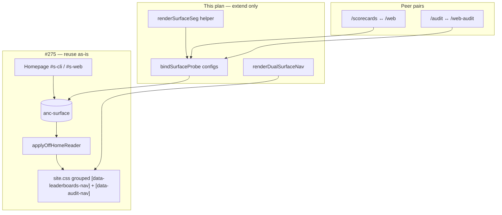

# feat: Audit surface nav (header + Probe A)

## Goal Capsule

Close the Audit primary-nav asymmetry deferred from
[`docs/plans/2026-08-26-002-feat-leaderboard-surface-nav-plan.md`](docs/plans/2026-08-26-002-feat-leaderboard-surface-nav-plan.md)
(R8/KD5 — **header dual-nav only**), and add session-scoped Probe A on `/audit` and `/web-audit` (KD1).

**Reuse mandate (session-settled):** Treat PR #275 as the sole pattern source. Extend and generalize shipped code —
`surface.ts`, `shell.mjs` dual-nav, `site.css` flip rules, board Probe A — rather than adding parallel Audit-specific
modules. STAR/DRY/SRP: one preference store, one probe binder, one segment markup helper, one shell dual-nav helper,
grouped CSS selectors.

**Authority:** session brief (header + Probe A; in-page contextual links stay fixed) > this plan > shipped #275 plan.

**Stop when:** Audit header follows preference (dual-anchor CSS flip, not href rewrite); both audit landing pages expose
Probe A that writes preference and navigates; board behavior unchanged; CONCEPTS updated; tests extend existing suites
only; no new storage key; no in-page prose link rewrites.

---

## Product Contract

### Summary

Visitor surface preference already drives Leaderboards and homepage try-forms. Audit header still always links to
`/audit`. Extend the shipped mechanism so Audit nav and audit-landing Probe A behave like Leaderboards and board Probe
A, reusing the same storage key and client bundle.

### Requirements

- **R1.** Reuse existing `anc-surface` (`cli` | `web`); default `cli` when absent/invalid — no new key.
- **R2.** When surface is `web`, visible header Audit → `/web-audit`; when `cli`, → `/audit`.
- **R3.** Homepage `:has(#s-web:checked)` flips visible Audit anchor alongside Leaderboards (no-JS parity on `/`).
- **R4.** Off-homepage, `html[data-surface]` from storage flips both Leaderboards **and** Audit dual anchors (same
  reader as #275).
- **R5.** Probe A on `/audit` and `/web-audit`: `.seg` control; selecting the peer surface writes preference and
  full-page navigates (`/audit` ↔ `/web-audit`).
- **R6.** Do not write preference on mere visit to `/audit` or `/web-audit` (bookmark, external link).
- **R7.** Header Audit reflects **stored preference**, not current pathname (same R9 policy as Leaderboards).
- **R8.** In-page contextual links (e.g. `content/web-audit.md` footer → `/audit`, install → `/audit`, board CTAs →
  `/web-audit`) stay as authored — not preference-flipped.

### Key Decisions

- **KD1.** Header + Probe A only; no Probe A on `/web/scoring`, scorecard pages, or skill subpages beyond checked-state
  on `/web-audit/*`. `(session-settled: user-directed — header + Probe A from ce-plan invoke)`
- **KD2.** Generalize #275 probe binding into one data-driven function; board and audit register configs — do not add
  `bindAuditProbe` copy-paste. `(session-settled: user-directed — STAR/DRY/SRP reuse mandate)`
- **KD3.** Extract shared Probe A HTML from board renderers into one build helper; audit widgets consume it — do not
  fork segment markup. `(session-settled: user-directed)`
- **KD4.** Shell: extract `renderDualSurfaceNav` from `renderLeaderboardsNav`; Leaderboards and Audit both call it.
  `(session-settled: user-directed)`
- **KD5.** CSS: extend existing `.site-nav` flip rules with grouped selectors for `[data-audit-nav]` — do not duplicate
  rule blocks. `(session-settled: user-directed)`
- **KD6.** Distinct audit probe radio ids (`audit-s-cli` / `audit-s-web`) and `[data-surface-audit-seg]` — never reuse
  `board-s-*` or homepage `#s-*` (same isolation rationale as KTD5 in #275). `(inherited from #275 KTD5)`

### Scope Boundaries

**In:** generalize `surface.ts`; dual Audit shell + grouped CSS; shared segment markup; Probe A on two audit landing
pages; CONCEPTS append; extend `tests/surface.test.ts`, `tests/build.test.ts`, `tests/e2e/flows.e2e.ts`.

**Out / deferred:** rewriting `content/*.md` cross-links; Probe A layout polish; `/web/scoring` peer nav; separate Audit
storage or script bundle.

### Acceptance Examples

- **AE1.** Cold visit → visible Audit href `/audit`.
- **AE2.** On `/`, select Website → visible Audit href `/web-audit`; Leaderboards still `/web` (existing).
- **AE3.** Reload with storage `web` → visible Audit `/web-audit` on any page.
- **AE4.** On `/audit`, Probe A Website → storage `web`, navigate to `/web-audit`.
- **AE5.** Bookmark `/web-audit`, empty storage → visible Audit `/audit`; storage unchanged.
- **AE6.** No-JS on `/`: Website segment → visible Audit `/web-audit` via `:has`.
- **AE7.** No-JS on `/audit` or `/web-audit`: segment renders but does not navigate (documented, same as boards).
- **AE8.** Contextual cross-links stay fixed: e.g. `content/web-audit.md` footer still links to `/audit`; web board hero
  still links to `/web-audit` — preference does not rewrite prose CTAs.

---

## Planning Contract

### Assumptions

- `#275` is merged on `dev`; this is a **generalization slice + audit extension** on the same client module and CSS
  contract (board refactors land first, then audit config).
- Nav link count becomes **8 total / 7 visible** (one hidden Leaderboards + one hidden Audit).
- `auditHref()` is a thin test/diagnostic wrapper like `leaderboardsHref()` — production uses dual anchors + CSS only.

### Key Technical Decisions

- **KTD1.** **Single probe binder (DRY/SRP):** Refactor shipped `bindBoardProbe` into `bindSurfaceProbe(config)` where
  `config` carries: `segSelector`, `cliRadioId`, `webRadioId`, `isOnCli(path)`, `isOnWeb(path)`, `peerHref(surface)`.
  Register board config (unchanged behavior) and audit config in `init()`. No third bind function.
- **KTD2.** **Href map in one place:** Add audit paths beside existing board constants in `surface.ts`: `CLI_AUDIT_HREF
  = '/audit'`, `WEB_AUDIT_HREF = '/web-audit'`. Export `auditHref()` mirroring `leaderboardsHref()`. Board and audit
  peer navigations read from the same constants table.
- **KTD3.** **Shell helper (DRY):** Replace inline `renderLeaderboardsNav` body with `renderDualSurfaceNav({ label,
  cliHref, webHref, dataNavAttr, path, cliCurrent, webCurrent })`. Audit entry calls same helper with `data-audit-nav`,
  `/audit`, `/web-audit`, and current predicates: `cli: path === '/audit'`, `web: path === '/web-audit' ||
  path.startsWith('/web-audit/')`.
- **KTD4.** **CSS grouping (DRY):** Append `[data-audit-nav]` to every existing Leaderboards nav visibility rule in
  `site.css` (default hide web anchor; `body:has(#s-web:checked)` swap; `html[data-surface="web"]` swap). One behavior,
  two nav labels.
- **KTD5.** **Shared segment markup (DRY):** Add `renderSurfaceSeg({ dataAttr, radioName, cliId, webId, checked,
  ariaLabel })` in `src/shared/surface-seg.mjs` — same import layer as `scorecard-format.mjs`, usable from build
  (`scorecards-render.mjs`, `07-subpages.mjs`) and Worker (`leaderboard-render.ts`). `radioName` must differ per surface
  (`board-surface` vs `audit-surface`) per KD6. Refactor board renderers to call it (no visual/behavior change). Audit
  widgets prepend the helper with `data-surface-audit-seg`, `audit-s-cli` / `audit-s-web`, checked per page.
- **KTD6.** **No new scripts:** Audit landing pages already get `/js/surface.js` via shell; do not add body scripts or
  duplicate bundle entries.

### High-Level Technical Design

### Product Contract preservation

`ce-plan-bootstrap` from session; no upstream brainstorm. Header dual-nav closes #275 R8/KD5; audit Probe A is session
scope (KD1), not #275 deferred work.

---

## Implementation Units

### U1. Generalize surface client + dual Audit shell/CSS

**Goal:** One probe binder serves board and audit; Audit header dual anchors; CSS grouped with Leaderboards; board
behavior unchanged.

**Requirements:** R1–R4, R7; AE1–AE3, AE5–AE6; KD2, KD4, KD5; KTD1–KTD4, KTD6

**Dependencies:** none (#275 landed)

**Files:**

- modify `src/client/surface.ts`
- modify `src/build/shell.mjs`
- modify `src/styles/site.css`
- modify `tests/surface.test.ts`
- modify `tests/build.test.ts`

**Approach:**

1. Add audit href constants + `auditHref()` export.
2. Replace `bindBoardProbe` with `bindSurfaceProbe(config)`; register existing board config (same ids/selectors/paths as
   today) and audit config (`[data-surface-audit-seg]`, `audit-s-cli` / `audit-s-web`, on-cli: `path === '/audit'`,
   on-web: `/web-audit` prefix, peer: audit href constants).
3. Extract `renderDualSurfaceNav`; wire Leaderboards through it (refactor-only), add Audit via `renderNavLink`
   special-case mirroring Leaderboards.
4. Group CSS: duplicate each `[data-leaderboards-nav]` selector list to include `[data-audit-nav]` sibling selectors.

**Execution note:** Refactor board probe to shared binder first; run existing board e2e/unit before adding audit config
— proves zero regression before new surface.

**Patterns to follow:** shipped `surface.ts`, `shell.mjs` `renderLeaderboardsNav`, `site.css` lines 1257–1274

**Test scenarios:**

- `auditHref()` maps `cli` → `/audit`, `web` → `/web-audit` (extend existing `leaderboardsHref` describe block)
- Board probe config unchanged: existing `tests/surface.test.ts` + board e2e still pass after refactor
- Built shell: two `[data-audit-nav]` anchors; `aria-current` on `/audit` cli anchor only; on `/web-audit` web anchor
  only
- Built shell: Leaderboards dual-nav assertions unchanged (regression lock)
- AE1: cold dist homepage → visible Audit href `/audit`
- AE3: seed `web`, load `/about` → visible Audit `/web-audit`
- CSS structural: grouped audit selectors present alongside leaderboards in same rule blocks

**Verification:** `bun test tests/surface.test.ts tests/build.test.ts`; existing leaderboard e2e green before U2

---

### U2. Shared segment markup + audit Probe A

**Goal:** One HTML helper for all Probe A segments; audit landing pages get peer switch without duplicating board
markup.

**Requirements:** R5–R6; AE4, AE7; KD3, KD6; KTD5

**Dependencies:** U1

**Files:**

- create `src/shared/surface-seg.mjs`
- modify `src/build/scorecards-render.mjs`
- modify `src/worker/audit-web/leaderboard-render.ts`
- modify `src/build/07-subpages.mjs`
- modify `tests/build.test.ts`

**Approach:**

1. Implement `renderSurfaceSeg({ dataAttr, radioName, cliId, webId, checked: 'cli'|'web', ariaLabel })` returning the
   exact `.seg` markup shape already shipped on boards (`name="board-surface"` for boards, `name="audit-surface"` for
   audit).
2. Replace inline board segment strings in scorecards + web leaderboard renderers with helper calls (checked state
   unchanged).
3. Prepend helper output to `CLI_AUDIT_WIDGET` and `WEB_AUDIT_WIDGET` html in `07-subpages.mjs` inside `.audit-hero`
   (above hero title), with `data-surface-audit-seg` and correct `checked`.

**Patterns to follow:** existing `boardSurfaceSeg` strings in `scorecards-render.mjs` and `leaderboard-render.ts`

**Test scenarios:**

- Built `/scorecards/index.html`: still contains `data-surface-board-seg`, `board-s-cli` checked (regression)
- Built `/web/index.html`: `board-s-web` checked (regression)
- Built `/audit/index.html`: `data-surface-audit-seg`, `audit-s-cli` checked
- Built `/web-audit/index.html`: `audit-s-web` checked
- Markdown twins: no segment markup in `.md` output (widget md pointers unchanged)

**Verification:** build test grep for both seg attrs on respective pages; board HTML unchanged aside from import path

---

### U3. E2E + CONCEPTS (extend existing suites)

**Goal:** Lock Audit nav parity and probe navigation; document audit Probe A in glossary; update nav counts.

**Requirements:** R7–R8; AE2, AE4–AE7; all KDs

**Dependencies:** U1, U2

**Files:**

- modify `tests/e2e/flows.e2e.ts`
- modify `CONCEPTS.md`

**Approach:**

1. Extend `shell — grouped nav` tests: `8` total anchors, `7` visible; one visible `[data-audit-nav]` — update **all**
   count sites in `flows.e2e.ts` (desktop 1440 at ~305–306; laptop 1100/1180/1280 at ~319–320; overflow CDP block at
   ~351–352).
2. Extend homepage surface toggle describe: Audit href flip parallel to Leaderboards (scoped to
   `[data-audit-nav]:visible`).
3. Add `audit surface nav` describe mirroring `leaderboard surface nav`: stored preference off-home, cold `/web-audit`
   no write, Probe A `/audit` → `/web-audit` and reverse.
4. CONCEPTS **Visitor surface preference**: add Audit dual-nav + audit Probe A writers/readers; note no-JS audit landing
   gap (AE7).
5. Regression lock (AE8): grep built dist or source that `content/web-audit.md` footer href `/audit` and a web-board CTA
   href `/web-audit` remain present — no preference-driven rewrite of contextual links.

**Patterns to follow:** `tests/e2e/flows.e2e.ts` leaderboard surface nav block; CONCEPTS entry from #275

**Test scenarios:**

- Covers AE2: homepage Website → visible Audit `/web-audit`
- Covers AE4: `/audit` Probe A → `/web-audit` + storage `web`
- Covers AE5: cold `/web-audit` → visible Audit `/audit`, storage null
- Covers AE6: no-JS homepage Website → visible Audit `/web-audit`
- Covers AE8: built `web-audit` page still contains footer link to `/audit`; web board hero still links `/web-audit`
- Nav count 8/7 at 1440 and laptop widths (all four assertion sites)

**Verification:** e2e flows pass; CONCEPTS entry mentions Audit alongside Leaderboards

---

## Verification Contract

Local gate order per `AGENTS.md`: `bun run build` then `bun test`.

| Gate        | Command / check                                                                                   |
| ----------- | ------------------------------------------------------------------------------------------------- |
| Unit        | `bun test tests/surface.test.ts`                                                                  |
| Build/shell | `bun test tests/build.test.ts` (dual Audit + segment markup)                                      |
| E2E         | `bun test tests/e2e/flows.e2e.ts` (audit + nav count)                                             |
| Regression  | existing leaderboard surface e2e unchanged                                                        |
| Visual      | browser-verify Audit nav flip + Probe A on `/audit` and `/web-audit` (light + dark) per AGENTS.md |

---

## Definition of Done

- [ ] `bindSurfaceProbe` serves board and audit; no standalone `bindAuditProbe` / `bindBoardProbe`
- [ ] `renderDualSurfaceNav` serves Leaderboards and Audit; no duplicated nav HTML strings
- [ ] `renderSurfaceSeg` serves all three probe locations; board markup refactored, not forked
- [ ] CSS uses grouped selectors; Audit flip rules are not a copy-pasted second block
- [ ] Header Audit + Probe A behave per R1–R7; contextual in-page links untouched (R8)
- [ ] Tests extend existing files/describes; nav 8/7; board e2e still green
- [ ] CONCEPTS updated; browser-verify complete for CSS/HTML touch

---

## Risks & Dependencies

| Risk                                                            | Mitigation                                                     |
| --------------------------------------------------------------- | -------------------------------------------------------------- |
| Refactor breaks board Probe A                                   | U1 execution note: board config first, e2e before audit config |
| `/web-audit/*` skill pages mark Audit nav current on web anchor | Intended — same as shell `match` prefix                        |
| Grouped CSS selector typo hides both nav labels                 | Extend rules mechanically; build + e2e visible-count asserts   |

**Dependency:** #275 on `dev` (`533278a` or later).

---

## Sources & Research

- Shipped plan: `docs/plans/2026-08-26-002-feat-leaderboard-surface-nav-plan.md`
- Implementation: `src/client/surface.ts`, `src/build/shell.mjs`, `src/styles/site.css`, board renderers
- Session scope: header + Probe A; in-page links out; STAR/DRY/SRP reuse mandate
- External research: skipped — three direct local examples (#275)
