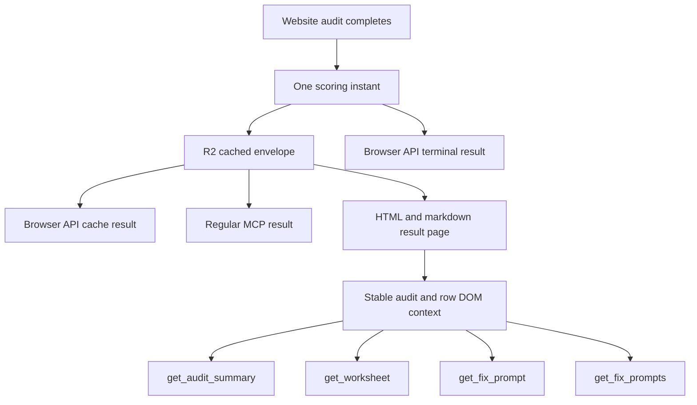
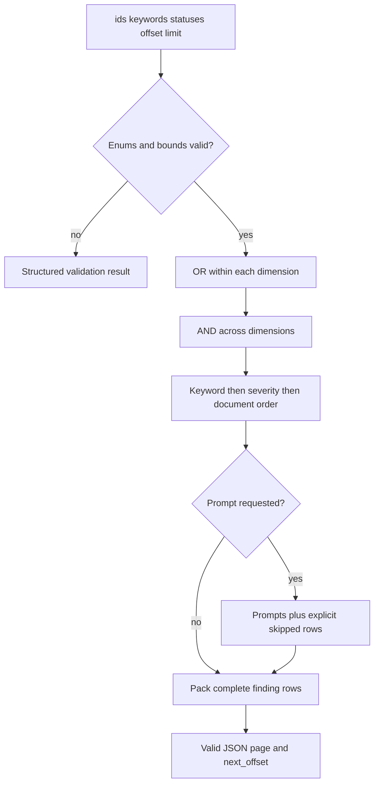

# Improve web-audit agent remediation and freshness - Plan

## Goal Capsule

- **Objective:** An agent can inspect any website audit, identify every relevant finding, retrieve complete remediation prompts by normative priority and exact result status, and tell when every returned per-target audit was scored and when it becomes refreshable.
- **Means:** A stable server-rendered audit context, one shared finding selector, paginated WebMCP result tools, and one response-envelope freshness helper shared by browser and regular MCP paths (KTD2-KTD7).
- **Authority:** The confirmed session scope, the schema 0.4 contracts on `origin/dev`, and the agent-native no-fetch boundary for result-page WebMCP tools.
- **Stop:** Do not ship if any observed `must`, `should`, or `may` finding with status `noncompliant`, `broken`, or `absent` is unreachable; if a prompt is cut by the 1,500-character WebMCP cap; if cache metadata differs between storage and a response; or if WebMCP can start an audit or bypass Turnstile.
- **Open blockers:** None.
- **Execution profile:** Start in an isolated worktree on a `feat/...` branch from current `origin/dev`. Build before tests. Verify rendered result pages through the Worker preview in both themes, then verify the staging response contracts after the PR reaches `dev`.
- **Tail:** Remove abandoned selectors, duplicate status lists, and temporary fixtures before completion. Keep CLI scoring, leaderboard aggregates, and audit-triggering WebMCP tools out of the diff.

---

## Product Contract

### Summary

Improve the website-audit result surface so WebMCP exposes complete, filterable findings and remediation without depending on an on-page copy control. Add `get_audit_summary` and filtered batch prompt retrieval. Add `cached`, `scored_at`, and `refresh_after` to every successful per-target website-audit result surface, including the browser API, regular MCP, rendered HTML and markdown, and the WebMCP tools derived from those pages.

### Problem Frame

The current WebMCP worksheet only selects `broken` and `absent` rows. On `origin/dev`, `noncompliant` is also an actionable schema 0.4 status, so an agent can miss a real fix. Row priority and prompt data are carried on a conditional hidden prompt element rather than the row itself. This caused `mcp-modern-tools-list` to lose its `must` keyword and made `get_fix_prompt` claim that no prompt existed even though the remediation catalog contained one.

The audit cache already records `scored_at`, and the five-minute staleness threshold is authoritative. Most response surfaces discard that information. Agents therefore cannot distinguish a fresh result from a cache hit or know when a recheck can produce new evidence.

### Key Decisions

- KD1. **Every website-audit result surface carries freshness.** (session-settled: user-directed — chosen over WebMCP-only metadata because every consumer needs to diagnose stale results.) Governs R10-R14.
- KD2. **Agents select remediation by normative priority and exact result status.** (session-settled: user-directed — chosen over a fixed MUST-only workflow because the requested remediation set varies by task.) Governs R2-R8.
- KD3. **Implementation uses a feature branch from updated `origin/dev`.** (session-settled: user-directed — chosen over modifying the existing dirty feature branch so the work includes schema 0.4 and preserves unrelated Sounding changes.) Governs R15.

### Requirements

**Finding and remediation access**

- R1. Every rendered check row exposes its canonical `id`, `keyword`, `tier`, `status`, and `unprobed` state independently of prompt availability.
- R2. WebMCP filters use independent `ids`, `keywords`, and `statuses` dimensions. Values within a dimension are ORed, and dimensions are ANDed.
- R3. `keywords` accepts `must`, `should`, and `may`; `statuses` accepts `pass`, `noncompliant`, `broken`, `absent`, `n_a`, `skip`, and `error` from schema 0.4.
- R4. Omitted filters select every observed remediable finding across all keywords: `noncompliant`, `broken`, and `absent`, excluding `unprobed` rows.
- R5. `get_worksheet` returns every matching finding with `id`, `keyword`, `tier`, `status`, `unprobed`, and `remediable` fields in deterministic priority order.
- R6. `get_fix_prompt` returns structured data for one ID. It returns the complete prompt for an observed remediable row, an explicit reason for a known non-remediable row, and an explicit unknown-ID result for an absent row.
- R7. `get_fix_prompts` supports the shared filters and returns complete prompt items plus explicit skipped items for selected rows that are not remediable.
- R8. Worksheet, summary issue rows, and batch remediation use bounded `offset` and `limit` pagination with `total`, `returned`, `omitted`, and `next_offset`; output remains valid JSON and never cuts through an item or prompt.
- R9. `get_audit_summary` returns `site_score`, `global_score`, complete counts for all seven statuses, cache freshness, and paginated issues. Issues include observed `noncompliant`, `broken`, and `absent` rows plus `error` rows marked `remediable: false`.

**Freshness and response parity**

- R10. Every successful per-target result-bearing response exposes `cached: boolean`, `scored_at: string | null`, and `refresh_after: string | null` outside the scorecard schema.
- R11. A cache-served result reports `cached: true`; a result produced by the current audit reports `cached: false`, even when that result is persisted before the response completes.
- R12. `refresh_after` is derived from the same authoritative `scored_at` instant plus `WEB_AUDIT_STALE_AFTER_MS`. It is never stored separately.
- R13. Cache hits, stale cached results served while auditing is disabled, and `public_listing`-only patches preserve the stored scoring instant. Legacy entries with a missing or invalid instant return `scored_at: null` and `refresh_after: null`.
- R14. Freshness covers `/api/audit-web` result JSON and terminal NDJSON events, `get_website_audit`, `audit_website`, `/web/<domain>` HTML and markdown, and the result-page WebMCP outputs. It excludes interim stream events, leaderboard/list responses, static remediation catalog responses, transport errors, and no-scorecard outcomes.

**Compatibility and trust boundary**

- R15. Implementation starts from updated `origin/dev`, where web scorecard schema 0.4 and the canonical `noncompliant` behavior already exist.
- R16. `mcp-modern-tools-list` is a regression fixture, not a special case; it resolves `keyword: must` from the authoritative registry and remediation from the authoritative catalog.
- R17. Result-page WebMCP tools remain read-only and DOM-only. They do not fetch, submit `/api/audit-web`, navigate to `/web/scoring`, or bypass the human Turnstile flow.
- R18. CLI scorecard schemas and CLI scoring responses do not change.

### Key Flows

- F1. **Orient from a result page**
  - **Trigger:** An agent opens `/web/<domain>` after an audit or from a stored share URL.
  - **Steps:** The server renders scores, complete counts, row metadata, and freshness; `get_audit_summary` reads that context and returns the first issue page.
  - **Outcome:** The agent knows the audit state and whether a fresh run can produce new evidence.
- F2. **Build a targeted worksheet**
  - **Trigger:** The agent calls `get_worksheet` with no filters or with selected keywords and statuses.
  - **Steps:** One shared selector validates filters, intersects dimensions, orders rows, and packs a complete page under the output cap.
  - **Outcome:** Every matching row is reachable through continuation metadata.
- F3. **Retrieve remediation**
  - **Trigger:** The agent requests one ID or a filtered batch.
  - **Steps:** The selector resolves canonical row metadata; prompt eligibility follows the observed-remediable predicate; pagination emits only whole prompt items.
  - **Outcome:** Actionable rows return remediation, while non-remediable and unknown rows return explicit reasons.
- F4. **Read or refresh through browser and MCP APIs**
  - **Trigger:** A client reads a cache hit, changes `public_listing`, or completes a fresh audit.
  - **Steps:** The response uses one freshness helper and the same scoring instant as persistence.
  - **Outcome:** All per-target result surfaces agree on provenance and timestamps.

### Acceptance Examples

- AE1. Given `mcp-modern-tools-list` is an observed `noncompliant` row with `tier: required`, when an agent calls the default worksheet, then the row reports `keyword: must` and `remediable: true`.
- AE2. Given findings across all three keywords and all seven statuses, when filters specify `keywords: [must, should]` and `statuses: [noncompliant, absent]`, then results include the union within each array and the intersection across arrays.
- AE3. Given a `pass`, `n_a`, `skip`, `error`, or `unprobed` row, when an agent requests its prompt, then the response identifies the row and explains why remediation is unavailable without fabricating a prompt.
- AE4. Given more matching prompts than fit in 1,500 characters, when an agent requests a batch, then the response is valid JSON containing only whole items and a `next_offset` that retrieves the next item.
- AE5. Given a cached result scored at `T`, when any per-target cache-read surface returns it, then `cached` is `true`, `scored_at` is `T`, and `refresh_after` is exactly `T + 300000ms`.
- AE6. Given a fresh completed audit, when persistence and terminal responses finish, then storage and every response use one identical scoring instant and report `cached: false`.
- AE7. Given a stale cached result while auditing is disabled, when the result is served, then it reports `cached: true` and a `refresh_after` in the past.
- AE8. Given a legacy cache entry without a valid timestamp, when it must be served, then it reports `cached: true`, `scored_at: null`, and `refresh_after: null`.

### Scope Boundaries

**In scope**

- Result-page WebMCP worksheet, summary, individual remediation, and batch remediation contracts.
- Website-audit freshness metadata on successful per-target result-bearing browser, MCP, HTML, markdown, and WebMCP surfaces.
- Shared client selection behavior with the human assembled-prompt widget when it prevents status or priority drift.
- Published documentation and operational verification for the changed contracts.

### Deferred to Follow-Up Work

- Per-entry freshness on `list_website_audits`, `/web`, and homepage board aggregates. Those are inventory surfaces with a separate aggregate schema, not per-target audit results.
- Cursor tokens or a larger WebMCP response limit if offset pagination proves insufficient for future prompt sizes.

**Out of scope**

- CLI scorecard and live CLI scoring metadata.
- Changing audit weights, status vocabulary, applicability, or web scorecard schema 0.4.
- A WebMCP tool that starts an audit, solves Turnstile, or calls the regular MCP endpoint.
- Special-case behavior for individual check IDs.

---

## Planning Contract

### Key Technical Decisions

- KTD1. **Use `origin/dev` as the implementation base in an isolated worktree.** The current checkout is a dirty `feat/sounding-recording` branch and predates schema 0.4. The executor verifies the worktree HEAD against `origin/dev` before editing. Implements KD3 and R15.
- KTD2. **Make the rendered row the canonical WebMCP record.** Every `.web-check[data-id]` carries stable row metadata. Prompt text remains a separate conditional child because eligibility depends on status and `unprobed`. Implements R1, R6, and R16.
- KTD3. **Centralize selection and prompt eligibility.** One browser-safe selector owns exact enum validation, OR-within/AND-across filtering, deterministic order, pagination, and the observed-remediable predicate used by the human widget and WebMCP tools. Implements KD2 and R2-R9.
- KTD4. **Paginate whole JSON items under the existing execution cap.** Packing reserves space for pagination metadata and never applies a blind string slice to serialized JSON or a prompt. A build-time test proves each individual prompt can fit the direct lookup contract. Implements R8.
- KTD5. **Keep freshness in an outer envelope.** A shared `WebAuditFreshness` shape prevents response drift without changing the persisted scorecard or bumping schema 0.4. Implements KD1 and R10-R14.
- KTD6. **Capture one scoring instant.** The fresh-audit path supplies or receives the exact timestamp used by the cache writer, and every caller derives `refresh_after` from that snapshot. Independent `Date.now()` calls do not define one response. Implements R12 and R13.
- KTD7. **Treat `cached` as response provenance.** Existing-cache reads and listing-only patches report `true`; current-run results report `false`. The value does not mean whether a new result was successfully persisted. Implements R11.
- KTD8. **Keep WebMCP behind the rendered-page trust boundary.** New tools inspect DOM state only and preserve the no-fetch/no-submit iron rule. Implements R17 and R18.

### High-Level Technical Design

### Response Surface Matrix

| Surface | Result shape | Freshness behavior |
| --- | --- | --- |
| `/api/audit-web` cache hit or listing patch | JSON | `cached: true`; stored or null timestamps |
| `/api/audit-web` fresh completion | Terminal NDJSON event | `cached: false`; completion timestamp |
| `get_website_audit` hit | MCP tool result | `cached: true`; stored or null timestamps |
| `audit_website` cached, patched, or stale-disabled result | MCP tool result | `cached: true`; stored or null timestamps |
| `audit_website` fresh completion | MCP tool result | `cached: false`; completion timestamp |
| `/web/<domain>` HTML and markdown | Rendered cached result | `cached: true`; stored or null timestamps |
| Result-page WebMCP tools | DOM-derived JSON | Mirrors rendered result context |

No-scorecard responses and interim discovery/check events do not carry freshness. Static remediation and leaderboard/list tools are not audit-result surfaces.

### System-Wide Impact

- **Agents:** Gain complete findings, explicit filter semantics, continuation, and reliable freshness without invoking a network-capable browser tool.
- **Humans:** The assembled-prompt widget and visible result-page freshness use the same finding and timestamp facts as agents.
- **Operators:** Stale-disabled responses become diagnosable. The existing kill switches, cache-first gate order, rate limits, and Turnstile boundary remain unchanged.
- **Developers:** Cache metadata remains outside scorecard schema 0.4. Shared helpers replace duplicated status and timestamp logic across Worker and browser clients.

### Risks and Mitigations

- **Stale implementation base:** The current branch lacks schema 0.4. Mitigate by creating the implementation worktree from verified `origin/dev` and confirming `noncompliant` exists before edits.
- **Output-cap corruption:** JSON truncation can make omitted findings unreachable. Mitigate through whole-item packing, bounded pagination, and cap assertions on every result tool.
- **Predicate drift:** Worker remediation, clipboard assembly, and WebMCP can disagree on eligibility. Mitigate with one shared selector or one shared browser-safe predicate plus cross-surface parity tests.
- **Timestamp drift:** Separate clocks can disagree at the staleness boundary. Mitigate with one captured instant passed through persistence and response creation.
- **Legacy cache ambiguity:** Old entries may lack a parseable timestamp. Mitigate with explicit nulls and the existing stale treatment; never synthesize a recent score time.
- **Rendered-page regression:** Adding context attributes and visible freshness changes component HTML. Mitigate with format tests and real Worker-preview verification in light and dark themes.

### Research Sources

- `src/worker/audit-web/scorecard.ts`, `src/worker/audit-web/remediation.ts`, and `content/web-scorecard-schema.md` on `origin/dev` define schema 0.4 statuses and remediation eligibility.
- `src/worker/audit-web/cache.ts` defines `CachedWebAudit.scored_at` and `WEB_AUDIT_STALE_AFTER_MS`.
- `src/worker/audit-web/summary-render.ts` and `src/client/webmcp-result.ts` show the conditional child-attribute seam that loses row context.
- `src/client/assemble-prompt.ts` provides the existing pure client-side selection pattern.
- `docs/solutions/design-patterns/derive-cached-record-display-metadata-at-read-time.md` establishes stable-ID read-time enrichment for cached scorecards.
- `docs/solutions/conventions/duplicate-evaluation-of-a-staleness-ttl-predicate-races-at-the-boundary.md` requires one time snapshot for a staleness decision and its response.
- `docs/solutions/best-practices/live-target-e2e-design-for-server-side-state.md` requires explicit cache-hit and cache-miss coverage on persistent live targets.

---

## Implementation Units

### U1. Establish the freshness primitive and timestamp boundary

- **Goal:** Define one website-audit freshness contract and make fresh persistence use the same scoring instant as every response.
- **Requirements:** R10-R13; KTD5-KTD7.
- **Dependencies:** None.
- **Files:** `src/worker/audit-web/cache.ts`, `tests/web-audit-cache.test.ts`.
- **Approach:**
  1. Add a shared shape and derivation helper for `cached`, normalized `scored_at`, and computed `refresh_after`.
  2. Adjust the cache-write boundary so the fresh path can supply or receive the exact persisted scoring instant without a second clock read.
  3. Preserve the timestamp on listing-only patches and map missing or invalid legacy stamps to explicit nulls.
- **Patterns to follow:** `isStale`, `WEB_AUDIT_STALE_AFTER_MS`, and scored-at-preserving dual writes in `src/worker/audit-web/cache.ts`.
- **Test scenarios:**
  - Covers AE5. A fixed valid scoring instant derives a refresh instant exactly 300000ms later.
  - Covers AE6. A fresh write round-trips the same instant supplied to its response metadata.
  - Covers AE7. A valid old instant remains unchanged and derives a refresh instant in the past.
  - Covers AE8. Missing, invalid, and unparseable legacy stamps produce null timestamps and remain stale.
  - A listing-only patch preserves the prior instant in both the body and R2 custom metadata.
- **Verification:** Cache tests prove one timestamp source, exact derivation, patch preservation, and legacy behavior without changing the scorecard payload.

### U2. Apply freshness to browser and regular MCP result envelopes

- **Goal:** Make every successful per-target API and MCP result use the shared freshness contract.
- **Requirements:** R10-R15, R18; F4; AE5-AE8.
- **Dependencies:** U1.
- **Files:** `src/worker/audit-web/route.ts`, `src/client/web-audit-scoring.ts`, `src/worker/mcp/tools/web-audit.ts`, `tests/web-audit-routes.test.ts`, `tests/web-audit-mcp-tools.test.ts`.
- **Approach:**
  1. Preserve the cached envelope in read helpers that currently return only `scorecard`.
  2. Add freshness to browser cache hits, stale-disabled hits, listing patches, fresh terminal events, and the equivalent regular MCP result branches.
  3. Keep progress events, transport errors, misses, disabled-without-result, and static/list tools outside the result-bearing contract.
  4. Update tool descriptions and client response types so callers can rely on the fields.
- **Execution note:** Start with fixed-clock contract tests for every terminal branch before changing response construction.
- **Patterns to follow:** Cache-first gate ordering and cross-tool enriched-scorecard parity in `tests/web-audit-mcp-tools.test.ts`.
- **Test scenarios:**
  - A browser cache hit and stale-disabled hit report `cached: true` with the stored timestamps.
  - A browser listing patch reports `cached: true` and preserves the stored scoring instant.
  - A browser fresh terminal event reports `cached: false` and the instant persisted by U1.
  - `get_website_audit` and every scorecard-bearing `audit_website` branch report the same three fields as the browser path.
  - A legacy cached entry reports `cached: true` with null timestamps.
  - Interim discovery/check events and no-scorecard results retain their existing shapes.
  - Existing rate-limit, kill-switch, and public-listing tests prove gate ordering is unchanged.
- **Verification:** Browser and MCP tests assert byte-identical freshness values for equivalent states while all prior gating and scorecard-enrichment behavior remains green.

### U3. Render stable audit context and canonical row metadata

- **Goal:** Make HTML and markdown result pages expose complete row and freshness facts independently of prompt controls.
- **Requirements:** R1, R9-R17; F1; AE1, AE5, AE7, AE8.
- **Dependencies:** U1.
- **Files:** `src/worker/audit-web/route.ts`, `src/worker/audit-web/summary-render.ts`, `tests/web-audit-scorecard-format.test.ts`, `tests/web-audit-routes.test.ts`.
- **Approach:**
  1. Preserve the cached envelope in result-page lookup and pass freshness into both renderers.
  2. Render concise human-readable scored/refresh information in HTML and markdown plus one stable page-level machine context for scores, counts, and freshness.
  3. Put canonical `data-keyword`, `data-tier`, `data-status`, and `data-unprobed` attributes on every `.web-check[data-id]` root.
  4. Keep prompt carriers conditional on the existing observed-remediable rule.
- **Patterns to follow:** Read-time category/remediation enrichment in `src/worker/audit-web/display.ts` and HTML/markdown parity in `src/worker/audit-web/summary-render.ts`.
- **Test scenarios:**
  - Covers AE1. `mcp-modern-tools-list` renders `data-keyword="must"` on the row and a complete remediation carrier when observed and actionable.
  - Every schema 0.4 status renders canonical root metadata, including rows without prompt carriers.
  - An `unprobed` actionable-status row exposes its state but does not render remediation.
  - HTML and markdown show the same scoring and refresh instants for valid, stale, and legacy entries.
  - Existing evidence escaping and no-dead-control markdown rules remain green.
- **Verification:** Format and route tests prove a complete DOM contract and equivalent human-readable freshness. The Worker preview renders the page legibly in light and dark themes.

### U4. Add shared filtering, audit summary, and paginated remediation tools

- **Goal:** Give agents complete, composable, cap-safe access to findings and remediation while keeping human prompt assembly in parity.
- **Requirements:** R2-R9, R16-R18; F1-F3; AE1-AE4.
- **Dependencies:** U3.
- **Files:** `src/client/assemble-prompt.ts`, `src/client/clipboard.ts`, `src/client/webmcp-result.ts`, `src/client/webmcp-lib.ts`, `tests/web-audit-assemble-prompt.test.ts`, `tests/webmcp.test.ts`.
- **Approach:**
  1. Generalize the pure finding selector around exact `ids`, `keywords`, and `statuses` filters, shared eligibility, deterministic ordering, and bounded pagination.
  2. Keep `get_fix_prompt({id})`, expand `get_worksheet`, and add `get_fix_prompts` plus `get_audit_summary` with strict schemas and structured JSON results.
  3. Pack only complete items under `EXECUTE_MAX`; expose continuation and skipped-row reasons.
  4. Keep the clipboard widget's default user behavior while replacing its duplicated MUST/SHOULD/MAY selection logic with the shared selector.
- **Execution note:** Add the status-by-keyword matrix and cap-boundary tests first; these are the contract that prevents future findings from disappearing.
- **Patterns to follow:** Pure selection in `src/client/assemble-prompt.ts`, tool registration in `resultTools`, and the WebMCP iron-rule tests.
- **Test scenarios:**
  - Covers AE1. Default worksheet and direct prompt retrieval include `mcp-modern-tools-list` with `keyword: must`.
  - Covers AE2. Filters OR values within `keywords` and `statuses`, AND across dimensions, and intersect with `ids`.
  - Unknown enums, empty filter arrays, invalid offsets, and invalid limits return structured validation results without throwing.
  - Default selection includes observed `noncompliant`, `broken`, and `absent` findings across all keywords and excludes `unprobed` rows.
  - Explicit all-status selection returns `pass`, `n_a`, `skip`, and `error` context without fabricated prompts.
  - Covers AE3. Direct and batch remediation return explicit reasons for known non-remediable, unprobed, and unknown rows.
  - Covers AE4. Large worksheets and prompt batches remain valid JSON, contain whole items, stay at or below `EXECUTE_MAX`, and continue without duplicates or gaps.
  - Summary scores and counts equal the rendered audit context; issues include actionable rows and non-remediable `error` rows.
  - Tool names, descriptions, schemas, read-only annotations, bundle contents, and no-fetch/no-submit assertions cover the two new tools.
- **Verification:** WebMCP tests prove every status and keyword is selectable, every actionable prompt is reachable, pagination is lossless, and the tools remain DOM-only.

### U5. Publish the contracts and verify the deployed agent loop

- **Goal:** Document the response and WebMCP contracts and prove fresh and cached behavior on the real Worker surface.
- **Requirements:** R2-R18; AE1-AE8.
- **Dependencies:** U2-U4.
- **Files:** `content/web-audit.md`, `content/mcp-skill.md`, `content/web-scorecard-schema.md`, `docs/runbooks/web-audit-operations.md`, `tests/e2e/web-audit.e2e.ts`, `tests/e2e/discoverability.e2e.ts`.
- **Approach:**
  1. Document exact filter enums, default selection, pagination, remediation eligibility, and the freshness response envelope.
  2. Clarify that freshness is outside scorecard schema 0.4 and that list/board surfaces are outside this contract.
  3. Add live-shaped E2E assertions for rendered audit context and WebMCP discovery without creating a browser-origin audit path.
  4. After the feature PR reaches `dev`, verify staging once on a fresh terminal path where available and immediately again through cached browser, regular MCP, HTML/markdown, and WebMCP reads.
- **Patterns to follow:** `content/mcp-skill.md` tool contract examples and `docs/solutions/best-practices/live-target-e2e-design-for-server-side-state.md` for persistent-state verification.
- **Test scenarios:**
  - Published examples use schema 0.4 exact enums and match registered WebMCP input schemas.
  - Live-shaped HTML exposes the audit context and all result tools without exposing an audit-submission tool.
  - A fresh terminal response and its immediate cache read agree on `scored_at` and `refresh_after` while differing correctly on `cached` provenance.
  - The staging regression audit can retrieve the `mcp-modern-tools-list` remediation and reports no unreachable observed actionable findings.
- **Verification:** Documentation checks, E2E tests, staging deployment checks, and the repeat fresh/cache audit demonstrate the complete agent remediation loop.

---

## Verification Contract

| Gate | Applies to | Done signal |
| --- | --- | --- |
| `bun run build` | U1-U5 | Generated assets and WebMCP bundle reflect the branch before tests read `dist/`. |
| `bun run typecheck` | U1-U5 | Worker, browser client, and build-time TypeScript contracts agree. |
| `bun run lint` | U1-U5 | Biome and markdown lint pass with the new source and documentation. |
| Targeted Bun tests | U1-U4 | Cache, HTTP, MCP, rendering, selector, and WebMCP contract suites pass. |
| `bun test` | U1-U5 | Full unit and regression suite passes after the current build. |
| `bun run deploy:dryrun` | U2-U5 | Wrangler accepts the Worker and generated asset graph. |
| `bun run dev` on port 8787 | U3-U4 | `/web/<domain>` renders in both themes and result tools read the expected DOM context. |
| Targeted Playwright E2E | U5 | Discoverability and web-audit flows expose the documented tools and metadata without WebMCP network submission. |
| Feature PR checks | U1-U5 | Every required GitHub check concludes `SUCCESS` before merge to `dev`. |
| Staging verification | U5 | The deployed staging result passes fresh and immediate cached checks, including `mcp-modern-tools-list`. |

The local gate order is build, typecheck, lint, targeted tests, full tests, and dry-run deploy. Browser verification follows the unit tests because component HTML changes. Staging verification follows the repository PR workflow and must account for persistent cache state rather than assuming every call is fresh.

---

## Definition of Done

- U1 is done when one authoritative scoring instant controls storage and derived freshness, including legacy-null and patch-preservation cases.
- U2 is done when every successful per-target browser and regular MCP result branch carries the same freshness contract and existing gates remain unchanged.
- U3 is done when HTML and markdown expose equivalent freshness and every result row carries complete canonical metadata independent of remediation.
- U4 is done when agents can filter all exact schema 0.4 statuses and priorities, retrieve every observed actionable prompt through valid paginated JSON, and obtain a complete audit summary under the WebMCP cap.
- U5 is done when public docs match the shipped schemas, CI is green, staging serves the new tools and fields, and fresh-then-cached verification succeeds.
- The implementation branch starts from verified `origin/dev`, uses the repository PR path to `dev`, and does not contain the unrelated dirty Sounding changes.
- No scorecard schema bump, CLI scoring change, leaderboard aggregate migration, Turnstile bypass, or WebMCP audit-submission path is present.
- No dead-end helpers, duplicate status predicates, temporary diagnostics, stale generated output, or abandoned experiment code remains in the final diff.
