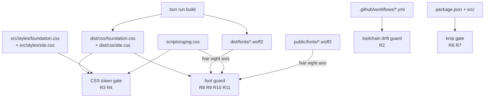
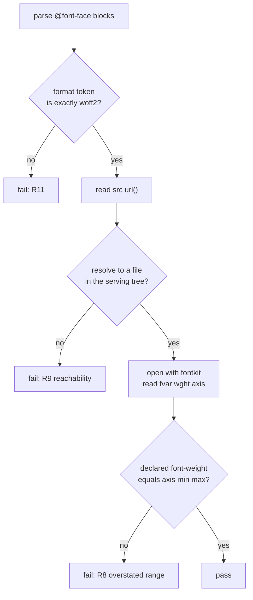

# Toolchain and asset-integrity gates - Plan

## Goal Capsule

- **Objective:** The declarations anc.dev ships stay true to the assets and packages behind them, and CI proves it
  before a deploy. Four integrity gaps are latent today — an invalid color declaration, three overstated font ranges,
  one package the Worker imports that nothing declares, and a build toolchain whose local and CI halves disagree — and
  this work makes each unshippable going forward. Two of the four have no reader-visible symptom now, so their PRs are
  expected to show no visual change; the value is that the next one cannot ship quietly.
- **Means:** Close each gap with a deterministic gate, then fix what the gate finds (KTD1, KTD3, KTD5).
- **Authority:** R-IDs win on required behavior. KTDs win on mechanism inside those constraints. Units override neither.
- **Execution profile:** Test-first throughout. Every gate is written and **observed failing against the unfixed tree**
  before its fix lands. A gate seen only green proves nothing.
- **Stop conditions:** Stop and ask if bumping Bun changes any built artifact beyond the three known per-build
  timestamps; if `knip` cannot reach zero on the three gated categories without ignoring a real finding; or if
  correcting a font-weight range changes the rendered OG card hash.
- **Tail ownership:** This plan ends at merged PRs on `dev`. It does not cover release to `main`.

---

## Product Contract

### Summary

Adopt four gaps found by comparing this repo against `meum-sites`, which has been running a parity effort against it.
Each gap was verified live here rather than taken on the sibling's word, and each fix is paired with a gate that makes
the class unshippable: one Bun version across every workflow, a CSS custom-property resolution check, a `knip` dead-code
gate on `bun run lint`, and a font guard that asserts against built output and against the font binaries themselves.

### Problem Frame

`meum-sites` merged 26 PRs in the last seven days. Ten cite "agentnative-site parity triage" — they are ports *from*
here. Four are not, and all four named conditions still live in this repo.

Two of the four share a cause: `bun test` does not render a page, does not resolve a CSS cascade, and does not read a
font binary. `AGENTS.md` § "Browser-verify before declaring done" exists because a token typo shipped near-invisible
dark-mode text past a green suite. The undefined `--fg` token and the three overstated font-weight ranges are that same
shape, still open.

The other two are configuration drift rather than unrendered artifacts. Five workflow sites pin Bun 1.3.11 while
developers run 1.4.0, and no test compares them, so the halves can diverge indefinitely without a signal. Separately,
`@cloudflare/containers` is imported by Worker source and declared in no manifest, resolving only transitively through
`@cloudflare/sandbox`; nothing in the repo performs cross-module reachability or manifest analysis, because Biome's
recommended preset is per-file and `tsconfig.json` sets no `noUnusedLocals`.

### Key Decisions

- **Adopt all four gaps, not a subset** (session-settled: user-directed — chosen over the two-item "small and
  independent" subset). Each is small, independent, and shares one review pass. Two share the unrendered-artifact cause;
  the other two are configuration drift. Governs R1, R3, R5, R7.
- **Ship the gate and its fix in the same PR.** Every unit that corrects a defect is preceded by a unit that adds the
  gate catching it, and the pair merges together. Governs R2, R3, R5, R7, R8, R9, R10.

### Requirements

**Toolchain consistency**

- R1. One declared Bun version governs every workflow job and the `bun-types` package.
- R2. A test fails when any workflow names a Bun version literally, or when the per-workflow `BUN_VERSION` blocks
  disagree with each other or with `bun-types`.

**CSS token integrity**

- R3. Every `var(--token)` reference, with or without a fallback, resolves to a token defined in the set of stylesheets
  served together with it.
- R4. Every token reference in `src/styles/site.css` resolves without relying on an allowlist entry, except where the
  token is genuinely supplied at runtime by an external emitter.
- R5. The install-command copy button renders the same computed color it renders today, in both light and dark schemes.

**Dead-code and dependency integrity**

- R6. `bun run lint` fails on an unreachable source file, an unused declared dependency, or an import of a package no
  manifest declares.
- R7. Every npm package imported by Worker source is declared in a manifest, and no declared dependency goes unimported.
  Runtime built-in module schemes (`cloudflare:`, `node:`, `bun:`) are exempt — they have no npm package to declare.

**Font integrity**

- R8. Every `@font-face` declared weight range equals the `wght` axis range of the font file its `src` resolves to.
- R9. Every font URL a stylesheet references resolves to a file that exists in the tree that stylesheet is served from.
- R10. The font guard asserts against built output, not against source minified at test time.
- R11. Every `@font-face` declares its format as `woff2`, in source and in built output. The `woff2-variations` suffix
  is rejected in both the quoted and the unquoted spelling.

### Success Criteria

- Each of the four gates has been observed failing against the unfixed tree, with the real failure output quoted in its
  PR body. Not "would fail" — run.
- The install-command copy button's computed color is byte-identical before and after, measured in a browser in both
  schemes.
- `public/og-image.png` is byte-identical before and after the font-range narrowing.
- `bun run build && bun test && bun run lint && bun run typecheck` green locally on Bun 1.4.0 and in CI on the same
  version.

### Scope Boundaries

**Out of scope — checked and found already covered or defect-free:**

- Asset minification density (`meum-sites` #128). Measured: every built asset here runs 352–24,832 bytes per line, far
  above the 200-byte threshold indicating source density.
- Narrow-viewport overflow guard (`meum-sites` #126). Already present and broader — `tests/e2e/flows.e2e.ts` sweeps
  390/768/1440 and names the widest offending elements.
- Duplicate canonical mechanism (`meum-sites` #131). Blume-specific. `tests/site-origin.test.ts` already guards the
  canonical-versus-serving-origin split across MCP, HTML, twins, JSON, and WebMCP.
- Release-overlay `trash`-under-`xargs` and `--no-renames` bugs (`meum-sites` #117). Not applicable —
  `scripts/release/guarded-paths.sh` centralizes the guarded set and the one `trash` call has an `|| rm -f` fallback.

### Deferred to Follow-Up Work

- The 60 unused exports and 29 unused exported types `knip` reports. Gating them needs an ignore list for test-only
  hooks (`_resetWebShellTemplateCache`, `_internal`, `MODERN_META`, `CANONICAL_TEST_ORIGIN`) built first. U5 records
  this in `docs/TODOS.md`.

### Sources

- `meum-sites` #130 (knip gate), #132 (Bun 1.4.0 + font guard), #127 (the type-scale defect motivating the CSS gate).
- Measured here, 2026-08-31:
  - `.install-cmd__copy` computes `oklch(0.24 0.015 250)` light / `oklch(0.9 0.008 95)` dark — identical to `body`. With
    the declaration removed it computes `rgb(0,0,0)` / `rgb(255,255,255)`.
  - The existing `tests/font-face-src.test.ts` fails on `format("woff2-variations")` **and** `format(woff2-variations)`,
    at both Bun versions, because `WOFF2_FORMAT` is a positive match requiring an exact `woff2` token. Bun 1.3.11 emits
    the hint unquoted; 1.4.0 preserves quotes. The version difference does not change the test's verdict.
  - `bun install --frozen-lockfile --dry-run` succeeds under 1.4.0; `bun.lock` stays `lockfileVersion: 1`.
  - `fvar` `wght` axes: Monaspace Xenon 200–800, Uncut Sans 300–700, read independently via `fontTools` and `fontkit`,
    agreeing. `dist/fonts/`, `public/fonts/`, and `public/fonts/full/` all carry the same axes, so subsetting preserves
    them.
  - Weights requested by the CSS: 350, 400, 450, 500, 560, 600, 620, 640, 660, 700. The 700 at `scripts/og/og.css:143`
    sits exactly on Uncut Sans's real maximum.
  - Shiki inline-emits `--shiki-dark` and `--shiki-dark-bg` on 12 of 24 built pages, `--shiki-dark-font-style` on 2,
    `--shiki-dark-text-decoration` on 1, and `--shiki-dark-font-weight` on **none**, against 3 unfallbacked references
    each in `src/styles/site.css`.
  - `src/styles/foundation.css` holds 145 token definitions; `src/styles/site.css` 48; `scripts/og/og.css` zero — it
    link-loads `foundation.css` via `scripts/og/og.html:8`.
  - Zero tokens are currently undefined behind a fallback.
- `AGENTS.md` § "Browser-verify before declaring done"; § "Repo conventions" (build-before-test ordering).

---

## Planning Contract

### Key Technical Decisions

- KTD1. **One `BUN_VERSION` env var per workflow, bumped to 1.4.0.** (session-settled: user-approved — chosen over
  pinning local down to 1.3.11: 1.4.0 is what the machine already runs, and the lockfile is verified compatible.)
  `deploy.yml` and `dependabot-lockfile.yml` have no top-level `env:` block and need one added. Governs R1.
- KTD2. **`color: inherit` on `.install-cmd__copy`.** (session-settled: user-directed — chosen over `var(--fg-body)`:
  measured byte-identical to shipped output, and it matches the idiom `.copy-button__icon` already uses.) Deleting the
  declaration is not an option — it is a visible regression, because an undefined token makes the declaration invalid at
  computed-value time, which resolves to `unset`, which for an inherited property means `inherit`. Governs R5.
- KTD3. **`knip` gates three categories: unreachable files, unused dependencies, undeclared imports.** (session-settled:
  user-directed — chosen over also gating unused exports and types: those 89 findings are dominated by test-only hooks,
  and a gate that fires on them trains readers to ignore it.) Governs R6.
- KTD4. **`knip` rides `bun run lint`.** (session-settled: user-directed — chosen over a separate CI-only step: one
  wiring covers both the pre-push hook's lint stage and CI's Lint step, matching how `biome` and `markdownlint-cli2` are
  already chained.) Governs R6.
- KTD5. **The font guard derives expected weight ranges from each woff2's `fvar` axis.** (session-settled: user-directed
  — chosen over cross-file parity as `meum-sites` implemented it: parity passes Uncut Sans, because both stylesheets
  overstate it identically as `100 900`. The binary is the only source that disagrees with both.) Governs R8.
- KTD6. **The guard reads built output.** A guard should assert the bytes that actually shipped rather than a minifier
  run performed at test time. This is a correctness argument about what is being tested, not a claim that the current
  guard fails to catch the format regression — measured, it catches it at both Bun versions. Governs R10.
- KTD6a. **`format("woff2")` stays the only accepted form; the `woff2-variations` suffix is banned outright.** The Bun
  bump is not permission to reintroduce it. Two reasons hold regardless of minifier version: the suffix is a deprecated,
  non-standard format string that CSS Fonts 4 permits a browser to skip entirely, and each face's declared weight range
  already conveys that the face is variable. The current guard already rejects both spellings through its positive
  `woff2` match; R11 makes that implicit behavior an explicit, named rule so a future rewrite cannot drop it by
  accident. Governs R11.
- KTD7. **`fontkit` is the woff2 reader.** Verified to expose `variationAxes` for both faces, agreeing exactly with
  `fontTools`. Imported as `import { openSync } from 'fontkit'` — the package has no default export under Bun. Added as
  a `devDependency`. Governs R8.
- KTD8. **Reachability and axis checking are one traversal.** Resolving each `@font-face` `src` URL to a file on disk is
  the step both R8 and R9 need. One walk delivers both, so a face added later is covered without editing the test.
  Governs R8, R9.
- KTD9. **`scripts/og/og.css` is checked from source, not from `dist/`.** It never ships to a browser; the OG renderer
  loads it over `file://`. A `dist`-only guard would silently drop its coverage. Governs R8, R9.
- KTD10. **Token resolution is scoped by serving group, not by file.** A stylesheet is checked against the union of
  itself and the stylesheets loaded alongside it. Per-file checking is wrong here: `foundation.css` holds the palette,
  `site.css` and `og.css` consume it, and `og.css` defines nothing at all. Measured, a per-file rule reports 51 source
  findings instead of the one real defect. Governs R3.
- KTD11. **Runtime module schemes are configured, not declared.** `cloudflare:workers` is a workerd virtual module with
  no npm package; `knip` reporting it as an unlisted dependency is a false positive resolved in `knip.json`, never by
  installing a package of that name. Governs R7.

### High-Level Technical Design



Serving groups for the token gate (KTD10):

```mermaid
flowchart TB
  A["source group<br/>foundation.css + site.css"] --> D[union defined set]
  B["built group<br/>dist foundation.css + dist site.css"] --> D
  C["OG group<br/>foundation.css + og.css"] --> D
  D --> E{every var() reference<br/>in the union?}
  E -->|no| F[fail]
  E -->|yes| G[pass]
```

The font guard's single traversal:



### Assumptions

- Bumping Bun changes no built artifact except the three known per-build timestamps. U1 verifies this rather than
  assuming it.
- `knip`'s 31 "unused files" are false positives from esbuild-built client entries, Playwright specs, and build scripts.
  Declaring those as entry points, plus the two nested workspaces, is expected to take the three gated categories to
  zero. If a real unreachable file survives, it is a finding, not a config gap. Unverified — `knip` is not installed in
  this tree yet, so the 31-to-zero prediction is a prediction.
- `axe-playwright` reports as an unused devDependency only because `tests/e2e/flows.e2e.ts` reads as unreachable;
  declaring the e2e specs as entries clears it. This does **not** extend to `@types/js-yaml`, which is obsolete for a
  different reason — see U6.

### Sequencing

| Track      | Units                | Depends on |
| ---------- | -------------------- | ---------- |
| Toolchain  | U1 → U2              | —          |
| CSS tokens | U3 → U4              | —          |
| Dead code  | U5 → U6              | —          |
| Fonts      | U7 → U8              | U1         |

Toolchain, CSS tokens, and dead code are independent of each other; Fonts follows U1 so the guard reads the `dist/` that
CI will produce.

**One PR per gate pair, all in this plan.** The theme-mechanism work that was briefly scoped here now lives in
`docs/plans/2026-08-31-1945-refactor-theme-mechanism-light-dark-plan.md`, on hold until 2026-11-13. It depends on this
plan only for sequencing — U3's token gate should exist before the palette is rewritten — not for correctness, so
nothing here waits on it.

**Each gate unit merges in the same PR as its paired fix — U3+U4, U5+U6, U7+U8.** Track independence holds at PR
granularity, not unit granularity. `scripts/hooks/pre-push` runs `bun run lint` then `bun test` across the whole repo
and CI mirrors it, so a gate merged without its fix reddens `dev` and blocks every other track.

All four tracks touch `package.json`, so parallel branches will conflict there. Mechanically resolvable; sequence the
merges rather than the work.

### Risks & Dependencies

- **Bun 1.4.0 changes a built artifact beyond the known timestamps.** Mitigated by U1's baseline diff. A diff outside
  the exclusion list is a stop condition.
- **`knip` becomes a pre-push blocker.** Accepted under KTD4. Mitigated by checking `knip.json` in, so a false positive
  is fixed once for everyone rather than bypassed locally. No baseline lint duration was measured, so the added friction
  on the contribution loop is unquantified.
- **Narrowing a font-weight range changes rendered type.** Assessed as inert: every requested weight (350 through 700)
  falls inside both real axes, with 700 sitting exactly on Uncut Sans's maximum. The font engine also clamps any request
  to the binary's real axis regardless of the declared range, so the declared range only governs synthetic bolding above
  the maximum, which nothing requests. U8 verifies by OG-image hash and browser check rather than resting on this
  reasoning.
- **Suppression surfaces can be widened to go green.** Both new gates ship with an author-editable escape hatch — the
  token allowlist and `knip.json`'s entry-point list. R4 constrains the first by requiring allowlist entries to name a
  real runtime emitter. The second has no mechanical guard; treat a new entry-point or ignore entry as a reviewable
  change, not a formality.

---

## Implementation Units

### U1. Consolidate the Bun pin and bump to 1.4.0

- **Goal:** One declared Bun version, matching what developers run.
- **Requirements:** R1 (KTD1)
- **Files:** `.github/workflows/ci.yml` (`env.BUN_VERSION`, line 42), `.github/workflows/deep-check.yml`
  (`env.BUN_VERSION`, line 82), `.github/workflows/deploy.yml` (literals at lines 95 and 256),
  `.github/workflows/dependabot-lockfile.yml` (literal at line 36), `package.json` (`bun-types`, line 29).
- **Approach:** The five pin sites have two different roles. `ci.yml:42` and `deep-check.yml:82` are already the
  declared source — set them to `1.4.0`. `deploy.yml` and `dependabot-lockfile.yml` have no top-level `env:` block: add
  one to each, then replace the three literal `bun-version:` values with `${{ env.BUN_VERSION }}`. Bump `bun-types` to
  `^1.4.0`. Do not touch the `oven-sh/setup-bun` SHA pins — `bun-version` is an input, not a ref.
- **Test scenarios:**
  - Happy path: `bun install --frozen-lockfile` succeeds and `bun.lock` remains `lockfileVersion: 1` with no diff.
  - Integration: build on the current toolchain, copy `dist/` to a scratch path outside the repo, bump, rebuild, then
    `diff -r -x mcp-catalog.json -x security.txt -x sitemap.xml` the two trees. Those three carry per-build timestamps —
    `src/build/11-mcp-catalog.mjs:168` writes `new Date().toISOString()`, `src/build/11a-discovery-emit.mjs:80` writes a
    millisecond-precision `Expires:`, and the sitemap writes a UTC date — so they differ between any two builds
    regardless of toolchain. Confirm separately that their only deltas are those values. Any other diff is a stop
    condition. `dist/` is gitignored, so git cannot supply this baseline.
  - Integration: `bun run build && bun test && bun run lint && bun run typecheck` green on 1.4.0.
  - Edge case: `bun x wrangler deploy --dry-run` still validates.
- **Verification:** `actionlint .github/workflows/` clean — U1 adds two new top-level `env:` blocks and this is the only
  gate that checks their syntax. Then `rg -n --hidden "1\.3\.11" .github/workflows package.json` returns nothing. Do not
  sweep the whole repo: this plan's own prose names `1.3.11` and will keep doing so.

### U2. Guard the Bun pin against re-splitting

- **Goal:** A workflow that names a Bun version literally fails a test.
- **Requirements:** R2
- **Files:** `tests/toolchain-pin.test.ts` (new).
- **Approach:** No CI/hook parity test exists in this repo, which is how five pin sites drifted from local. Read every
  file in `.github/workflows/`, parse each `bun-version:` value and each `BUN_VERSION:` assignment, and assert: every
  `bun-version:` is the literal `${{ env.BUN_VERSION }}`; every `BUN_VERSION:` resolves to one identical value; and that
  value's major-minor matches the `bun-types` range in `package.json`. Read workflow YAML as text, following the
  existing convention rather than adding a YAML parser.
- **Test scenarios:**
  - Happy path: the current tree passes.
  - Error path — **must be observed:** reintroduce a literal `bun-version: 1.3.11` into one workflow, run the test,
    quote the real failure naming that file.
  - Error path: set two workflows' `BUN_VERSION` to different values; the test fails naming both.
  - Error path: set `bun-types` to `^1.3.11` against `BUN_VERSION: 1.4.0`; the test fails naming the mismatch.
  - Edge case: a workflow with no Bun step is skipped, not failed.
- **Verification:** `bun test tests/toolchain-pin.test.ts`.

### U3. Add the CSS custom-property resolution gate

- **Goal:** An undefined design token in shipped or source CSS fails a test.
- **Requirements:** R3 (KTD10)
- **Files:** `tests/css-token-resolution.test.ts` (new), `docs/TODOS.md` (record the unused-exports deferral).
- **Approach:** Build one defined set per **serving group**, not per file (KTD10): source group =
  `src/styles/foundation.css` + `src/styles/site.css`; built group = `dist/css/foundation.css` + `dist/css/site.css`; OG
  group = `src/styles/foundation.css` + `scripts/og/og.css`, which `scripts/og/og.html:8` link-loads in that order. For
  each group, assert every `var(--token)` reference resolves in the union. Cover references **with and without**
  fallbacks: the regression `AGENTS.md` records was `var(--bg-subtle, <hex>)`, a fallbacked reference whose static
  fallback looked right in light mode and broke dark mode, so exempting fallbacks would exempt the one shape that has
  actually shipped a defect here. Report the two classes separately so a fallbacked miss is legible as the softer
  failure it is. Allowlist only `--shiki-dark` and `--shiki-dark-bg`, the two Shiki genuinely inline-emits; the other
  three get real fallbacks in U4 instead of suppression (R4). Add an assertion that every allowlist entry is still both
  referenced by a stylesheet and undefined in its group, so a suppression that has stopped suppressing fails rather than
  lingering.

  No cross-theme symmetry assertion is added. `scripts/design/generate-palette.mjs:611-617` emits all four theme blocks
  from one `light` object and one `dark` object, so a token cannot drift between blocks through the generator. Removing
  the duplicated emission is the separate theme plan's job, not this one's.
- **Test scenarios:**
  - Error path — **must be observed first:** run against the current tree. It fails naming `--fg` in the source and
    built groups, plus the three under-emitted `--shiki-dark-*` tokens. Quote that output. It must **not** report the
    ~51 cross-file references that a per-file rule would flag.
  - Happy path: after U4, the tree passes.
  - Error path: introduce `color: var(--nonexistent)` into `scripts/og/og.css`; the OG group fails naming file and
    token.
  - Error path: introduce `color: var(--nonexistent, #fff)`; it fails in the fallbacked class.
  - Error path: define an allowlisted token in `foundation.css` so it is no longer undefined; the staleness assertion
    fails naming the now-unnecessary allowlist entry.
  - Edge case: a token defined in `foundation.css` and referenced in `site.css` passes — that is the normal case and the
    reason for KTD10.
- **Verification:** `bun run build && bun test tests/css-token-resolution.test.ts`.

### U4. Make every `site.css` token reference resolve

- **Goal:** No token reference depends on an allowlist entry that does not describe a real runtime emitter.
- **Requirements:** R3, R4, R5 (KTD2)
- **Files:** `src/styles/site.css` (line 472, plus the three Shiki reference sites at lines 291, 300, 1459).
- **Approach:** Replace `color: var(--fg);` with `color: inherit;`. Do not delete the declaration — measured, that
  yields `rgb(0,0,0)` light and `rgb(255,255,255)` dark, because the undefined token currently makes the declaration
  invalid at computed-value time, which resolves to `unset`, which for `color` means `inherit`. Separately, give
  `--shiki-dark-font-weight`, `--shiki-dark-font-style`, and `--shiki-dark-text-decoration` explicit fallbacks matching
  their CSS initial values. Shiki emits those three only when a theme token specifies them — measured at 0, 2, and 1 of
  24 built pages respectively — so they are unresolved on most pages today. A fallback makes the declaration valid
  everywhere; an allowlist entry would only hide it.
- **Test scenarios:**
  - Happy path: U3's gate passes with no `--fg` and no `--shiki-dark-*` findings, and with only two allowlist entries in
    use.
  - Integration — **browser-verified per `AGENTS.md`:** computed `color` on `.install-cmd__copy` is `oklch(0.24 0.015
    250)` light and `oklch(0.9 0.008 95)` dark, matching `body` and unchanged from the pre-fix measurement.
  - Integration: a page with code blocks (`/methodology`) renders identical syntax highlighting before and after, in
    both themes.
  - Edge case: the button stays visually distinct from its sibling `.install-cmd__pm`.
- **Verification:** `bun run build`, then load the homepage and read `getComputedStyle` in both themes. The element has
  three visibility preconditions the measurement depends on: `.site-header__install-cmd` is `display: none` at
  `src/styles/site.css:402` and unhidden only by `:root.js …:not([hidden])` once `src/client/install-cmd.ts` strips the
  attribute, and it is hidden again below 640px at line 527. So verify with JavaScript enabled, at a viewport wider than
  640px, switching themes with the in-page `data-theme-cycle` control rather than the OS setting. Screenshot both for
  the PR.

### U5. Add knip with a repo-shaped config

- **Goal:** `bun run lint` fails on dead files, unused dependencies, and undeclared imports.
- **Requirements:** R6 (KTD3, KTD4, KTD11)
- **Files:** `knip.json` (new), `package.json` (`lint` script, `knip` devDependency), `CONTRIBUTING.md` (§ Git hooks,
  pre-push stage 1), `scripts/hooks/pre-push` (header stage list), `docs/TODOS.md`.
- **Approach:** Add `knip` as a devDependency and append it to the `lint` script after `markdownlint-cli2`, so the
  pre-push hook and CI's Lint step both enforce it with one wiring. `CONTRIBUTING.md:82` and the `pre-push` header both
  currently describe stage 1 as biome + markdownlint; update both, since KTD4 chose this wiring specifically because it
  reaches the hook. In `knip.json`: restrict `include` to `files`, `dependencies`, and `unlisted` per KTD3; declare the
  entry points import analysis cannot infer (esbuild-built client entries under `src/client/`, Playwright specs under
  `tests/e2e/`, the build pipeline under `src/build/`, standalone scripts under `scripts/`, and the `tests/*.test.ts`
  suite that consumes `fontkit`); declare `scripts/design/` and `docs/research/2026-06-05-u1-mcp-composition/` as
  separate workspaces, since both carry tracked `package.json` files whose deps (`apca-w3`, `culori`, and the spike's
  own set) would otherwise report as unlisted against the root manifest; and ignore the `cloudflare:*` scheme per KTD11,
  the way `node:` specifiers are already ignored.
- **Test scenarios:**
  - Error path — **must be observed first:** `bun run lint` on the current tree fails, reporting
    `@cloudflare/containers` as unlisted and `shiki` plus `@types/js-yaml` as unused. Quote it. `cloudflare` must
    **not** appear — if it does, the scheme ignore is wrong.
  - Error path: create a source file no entry point reaches; `bun run lint` fails naming it.
  - Error path: add a dependency nothing imports; `bun run lint` fails naming it.
  - Happy path: after U6, `bun run lint` exits 0.
  - Edge case: `apca-w3`, `culori`, and the research spike's imports do not report as unlisted, confirming the workspace
    declarations resolve.
  - Edge case: `fontkit` does not report as unused, confirming `tests/*.test.ts` is a reachable entry.
  - Edge case: unused exports and exported types are not reported, per KTD3.
- **Verification:** `bun run lint`; then `bun x knip --reporter symbols` for the itemized view.

### U6. Clear the dead-code findings

- **Goal:** Nothing the Worker imports resolves by accident, and no declared dependency is dead.
- **Requirements:** R7 (KTD11)
- **Files:** `package.json`.
- **Approach:** Declare `@cloudflare/containers` as a direct dependency, pinned at `0.3.7` — its current `bun.lock`
  resolution through `@cloudflare/sandbox`. It is imported by `src/worker/score/do.ts:30` and
  `src/worker/score/orchestrate.ts:20` and declared nowhere, so a dependency bump could drop it. Do **not** declare
  `cloudflare`: `src/worker/index.ts:14` and `src/worker/audit-web/rescore-workflow.ts:23` import from
  `cloudflare:workers`, a workerd virtual module with no npm package, which `src/worker/score/do.ts:22` already
  documents as such and which is absent from `bun.lock` entirely. Installing a package by that name would pull the
  unrelated Cloudflare REST API SDK into Worker dependencies. Remove `shiki`, which nothing imports and which continues
  to resolve through `@shikijs/rehype`. Remove `@types/js-yaml`: no file imports `js-yaml` from a location the entry
  points do not already reach, and `js-yaml@5.2.2` ships its own types via `exports["."].types`, so the `@types` package
  is obsolete rather than merely unreferenced.
- **Test scenarios:**
  - Happy path: `bun run lint` exits 0.
  - Integration: `bun.lock` shows no version change for `shiki` after removal — it still resolves through
    `@shikijs/rehype`.
  - Integration: `bun run typecheck` passes without `@types/js-yaml`, confirming `js-yaml`'s bundled types resolve.
  - Integration: `bun run build && bun test` green; `bun x wrangler deploy --dry-run` validates.
  - Edge case: Shiki-highlighted code blocks still render, confirming the transitive resolution holds.
- **Verification:** `bun run lint && bun run typecheck && bun run build && bun test`.

### U7. Rebuild the font-face guard against built output and the font binaries

- **Goal:** A stylesheet cannot declare a font range the font does not have, point at a font that is not there, or name
  a non-`woff2` format.
- **Requirements:** R8, R9, R10, R11 (KTD5, KTD6, KTD6a, KTD7, KTD8, KTD9)
- **Files:** `tests/font-face-src.test.ts` (rewritten), `package.json` (`fontkit` devDependency).
- **Approach:** Keep the format assertion and state it as R11 requires: the format token must be exactly `woff2`,
  rejecting `woff2-variations` in both spellings. The current positive-match regex already does this; the rewrite must
  preserve that property rather than reintroduce a negative-only check. Change what it reads: `dist/css/site.css`
  instead of `minifyCssFile('src/styles/site.css')`, per KTD6. Then add the KTD8 traversal over `dist/css/site.css` and
  `scripts/og/og.css` only — parse each `@font-face`, resolve its `src` `url()` against the tree that stylesheet is
  served from (`dist/fonts/` for the built sheet, `../../public/fonts/` relative to the CSS file for `og.css`), fail if
  absent (R9), otherwise open with `fontkit` and assert the declared `font-weight` range equals the file's `wght` axis
  (R8). Source `src/styles/site.css` is not walked for weight or reachability: its root-relative `/fonts/` URL has no
  serving tree to resolve against.
- **Test scenarios:**
  - Error path — **must be observed first:** run against the current tree. It fails on three declarations: Uncut Sans in
    `dist/css/site.css` and in `scripts/og/og.css` (both declare `100 900`, axis is `300 700`), and Monaspace Xenon in
    `scripts/og/og.css` (declares `100 900`, axis is `200 800`). Quote it.
  - Happy path: after U8, all faces pass.
  - Error path: delete `dist/fonts/uncut-sans-variable.woff2`; the reachability assertion fails naming the missing file.
  - Error path: add an `@font-face` pointing at a nonexistent woff2; it fails without any test edit.
  - Error path: put `format("woff2-variations")` in source and build; the assertion fails on the quoted token. Then put
    `format(woff2-variations)` directly in source; it fails too. Both already fail under the current guard — these pin
    the behavior against a rewrite that loses it, not a hole being closed.
  - Edge case: `format(woff2)` unquoted in built output is accepted — that is what the minifier emits from correct
    source under both Bun versions.
  - Edge case: `scripts/og/og.css` keeps `font-display: block` and its relative URLs without failing; the guard checks
    format, weight range, and reachability, not `font-display`.
  - Edge case: a face whose file has no `fvar` `wght` axis must declare a single `font-weight` value matching the font's
    static weight, and must fail with a message naming the face if it declares a range instead. Nothing in the tree hits
    this today; it keeps the first non-variable face from producing a confusing `undefined` comparison.
  - Edge case: `public/fonts/full/` is not a serving tree — it is the subsetting source for `scripts/fonts/subset.sh`,
    referenced by no stylesheet.
- **Verification:** `bun run build && bun test tests/font-face-src.test.ts`.

### U8. Correct the three overstated font-weight ranges

- **Goal:** Every declared weight range matches its font.
- **Requirements:** R8
- **Files:** `src/styles/site.css` (Uncut Sans block, line 10), `scripts/og/og.css` (both blocks, lines 29 and 36).
- **Approach:** Set Uncut Sans to `font-weight: 300 700` in both files, and Monaspace Xenon to `font-weight: 200 800` in
  `scripts/og/og.css`. `src/styles/site.css` already declares Monaspace correctly — leave it.
- **Test scenarios:**
  - Happy path: U7's guard passes on all four blocks.
  - Integration: capture `sha256sum public/og-image.png` before the change, re-run `bun run og` after, and require the
    hash to be unchanged. Two of the three corrections land in `og.css`, and the renderer's `document.fonts.size >= 2`
    assertion at `scripts/og/generate.ts:93` counts loaded faces, not weight ranges — it cannot detect these edits. The
    renderer's own header documents byte-determinism and this exact hash recipe, so it is the available gate.
  - Integration — **browser-verified per `AGENTS.md`:** the homepage and a principle page render identical type in both
    themes. Compare against pre-change screenshots.
  - Edge case: `document.fonts.check` returns true for both families at the boundary weights 300 and 700, the latter
    being the exact Uncut Sans maximum and a weight `scripts/og/og.css:143` actually requests.
- **Verification:** `bun run build && bun test tests/font-face-src.test.ts`, then `bun run og` and compare the PNG hash.


## Verification Contract

| Gate                                   | Command                                                               | Applies to     |
| -------------------------------------- | --------------------------------------------------------------------- | -------------- |
| Lint, including the new dead-code gate | `bun run lint`                                                        | U5, U6         |
| Typecheck                              | `bun run typecheck`                                                   | U1, U6         |
| Build before test, never the reverse   | `bun run build`                                                       | U3, U4, U7, U8 |
| Unit and regression tests              | `bun test`                                                            | all            |
| Worker config and bundle               | `bun x wrangler deploy --dry-run`                                     | U1, U6         |
| Workflow syntax                        | `actionlint .github/workflows/`                                       | U1             |
| Browser verification, both themes      | manual, per `AGENTS.md` § "Browser-verify before declaring done"      | U4, U8         |
| OG card determinism                    | `sha256sum public/og-image.png` before and after                      | U8             |

Build-before-test ordering is not optional. `AGENTS.md` § "Repo conventions" records that `dist/` is gitignored and does
not track the checked-out branch, so running `bun test` first asserts against a stale tree and fails with output that
reads like a content regression. U3 and U7 both add tests that read `dist/`, widening the blast radius of getting that
order wrong.

**Proof discipline.** Four gates land here. Each is complete only when its failure has been *observed* against the
unfixed tree and the real output quoted in the PR body. Stash the fix, keep the test, run it, quote it.

---

## Definition of Done

**Global**

- Every requirement R1–R11 is satisfied by a merged unit.
- All four gates were observed failing before their fixes, with output quoted in the PR bodies.
- `bun run build && bun test && bun run lint && bun run typecheck` green locally on Bun 1.4.0 and in CI on the same
  version.
- `rg -n --hidden "1\.3\.11" .github/workflows package.json` returns nothing.
- No dead-end or experimental code remains in any diff — this plan ships a gate that would catch exactly that.
- The deferred unused-exports item is recorded in `docs/TODOS.md`. This repo tracks deferred work there and does not
  open GitHub issues.

**Per unit**

| Unit | Done when                                                                                                                                                                          |
| ---- | ---------------------------------------------------------------------------------------------------------------------------------------------------------------------------------- |
| U1   | Five pin sites resolve to one `1.4.0` source; `actionlint` clean; baseline diff shows no change outside the three timestamped artifacts; lockfile unchanged.                       |
| U2   | Reintroducing a literal pin fails the test, observed and quoted.                                                                                                                   |
| U3   | The gate fails on `--fg` and the three under-emitted Shiki tokens against the unfixed tree, observed and quoted, without reporting cross-file references.                          |
| U4   | Computed color measured identical in both themes at a JS-enabled viewport above 640px; screenshots in the PR; only two allowlist entries remain in use.                            |
| U5   | `bun run lint` fails on `@cloudflare/containers`, `shiki`, and `@types/js-yaml`, observed and quoted, with `cloudflare` absent from the report; `knip` reports zero once U6 lands. |
| U6   | `@cloudflare/containers` declared at 0.3.7; `shiki` and `@types/js-yaml` removed; no resolution change in `bun.lock`; typecheck green.                                             |
| U7   | The guard fails on all three overstated declarations, observed and quoted; deleting a font fails reachability; both `woff2-variations` spellings fail.                             |
| U8   | All four `@font-face` blocks match their binaries; `public/og-image.png` hash unchanged; type renders identically, browser-verified.                                               |
