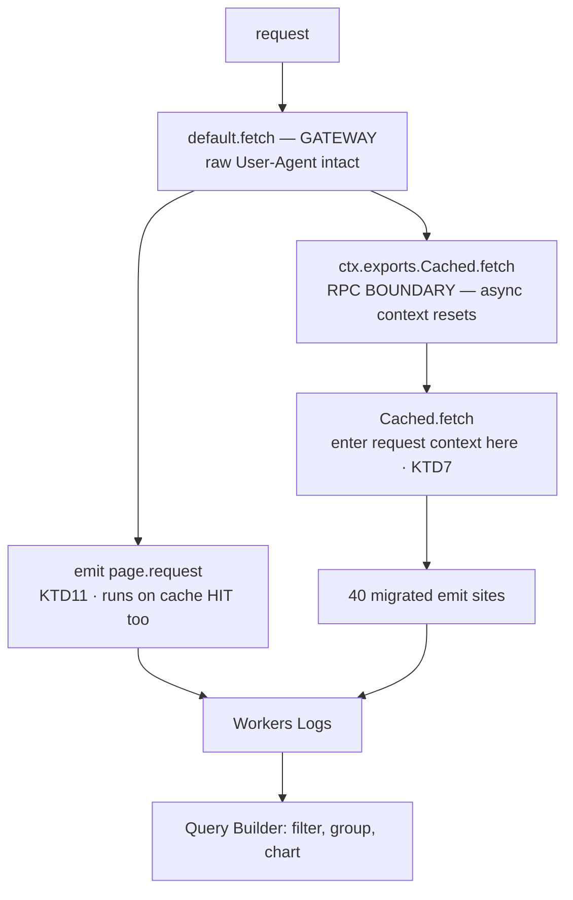

# Central structured-log emitter - Plan

## Goal Capsule

- **Objective:** Every field the Worker logs becomes something an operator can filter, group, and chart in the
  Cloudflare dashboard, and a served page becomes a thing that leaves a record at all. Today neither holds: the
  Observability API indexes 116 keys for this Worker and exactly two are ours — `message` and `level` — while `scope`,
  `tier`, `event`, and `client_name` are invisible, and no scope anywhere records a page being served.
- **Means:** One module owns the log envelope, the scope vocabulary, and the field caps; call sites pass an object and
  nothing else (KTD1, KTD2). One new record at the gateway captures page serving, including cache hits (KTD11).
- **Authority:** R-IDs win on required behavior. KTDs win on mechanism. Units override neither.
- **Parent view:** `docs/plans/2026-09-01-1732-feat-sitewide-telemetry-plan.md` owns why this telemetry exists and the
  layers above it; this plan is its emission mechanism (parent R9, R11, R12).
- **Execution order:** filename timestamps do not encode execution order. This plan is the telemetry family's second
  track: it starts immediately (the spike blocks nothing) and interleaves with the parent's staging-lake unit, but U10's
  production deploy waits on the parent's staging-lake gates (parent Alignment item 10), and the bulk migration waits on
  U10. The session identity plan runs after this one.
- **Execution profile:** The proof is empirical and post-deploy. A canary lands before the bulk migration so the central
  premise is tested on one scope rather than on all of them (KTD12).
- **Stop conditions:** Stop and ask if `mcp.request`'s wire shape would change in any way a reader of `AGENTS.md` would
  notice, if `score.tier`'s field names would change, or if the canary shows object emission does not index.
- **Tail ownership:** Ends after a staging deploy and the keys-API check confirming the new dimensions are indexed.

---

## Product Contract

### Summary

Replace 40 hand-rolled `console.*(JSON.stringify({...}))` emit sites with calls into one emitter module that owns the
envelope, the scope vocabulary, the caps, and the request-scoped ambient fields. Add one new `page.request` record
emitted at the uncached gateway, because nothing in the Worker records a page being served today. Cloudflare indexes the
fields; the Query Builder gains every one as a dimension.

### Problem Frame

Cloudflare's documentation names this exact anti-pattern:

| Logging code                     | What gets indexed           |
| -------------------------------- | --------------------------- |
| `console.log("user_id: " + 123)` | `{message: "user_id: 123"}` |
| `console.log({user_id: 123})`    | `{user_id: 123}`            |

> "Workers Logs automatically extracts the fields and indexes them intelligently… In scenario 1, the `user_id` is embedded within a message. To find all logs relating to a particular user_id, you would have to run a text match."

`JSON.stringify` produces a string, so every emit site here is scenario 1. Verified against the live account on
2026-09-01: the keys endpoint returns 116 indexed keys, of which the only non-platform entries are `message` and
`level`.

It silently breaks procedures already written down. `docs/runbooks/live-scoring-monitoring.md:61,87,91` instruct an
operator to filter `scope:"score.tier"` and group by `tier` in the Workers Logs dashboard. Neither field is indexed, so
none of it can work. And `src/worker/score/handler.ts:81` states the original intent — per-tier flags captured "so we
can later query 'what percentage of cache hits came from pre vs post discovery?' via the observability binding" — which
the stringification defeated invisibly.

A second gap sits underneath. Every one of the 40 emit sites is an exception handler, a maintenance job, a per-audit
summary, or one of the two per-request lines for `/api/score` and `/mcp`. **Nothing records an ordinary page view.** So
even with indexing fixed, the site's main surface stays unmeasured.

### Key Decisions

- **One central emitter.** The call sites were consistent, not ownerless — all 37 use the same idiom, consistently wrong
  about an undocumented platform behavior. The emitter earns its place on two things a convention and a lint rule cannot
  give: a request-scoped ambient-field seam (KTD7) and a typed scope vocabulary (KTD2). The lint gate and the written
  convention ship anyway. Governs R1, R2, R5.
- **No wire-shape change to the two contract-bearing lines.** `mcp.request` is a public posture in `AGENTS.md:164`;
  `score.tier` is what the monitoring runbook is written against. Governs R6, R7.
- **Session identity is not in this plan** (session-settled: user-directed — chosen over shipping it here, after review
  found three of four P0s in that half). It moves to its own plan and rides the `page.request` record this one creates.
  Governs the Scope Boundaries entry.

### Requirements

**Emission**

- R1. One module owns log emission. It passes an object to `console`, never a pre-serialized string.
- R2. Every emitted record carries a discriminator from a closed, typed vocabulary. That discriminator is `scope`,
  except `mcp.request`, which keeps `event` under R6.
- R3. The field caps that exist today — client-name, method, and name truncation, and millisecond bucketing — are
  applied by the emitter, so a call site cannot forget them.
- R4. A telemetry failure never affects the response path.
- R9. The emitter attaches request-scoped ambient fields without any call site passing them, for records emitted inside
  a gateway-served HTTP request, read from a store that cannot leak between concurrent requests.

**Page coverage**

- R10. One `page.request` record is emitted per served page, including requests answered from the edge cache.
- R11. `page.request` carries a client class from a closed taxonomy, plus browser family, `major.minor` version, engine,
  and OS for browser clients, and an agent name for non-browser clients.

**Co-browsing visibility**

- R12. What the WebMCP layer can observe and report about agent activity is established, and written down, before any
  backend for co-browsing telemetry is designed.

**Call sites**

- R5. A call site names its scope and its fields, and nothing else. No serialization, no envelope assembly, no cap
  application.

**Contracts preserved**

- R6. `mcp.request` keeps its exact field set, names, and values. A reader of `AGENTS.md` sees no difference.
- R7. `score.tier` keeps its exact field set and values, so every filter in `docs/runbooks/live-scoring-monitoring.md`
  continues to describe reality.

**Observability**

- R8. After deploy, `scope`, `tier`, `event`, `client_name`, and the `page.request` fields appear as indexed keys in the
  Workers Observability telemetry keys API.

### Success Criteria

- The keys API returns the new field names as queryable dimensions against the live Worker. This is the only proof that
  counts.
- The three runbook procedures that filter on `scope:"score.tier"` can be performed as written, for the first time.
- Page views are countable, including cache hits.
- No response path gains latency, and no test asserts on a serialized log string.

### Scope Boundaries

- **Session identity, and any per-visitor identifier, is out of scope.** It lives in
  `docs/plans/2026-09-01-1152-feat-telemetry-session-identity-plan.md`, which depends on the `page.request` record this
  plan creates.
- Not a change to what existing scopes log, with two named exceptions under KTD6.
- Not a change to `SCORE_TELEMETRY`. The Analytics Engine write path is untouched.

### Sources

- [Workers Logs — Logging structured JSON objects](https://developers.cloudflare.com/workers/observability/logs/workers-logs/).
- Verified live 2026-09-01: 116 indexed keys; only `message` and `level` are ours.
- **Verified on workerd**: an `AsyncLocalStorage` store set in `default.fetch` reads back at the gateway but reads
  `null` inside `Cached.fetch`; the `new Cached(ctx, env)` fallback propagates it. The RPC boundary resets the async
  context.
- `src/worker/index.ts:979-991` — `loopbackCachedFetch` dispatches via `ctx.exports.Cached.fetch`, falling back to a
  direct construction when `ctx.exports` is absent.
- `src/worker/index.ts:89` (`runWithHitMinPurge`) and `:722` (`runWithMcpRequest`) — both existing ALS scopes are
  entered **inside** `Cached`, past the RPC boundary.
- `src/worker/mcp/telemetry.ts:139` emits `event: 'mcp.request'` with no `scope`; `:145-146` truncate `method` and
  `name`; `:79` uses `MAX_ERROR_BODY_BYTES` to bound a body read inside `extractErrorCode`, before any emit — it is not
  a cap on an emitted field.
- `src/worker/score/do.ts:107,114` emit `{ phase: … }` with no discriminator.
- `src/worker/audit-web/cache.ts:279` emits a `scope` received as a `string` parameter, called from `:222` and `:258`;
  `public-listing-backfill.ts:70` emits the `BACKFILL_SCOPE` constant. Twenty-three scope values exist.
- `src/worker/audit-web/audit-log.ts` wraps `console.log(JSON.stringify(...))` behind a local helper for the four
  `web-audit.*` scopes — two console call sites (the helper and `logAuditError`) serving four scope values — and its
  header comment claims the stringified fields are indexed; they index as `message` only. `src/worker/notify.ts` emits
  `notify.send_failed` the same way.
- Emit-site inventory: 40 sites — 35 ordinary (U3) and five contract-bearing or multi-line (U4).
- `tests/worker-mcp-dispatch.test.ts:175` guards on `typeof s.args[0] !== 'string'`; `tests/score-do.test.ts:168` types
  its capture `(m: string)`.

---

## Planning Contract

### Key Technical Decisions

- KTD1. **The emitter passes the merged object straight to `console`.** No `JSON.stringify` in the emit path. Governs
  R1, R5.
- KTD2. **The scope vocabulary is a closed union type.** Twenty-three values exist today, three of which do not appear
  as literals at their emit site: `writeAuditObject` in `src/worker/audit-web/cache.ts` takes its scope as a `string`
  parameter, and `public-listing-backfill.ts` emits a module constant. That function's parameter narrows to the union
  rather than gaining a literal. Governs R2.
- KTD3. **The emitter carries a test seam**, following `src/worker/score/telemetry.ts`'s injectable-interface pattern.
  Three existing test-capture strategies monkey-patch `console` and assume a string: `tests/worker-mcp-dispatch.test.ts`
  filters non-strings and rots silently under object emission, while `tests/score-do.test.ts` and
  `tests/web-audit-observability.test.ts` throw on `JSON.parse` of `[object Object]` — loud, but measuring nothing.
  Governs R5.
- KTD4. **Caps are applied at the boundary; helpers stay put.** `msBucket` and `truncateClientName` keep their homes in
  `src/worker/mcp/telemetry.ts`. Governs R3.
- KTD5. **Swallow-and-log posture.** A logging call can never fail a request. Governs R4.
- KTD6. **Field sets are copied, with two named exceptions.** `src/worker/score/do.ts:107,114` carry only `phase:` and
  gain a `score.outbound` scope, because they are container-outbound diagnostics rather than a documented contract
  surface. Every other site is copied verbatim. Governs R6, R7.
- KTD7. **The request context is entered inside `Cached.fetch`, not at the gateway.** This reverses an earlier draft
  that placed it at the gateway, which is wrong: `src/worker/index.ts:990` dispatches over `ctx.exports.Cached.fetch`,
  an RPC boundary that resets the async context, and this was verified on workerd — a store set in the default handler
  reads `null` downstream. Worse, `loopbackCachedFetch` falls back to a direct construction when `ctx.exports` is
  absent, which is what `{} as ExecutionContext` selects in every worker test, so the broken placement would have passed
  the whole suite. Wrap the existing `runWithHitMinPurge(this.ctx, …)` body at `index.ts:89`, which is the same shape at
  the correct place. Governs R9.
- KTD11. **`page.request` is emitted at the gateway, not inside `Cached`.** `wrangler.jsonc` configures `Cached` as a
  skip-Worker cache HIT target, so a record emitted inside it counts only misses and the page picture would be full of
  holes. The gateway runs on every request. It also still holds the raw User-Agent, which `applyUaClass` in
  `src/worker/accept.ts:190-196` deletes before the inner Worker sees it. This record needs no ambient context, so it is
  unaffected by KTD7. Governs R10.
- KTD13. **Client classification is derived at the gateway from the original request, and the taxonomy is its own closed
  union.** Two facts force this. `applyUaClass` in `src/worker/accept.ts:190-196` deletes the User-Agent for HTML
  clients and rewrites it to `curl/` for markdown clients before the inner Worker runs, so the gateway is the only place
  a real UA exists. And `MARKDOWN_UA_TOKENS` in that same file is a deliberate strict allowlist for *routing* — it
  excludes Googlebot, GPTBot, and ClaudeBot on purpose because those should receive HTML — so an analytics taxonomy
  needs those classes present and distinct. Separate module, separate table, cross-referencing comments on both sides so
  the divergence is deliberate. Governs R11.
- KTD14. **Version is `major.minor`, and the engine is recorded alongside the brand.** Major alone is insufficient:
  Safari 17.4 and 17.5 differ on real support boundaries and both record as `Safari 17`. And iOS Chrome, Firefox, and
  Edge (`CriOS`, `FxiOS`, `EdgiOS`) all render with the device's WebKit while carrying Blink or Gecko brand tokens, so
  brand-only reporting claims modern support for traffic actually capped by the device's Safari. Engine is the honest
  dimension for a support question; brand stays for audience questions. Governs R11.
- KTD15. **Co-browsing is measured by a spike before it is designed.** WebMCP tools make **no dedicated network calls**
  — verified across all six modules in `src/client/`: no `fetch`, no `XMLHttpRequest`, no `sendBeacon` — with one
  exception: `webmcp-home.ts`'s go-to-web-audit tool calls `form.submit()`, a full-page GET navigation that is ordinary
  origin traffic and produces a `page.request` record once U10 lands. Every other tool reads the DOM through `pageDoc()`
  and `getPageState()`, so an agent acting on a loaded page is otherwise server-side indistinguishable from a human
  reading quietly. The backend shape depends on what the client layer can see, which nobody has established. Governs
  R12.
- KTD12. **A canary proves the premise before the bulk migration.** Every emit site stringifies today, so the 116-key
  observation is equally consistent with "stringification prevents indexing" and "these names were never emitted as
  object properties." Only a live object emission distinguishes them. Migrating one scope and checking the keys API
  costs one deploy; discovering the premise is wrong after 40 sites costs the plan.
- KTD16. **Verbosity tiers are an emitter concern.** `src/worker/audit-web/audit-log.ts` gates per-check and
  discovery-evidence lines behind `WEB_AUDIT_DEBUG` (always-on in `env.staging.vars`, transient in production via
  `wrangler deploy --var`). The emitter absorbs this as a debug tier on the emit call, so the staging-verbose,
  production-summary posture stays one mechanism instead of per-subsystem flags. Governs R5.

### High-Level Technical Design

The boundary is the whole design constraint: ambient context cannot cross it, so the page record is emitted on the near
side and the context is entered on the far side.

### Assumptions

- Workers Logs indexes nested objects usefully. Most emit sites are flat, but six are not —
  `src/worker/index.ts:100,106` and `src/worker/audit-web/hit-min-purge.ts:29,57,61,64` carry `tags` (a string array)
  and `errors` (an array of objects), and `src/worker/audit-web/seed.ts:35` emits an object-valued `entry` — so the
  canary answers the question: U9's emission includes one array-of-objects field, putting the nested-indexing
  observation ahead of the bulk migration instead of behind it at U6.

### Sequencing

**U13 (spike, first)** → U0 → U1 → U2 → **U5 (test seam)** → **U9 (canary)** → U11 → U12 → U10 → U3 → U4 → U6 → U7. The
spike runs first because its findings shape any co-browsing backend and it blocks nothing. U5 runs before the canary
because three test-capture strategies assume string emission and would hold `bun test` red for U9, U3, and U4 in any
later position — its broken-helper observation is taken against a temporary object-emission patch. U11 and U12 land
before U10, which consumes the client class they produce, and all three land ahead of the bulk migration so thesis
accrual starts without waiting on the 40-site sweep (parent Alignment item 9). The canary still gates the bulk migration
and must use a scope no string-capture test covers; `page.request` lands before the deploy check so U6 verifies it.
U10's **production** deploy additionally waits until the parent plan's staging-lake gates are green (parent Alignment
item 10), so the lake sink can always be enabled inside the seven-day coupling window.

### Risks & Dependencies

- **The context in the wrong place passes every test.** KTD7 is the mitigation and U0's verification must exercise the
  loopback path, not the fallback that `bun test` selects.
- **Silent test rot.** The mcp-dispatch capture helper filters non-strings and reports "no lines found" rather than
  failing; the two `JSON.parse` helpers at least fail loudly. U5, sequenced ahead of the canary, keeps U9, U3, and U4
  honest.
- **The premise could be wrong.** KTD12's canary is the cheap way to find out.

---

## Implementation Units

### U0. Establish the request context inside `Cached`

- **Goal:** Ambient request-scoped fields have somewhere safe to live that actually reaches the emit sites.
- **Requirements:** R9 (KTD7)
- **Files:** `src/worker/telemetry/request-context.ts` (new), `src/worker/index.ts` (enter inside `Cached.fetch`,
  wrapping the existing `runWithHitMinPurge` body at line 89), `tests/telemetry-request-context.test.ts` (new).
- **Approach:** Mirror `src/worker/mcp/request-context.ts`. Enter the scope **inside `Cached.fetch`**, per KTD7 — not at
  the gateway. Emits from the Sandbox Durable Object (`score/do.ts`, a separate isolate), `WebRescoreWorkflow`, the
  `scheduled()` handler, and the `purgeHitMinTags` RPC method are permanently outside any request context and read
  `undefined`; that is expected, not a gap.
- **Test scenarios:**
  - Happy path: a value set where the scope is entered is readable several layers deep with no threading.
  - Error path — **must be observed:** two overlapping requests with different values, where request A suspends at an
    `await` between writing and reading while B writes in the gap. Only that interleave makes a module-level variable
    fail; without the forced suspension the contrast proves nothing. Implement both, quote both.
  - Edge case — **the placement proof:** assert over HTTP under `wrangler dev --env staging --local` that the value is
    readable inside `Cached.fetch`. `bun test` passes `{} as ExecutionContext`, which selects `loopbackCachedFetch`'s
    direct-construction fallback and never crosses the RPC boundary where the context is lost. The check carries a
    negative control: a marker set in `default.fetch` must read `null` inside `Cached.fetch` — if it reads back, the run
    took the fallback and the placement proof is void.
  - Edge case: a call outside any request scope returns `undefined` rather than throwing.
- **Verification:** `bun test tests/telemetry-request-context.test.ts && bun run typecheck`, plus the `wrangler dev`
  HTTP check above.

### U1. Build the central emitter

- **Goal:** One module owns the envelope, the vocabulary, and the sink.
- **Requirements:** R1, R2, R4, R5, R9 (KTD1, KTD2, KTD3, KTD5, KTD7)
- **Files:** `src/worker/telemetry/log.ts` (new), `tests/telemetry-log.test.ts` (new).
- **Approach:** Export one emit function taking a discriminator and a field object, plus the closed union of
  twenty-three scopes. Merge and hand to `console` unserialized. Provide an injectable sink defaulting to `console`.
  Catch and drop any throw. `mcp.request` is emitted with `event` as its discriminator per R2; the emitter takes the key
  name rather than hardcoding `scope`. Expose an always tier and a debug tier per KTD16, gated on a caller-supplied
  flag.
- **Test scenarios:**
  - Happy path — **the load-bearing assertion:** the value handed to the sink is an **object**, not a string.
  - Happy path: an `mcp.request` emit produces a record keyed `event`, with no `scope` field.
  - Error path — **must be observed:** the sink throws; the call returns normally and nothing propagates. Quote it.
  - Edge case: an unknown scope fails typecheck.
  - Edge case: a field whose value is `undefined` is omitted rather than emitted as null.
  - Edge case: a debug-tier emit is dropped when the flag is off and emitted when it is on.
- **Verification:** `bun test tests/telemetry-log.test.ts && bun run typecheck`.

### U2. Apply the field caps at the boundary

- **Goal:** A call site cannot bypass a cap.
- **Requirements:** R3 (KTD4)
- **Files:** `src/worker/telemetry/log.ts`, `tests/telemetry-log.test.ts`.
- **Approach:** Apply `truncateClientName` to `client_name`, **`method`, and `name`** —
  `src/worker/mcp/telemetry.ts:145-146` caps all three today, because method and name carry client-supplied strings on
  paths that fire before the rate limiter, and dropping the cap lets a flood amplify log volume. Apply `msBucket` to
  duration fields. Name the fields explicitly rather than inferring from value shape. **The 4096-byte error-body clamp
  is not included**: `MAX_ERROR_BODY_BYTES` bounds a response-body read inside `extractErrorCode` before any emit and
  never applies to an emitted field.
- **Test scenarios:**
  - Happy path: an over-long client name, method, and name are each truncated at 64.
  - Happy path: a raw millisecond duration emerges bucketed at `msBucket`'s existing boundaries.
  - Edge case: an already-truncated value is not double-truncated.
  - Edge case: a field not on the named cap list passes through untouched.
- **Verification:** `bun test tests/telemetry-log.test.ts`.

### U9. Canary one scope and prove indexing

- **Goal:** The plan's central premise is tested before 40 sites depend on it.
- **Requirements:** R8 (KTD12)
- **Files:** one high-frequency emit site, chosen at implementation time — a scope no string-asserting capture test
  covers, whose emission includes one array-of-objects field.
- **Approach:** Migrate a single scope to the emitter, deploy to staging, generate traffic, and query the keys API. If
  the fields — the flat ones and the array-valued one — appear as indexed keys, the premise holds and U3 proceeds. If
  not, stop — the whole plan rests on it.
- **Test scenarios:**
  - Test expectation: none in the suite. This is a live-surface check; a unit test cannot demonstrate indexing.
- **Verification:** The migrated scope's field name appears in the keys API. This gates U3.

### U3. Migrate the 35 ordinary sites

- **Goal:** The ordinary emit sites carry no serialization.
- **Requirements:** R5 (KTD6)
- **Files:** `src/worker/audit-web/cache.ts` (9), `src/worker/score/do.ts` (5), `src/worker/score/cache.ts` (4),
  `src/worker/audit-web/hit-min-purge.ts` (4), `src/worker/audit-web/public-listing-backfill.ts` (3),
  `src/worker/audit-web/audit-log.ts` (2), `src/worker/index.ts` (2), `src/worker/audit-web/rescore-trigger.ts` (2),
  `src/worker/notify.ts` (1), `src/worker/audit-web/seed.ts` (1), `src/worker/audit-web/rescore-workflow.ts` (1),
  `src/worker/audit-web/aggregate.ts` (1). **`mcp/telemetry.ts` is not here** — its single site is the `mcp.request`
  line, which U4 owns.
- **Approach:** Mechanical, copying field sets verbatim except the two KTD6 exceptions. Trace scope values that reach an
  emit through a parameter or constant to their callers — reading the emit line alone misses three. In `audit-log.ts`,
  also delete the header comment's claim that stringified fields are indexed — they index as `message` only — and route
  its `WEB_AUDIT_DEBUG` gate through the emitter's debug tier (KTD16).
- **Test scenarios:**
  - Happy path: existing tests still pass.
  - Integration: `rg -U -c "console\.(log|warn|error)\(\s*JSON\.stringify" src/worker/` returns zero for migrated files.
    The `-U` is required — without it ripgrep is line-based and cannot see the four multi-line sites.
  - Edge case: `score/do.ts:107,114` gain `score.outbound` and keep `phase` verbatim.
  - Edge case: no other field name or value changed — diff one emitted record per file.
- **Verification:** `bun test && bun run typecheck && bun run lint`.

### U4. Migrate the five contract-bearing and multi-line sites

- **Goal:** `mcp.request` and `score.tier` emit as objects with byte-identical content.
- **Requirements:** R5, R6, R7 (KTD6)
- **Files:** `src/worker/mcp/telemetry.ts:151`, `src/worker/score/handler.ts:218`, `src/worker/score/telemetry.ts:88`,
  `src/worker/audit-web/public-listing-backfill.ts:171`, `src/worker/audit-web/rescore-trigger.ts:144`.
- **Approach:** Capture each emitted record before and after and compare field by field. The three non-contract sites
  here serve R5 and get the same diff bar.
- **Test scenarios:**
  - Happy path — **the contract assertion:** the `mcp.request` record carries `event`, era, method, name, client name,
    protocol version, host, response format, outcome, error code, and ms bucket, unchanged. `event` is named explicitly
    because `AGENTS.md:161` and `tests/worker-mcp-dispatch.test.ts:178` both key on it.
  - Happy path: `score.tier` carries tier, the four cache flags, binary, and input kind, unchanged.
  - Edge case: `mcp.request` still carries no IP, no arguments, no result payload.
  - Edge case: a rate-limited request still emits exactly one `mcp.request`.
- **Verification:** `bun test`, plus a field-by-field diff of one record per site.

### U5. Move the test helpers onto the seam

- **Goal:** The migration is provable rather than vacuously green.
- **Requirements:** R5 (KTD3)
- **Files:** `tests/worker-mcp-dispatch.test.ts` (helper at 172-184), `tests/score-do.test.ts` (patches at 168, 185,
  213, 233, 258), `tests/web-audit-observability.test.ts` (spies at 50, 70, 85, 102, 164, each doing
  `JSON.parse(String(...))`).
- **Approach:** Replace all three capture strategies with the injectable sink. The mcp-dispatch helper rots silently
  under object emission; the score-do and web-audit-observability helpers throw on `JSON.parse` of `[object Object]`. U5
  now precedes every migration, so the observations run against a temporary object-emission patch of
  `src/worker/mcp/telemetry.ts`, reverted once quoted.
- **Test scenarios:**
  - Error path — **must be observed first:** run the old mcp-dispatch helper against the temporary object-emission patch
    and confirm it reports zero `mcp.request` lines rather than failing on content. Quote it — that is the evidence it
    was silently broken.
  - Happy path: the same assertions pass against recorded objects.
- **Verification:** `bun test tests/worker-mcp-dispatch.test.ts tests/score-do.test.ts
  tests/web-audit-observability.test.ts`.

### U10. Emit `page.request` at the gateway

- **Goal:** A served page leaves a record, including when the edge cache answers it.
- **Requirements:** R10, R11 (KTD11, KTD13, KTD14)
- **Files:** `src/worker/index.ts` (the `default.fetch` handler at 988-991), `src/worker/telemetry/log.ts` (add the
  scope), `tests/telemetry-page-request.test.ts` (new).
- **Approach:** Capture route class and the R11 client fields from the **original** request before the `Cached` dispatch
  — the gateway still holds the real User-Agent, which `applyUaClass` deletes before the inner Worker runs — then emit
  one record per request after the dispatch resolves and before the response returns, reading status and served format
  from the returned response; the gateway receives the cached response on a HIT, so KTD11's coverage is unchanged. The
  record carries the client class plus browser family, `major.minor`, engine, and OS for browser clients and the
  canonical agent name otherwise (from U11 and U12). Exclude `/api/*` and static assets so the record counts page
  serving rather than every subresource. No ambient context is needed here, so KTD7's boundary does not apply.
- **Test scenarios:**
  - Happy path: a browser request's record carries family, `major.minor`, engine, and OS; an agent request's carries the
    canonical agent name (R11).
  - Happy path: an HTML request emits one `page.request` with a real client class, not the `curl/` rewrite or a null the
    inner Worker would see.
  - Happy path: a markdown-twin request records the served format.
  - Edge case — **the reason for KTD11:** a cache-HIT request still emits, asserted at the gateway since `Cached` does
    not run.
  - Edge case: `/api/score` and a static asset emit no `page.request`.
  - Edge case: exactly one record per request.
- **Verification:** `bun test tests/telemetry-page-request.test.ts`, then confirm on staging that HIT and MISS both
  appear.

### U11. Derive engine, brand, version, and OS

- **Goal:** The support picture is honest about what actually renders the page.
- **Requirements:** R11 (KTD13, KTD14)
- **Files:** `src/worker/telemetry/user-agent.ts` (new), `tests/telemetry-user-agent.test.ts` (new).
- **Approach:** A pure function from request headers to `{ engine, engineVersion, brand, brandMajorMinor, osFamily }`,
  all nullable. Read `Sec-CH-UA` and `Sec-CH-UA-Platform` first where present — Chromium sends them by default as
  low-entropy hints, they carry brand and version as structured data, and they distinguish Brave, which is identical to
  Chrome in the User-Agent. Safari and Firefox send none, so the token table remains necessary and the hints complement
  it. Match the iOS wrappers `CriOS`, `FxiOS`, and `EdgiOS` **ahead of** the Chrome and Safari branches per KTD14, and
  include `SamsungBrowser` and `OPR`, which otherwise fall to null or mis-attribute to Chrome. The function never
  returns its input, so a caller cannot accidentally persist it. `src/shared/user-agents.ts` defines the outbound probe
  User-Agents the web audit sends; this module classifies inbound visitors — cross-reference the two with a comment on
  each side, as KTD13 does for `MARKDOWN_UA_TOKENS`, so the boundary between the repo's two user-agent modules is
  stated. Brand, engine, and `osFamily` resolve against this module's own known-value tables and fall to null for
  unrecognized tokens — `Sec-CH-UA` brand entries are attacker-settable free text plus GREASE noise, so hints are
  matched, never passed through — mirroring U12's canonical-name rule.
- **Test scenarios:**
  - Happy path: desktop Chrome, Safari, Firefox, and Edge each yield the right brand, engine, and `major.minor`.
  - Happy path — **the boundary case KTD14 exists for:** Safari `Version/17.4` and `Version/17.5` resolve to distinct
    values.
  - Happy path: `CriOS`, `FxiOS`, and `EdgiOS` resolve engine to WebKit at the device's Safari version while keeping the
    brand.
  - Happy path: `SamsungBrowser` and `OPR` resolve rather than falling to Chrome or null.
  - Edge case: Chrome's UA contains `Safari` and `AppleWebKit`; Edge's contains `Chrome`. Precedence resolves each
    correctly — the classic mis-parse.
  - Edge case: a request carrying both `Sec-CH-UA` and a User-Agent prefers the hints; Brave is distinguished when hints
    are present and folds into Chrome when they are not. Assert both, so the known limit is pinned rather than
    discovered later.
  - Edge case: empty, absent, or garbage input yields all-null; an oversized UA is bounded before processing, and the
    bounding covers the `Sec-CH-UA` headers as well.
  - Edge case — **the closed-table assertion:** an unrecognized `Sec-CH-UA` brand token yields null brand and engine,
    never the token text.
- **Verification:** `bun test tests/telemetry-user-agent.test.ts`.

### U12. Classify the client into the audience taxonomy

- **Goal:** Agents and browsers are peer classes, and the enum is closed.
- **Requirements:** R11 (KTD13)
- **Files:** `src/worker/telemetry/client-class.ts` (new), `tests/telemetry-client-class.test.ts` (new).
- **Approach:** A pure function to a class in a closed union — browser, ai-fetcher, ai-crawler, search-crawler,
  cli-client, unknown — plus an agent name for the non-browser classes. **The agent name is the canonical label from
  this module's own token table, never a slice of the User-Agent**, so attacker-controlled text cannot reach the
  dataset; `src/worker/mcp/telemetry.ts` already caps client-supplied names for the same reason. Build the table
  separately from `MARKDOWN_UA_TOKENS` per KTD13, with a cross-referencing comment on both sides. Unknown-class requests
  store no User-Agent text — the parent's R5 bans raw UA in any written or exported record, and the lake makes a
  violation permanent. The unknown class itself is the signal: a rising unknown share is visible as a count, and
  extending the token table is a deliberate investigation against staging traffic triggered by that count, never an
  always-on capture.
- **Test scenarios:**
  - Happy path: `ChatGPT-User`, `Claude-User`, `Perplexity-User` classify as ai-fetcher with canonical names.
  - Happy path: `GPTBot`, `ClaudeBot`, `OAI-SearchBot`, `PerplexityBot` classify as ai-crawler, **not** ai-fetcher. The
    distinction is the point — one is a live read for a human, the other is corpus building.
  - Happy path: `Googlebot` and `bingbot` are search-crawler; `curl`, `wget`, `python-requests` are cli-client; a Chrome
    UA is browser with a null agent name.
  - Edge case — **the security assertion:** a UA carrying an unrecognised product token yields a **null** agent name,
    never the token.
  - Edge case: an unrecognised UA is unknown, and classification is case-insensitive.
  - Edge case: an unknown-class request emits no User-Agent text anywhere — its record carries only the `unknown` class
    and a null agent name.
- **Verification:** `bun test tests/telemetry-client-class.test.ts`.

### U13. Spike: what can the WebMCP layer observe?

- **Goal:** Establish what co-browsing activity is observable at all, before any backend is designed for it.
- **Requirements:** R12 (KTD15)
- **Files:** `docs/research/2026-09-webmcp-observability-spike.md` (new). **No production code ships from this unit.**
- **Approach:** A time-boxed investigation, not a feature. Answer, with evidence: which WebMCP tool invocations are
  interceptable from `toolsFor` and the six modules in `src/client/`; how the one navigation-producing tool
  (`webmcp-home.ts`'s `form.submit()`) surfaces server-side and whether that signal generalizes; whether tool name,
  arguments, and outcome are available at that seam without touching argument *content*; whether the agent identity is
  knowable client-side at all, or only that *an* agent acted; what an ingest endpoint would cost, given the site has no
  public write surface today — `/api/web-rescore` and `/api/web-audit-backfill` are the only `/api/` POST routes and
  neither is an open beacon, so an unauthenticated ingest is a new abuse surface needing its own rate-limit and
  Turnstile posture; and what the privacy surface looks like, since a beacon reports what an agent did on a page a human
  is also viewing. Record what is observable, what is not, and what each option would cost. **Recommend a backend shape;
  do not build one.**
- **Execution note:** Runs first in the sequence. It blocks nothing, and its findings shape work that has not been
  specced yet — which is the whole reason it comes early rather than late.
- **Test scenarios:**
  - Test expectation: none — a spike producing a written finding, not behavior.
- **Verification:** The document answers all five questions with evidence, and names a recommended backend shape with
  its costs. A spike that ends in "it depends" has not finished.

### U6. Prove the fields are indexed

- **Goal:** The claim that motivated the plan is verified against the live surface.
- **Requirements:** R8
- **Files:** none — a verification step recorded in U7.
- **Approach:** Deploy to staging, generate traffic across several scopes, query the keys endpoint, and confirm `scope`,
  `tier`, `event`, `client_name`, and the `page.request` fields appear. Use the read-only token stored as `Cloudflare
  API Token - Analytics Read (agentnative-site)`. Record the before count (116 keys, two ours) and the after count.
  While there, enumerate the platform-populated `$metadata`/`$workers` keys and record whether any carries the client IP
  — that answer is a prerequisite the session plan depends on.
- **Test scenarios:**
  - Test expectation: none — a live-surface check.
- **Verification:** The keys API lists the new dimensions.

### U7. Update the runbook and conventions

- **Goal:** The docs describe a mechanism that works.
- **Requirements:** R7
- **Files:** `docs/runbooks/live-scoring-monitoring.md`, `AGENTS.md`.
- **Approach:** The runbook's `scope:"score.tier"` filters need no rewriting — they were correct and simply could not be
  executed. Note that they now work, and record the keys-API check as the way to confirm a new field is queryable. Add
  the convention to `AGENTS.md`: log through the emitter, pass an object, never `JSON.stringify`, because stringifying
  collapses every field into `message`. Do not edit the `mcp.request` posture sentence.
- **Test scenarios:**
  - Test expectation: none — documentation.
- **Verification:** `bun run lint`, plus a read-through confirming no runbook filter changed.

---

## Verification Contract

| Gate                           | Command                                                                                  | Applies to  |
| ------------------------------ | ---------------------------------------------------------------------------------------- | ----------- |
| Unit tests                     | `bun test`                                                                               | U0–U5, U10  |
| Typecheck                      | `bun run typecheck`                                                                      | U0–U4, U10  |
| Lint                           | `bun run lint`                                                                           | U3, U4, U7  |
| No stringified emits remain    | `rg -U -c "console\.(log\|warn\|error)\(\s*JSON\.stringify" src/worker/` returns nothing | U3, U4      |
| Context reaches the emit sites | `wrangler dev --env staging --local`, HTTP assertion inside `Cached.fetch`               | U0          |
| Worker bundle                  | `bun x wrangler deploy --dry-run`                                                        | U3, U4, U10 |
| **Canary indexed**             | keys API lists the canary scope's field                                                  | U9          |
| **Fields indexed**             | keys API lists `scope`, `tier`, `event`, `client_name`, `page.request` fields            | U6          |

**Proof discipline.** Five observations are required, not asserted: U0's forced-interleave leak contrast, U0's loopback
placement check, U1's throwing-sink path, U5's old helper reporting zero lines, and U9's canary indexing. The last one
gates everything after it.

---

## Definition of Done

**Global**

- Every requirement R1–R12 is satisfied by a merged unit.
- No `console.*(JSON.stringify(` remains in `src/worker/`, verified with `rg -U`.
- `scope`, `tier`, `event`, `client_name`, and the `page.request` fields are indexed on the live Worker.
- `mcp.request` and `score.tier` carry byte-identical field sets, verified by diff.
- The three runbook filters can be performed as written.
- Whether any platform key carries the client IP is recorded, since the session plan depends on it.

**Per unit**

| Unit | Done when                                                                                                                                                                                                               |
| ---- | ----------------------------------------------------------------------------------------------------------------------------------------------------------------------------------------------------------------------- |
| U0   | Context readable inside `Cached.fetch` over HTTP under `wrangler dev`; the forced-interleave leak contrast observed and quoted.                                                                                         |
| U1   | The sink receives an object, not a string; throwing-sink path observed; `mcp.request` keyed `event`.                                                                                                                    |
| U2   | Client name, method, and name all truncated at the boundary; no error-body clamp claimed.                                                                                                                               |
| U9   | The canary's fields — the array-valued one included — appear in the keys API. U3 does not start until they do.                                                                                                          |
| U3   | All 35 ordinary sites migrated; the two `score.outbound` exceptions named; `rg -U` clean for those files.                                                                                                               |
| U4   | All five sites diffed field by field and identical, `event` included.                                                                                                                                                   |
| U5   | The mcp-dispatch helper observed reporting zero lines against the temporary patch, quoted, then all three replaced.                                                                                                     |
| U11  | Safari 17.4 and 17.5 resolve distinctly; iOS wrappers resolve to WebKit at the device version; Brave's known limit pinned.                                                                                              |
| U12  | All six classes resolve; an unrecognised product token yields a null agent name.                                                                                                                                        |
| U13  | The spike answers all five questions with evidence and names a recommended backend shape.                                                                                                                               |
| U10  | One record per served page including cache HITs, with a real client class and the R11 browser/agent fields; API and asset paths excluded. U3 does not start until U10 is merged and deployed (parent Alignment item 9). |
| U6   | Keys API lists every expected dimension; before/after counts and the platform-IP answer recorded.                                                                                                                       |
| U7   | Runbook filters annotated as working, not rewritten; `AGENTS.md` carries the convention.                                                                                                                                |
