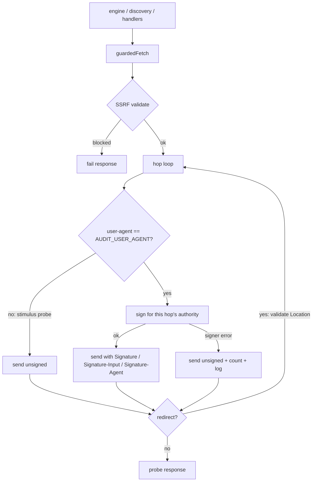
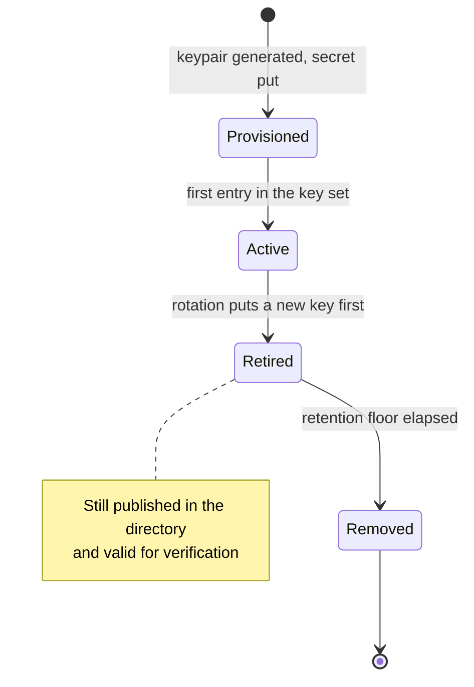

# Web Bot Auth Probe Signing - Plan

## Goal Capsule

- **Objective:** WAF-fronted sites, and Cloudflare bot management first, can cryptographically verify that a web-audit
  probe comes from the anc.dev auditor. Bot defenses admit or classify the auditor on proof instead of User-Agent trust,
  and the auditor never has a reason to impersonate anyone.
- **Means:** sign probe egress with HTTP Message Signatures per Web Bot Auth (Ed25519), publish a signed key directory
  on anc.dev, and register with Cloudflare Verified Bots (KTD1, KTD2, KTD6).
- **Authority hierarchy:** Requirements own product behavior. KTDs own mechanism. Where the IETF draft and Cloudflare's
  documented verification profile diverge, Cloudflare's profile wins (KTD2) because it is the verifier that runs today.
- **Stop conditions:** registration submission is an operator dashboard action; the code work completes without it and
  never automates it. Stop and surface if Cloudflare's documented wire profile changes mid-implementation, or if key
  material would ever be shared across environments.

---

## Product Contract

### Summary

Sign every probe the auditor sends as itself, publish the Ed25519 key directory at
`/.well-known/http-message-signatures-directory` with per-key response signatures, and give the operator a runbook path
to Cloudflare Verified Bots registration. Identity becomes verifiable at the WAF instead of asserted by a string.

### Problem Frame

The auditor's probes leave Cloudflare Workers on shared egress IPs, so IP-range verification is impossible. The honest
`anc-web-audit/1.0` User-Agent improved treatment by bot-defense CDNs, but a UA string is trust-me identification: any
scraper can copy it, and a strict WAF has no way to check it. The rejected alternative was probing with well-known
AI-bot UA strings, which is impersonation and unreliable against verified-bot IP validation. Web Bot Auth exists for
exactly this gap, Cloudflare accepts it as a Verified Bots validation method, and the audit registry already scores
target sites on the receiving side of the same spec.

### Requirements

**Signing**

- R1. Every probe that identifies as the auditor (carries `AUDIT_USER_AGENT`) also carries a Web Bot Auth signature
  (`Signature`, `Signature-Input`, `Signature-Agent`) valid under Cloudflare's documented verification profile, on every
  redirect hop.
- R2. A probe that sets its own User-Agent (the UA-stimulus checks) is sent unsigned.
- R3. Signing never breaks an audit: absent, malformed, or failing key material degrades the affected fetch to unsigned
  with observable telemetry, and never escapes `guardedFetch` as a throw.

**Key directory**

- R4. anc.dev serves `/.well-known/http-message-signatures-directory` with media type
  `application/http-message-signatures-directory+json`, a JWKS of the published Ed25519 public keys, and one response
  signature per key (`tag="http-message-signatures-directory"`, `("@authority";req)` covered).
- R5. The directory is directly fetchable by anonymous verifiers: HTTPS 200, no redirect, no bot challenge, and no cache
  layer the operator controls (the Cloudflare edge serving anc.dev) ever replays a response whose signatures have
  expired. Client-side caches may hold the body per its Cache-Control; verifier-side key freshness is carried by R7's
  retention floor.
- R6. anc.dev's self-audit scores its own `web-bot-auth` registry check as pass.

**Rotation and environments**

- R7. Rotation supersedes before it removes: a retired public key stays published and verifiable for at least a
  retention floor derived from the named cache clocks, and a test pins that floor. The floor governs graceful rotation
  only; emergency revocation of a compromised key removes it from both signing and published positions immediately,
  accepting the verifier-cache blip.
- R8. Staging signs with its own keypair; production key material never leaves production.

**Registration and observability**

- R9. The operator can complete Cloudflare Verified Bots registration from the runbook alone, and can check the outcome
  externally (Cloudflare's public verification endpoint).
- R10. Each audit's summary log line reports how many probes went out signed and unsigned.

### Key Decisions

- KD1. **Sign unconditionally wherever the auditor identifies as itself** (session-settled: user-directed — chosen over
  signing only retries after a block-shaped response: the auditor has nothing to hide, and verifiability on every
  request is what makes registration meaningful). Governs R1.
- KD2. **UA-stimulus probes stay unsigned** (session-settled: user-approved — revised from sign-everything when
  registration-risk evidence surfaced: a valid anc.dev signature under a `ChatGPT-User` UA is the identity-mismatch
  shape verified-bot enforcement treats as spoofing, and it would change what those checks measure). Governs R2.
- KD3. **Cloudflare is the only verifier registration in scope** (session-settled: user-directed — chosen over
  registering with additional WAF vendors now: the same directory and headers serve other verifiers later, so each extra
  verifier is a registration exercise, not implementation). Governs R9.

### Success Criteria

- Cloudflare's public verification endpoint (`crawltest.com/cdn-cgi/web-bot-auth`) returns 401 (well-formed signature,
  unregistered key) for a staging-signed request before registration, and 200 for production after approval.
- The `http-signature-directory` validator CLI passes against the live production directory.
- The post-deploy rescore flips anc.dev's `web-bot-auth` row from `n_a` to `pass` (R6).

### Scope Boundaries

- In scope: the signing module, `guardedFetch` integration, the directory route, rotation machinery, ops runbook and
  provisioning guards, registry/remediation copy updates, and the signed/unsigned observability counter.
- DoH resolver probes (`dns-doh` handler) carry the default UA, so they are signed under R1. This is deliberate:
  harmless to the resolvers, and carving out a host exception would complicate the R1 invariant for zero benefit.

#### Deferred to Follow-Up Work

- Registration with other verifiers (Akamai, AWS WAF, Vercel, HUMAN) per KD3.
- Switching `Signature-Agent` to the WG dictionary form when Cloudflare's verifier accepts it (KTD2 keeps it a single
  switch; the in-process tests already cover both forms).
- Re-tiering the `web-bot-auth` registry check above MAY once the ecosystem justifies it (scoring change, own review).
- Signing the CLI-scoring lane's egress (`src/worker/score/` fetchers to GitHub, crates.io, PyPI and peers) —
  infrastructure calls with a different trust model, not audit probes.
- Cloudflare Pay Per Crawl participation.

#### Outside this product's identity

- Impersonating third-party bot User-Agents in any probe.
- Publishing egress IP ranges (not possible on Workers shared egress; the signature is the compensating identity
  mechanism).

---

## Planning Contract

### Key Technical Decisions

- KTD1. **Use Cloudflare's `web-bot-auth` npm package (0.2.0), not a hand-rolled RFC 9421 implementation.** It is the
  reference implementation from the verifier we target: WebCrypto-based, Workers-first, ships signers for both
  `Signature-Agent` forms and the official test vectors. Structured-field serialization is where hand-rolled
  implementations fail. Exact-pin the version; the lockfile carries integrity. The package signs requests only; the
  directory's response signatures come from `http-message-sig` (the signing core `web-bot-auth` itself wraps, which
  supports request-bound response descriptors), added as a second direct exact-pinned dependency.
- KTD2. **Wire profile = Cloudflare's production profile.** Legacy sf-string `Signature-Agent: "https://anc.dev"`;
  covered components `("@authority" "signature-agent")` bare (no `key` parameter); `tag="web-bot-auth"`;
  `alg="ed25519"`; `keyid` = RFC 8037 JWK thumbprint; `created`/`expires` with a short window (minutes, well under the
  24h ceiling); fresh random nonce per request; no `Content-Digest`. The WG draft (adopted 2026-09-01) prefers the
  dictionary form, which Cloudflare's verifier currently rejects; the serialization choice lives in one place so the
  migration is a single switch. `Signature-Agent` derives per environment: production advertises `"https://anc.dev"`;
  staging advertises its own staging origin and verifies nowhere externally by design — the pre-approval 401 success
  criterion depends on exactly this (session-settled: user-directed — chosen over publishing staging's public key in the
  production directory or registering staging as a second bot: the production identity stays single-holder, and both
  alternatives remain cheap upgrades later while walking back a trusted staging key would need a revocation).
- KTD3. **Sign per redirect hop inside `guardedFetch`'s loop, gated on the auditor's own UA.** The gate is: the outgoing
  request's `user-agent` equals `AUDIT_USER_AGENT` (which is true for every probe except the UA-stimulus checks,
  satisfying KD1 and KD2 via R1/R2). Each hop gets a fresh header object; `@authority` changes per hop, so a hoisted
  signature would be invalid from hop 1 and a mutated shared object would accumulate stale signature headers.
- KTD4. **Thread the signer explicitly through `fetchOptions`, not ambient context.** Widen `GuardedFetchOptions` with
  an optional signer and widen the `Pick<>` chain (`src/worker/audit-web/engine.ts`,
  `src/worker/audit-web/discovery.ts`, `src/worker/audit-web/handlers/types.ts`, `src/worker/audit-web/handlers/mcp.ts`)
  plus the three engine entry points and the local runner. Chosen over the repo's `AsyncLocalStorage` ambient pattern:
  it matches the existing `fetchImpl` injection seam, keeps tests trivial, and is explicit. The wider diff is
  mechanical.
- KTD5. **Failure containment at the sign call.** The per-hop sign is wrapped; any signer error falls back to an
  unsigned fetch for that hop, increments the unsigned counter with a reason, and logs one structured line. Key material
  is shape-validated where it is consumed (JWK parse + one test-sign at signer construction), so bad provisioning fails
  loudly at audit start, not intermittently mid-probe. Failure reasons are a closed enum of reason codes, never
  stringified errors: JSON parse errors embed fragments of the parsed input, so a raw message would put secret text into
  logs, and the typed construction error carries no fragment of the secret. Nothing new throws out of `guardedFetch`
  (its documented never-throws contract). Prior art:
  `docs/solutions/developer-experience/secret-store-pem-quote-wrapped-at-storage-boundary-2026-07-20.md`.
- KTD6. **The directory is a dynamic Worker route, and the edge cache must never outlive the response signatures.**
  Serve it like `/.well-known/api-catalog` (explicit content-type, GET-only posture, no redirect), generating per-key
  response signatures at request time with a ~300s validity window, matching Cloudflare's own live reference directory.
  Browser `Cache-Control: max-age=86400` per spec examples, but the CDN layer (`Cloudflare-CDN-Cache-Control`) is
  `no-store` — the `Cached` entrypoint would otherwise replay one signed body for 24h, expired for nearly the whole
  window. A test pins the CDN cache lifetime at or under the signature window.
- KTD7. **Key material: one secret per environment holding a JSON array of private JWKs; public JWKS derived at
  runtime.** First entry signs; remaining entries are retired-but-published (rotation set). Deriving the public set from
  the private set (strip `d`) avoids a second source of truth. Staging gets its own keypair (R8), following the
  staging-leads-prod convention. The secret name joins the `wrangler-config` guard test so it can never collide with a
  `vars` declaration (Cloudflare API error 10053), and the runbook's per-env checklist enumerates it because a
  presence-guarded secret that is missing deploys green and silently ships unsigned probes.
- KTD8. **The retention floor names its clocks, and rotation soaks on the introduce side too.** Retire side: floor =
  max(directory CDN cache lifetime, verifier refresh margin) + isolate-drain margin. Introduce side: a new key is
  published non-signing first and promoted to the signing slot only after an introduce-side soak (directory client cache
  lifetime + verifier refresh margin), so verifiers holding a cached directory never meet signatures from a key they
  cannot resolve. Both windows are constants whose names state what they encode, pinned by tests alongside the KTD6
  cache pin. Prior art:
  `docs/solutions/design-patterns/floor-a-rotated-credentials-retention-window-to-downstream-ttls.md`.
- KTD9. **Verification is in-process-first.** Unit tests sign and then verify with the package's own verifier (both
  `Signature-Agent` forms), so correctness never depends on a third-party endpoint. The `crawltest.com` check is a
  runbook step and an advisory probe, not a blocking CI gate — staging's directory sits behind Cloudflare Access, so
  external verification of staging is a negative-path assertion about a third party's endpoint and would be the suite's
  first hard external dependency.
- KTD10. **The registry copy change ships in the same deploy as the directory.** Editing the `web-bot-auth` check's copy
  moves the registry fingerprint and forces a full seeded-board reflow; landing copy and directory together costs one
  reflow instead of two. The registry normalizer also gains a guard rejecting literal `Signature*` headers in
  `registry.yaml`, mirroring the existing `{ua:...}` single-definition guard.

### High-Level Technical Design

Signed probe path, including the gate, per-hop re-signing, and failure containment:

Key lifecycle (per environment; the retention floor governs the retired state):

---

## Implementation Units

### U1. Signing module

- **Goal:** a self-contained module that turns the environment's key-set secret into a per-request signer producing
  Cloudflare-profile Web Bot Auth headers.
- **Requirements:** R1, R3, R7 (key-set shape), R8.
- **Dependencies:** none.
- **Files:** `src/worker/audit-web/wba-sign.ts` (new), `tests/web-bot-auth-signing.test.ts` (new), `package.json`
  (exact-pinned `web-bot-auth` and `http-message-sig` dependencies).
- **Approach:**
  1. Parse and validate the key-set secret (JSON array of private Ed25519 JWKs) at signer construction; a malformed set
     fails construction with a typed error carrying no fragment of the secret (KTD5).
  2. Build the signer on the `web-bot-auth` package per KTD2's profile; expose a function that, given method, URL, and
     headers, returns the three headers for that request.
  3. Expose a directory-response signer on `http-message-sig` producing the per-key response signatures U3 consumes
     (KTD1, KTD6 profile).
  4. Derive the public JWKS (strip private fields) and per-key thumbprints from the same key set for U3's use (KTD7).
  5. Expose the signature-window and retention-floor constants (KTD8) from this module so U3 and the pinning tests
     import one definition.
- **Patterns to follow:** `src/worker/score/session.ts` for WebCrypto import + typed config errors;
  `src/shared/user-agents.ts` for the single-definition convention.
- **Test scenarios:**
  - Happy path: a signed request verifies with the package's own verifier; headers carry `tag="web-bot-auth"`, both
    timestamps, a nonce, and the legacy sf-string `Signature-Agent`.
  - Both header forms round-trip through the library verifier (the KTD2 migration switch is exercised).
  - `keyid` equals the RFC 8037 thumbprint of the active public key.
  - Malformed secret (quote-wrapped JSON, missing `d`, wrong `crv`) fails construction with the typed error, not at
    first sign.
  - The malformed-secret path emits no substring of the key material (in particular no `d` value) in the typed error or
    any reason code (Covers R3, KTD5).
  - A directory response signed by the response signer verifies via the library, covers `("@authority";req)`, and
    carries `tag="http-message-signatures-directory"`.
  - Multi-key set: first key signs; the derived public JWKS contains all keys.
- **Verification:** unit tests pass; the module has no imports from route/engine code (leaf module).

### U2. Sign probe egress in guardedFetch

- **Goal:** every auditor-identified probe leaves signed, per hop, with signer failures contained and counted.
- **Requirements:** R1, R2, R3, R10.
- **Dependencies:** U1.
- **Files:** `src/worker/audit-web/ssrf.ts`, `src/worker/audit-web/engine.ts`, `src/worker/audit-web/discovery.ts`,
  `src/worker/audit-web/handlers/types.ts`, `src/worker/audit-web/handlers/mcp.ts`, `src/worker/audit-web/route.ts`,
  `src/worker/mcp/tools/web-audit.ts`, `src/worker/audit-web/rescore-workflow.ts`, `src/worker/audit-web/audit-log.ts`,
  `scripts/web-audit/audit.ts`, `tests/web-audit-ssrf.test.ts`.
- **Approach:**
  1. Add the optional signer to `GuardedFetchOptions`; widen the `Pick<>` chain and thread a signer built from env at
     the three engine entry points and the local runner (KTD4). Signer construction at those call sites is wrapped: a
     typed construction error yields no signer, the audit proceeds fully unsigned, and the counters report the
     provisioning-failure reason (R3).
  2. Sign inside the hop loop on a fresh header object, gated per KTD3; contain failures per KTD5.
  3. Count signed/unsigned-with-reason on the signer object itself and surface the counts through the audit summary log
     line (R10) — `ProbeResponse` and the stored scorecard schema stay untouched.
- **Patterns to follow:** the existing `fetchImpl` injection seam and `hasHeader` UA gate in
  `src/worker/audit-web/ssrf.ts`; `instrumentAuditEvents` in `src/worker/audit-web/audit-log.ts` for the summary field.
- **Test scenarios:**
  - A default-UA probe carries all three signature headers; a `{ua:...}` stimulus probe carries none (Covers R2).
  - A followed redirect re-signs: hop 2's `Signature-Input` differs from hop 1's, and hop 1's headers are not resent
    stale.
  - A signer that throws still yields a complete audit and a normal probe response; the summary line reports the
    unsigned count and reason (Covers R3).
  - A malformed secret at an entry point still yields a complete, fully-unsigned audit with the construction-failure
    reason in the summary line (Covers R3).
  - No signer configured: audit runs fully unsigned; summary reports signed 0 with the unprovisioned reason.
  - The timeout AbortController still bounds the whole chain with signing active.
- **Verification:** full suite green; a local `wrangler dev` audit's summary log shows nonzero signed counts.

### U3. Key directory route

- **Goal:** anc.dev serves a spec-valid, verifier-fetchable, freshly-signed key directory.
- **Requirements:** R4, R5.
- **Dependencies:** U1.
- **Files:** `src/worker/index.ts`, `src/worker/headers.ts` (only if the cache split needs a helper),
  `tests/worker.test.ts`, `tests/e2e/discoverability.e2e.ts`.
- **Approach:**
  1. Add the route branch beside `/.well-known/api-catalog`, GET-only per the existing discovery posture, serving the
     JWKS from U1's derived public set.
  2. Generate per-key response signatures at request time (KTD6 profile) against the request's own authority.
  3. Set the split cache headers per KTD6 and the required media type; no redirect, no `Cache-Tag`.
- **Patterns to follow:** the api-catalog branch in `src/worker/index.ts` (explicit content-type + CORS + noindex, body
  from a shared builder); `DISCOVERY_GET_ONLY_PATHS`.
- **Test scenarios:**
  - GET returns 200, the exact media type, and a body whose every key verifies its own response signature via the
    library verifier (Covers R4).
  - POST/PUT return the discovery 405 posture; the path never redirects (Covers R5).
  - CDN cache header is `no-store` and the pinning test fails if a future edit raises it above the signature window
    (Covers R5).
  - Response signatures cover `("@authority";req)` and carry `tag="http-message-signatures-directory"`.
  - E2E (staging, with the Access service-token headers): route responds with the media type and parseable JWKS.
- **Verification:** `http-signature-directory` CLI passes against a local `wrangler dev` instance; worker tests green.

### U4. Rotation machinery and retention floor

- **Goal:** rotation is a supersede-then-remove procedure that cannot silently violate verifier caching.
- **Requirements:** R7, R8.
- **Dependencies:** U1, U3.
- **Files:** `src/worker/audit-web/wba-sign.ts`, `tests/web-bot-auth-signing.test.ts`, `tests/wrangler-config.test.ts`.
- **Approach:**
  1. Encode the retention floor per KTD8 next to the signature-window constant.
  2. Pin floor and CDN-cache relationships with tests that name the clocks they encode.
  3. Extend the `wrangler-config` secret guard with the new secret name (KTD7).
- **Test scenarios:**
  - The retention-floor constant is at least the CDN cache lifetime plus the stated margins (fails on any inversion).
  - The introduce-side soak constant is at least the directory client cache lifetime plus the verifier refresh margin
    (fails on any inversion; Covers R7, KTD8).
  - The key-set parser accepts active+retired sets and signs only with the first entry.
  - The secret name appears in no `vars` block in any env (10053 guard).
- **Verification:** tests green; the constants read as documentation.

### U5. Registry copy, normalizer guard, and self-audit

- **Goal:** the receiving-side check tells the truth once anc.dev itself signs, and the registry cannot grow a second
  signature-header definition.
- **Requirements:** R6.
- **Dependencies:** U3 (ships in the same deploy, KTD10).
- **Files:** `src/data/web-audit/registry.yaml`, `src/data/web-audit/remediation.yaml`,
  `src/build/13-web-audit-registry.mjs`, `tests/web-audit-scoring.test.ts`, `content/web-audit.md`,
  `src/build/06-homepage.mjs` (only if the category blurb references the old copy).
- **Approach:**
  1. Rewrite the `web-bot-auth` check title, hint, and remediation entry: drop the "(informational)" title suffix and
     every "informational only" phrasing, describe the directory + signing posture, keep tier MAY (re-tiering is
     deferred).
  2. Add the normalizer guard rejecting literal `Signature`/`Signature-Input`/`Signature-Agent` keys in `registry.yaml`
     check headers, with a test.
  3. Note the forced registry-fingerprint reflow in the runbook beside the existing fingerprint paragraph.
- **Test scenarios:**
  - Normalizer rejects a check declaring a literal `Signature` header, naming the check id.
  - Remediation/registry copy contains no "informational only" phrasing for this check.
- **Verification:** build green; post-deploy rescore flips anc.dev's row to pass (observed after ship, R6).

### U6. Provisioning, runbook, and registration procedure

- **Goal:** an operator can provision keys, validate the directory, submit the Cloudflare registration, and rotate —
  from the runbook alone.
- **Requirements:** R8, R9.
- **Dependencies:** U1-U4 (documents what they built).
- **Files:** `docs/runbooks/web-audit-operations.md`, `scripts/web-audit/audit.ts` (signed single-URL fetch mode),
  `.dev.vars` (local dev key with the safe-to-leak comment convention).
- **Approach:**
  1. Add a signed single-URL fetch mode to the local runner: a flag that builds a signer from a provided key file and
     GETs an arbitrary URL with the three signature headers, so the external verification checks are executable (R9).
  2. Runbook section mirroring the Failure-notifications shape: keygen recipe, per-env `wrangler secret put` (staging
     first, prod at promotion), directory validation (`http-signature-directory` CLI, then the runner's signed fetch
     against `crawltest.com` expecting 401 pre-approval / 200 post-approval), BotBase submission fields (Verification
     Method: Request Signature; directory URL; UA `anc-web-audit/1.0`; Direct; Monitoring & Operations),
     submission-history tracking, the per-env binding checklist (KTD7), and the rotation procedure: publish the new key
     non-signing, soak per KTD8's introduce-side clock, promote it to the signing slot, then retire the old key through
     the retention floor — plus the emergency-revocation variant (on suspected compromise: remove the key from both
     signing and published positions immediately, accept the verifier-cache blip, note any BotBase re-verification step;
     per R7).
  3. Note the post-approval interaction: self-audit probes become verified-bot traffic against the anc.dev zone; the
     zone's bot rules must not block verified bots or the self-audit regresses. Note the staging identity posture per
     KTD2: staging signatures verify nowhere externally by design.
- **Test expectation:** none for the runbook prose; the runner's signed-fetch mode is exercised manually via the
  verification contract's advisory row, and U4 carries the config guards.
- **Verification:** a cold read of the section answers provision, validate, register, rotate without leaving the file.

---

## Verification Contract

| Gate                                     | Command                                                                            | Applies to |
| ---------------------------------------- | ---------------------------------------------------------------------------------- | ---------- |
| Build precedes tests (repo rule)         | `bun run build`                                                                    | all units  |
| Unit + worker tests                      | `bun test`                                                                         | U1-U5      |
| Types                                    | `bun run typecheck`                                                                | all units  |
| Lint                                     | `bun run lint`                                                                     | all units  |
| Deploy config                            | `bunx wrangler deploy --dry-run` and `--env staging`                               | U3, U4     |
| Staging e2e (opt-in)                     | `ANC_STAGING_BASE_URL=... bun run test:e2e` with Access headers                    | U3         |
| Directory validity (manual)              | `http-signature-directory` CLI against dev/staging/prod                            | U3, U6     |
| External verification (manual, advisory) | signed request to `crawltest.com/cdn-cgi/web-bot-auth`: 401 pre-approval, 200 post | U6         |

---

## Definition of Done

- All units landed through the repo's feature-branch + PR flow with the gates above green; no unit skipped its test
  scenarios.
- Production serves a directory the validator CLI accepts; staging signs with its own key and the audit summary logs
  show nonzero signed counts.
- The registry copy and directory shipped in one deploy; the post-deploy rescore ran once.
- Registration submitted by the operator per U6 (external approval is not a code-done blocker; the 200-verification step
  is documented for when it lands).
- No abandoned experimental code: dead ends removed before final review.

---

## Risks & Dependencies

- **Draft churn.** The IETF working group adopted the merged protocol draft on 2026-09-01; Cloudflare's verifier
  deliberately lags on the `Signature-Agent` form. Mitigation: KTD2 isolates the serialization switch and U1 tests both
  forms.
- **Young dependency.** `web-bot-auth` is 0.2.0 (released 2026-08-31). Exact-pin; the signing module is the only
  importer, so a swap stays contained.
- **External review timeline.** Verified Bots approval has no SLA; the Aug 2026 BotBase rework automates directory
  validation, making signature submissions the fast path. Until approval, signed probes are simply probes with three
  extra headers.
- **Post-approval self-traffic.** The weekly rescore's anc.dev audit becomes verified-bot traffic against our own zone
  (`global_fetch_strictly_public` sends it through the public edge). U6 documents the zone-rule check.
- **Third-party endpoints in verification.** `crawltest.com` and the validator CLI are external; both stay out of CI
  gates (KTD9).

---

## Sources & Research

- IETF: draft-ietf-webbotauth-httpsig-protocol-00 (adopted 2026-09-01), RFC 9421, RFC 8037 §A.3 (Ed25519 thumbprint).
- Cloudflare: Web Bot Auth verification profile
  (developers.cloudflare.com/bots/reference/bot-verification/web-bot-auth/), Verified Bots policy + BotBase submission
  (July-Aug 2026), Workers WebCrypto Ed25519 support, 128 KB header limit.
- Tooling: `web-bot-auth` npm 0.2.0 (github.com/cloudflare/web-bot-auth, ships official test vectors and a Workers
  verifier example), `http-signature-directory` CLI (crates.io), `crawltest.com/cdn-cgi/web-bot-auth` semantics (400
  malformed / 401 unknown key / 200 verified), Cloudflare's live reference directory (300s response-signature windows
  over `("@authority";req)`).
- Repo: `src/worker/audit-web/ssrf.ts` (choke point, hop loop, UA gate), `src/worker/index.ts` api-catalog branch
  (well-known serving pattern), `src/worker/score/session.ts` (WebCrypto + typed secret errors),
  `tests/wrangler-config.test.ts` (10053 guard), `docs/runbooks/web-audit-operations.md` (ops section shape).
- Institutional: retention-floor pattern, secret-shape validation at consumption, optional-binding enumeration,
  `run_worker_first` well-known lesson, staging-leads-prod secret convention (docs/solutions/, see U-level citations).
