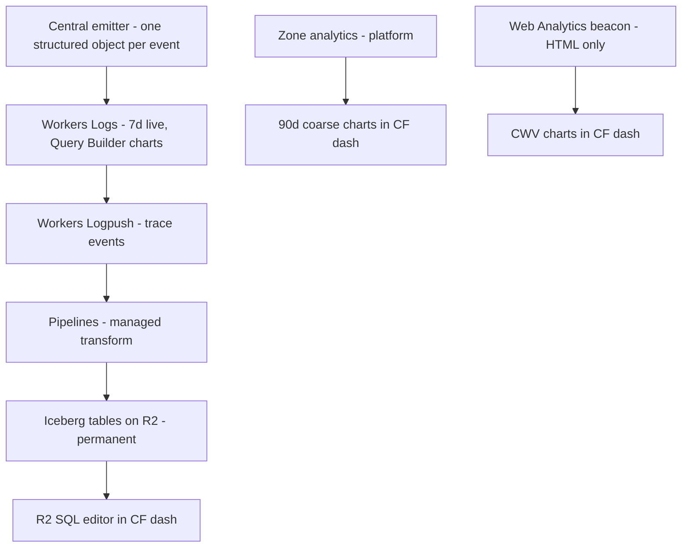

# Sitewide telemetry - Plan

## Goal Capsule

- **Objective:** The operator can answer "is the agent-native bet working" — agent vs human share of consumption, by
  delivery surface, trending over months — from Cloudflare-hosted surfaces, alongside the full operational picture a
  site administrator expects (health, content, audience, real-user performance). A visitor can read exactly what is and
  is not collected. Adding a new measurement is one emit call that flows through every layer.
- **Means:** a managed export chain to an open-format lake (Key Decisions 2; KTD1–KTD3), edge-injected Web Analytics
  (KTD5), and dashboard-side configuration recorded in the runbook wherever `wrangler.jsonc` cannot express it (KTD7).
- **Authority:** R-IDs win on required behavior. KTDs win on mechanism. This artifact is the parent view; the two child
  plans implement within it and are reconciled to it (see Alignment With Child Plans).
- **Execution order:** filename timestamps do not encode execution order. This parent leads the telemetry family: its
  config-wins milestone (U4 → U5) ships before everything else, and its staging-lake unit (U1) runs alongside the
  emitter plan's early units. Its production-lake and alert units (U2, U3) follow the emitter plan's production page
  record. The emitter plan is the family's second track; the session identity plan runs last.
- **Execution profile:** the config-wins milestone ships first — posture page, then the beacon flip. The lake stands up
  staging-first; its two audits gate production. Three proofs are live-surface and post-deploy, not suite-green.
- **Stop conditions:** stop and ask if any record or export would carry a client IP or raw User-Agent (R5), if the
  staging audit finds identifying data in the trace-event envelope, or if lake usage leaves the included billing tiers.
- **Open blockers:** none. The session plan's four open questions block its work, not this contract.
- **Tail ownership:** ends when the Definition of Done table is green, the runbook reproduces every dashboard-side
  artifact, and the thesis query returns production rows.

---

## Product Contract

### Summary

Telemetry reads from three Cloudflare-hosted layers: a live 7-day window (Workers Logs with Query Builder charts) fed by
one central emitter, a platform-computed coarse zone layer (90 days via the `httpRequests1dGroups` daily rollups), and a
permanent open-format raw-event lake fed by the same emitter through managed export (Workers Logpush → Pipelines →
Iceberg on R2, read via the in-dash R2 SQL editor). Cloudflare Web Analytics ships as its own day-one milestone for Core
Web Vitals. This artifact also owns the visitor taxonomy with its shared-vs-unique datapoint contract, the launch
tracker set, the privacy posture page, the analytics runbook, and the alignment contract for the two child plans.

### Problem Frame

The telemetry work accreted through pivots — visitor analytics, a CF-only reporting constraint, an emitter refactor, a
session-identity split, a WebMCP fold-in — and the view that justified each piece lived only in conversation. Worse, the
accreted constraints made the primary metric structurally unanswerable: agent share is a custom dimension our own
records carry, Workers Logs retains those records for 7 days, and no Cloudflare chart surface could hold a months-long
custom-dimension trend. This contract re-derives the architecture from the primary job and records what the derivation
confirmed, what it overturned, and what it obligates the child plans to change.

### Key Decisions

- **Thesis validation is the primary job** (session-settled: user-directed — chosen over reader behavior, audience
  intelligence, or operational health as primary: the product's identity docs stake the site on agent consumption).
  Everything else is captured but allowed to compromise. Governs R1–R3.
- **The trend layer is a managed streaming lake** — Logpush → Pipelines → Iceberg on R2, read via the in-dash R2 SQL
  editor (session-settled: user-approved — chosen over daily aggregate snapshots and Analytics Engine dual-write: raw
  grain lets new metrics be computed retroactively from fields already captured; snapshots freeze dimensions at write
  time and AE has no CF-hosted viewer). Supersedes the earlier decision to save off `httpRequestsAdaptiveGroups` daily.
  Governs R7–R11.
- **Reporting is Cloudflare-hosted only; Grafana is rejected** (session-settled: user-directed — chosen over external
  observability stacks: no third-party infra). The lake's open format — Iceberg REST catalog, S3-compatible API, no
  egress fees — is the recorded exit path if that ever changes. Governs R7.
- **Web Analytics ships day one as its own milestone** (session-settled: user-directed — chosen over deferring browser
  RUM: Core Web Vitals wanted from launch). Governs R4, R13.
- **Journeys are within-window only** (session-settled: user-directed — chosen over persistent identifiers: cross-window
  linkage is deliberately given up, not deferred). Governs R5.
- **The zone stays on the free plan** (session-settled: user-directed — chosen over paid zone plans: coarse zone data is
  acceptable because the lake carries the rich trend). Governs R10.
- **The public surface exposes shares only, never actuals** (session-settled: user-directed — chosen over raw counts or
  full public dashboards). Constrains the deferred public stats surface; no active R.
- **WebMCP observability is established by spike before any co-browsing backend is designed** (session-settled:
  user-directed — chosen over designing the backend first: WebMCP tools generate zero origin traffic, so what is
  observable must be measured, not assumed). Governs R14.
- **Config-only milestones ship first** (session-settled: user-directed — chosen over emitter-first or lake-first
  sequencing: Web Analytics and Email Sending onboarding are dashboard tasks with no code dependency, so CWV and
  alerting accrue while the emitter work proceeds; the lake waits for its field-shape verification). Governs R4, R13,
  R16.
- **The disclosure ships with the beacon flip** (session-settled: user-approved — chosen over a disclosure gap or a stub
  page: the posture page is content-only and small, so R6 stays true from the first day the beacon runs). Governs R6,
  R13.
- **Field vocabulary stays Cloudflare-native, not OpenTelemetry** (session-settled: user-approved — chosen over adopting
  OTel semantic conventions: portability already comes from the open-format lake and the platform's OTel export switch;
  renaming would churn the documented `mcp.request` contract).

### Actors and the datapoint contract

- A1. **Operator** — reads every layer; the only audience for actuals.
- A2. **Browser human** — a person in a browser; the only actor the Web Analytics beacon can measure.
- A3. **Agent client** — non-browser consumers in the emitter plan's client taxonomy (ai-fetcher, ai-crawler,
  search-crawler, cli-client); identity comes from that taxonomy's own table, never a stored User-Agent.
- A4. **Co-browsing pair** — a human and an agent sharing one session (WebMCP and successors); server-side invisible
  today, measured per the spike (R14).

Which datapoints are shared across visitor classes and which are unique:

| Datapoint                                                                                        | A2 human | A3 agent                       | A4 co-browsing         |
| ------------------------------------------------------------------------------------------------ | -------- | ------------------------------ | ---------------------- |
| Path, delivery surface, status, latency, cache state                                             | yes      | yes                            | yes                    |
| Client class (closed taxonomy)                                                                   | yes      | yes                            | yes                    |
| Browser family, `major.minor`, engine, OS                                                        | yes      | no                             | yes                    |
| Agent product name                                                                               | no       | yes                            | pending spike          |
| Session journey key (within-window; page-serving records only, never `mcp.request`/`score.tier`) | yes      | pending shared-egress analysis | yes                    |
| Core Web Vitals / RUM                                                                            | yes      | no                             | partial (browser side) |
| MCP method, outcome, `ms_bucket`                                                                 | no       | yes (MCP surface)              | pending spike          |
| Co-presence signal                                                                               | no       | no                             | pending spike          |

### Requirements

**Measurement jobs**

- R1. Agent-vs-human share of consumption, by delivery surface (HTML, markdown, MCP), is queryable over a months-long
  horizon from a Cloudflare-hosted surface. The headline agent numerator is ai-fetcher, cli-client, and MCP-surface
  traffic. Crawler traffic (ai-crawler and search-crawler together) reports as one separate top-level series, broken out
  by ai vs search — and by named crawler where the taxonomy knows it — at the granular tier; it is never folded into the
  headline share. Unknown-class traffic joins no numerator and reports as its own line.
- R2. Every page-serving record carries a client class from the emitter plan's closed taxonomy; agent identity derives
  from that module's table, never from stored User-Agent text.
- R3. Operational health (errors, latency, cache behavior, status codes) and content effectiveness (top paths, entries)
  are readable without custom queries in the live layer and the built-in zone dashboards; the zone's 90-day coarse
  horizon is reached through Custom Dashboards over the daily-rollup dataset.
- R4. Core Web Vitals and browser RUM are captured for A2 visitors from day one.
- R17. Within-window journeys are derivable from page-serving records via a non-persistent session key; the derivation
  mechanics live in the session identity plan under R5's constraints.

**Privacy posture**

- R5. No client IP and no raw User-Agent is stored in any record the site writes **or exports** — the Logpush job's
  field selection is audited the same way as the platform-key audit, so the export envelope cannot reintroduce what the
  records exclude. The audit completes and is recorded before the first Logpush job is enabled: a violation in the live
  layer expires in seven days; one in the lake is permanent.
- R6. The posture — what is derived, what is discarded, how long each layer retains records (including the lake's
  operator-controlled indefinite tier), what an operator can and cannot do, and the RUM beacon — is published where a
  visitor can read it.

**Pipeline shape**

- R7. Every reporting surface is Cloudflare-hosted, and the trend store stays open-format (Iceberg/Parquet in the site's
  own R2 bucket) so external engines can read it without migration. The bucket, its catalog, and every credential minted
  for the pipeline are operator-only and least-privilege — no public read path — with each credential's scope recorded
  per R15.
- R8. Raw events flow to the lake continuously through managed configuration (Logpush → Pipelines → Iceberg), not
  scheduled first-party code.
- R9. Every field the emitter writes is indexed in the live layer and lands queryable in the lake.
- R10. Retention tiers: live 7 days (platform cap); zone 90 days via the `httpRequests1dGroups` daily rollups (the
  built-in zone dashboards and the adaptive datasets window far shorter on the free plan); lake indefinite
  (operator-controlled R2 storage).

**Extensibility**

- R11. Adding a tracker is one emit call through the central emitter; its fields become queryable in the live layer and
  the lake without pipeline re-plumbing. Backfill is possible for metrics derivable from fields already present in the
  lake's history; fields a new tracker introduces accrue only from its first emit.
- R12. Launch ships the comprehensive tracker set — `page.request`, `mcp.request`, `score.tier`, web-audit run/error
  events, alert outcomes — with the scope vocabulary registered in one place.

**Operator intelligence**

- R13. Web Analytics is enabled as its own milestone: beacon on HTML pages, CWV read in its own Cloudflare dashboard,
  disclosed under R6, and the R6 posture page ships in the same milestone, with the beacon flip.
- R14. What the WebMCP layer can observe is established by the emitter plan's spike before any co-browsing telemetry
  backend is designed.
- R15. Every dashboard-side configuration that `wrangler.jsonc` cannot express — Logpush jobs, Pipelines streams and
  sinks, the data catalog, Web Analytics, any zone rules — is recorded in the analytics runbook with where and how it
  was configured.
- R16. Operator alerting standardizes on the repo's dormant KV-deduped email path over Cloudflare Email Sending once
  provisioned; no third-party alerting is introduced.
- R18. A stalled or failing lake export (the Logpush job or the Pipelines sink) is detected and alerted through the R16
  path well inside the live layer's 7-day window; the staleness check is recorded in the analytics runbook per R15.

### Key Flows

- F1. **Event lifecycle.**
  - **Trigger:** any request or Worker event, including cache-HIT pages served by the gateway alone.
  - **Steps:** the emitter writes one structured object; Workers Logs indexes every field for the live window; Logpush
    ships the trace event; Pipelines transforms and sinks it into the Iceberg table; the operator queries history in the
    R2 SQL editor.
  - **Covers:** R8, R9, R10.
- F2. **Adding a tracker.**
  - **Trigger:** a new measurement need is identified.
  - **Steps:** register the scope in the emitter vocabulary; add one emit call; fields are live in Query Builder the
    same day and in the lake at the next sink flush; optionally save a query for it.
  - **Covers:** R11, R12.

### Acceptance Examples

- AE1. **Covers R11.** Given the launch pipeline, when a developer adds a new tracker with two new fields via one
  emitter call, then those fields filter and group in Query Builder that day and appear as queryable lake columns with
  no Logpush or Pipelines edit.
- AE2. **Covers R1, R9.** Given a page served from the edge cache without the inner Worker running, when the gateway
  handles it, then a `page.request` record with its client class reaches both the live layer and the lake.
- AE3. **Covers R5.** Given any record in the live layer or the lake, when inspected across emitted fields and the
  platform/export envelope, then no client IP and no raw User-Agent appears.

### Success Criteria

- The thesis query — agent share by delivery surface, weekly — runs in the in-dash R2 SQL editor with history bounded
  only by the lake's accrual since launch.
- A new tracker reaches live queryability and the lake in under an hour of work end to end.
- `ce-doc-review` of both child plans against this artifact surfaces no contradiction.
- Monthly telemetry cost stays at ~$0 at current traffic: all usage inside the Workers Paid included tiers.

<!-- ce-section: work-relationships -->

### How This Work Fits Together

This artifact owns the parent view and the sitewide layer: lake configuration, Web Analytics enablement, the privacy
posture page, the analytics runbook, and the taxonomy contract. The breakdown below is the current understanding, not a
committed roadmap.

- **Thesis-accrual start** — the critical-path milestone: classified `page.request` records flowing to the lake. The
  emitter plan sequences UA derivation, client classification, and the page record ahead of its bulk migration
  (Alignment item 9), and the lake sink goes live within seven days of the first production deploy that emits classified
  page records — pre-lake page history older than the live window is unrecoverable.
- **Emitter plan** (`docs/plans/2026-09-01-0042-refactor-structured-log-emitter-plan.md`) — Enables R2, R9, R11, R12.
  Keeps its 13-unit shape; this artifact absorbs the "why" so that plan stays mechanism-only.
- **Session identity plan** (`docs/plans/2026-09-01-1152-feat-telemetry-session-identity-plan.md`) — Carries R17's
  journey mechanics under R5's privacy constraints. Depends on the emitter plan's `page.request` record and platform-key
  audit; blocked on its own four open questions.
- **CWV milestone** (R13) — Can proceed independently of everything above; it carries the R6 posture page with it.
- **Operator chart surface** — later area: a small operator-only page rendering thesis charts from scheduled R2 SQL
  results. Depends on the lake being proven. Still to decide: operator auth model.
- **Public shares-only surface** — later area on the same pipeline as the operator surface, with the shares-only
  redaction rule already settled. Enables the marketing/proof job.
- **Live-scoring Analytics Engine datasets** — existing and unchanged; not extended by this architecture
  (`docs/runbooks/live-scoring-analytics.md`).

### Alignment With Child Plans

What each child plan carries so every artifact reflects this contract:

1. Emitter plan: its emit-site inventory covers `src/worker/audit-web/audit-log.ts` and `src/worker/notify.ts`, whose
   `JSON.stringify` wrappers migrate to object emission, including the `audit-log.ts` header-comment correction —
   stringified fields index as `message` only. `tests/web-audit-observability.test.ts` sits on its string-assertion test
   list.
2. Emitter plan: the `WEB_AUDIT_DEBUG` verbosity convention (staging always-verbose, production transient `--var`) is an
   emitter-level debug tier (its KTD16), not a per-subsystem flag.
3. Emitter plan: its UA-classification units state the boundary against `src/shared/user-agents.ts` (outbound probe
   UAs), so the repo's two user-agent modules have a stated owner each.
4. Session identity plan: derivation reads only `CF-Connecting-IP`, and IPv6 addresses reduce to a routing prefix before
   keying — otherwise one /64 holder mints unlimited fresh identities.
5. Session identity plan: its platform-key question (OQ4) covers the Logpush export envelope, per R5.
6. Both plans cite this artifact by repo-relative path as the parent view instead of restating rationale.
7. Session identity plan: the within-window guarantee holds over the lake's indefinite retention — window salts are
   random and destroyed at rotation, and rotation cadence is weighed against permanent storage rather than the 7-day
   live window, so no retained secret can relink historical lake records.
8. Session identity plan: before journey keys extend beyond browser-class records, shared-egress analysis establishes
   whether an address-derived key groups anything meaningful for agent traffic leaving datacenter IP pools.
9. Emitter plan: UA derivation, client classification, and the page record (its U11, U12, U10) land ahead of the bulk
   console migration, so thesis-accrual start does not wait on the 40-site sweep.
10. Emitter plan: its production page-record deploy waits until U1's field-shape and export gates are green, so the lake
    sink can always be enabled inside the seven-day coupling window rather than proving the window retrospectively.

### Scope Boundaries

**Deferred for later**

- Operator chart surface and public shares-only surface — same pipeline, later areas (see How This Work Fits Together).
- Pulling CWV/RUM data into the lake — planning-time docs check; not needed for launch.
- Sequence and funnel precompute — needs cross-request state; revisit only with a concrete question that filter/group
  cannot answer.

**Outside this work's identity**

- Grafana or any external observability stack at launch; OTel semantic-convention renaming; cross-window visitor
  linkage; raw counts on any public surface; a paid zone plan.

### Dependencies / Assumptions

- Workers Paid plan capabilities verified against the Cloudflare docs MCP on 2026-09-01: Workers Logpush included (10M
  requests/month); Pipelines is a native Logpush destination with 50 GB/month included for transforms and sinks; R2 SQL
  has an in-dash editor with 10 GB/month scans included; R2 Data Catalog has free-tier catalog operations and
  compaction; Workers Logs caps at 7 days.
- Assumption: the gateway invocation produces a trace event on cache HITs (the gateway runs on every request), so the
  export covers HIT-served pages.
- Assumption, spike-gated: structured fields nested in the trace event's `Logs[]` envelope can be lifted into queryable
  Iceberg columns, and new fields flow through without transform edits. If this fails, R11's no-re-plumbing property
  needs a different sink shape before the lake is configured.
- Email alerting stays dormant until Email Sending onboarding completes (`docs/runbooks/web-audit-operations.md` §
  Failure notifications).
- No Cloudflare-managed alert product for Worker error rates was found (docs search 2026-09-01) — hence R16 builds on
  the repo's own path.

### Outstanding Questions

**Blocking:** none. The export field audit is KTD2 and U1; the field-shape verification is KTD3 and U1; launch tracker
field lists are the emitter plan's.

**Deferred to implementation**

- Whether CWV/RUM data can later be pulled into the lake, and Web Analytics' observed retention — recorded in the
  runbook after enablement (U6).
- Operator auth model for the future chart surface — owned by that later area, not this plan.

### Sources

- Cloudflare docs MCP, 2026-09-01: R2 SQL in-dash editor (changelog 2026-07-08); Pipelines as native Logpush destination
  for `workers_trace_events` (zone datasets are Enterprise-gated; account-scoped trace events are not); Pipelines and R2
  SQL billing enabled 2026-08-03 with the included tiers named above; Workers Observability visualizations (changelog
  2026-02).
- Repo: `wrangler.jsonc:33-47` (cache-enabled `Cached` export; observability at 100% sampling); 40 `console.*` sites
  under `src/worker/`; `src/worker/audit-web/audit-log.ts` and `src/worker/notify.ts` (PR #319, stringified emissions
  and the dormant email path); `src/shared/user-agents.ts` (PR #320);
  `docs/plans/2026-08-26-001-feat-mcp-baseline-adoption-plan.md:1080-1092` (the `mcp.request` contract and its exclusion
  line); `AGENTS.md:163`; `docs/runbooks/live-scoring-analytics.md`.
- Solutions corpus: cookieless allowlisted-event beacon for AE; fail-closed rate limiting on the platform-trusted IP
  header with IPv6 prefix reduction; Workers Logs object auto-extraction (do not pre-stringify); CI audit counting raw
  emit calls outside the log module; zone rules are dashboard/Rulesets-API only — record them in a runbook; kill
  switches are secrets, not vars; a new content page requires three coordinated registrations in `src/build/`; per-env
  wrangler override blocks replace whole sibling objects (inheritance trap); R2 freshness must be verified through the
  Worker read path, never `wrangler r2 object get`; CSP and beacon changes are verified on the served edge response.

---

## Planning Contract

**Product Contract preservation:** unchanged — Outstanding Questions were resolved in place into planning content; no
R-ID changed meaning.

### Key Technical Decisions

- KTD1. **The lake is the managed Logpush → Pipelines destination path with an Apache Iceberg sink into a dedicated
  bucket pair.** Buckets `anc-telemetry-lake` / `anc-telemetry-lake-staging`, R2 Data Catalog enabled with compaction,
  one Logpush job per environment filtered by script name. Instantiates the streaming-lake Key Decision
  (session-settled: user-approved — chosen over aggregate snapshots and AE dual-write) and Governs R7, R8. Dedicated
  buckets keep the permanent store's lifecycle and credentials isolated from `anc-score-cache`, whose prefix-scoped
  lifecycle rules must never touch lake data.
- KTD2. **The export is a field allowlist; the `Event` envelope stays excluded until audited.** The job's output field
  list names exactly `EventTimestampMs`, `EventType`, `Outcome`, `ScriptName`, `ScriptVersion`, `Exceptions`, `Logs`.
  The dataset defines no top-level client-IP or User-Agent field (docs, 2026-09-02); `Event` is the one opaque object
  and joins the allowlist only if U1's audit of a live staging delivery shows it clean. Job updates replace the options
  object wholesale, so the runbook records the full object verbatim. Governs R5.
- KTD3. **Pipelines SQL is passthrough; queries unpack at read time.** No unnesting or field-lifting in the transform —
  a lifted schema needs a pipeline edit per new field, which R11 forbids. R2 SQL's JSON extraction reads fields out of
  the `Logs[]` array at query time; U1 proves the thesis query works this way before production config exists. Governs
  R9, R11.
- KTD4. **Stall detection lists the lake bucket through a Worker binding on a daily cron.** A second cron expression
  joins the existing weekly trigger, declared per-env; the scheduled handler dispatches on the controller's cron string.
  Freshness is the age of the newest **ingest-written** object: catalog compaction rewrites old data into new objects
  with fresh timestamps, so a whole-prefix signal reads young during a real stall. U1 records whether compaction writes
  into the listed prefix; if it does, the check scopes to the sink's raw-write prefix (or the newest event timestamp)
  before U3 is built. A breach alerts via the KV-deduped email path. No stored credential, and Worker-path reads only —
  the CLI read path can serve stale copies. Governs R18.
- KTD5. **Web Analytics arrives by zone-level edge auto-injection.** The CSP already allowlists the beacon origins and
  an e2e test pins the header; enablement is a dashboard action. The free plan allows zero injection rules, so the
  beacon covers all zone HTML — acceptable because the zone serves only this site and staging lives outside the zone.
  Governs R4, R13.
- KTD6. **The posture page is an ordinary content page.** Prose only — the markdown twin serves content verbatim, so no
  widgets — registered in the three required build locations, linked from the footer meta row, and folded into the llms
  surfaces automatically. Governs R6, R13.
- KTD7. **The runbook owns only what wrangler cannot express.** Logpush jobs (full options objects), pipeline, stream,
  sink, and catalog names, every credential minted for the pipeline (name, permission set, scope), Web Analytics
  enablement and observed retention, the R3 Custom Dashboard, Email Sending onboarding state, and the canonical saved
  queries. Bindings, crons, and vars stay in `wrangler.jsonc` under the existing test guards. Governs R15.

### Assumptions

- The Pipelines-created sink writes objects under a stable prefix in the target bucket; U1 records the actual layout and
  U3 consumes it.
- Email Sending onboarding is an operator dashboard prerequisite for live alerts; until it completes, the alert path
  reports `unprovisioned` and the stall check only logs.
- Web Analytics retention is undocumented; the runbook records what the dashboard shows after enablement.

### Sequencing

Config-wins milestone first: U4 (posture page) → U5 (beacon flip), independent of the lake track. Lake track: U1
(staging lake plus both audits) → U2 (production lake, inside the seven-day coupling window with the emitter plan's
first classified page-record deploy) → U3 (stall alert). U6 (runbook) accretes from U1 onward and closes last.

---

## Implementation Units

### U1. Stand up the staging lake and run both audits

- **Goal:** The full export chain works against staging traffic, and the field-shape and export-privacy gates are
  answered with recorded evidence.
- **Requirements:** R5, R8, R9, R11 (KTD1, KTD2, KTD3)
- **Dependencies:** none.
- **Files:** `wrangler.jsonc` (staging `TELEMETRY_LAKE` binding → `anc-telemetry-lake-staging`, rationale comment;
  script-level logpush opt-in, both envs — without it the trace-event dataset receives nothing from the script),
  `tests/wrangler-config.test.ts` (staging-mirror, binding, and logpush-flag guards), `RELEASES.md` (bucket lifecycle
  rows), `docs/runbooks/sitewide-analytics.md` (created here, lake section).
- **Approach:**
  1. Create both buckets and enable the catalog on each — compaction and snapshot expiration together; everything
     wrangler can express lands in config, including the script-level logpush opt-in.
  2. Record the field-selection audit first (KTD2's allowlist against the dataset schema, `Event` excluded) — that
     record satisfies R5's before-enable gate; the batch inspection below is the live confirmation.
  3. Create the staging Logpush job in the dashboard: workers-trace-events dataset, Pipelines destination with an
     Iceberg sink into the staging bucket, filter to the staging script name, KTD2's field allowlist, no sampling.
     Record every credential the wiring mints — name, permission set, scope — minted least-privilege (the two lake
     buckets only).
  4. Generate staging traffic and confirm records land as queryable Iceberg rows. Record the sink's object layout,
     including whether compaction writes into the listed prefix (KTD4 depends on the answer).
  5. Field-shape gate: run the thesis-shaped query in the R2 SQL editor extracting fields from `Logs[]` (KTD3); add a
     throwaway field to one staging emit, confirm it is queryable with zero pipeline edits, then remove it.
  6. Export audit: inspect one delivered batch for identifying data, record the envelope's contents in the runbook, and
     only then decide whether `Event` may join the allowlist (KTD2). On finding identifying data: disable the staging
     job and delete every delivered object under the sink prefix before stopping, recording the purge.
- **Execution note:** configuration plus live-surface proof; prefer runtime verification over unit coverage. The audit
  record is as much the deliverable as the config.
- **Test scenarios:**
  - Test expectation: suite changes are limited to the wrangler-config guards for the new binding pair.
  - Live check — Covers AE1: a field emitted once appears as a queryable lake column with no Logpush or Pipelines edit.
  - Live check — Covers AE3: a delivered batch carries no client IP and no raw User-Agent in any field or envelope.
  - Live check: a staging request's log line is returned by the R2 SQL editor.
- **Verification:** staged rows returned in the R2 SQL editor; both audit findings recorded in the runbook; `bun test
  tests/wrangler-config.test.ts` green; `wrangler deploy --dry-run --env staging` resolves the binding.

### U2. Cut the production lake over inside the coupling window

- **Goal:** Production events accrue permanently, starting within seven days of the first classified page-record deploy.
- **Requirements:** R1, R7, R8, R10 (KTD1, KTD2, KTD3)
- **Dependencies:** U1 (both gates green); the emitter plan's page-record unit deployed to production (parent
  critical-path coupling).
- **Files:** `wrangler.jsonc` (production `TELEMETRY_LAKE` binding), `docs/runbooks/sitewide-analytics.md`,
  `RELEASES.md`.
- **Approach:** mirror the staging job against the production script name into the production bucket; save the canonical
  queries in the R2 SQL editor — the R1 headline (agent numerator), the crawler top-level series with its ai/search and
  named-crawler breakouts, and the unknown line; record job, sink, and query names in the runbook.
- **Test scenarios:**
  - Test expectation: none beyond config guards — proofs are live checks.
  - Live check — Covers AE2: a cache-HIT page's record appears as a lake row with its client class populated.
  - Live check: the saved headline query returns production rows with crawlers and unknown as separate series.
- **Verification:** thesis query returns production rows; the job's enable date is recorded in the runbook beside the
  emitter deploy date, proving the seven-day coupling held.

### U3. Alert when the lake goes stale

- **Goal:** A stalled export is detected and emailed well inside the live layer's window (R18).
- **Requirements:** R16, R18 (KTD4)
- **Dependencies:** U2 (the production sink and its object prefix exist); the emitter plan's central log module is
  merged by this point (U2's coupling already requires its page-record unit).
- **Files:** `src/worker/telemetry/lake-freshness.ts` (new), `tests/telemetry-lake-freshness.test.ts` (new),
  `src/worker/index.ts` (scheduled handler dispatches on the controller's cron string), `wrangler.jsonc` (second cron
  expression, declared per-env in both trigger blocks), `tests/wrangler-config.test.ts`.
- **Approach:** list the lake bucket via the binding under the ingest-write prefix U1 recorded (per KTD4 — never the
  whole data prefix, which compaction refreshes); compare the newest object's age to a named threshold constant (24
  hours — a full day with no delivery is a stall; the daily check bounds detection at under 48 hours against the 7-day
  loss window); on breach call the email path with key `telemetry-lake-stale` and the environment named in the subject
  and text; emit one structured status line per run through the central emitter. Staging runs log-only — its lake is
  legitimately quiet most days, and routine staging alerts would train the operator to ignore the production key.
- **Patterns to follow:** the rescore trigger's KV coalescing and status conventions; the audit-web cache's paginated
  `list` usage; the existing alert-caller shape (kebab-case key, one-sentence text).
- **Test scenarios:**
  - Happy path: newest object inside the threshold — no alert, one status line.
  - Error path: newest object older than the threshold — the email path is called once, with the stale age in the text.
  - Edge case: empty prefix (sink never delivered) — alerts; a never-started sink is stale.
  - Edge case: the email path reports `unprovisioned` — the status line records it and nothing throws.
  - Edge case: cron dispatch — the weekly string still routes to the web rescore, the daily string routes to the
    freshness check, and an unrecognized string logs and does nothing.
- **Verification:** `bun test tests/telemetry-lake-freshness.test.ts` green; both cron expressions resolve in `wrangler
  deploy --dry-run --env staging`; one forced-stale alert observed on staging.

### U4. Publish the privacy posture page

- **Goal:** A visitor can read the full posture (R6) before the beacon runs.
- **Requirements:** R6, R13 (KTD6)
- **Dependencies:** none — first unit to ship.
- **Files:** `content/privacy.md` (new), `src/build/07-subpages.mjs`, `src/build/10-sitemap.mjs`, `src/build/shell.mjs`
  (footer meta row link), `tests/build.test.ts`, `tests/e2e/flows.e2e.ts` (visit the page).
- **Approach:** a prose-only page covering R6's enumeration — what is derived (client class, browser family,
  `major.minor`, engine, OS, the within-window journey key), what is never stored or exported (client IP, raw
  User-Agent, per R5), per-layer retention including the lake's operator-controlled indefinite tier (per R10), what an
  operator can and cannot do (no cross-window linkage, per the settled journeys decision), the RUM beacon and what
  Cloudflare collects through it, and the shares-only public posture. Cite the governing R-IDs; do not restate
  mechanics.
- **Test scenarios:**
  - Build: the page and its markdown twin emit with title and description frontmatter, and the llms surfaces include
    them.
  - Guard: the content file carries no interactive widgets (the existing no-form-widgets guard covers it).
  - e2e: the HTML page returns 200 and the twin returns the markdown — asserted against the served output.
- **Verification:** `bun test tests/build.test.ts` and the e2e flow green; the served staging page verified over HTTP.

### U5. Flip Web Analytics on

- **Goal:** Core Web Vitals and RUM accrue for browser humans (R4), and the zone's 90-day coarse view exists (R3) — both
  dashboard-only enablements, disclosed and recorded.
- **Requirements:** R3, R4, R13 (KTD5)
- **Dependencies:** U4 deployed to production — the page ships with the flip (settled).
- **Files:** `docs/runbooks/sitewide-analytics.md` (Web Analytics and zone-dashboard sections); no code — the CSP
  allowance is already merged.
- **Approach:** enable Web Analytics for the zone (automatic setup) in the dashboard; verify on the served production
  response that the beacon script loads and reports — never from built output; record the site entry and the observed
  retention in the runbook. Then create the Custom Dashboard over the daily-rollup dataset (`httpRequests1dGroups`,
  verified available on the free zone plan against the live account) for R3's 90-day coarse view, and record its name
  and panels in the runbook per R15.
- **Test scenarios:**
  - Test expectation: none in the suite — dashboard configuration; the live checks below are the proof.
  - Live check: the served production HTML carries the injected beacon on both a cache-HIT and a cache-MISS response,
    without CSP violations.
  - Live check: the Web Analytics dashboard shows page views and Core Web Vitals within a day.
  - Live check: the Custom Dashboard renders the 90-day coarse charts from the daily-rollup dataset.
- **Verification:** beacon observed on the served response (both cache states); both dashboards populated; runbook
  updated.

### U6. Write the analytics runbook

- **Goal:** Every dashboard-side artifact is reproducible from the runbook alone (R15).
- **Requirements:** R15 (KTD7)
- **Dependencies:** U1–U5 — accretes throughout and closes last.
- **Files:** `docs/runbooks/sitewide-analytics.md`.
- **Approach:** follow the house runbook style (environment table, config records, canonical queries, cross-references).
  Record: both Logpush jobs with their full options objects verbatim (updates replace the object wholesale, per KTD2);
  pipeline, stream, sink, and catalog names; every credential minted for the pipeline with its name, permission set, and
  scope (per R7/R15); the saved R2 SQL queries; the Web Analytics entry and observed retention; the R3 Custom
  Dashboard's name and panels; Email Sending onboarding state with a pointer to the owning runbook's steps; both U1
  audit records and the recorded sink layout; and the standing note that freshness and CSP verification use the Worker
  read path and the served edge response, never CLI reads or built output.
- **Test scenarios:**
  - Test expectation: none — documentation; `bun run lint` green.
- **Verification:** an operator can re-create every dashboard-side artifact from the runbook alone; markdownlint green.

---

## Verification Contract

| Gate                    | Command / check                                                            | Applies to |
| ----------------------- | -------------------------------------------------------------------------- | ---------- |
| Unit tests              | `bun test`                                                                 | U3, U4     |
| Typecheck + lint        | `bun run typecheck && bun run lint`                                        | U3, U4, U6 |
| Wrangler config guards  | `bun test tests/wrangler-config.test.ts`                                   | U1, U2, U3 |
| Config resolution       | `wrangler deploy --dry-run --env staging` (and the production dry-run)     | U1, U2, U3 |
| Build + twin            | `bun test tests/build.test.ts`                                             | U4         |
| e2e                     | existing suite plus the posture-page visit                                 | U4         |
| **Lake rows (staging)** | R2 SQL editor returns staged rows; new-field check passes with no re-plumb | U1         |
| **Lake rows (prod)**    | saved thesis query returns production rows                                 | U2         |
| **Served beacon**       | beacon loads on the served production response                             | U5         |
| **Forced stale**        | one staging stall alert observed end to end                                | U3         |

**Proof discipline.** Three observations are required, not asserted: U1's new-field-no-replumb check, U1's export-audit
batch inspection, and U3's forced-stale alert. Live-surface checks run against served responses and Worker-path reads —
built output and CLI object reads are not evidence.

---

## Definition of Done

**Global**

- Every requirement R1–R18 is satisfied by a unit here or explicitly owned by a child plan (the emitter plan carries R2,
  R9's emission half, R11's emit path, R12, and R14's spike; the session plan carries R17).
- The posture page is live before or with the beacon flip, and no record or export carries a client IP or raw User-Agent
  — audited, not assumed.
- The production lake is accruing within seven days of the first classified page-record deploy, and the saved thesis
  query returns rows.
- The runbook reproduces every dashboard-side artifact; `RELEASES.md` carries the lake buckets' lifecycle rows; monthly
  usage stays inside the included tiers.
- No experimental leftovers: U1's throwaway field is removed, and no unused binding or cron survives.

**Per unit**

| Unit | Done when                                                                                                                             |
| ---- | ------------------------------------------------------------------------------------------------------------------------------------- |
| U1   | Staged rows queryable; new-field and export audits recorded in the runbook; binding guards green.                                     |
| U2   | Production job live inside the coupling window; canonical queries saved and returning rows.                                           |
| U3   | Freshness tests green; both crons resolve per-env; one forced-stale alert observed on staging.                                        |
| U4   | Page and twin emitted, registered in all three build locations, reachable from the footer, verified over HTTP.                        |
| U5   | Beacon observed on both cache states of the served response; Web Analytics and the R3 Custom Dashboard populated; retention recorded. |
| U6   | Runbook alone suffices to re-create every dashboard-side artifact; lint green.                                                        |

---

## Shipped state (2026-09-02)

PR [#322](https://github.com/brettdavies/agentnative-site/pull/322), squash-merged to `dev` as `8e4d3fe`, carries the
repo-side implementation. Per unit:

| Unit | State                                                                                                                                     |
| ---- | ----------------------------------------------------------------------------------------------------------------------------------------- |
| U1   | Config half shipped in #322: binding pair, logpush opt-in, guards, `RELEASES.md` catalog records, runbook with the field-selection audit. Buckets created 2026-09-02. Open: catalog enablement (token lacks the R2 Data Catalog permission), staging Logpush job, export audit, sink-layout record. |
| U2   | Not started. Blocked on U1's gates. The emitter plan's page record is on `dev` (#330 `77814f9`, #331 `fbeff01`, 2026-09-03) and waits with the rest of that track for U1's gates before its production deploy, so the seven-day coupling window has not opened. |
| U3   | Code shipped in #322, including review hardening: the check fails closed while `LAKE_INGEST_PREFIX` is unscoped, and a production listing failure alerts via `telemetry-lake-check-failed`. Its status line now emits through the central emitter (#331). Open: the forced-stale staging observation (needs the staging lake live). |
| U4   | Shipped in #322: page, twin, three registrations, footer link, build and e2e tests; browser-verified light and dark. Follow-up commits on the same PR ground the closing note in the code and add the controller/lawful-basis/processor section. |
| U5   | Not started. Dashboard-only; U4 reaches production with the next production deploy.                                                        |
| U6   | Runbook created in #322 (`docs/runbooks/sitewide-analytics.md`); accretes as the dashboard-side records land.                              |

The operator steps above are recorded with their commands and reserved slots in the runbook; the freshness check arms
via the one-line prefix change after the sink layout is recorded.

The emitter track (`docs/plans/2026-09-01-0042-refactor-structured-log-emitter-plan.md`, its own Shipped state) is
merged to `dev` in #330 and #331: R2, R9's emission half, R11's emit path, R12, and R14's spike are carried. The U1 export
audit gains a recorded input from that track's U6: the platform's invocation records hold the client IP and raw
User-Agent in the live layer, and the `Event` envelope's exclusion from the Logpush allowlist is what keeps them out of
the lake.
