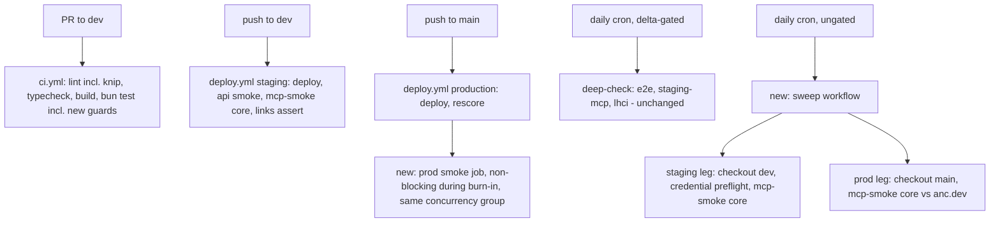
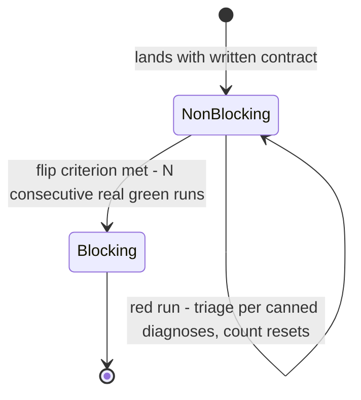

# Meum Sites Hardening Adoption - Plan

## Goal Capsule

- **Objective:** Five defect classes that today would ship or rot silently are caught by standing gates: a CI/local
  toolchain split corrupting built assets, a live production surface breaking between deploys, dead code hiding
  unshipped modules or styles, a shared cache serving the wrong representation, and keyboard-unreachable scrolled
  content.
- **Means:** Adopt seven hardening measures proven in the meum-id/sites sibling repo, adapted to this repo's build,
  deploy, and caching architecture (KTD1-KTD8).
- **Authority:** This plan governs implementation shape. `AGENTS.md` invariants (build-before-test ordering,
  browser-verify before done, explicit Accept headers on live probes) and the docs/solutions constraints cited per KTD
  are binding. Session-settled decisions are labeled on their KTDs and are not re-litigated.
- **Stop conditions:** Stop and report if the Bun 1.4.0 bump flushes order-dependent test failures too broad to resolve
  inside U2. Stop if knip cannot reach zero findings without ignoring what looks like genuinely dead code. Stop if a
  change would put `s-maxage` on negotiated `Cache-Control` or move Vary emission out of `applyHeaders` (R16).

---

## Product Contract

### Summary

Adopt seven hardening measures from meum-id/sites: a single-source Bun pin with a guard test (bumping to 1.4.0), a daily
lightweight sweep of the live staging and production surfaces plus a post-deploy production smoke, knip as a blocking
lint gate, keyboard reachability for scrolling regions with 390px axe coverage confirmed, CSS custom-property and
stylesheet-shipping contract tests, a font guard against built output, and a shared content-negotiation predicate that
ends Vary drift on the score endpoints.

### Problem Frame

A review of meum-id/sites (a downstream fork of this repo) PRs #114-#135 surfaced hardening this repo lacks. The gaps
are live: CI pins Bun 1.3.11 at five workflow sites (two `BUN_VERSION` env definitions, three inline literals) feeding
seven `setup-bun` steps, while local development runs 1.4.0, the exact split that shipped Chromium-rejected font CSS in
the sibling (1.3.11's CSS minifier corrupts `format()` hints; this repo defends in source but not in built output). The
production deploy job runs `wrangler deploy` and a rescore POST with no smoke, and nothing probes anc.dev between
deploys. `bun run lint` has no dead-code analysis. The score endpoints stamp Vary inconsistently: `JSON_HEADERS_LIVE`
omits Vary on the Accept-negotiated extensionless `/api/score`, while `JSON_HEADERS_CACHE_HIT` stamps `Vary: Accept` on
suffix-pinned paths that serve one representation. The client-injected live-score stderr panel scrolls with no keyboard
path.

### Key Decisions

- **Adopt all seven measures; exclude the preflight rename-handling check** (session-settled: user-approved — the one
  assessment item the user did not select). Governs R1-R16.
- **Only lightweight checks run daily without code changes; heavy suites stay commit-gated** (session-settled:
  user-directed — chosen over the sibling's ungate-everything sweep: deep-check's Playwright/Lighthouse jobs burn wall
  clock and CPU that a quiet day does not justify). Governs R4, R6.
- **The Bun pin reaches every local and remote surface — hooks, scripts, CI** (session-settled: user-directed — chosen
  over workflow-only wiring). Governs R1-R3.

### Requirements

**Toolchain**

- R1. The Bun toolchain version is declared exactly once in the tree; every workflow resolves it from that declaration
  and no workflow names a version inline or via env indirection.
- R2. A guard test fails when a workflow reintroduces an inline pin (any value, including `latest`) or a `BUN_VERSION`
  env definition, when `bun-types`' lockfile-resolved version stops tracking the pinned minor, or when the running Bun
  differs from the pin; each failure message states the fix.
- R3. CI and local development build with the same Bun, 1.4.0.

**Live-surface monitoring**

- R4. The live staging and production surfaces are probed daily by a lightweight sweep, independent of whether code
  changed.
- R5. Every production deploy is followed by an automated smoke of the production surface.
- R6. deep-check's preflight gating and job set are unchanged.
- R7. A red sweep or smoke distinguishes credential rot (CF Access redirect/401) from a broken surface before the MCP
  probes run.
- R8. The new live-surface gates land non-blocking under a written burn-in contract (flip criterion, red-run policy,
  canned diagnoses, job-level verification) with the flip to blocking recorded as follow-up.

**Dead code**

- R9. `bun run lint` fails on an unreachable source file, an unused declared dependency, or an import no manifest
  declares; unused exports stay out of the gate.

**Accessibility**

- R10. Every scrollable region on shipped surfaces is keyboard-reachable with a visible focus ring, and a regression
  test pins the tab stop in built output.
- R11. Serious or critical axe violations at 390px width fail the e2e suite for the audited page set (existing
  `mobile-ios` coverage counts once verified; add only what is missing).

**Build contracts**

- R12. A test fails when a shipped stylesheet references a custom property no shipped stylesheet defines (with a
  declared allowlist for runtime-defined properties) or when a hand-authored stylesheet stops shipping to dist.
- R13. A test against built dist output fails when a font-face loses its `src` url, carries a `-variations` format hint,
  or references a font file absent from `dist/fonts/`; the hardcoded preload hrefs are covered by the same contract.

**Cache-header correctness**

- R14. One shared predicate decides whether a path is pinned to a single representation; every layer that stamps Vary or
  selects a representation consumes it.
- R15. Each score endpoint's Vary names exactly the request signals its representation depends on, per the matrix in
  High-Level Technical Design.
- R16. The format-class edge-cache contract is preserved: `applyHeaders` stays the single class-aware Vary/Cache-Tag
  writer and no negotiated response gains `s-maxage`.

### Scope Boundaries

- The release-preflight rename-handling check (`--no-renames`) is out — reviewed and not selected.
- knip's unused-exports and unused-exported-types findings stay out of the gate (test-only exports and
  inference-consumed types dominate them).
- `scripts/design/` is excluded from knip analysis; its two real dependencies lose dead-dep coverage, recorded in the
  knip config rationale.
- No integration with `src/worker/notify.ts` email alerts: it is Worker-internal and unreachable from an Actions job.
  GitHub's scheduled-workflow failure email is the accepted channel, per the `skill-availability.yml` precedent.
- Prose code blocks keep horizontal scroll; switching them to wrapping is out (settled).

#### Deferred to Follow-Up Work

- Flipping the sweep and production smoke to blocking once the burn-in flip criterion is met (recorded in the U6
  runbook).
- A scheduled run of the lint gates against `dev` to close the trunk-blindness gap (pull_request-only CI never re-scans
  the trunk; surfaced by docs/solutions, not in this scope).
- A `/ce-compound` capture of the 390px-axe and tabindex findings after U5 lands (no corpus prior art exists).

### Sources / Research

- meum-id/sites PRs #114-#135, especially #134/#135 (Bun pin + guard), #121 (sweep + prod smoke), #130 (knip), #125-#127
  (a11y and CSS contract), #118 (Vary), #132 (font guard). External prior art; every measure below adapts rather than
  copies.
- docs/solutions (shared corpus): `best-practices/declare-the-bun-toolchain-version-once-in-tree.md` (the Bun spec,
  2026-09-01), `best-practices/land-a-new-verification-gate-non-blocking-under-a-written-burn-in-contract.md`,
  `architecture-patterns/format-class-workers-caching-skip-worker-hit.md`,
  `best-practices/parse-numeric-design-tokens-to-survive-minifier-reformatting.md`,
  `best-practices/hook-ci-workflow-parity-test-via-direct-content-assertions.md`,
  `developer-experience/postflight-html-smoke-accept-and-pipefail.md`,
  `integration-issues/wrangler-deploy-route-propagation-lag-curl-retry.md`,
  `integration-issues/agents-legacy-mcp-lane-dual-accept-rewrite-and-sse-to-json-coercion.md`,
  `workflow-issues/all-open-prs-failing-same-required-check-means-latent-base-branch-failure.md`,
  `workflow-issues/smoke-script-placement-follows-invoker-release-gate-vs-guarded-diagnostic.md`,
  `design-patterns/single-capability-predicate-gates-every-advertising-and-serving-layer.md`.
- Key code anchors: `src/worker/headers.ts` (`applyHeaders`, `isSingleRepresentation`), `src/worker/index.ts`
  (`preferMarkdown` at the twin dispatch),
  `src/worker/score/{response-shape.ts,handler.ts,summary-render.ts,content-negotiation.ts}`, `src/worker/accept.ts`
  (`detectScorePreference` reads Accept only), `src/build/01-assets.mjs` (client bundling by path strings; font copy
  array), `src/build/render.mjs`, `src/shared/scorecard-format.mjs`, `scripts/release/mcp-smoke.sh`,
  `scripts/smoke-api-score.sh`, `.github/workflows/{ci,deep-check,deploy,dependabot-lockfile}.yml`.

---

## Planning Contract

### Key Technical Decisions

- KTD1. **Pin Bun 1.4.0 in a `.bun-version` file, resolved by every `setup-bun` step via `bun-version-file`**
  (session-settled: user-approved — chosen over centralizing on CI's current 1.3.11: local already runs 1.4.0, and
  1.3.11's CSS minifier corrupts `format()` hints, the recorded reason the version must move). `setup-bun` falls through
  to a silent `latest` when unconfigured, so every step passes the file explicitly. The fleet spec is
  `docs/solutions/best-practices/declare-the-bun-toolchain-version-once-in-tree.md`; this repo adds one assertion the
  fleet copy lacks: no `BUN_VERSION:` env definitions, because the spec's inline-pin regex does not match `${{
  env.BUN_VERSION }}` indirection and four of this repo's seven `setup-bun` steps resolve their version through it.
- KTD2. **Guard coverage is the workflow scan plus a runtime assertion; hooks and scripts need no edits**
  (session-settled: user-directed on scope — all surfaces over workflow-only). Research verified
  `scripts/hooks/pre-commit`, `pre-push`, and every shell script invoke `bun` from PATH with no version reference; the
  `Bun.version === pin` assertion runs in `bun test` (pre-push stage 4 and CI), which is what covers the local surface.
  Exact match, per the repo's exact-pin culture, with a failure message naming the installed and pinned versions and the
  fix.
- KTD3. **The sweep is a new two-job lightweight workflow, cron plus dispatch, with no delta gate** (session-settled:
  user-directed — heavy suites stay commit-gated; the sweep exists for non-code rot, the case a delta gate skips).
  Staging leg checks out `dev` (its assertions must match what staging runs, mirroring deep-check's `staging-mcp`
  checkout comment); production leg keeps the default `main` checkout. Cadence 13:37 UTC — waking hours per the
  `skill-availability.yml` precedent, offset from its 13:00. Legs are separate jobs so each reds independently; no
  `environment:` on the production leg (no secrets needed; protection rules would queue approvals).
- KTD4. **The production post-deploy smoke lands as a separate non-blocking job under the written burn-in contract** —
  job-level `continue-on-error: true` as a literal, `needs` on the production job, the same `deploy-production`
  concurrency group (`cancel-in-progress: false`) so a second merge cannot swap the deploy under a running smoke, and a
  propagation retry loop before hard assertions. This is the governed exception to the no-soft-fail rule: the burn-in
  doc requires the four-part contract (flip criterion of N consecutive real green runs, red-run policy, canned
  diagnoses, job-level verification because run conclusion stays green under `continue-on-error`). The sweep itself is
  blocking from day one — it gates nothing downstream, so red simply shows red.
- KTD5. **knip lands blocking on day one, scoped to files, dependencies, and unlisted imports** — deterministic static
  analysis with no infra failure modes, the burn-in doc's own skip-clause. Config declares what import analysis cannot
  see: `src/build/build.mjs`, `src/worker/index.ts`, the eleven `src/client/*.ts` files bundled by path strings in
  `src/build/01-assets.mjs` (only those — import-reached client modules stay analyzable), `playwright.config.ts`, test
  globs plus `tests/bun-setup.ts` and non-test helpers, `scripts/**` CLIs including `scripts/web-audit/audit.ts`.
  `@lhci/cli` is ignored with its reason (spawned via `bun x` from deep-check only); `scripts/design/` is excluded as a
  nested standalone package.
- KTD6. **The a11y work is cut to the verified gap** (session-settled: user-approved — scroll plus tab stop chosen over
  switching code blocks to wrap). Dist evidence: Shiki emits `tabindex="0"` on every fenced code block by default,
  `src/shared/scorecard-format.mjs` already writes it, and `.remediation__body` wraps by design and is not scrollable.
  The real work: a tab stop on the client-injected `live-score__bounce-stderr` panel, a regression test pinning
  `tabindex="0"` in built output (guards the Shiki default across shiki and Bun bumps), and verifying the existing
  `mobile-ios` project's axe pass already covers the page set at 390px before writing anything new. No rehype plugin: a
  second writer of an attribute Shiki already emits is dead code on arrival.
- KTD7. **CSS and font contract tests read built dist after a build and parse values instead of string-matching minified
  bytes** (`docs/solutions/best-practices/parse-numeric-design-tokens-to-survive-minifier-reformatting.md`). They follow
  the `tests/regression.test.ts` read-prior-build pattern (safe in CI and pre-push, both of which build first) with a
  shared guard that names the fix when `dist/` is missing. The var() check treats generated `src/styles/foundation.css`
  as the token authority, allowlists the five runtime-defined `--shiki-dark*` properties, states its policy for
  `var(--x, fallback)` references, and scopes globs to `src/styles/` (top-level `styles/` is Vale config;
  `scripts/og/og.css` is a recorded non-shipped exception). The font additions extend `tests/font-face-src.test.ts`
  rather than opening a second font guard: dist url-to-file existence, and the two preload hrefs hardcoded in
  `src/build/shell.mjs` against the same contract.
- KTD8. **The shared predicate unifies only "is this path pinned to one representation"; Vary strings stay per-surface
  inside their owning writers**
  (`docs/solutions/design-patterns/single-capability-predicate-gates-every-advertising-and-serving-layer.md`,
  constrained by `format-class-workers-caching-skip-worker-hit.md`). Seed it from `headers.ts`'s exported
  `isSingleRepresentation` plus the `.md`-suffix check; consume it in `applyHeaders`, `index.ts`'s `preferMarkdown`,
  `summary-render.ts`'s `liveScoreHeaders`, the score header shaping, and the score module's own suffix dispatch
  (`content-negotiation.ts`'s `preferenceFor`). Score header sets become pathname-aware — the implementer picks whether
  the pathname threads through `shapeScoreSuccess`/`shapeScoreError` (~25 call sites) or through `shapeWithPreference`,
  which also fixes the markdown variants that inherit these sets via `markdownHeaders`. Vary for extensionless
  `/api/score` is `Accept` alone: `detectScorePreference` never reads User-Agent, and `Accept, User-Agent` would
  fragment the cache pointlessly.

### High-Level Technical Design

**Vary matrix (R15).** Vary names exactly the signals the representation depends on; `applyHeaders` remains the writer
for the twin-page classes, the score modules own their rows.

| Path                                   | Representations      | Negotiation input    | Vary                                                                   |
| -------------------------------------- | -------------------- | -------------------- | ---------------------------------------------------------------------- |
| Extensionless content pages            | HTML / markdown twin | Accept + agent class | `Accept, User-Agent` (unchanged)                                       |
| `.md`, `.json`, `.svg`, hashed assets  | one                  | none (path-keyed)    | none (unchanged)                                                       |
| `/api/score` extensionless             | JSON / markdown      | Accept only          | `Accept` (fixes missing Vary on live responses)                        |
| `/api/score.json`, `/api/score.md`     | one                  | none (suffix-pinned) | none (fixes wrongly stamped `Vary: Accept` on cache hits)              |
| Live-score pages (`summary-render.ts`) | HTML / markdown      | Accept + agent class | `Accept, User-Agent` (unchanged, re-derived from the shared predicate) |

**CI gate topology after U6.**

**Burn-in lifecycle for the two new live-surface gates (KTD4).**

---

## Implementation Units

### U1. CSS contract tests and font dist guard

- **Goal:** Built output fails tests when a custom property is undefined, a stylesheet stops shipping, or a font
  declaration or file goes wrong in dist (R12, R13).
- **Requirements:** R12, R13. Cites KTD7.
- **Dependencies:** none.
- **Files:** `tests/css-contract.test.ts` (new), `tests/font-face-src.test.ts` (extend), `tests/helpers/` (shared
  dist-missing guard if a helper earns it).
- **Approach:**
  1. Add the dist-missing `beforeAll` guard with an actionable message; reuse it in both files.
  2. CSS contract: glob `dist/**/*.css`, collect defined custom properties across all shipped stylesheets plus the
     `--shiki-dark*` allowlist, then fail on any bare `var(--x)` whose property no source defines; state and test the
     `var(--x, fallback)` policy.
  3. Stylesheet-shipping: every hand-authored stylesheet under `src/styles/` has a dist counterpart; `scripts/og/og.css`
     is the recorded exception.
  4. Font additions in `tests/font-face-src.test.ts`: every `url(/fonts/...)` in dist CSS resolves to a file in
     `dist/fonts/`; the `src/build/shell.mjs` preload hrefs resolve against the same set; the existing `-variations` and
     `src`-survival assertions extend to dist bytes.
- **Execution note:** Prove each new assertion red against a deliberately broken tree (an injected undefined `var()`, a
  font removed from the `01-assets.mjs` copy array, an injected `-variations` hint) before landing it green — the repo's
  proof discipline for guards.
- **Patterns to follow:** `tests/regression.test.ts` (read prior build), `tests/font-face-src.test.ts` (parse, not
  byte-match), `tests/spec-version-hardcoding.test.ts` (scan-genre test shape).
- **Test scenarios:**
  - Undefined `var(--nonexistent)` injected into `src/styles/site.css` fails with the property name in the message.
  - The `--shiki-dark*` references pass via the allowlist.
  - A `var(--x, 12px)` reference follows the stated fallback policy.
  - Removing a font from the `01-assets.mjs` copy array fails the dist-existence check.
  - A preload href pointing at a non-copied font fails.
  - Clean tree: all assertions pass against a fresh `bun run build`.
- **Verification:** New tests green on a fresh build; each observed red under its injection; `bun test` without a prior
  build reports the guard message, not ENOENT.

### U2. Bun single-source pin, guard test, and 1.4.0 bump

- **Goal:** One in-tree Bun declaration, guarded, with CI and local converged on 1.4.0 (R1-R3).
- **Requirements:** R1, R2, R3. Cites KTD1, KTD2.
- **Dependencies:** U1 (the dist guards are the tripwires for the minifier change the bump brings).
- **Files:** `.bun-version` (new), `.github/workflows/ci.yml`, `.github/workflows/deep-check.yml`,
  `.github/workflows/deploy.yml`, `.github/workflows/dependabot-lockfile.yml`, `package.json`, `bun.lock`,
  `tests/bun-version.test.ts` (new).
- **Approach:**
  1. Create `.bun-version` containing `1.4.0`.
  2. Convert all seven `setup-bun` steps to `bun-version-file: .bun-version`; delete the two `BUN_VERSION` env
     definitions and the three inline literals.
  3. Bump `bun-types` to `^1.4.0` in the same change and refresh `bun.lock`.
  4. Write the guard per the fleet spec's five assertions, plus this repo's sixth: no `BUN_VERSION:` env definition in
     any workflow. The inline-pin scan matches any value (the `latest` hole), counts `setup-bun` steps per workflow
     against `bun-version-file` reads, compares `bun-types` via its lockfile-resolved version, and asserts `Bun.version`
     equals the file's pin with a failure message naming both versions and the fix.
- **Execution note:** Land through the PR gate, never a direct dev push — the push pipeline skips `bun test`, and a
  toolchain bump can flush latent order-dependent test failures (docs/solutions 2026-08-25). Run the full local gate
  (`bun run build`, `bun test`, e2e sanity) and browser-verify the fonts in both themes before opening the PR. Prove
  each guard assertion red by injection (`bun-version: latest` into a workflow; a restored `BUN_VERSION:` env;
  `.bun-version` set to `1.5.0`).
- **Patterns to follow:** `docs/solutions/best-practices/declare-the-bun-toolchain-version-once-in-tree.md` (reference
  implementation), `docs/solutions/best-practices/hook-ci-workflow-parity-test-via-direct-content-assertions.md` (read
  the real tracked files).
- **Test scenarios:**
  - `.bun-version` parses as a bare semver.
  - Injected `bun-version: latest` in any workflow fails, naming the file.
  - Injected `bun-version: 1.4.0` literal fails the same way.
  - A restored `BUN_VERSION:` env definition fails.
  - A `setup-bun` step without `bun-version-file` fails with the per-workflow count.
  - Lockfile-resolved `bun-types` off the pinned minor fails.
  - `Bun.version` mismatch fails with both versions and the remedy in the message.
- **Verification:** All workflows green through the PR gate; `actionlint` clean; fonts load in Chromium in both themes
  off the new build; guard observed red under each injection.

### U3. knip as a blocking lint gate

- **Goal:** `bun run lint` fails on unreachable files, unused dependencies, and unlisted imports (R9).
- **Requirements:** R9. Cites KTD5.
- **Dependencies:** none.
- **Files:** `knip.json` (new), `package.json` (lint script, knip devDependency), `bun.lock`.
- **Approach:**
  1. Configure entries per KTD5; record the reason beside every exemption (`@lhci/cli`, `scripts/design/` exclusion).
  2. Append knip to the `lint` script — CI's checks job and pre-push stage 1 inherit it with no workflow edit;
     pre-commit intentionally does not run it.
  3. First run doubles as a trunk audit: triage any finding on `dev` in the same PR (research found no dead build
     modules, so expect config work, not deletions — but treat any real finding as in-scope cleanup).
- **Patterns to follow:** meum-id/sites PR #130's scoping (files/dependencies/unlisted only; unused exports out).
- **Test scenarios:**
  - An injected orphan module under `src/` fails `bun run lint`.
  - An injected unused devDependency fails.
  - An injected import of an undeclared package fails.
  - Clean tree: `bun run lint` exits 0 including knip.
- **Verification:** `bun run lint` green locally and in CI; the three injection drills observed red; every exemption
  carries its reason in `knip.json`.

### U4. Shared negotiation predicate and score Vary alignment

- **Goal:** One predicate decides single-representation vs negotiated; score endpoints carry the matrix's exact Vary
  (R14-R16).
- **Requirements:** R14, R15, R16. Cites KTD8 and the HTD Vary matrix.
- **Dependencies:** none.
- **Files:** `src/worker/headers.ts`, `src/worker/index.ts`, `src/worker/score/response-shape.ts`,
  `src/worker/score/handler.ts`, `src/worker/score/summary-render.ts`, `src/worker/score/content-negotiation.ts`,
  `tests/worker.test.ts`, `tests/score-response-shape.test.ts`, `tests/score-handler.test.ts`.
- **Approach:**
  1. Export the predicate from `headers.ts`; re-derive `applyHeaders`' own branch, `index.ts`'s `preferMarkdown`, and
     `liveScoreHeaders` from it so the negotiating set cannot drift.
  2. Make score header shaping pathname-aware (thread via `shapeWithPreference` or the shape functions — implementer's
     pick per KTD8), emitting the matrix rows for live, cache-hit, and markdown-variant responses.
  3. Do not touch `Cache-Control` values or move Cache-Tag/class-TTL writing (R16).
  4. Update the pinned Vary expectations across the three test files in the same change; add matrix-row cases that are
     currently untested.
- **Patterns to follow:** `src/worker/audit-web/route.ts`'s `withNegotiatedHeaders` (already delegates to `applyHeaders`
  — the aligned end state).
- **Test scenarios:**
  - Extensionless `/api/score` live JSON response carries `Vary: Accept`; the markdown variant of the same URL carries
    the same.
  - `/api/score.json` and `/api/score.md` responses (live and cache-hit) carry no Vary.
  - Cache-hit extensionless `/api/score` carries `Vary: Accept`.
  - A negotiated content page still carries `Vary: Accept, User-Agent`; a `.md` twin still carries none (existing matrix
    in `tests/worker.test.ts` stays green).
  - A predicate-drift canary: the set of paths `preferMarkdown` treats as negotiable equals the set `applyHeaders`
    stamps (asserted through the shared export, not by duplicating the list).
  - The score module's `preferenceFor` suffix dispatch agrees with the shared predicate on the three score paths —
    extensionless, `.json`, and `.md` — the same drift-canary shape as the twin-dispatch case.
- **Verification:** All worker/score suites green; live staging spot-check after the next dev deploy shows
  `cf-cache-status: HIT` responses on negotiated pages still carrying `Vary: Accept, User-Agent` (`wrangler dev` cannot
  prove the edge behavior).

### U5. Keyboard path for the remaining scrollable region and 390px axe confirmation

- **Goal:** Every scrollable region is keyboard-reachable and pinned by a regression test; 390px axe coverage is
  confirmed or completed (R10, R11).
- **Requirements:** R10, R11. Cites KTD6.
- **Dependencies:** none.
- **Files:** `src/client/live-score.ts`, `tests/build.test.ts` (or a sibling dist-assertion home),
  `tests/e2e/homepage-score.e2e.ts` (extend the bounce-state test), `tests/e2e/flows.e2e.ts` (only if the coverage check
  finds a gap).
- **Approach:**
  1. Before writing anything, read the most recent red deep-check e2e report — if its failure is an existing 390px axe
     violation, this unit starts as a bug fix with the test already in place.
  2. Add `tabindex="0"` to the injected `live-score__bounce-stderr` pre; the `:focus-visible` ring at `site.css:114`
     applies via the existing `[tabindex]` selector.
  3. Add a dist regression assertion that every Shiki `pre` in built output carries `tabindex="0"` (pins the upstream
     default across shiki and Bun bumps).
  4. Confirm the `mobile-ios` Playwright project's axe pass covers the audited page set at 390px with the documented
     `color-contrast` disable; extend `flows.e2e.ts` only for pages or widths it misses.
- **Execution note:** Browser-verify the new tab stop in both themes before declaring done — `bun test` green does not
  count for this repo's UI changes.
- **Patterns to follow:** `src/shared/scorecard-format.mjs` (existing `tabindex="0"` emission), `tests/e2e/flows.e2e.ts`
  `AXE_OPTS` (keep the oklch-related `color-contrast` disable and its comment).
- **Test scenarios:**
  - Built output: every `<pre class="shiki...">` carries `tabindex="0"`; the assertion fails when the attribute is
    stripped.
  - Live-score page: the bounce-state e2e test in `tests/e2e/homepage-score.e2e.ts` asserts the stderr panel carries
    `tabindex="0"` and is keyboard-focusable; the focus ring is browser-verified per the repo's convention.
  - 390px axe run over the audited page set reports no serious or critical violations.
- **Verification:** Dist assertion observed red against a stripped attribute; browser verification done in light and
  dark; deep-check e2e green on the next run.

### U6. Daily sweep workflow, production post-deploy smoke, and burn-in runbook

- **Goal:** Live surfaces are probed daily and after every production deploy, with credential rot diagnosed distinctly
  and the gates governed by a written burn-in contract (R4, R5, R7, R8; R6 by leaving deep-check untouched).
- **Requirements:** R4-R8. Cites KTD3, KTD4.
- **Dependencies:** none (activation timing noted below).
- **Files:** `.github/workflows/mcp-sweep.yml` (new), `.github/workflows/deploy.yml`,
  `docs/runbooks/live-surface-sweep.md` (new), `scripts/smoke-api-score.sh` (stale header comment),
  `tests/workflow-gates.test.ts` (new; the workflow-scan genre established by U2's `tests/bun-version.test.ts`).
- **Approach:**
  1. Sweep workflow: cron 13:37 UTC + dispatch, two jobs per KTD3. Staging job: checkout `dev`, credential preflight
     (detect the CF Access redirect via the `curl -w '%{redirect_url}'` pattern from `scripts/cf-access-bootstrap.sh`
     and fail with a credentials-not-surface message), then `scripts/release/mcp-smoke.sh --core-only` with the
     `ANC_STAGING_ACCESS_*` secrets. Production job: default checkout, `mcp-smoke.sh --core-only https://anc.dev`
     (auth-free). Each leg adds one lightweight page probe: fetch the homepage with `Accept: text/html`, assert 200, and
     grep a captured body for a stable marker, so the human-facing surface is covered, not only MCP and the score API.
     Blocking; no `continue-on-error` anywhere in the file, matching the `skill-availability.yml` header rule.
  2. deploy.yml production smoke: new job per KTD4 — `needs` the production job, same `deploy-production` concurrency
     group, job-level `continue-on-error: true`, a propagation retry loop (the staging job's await pattern), then
     `mcp-smoke.sh --core-only` plus `scripts/smoke-api-score.sh https://anc.dev` (the registry fast-path short-circuits
     before the Turnstile gate, so no token is needed; correct the script's stale "production needs a real strategy"
     header while touching it).
  3. Runbook: the four-part burn-in contract — flip criterion (5 consecutive real green runs; dispatch-seeded full runs
     count, skips and cancelled runs do not), red-run policy, canned diagnoses (503 = kill switch; Access redirect/401 =
     stale service token; sweep-staging red immediately after a dev push = mid-deploy flip, rerun once), and the
     job-level verification command (`gh run view --json jobs`) since run conclusion stays green under
     `continue-on-error`. Record the flip-to-blocking edit as the contract's terminal step.
  4. Workflow-parity assertions: deploy.yml's production smoke job exists with its concurrency group and `needs`; the
     sweep file contains no delta gate. Keep them in the workflow-scan test genre established by U2.
  5. Sequencing note: scheduled workflows fire only from `main`'s copy. The sweep and the prod-smoke job are inert until
     the next `release/*` PR ships them; the burn-in clock starts then, not at dev-merge. `docs/runbooks/` and
     `scripts/release/` are unguarded paths and ship to main; verify nothing new lands in a guarded path.
- **Patterns to follow:** `skill-availability.yml` (daily lightweight probe archetype), deploy.yml's staging job (smoke
  step order, propagation await, `shell: bash` pipefail note), `deep-check.yml`'s `staging-mcp` checkout comment
  (per-leg refs), `docs/solutions/developer-experience/postflight-html-smoke-accept-and-pipefail.md` (any page probe
  sends explicit Accept and greps a captured body).
- **Test scenarios:**
  - Workflow-scan: deploy.yml production smoke job present with `needs`, concurrency group, and job-level
    `continue-on-error`.
  - Workflow-scan: `mcp-sweep.yml` has cron + dispatch, two jobs, staging checkout ref `dev`, and no delta-gate step.
  - Each sweep leg's page probe sends an explicit HTML Accept header and greps a captured body (a bare curl gets the
    markdown twin); a missing marker reds the leg.
  - `actionlint` clean on both workflow files.
  - Manual dispatch drill per leg after ship-to-main: a green staging leg, a green prod leg, and a forced-bad-credential
    run that fails at the preflight with the credentials message.
- **Verification:** `actionlint` and the workflow-scan tests green pre-merge; after the next release, one dispatched
  sweep run green on both legs and one production deploy showing the smoke job's own conclusion green (checked at job
  level, not run level); runbook committed with all four contract parts.

---

## Verification Contract

| Gate                     | Command                                                               | Proves                                                                                    |
| ------------------------ | --------------------------------------------------------------------- | ----------------------------------------------------------------------------------------- |
| Lint (now incl. knip)    | `bun run lint`                                                        | Biome + markdownlint + knip gate (U3)                                                     |
| Types                    | `bun run typecheck`                                                   | Worker/score signature changes (U4)                                                       |
| Build then unit tests    | `bun run build` then `bun test`                                       | All new guards; order is an AGENTS.md invariant — dist-reading tests need the prior build |
| Workflow syntax          | `actionlint` on edited workflows                                      | U2, U6                                                                                    |
| Guard proof              | Injection drills per unit's Execution note / scenarios                | Every new guard observed red before landing green                                         |
| e2e (deep-check cadence) | `bun run test:e2e`                                                    | U5's axe and keyboard coverage; not PR-gated                                              |
| Live edge                | Post-deploy spot-check of `Vary` + `cf-cache-status: HIT` on staging  | R16 — the edge contract `wrangler dev` cannot prove                                       |
| Live gates               | Dispatched sweep runs + job-level smoke conclusion after ship-to-main | U6; job level because `continue-on-error` masks run conclusion                            |

---

## Definition of Done

- All sixteen requirements hold, with each new guard demonstrated red under its injection drill and green on the clean
  tree.
- U2 landed through the PR gate with the full local gate run and fonts browser-verified in both themes.
- U5's tab stop browser-verified in light and dark.
- U6's runbook contains all four burn-in contract parts, and the ship-to-main dependency is recorded there; the
  flip-to-blocking step is deferred work, not done work.
- No abandoned experiment code, no leftover injection-drill edits, no new files in guarded release paths.
- `bun run lint`, `bun run typecheck`, `bun run build` + `bun test` all green on the final tree; CI green on every PR.
