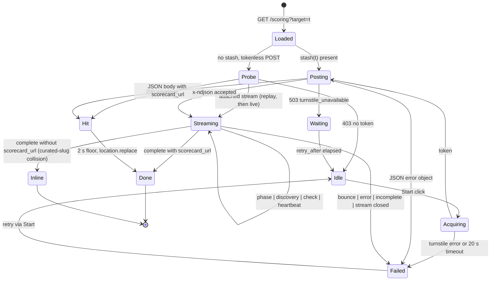
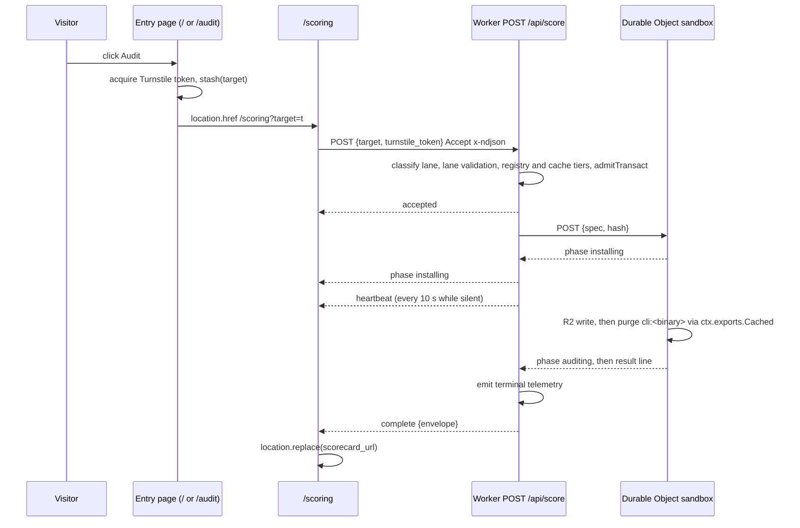

# Unified Audit Funnel - Plan

## Goal Capsule

- **Objective:** A visitor audits a CLI tool or a website from either the homepage or the audit page with one click,
  watches the audit progress live on one page, and lands on a shareable scorecard that agents can read as markdown or
  JSON at a URL whose shape does not depend on which kind of thing was audited.
- **Means:** One prepare-transact-progress-result state machine for both lanes: a shared entry form, one `/scoring`
  progress page fed by one streaming `POST /api/score`, and one `/score/<target>` result namespace with `/md` and
  `/json` representations and `Accept` negotiation on the bare path (KTD1, KTD3, KTD5, KTD6).
- **Authority hierarchy:** Product Contract requirements (R-IDs) win on behavior; Key Technical Decisions (KTD-IDs) win
  on mechanism within their cited R constraints; units carry only local deltas.
- **Stop conditions:** Stop and report if a session-settled decision (KD1 to KD3) proves infeasible, if the Durable
  Object cannot stream a response body through the Worker on staging, or if the Cloudflare Turnstile invisible widget
  cannot be acquired on the entry-page click for either lane.
- **Execution profile:** Four phases, dependency-ordered; each unit lands as its own PR to `dev`. Phases A to C may each
  ship to `main` as their own release, because the old routes stay live until U13; U11 to U13 ship to `main` together,
  because a partial Phase D is the only state in which a surface mints a retired URL.
- **Tail ownership:** Implementer owns build, unit, e2e, and staging browser verification per unit; Brett owns the
  production release cut and the sibling-repo doc fixes listed under Deferred to Follow-Up Work.

---

## Product Contract

### Summary

Collapse the two independently built audit funnels (CLI live scoring and website audit) into one state machine with two
lane-specific skins. Both the homepage and `/audit` render the same form; the submit click acquires the Turnstile token,
stashes it, and navigates to `/scoring?target=<t>`. The progress page streams events from a single `POST /api/score`
endpoint that picks the lane from the target's shape, renders lane-specific progress, and forwards to `/score/<target>`
on completion. Every result URL serves HTML, a markdown twin, and a JSON body built from one shared envelope that the
MCP read tools also return. The lane-prefixed URLs (`/web/...`, `/web-audit`, `/score/live/...`, `/scorecards` vs
`/web`, `/api/audit-web`) are retired without redirects.

### Problem Frame

The web audit reached the site after the CLI funnel and grew its own page graph: the homepage Website form is a plain
GET that lands on `/web-audit` where the visitor must submit again, then a separate `/web/scoring/<host>` page runs the
audit. The CLI funnel never left the homepage: it holds a synchronous `POST /api/score` open for up to a minute behind a
status line that cycles invented phases, and the `/audit` page's form bounces back to the homepage for a second submit.
Two Turnstile implementations, two stash conventions, two result namespaces, two boards, two APIs, and no JSON
representation of any scorecard. Brett's own notes frame the target as one prepare-transact-progress-result machine;
this plan is that machine.

### Key Decisions

- KD1. **No backward compatibility: retired URLs return the site 404, with no redirect bridges.** (session-settled:
  user-directed — chosen over a deprecation window with 301s: the site is live but early, no bookmarked URLs must
  survive, and every minted link is regenerated by the same deploy.) Extension canonicalization (`/x.html` to `/x`) is
  site-wide behavior, not a bridge, and stays. Governs R20, R21.
- KD2. **One URL scheme, not bifurcated by lane; the target string self-describes the lane.** (session-settled:
  user-directed — chosen over lane-prefixed roots such as `/score` plus `/web`: a lane prefix repeats information the
  target already carries.) Brett's caveat was "unless it would be completely confusing to users"; the classification in
  KTD1 shows it is not: a domain looks like a domain, a tool looks like a tool, and the only lane control a user sees is
  the segment toggle on forms and boards, which the homepage already has. Governs R12 to R16.
- KD3. **Changing the Rust `anc` CLI and a one-time badge URL update are in scope if the scheme needs them.**
  (session-settled: user-directed — chosen over treating the CLI's baked `https://anc.dev/score/<slug>` and the README
  badge snippet as fixed constraints.) Under KD2 as designed neither is exercised: `/score/<slug>` and `/scorecards`
  keep their paths, so the CLI, the badge snippet, and the skill bundle stay valid. Recorded so the constraint is not
  re-litigated. Governs R12, R15.
- KD4. **Only a human click acquires a Turnstile token; navigation never transacts.** Extends the existing WebMCP rule
  (tools may prepare, must not transact) to the progress page: a progress page with no stashed token shows a Start
  button instead of acquiring on load. Governs R5, R7, R19.
- KD5. **The JSON representation is the same envelope the MCP read tools return.** A fourth ad-hoc shape would widen the
  existing drift between `/api/audit-web`, `get_website_audit`, and the result page. Governs R16, R17, R18.

### Requirements

**Entry**

- R1. The homepage and `/audit` render one identical audit form component: a CLI | Website segment, one text input,
  per-lane example chips, the public-listing checkbox on the Website lane only, and a submit button. The hosts differ by
  design: on `/` the component sits inside the board's `.board-controls` row with no heading of its own (the board is
  the page's anchor), and on `/audit` it sits inside the raised `.audit-hero` panel, which owns the page's h2 and lede.
- R2. The form's native action is a prefill-only `GET /audit?lane=<lane>&target=<value>`; it never transacts. The audit
  page is a shared edge-cached document, so the prefill is a client-side read of the query string on load (the
  homepage's existing pattern); a no-JS visitor reaches the form without values, and WebMCP tools reach a prepared form
  and stop.
- R3. With JavaScript, the submit click validates the target for the selected lane, acquires the invisible Turnstile
  token on that click, stashes the token and the listing choice keyed by the normalized target, and navigates to
  `/scoring?target=<normalized target>`.
- R4. When the segment and the target's shape disagree (a host on the CLI lane, a tool name on the Website lane), the
  form switches the segment to the target's lane and navigates without delay, and the progress page's first status line
  names the reclassification; the target's shape is authoritative (KTD1). Entry pages carry no theater.
- R5. Turnstile loads lazily on the first interaction with the form and never on a page the visitor merely scrolls past.

**Progress**

- R6. `/scoring?target=<t>` is one Worker-rendered, `no-store` page for both lanes; `/scoring.md` and `/scoring` without
  a target are prose pointers.
- R7. With a stashed token the page starts the audit immediately; without one (direct link, refresh, shared link) it
  renders the normalized target and resolved lane beside a Start button whose click acquires a token and starts the
  audit.
- R8. The page renders live progress from the event stream: CLI phases (`resolving` from the Worker before dispatch,
  then the Durable Object's install start, install done, binary verification for an installed binary, lockdown, and
  audit start) and web
  discovery plus per-check rows, with a heartbeat keeping the connection alive during silent phases.
- R9. On a result with a scorecard URL the page forwards with `location.replace` after a 2 s floor so it never enters
  history; a branch-scoped source run has one (`/score/<owner>/<repo>@<branch>`, R12). Only a curated-slug collision
  (KTD6) has none, and then the page renders the result body inline, says the result has no URL, and keeps that body in
  session storage keyed by the normalized target so a same-tab refresh restores it instead of showing Start.
- R10. Registry hits and cache hits arrive as one JSON body; the page shows the curated-reward line for registry hits
  and forwards after the same floor.
- R11. Bounces, kill-switch denials, rate limits (with `retry_after`), verification failures, verification
  unavailability (a wait state, not a retry prompt), and stream loss render lane-appropriate status text with a retry
  path that goes through the Start button (a fresh gesture).

**URL scheme and results**

- R12. `/score/<target>` is the only result namespace: curated CLI slugs, live CLI binaries, branch-scoped CLI runs
  (`/score/<owner>/<repo>@<branch>`), and website hosts all live there, each with `/score/<target>/md` and
  `/score/<target>/json`; branch-scoped pages are unlisted, `noindex`, and expire with the live-result lifecycle.
- R13. `/scorecards` is the only leaderboard, showing the CLI board and the website board behind the same segment as the
  forms, with `?lane=cli|web` for deep links and `?view=all` for the website pane; the website pane sorts by relative
  score with the global score as the tie-break and carries no sort toggle; its markdown twin carries both tables.
- R14. `/audit` is the only audit landing page: the shared form plus the CLI and website explainer prose, toggled by the
  segment in HTML and both present in the markdown twin, each with a "From an agent" section naming its MCP tools.
- R15. Fix-skill pages move from `/web-audit/skill/<id>` to `/fix/<id>` with their markdown twins; the agent-skills
  index and every remediation pointer follow.
- R16. A curated binary alias (`/score/rg`) redirects to its slug (`/score/ripgrep`) for all three representations from
  the Worker; no meta-refresh files are emitted.
- R23. A website result page and a live CLI result page each carry a Re-audit control that behaves exactly like the
  entry form's submit (Turnstile loads on first interaction, the click acquires a token, stashes, and navigates to
  `/scoring?target=<target>`). The website control is disabled with a countdown until `freshness.refresh_after`. The CLI
  control sends `refresh: true`, which runs a fresh audit and replaces the cached result (KTD3); a branch page carries
  the same control and its meta line names the scored commit; the CLI meta line states the scored version and date and
  says that Re-audit runs a fresh audit. Curated pages carry no control.

**Agents and representations**

- R17. `/score/<target>/json` returns the shared result envelope for curated CLI, live CLI, and website results, and
  `/score/<target>/md` the markdown twin; both are pinned representations with no `Vary`. The bare `/score/<target>`
  negotiates `Accept: application/json` and `Accept: text/markdown` on the site's extensionless-URL Vary branch, so an
  agent that sends a header gets the same body the pinned URL serves. No extension is parsed under `/score/`, so a host
  under a TLD such as `.md` or `.map` is an ordinary target.
- R18. MCP `get_scorecard` and `get_website_audit` return that envelope, and every URL any MCP tool or discovery surface
  mints comes from the shared route module; `share_url` is retired in favor of `scorecard_url` across the API, MCP
  results, and docs.
- R19. WebMCP in-page tools on both entry pages can set the lane, fill the target, and hop to the prefilled audit page;
  no tool submits, and the progress page never loads the WebMCP script.

- R22. A second progress page, tab, or shared link on a target already in flight attaches to the running audit's stream
  and sees the same phases; a second submit for the same input attaches rather than starting a second run.

**Retirement and inventory**

- R20. `/web`, `/web/<domain>`, `/web/scoring*`, `/web-audit`, `/web-audit/skill/*`, `/score/live/*`, `/api/audit-web`,
  `GET /api/score`, `/api/score.md`, and the `/check` redirect are removed; each returns the site 404 with no redirect.
- R21. Sitemap, `llms.txt`, discovery surfaces, nav, content prose, MCP instructions and skill docs, release and deploy
  smoke scripts, and tests carry only the new URLs; a source-level guard warns on every funnel path literal outside the
  route module during the migration and fails the build on any from U13 on.

### Actors

- A1. **Visitor** (human, browser): prepares and transacts; the only actor who can pass Turnstile.
- A2. **Agent via MCP** (`score_cli`, `audit_website`, `get_scorecard`, `get_website_audit`): reads envelopes and runs
  audits under IP limits; never touches Turnstile.
- A3. **WebMCP in-page tool** (co-browsing agent): prepares forms and hops pages; must not transact (KD4).
- A4. **Operator**: flips lane kill switches, runs rescores, and reads structured logs; unchanged bindings.

### Key Flows

- F1. Entry to result (both lanes)
  - **Trigger:** A1 submits the form on `/` or `/audit`.
  - **Steps:** validate per lane and normalize (R3, R4); acquire token on the click (R5); stash; navigate to
    `/scoring?target=`; progress page POSTs with the stashed token; stream renders (R8); terminal event forwards, or
    renders inline on a curated-slug collision (R9, R10, R11).
  - **Outcome:** `/score/<target>` in the address bar with the progress page absent from history.
  - **Covered by:** R1 to R11.
- F2. Direct or refreshed progress visit
  - **Trigger:** A1 opens `/scoring?target=` with no stash.
  - **Steps:** the page POSTs the target without a token (KTD14); a 200 hit forwards at once, a 202 means a run is in
    flight and it repeats the tokenless POST every 3 s until a 200, and a 403 renders the Start button (R7) whose click
    acquires and POSTs.
  - **Outcome:** no run starts without a gesture; a refresh, a second tab, or a shared link during a run sees the
    in-progress state instead of double spending.
  - **Covered by:** R7, R9, R11.
- F3. Agent read
  - **Trigger:** A2 calls a read tool or fetches `/score/<target>/json`.
  - **Steps:** both paths build the envelope from the same R2 or curated JSON through the same builder (KTD5).
  - **Outcome:** byte-equal `scorecard` and freshness fields across JSON, MCP, and the twin's headline.
  - **Covered by:** R17, R18.
- F4. Prepare-only paths
  - **Trigger:** no-JS submit, or A3 calls `open_audit`.
  - **Steps:** native GET to `/audit?lane=&target=`; with JavaScript the page prefills from the query string on load,
    without it the form renders empty beside the noscript pointer (R2, R19).
  - **Outcome:** nothing transacts; a human click is still required.
  - **Covered by:** R2, R19.
Journey storyboard for F1 (the 5-second visceral read, the 5-minute behavioral loop, and the reflective return):

| Step | Visitor does | Visitor feels | Plan specifies |
| --- | --- | --- | --- |
| 1 | Lands on `/` or `/audit` | Oriented: one form, one segment, one button | R1, R2; U8 hosts |
| 2 | Types a target and clicks Audit | Understood: the input was read correctly | R3, R4 reclassification note; the 128-character rejection message |
| 3 | Arrives on `/scoring` | Told what is happening and what normal looks like | R6, R8; state table Idle and Streaming with the expectation sentence and the elapsed counter |
| 4 | Waits through phases | Reassured by real progress, not a spinner | R8 heartbeat, phase list, check table |
| 5 | Sees the result page | Rewarded: one number, one meter, grouped rows | U6 `.bigscore` head; the curated-reward line on registry hits |
| 6 | Reads failing rows | Knows the next action | inline remediation, `/fix/<id>` pages |
| 7 | Fixes and returns | Can prove the fix without retyping | R23 Re-audit control: countdown on website pages, one click re-runs on CLI and branch pages |
| 8 | Shares the URL or an agent reads it | Trusts that the twin and JSON match the page | R17, R18; `/md` and `/json` links in the meta line |
| Failure | Hits a bounce or a wait state | Told why and what to do next, never blamed | R11; bounce panel with `cta`; wait-state countdown; Run again |


### Acceptance Examples

- AE1. **Covers R4.** Given the Website lane is selected and the input is `ripgrep`, when the visitor clicks Audit, then
  the segment flips to CLI, the page navigates to `/scoring?target=ripgrep`, and the progress page's first status line
  says the target was audited as a CLI tool because it looks like a tool name.
- AE2. **Covers R3, R7.** Given the visitor submitted `anc.dev` from `/`, when `/scoring?target=anc.dev` loads, then the
  POST fires without a second challenge; given the same URL is opened in a new tab, then a Start button renders and no
  request is sent until it is clicked.
- AE3. **Covers R9, R12.** Given the input is `https://github.com/o/r/tree/feature`, when the run completes, then the
  progress page forwards to `/score/o/r@feature`, which serves HTML, `/md`, and `/json` with `X-Robots-Tag: noindex`.
- AE9. **Covers R9.** Given a live run resolves a binary that equals a curated slug without being that tool's binary,
  when the run completes, then the progress page renders the result body inline, says the result has no URL, and does
  not navigate.
- AE10. **Covers R23.** Given `/score/anc.dev` was audited more than a minute ago, when the visitor clicks Re-audit,
  then a token is acquired on that click and the browser lands on `/scoring?target=anc.dev`, which streams a fresh run;
  given it was audited ten seconds ago, then the control is disabled and counts down. Given `/score/ouch` has a cached
  result, when the visitor clicks Re-audit, then a fresh run streams and the page forwards to
  `/score/ouch?v=<scored_at>`, whose address bar reads `/score/ouch` once the page loads.
- AE4. **Covers R12, R16.** Given `rg` is the binary of curated `ripgrep`, when a client requests `/score/rg/json`, then
  it receives a 301 to `/score/ripgrep/json`.
- AE5. **Covers R17, R18.** Given `anc.dev` has a cached website audit, when an agent fetches `/score/anc.dev/json` and
  calls `get_website_audit`, then both `scorecard` objects and `freshness` fields are deep-equal.
- AE6. **Covers R11.** Given the Website kill switch is off and the CLI lane is on, when a visitor audits `anc.dev`,
  then the progress page reports the website audit is disabled, and a CLI audit in the same session proceeds.
- AE7. **Covers R20.** Given the new build is deployed, when a client requests `/web/anc.dev`, `/web-audit`, or
  `/score/live/ouch` after the post-cut zone purge, then each returns the site 404 with no `Location` header.
- AE8. **Covers R11.** Given Turnstile siteverify is unreachable, when the progress page POSTs, then it receives a 503
  with `turnstile_unavailable` and `retry_after`, shows a wait state, and does not tell the visitor their verification
  failed.

### Success Criteria

- A website audit from the homepage takes one submit, not two, on staging in both light and dark themes.
- The CLI progress page shows at least three distinct real phases on a cache-miss run against staging (not timer-driven
  prose).
- Every URL minted by MCP tools, the agent-skills index, `llms.txt`, and the sitemap resolves with 200 on staging after
  deploy.

### Scope Boundaries

- **In scope:** everything in R1 to R21, the `headers.ts` cache-class changes those routes require, and the deploy and
  release smoke scripts that assert funnel URLs.
- **Outside this product's identity:** a tokenless or CORS-enabled browser API; auto-submitting deep links; any agent
  path that triggers the Turnstile-gated POST.

#### Deferred to Follow-Up Work

- MCP `notifications/progress` on the SSE lane for `score_cli` and `audit_website`.
- WebMCP read tools on CLI result pages; a web `anc://` resource template.
- Renaming `/scorecard-schema` and `/web-scorecard-schema` (documentation pages, not funnel URLs).

- Sibling repos: the spec repo's stale `anc.dev/scorecards/<tool>` links should read `anc.dev/score/<tool>`; the skill
  bundle and the `anc` CLI need no change under this scheme.
- Coalescing the two lane kill-switch mechanisms (KV flip vs deploy-time var) into one.
- Moving the MCP transact tools onto `admitTransact` through a mode that skips siteverify, so one gate stack serves
  every surface.
- The `MAX_INSTANCES` constant in `src/worker/score/orchestrate.ts` disagrees with the production container count in
  `wrangler.jsonc`; pre-existing, untouched here.
- A WAF rate rule on `/score/*/json` as an operator lever if polling volume ever matters.
- A release gate for CLI Re-audit (skip the sandbox when the registry's latest version is unchanged, comparing a
  `latest_version` stored on the record at score time with discovery's current answer) and a commit gate for branch
  snapshots (skip when the branch head equals the record's `source_sha`, behind the token, memoized); both were designed
  in review and set aside in favor of the force re-run, whose exposure equals today's miss path.
- Design, considered and deferred: a screen-reader-readable running countdown value (the wait state announces its start
  and end only); a fuller rethink of the instrument component layer through `/design-consultation` (U11 rewrites
  DESIGN.md §4.15 to present state instead). Considered and rejected: a determinate progress bar and an animated
  active-row glyph (theater the phase rows and the counter replace), the entry form embedded on `/score/<target>` 404
  pages (a prefilled `/audit` link instead), and the board's `?sort=global` toggle (order follows the headline meter).

### Open Questions

- Deferred, non-blocking: should on-demand (non-seeded) website results with `public_listing: true` also enter the
  sitemap? Default: no; only registry-seeded domains and curated CLI slugs are listed (KTD10).
- Deferred, non-blocking: should the leaderboard's `?view=all` enumerate on-demand rows in the markdown twin as it does
  today on `/web.md`? Default: keep parity with today (honored on both representations).

---

## Planning Contract

### Key Technical Decisions

- KTD1. **One shared route module owns paths, target classification, normalization, and reserved names.** A
  `src/shared/audit-routes.ts` module (bare-string and pure-function exports so the Worker, the client, and the Bun
  build can all import it, the pattern `src/shared/site-url.ts` sets) exports the path builders (`scoringPath`,
  `scorePath`, `scoreJsonPath`, `scoreMarkdownPath`, `fixPath`, `leaderboardPath`, `auditPath`), `classifyTarget`,
  `normalizeTarget`, the representation-segment splitter, and the reserved-name list. Classification is URL-aware, in
  this order: a GitHub URL or `owner/repo` is CLI, and a `/tree/<branch>` URL or the `owner/repo@branch` form is CLI
  branch-scoped, normalized to `owner/repo@branch` (a branch name never contains `@`, so the split is unambiguous); any
  other URL is a website, normalized to its host; an IP literal (IPv4, IPv6, bracketed IPv6, hex or octal forms) or the
  literal `localhost` is a website; a bare host with at least one dot matching the domain regex is a website; anything
  else (slug, install command) is CLI. The dot requirement is load-bearing: `DOMAIN_SLUG_RE` in `route.ts` accepts
  single labels, and `SHARE_URL_BINARY_RE` admits no dot, so the dot is the discriminator. Normalization lowercases and
  punycodes hosts via the URL parser, keeps the port, drops path and query; the server fixes the `https` scheme for
  website lookups. The server always re-runs normalization and classification; the client's copy is convenience, not a
  boundary. A target longer than 128 characters is rejected at the form and at the endpoint before any parsing or
  normalization (a branch-scoped GitHub URL or an install command over that length is rejected with the shared message;
  accepted); the bound is a constant in this module, and every surface treats the target as hostile input (HTML-escaped
  on render, pathname-only in logs). Representations under `/score/*` are trailing path segments (`/md`, `/json`), never
  extensions, so no extension is parsed there and a host under a TLD such as `.md` or `.map` is an ordinary target; the
  reserved trailing segments are `md`, `json`, and `html`, and a branch whose last segment is one of them is rejected at
  the form and again on the server (hostile-input rule). `.html` canonicalization stays site-wide because no TLD is
  `.html`. A source-level test fails when a funnel path literal appears outside this module (R21). Rationale: the
  research found URL minting in at least fourteen places across build, Worker, client, and MCP; a rename is safe only
  when there is one owner.
- KTD2. **The Turnstile token crosses pages in the single-use sessionStorage stash; the progress page never acquires on
  load.** The transact click (the entry form's submit and the website result page's Re-audit control, R23) acquires
  (invisible Turnstile clears reliably only with a real gesture), `stash(target, {token, listing})` writes with a 240 s
  TTL under Turnstile's 300 s token life, and `take(target)` is single-use. A stash miss renders a Start button (KD4).
  The shared `src/client/turnstile.ts` absorbs the homepage's private copy and gains its widget-reuse-across-retries,
  the module-level in-flight guard, and the lazy-load-on-first-interaction helper. Chosen over a server-minted
  single-use run ticket (more server state, no stronger guarantee: siteverify already makes a token single-use) and over
  accepting the session cookie as proof (it only rekeys rate limits and would let one solve buy an hour of tokenless
  POSTs). Cross-tab exposure is bounded: sessionStorage is per tab and per origin, an opener-copied stash fails
  siteverify on second use and lands on Start, and only a script injection could read it, which the page CSP already
  scopes. Supersedes the on-load acquire recorded in `docs/plans/2026-07-09-004-feat-web-audit-flow-gates-plan.md`
  KTD-6. Answers Brett's "retrieve the Turnstile token?" question: the page never retrieves anything from the server; it
  spends what the click stashed.
- KTD3. **One `POST /api/score` endpoint, lane by target shape, one admission helper.** Body `{ target, turnstile_token,
  site_type?, public_listing?, refresh? }` with `Content-Type: application/json` required (a form-encoded or
  `text/plain` body is rejected, so CSRF defence does not rest on Turnstile alone); `?fromCache=false` survives as the
  operator hatch. `refresh: true` (R23) is a Turnstile-gated force re-run with the semantics of `?fromCache=false`: on
  the CLI lane it passes `admitTransact` like any transact, skips both cache tiers, dispatches, and the Durable Object
  overwrites the record and purges `cli:<target>`; it is ignored on a registry hit and on the website lane (the
  one-minute staleness window governs there), and an in-flight target attaches instead of starting a second run (KTD14).
  Branch-scoped targets are snapshots: the cache tier never serves a branch record, so every tokened branch-target POST
  dispatches and a tokenless one answers the 403 that renders Start; the record is what `/score/<owner>/<repo>@<branch>`
  renders, with the commit the sandbox cloned (`source_sha`). One click therefore costs a token, the limiters' budget,
  and one sandbox run, the same exposure as today's miss path; a release gate and a commit gate that would skip the run
  when nothing changed are deferred (Deferred to Follow-Up Work). Chosen over two endpoints behind one admission helper:
  two endpoints put the lane-to-URL map in the progress page, a second place the classifier's answer is spent, whereas
  one endpoint keeps lane a server decision so the operator hatch, the smoke script, and the error vocabulary stay
  single. The cost is that the `tests/score-handler*` fixtures, `scripts/smoke-api-score.sh`, and the `score.tier`
  telemetry row change shape in one PR (U4). Order per lane: parse and classify; lane validation, where the website lane
  runs `validatePublicUrl` on the server-normalized `https://<host>/` before any cache read (a cache read for a private
  host is a no-op, and nothing can have been written for one); the unmetered registry and cache tiers; then
  `admitTransact`. `admitTransact` takes the lane and the cached record and runs: lane kill switch; siteverify under a
  bounded deadline with an explicit verdict map: `rejected` and `missing_token` are 403 `turnstile_failed`; timeout,
  transport failure, a non-2xx or malformed provider response, and a missing secret are 503 `turnstile_unavailable` with
  `retry_after`; session mint or read; the session limiter keyed on the normalized target; the IP limiter; one KV hourly
  window per lane, keyed `audit:<lane>:<ip>:<hour_bucket>` through the web lane's bucket helper generalized with a lane
  argument (30 per hour per lane; the MCP website tool keeps drawing from the web lane's bucket, so a CLI burst never
  locks out website audits). Fail-closed rules: deny when `cf-connecting-ip` is absent, collapse IPv6 to a /48, treat a
  missing limiter or KV binding as `service_misconfigured`. Kill-switch polarity is recorded, not unified: the CLI KV
  key absent means enabled while the web var absent means disabled; only a missing binding fails closed on both. The web
  core keeps its stale-serve-when-disabled behavior, the listing patch path, and the per-domain flip budget; the CLI
  core keeps the GitHub accessibility probe. During Phase B the endpoint accepts both `input` and `target` body keys,
  and its non-streaming JSON responses carry the legacy `share_url` and the nested registry-hit `scorecard.kind` and
  `scorecard.scorecard_url` beside the envelope, because the deployed homepage still posts `input` and reads those
  fields until U8 lands; U13 removes all of them. MCP tools keep composing the lane cores directly with their own
  kill-switch and limiter checks, so three gate stacks exist (the endpoint's `admitTransact` and each MCP transact
  tool's block); a cross-surface parity test pins their order, and moving the MCP tools onto `admitTransact` through a
  no-siteverify mode is deferred. `GET /api/score` and `/api/score.md` retire; `/score/<target>/json` is the read
  surface.
- KTD4. **The CLI lane streams from the Durable Object, line-framed, with its own deadline, purge scope, and
  telemetry.** the endpoint emits a `resolving` phase line before the dispatch, and `do.ts` `fetch` returns an NDJSON
  body: `phase` lines at install start, install done, binary verification (an installed binary only; a source clone has
  no binary to verify), lockdown, and audit start, then one final result line; the R2 write still precedes the result
  line. `runFreshOnly` reads that body through one line reader, forwards phases to an optional `onPhase` callback, and
  returns the one-shot result so MCP `score_cli` is untouched; a body that is exactly one JSON object is treated as the
  result line, which covers a new reader against an old Durable Object during propagation; the reverse pairing (an old
  isolate reading the new NDJSON body) fails each run it dispatches until propagation settles and is the
  `error_incomplete_response_contract` signal the first-hour watch expects to fall to zero. The endpoint relays line by
  line (never a raw pipe, so a `heartbeat` written every 10 s while waiting cannot split a line), gives the relay its
  own deadline above the 60 s sandbox bound with the AbortController held through the body read, runs inside
  `ctx.waitUntil` under its own purge scope (the request-scoped purge store flushes when the response is returned,
  before the result line arrives), emits the terminal `score.tier` and analytics rows from the consumer rather than the
  request's `finally`, and treats a stream that closes without a result line as `incomplete_response_contract`. The
  platform cancels post-disconnect work 30 s after the client goes away, so a disconnect with more than 30 s of sandbox
  time remaining loses only the relay's terminal telemetry; the Durable Object's R2 write and its purge are unaffected.
  The `enable_request_signal` compatibility flag is enabled so the relay listens on the incoming request's abort signal:
  on abort it stops heartbeats, records `client_gone` with the elapsed time as the `audit.request` terminal outcome at
  that moment, never `incomplete_response_contract`, and drains the run behind the gone client so the flags clear and
  the terminal telemetry carries the real tier whenever the platform lets the task finish. A run that ends without a
  result line is an `error` event; a rejection the run reported stays a `bounce`. The Durable Object queues the
  `cli:<binary>` purge itself, immediately after its R2 write, through the `Cached` entrypoint's purge RPC on
  `ctx.exports` (the handle the Sandbox SDK already resolves there), so the purge shares the writer's lifetime and
  covers MCP `score_cli` runs; the RPC is bounded by a five-second race, and a failed or stalled purge is logged on the
  purge scope, never thrown. The relay owns telemetry only. Platform basis: a Durable Object stays active while its
  response stream is open, and a Worker pipes a subrequest body through without buffering (Cloudflare Workers Streams
  and Context docs). The non-sticky `getRandom` pool means the stream is the only channel; no second request can find
  the running instance.
- KTD5. **One result envelope, one event union, one error object, all in `src/shared/`.** Envelope: `{ kind, tier,
  target, scorecard_url, markdown_url, json_url, freshness: { cached, scored_at, refresh_after }, spec_version,
  scorecard, ...lane metadata }` (branch results add `source_sha`, the commit the sandbox cloned) where `kind` is the
  lane and `tier` is `registry`, `cache`, or `live`, set by whichever tier produced the result; the curated-reward line,
  the smoke and postflight assertions, and the freshness semantics read `tier`, and a registry hit found after discovery
  arrives on the stream as `complete` with `tier: 'registry'` and the curated `scorecard_url`; `markdown_url`,
  `json_url`, and `scorecard_url` are null only for the curated-slug collision (KTD6), which then carries
  `summary_html`: the shared result body of U6 without the crumb, the twin links, and the badge call-to-action, escaped
  by the same renderer. `refresh_after` is `scored_at` plus the web staleness window for a website record, `scored_at`
  plus the seven-day `scores/` lifecycle for a live CLI record, and null for a curated result; the website page's
  Re-audit countdown and the CLI page's re-score date (R23) read it. The curated-slug shadow rule (KTD6) lives in the
  envelope builder, so no consumer, including `get_scorecard`'s cached tier, can mint a URL that serves a different
  tool's page. The envelope carries no sandbox paths, stderr, or session data. Events: `accepted`, `phase`, `discovery`,
  `check`, `heartbeat`, `complete` (envelope), `incomplete`, `bounce`, `error`. Error object `{ error: { code, message,
  details?, retry_after?, pm?, cta } }` on every JSON error response and inside `bounce` and `error` events;
  pre-dispatch failures (validation, gates, resolution bounces, rate limits) are JSON with today's statuses, anything
  after `accepted` is an event. Consumers: `/json`, the `complete` event, MCP read and transact tool results, the HTML
  and markdown renderers.
- KTD6. **Result route order and collision policy.** `/score/<target>{,/md,/json}`: split a trailing representation
  segment first (`md` or `json`; anything else is HTML); classify the remainder. Branch-scoped CLI
  (`owner/repo@branch`): R2 lookup under `scores/<owner>/<repo>@<branch>/<SPEC_VERSION>.json`, else 404; the key is
  `keyFor(targetOfSpec(spec), SPEC_VERSION)`, the same `scores/<target>/<SPEC_VERSION>.json` shape as a live binary (one
  builder; `targetOfSpec` in the route module returns the binary for package-manager and direct specs and
  `owner/repo@branch` for git-clone, and the route target, the R2 key, the `cli:<target>` cache tag, and the KTD14
  result pointer all derive from it), the `@` that no binary name can contain keeps the two families apart, and the
  `scores/` prefix puts branch results under the existing 7-day lifecycle rule, so no new rule is provisioned. Website:
  R2 lookup under the `https` key, else 404; records keyed under `http` become unreachable and expire under the bucket
  lifecycle. CLI: consult the isolate-cached registry index first (one lookup, no build-order dependency): a curated
  slug fetches the static asset and only status 200 counts as a hit (the assets binding's 404-page handling returns a
  body); a curated binary alias returns a 301 to the slug for all three representations; anything else is an R2 live
  lookup, else 404. The route itself canonicalizes `.html` and trailing-slash forms so host-shaped paths never reach the
  assets binding's rewriting. After discovery, a resolved binary that equals a curated tool's binary is a registry hit
  (redirect to the curated page with the reward); a resolved binary that equals a curated slug without being that tool's
  binary gets a null `scorecard_url` and the inline render (R9), the one result without a URL. Chosen over asset-first
  dispatch, which costs an extra fetch on every live result and makes correctness depend on no alias page surviving in
  `dist/`.
- KTD7. **Cache classes follow the sibling, and `/json` never sits in the day-long path-keyed class for live results.**
  A path predicate cannot tell a curated slug from a live binary, so the result route passes an explicit cache class and
  tag into `applyHeaders` for the tier it served: curated CLI pages HIT-1d with no tag (their build-emitted JSON stays
  in the short class), live CLI results HIT-min with `cli:<binary>` (a branch-scoped page with
  `cli:<owner>/<repo>@<branch>`), website results HIT-min with `web:<host>`, all three representations alike. The path
  predicates cover every other route: `/scoring*` joins the always-MISS predicate; `/scorecards*` is HIT-min like the
  homepage; `/audit` with a query string demotes to the short class so prefill hops never mint day-long edge keys, while
  bare `/audit` stays HIT-1d. Purge producers are three: the Durable Object after its R2 write (KTD4), the web stream,
  and the rescore workflow, each inside a purge scope that outlives the response. The live CLI page moves onto
  `applyHeaders` (it builds its own headers today and puts `s-maxage` on a negotiated `Cache-Control`, the pattern the
  edge-cache learning forbids). A purge RPC that fails after the R2 write can leave the edge copy stale for at most the
  300 s HIT-min TTL; that bound is accepted. A 202 in-progress `/json` body (KTD14) is `no-store`.
- KTD8. **JSON is a pinned, credential-free representation advertised by `Link`, and the bare path negotiates it.**
  `/score/<target>/json` and `/score/<target>/md` satisfy `isRepresentationPinned` (no twin rewrite, no `Vary`), which
  learns the two trailing segments under `/score/` beside the site-wide `.md` suffix; `applyHeaders` emits a second
  `Link: rel="alternate"; type="application/json"` beside the markdown one on HTML and twin responses of result pages.
  The content-negotiation branch in `index.ts`, which serves the markdown twin when `Accept` prefers `text/markdown`,
  also serves the JSON body when `Accept` prefers `application/json` on a bare `/score/*` path, under the same `Vary:
  Accept, User-Agent` and cache class the negotiated twin gets. Because JSON responses carry
  `Access-Control-Allow-Origin: *`, the route never reads or sets the session cookie, emits no `Set-Cookie`, and its 404
  body carries only `code`, `message`, `audit_url`, and `suggestions` (KTD6). Opted-out hosts (`public_listing: false`)
  are unlisted, not private, as they are today.
- KTD9. **One leaderboard page, the homepage's injection pattern.** `/scorecards` ships the static CLI board and a
  `{{WEB_BOARD_ROWS}}` region (one shared placeholder constant, pinned by a build test as the homepage pair is) that the
  Worker fills from the leaderboard aggregate (full board, `?view=all` from live R2), so the page is HIT-min with tag
  purge like the homepage; the twin carries both tables. Cost: the CLI board drops from a static HIT-1d asset to HIT-min
  (one Worker inject and one aggregate read per PoP miss, across every `?lane=` and `?view=` key; `?sort=` is retired,
  so it is not a key), and a seeded-domain purge now evicts the CLI board too. Chosen over keeping `/scorecards` static
  and hydrating the web pane client-side from a HIT-min JSON, because the twin must carry both tables and `?lane=web`
  must render without JavaScript (R13). `?lane=` selects the initial pane; only a gesture writes the visitor surface
  preference. The dual-nav flip machinery in `surface.ts` and `shell.mjs` collapses to single Leaderboard and Audit
  anchors.
- KTD10. **Listing and indexing follow provenance, not lane.** Curated CLI slugs and registry-seeded website domains
  (from the build-time seed list) appear in the sitemap and `llms.txt`, and the Worker drops `X-Robots-Tag: noindex` for
  seeded hosts by seed membership; on-demand results are unlisted and `noindex`. A seeded page exists only once R2 holds
  a record under the current spec version, so the sitemap is trusted only after the post-deploy rescore completes; the
  postflight sitemap walk runs after that instance. Branch-scoped CLI results are on-demand by definition: unlisted,
  `noindex`, absent from the board, and reaped by the `scores/` lifecycle rule.
- KTD11. **One theater rule: a 2 s floor on hits, both lanes.** The floor keeps the curated-reward line readable and
  stops a cache hit from snapping the visitor through two navigations; the web lane's immediate forward changes to
  match.
- KTD12. **Fix-skill pages live at `/fix/<check-id>`.** Lane-agnostic, short, and free of the retired `/web-audit`
  prefix; the agent-skills index entries keep their `web-audit-fix-<id>` names but point at the new URLs.
- KTD14. **In-flight state lives in KV, not in the tab, keyed by input and by result.** At `accepted` the endpoint
  writes `inflight:<lane>:<input>` (the normalized input) to `SCORE_KV` with `started_at` and a TTL equal to the relay
  deadline, and as soon as the result key is known (the host for the website lane and the `owner/repo@branch` target for
  a branch-scoped run at `accepted`; the binary for the CLI lane once resolution completes) it writes the twin
  `inflight:<lane>:<result>`; both are deleted at the terminal line. The transact endpoint answers the read tier without
  a token: a registry or cache hit returns the envelope, an input whose flag exists returns 202 `{ in_progress: true,
  started_at }`, and anything else returns the 403 that renders Start; a tokenless POST for an in-flight input returns
  the job's attached stream (KTD15), and a tokened POST for an in-flight input attaches instead of starting a second
  run. `/score/<target>/json` checks the result-keyed flag before any R2 read and answers 202 with `Cache-Control:
  no-store` while it exists; MCP `get_scorecard` and `get_website_audit` pass `in_progress` and `started_at` through on
  a miss. On a stash miss the progress page POSTs without a token: a 200 hit forwards at once, an attached stream
  renders the replayed and live phases exactly as the initiator's does, and a 403 renders Start; `/json` keeps answering
  202 for non-stream readers. KV propagation lag of about a second means a second tab inside that window can still start
  a duplicate run, and the operator hatch `?fromCache=false` bypasses the flag; both accepted. Chosen over a per-tab
  sessionStorage marker (invisible to second tabs, shared links, and agents) and over a full job record with
  single-flight attach (deferred).
- KTD15. **A job Durable Object fans out a running audit to late arrivals.** `AuditJob`, a new Durable Object class
  (binding `AUDIT_JOB`, an appended `new_sqlite_classes` migration tag in both environments), is keyed by
  `idFromName('<lane>:<input>')` and created by the endpoint at `accepted`; the KTD14 KV entries store the job name, and
  the result-keyed twin lets `/json` and MCP readers find the job by host or binary. The initiating relay appends every
  stream line to the job through an RPC as it consumes the sandbox or engine stream; the job keeps a bounded event log
  in SQLite (sequence, line), a status, the terminal envelope, and a self-cleaning alarm at the relay deadline plus a
  grace. Attach returns an NDJSON stream that replays the log from a sequence and then tails live appends through an
  in-memory subscriber set; a tokenless POST for an in-flight input, a tokened POST for the same input, and MCP
  `score_cli` or `audit_website` on an in-flight target all attach, so one run serves every reader and the
  duplicate-spend window closes. The migration is append-only and lands in its own PR ahead of the code that uses it
  (repo release rule), and a later `dev` push whose migration list is a subset of the applied tags fails the Cloudflare
  API, which a dry run does not catch. Chosen over KV-only flags with 202 polling because late arrivals should see live
  phases, not a wait state.
- KTD13. **Phased landing: foundations and server before pages, pages before retirement.** The `handler.ts` test surface
  is the largest in the repo; shared modules and the streaming endpoint land behind the existing pages first, then the
  pages switch, then the old routes and their tests are removed in one sweep. Any script that asserts a contract lands
  in the PR that changes that contract, so the `dev` deploy never goes red between phases.

### High-Level Technical Design

Progress page state machine (R6 to R11):



Progress page states and what each renders (U9 owns the markup; every state keeps the `.scorecard-page` column, the
heading, the subline, one `role=status` line, one body region, and one action row):

| State     | Heading          | Status line (`role=status`)                                                                    | Body region                                                          | Action row                                       |
| --------- | ---------------- | ---------------------------------------------------------------------------------------------- | -------------------------------------------------------------------- | ------------------------------------------------ |
| Probe     | `Auditing t…`    | "Checking for a recent result…"                                                                | empty                                                                | none                                             |
| Idle      | `Audit t`        | lane, normalized target, and the expectation sentence: "CLI audit of `t`. Installs the tool in a sandbox; usually under a minute." or "Website audit of `t`. Usually a few seconds."                                                | empty                                                                | Start; "Audit something else"                    |
| Acquiring | `Audit t`        | "Verifying…"                                                                                   | empty                                                                | Start disabled                                   |
| Posting   | `Auditing t…`    | "Queued…"                                                                                      | empty                                                                | none                                             |
| Waiting   | `Audit t`        | "Verification is briefly unavailable. Retrying in NN s" (tabular numerals), then "Ready to retry" | empty                                                              | Start disabled until the countdown ends          |
| Streaming | `Auditing t…`    | current phase name (CLI) or "N of M checks" (web); the subline keeps the expectation sentence                                              | phase list or check table; the active row carries an elapsed `NN s` counter | none                                      |
| Hit       | `t audited`      | registry: the curated-reward line; cache: "Cached result from <scored_at>. Opening the scorecard." | empty | none; forwards after the 2 s floor |
| Done      | `t audited`      | "Opening the scorecard."                                                                       | completed rows, counter stopped                                      | none; `location.replace`                         |
| Inline    | `t audited`      | "Done." with the subline "This name belongs to a curated tool; this result has no URL."        | the shared result body (KTD5 `summary_html`)                         | "Run again"; "Audit something else"              |
| Failed    | `Audit t`        | lane-appropriate error text (R11)                                                              | bounce panel replaces the body region                                | "Run again"; "Audit something else"              |

"Run again" is the Start button relabeled: both acquire a fresh token on click (R11). An attached stream (KTD15) is
Streaming with the replayed rows already present. The elapsed counter starts at `accepted`, advances each second, and
stops at the terminal line.

Responsive contract at 390, 768, and 1440 px (breakpoints stay at the stylesheet's 560 and 900 px; the browser-verify
row screenshots these three widths):

| Surface | 390 px (at or under 560) | 768 px (561 to 900) | 1440 px (over 900) |
| --- | --- | --- | --- |
| Entry form on `/` and `/audit` | segment above the input; input and Audit button full width, stacked; listing checkbox on its own line | segment, input, and button on one line; checkbox below | as 768 inside `.board-controls` or `.audit-hero` |
| Progress page | one column; a row puts id and title on the first line and pill and counter under the title; the action row stacks full-width buttons; the h1 wraps | rows on one line (id, title, pill, counter); action row inline | as 768 in the 64rem `.scorecard-page` column |
| Result spine | h1 and lane chip wrap; the meta line breaks into two lines with the Re-audit control full width on its own line | meta line on one line with the control at its end | as 768 |
| Board row (`.lrow`) | rank and name on the first line, meter with numeral below | rank, name, meter on one line | as 768 with a wider meter |

Touch targets: Audit, Start, Run again, Re-audit, the segment pills, and the example chips are at least 44 px tall at or
under 560 px.

Transact sequence for a CLI cache miss (KTD3, KTD4):



Route table after the change (KD2, KTD6):

| Path                    | Lane resolution   | Served by                                   | Representations                   | Cache class             |
| ----------------------- | ----------------- | ------------------------------------------- | --------------------------------- | ----------------------- |
| `/`                     | segment           | static + Worker inject (boards, sitekey)    | HTML, `.md`                       | HIT-min                 |
| `/audit` | segment | static widget slot + Worker sitekey inject | HTML, `.md` | HIT-1d; short with a query |
| `/scoring?target=`      | target shape      | Worker, no WebMCP script                    | HTML; `/scoring.md` pointer       | MISS                    |
| `/score/<slug>` curated | CLI               | static asset (registry index confirms slug) | HTML, `/md`, `/json` (build emit) | HIT-1d; `/json` short   |
| `/score/<binary>` live  | CLI               | Worker from R2                              | HTML, `/md`, `/json`              | HIT-min, `cli:<binary>` |
| `/score/<owner>/<repo>@<branch>` | CLI, branch-scoped | Worker from R2 (branch key), `noindex` | HTML, `/md`, `/json` | HIT-min, `cli:<target>` |
| `/score/<host>`         | website           | Worker from R2                              | HTML, `/md`, `/json`              | HIT-min, `web:<host>`   |
| `/score/<alias>`        | CLI               | Worker 301 to slug                          | all three                         | short                   |
| `/scorecards`           | segment, `?lane=` | static + Worker inject (web board)          | HTML, `.md`                       | HIT-min                 |
| `/fix/<check-id>`       | n/a               | static                                      | HTML, `.md`                       | HIT-1d                  |
| `/score/<target>/json` while in flight | any | Worker from KV | 202 in-progress body | MISS (`no-store`) |
| `POST /api/score` | target shape | Worker | NDJSON or JSON | MISS |

Target classification examples (KTD1):

| Input                                                                   | Lane                                                                 | Normalized target      |
| ----------------------------------------------------------------------- | -------------------------------------------------------------------- | ---------------------- |
| `ripgrep`                                                               | CLI                                                                  | `ripgrep`              |
| `cargo binstall ouch`                                                   | CLI                                                                  | `cargo binstall ouch`  |
| `pip install some.pkg`                                                  | CLI                                                                  | `pip install some.pkg` |
| `cli/cli`, `https://github.com/cli/cli`                                 | CLI                                                                  | as entered, trimmed    |
| `https://github.com/o/r/tree/feature/x`, `o/r@feature/x`, `github.com/cli/cli/tree/main` | CLI, branch-scoped | `o/r@feature/x`, `cli/cli@main` |
| `o/r@release/json`, `o/r@md` | rejected at the form and on the server (a branch's last segment is a reserved representation segment) | n/a |
| `https://example.com/docs`                                              | website                                                              | `example.com`          |
| `Example.COM:8443`                                                      | website                                                              | `example.com:8443`     |
| `bücher.de`                                                             | website                                                              | `xn--bcher-kva.de`     |
| `socket.io`                                                             | website                                                              | `socket.io`            |
| `10.0.0.1`, `localhost`, `[::1]`, `0x7f000001`, `foo.internal` | website by shape (IP-literal and localhost check, or the dot rule); the server SSRF gate rejects before any cache read | n/a |
| `defuddle.md`, `example.map` | website (a TLD-shaped host is an ordinary target) | `defuddle.md`, `example.map` |

### System-Wide Impact

- `src/worker/index.ts` dispatch: `/score/<target>` becomes the first route that both intercepts above the asset call
  and proxies to the assets binding internally; the "asset-first by exclusion" comment is rewritten; `/scoring`,
  `/fix/*`, and the `/scorecards` inject join the pre-asset block while the `/check`, `/web*`, and `/score/live*`
  redirects leave it.
- `src/worker/headers.ts`: `isAlwaysMissPath`, `hitMinCacheTag`, and the `/json` short branch of `classifyCacheClass`
  are re-keyed from the route module's predicates, and `isRepresentationPinned` learns the `/md` and `/json` trailing
  segments under `/score/` beside the site-wide `.md` suffix; every `tests/worker.test.ts` fixture host under `/web/`
  moves; the private header set in `src/worker/score/summary-render.ts` is deleted in favor of `applyHeaders`.
- Edge cache: HIT-min keys now include `/score/<binary>*`, `/score/<host>*`, and `/scorecards*` with their query
  variants; purge is queued from three producers (the Durable Object after its R2 write, the web stream, the rescore
  workflow), and the Worker-rendered `/audit` must never read `?target=` when rendering, or one visitor's prefill
  freezes into the HIT-1d edge copy.
- R2 lifecycle: CLI live results keep the key `scores/<binary>/<SPEC_VERSION>.json` and gain a `cli:<binary>` tag and
  purge for the first time; branch-scoped runs, which write nothing today, gain the key
  `scores/<owner>/<repo>@<branch>/<SPEC_VERSION>.json` under the same 7-day rule; a spec bump still orphans prior keys
  (404 at `/score/<target>` until re-scored); web keys stay `audits/web/<sha256>/<SPEC_VERSION>.json`; stored payloads
  are byte-identical before and after, because the envelope is a read-time wrapper.
- `src/worker/score/do.ts` response contract changes from one JSON body to NDJSON; both consumers (`runFreshOnly` for
  the endpoint and MCP `score_cli`) read through one line reader, the DO mock in `tests/score-do.test.ts` returns a
  streaming body, and the success and error predicates apply to the final line only.
- Telemetry: `score.tier` and the analytics row move from the request's `finally` into the relay consumer;
  `web-audit.run` stays; a new `audit.request` scope with `lane`, `tier`, `outcome`, `heartbeats`, `phases`, `terminal`,
  and `client_gone` is registered in `src/worker/telemetry/log.ts`; the `page.request` scope logs pathname only, so
  `?target=` never reaches Worker logs.
- MCP: `get_scorecard` on a curated hit reads the full scorecard from the build-emitted `dist/score/<slug>.json` through
  the assets binding, so build and Worker ship as one deploy; the baked `scorecard_url` in `registry-index.json` and the
  MCP catalog stays `/score/<slug>`; `share_url` disappears from `audit_website`, `list_website_audits`, and
  `score_cli`.
- WebMCP prepare boundary: `open_audit` lands on `/audit?lane=&target=`, a static page whose prefill is client-side
  only; the progress page ships without the WebMCP script; the source guard bans submit calls and `/scoring` navigation
  across all WebMCP modules.
- `wrangler.jsonc` gains the `enable_request_signal` compatibility flag in both environments, pinned by the config test,
  so the relay can observe a client disconnect (KTD4).
- Session and limiters: `__Host-anc-session` is shared across lanes; the session and IP limiters stay lane-selected
  inside `admitTransact`, so a visitor holds two independent budgets, and each lane has its own KV hourly ceiling keyed
  by lane.
- Build emits: the sitemap extra paths, `09-llms-emit.mjs`, `11a-discovery-emit.mjs` prose, and
  `15-web-audit-skills.mjs` re-point through the route module; the twin-content guard that fails the build when the
  homepage twin mentions `/api/score` or Turnstile extends to the `/audit` twin.
- Release and deploy scripts: `scripts/smoke-api-score.sh` (every `dev` push) changes body key in U4;
  `scripts/release/postflight.sh`'s registry-hit assertion changes in U4 with the body it asserts;
  `scripts/release/preflight.sh` (`share_url`, `/score/live`, the `/check` 301 gate) and the rest of `postflight.sh`
  (funnel live path, sitemap walk, retired paths) change in U13 before the production cut.

### Risks and Dependencies

- **Risk:** The SSRF gate drifts behind the cache tier or the client classifier during the lift, letting a private host
  reach a probe. **Mitigation:** KTD3 fixes `validatePublicUrl` on the server-normalized origin as the first
  website-lane step; U4 tests post `10.0.0.1`, `localhost`, `[::1]`, and `0x7f000001` and assert a 400 with no R2 read
  and no outbound fetch.
- **Risk:** A single-label domain regex lanes every bare slug to the web engine. **Mitigation:** KTD1 requires a dot
  after the slug and install-command checks; the classification table is the fixture (U1).
- **Risk:** Limiter keys fail open (a shared `unknown` bucket for header-less requests, optional bindings skipped when
  absent, the CLI session key hashing raw input, no CLI hourly ceiling), so one IP can run unbounded fresh audits.
  **Mitigation:** KTD3 admission rules; `tests/wrangler-config.test.ts` asserts every limiter and KV binding exists per
  environment (U4).
- **Risk:** A Turnstile outage is reported as visitor rejection and drives retry storms. **Mitigation:** bounded
  siteverify deadline and the 403 versus 503 split in KTD3; the progress page's wait state (U9). External dependency:
  `challenges.cloudflare.com`.
- **Risk:** The `AuditJob` migration is append-only: merging its PR after a code PR, or reordering tags between
  environments, fails the deploy with Cloudflare API error 10074 and a dry run does not catch it. **Mitigation:** the
  migration lands in its own PR first, both environments carry the same tag list, and the `dev` deploy is watched after
  every merge (U14).
- **Risk:** Refresh or Start re-spends a run inside the KV propagation window. **Mitigation:** accepted bound of 30
  fresh runs per IP per minute and 30 per hour per lane, each capped by the 60 s sandbox or the web probe deadline; the
  KV in-flight flag (KTD14) stops second tabs, shared links, and MCP readers from duplicating a run; single-flight
  attach stays deferred.
- **Risk:** `/json` under CORS `*` leaks session data or sandbox detail. **Mitigation:** KTD8 credential-free route
  contract; U6 asserts the envelope contains no stderr, sandbox path, or cookie-derived field.
- **Risk:** Polling turns the tokenless read tier into a cheap drain. **Mitigation:** the read tier checks the KV flag
  before any R2 read, so a 202 costs one KV read; polling stops at the flag's TTL (U9); a WAF rate rule stays available
  as the operator lever.
- **Risk:** Kill-switch polarity differs by lane; an operator flips one and assumes both. **Mitigation:** KTD3 records
  the polarity; AE6 covers the split; the runbook names both flips (U11).
- **Risk:** Phase B's `{target}` body breaks the still-deployed `{input}` homepage on `dev`, and the every-push smoke
  script goes red for two phases. **Mitigation:** U4 accepts both keys, keeps the legacy response fields beside the
  envelope, and rewrites the smoke script in the same PR; a Phase B staging gate submits a live CLI target from the
  deployed homepage; U13 removes the shim.
- **Risk:** Mixed-version window after the U5 deploy: a previous-version isolate reads NDJSON from an updated Durable
  Object, or the reverse. **Mitigation:** KTD4's one-JSON-object rule on the reader; the window is bounded to
  propagation and surfaces as `score.tier` `error_incomplete_response_contract`, watched during the staging deploy and
  the production cut.
- **Risk:** The assets binding's 404-page handling returns a body the curated branch treats as a hit, or its
  trailing-slash rewriting mangles a host-shaped path. **Mitigation:** KTD6 counts only status 200 as curated and
  canonicalizes `.html` and trailing-slash forms in the route; U6 tests a host with no asset.
- **Risk:** The Durable Object's purge RPC fails (entrypoint unavailable mid-deploy, RPC error) and the HIT-min page
  serves the prior scorecard for 300 s. **Mitigation:** the DO logs the failure on the purge scope and never throws;
  U7's purge proof on staging; the first-hour filter on that scope expects zero errors.
- **Risk:** Zone cache survives both the production cut and a Worker rollback: old pages and old navigation links stay
  at warm edge locations for up to a day after the cut, and HIT-1d pages rendered under the new nav keep linking to
  `/fix/*` and `/score/<host>` that a rolled-back Worker 404s. **Mitigation:** U13 adds a zone purge-everything step to
  both the production-cut and rollback sections of `RELEASES.md`, rehearsed once on staging.
- **Risk:** The sitemap lists seeded `/score/<domain>` pages that 404 until the post-deploy rescore fills R2 under the
  current spec version. **Mitigation:** KTD10's ordering (deploy, rescore, then sitemap trusted) and the postflight
  sitemap walk (U11, U13).
- **Risk:** Terminal telemetry lifted naively records `tier: unset` for every streamed run and blanks the analytics
  runbook's tier and error-code queries. **Mitigation:** KTD4 moves emission into the consumer;
  `tests/score-telemetry.test.ts` slot pins stay green (U5).
- **Risk:** Production is the only target no script can transact against (real Turnstile pair), and the production smoke
  is non-blocking burn-in. **Mitigation:** U13 rewrites the postflight live HTTP path for the funnel (submit on `/`,
  watch `/scoring`, land on `/score/<target>`, both lanes) and lists job-level run verification as a step.
- **Risk:** The `anc` CLI's baked `/score/<slug>` badge URLs or the skill bundle's `/badge`, `/scorecards`, and
  `/contribute` links break on the production cut. **Mitigation:** the postflight asserts each baked shape resolves 200;
  cross-repo grep before the release cut (KD3).

### Assumptions

Un-validated agent bets carried from the scoping draft; each is a default an implementer may need Brett to overturn.

- `/score/<target>` is the single result namespace and `/scorecards` the single board name, chosen because both keep the
  CLI's baked URLs and the sibling repos' links valid; Brett's "not bifurcated" directive is satisfied by the shared
  namespace, not by these particular words.
- The progress page is a top-level `/scoring` rather than a segment under `/score/`, so no reserved names are needed
  under the result namespace.
- `share_url` is retired in favor of `scorecard_url` on `/api/score` responses and MCP transact results; the MCP tool
  names stay.
- `GET /api/score` and `/api/score.md` are retired because `/score/<target>/json` covers the read use; the release
  scripts that used them are rewritten in U13.
- The 2 s theater floor applies to both lanes (KTD11).
- The `.md` and `.map` TLD ambiguity is resolved by selecting representations with trailing path segments under
  `/score/*` instead of extensions, so those hosts are ordinary targets and no lookup-dependent parsing exists (KTD1,
  KTD6).
- Curated CLI pages keep HIT-1d and their `/json` sits in the path-keyed short class because both are build emits that
  change only on deploy.
- The homepage keeps its current layout; only the form component and the board links change.
- The CLI lane keeps `?fromCache=false` as a query parameter on the POST.
- Lane kill switches keep their current mechanisms (KV flip for CLI, var for web) behind the admission helper.
- Duplicate spend is closed by the job Durable Object's single-flight attach (KTD15); the KV propagation window remains
  only for readers that race the pointer write.

### Implementation Constraints

- Interactive widgets never live in `content/*.md`; forms are build-template widget slots so twins carry prose
  (`tests/content-no-form-widgets.test.ts`, pre-commit guard).
- Worker structured logs go through `src/worker/telemetry/log.ts`; new scopes are added there.
- No TypeScript `any` anywhere; remove pre-existing `any` in touched files.
- `scripts/release/*.sh` are 4-space indented and are edited via shell, not the editor hook.
- Every visual change is browser-verified on staging in both themes before its unit is reported done (AGENTS.md
  "Browser-verify before declaring done").
- A new test counts only after it has been observed failing against the unfixed code.
- Design vocabulary is reused, never reinvented (DESIGN.md §4.15, `src/styles/site.css`): `.scorecard-page` (64rem
  column), `.live-score-summary__meta`, `.bigscore`, `.meter` with `renderMeter()` and `.meter--unscored`,
  `.pscore__row` with `.stpill--pass`, `--warn`, `--fail`, `--na`, the `.tier` outline chip, `.btn--primary` and
  `.btn--ghost`, `.seg` with `.scope`, `.board` with `.lrow` and `.name-sub`, `.audit-hero`, `.board-controls`,
  `.crumb`, the `.live-score__status--bounce`, `--error`, and `--curated` panels, the `principle-enter` keyframes,
  `--ff-tabular`, the global `prefers-reduced-motion` block, the site-wide `:focus-visible` rule, the 44 px target rule,
  the 560 and 900 px breakpoints, and the `role="status"` `aria-live="polite"` status paragraph. New CSS is limited to
  the `.stpill` "running" state, the inert styling for `aria-disabled` transact controls, the meter fill keyframes, and
  the responsive rules for the four contract surfaces; `.catcard` and `.scorecard-hero` are deleted with their markup.
- Each of U4 to U12 leaves the literal guard's warning count lower than it found it.
- A unit that changes a file's contract rewrites that file's header narrative to present state in the same PR, and
  `src/client/scoring.ts`, `src/worker/audit/api.ts`, `src/worker/score/do.ts`, `src/worker/audit/result.ts`,
  `src/worker/audit/job.ts`, and `src/shared/audit-routes.ts` carry an ASCII diagram of their state machine or dispatch
  order in that header.

### Sequencing

- Phase A (no user-visible change): U1, U2, U3.
- Phase B (server, behind existing pages): U4, U6, U5, U7, then U14 (its migration PR first).
- Phase C (pages switch over): U9, then U8, then U10.
- Phase D (surfaces and retirement): U11, U12, U13.

Phases A to C may each ship to production as their own release; Phase D ships as one release; staging runs each phase
against the gates in Documentation and Operational Notes.

### Documentation and Operational Notes

**Staging gates per phase.** Every phase: PR gate green, `dev` deploy green including its smoke steps, then:

- Phase A: `scripts/release/postflight.sh --env staging all` output unchanged; the shared modules are inert.
- Phase B: the stream-shape, R2-payload, and purge rows of the Verification Contract; a curated slug POST returns one
  JSON body; `/score/<host>/json` fetched twice shows the same `scored_at` with `cached` flipping;
  `ANC_STAGING_BASE_URL=<staging> bun run test:e2e --project=edge-hit`; a live CLI target submitted from the deployed
  staging homepage still lands on its result page.
- Phase C: `--project=web-audit --project=web-audit-webkit --project=homepage-score-live`, two consecutive greens;
  both-theme browser check of `/`, `/audit`, `/scoring`, `/score/<target>` for each kind, and `/scorecards`;
  `postflight.sh --env staging pages`.
- Phase D: `--project=staging-mcp`; the retired-path and sitemap-walk rows; `postflight.sh --env staging all`; one
  `mcp-sweep.yml` run with both legs green.

**Production cut.** After `wrangler deploy` to production and before the postflight sitemap walk, run a zone
purge-everything: static pages carry a one-day CDN lifetime with no cache tag, so nothing else evicts the previous
build's pages and navigation links, which now 404. The retired-path checks (AE7) run only after that purge.

**Durable Object migration.** The `AuditJob` migration (U14) merges in its own PR before any code that references the
binding; watch the `dev` deploy after that merge, and never let a later branch carry a migration list that is a subset
of the applied tags.

**Rollback.** `wrangler rollback` to the deployment id recorded before the release merge, then a zone purge-everything.
Safe because existing R2 keys and payloads are unchanged (branch keys are additive and invisible to the previous
version), assets travel with the Worker version, and no Durable Object migration is applied (KTD4 changes the `fetch`
body, not the class or binding). For cost or abuse the kill switches are faster and unchanged (the endpoint checks them
in `admitTransact`, the MCP tools in their own gate blocks): the CLI KV flip, the `MCP_LIVE_SCORING_ENABLED` secret, and
the `WEB_AUDIT_ENABLED` var. Rehearse once on staging: roll back to the pre-U13 version, prove `/web/<seeded domain>`
renders from the same R2 record, roll forward, `postflight.sh --env staging all` green.

**Coherence check.** Build-time surfaces (registry index, MCP catalog, seed list, sitemap, `llms.txt`, agent-skills
index, curated `/score/<slug>{,/md,/json}`, `/fix/*`) and runtime surfaces (Worker routes, MCP URL minting, `/scoring`,
live results) ship in one Worker version, so the only disagreement window is edge propagation plus zone-cached HTML from
the previous version. Proof after each deploy: `get_scorecard` for `ripgrep`, the sitemap `<loc>` for `/score/ripgrep`,
and a 200 `curl -H 'Accept: text/html'` of it agree.

**First hour after the production cut.** Workers Logs, filtered by scope:

- `audit.request` grouped by `lane`, `tier`, `outcome`: accepted count above zero per lane; `error_*` share under the
  live-scoring runbook thresholds.
- `score.tier` with `error_incomplete_response_contract`: zero once propagation settles.
- `web-audit.run` grouped by `terminal`: `complete` dominant, `unreachable` not new.
- `audit.request` with `heartbeats` above zero on at least one live CLI run; `client_gone` rare.
- `hit-min-purge` with `error`: zero.
- `page.request` with status 404 grouped by `path`: `/web/*`, `/web-audit*`, `/score/live/*` are stranded inbound links;
  expect a decaying tail.
- `mcp.request` for `get_scorecard` and `get_website_audit`: error share unchanged from the prior day.

### Sources and Research

- Brett's scoring-funnel notes (prepare, transact, progress, result; one machine, two skins) and the WebMCP
  page-collaboration design `docs/designs/webmcp-page-collaboration.md` (tools prepare, never transact; the scoring page
  must not load the WebMCP script).
- `docs/solutions/integration-issues/invisible-turnstile-no-fallback-acquire-on-submit-gesture.md`,
  `docs/solutions/design-patterns/guard-a-single-use-token-against-double-submit-before-the-first-request-resolves.md`,
  `docs/solutions/integration-issues/await-turnstile-token-before-auto-submit-post.md` (KTD2).
- `docs/solutions/architecture-patterns/cf-worker-gate-ordering-before-cost-bearing-outbounds-2026-05-20.md`,
  `docs/solutions/design-patterns/bot-challenge-siteverify-fail-closed-reject-vs-unavailable.md`,
  `docs/solutions/design-patterns/fail-closed-rate-limit-keys-only-on-platform-trusted-ip-header.md`,
  `docs/solutions/architecture-patterns/agent-discovery-surface-describes-never-exposes-abusable-capability.md`,
  `docs/solutions/architecture-patterns/capability-url-logger-leak-class.md` (KTD3, KTD8).
- `docs/solutions/architecture-patterns/format-class-workers-caching-skip-worker-hit.md`,
  `docs/solutions/design-patterns/single-capability-predicate-gates-every-advertising-and-serving-layer.md` (KTD7,
  KTD8).
- `docs/solutions/best-practices/triple-emit-content-negotiation-rename-safe-2026-04-29.md` (hard-cut rename recipe,
  extension-dispatched JSON), `docs/solutions/conventions/renaming-an-overloaded-domain-noun.md`,
  `docs/solutions/conventions/new-content-page-requires-three-registrations-2026-05-21.md` (U11, U13).
- `docs/solutions/architecture-patterns/stale-derivations-across-tier-migrations.md` (share URL equals cache key; audit
  every derivation when the run moves behind a progress page),
  `docs/solutions/architecture-patterns/getrandom-do-pool-for-cf-containers-2026-05-19.md` (non-sticky pool; no
  second-request job read),
  `docs/solutions/design-patterns/arm-an-abortcontroller-timeout-through-the-response-body-read.md` (KTD4).
- `docs/solutions/workflow-issues/vestigial-e2e-tests-after-refactor-2026-06-02.md`,
  `docs/solutions/best-practices/live-target-e2e-design-for-server-side-state.md`,
  `docs/solutions/developer-experience/run-opt-in-remote-playwright-project-past-unconditional-webserver.md`,
  `docs/solutions/integration-issues/wrangler-deploy-route-propagation-lag-curl-retry.md`,
  `docs/solutions/developer-experience/postflight-html-smoke-accept-and-pipefail.md` (U13, Verification Contract).
- `docs/solutions/design-patterns/derive-cached-record-display-metadata-at-read-time.md`,
  `docs/solutions/design-patterns/transport-a-cross-page-tri-state-field-as-boolean-or-null-omit-dont-false.md` (KTD5,
  U3).
- Cloudflare docs: Workers Streams (a Worker returns a subrequest body as a streaming `Response`), Workers Context (a
  Durable Object remains active while handling response streams).
- Cross-repo inventory: the `anc` CLI bakes `https://anc.dev/score/<slug>` into `badge.scorecard_url` and
  `embed_markdown` (`src/scorecard/mod.rs` in the CLI repo); the skill bundle references `/badge`, `/scorecards`,
  `/contribute`; the spec repo references `/scorecards` and a stale `/scorecards/<tool>`; GitHub code search finds badge
  and score links only in Brett's own repos.

---

## Implementation Units

| U-ID | Title                                         | Key files                                                                                           | Depends on     | Shipped     |
| ---- | --------------------------------------------- | --------------------------------------------------------------------------------------------------- | -------------- | ----------- |
| U1   | Shared route module and target classifier     | `src/shared/audit-routes.ts`, `tests/audit-routes.test.ts`                                          | none           | #340        |
| U2   | Shared envelope, event union, error object    | `src/shared/audit-envelope.ts`, `src/shared/audit-events.ts`                                        | U1             | #341        |
| U3   | Shared Turnstile helper and target stash      | `src/client/turnstile.ts`, `src/client/audit-stash.ts`                                              | U1             | #342        |
| U4   | Admission helper and single transact endpoint | `src/worker/audit/admit.ts`, `src/worker/audit/api.ts`, `scripts/smoke-api-score.sh`                | U1, U2         | #343        |
| U5   | CLI lane streaming from the Durable Object    | `src/worker/score/do.ts`, `sandbox-exec.ts`, `orchestrate.ts`                                       | U2, U4         | #346 (open) |
| U6   | Unified result route and JSON representations | `src/worker/audit/result.ts`, `src/build/08-scorecards-emit.mjs`                                    | U1, U2         | #345        |
| U7   | Cache classes, tags, purge, Link alternates   | `src/worker/headers.ts`                                                                             | U1, U6         |             |
| U8 | Shared entry form on `/` and `/audit` | `src/build/audit-form.mjs`, `src/client/audit-entry.ts`, `content/audit.md` | U1, U3, U9 |             |
| U9 | Unified progress page | `src/worker/audit/scoring-page.ts`, `src/client/scoring.ts` | U2, U3, U4, U5, U6 |             |
| U10  | Merged leaderboard and nav simplification     | `src/build/08-scorecards-emit.mjs`, `src/build/shell.mjs`, `src/client/surface.ts`                  | U1, U7         |             |
| U11  | Discovery, inventory, fix-skill move, docs    | `src/build/10-sitemap.mjs`, `09-llms-emit.mjs`, `11a-discovery-emit.mjs`, `15-web-audit-skills.mjs` | U1, U6         |             |
| U12  | MCP envelope adoption and WebMCP re-pointing  | `src/worker/mcp/tools/*.ts`, `src/client/webmcp-*.ts`, `content/mcp-skill.md`                       | U2, U6, U8     |             |
| U14 | Job Durable Object and single-flight attach | `src/worker/audit/job.ts`, `wrangler.jsonc`, `src/worker/audit/api.ts` | U4, U5, U6 |             |
| U13 | Retire old routes, sweep tests and scripts | `src/worker/index.ts`, `tests/**`, `scripts/**`, `RELEASES*.md` | U8 to U12, U14 |             |

### U1. Shared route module and target classifier

- **Goal:** One owner for every funnel path, the target classifier, normalization, and reserved names, importable by
  Worker, client, and build.
- **Requirements:** R4, R12, R15, R21; KTD1.
- **Dependencies:** none.
- **Files:** create `src/shared/audit-routes.ts`; create `tests/audit-routes.test.ts`; create
  `tests/no-funnel-path-literals.test.ts`; modify `knip.json` only if the module is flagged.
- **Approach:**
  1. Export path builders, `classifyTarget`, `normalizeTarget`, `targetOfSpec` (binary for package-manager and direct
     specs, `owner/repo@branch` for git-clone; the one string the route, the R2 key, the cache tag, and the in-flight
     pointer share), `suggestTargets` (Damerau-Levenshtein over a candidate list: distance at most 2 for targets of five
     or more characters, at most 1 below that, same lane only, top three by distance then length, exact matches
     excluded; candidates whose length differs from the input by more than the bound are skipped before any distance is
     computed, and the scan stops once three distance-one matches exist), the reserved-name list (`scoring`,
     `scorecards`, `audit`, `fix`, `api`), the representation-segment splitter (`/md` and `/json` trailing segments
     under `/score/`), the reserved trailing-segment rule for branch names (`md`, `json`, `html`), and the always-MISS
     and HIT-min predicates as pure functions over a pathname.
  2. Classification and normalization follow the table in High-Level Technical Design; the GitHub branch peels
     `/tree/<branch>` and the `owner/repo@branch` form into the branch-scoped target; the website branch checks IP
     literals and `localhost` first, then requires at least one dot and applies the existing domain regex; the
     server-side callers re-run both.
  3. The literal guard scans `src/` for the old and new funnel path literals outside this module and, until U13, reports
     each hit as a loud warning (file and line) while exiting green; it ignores the module itself and generated `dist/`.
     U13 flips it to a failing gate with zero tolerated hits.
- **Patterns to follow:** `src/shared/site-url.ts` (bare exports, three-tsconfig compatibility),
  `src/shared/surface-seg.mjs`.
- **Test scenarios:**
  - Each row of the classification table returns the stated lane and normalized target, including the private-host row
    classifying as website by shape.
  - `ripgrep` classifies CLI even though the bare domain regex would accept a single label.
  - `https://github.com/cli/cli` and `cli/cli` classify CLI; `https://example.com/docs` classifies website with target
    `example.com`.
  - `defuddle.md` and `example.map` classify as website with themselves as the target; `o/r@release/json` and `o/r@md`
    are rejected.
  - `https://github.com/o/r/tree/feature/x` and `o/r@feature/x` classify CLI branch-scoped with target `o/r@feature/x`;
    `o/r@release.json` is accepted (a branch named `release.json`) and `o/r@release/json` is rejected.
  - A 129-character target is rejected before normalization; a 128-character one is accepted.
  - `splitRepresentation('/score/anc.dev/json')` yields target `anc.dev` and representation `json`; `/score/ripgrep/md`
    yields `ripgrep` and `md`; `/score/defuddle.md` yields target `defuddle.md` and representation `html`;
    `/score/o/r@feature/x` yields the branch target and `html`.
  - Reserved names cannot be produced as a `/score/<target>` path by the builder.
  - `suggestTargets('ripgrpe', [...])` returns `ripgrep` first; `suggestTargets('anc.dv', [...])` returns `anc.dev`; a
    four-character target with two edits returns nothing; a host never suggests a slug; the distance function is never
    called for a candidate whose length differs by more than the bound (spy).
  - `targetOfSpec` round trip: for a binary fixture and a git-clone fixture, the route target, `keyFor`, the
    `cli:<target>` tag, and the KTD14 result pointer are one string.
  - The literal guard reports a fixture file containing `/web/scoring` as a warning in its default mode, fails on it in
    gate mode, and is silent on the module itself.
- **Verification:** `bun test` green; the guard observed reporting a deliberate literal in warning mode and failing on
  it in gate mode.

### U2. Shared envelope, event union, error object

- **Goal:** The single result envelope, NDJSON event union, and error object as types plus builders shared by every
  consumer.
- **Requirements:** R9, R11, R17, R18; KTD5.
- **Dependencies:** U1.
- **Files:** create `src/shared/audit-envelope.ts`; create `src/shared/audit-events.ts`; create
  `tests/audit-envelope.test.ts`; modify `src/worker/score/response-shape.ts` and `src/worker/audit-web/cache.ts` to
  build from the envelope.
- **Approach:**
  1. Envelope builder takes lane, target, cached record, freshness, the registry index, and the route module; fills the
     three URLs (from the branch-scoped target for a git-clone spec), or nulls them for a live binary that equals a
     curated slug without being that tool's binary.
  2. Event union and error object are type-only where possible so the client tsconfig (DOM lib, no Workers types)
     compiles.
  3. Map today's CLI error codes and web error strings onto one code union, adding `turnstile_unavailable`; keep
     `retry_after`, `details`, `pm`, and `cta`.
  4. The stored R2 objects are not rewritten; the envelope wraps them at read time.
- **Patterns to follow:** `src/worker/audit-web/display.ts` enrichment at read time (authoritative fields pass through,
  presentation fields re-derived).
- **Test scenarios:**
  - A cached web record and a cached CLI record produce envelopes whose `scorecard` is byte-identical to the stored
    object.
  - `tier` is `registry` for a registry index hit, `cache` for an R2 hit, and `live` for a fresh run; a post-discovery
    registry hit builds a `complete` event with `tier: 'registry'`.
  - A branch-scoped run yields `/score/o/r@feature`, `/md`, and `/json` URLs and no `summary_html`.
  - `refresh_after` is `scored_at` plus the web staleness window for a web record, plus seven days for a live CLI
    record, and null for a curated result.
  - A live binary equal to a curated slug (fixture registry index) yields null URLs and a `summary_html` string that
    contains the `.bigscore` head and no crumb, twin link, or badge markup.
  - No envelope field contains a sandbox path, stderr text, or session identifier for a fixture record that carries all
    three in its raw form.
  - Every existing CLI error code and web error string maps to exactly one code in the union; unknown codes throw at
    build time.
  - Client tsconfig typechecks the event and error modules with no Workers globals.
- **Verification:** `bun run typecheck` for all three tsconfigs and `bun test`.

### U3. Shared Turnstile helper and target stash

- **Goal:** One Turnstile module, one stash module, and one transact click handler used by both entry pages, the website
  result page, and the progress page.
- **Requirements:** R3, R5, R7, R23; KTD2.
- **Dependencies:** U1.
- **Files:** modify `src/client/turnstile.ts`; create `src/client/audit-stash.ts` (replaces
  `src/client/web-audit-listing.ts`); create `tests/audit-stash.test.ts`; modify `tests/webmcp.test.ts` only for import
  paths.
- **Approach:**
  1. Port the widget reuse across retries and the interaction-triggered lazy load from `src/client/live-score.ts` into
     `turnstile.ts`; keep the 20 s acquire timeout and add the module-level in-flight guard covering every trigger path.
  2. Stash one record per normalized target: `{ token, listing, entered_lane, refresh, ts }` with the 240 s TTL (the
     entered lane lets the progress page render the reclassification line when it differs from the classified lane),
     single-use `take`, and omit-not-false transport for `listing`.
  3. Keep a per-target copy of the `entered_lane` and, after a collision's inline completion, the result body, both
     keyed by the normalized target; no in-flight marker lives in the tab (KTD14).
  4. Export one `startAudit(target, lane, listing, refresh)` click handler (lazy Turnstile load on first interaction,
     acquire on the click, stash, navigate to `/scoring?target=`, with `&refresh=1` appended for a refresh click so
     retries and reloads keep the intent) that the entry form (U8) and the website result page's Re-audit control (U6)
     both bind, so one gesture path exists.
- **Patterns to follow:** existing `stashTurnstileToken` and `takeTurnstileToken`; `buildAuditWebBody` omit rule.
- **Test scenarios:**
  - Two submits before the first resolves issue one acquire and one POST (negative control: neutralizing the guard
    produces two).
  - A stash older than 240 s is discarded and reported absent.
  - `take` returns the record once and null on the second call.
  - A listing of null is omitted from the serialized body; `false` is sent as `false`.
  - A stored inline summary is returned once by `take` and cleared on the next terminal event.
  - `startAudit` bound to two different controls issues one acquire per click and navigates to the same
    `/scoring?target=` for the same target.
- **Verification:** `bun test`; the lazy-load e2e assertion in `tests/e2e/homepage-score.e2e.ts` still passes once U8
  wires the new entry client.

### U4. Admission helper and single transact endpoint

- **Goal:** `POST /api/score` accepts both lanes with one gate stack and one response contract.
- **Requirements:** R10, R11; KTD3, KTD5.
- **Dependencies:** U1, U2.
- **Files:** create `src/worker/audit/admit.ts`; create `src/worker/audit/api.ts`; modify `src/worker/score/handler.ts`
  and `src/worker/audit-web/route.ts` to expose lane cores without their gate blocks; modify
  `src/worker/score/turnstile.ts` (bounded deadline, typed verdicts, the KTD3 verdict-to-status map); modify
  `src/worker/index.ts` dispatch; modify `src/worker/telemetry/log.ts` (`audit.request` scope); modify
  `scripts/smoke-api-score.sh` and the registry-hit assertion in `scripts/release/postflight.sh` (body key and hit
  shape, via shell); modify `src/worker/score/validate.ts` (`owner/repo@branch` parses to `{ kind: 'github-url', owner,
  repo, branch }` through `OWNER_RE`, `REPO_RE`, and `validBranchName`, sharing a fixture with U1's classifier); create
  `tests/audit-api.test.ts`; modify `tests/score-handler.test.ts`, `tests/score-handler-branch-and-norelease.test.ts`
  (the scenarios asserting that a branch URL bypasses R2 and gets no share URL become commit-gate scenarios),
  `tests/score-validate.test.ts`, `tests/web-audit-routes.test.ts`, `tests/wrangler-config.test.ts`,
  `tests/score-telemetry.test.ts`.
- **Approach:**
  1. Require `Content-Type: application/json`; parse body accepting both `target` and `input` for Phase B; classify with
     U1; run lane validation, where the website lane's SSRF gate runs on the server-normalized origin before any cache
     read; then the unmetered tiers (registry, cache) before `admitTransact`.
  2. `admitTransact(lane, cachedRecord)` runs the KTD3 sequence and fail-closed rules; returns the session and
     `Set-Cookie` or the shared error object; the web core keeps stale-serve-when-disabled, the listing patch, and the
     flip budget.
  3. Response mode: `Accept: application/x-ndjson` streams the event union; otherwise the terminal envelope or error
     object as JSON. Cache and registry hits are always one JSON body.
  4. Emit one `audit.request` log line per call through the emitter; the terminal fields for streamed runs are filled by
     the U5 consumer.
  5. Write the KV in-flight flag at `accepted` and delete it at the terminal line (KTD14).
  6. `refresh: true` on the CLI lane (R23, KTD3): after `admitTransact`, skip both cache tiers and dispatch exactly as
     `?fromCache=false` does; ignore the flag on a registry hit and on the website lane; an in-flight target attaches.
     Branch-scoped targets never serve from the cache tier: a tokened branch-target POST dispatches, a tokenless one
     answers 403. The `audit.request` row records `refresh: true` and the dispatch as `tier: 'live'`.
  7. Post-extraction shape (`handler.ts`): the CLI lane core owns only input validation, the unmetered registry and
     cache tiers, spec resolution, and the run; the GET path, siteverify, session, and limiter code leave it. Each lane
     core targets roughly 300 non-comment lines; anything beyond splits by responsibility.
  8. Header contracts: rewrite the narratives at the top of `src/worker/score/handler.ts` and
     `src/worker/score/orchestrate.ts` to describe only the present pipeline.
- **Execution note:** Start with a failing contract test that posts a website target and a CLI target through the same
  endpoint and asserts the shared error object on a limiter denial; the smoke script and postflight registry-hit
  assertion changes ship in this PR so the next `dev` deploy and the staging page gate stay green.
- **Patterns to follow:** `route.ts` cache-hit-before-gates ordering; `handler.ts` telemetry tier tags; the web lane's
  hourly bucket helper.
- **Test scenarios:**
  - A cache-hit target with no client identity and a limiter stubbed to throw returns 200 and spends no budget (both
    lanes).
  - `10.0.0.1`, `localhost`, `[::1]`, and `0x7f000001` as website targets return 400 with no R2 read and no outbound
    fetch.
  - A missing token returns 403 `turnstile_failed`; a siteverify transport failure or timeout returns 503
    `turnstile_unavailable` with `retry_after` (AE8).
  - A request with no `cf-connecting-ip` is denied; an IPv6 client is keyed by its /48.
  - A missing limiter or KV binding returns `service_misconfigured`; the wrangler-config test asserts the bindings exist
    per environment.
  - A website target with the web kill switch off returns the disabled error while a CLI target proceeds (AE6).
  - `Accept: application/x-ndjson` on a cache miss yields `accepted` as the first line; a plain `Accept` yields one JSON
    body; a `text/plain` body is rejected.
  - A rate-limited request returns JSON with `retry_after` and never opens a stream; exhausting the CLI lane's hourly
    window leaves the website lane's window untouched for the same IP.
  - `?fromCache=false` skips both cache tiers and still consults the registry.
  - `refresh: true` with a cached binary record skips both cache tiers, dispatches one run, and the DO overwrites the
    record; without a valid token it is 403 like any transact.
  - `refresh: true` is a no-op on a registry hit and on the website lane; on an in-flight target it attaches (one run).
  - A tokened branch-target POST with an existing snapshot still dispatches; a tokenless one answers 403 and reads no
    R2.
  - `owner/repo@feature/x` validates to `github-url` with `branch: 'feature/x'`; `o/r@..` and `o/r@` are rejected; the
    classifier fixture and the validator fixture agree.
  - Bodies with `input` and with `target` both succeed during Phase B, and a registry hit's JSON body carries the
    envelope with `tier: 'registry'` plus the legacy nested fields the deployed homepage reads.
  - A 129-character target is rejected with the shared error object before classification; 128 characters pass.
  - The input-keyed flag is written at `accepted` and the result-keyed twin once the host or binary is known, both with
    `started_at` and the relay-deadline TTL, and both are deleted at the terminal line; a run that ends by relay
    deadline leaves them to expire.
  - A tokenless POST returns the envelope on a registry or cache hit, the attached job stream while the input is in
    flight, and 403 otherwise, and spends no budget.
  - A tokened POST whose input is already in flight attaches to the job stream and starts no second run (one sandbox or
    engine invocation across both callers).
  - A limiter stubbed to throw produces the same outcome and gate order across the HTTP endpoint, `score_cli`, and
    `audit_website`.
- **Verification:** `bun test`; staging `curl` with the always-pass Turnstile token against both lanes returns the
  expected first line; the `dev` deploy smoke passes with the rewritten script.

### U5. CLI lane streaming from the Durable Object

- **Goal:** Real phase events for CLI runs without changing the MCP one-shot path.
- **Requirements:** R8; KTD4.
- **Dependencies:** U2, U4.
- **Files:** modify `src/worker/score/do.ts`, `src/worker/score/sandbox-exec.ts`, `src/worker/score/orchestrate.ts`,
  `src/worker/score/cache.ts` (branch key builder), `src/worker/audit/api.ts`, `src/worker/audit-web/hit-min-purge.ts`
  (purge RPC callable from the DO), `wrangler.jsonc` (`enable_request_signal` compatibility flag in both environments);
  modify `tests/score-do.test.ts`, `tests/score-do-cache-write.test.ts` (the git-clone skip scenario becomes the
  branch-key write with `source_sha`), `tests/score-cache.test.ts` (`keyFor` takes a target),
  `tests/worker-score-orchestrate.test.ts`, `tests/score-telemetry.test.ts`, `tests/wrangler-config.test.ts` (pins the
  flag); create `tests/score-stream.test.ts`.
- **Approach:**
  1. `runScore` accepts an `onPhase` callback and calls it at the five phase boundaries; `do.ts` writes each phase and
     the final result as NDJSON lines into a `TransformStream` and returns its readable side immediately; the R2 write
     still precedes the result line; a git-clone spec writes under `keyFor(targetOfSpec(spec), SPEC_VERSION)` instead of
     skipping the write, with `source_sha` (the sandbox script prints `git rev-parse HEAD` after the clone and the
     result line carries it) on the record; the write precondition is per family: `tool_version` for a binary record and
     `source_sha` for a branch record (`CachedScorecard` gains optional `source_sha`, `isCachedScorecard` and
     `cache.put` accept the per-family shape, and a binary record without a version or a branch record without a SHA is
     refused and logged `no_tool_version` or `no_source_sha`, since a source run may report no `tool.version`); and the
     Durable Object queues the `cli:<target>` purge through `ctx.exports.Cached` right after that write. Four
     in-function narratives that describe the old skip are rewritten to the present rule in the same PR: the `do.ts`
     cache-write block, the `orchestrate.ts` post-discovery skip, the `handler.ts` branch-skips-tiers block, and the
     `GitCloneInstall.binary` doc in `discover-binary.ts`; `rg -n 'skip the cache write|intentionally one-off'
     src/worker/score` must return nothing.
  2. `runFreshOnly` reads the DO body line by line, treats a body that is exactly one JSON object as the result line,
     forwards phases to the optional callback, and returns the final result; a stream that closes without a result line
     resolves to `incomplete_response_contract`.
  3. The endpoint relays line by line inside `ctx.waitUntil` under its own purge scope, writes a `heartbeat` every 10 s
     while no line has arrived, holds the relay deadline through the body read, emits the terminal telemetry from the
     consumer, listens on `request.signal` and on abort stops heartbeats and records `client_gone` with the elapsed time
     (the platform cancels the relay 30 s after a disconnect). The purge is not the relay's job: `do.ts` queues the
     `cli:<target>` purge (`targetOfSpec(spec)` is the only source of the tag) through `ctx.exports.Cached` right after
     its R2 write, logging a failed RPC without throwing.
  4. Header contracts: rewrite the narratives at the top of `src/worker/score/do.ts` and
     `src/worker/score/orchestrate.ts` to describe only the present stream contract.
- **Execution note:** Keep the two-phase egress ordering test (`tests/score-do.test.ts` scenario b) green throughout;
  extend it to assert phase event order.
- **Patterns to follow:** `route.ts` streaming body with `ctx.waitUntil` and its purge scope; the
  AbortController-through-body-read rule.
- **Test scenarios:**
  - A stubbed sandbox emits phases in the order install start, install done, binary verification, lockdown, audit start,
    then a result; the client stream contains `resolving` and then those five in that order followed by `complete`.
  - MCP `score_cli` through `runFreshOnly` with no callback returns the same result object as before; the purge is
    observed from the DO stub, not the caller.
  - The DO stub calls the purge RPC with `cli:<target>` after its R2 write for a binary spec and for a git-clone spec; a
    purge RPC failure is logged and the result line still follows.
  - A git-clone spec writes `scores/o/r@feature/<SPEC_VERSION>.json` with `source_sha` equal to the SHA the sandbox stub
    printed and purges `cli:o/r@feature`; a binary spec still writes `scores/<binary>/<SPEC_VERSION>.json` with no
    `source_sha` and never the branch key; a git-clone result line without a SHA is not written and one whose scorecard
    has no `tool.version` is still written (per-family precondition); a binary result without `tool.version` is still
    refused.
  - An aborted `request.signal` stops heartbeats within one tick and records `client_gone` with elapsed ms as the
    `audit.request` terminal outcome.
  - A one-object JSON body (old DO) resolves to the result without an error.
  - A DO stream that ends after `phase installing` produces an `error` event with code `incomplete_response_contract`.
  - No line for 10 s produces a `heartbeat` line; a run that finishes in 3 s produces none; a heartbeat never lands
    inside another line.
  - A relay that exceeds its deadline terminates the client stream with an `error` event.
  - A client disconnect with under 30 s of run remaining still lets the consumer finish and emit `score.tier` with the
    real tier; an earlier disconnect records `client_gone` and never `incomplete_response_contract`; the purge fires
    from the Durable Object in both cases (assert via the log capture sink).
- **Verification:** `bun test`; a staging cache-miss run of a small tool shows at least three phase lines in the raw
  NDJSON (Verification Contract stream-shape row).

### U6. Unified result route and JSON representations

- **Goal:** `/score/<target>` serves curated, live CLI, and website results in three representations from one route,
  under one result design whose lanes differ in content, not layout.
- **Requirements:** R12, R16, R17, R23; KTD5, KTD6, KTD8.
- **Dependencies:** U1, U2, U3.
- **Files:** create `src/worker/audit/result.ts` (absorbs `handleLiveScorePage` from
  `src/worker/score/summary-render.ts` and `handleWebResultPage` from `src/worker/audit-web/route.ts`); modify
  `src/build/08-scorecards-emit.mjs` (emit `dist/score/<slug>.json`, stop emitting alias pages, reaper regex includes
  `json`), `src/build/shell.mjs` (the `<head>` alternates for `/score/` pages come from the route module's builders
  instead of the `<path>.md` rule); modify `src/worker/index.ts` (dispatch; sitekey substitution on website result
  pages; the content-negotiation branch serves JSON on `Accept: application/json` under `/score/`); create
  `src/client/reaudit.ts` (binds U3's `startAudit` to the Re-audit control and runs its countdown); modify
  `src/build/01-assets.mjs`, `knip.json`; create `tests/audit-result-route.test.ts`; modify
  `tests/score-live-page.test.ts`, `tests/web-audit-routes.test.ts`, `tests/build.test.ts`,
  `tests/e2e/web-audit.e2e.ts`.
- **Approach:**
  1. Dispatch per KTD6: trailing-segment split, classify, a branch-scoped target straight to its R2 key, otherwise
     registry index first, curated asset only on status 200, alias 301, R2 live, 404; the route canonicalizes `.html`
     and trailing-slash forms itself. A `?v=` query is ignored for rendering and makes the route pass the `miss` class
     (`no-store`, no tag, no edge copy), so the progress page's forward after a fresh run
     (`scorecard_url?v=<scored_at>`) never lands on a stale edge copy; the page's client replaces the URL with the bare
     one on load, and `rel=canonical` and the twin links stay bare.
  2. `/json` responses go through `applyHeaders` with `application/json` and the class and tag of the tier that served
     them, never touch the session cookie, and set no cookie; HTML and `/md` render from the same envelope, and the bare
     path serves the JSON body or the twin when `Accept` prefers `application/json` or `text/markdown` (KTD8). Every
     `/score/<target>` page opens with one shared spine: the `Leaderboard ›` crumb, a mono h1 naming the target with a
     `.tier`-style outline lane chip (a branch-scoped page names `owner/repo@branch`), and one
     `.live-score-summary__meta` line carrying tier (curated, cached, live), freshness, and the `/md` and `/json` links.
     Every result page's `<head>`, static or Worker-rendered, carries `<link rel="alternate" type="text/markdown"
     href="/score/<target>/md">` and `<link rel="alternate" type="application/json" href="/score/<target>/json">` built
     from U1's `scoreMarkdownPath` and `scoreJsonPath`, byte-equal to the hrefs in the two `Link` headers (U7), so an
     agent that parses either the headers or the document finds both representations; the `/md` twin's front matter
     names the same two URLs and the `Accept` values the bare path honors. The freshness segment is lane-aware (R23): a
     website page ends it with a `.btn--ghost` Re-audit control bound to U3's `startAudit`, rendered `aria-disabled`
     (never `disabled`) with the tabular countdown "Re-audit in NN s" in an `aria-hidden` span until `refresh_after` (an
     absolute timestamp in a data attribute, so an edge-cached copy still counts correctly) and enabled after it; a live
     CLI page states "Scored vX on <date>. Re-audit runs a fresh audit." and carries the same control, enabled, whose
     click passes `refresh: true` to `startAudit`; a branch page states "Scored at <short source_sha> on <date>.
     Re-audit runs a fresh audit." and carries the control enabled; a curated page carries no control; the website
     control's click handler is a no-op before `refresh_after` (`aria-disabled` is the visual state; the handler owns
     the deadline); `deriveShareBinaryFromSpec` and `shareUrlForSpec` in `handler.ts` are deleted, every URL deriving
     from `targetOfSpec` and the envelope builder; the sitekey meta ships only on pages that carry the control. Below
     the spine the two lanes converge on one result design with lane-specific content: a `.bigscore` head with the
     headline numeral and meter (relative for websites, with the global score as the secondary numeral), then grouped
     rows (P1 to P8 principles for CLIs, C1 to C5 categories for websites) each rendered as `.pscore__row`-style rows
     with a `.stpill` status and inline remediation on non-pass rows; the web `.catcard` and `.scorecard-hero`
     treatments retire in favor of that shared body. Motion: the `.bigscore` meter fills from the empty track to its
     value once on first paint (600 ms on the site's ease-out curve, numeral static); the grouped rows do not animate;
     the global reduced-motion block makes the fill inert.
  3. 404 bodies per representation: HTML and `/md` carry one sentence ("No audit exists for `t` yet.") and one "Audit
     `t`" link to `/audit?lane=<lane>&target=<t>`, never the form or a sitekey; when U1's `suggestTargets` returns
     matches they follow as a "Did you mean?" list of links to `/score/<match>`; `/json` returns `{ error: { code:
     'not_found', message }, audit_url, suggestions: [{ target, scorecard_url }] }` and nothing else. Candidates come
     from the isolate-cached registry index (slugs and binaries) for a CLI-shaped target and from the seed list plus the
     leaderboard aggregate's publicly listed hosts for a host-shaped target; the host candidate list is memoized in the
     isolate for 60 s beside the registry-index cache, so a burst of 404s reads the aggregate once; a null aggregate
     (absent, unparseable, or corrupted, which `getAggregate` already maps to null) yields seed-only candidates, is
     logged once, and never changes the 404 status or body shape.
  4. The curated JSON emit (`dist/score/<slug>.json`, served at `/score/<slug>/json` through the route's asset proxy, as
     `dist/score/<slug>.md` is served at `/score/<slug>/md`) wraps the committed scorecard in the envelope at build time
     so `get_scorecard` can read it through the assets binding.
  5. The `/json` route reads the KV in-flight flag before any R2 read and answers 202 `no-store` while it exists
     (KTD14).
  6. Post-extraction shape (`route.ts`): the web lane core owns only body validation, the SSRF gate, the cache tier, and
     the engine stream; the result page, scoring page, board handler, and gate block leave it (U6, U9, U10, U4); same
     ceiling as `handler.ts`.
  7. Header contracts: rewrite the narratives at the top of `src/worker/audit-web/route.ts` and
     `src/worker/score/summary-render.ts` to describe only the present dispatch.
- **Patterns to follow:** `withNegotiatedHeaders` in `route.ts`; `enrichWebScorecardForDisplay`; `resolveCuratedSlug` in
  the registry lookup.
- **Test scenarios:**
  - `/score/ripgrep`, `/md`, `/json` serve from the asset; `/score/rg/json` 301s to `/score/ripgrep/json` (AE4).
  - A curated slug whose asset fetch returns the 404 page is not treated as a hit.
  - When the registry index cannot be loaded, a CLI-shaped target answers 503 with `Retry-After` in all three
    representations instead of falling through to a 404.
  - `/score/ouch` with an R2 record renders HTML, the twin, and JSON whose `scorecard` equals the record.
  - `/score/o/r@feature` with a branch-key record renders HTML, the twin, and JSON, all carrying `X-Robots-Tag: noindex`
    (AE3); `/score/o/r` with no record returns the 404 pointer prefilled with `o/r`.
  - `/score/anc.dev/json` equals the `get_website_audit` envelope for the same record (AE5, cross-surface `toEqual`).
  - `/score/anc.dev.html` and `/score/anc.dev/` canonicalize to `/score/anc.dev` without reaching the assets binding.
  - `llms.txt` names each curated twin at `/score/<slug>/md` through the route module's builder.
  - A never-audited CLI target and website target return the lane-appropriate 404 in all three representations, `/json`
    carrying only `code`, `message`, `audit_url`, and `suggestions`; `/score/ripgrpe` lists `ripgrep` under "Did you
    mean?" in HTML, the twin, and `suggestions`; a 404 body contains no form, no sitekey meta, and no transact script.
  - With `getAggregate` returning null, a host-shaped 404 still renders 404 with seed-only suggestions and one log line;
    two host-shaped 404s inside 60 s read the aggregate once (spy).
  - A branch page's meta line names the short `source_sha` and carries the enabled Re-audit control.
  - A `/json` request carrying a session cookie receives no `Set-Cookie` and no `Vary`.
  - While the in-flight flag exists, `/json` answers 202 with `in_progress`, `started_at`, and `Cache-Control:
    no-store`, and performs no R2 read.
  - A target containing a reserved name is not treated as a result.
  - `Accept: application/json` on `/score/ripgrep` returns the JSON envelope with `Vary: Accept, User-Agent`, `Accept:
    text/markdown` returns the twin, and `/score/ripgrep/json` returns JSON regardless of `Accept` with no `Vary`.
  - `/score/defuddle.md` is looked up as the host `defuddle.md`, never as a twin of `/score/defuddle`.
  - The `<head>` of `/score/ripgrep`, `/score/ouch`, `/score/anc.dev`, and `/score/o/r@feature` carries both alternate
    `<link>` elements, their hrefs equal the two `Link` header targets, and each `/md` twin names both URLs and the two
    `Accept` values.
  - A website result page carries the Re-audit control, the sitekey meta, and the `refresh_after` attribute; a live CLI
    page carries the control (enabled, `data-refresh`) and the scored version; a curated page carries none of them.
  - The meter fill is the page's only animation and is inert under `prefers-reduced-motion` (computed
    `animation-duration` at or below 0.01 ms).
  - At 390, 768, and 1440 px the spine matches its responsive contract row (screenshots).
  - Clicking Re-audit after `refresh_after` acquires a token, stashes, and navigates to
    `/scoring?target=<host>&refresh=1` (AE10, e2e); before it the control counts down and a click acquires nothing,
    stashes nothing, and does not navigate.
  - `/score/anc.dev?v=123` renders the same body as the bare URL with `Cache-Control: no-store` and no `Cache-Tag`;
    after load the address bar reads `/score/anc.dev`.
- **Verification:** `bun run build` then `bun test`; staging `curl -H 'Accept: text/html'`, `-H 'Accept:
  application/json'`, `/md`, and `/json` for one target of each kind.

### U7. Cache classes, tags, purge, Link alternates

- **Goal:** Edge caching that matches each result's sibling and never freezes live JSON for a day.
- **Requirements:** R6, R12, R17; KTD7, KTD8.
- **Dependencies:** U1, U6.
- **Files:** modify `src/worker/headers.ts`, `src/worker/audit-web/hit-min-tags.ts`,
  `src/worker/audit-web/hit-min-purge.ts`, `src/worker/index.ts`; modify `tests/worker.test.ts`,
  `tests/score-vary.test.ts`; modify `tests/e2e/edge-hit.e2e.ts`.
- **Approach:**
  1. `applyHeaders` accepts an explicit cache class and tag from the result route (U6) and honors them ahead of
     `classifyCacheClass`; the path classifier gains the always-MISS predicate from U1 (adds `/scoring*`) and the
     `/audit`-with-query demotion, then keeps its existing order.
  2. `hitMinCacheTag` maps `/score/<host>*` to `web:<host>`, `/score/<live binary>*` to `cli:<binary>`, `/scorecards*`
     and `/` to the board tag.
  3. `applyHeaders` emits the JSON `Link` alternate on result pages and their twins.
  4. Add a `cli:` tag to the purge helper; the Durable Object calls the purge RPC after its R2 write (U5).
- **Patterns to follow:** existing `Cached.purgeHitMinTags`; the rule that negotiated `Cache-Control` never carries
  `s-maxage`.
- **Test scenarios:**
  - `/scoring?target=x` and `/scoring.md` classify MISS.
  - With the result route's injected class, `/score/anc.dev/json` carries HIT-min with tag `web:anc.dev`,
    `/score/ripgrep/json` carries the short class with no tag, and `/score/ouch/json` carries HIT-min with `cli:ouch`.
  - `/audit?lane=web&target=x` classifies short; bare `/audit` classifies HIT-1d.
  - `/score/ouch/md` and `/score/ouch/json` carry `cli:ouch`; the HTML sibling carries the same tag and `Vary: Accept,
    User-Agent`.
  - HTML and `/md` responses for `/score/anc.dev` carry two `Link` alternates; `/json` carries none and no `Vary`.
  - A purge for `cli:ouch` is queued exactly once per completed live run, from the Durable Object, whether or not the
    client is still connected.
- **Verification:** `bun test`; staging shows `cf-cache-status: HIT` with `Age` on a second `/json` fetch and MISS on
  `/scoring` (edge-hit e2e project); the purge-proof row of the Verification Contract.

### U8. Shared entry form on `/` and `/audit`

- **Goal:** Two identical entry points whose submit click transacts for both lanes.
- **Requirements:** R1 to R5, R14; KD4, KTD2.
- **Dependencies:** U1, U3, U9 (the form navigates to the page U9 creates).
- **Files:** create `src/build/audit-form.mjs`; modify `src/build/06-homepage.mjs`, `src/build/07-subpages.mjs`,
  `src/build/shell.mjs` (sitekey meta on every transact page), `src/build/build.mjs` (twin-content guard extends to
  `/audit`), `src/worker/index.ts` (sitekey substitution for `/`, `/audit`, `/scoring`); create
  `src/client/audit-entry.ts` (replaces `src/client/live-score.ts` and `src/client/web-audit.ts`); merge
  `content/web-audit.md` into `content/audit.md`; modify `src/build/01-assets.mjs`, `knip.json`; modify
  `tests/content-no-form-widgets.test.ts`, `tests/build.test.ts`, `tests/e2e/homepage-score.e2e.ts`,
  `tests/e2e/flows.e2e.ts`.
- **Approach:**
  1. One builder renders the form HTML (segment radios inside the form as `name=lane`, input `name=target`, chips,
     listing checkbox in the Website lane, submit) and the twin prose; the homepage and the `/audit` widget slot both
     call it. Hosts: on `/` the component renders inside `.board-controls` with the listing checkbox as a second
     full-width line under the input on the Website lane; on `/audit` it renders inside `.audit-hero`, which owns the h2
     and lede. The component owns no heading.
  2. The entry client binds once per page: lazy-load on interaction, per-lane validation including the reserved
     trailing-segment rule for branch names, shape-versus-segment reconciliation that flips the segment and navigates
     without delay (AE1), then U3's `startAudit` on the click (acquire, stash, navigate) with the submit `aria-disabled`
     while acquiring, never `disabled`; no sitekey disables the form with the MCP and `anc audit` pointer.
  3. `/audit` content carries both explainer blocks under lane-toggled containers, both "From an agent" sections, and a
     `noscript` block; the Worker never reads `?target=` when serving `/audit`.
- **Execution note:** Browser-verify both pages in both themes on staging before reporting done; the lazy-load and
  no-token-in-URL e2e assertions are the regression floor.
- **Patterns to follow:** `renderSurfaceSeg`, homepage `data-s` toggling, `CLI_AUDIT_WIDGET` and `WEB_AUDIT_WIDGET` slot
  shape.
- **Test scenarios:**
  - Homepage and `/audit` HTML contain byte-identical form markup apart from ids scoped per page.
  - The `.md` twins of `/` and `/audit` contain no `<form>`, `<input>`, or `<button>`, and mention neither `/api/score`
    nor Turnstile.
  - Submitting `ripgrep` on the Website lane flips the segment and navigates to `/scoring?target=ripgrep` with no delay,
    stashing the entered lane (AE1).
  - Submitting `https://example.com/docs` on either lane navigates to `/scoring?target=example.com`; submitting
    `example.md` or a 129-character target shows the rejection message and does not navigate.
  - The chromium e2e drives the `/audit` entry for both lanes end to end.
  - The Turnstile script is not requested when the page is scrolled without interaction.
  - No-JS submit produces a GET to `/audit?lane=web&target=anc.dev`; with JavaScript the input is prefilled on load, and
    with scripts disabled the form renders empty beside the noscript pointer.
  - With no sitekey the form is disabled and the pointer text is present.
  - While acquiring, the submit is `aria-disabled` and remains `document.activeElement`.
  - At 390, 768, and 1440 px both hosts match the entry-form row of the responsive contract (screenshots).
- **Verification:** `bun run build`, `bun test`, chromium e2e project; staging browser check in both themes.

### U9. Unified progress page

- **Goal:** One `/scoring` page for both lanes with live updates, the Start gesture, and the terminal behaviors in R9 to
  R11.
- **Requirements:** R6 to R11; KTD2, KTD5, KTD11, KTD14.
- **Dependencies:** U2, U3, U4, U5, U6, U14 (the page forwards to the result routes U6 creates and consumes the attach
  stream U14 creates).
- **Files:** create `src/worker/audit/scoring-page.ts` (replaces `handleWebScoringPage`, `scoringBody`,
  `scoringMarkdown`); create `src/client/scoring.ts` (replaces `src/client/web-audit-scoring.ts`); modify
  `src/build/build.mjs` (shell template for the page), `src/build/01-assets.mjs`, `knip.json`; create
  `tests/scoring-page.test.ts`; modify `tests/e2e/web-audit.e2e.ts`, `tests/e2e/homepage-score-live.e2e.ts`.
- **Approach:**
  1. Worker renders the page from a shell template with the sitekey meta and `/js/scoring.js`, `no-store`, the
     HTML-escaped target, and never the WebMCP script; the twin is the prose pointer naming both read tools. Screen
     structure (top to bottom, one `.scorecard-page` column):

```text
.scorecard-page
  h1 (mono target + .tier-style lane chip)   state-keyed: "Audit `t`" idle | "Auditing `t`…" streaming | "`t` audited" terminal
  .live-score-summary__meta      persistent subline: reclassification note; on a hit, tier and freshness; on a collision, the no-URL sentence
  p[role=status]                 one live line: phase or check progress, elapsed time, wait-state countdown
  body region (exactly one)      phase list (CLI) | check table (web) | bounce panel | inline result body
  action row                     .btn--primary Start ("Run again" in terminal states) | "Audit something else" link to /audit
  noscript pointer               .md twin and the MCP read tool
```

The heading is the anchor and the status line is the second read; the body region holds exactly one of its four children
at a time; the action row shows only the actions valid in the current state, per the state table in High-Level Technical
Design.
  2. Client state machine per the High-Level Technical Design: stash, in-flight marker, Start gesture, POST,
     JSON-versus-stream branch, per-lane renderers (phase list for CLI, check table for web), 2 s floor on hits,
     `location.replace` on every completion that carries `scorecard_url`, the inline result body on a curated-slug
     collision, bounce panels ported from the old homepage client into the body region, the wait state on 503
     `turnstile_unavailable` (Start disabled, the status line "Verification is briefly unavailable. Retrying in NN s"
     counting down in tabular numerals, then "Ready to retry" with Start enabled), an elapsed `NN s` counter beside the
     active phase or check row that stops at the terminal line, the cache-hit line "Cached result from <scored_at>.
     Opening the scorecard." and the curated-reward line during the 2 s floor, the `refresh` flag read from the
     `refresh=1` query on load and on every Start or Run again gesture and forwarded on the POST (the stash carries a
     copy for the first request; a tokenless probe never sends it), `location.replace` to `scorecard_url` with
     `?v=<scored_at>` after a fresh run and bare after a hit, the Start state showing the normalized target, the lane,
     and the lane's expectation sentence (CLI: "Installs the tool in a sandbox; usually under a minute."; website:
     "Usually a few seconds."), which the subline keeps beside the counter while streaming, the reclassification line
     when the stash's entered lane differs from the classified lane, `document.title` mirroring the h1's three states
     with the site's suffix ("Audit t", "Auditing t…", "t audited" or "t: audit failed"), the action row ("Run again",
     which is Start relabeled and acquires a fresh token, beside "Audit something else") under every terminal state, and
     a session-storage copy of a collision's inline body restored before Start on a same-tab refresh.
  3. Progress rows, both lanes: `.pscore__row`-style rows (mono id holding the phase name or check id, title,
     `.stpill`); the active row's pill reads "running" in outline `currentColor` and its trailing slot holds the elapsed
     `NN s` counter in tabular mono; a completed row's pill flips to `--pass`, `--warn`, `--fail`, or `--na`; no
     spinner, no pulsing dot, no animated ellipsis, no step numbers, no icons. Motion: each new row enters with
     `principle-enter`; pills, counters, and the status line change text only; the global reduced-motion block makes the
     entrance inert.
  4. Live region and focus: one `role=status` `aria-live="polite"` line written once per state transition; the
     wait-state countdown and the elapsed counter update `aria-hidden` spans outside the live region, with one
     announcement at their start ("Retrying in about NN seconds") and one at their end ("Ready to retry"); a terminal
     bounce or error is written with `aria-live="assertive"` for that write only; rows are not announced individually.
     Start and Run again use `aria-disabled="true"` with the click ignored while acquiring or counting down, never the
     `disabled` attribute (inert styling is the control's own); when a bounce, an error, or the inline collision result
     renders, the h1 (`tabindex="-1"`) receives focus so the next Tab reaches the action row.
  5. Refresh handling: on a stash miss the page POSTs the target without a token; a 200 forwards at once, an attached
     stream is consumed like the initiator's own (replayed lines render immediately), a 403 renders Start; a network
     error on the POST or an acquire timeout on Start renders the status text and re-enables Start.
- **Execution note:** Write the e2e for both shapes (JSON hit forwards; NDJSON miss renders rows then forwards) with
  `Promise.race`, as the live-target learning prescribes.
- **Patterns to follow:** existing `web-audit-scoring.ts` NDJSON reader; `live-score.ts` bounce panel copy.
- **Test scenarios:**
  - Landing with a stash issues exactly one POST carrying the stashed token and no Turnstile acquire.
  - Landing without a stash issues no request; clicking Start acquires and POSTs (AE2).
  - A stash whose entered lane differs from the classified lane renders the reclassification as the first status line
    (AE1).
  - A JSON body or `complete` event with `tier: 'registry'` shows the reward line and replaces location after no less
    than 2 s.
  - `complete` with a branch-scoped `scorecard_url` forwards to `/score/o/r@feature?v=<scored_at>` (AE3); `complete`
    without `scorecard_url` renders the inline result body under the no-URL subline and does not navigate (AE9).
  - A 503 `turnstile_unavailable` renders the wait state, sends no further request until `retry_after` elapses, and
    never says verification failed (AE8); the countdown reaches zero, the line reads "Ready to retry", and Start is
    enabled only then.
  - `bounce`, `error`, `incomplete`, and a stream that closes without a terminal line each render a bounce panel in the
    body region, status text, and the action row with "Run again" and "Audit something else".
  - The elapsed counter beside the active row advances each second during streaming and stops at the terminal line; a
    cache hit shows the cached-result line carrying `scored_at` for the 2 s floor.
  - A tokenless probe answered 200 forwards at once; an attached stream renders the replayed phases and then the live
    tail and forwards on `complete`; a 403 renders Start.
  - A network error on the POST renders status text and re-enables Start.
  - An acquire timeout on the Start click renders the retry state.
  - `/scoring` with no target serves the prose pointer in HTML and `.md`.
  - A target containing markup renders escaped.
  - The Start state names the target and the lane, and its status line and the Streaming subline carry the lane's
    expectation sentence: the CLI sentence names the sandbox install, the website sentence says a few seconds.
  - After a collision's inline completion, a same-tab refresh restores the result body and issues no request.
  - The rendered HTML contains no `webmcp` script reference.
  - The active row carries the "running" pill and the counter, completed rows carry their status pill, and the rendered
    HTML contains no spinner class, animated glyph, or step number.
  - In a scripted run the status element receives exactly one text write per state transition, the countdown and counter
    spans are `aria-hidden`, and the terminal error write is assertive.
  - After Start the button carries `aria-disabled` and stays `document.activeElement`; after a bounce,
    `document.activeElement` is the h1.
  - At 390, 768, and 1440 px the page matches its responsive contract row (screenshots).
  - `document.title` changes with the h1 on Start, on `accepted`, and on each terminal state, and never per phase.
  - A reload after a wait state on `/scoring?target=t&refresh=1` re-POSTs with `refresh: true`; a plain
    `/scoring?target=t` never does.
  - After a fresh run the forward target carries `?v=<scored_at>`; after a registry or cache hit it is bare.
- **Verification:** `bun test`; `web-audit` and `homepage-score-live` e2e projects against staging, two consecutive
  green runs.

### U10. Merged leaderboard and nav simplification

- **Goal:** `/scorecards` shows both boards behind the segment, and the header has single Leaderboard and Audit anchors.
- **Requirements:** R13; KTD9.
- **Dependencies:** U1, U7.
- **Files:** modify `src/build/08-scorecards-emit.mjs`, `src/build/scorecards-render.mjs`, `src/build/shell.mjs`,
  `src/build/06-homepage.mjs` (Full board links), `src/worker/index.ts` (web pane injection for `/scorecards`),
  `src/worker/audit-web/leaderboard-render.ts`; merge `src/client/web-leaderboard.ts` into `src/client/leaderboard.ts`;
  modify `src/client/surface.ts`, `src/shared/surface-seg.mjs`; modify `tests/web-audit-leaderboard-route.test.ts`,
  `tests/surface.test.ts`, `tests/build.test.ts`, `tests/e2e/flows.e2e.ts`.
- **Approach:**
  1. The static page ships the CLI board and the shared `{{WEB_BOARD_ROWS}}` placeholder constant in both
     `dist/scorecards.html` and `.md`; both panes render one `.board` of `.lrow`s (rank, name with `.name-sub`, one
     meter): the CLI row's `.name-sub` is the binary and its meter the credit-weighted score; the website row's
     `.name-sub` is the global score and its meter the relative score (the headline per CONCEPTS), rows sorted by
     relative score with global as the tie-break and the `?sort=global` toggle removed; the CLI | Website `.seg` sits in
     the board head as on the homepage and a second small Curated | All `.seg` renders inside the Website pane beside
     its rubric line; the Worker fills it with the full aggregate (or the all view) and the twin with both tables,
     HIT-min with the board tag; a build test asserts the placeholder is present in both emits so a missed inject can
     never reach the edge.
  2. `?lane=` picks the initial pane server-side; when it is absent a synchronous inline head script reads the stored
     preference and sets the initial pane before first paint (the `theme-init.ts` pattern), so a returning visitor never
     sees the CLI board paint and then swap; only the segment gesture writes the preference.
  3. Nav renders one Leaderboard anchor and one Audit anchor; `aria-current` derives from pathname.
  4. Board rows follow the responsive contract: rank and name on the first line with the meter below at or under 560 px,
     one line above it.
- **Test scenarios (added):**
  - The Website pane's rows are ordered by relative score, ties by global; `?sort=global` renders the same order and
    emits no sort link in HTML or the twin.
- **Patterns to follow:** `injectHomepageBoards`; `src/client/theme-init.ts` for the pre-paint inline script; the
  visitor-surface-preference learning.
- **Test scenarios:**
  - `/scorecards?lane=web` renders the web pane visible without JavaScript; `/scorecards` renders the CLI pane.
  - `/scorecards.md` contains both tables; `?view=all` adds on-demand rows to both representations.
  - The built HTML and markdown both contain the placeholder constant; the served responses contain neither the
    placeholder nor the literal string.
  - Nav on every page has exactly one Leaderboard and one Audit anchor with the expected hrefs.
  - A cold visit to `/scorecards?lane=web` does not write the surface preference; toggling the segment does.
  - With a stored website preference and no `?lane=`, the first painted frame shows the website pane (assert no
    CLI-to-web swap after load).
  - The page carries the board Cache-Tag and HIT-min headers.
- **Verification:** `bun run build`, `bun test`, chromium e2e; staging browser check of both panes in both themes.

### U11. Discovery, inventory, fix-skill move, docs

- **Goal:** Every generated surface and every document names only the new URLs, and fix skills live at `/fix/<id>`.
- **Requirements:** R14, R15, R18, R21; KTD10, KTD12.
- **Dependencies:** U1, U6.
- **Files:** modify `src/build/10-sitemap.mjs`, `src/build/build.mjs` (extra paths from the seed list),
  `src/build/09-llms-emit.mjs`, `src/build/llms.mjs`, `src/build/11a-discovery-emit.mjs`,
  `src/build/15-web-audit-skills.mjs`, `src/worker/audit-web/remediation.ts`, `src/worker/audit-web/copy.ts`,
  `src/worker/audit-web/seed.ts` (seed membership for the noindex drop), `src/worker/headers.ts` (noindex by seed
  membership), `src/worker/mcp/instructions.ts`; modify `content/mcp-skill.md`, `content/badge.md`,
  `content/contribute.md`, `content/changelog.md`, `content/_spec-context.md`, `AGENTS.md`, `CONCEPTS.md`,
  `docs/runbooks/web-audit-operations.md`, `docs/runbooks/mcp-wire-protocol.md`, `README.md`, `DESIGN.md` (§4.15);
  modify `tests/web-audit-skills.test.ts`, `tests/build-discovery-emit.test.ts`,
  `tests/agent-readiness-discovery.test.ts`, `tests/e2e/discoverability.e2e.ts`.
- **Approach:**
  1. Sitemap and llms list curated slugs and seeded domains through U1's builders; on-demand results stay unlisted;
     seeded hosts lose `X-Robots-Tag: noindex`.
  2. Fix-skill emitter writes `dist/fix/<id>.{html,md}`; the agent-skills index, the skills-index markdown, remediation
     `skill_url`, and the result-page pointers use the new path.
  3. Docs describe the present state only (no migration narration); `CONCEPTS.md` gains entries for progress page,
     target, and result envelope; the web-audit operations runbook records the kill-switch polarity per lane and the
     deploy-rescore-sitemap ordering. DESIGN.md §4.15 is rewritten to present state: `/score/<target>` and `/scoring` as
     the emitters' surfaces, the shared result spine, progress rows with the "running" `.stpill` state, the lane chip as
     a `.tier`-style outline chip in mono beside the h1, the Re-audit countdown control as `.btn--ghost` with tabular
     numerals, and no mention of `.catcard`, `.scorecard-hero`, `/score/live`, or `/web/<domain>`.
- **Patterns to follow:** three-registrations convention; the rename recipe's `dist/` sweep for the old word in text
  nodes.
- **Test scenarios:**
  - The sitemap contains `/score/<slug>` for every curated tool and `/score/<domain>` for every seeded domain, and
    nothing under `/web` or `/web-audit`.
  - `llms.txt` lists `/audit.md` and `/scorecards.md` beside the per-tool `/score/<slug>/md` twins.
  - A seeded host's result page carries no `X-Robots-Tag: noindex`; an on-demand host's does.
  - The agent-skills index entries resolve to `/fix/<id>` and each page exists in `dist/`.
  - A clean `dist/` contains no text node with `/web-audit`, `/web/scoring`, or `/score/live`.
  - DESIGN.md §4.15 names `/score/<target>`, `/scoring`, the running pill state, and the lane chip, and mentions neither
    `.catcard` nor `/score/live`.
- **Verification:** `bun run build`, `bun test`, discoverability e2e against staging; the sitemap-walk row after the
  rescore instance completes.

### U12. MCP envelope adoption and WebMCP re-pointing

- **Goal:** Agents receive the shared envelope and the new URLs, and in-page tools prepare on both entry pages without
  transacting.
- **Requirements:** R17, R18, R19; KD5, KTD5.
- **Dependencies:** U2, U6, U8.
- **Files:** modify `src/worker/mcp/tools/scorecard-read.ts`, `scorecard-audit.ts`, `web-audit.ts`,
  `src/worker/mcp/resources.ts`, `src/worker/mcp/instructions.ts`; modify `src/client/webmcp-lib.ts`, `webmcp-home.ts`,
  `webmcp-audit.ts`, `webmcp-result.ts`; modify `content/mcp-skill.md`; modify `tests/worker-mcp.test.ts`,
  `tests/worker-mcp-audit.test.ts`, `tests/web-audit-mcp-tools.test.ts`, `tests/webmcp.test.ts`, `tests/e2e/mcp.e2e.ts`,
  `tests/e2e/agents.e2e.ts`.
- **Approach:**
  1. `get_scorecard` returns the envelope for curated slugs (read through the assets binding from the U6 emit) and live
     binaries; `get_website_audit` returns it for hosts; transact tools return it on completion with `scorecard_url`;
     the `anc://scorecard/{binary}` description points at `json_url`.
  2. WebMCP tools become `set_surface`, `fill_target`, `open_audit`; path predicates come from U1; descriptions state
     that a human must click; the source guard bans `requestSubmit(`, submit-control `.click(`, synthetic `submit`
     events, any call into `startAudit`, a click on the Re-audit control, and any navigation to `/scoring`.
  3. The skill doc's examples and the wire reference carry the new field and URL shapes; the "no progress notifications"
     line stays.
- **Patterns to follow:** existing cross-tool parity `describe` blocks in `tests/web-audit-mcp-tools.test.ts`.
- **Test scenarios:**
  - `get_scorecard { slug: 'ripgrep' }` returns an envelope whose `scorecard` equals the committed scorecard file.
  - `get_website_audit` and `GET /score/<host>/json` produce deep-equal envelopes (AE5).
  - `get_scorecard` and `get_website_audit` on a target with the in-flight flag set return `found: false, in_progress:
    true, started_at`.
  - `audit_website` and `score_cli` results carry `scorecard_url` and no `share_url`; `score_cli` on a branch URL
    returns `/score/o/r@feature` with the `source_sha` it scored.
  - WebMCP `open_audit` sets the form action target and calls `form.submit()` only on a form whose action is `/audit`; a
    stub asserts no fetch to `/api/score` and no navigation to `/scoring`.
  - The WebMCP source guard fails on a fixture containing `requestSubmit(`.
- **Verification:** `bun test`; `staging-mcp` e2e project; every URL in tool results resolves 200 on staging.

### U14. Job Durable Object and single-flight attach

- **Goal:** Late arrivals attach to a running audit's stream instead of waiting; one run serves every reader of a
  target.
- **Requirements:** R7, R8, R11, R22; KTD14, KTD15.
- **Dependencies:** U4, U5, U6.
- **Files:** create `src/worker/audit/job.ts` (the `AuditJob` Durable Object); modify `wrangler.jsonc` (binding and
  appended migration tag, both environments), `src/worker/index.ts` (class export), `src/worker/audit/api.ts` (create
  the job at `accepted`, append each line, attach path for tokenless and in-flight tokened POSTs),
  `src/worker/mcp/tools/scorecard-audit.ts`, `src/worker/mcp/tools/web-audit.ts` (attach on an in-flight target and
  return the terminal envelope), `src/client/scoring.ts` (consume an attached stream like the initiator's); create
  `tests/audit-job.test.ts`; modify `tests/audit-api.test.ts`, `tests/wrangler-config.test.ts`,
  `tests/web-audit-mcp-tools.test.ts`, `tests/e2e/web-audit.e2e.ts`.
- **Approach:**
  1. The migration PR lands first: binding, `new_sqlite_classes` tag appended in both environments, config test pinning
     the tag list; watch the `dev` deploy before the code PR.
  2. `AuditJob` keeps an event log (sequence, line) and a status in SQLite, the terminal envelope once known, and an
     alarm that deletes the job at the relay deadline plus a grace; `append` writes a line and pushes it to every live
     subscriber; `attach(fromSeq)` returns a stream that replays from the sequence and then tails.
  3. The endpoint creates the job at `accepted`, stores its name in both KTD14 pointers, appends every relayed line, and
     closes the job on the terminal line; the tokenless and in-flight tokened POST paths return the attached stream.
  4. MCP transact tools on an in-flight target attach and await the terminal envelope instead of dispatching a second
     run.
  5. Header contract and an ASCII diagram at the top of `job.ts` describing the append, attach, and cleanup lifecycle.
- **Execution note:** Rehearse the migration on staging before the production cut; a deploy whose migration list is a
  subset of the applied tags fails with Cloudflare API error 10074.
- **Patterns to follow:** `src/worker/score/do.ts` for the DO class shape and test-mode shim; `docs/solutions/` DO
  migration learnings; the U5 line-framed relay.
- **Test scenarios:**
  - Two attachers receive the same replayed lines in sequence order and the same live tail.
  - Attach after completion replays the log ending in `complete` and closes.
  - A second tokened POST for an in-flight input attaches and produces exactly one sandbox or engine invocation across
    both callers.
  - MCP `score_cli` on an in-flight binary attaches and returns the terminal envelope without a second run.
  - The cleanup alarm deletes the job after the deadline plus grace; an attach after that returns the 403 that renders
    Start.
  - The config test fails if the migration tag list differs between environments or is not append-only.
  - Staging e2e: two tabs on the same target show the same phases and both forward to the result.
- **Verification:** `bun test`; the migration PR's `dev` deploy green before the code PR opens; the staging two-tab e2e
  green twice.

### U13. Retire old routes, sweep tests and scripts

- **Goal:** The old funnel routes, redirects, clients, and their fixtures are gone; release and deploy smokes assert the
  new shapes; the release docs carry the rollback and live-path checks.
- **Requirements:** R20, R21; KD1.
- **Dependencies:** U8 to U12, U14.
- **Files:** modify `src/worker/index.ts` (remove `/check`, `/web.html`, `/web/`, `/score/live/*.html` handlers and all
  retired dispatch), `src/worker/audit-web/route.ts`, `src/worker/score/summary-render.ts`,
  `src/worker/score/handler.ts`, `src/worker/audit/api.ts` (drop the `input` body key); delete
  `src/client/live-score.ts`, `src/client/web-audit.ts`, `src/client/web-audit-scoring.ts`,
  `src/client/web-leaderboard.ts`, `src/client/web-audit-listing.ts`; delete
  `tests/web-audit-legacy-alias-redirects.test.ts`, `tests/worker-live-score-routing.test.ts`; modify
  `tests/worker.test.ts`, `tests/site-origin.test.ts`, `tests/score-handler-share-url.test.ts`,
  `tests/score-handler-share-url-post-discovery.test.ts`, `tests/webmcp.test.ts`, `tests/e2e/homepage-score.e2e.ts`
  (NDJSON fixtures, delete the client-timer phase test), `tests/e2e/flows.e2e.ts`, `tests/helpers/site-facts.ts`; modify
  `scripts/release/preflight.sh` (`share_url`, `/score/live`, drop the `/check` 301 gate),
  `scripts/release/postflight.sh` (funnel live path, sitemap walk, retired paths; the registry-hit assertion already
  moved in U4), `scripts/release/mcp-smoke.sh`; modify `RELEASES.md` (a standing checklist step: any release that
  retires or renames a public path runs a zone purge-everything after deploy and before postflight, plus the rollback
  purge), `RELEASES-PREFLIGHT.md`, `RELEASES-POSTFLIGHT.md` (funnel live HTTP path, job-level run verification); modify
  `.github/workflows/deploy.yml` if paths are inlined.
- **Approach:**
  1. `rg` for every old path, every removed `data-*` selector, and every `waitForURL` across `tests/` and `scripts/`
     before the sweep closes; re-point fixtures that used old paths as neutral HIT-min or MISS examples to new paths
     from U1.
  2. Release scripts assert `scorecard_url` of the form `/score/<binary>` and `tier: 'registry'`; add the sitemap walk
     and retired-path gates; the postflight retired-path gate runs only after the purge step; edit them via shell to
     preserve 4-space indentation.
  3. The literal guard flips from warning to failing with zero tolerated hits and, with `knip`, is one of the last two
     gates: no old path outside the route module, no unreachable client entry.
  4. Header contracts: rewrite the dispatch-order narrative and the asset-first comment at the top of
     `src/worker/index.ts` to describe only the present order.
  5. The archetype loop in `tests/e2e/flows.e2e.ts` names `/audit`, `/scoring?target=`, and `/scorecards` so the axe and
     overflow sweeps keep covering the funnel.
- **Patterns to follow:** the vestigial-e2e learning's four failure shapes; `tests/helpers/site-facts.ts` derivation of
  counts from build sources.
- **Test scenarios:**
  - Each retired path in R20 returns 404 with no `Location` header (AE7).
  - `/score/ripgrep.html` still canonicalizes to `/score/ripgrep`.
  - A body carrying only `input` is rejected once this unit lands, and JSON responses no longer carry `share_url` or the
    nested registry-hit fields.
  - `rg` for `/web/scoring`, `/score/live`, `/web-audit`, `/api/audit-web`, `share_url` across `src/`, `tests/`,
    `scripts/`, `content/`, and docs returns only allow-listed hits.
  - Deploy smoke against staging passes with the new registry-hit shape; the staging rollback rehearsal renders a seeded
    domain from the same R2 record before and after.
- **Verification:** `bun run lint`, `bun run build`, `bun test`, full e2e matrix against staging, deploy smoke green on
  the `dev` push, rollback rehearsal recorded.

---

## Verification Contract

| Gate                  | Command or check                                                                                                                                                                                                                                                                                                                                      | Applies to                                                           |
| --------------------- | ----------------------------------------------------------------------------------------------------------------------------------------------------------------------------------------------------------------------------------------------------------------------------------------------------------------------------------------------------- | -------------------------------------------------------------------- |
| Lint                  | `bun run lint` (biome, markdownlint, knip)                                                                                                                                                                                                                                                                                                            | every unit                                                           |
| Types                 | `bun run typecheck` (client, worker, node tsconfigs)                                                                                                                                                                                                                                                                                                  | every unit; U2 must pass the client tsconfig with no Workers globals |
| Build then unit       | `bun run build` then `bun test` (never the reverse; `tests/regression.test.ts` reads `dist/`)                                                                                                                                                                                                                                                         | every unit                                                           |
| Wrangler shape        | `bun run deploy:dryrun`                                                                                                                                                                                                                                                                                                                               | U4 to U7, U9, U13                                                    |
| Browser e2e, local    | `bun run test:e2e` default chromium project against `wrangler dev --env staging --local --port 8787`                                                                                                                                                                                                                                                  | U8, U9, U10, U13                                                     |
| Browser e2e, staging  | `ANC_STAGING_BASE_URL=<staging> bun run test:e2e --project=web-audit`, `--project=web-audit-webkit`, `--project=homepage-score-live`, `--project=staging-mcp`, `--project=edge-hit`; two consecutive green runs count as green                                                                                                                        | U4 to U13                                                            |
| Green is not evidence | Every new test is run against the unfixed code first and its failure output quoted in the PR                                                                                                                                                                                                                                                          | every unit                                                           |
| Browser-verify        | Both themes on staging for `/`, `/audit`, `/scoring`, `/score/<target>` (each kind), `/scorecards`, at 390, 768, and 1440 px against the responsive contract; screenshots in `.context/screenshots/`                                                                                                                                                                                                            | U8, U9, U10                                                          |
| Representation checks | `curl -H 'Accept: text/html'`, `-H 'Accept: application/json'`, `/md`, and `/json` for one curated slug, one live binary, one branch-scoped run, one host; assert a marker unique to each representation and that the two `Link` headers and the two `<head>` alternates name the same URLs                                                                                                                                                                                                      | U6, U7                                                               |
| Stream shape, staging | `curl -sS -N --retry 5 --retry-delay 10 --retry-all-errors -H 'Accept: application/x-ndjson' -H 'Content-Type: application/json' -d '{"target":"<cache-miss CLI target>","turnstile_token":"x"}' "$STAGING/api/score"` with the Access headers: first line `accepted`, at least three `phase`, last `complete` with `scorecard_url` `/score/<binary>` | U5                                                                   |
| R2 payload invariant  | `wrangler r2 object get <bucket>/<key> --pipe --remote` piped through `jaq '{schema: .scorecard.schema_version, spec: .spec_version}'` equal before and after the deploy, one key per lane                                                                                                                                                            | U2, U6                                                               |
| Edge proof            | `cf-cache-status` and `Age` on staging, never wrangler dev                                                                                                                                                                                                                                                                                            | U7                                                                   |
| Purge proof           | `/score/<binary>` shows `cf-cache-status: HIT` with `Age`; POST with `?fromCache=false` for it; the refetch is `MISS` or carries a newer `scored_at`                                                                                                                                                                                                  | U7                                                                   |
| Retired paths         | for each R20 path: `curl -sSI -o /dev/null -w '%{http_code} %{redirect_url}\n'` prints `404` with an empty redirect; run after the propagation settle probe, without `--retry-all-errors`                                                                                                                                                             | U13                                                                  |
| Sitemap walk          | every `<loc>` in `$ENV_URL/sitemap.xml` fetched with `Accept: text/html` and `--retry-all-errors` returns 200, after the rescore instance completes                                                                                                                                                                                                   | U11, release                                                         |
| Deploy smoke | `dev` push deploy green including `scripts/smoke-api-score.sh` and the MCP smoke; job-level check `gh run view <run-id> --json jobs --jq '.jobs[] \| {name, conclusion}'` all `success` | U4, U13 |
| Branch snapshot, staging | resubmit a branch URL whose record exists; a fresh run streams and `/score/<owner>/<repo>@<branch>/json` reports a newer `scored_at` and the cloned `source_sha` | U4, U5 |
| Rollback rehearsal    | `wrangler rollback --env staging` to the pre-U13 version, old routes render from unchanged R2, roll forward, `postflight.sh --env staging all` green                                                                                                                                                                                                  | release                                                              |
| Release preflight     | `scripts/release/preflight.sh all` before the production cut                                                                                                                                                                                                                                                                                          | release                                                              |

---

## Definition of Done

- All R1 to R23 hold on staging with the e2e matrix green twice in a row.
- Every URL minted by MCP tools, the agent-skills index, `llms.txt`, the sitemap, and the `Link` alternates resolves 200
  on staging.
- The literal guard passes in gate mode: no funnel path outside `src/shared/audit-routes.ts`.
- `knip` reports no unreachable client entry; the deleted clients and tests are gone, not disabled.
- Abandoned experiments are removed from the diff (no dead branches, no commented-out old routes).
- Docs describe the present state only: `AGENTS.md`, `CONCEPTS.md`, `content/mcp-skill.md`, the runbooks, and the
  release docs name the new URLs, field names, kill-switch polarity, and rollback step.
- Per unit: its test scenarios exist and were observed failing first, its verification row is green, and any visual
  change has both-theme screenshots.
- Brett has reviewed the PR bodies before any merge to `dev`; Phase D ships to `main` only as one release, after the
  staging rollback rehearsal is recorded.

---

## Appendix

### Old-path sweep inventory

Paths and identifiers that must not survive outside the route module or allow-listed docs history: `/web`, `/web.md`,
`/web/<domain>`, `/web/scoring`, `/web-audit`, `/web-audit/skill/`, `/score/live/`, `/api/audit-web`, `GET
/api/score?input=`, `/api/score.md`, `/check`, `share_url`, the `input` body key, `data-web-audit-form`,
`data-web-home-form`, `data-live-score-form`, `data-web-audit-scoring`, `web-audit-turnstile:` and `web-audit-listing:`
stash prefixes, `open_web_audit`, `fill_cli_target`, `fill_web_target`.

Known fixture hosts: `tests/worker.test.ts` (HIT-min and MISS examples), `tests/webmcp.test.ts` (tool sets keyed by
path), `tests/build.test.ts` and `tests/surface.test.ts` (nav hrefs), `tests/site-origin.test.ts` (origin rewrite
examples), `tests/e2e/flows.e2e.ts` (archetype page loop), `tests/e2e/homepage-score.e2e.ts` (JSON mocks of `/api/score`
and the timer-driven phase test), `scripts/release/preflight.sh` and `postflight.sh` (`share_url`, `/score/live`, and
`/check` assertions).

---

## GSTACK REVIEW REPORT

| Review | Trigger | Why | Runs | Status | Findings |
|--------|---------|-----|------|--------|----------|
| CEO Review | `/plan-ceo-review` | Scope & strategy | 0 | — | — |
| Codex Review | `/codex review` | Independent 2nd opinion | 0 | — | — |
| Eng Review | `/plan-eng-review` | Architecture & tests (required) | 2 | CLEAR (PLAN) | first pass: 20 issues, 0 critical gaps; re-review of the design-review deltas: 10 issues, 0 critical gaps, all folded |
| Design Review | `/plan-design-review` | UI/UX gaps | 1 | CLEAR (FULL) | score: 6/10 → 9/10, 22 decisions; branch result pages, Re-audit control, progress state table, responsive and live-region contracts, 404 did-you-mean |
| DX Review | `/plan-devex-review` | Developer experience gaps | 0 | — | — |
| Outside Voice | `codex-plan-review` | Different-context read | 2 | issues found (Claude subagent, same model family) | first pass: 10 findings, 6 accepted; re-review: 10 findings, 8 accepted, 1 kept (branch pages), 1 superseded by the step-back |

- **CROSS-MODEL:** both outside voices were Claude subagents with fresh context, not a different provider (Codex is not
  installed and the Grok route fails). Re-review: accepted the tokened-only ordering, the per-family write precondition
  (`tool_version` for binaries, `source_sha` for branches), the `?v=<scored_at>` forward after a fresh run with the miss
  class, `refresh=1` in the progress page query, the KTD8 404 body naming `suggestions`, the website handler's no-op
  before `refresh_after`, and `targetOfSpec` as the only source of the purge tag. Kept branch result pages (the
  reopenable, shareable branch scorecard is the requirement). The release gate and the commit gate, with their memos,
  comparator, and deferred charging, were designed and then set aside (D19): `refresh: true` is a Turnstile-gated force
  re-run with the operator hatch's semantics, and branch results are snapshots.
- **VERDICT:** ENG + DESIGN CLEARED — ready to implement. The design review predates the step-back on Re-audit
  (countdown on website pages unchanged; CLI and branch pages now always re-run), a copy change only.

NO UNRESOLVED DECISIONS
