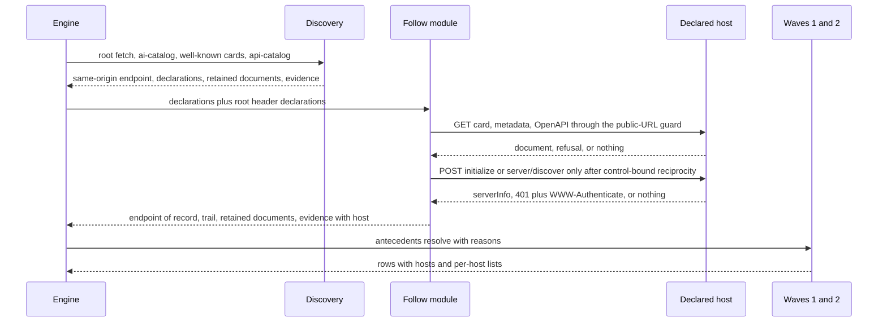
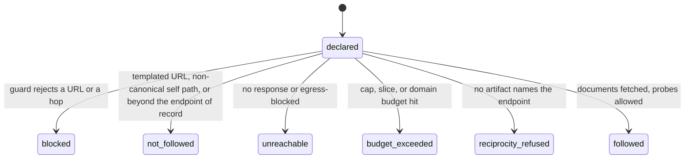
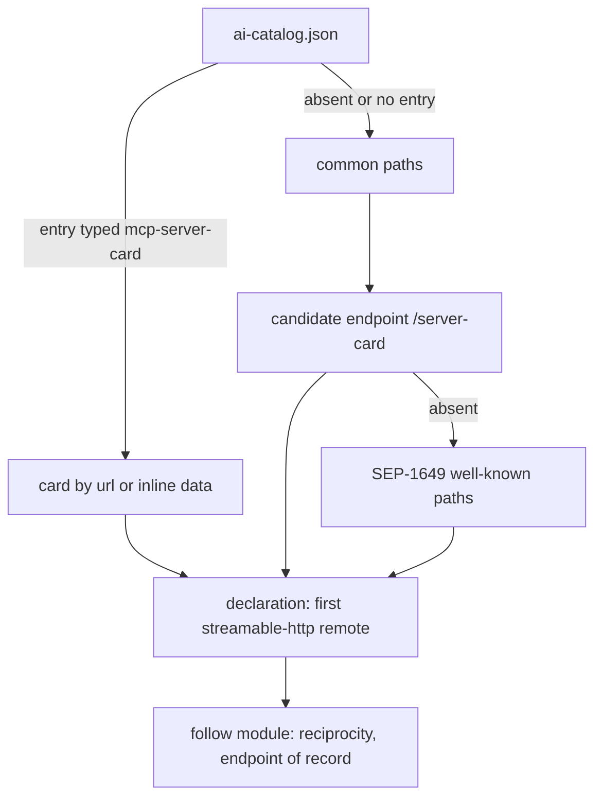

# Declared-Host Evaluation, SEP-2127 Cards, and Spec-Drift Poll - Plan

## Goal Capsule

- **Objective:** A site whose agent surfaces live on other origins it declares (its MCP server, its API host, its
  OpenAPI description) is scored on those surfaces, and every scorecard row says which host the evidence came from. A
  site that publishes the current server-card model is recognized as such, and an OAuth-protected MCP server is scored
  as present and correctly secured rather than absent. When a specification the registry relies on moves, a maintainer
  learns within the poll cadence instead of from a mis-scored audit.
- **Means:** a control-bound, one-hop follow module beside discovery (KTD1, KTD2, KTD16), every declared document
  fetched once and scored from its retained body (KTD21), provenance carried as additive scorecard fields (KTD4),
  SEP-2127 as the discovery path and preferred card shape within the SHOULD tier (KTD8, KTD9), and a scheduled GitHub
  Actions drift poll over a pinned manifest (KTD11, KTD12).
- **Authority hierarchy:** Product Contract requirements (R-IDs) win on behavior. Key Technical Decisions (KTD-IDs) win
  on mechanism within their cited R constraints. Units carry only local deltas.
- **Execution profile:** three phases, each shippable on its own. Phase A (cross-origin evaluation) is U10, U1, U13,
  U2, U3, U4, U5, U6, U7, U12 in that order; U10 (the drift manifest and compare script) opens the phase so its inputs
  exist when U13 pins the vendored schema. Phase B (SEP-2127 scoring and anc.dev's own surfaces) is U8 and U9. Phase C
  (spec-drift poll) is U11. U12 lands with Phase A and is re-verified at each later release. Each unit is its own PR to
  `dev`; a phase may release to `main` before the next starts.
- **Stop conditions:** stop and report if the curated seeds cannot complete inside the audit deadline with the follow
  slice at the KTD2 values, or if the SEP-2127 PR merges with a card shape that differs from the vendored extension
  schema before U13 lands (re-cut U13 against the merged text).
- **Tail ownership:** the implementer owns build, unit, integration, and staging verification per unit, including the
  failing-first proof for each new test. Brett owns the production release cut, the secret creation step and the reflow
  observation in the Rollout section, and the sibling-repo doc edits under Deferred to Follow-Up Work.

---

## Product Contract

### Summary

Let the web audit follow the hosts a site declares and evaluate them there, attributing the evidence to the entry site's
scorecard with per-row provenance. Move MCP server-card discovery to the SEP-2127 model with SEP-1649 as a legacy shape.
Score OAuth-protected MCP servers as present. Add a scheduled poll that opens an issue when a watched specification
moves. Ship as one plan in three releasable phases.

### Problem Frame

The audit of stripe.dev on 2026-09-10 scored 70 relative and 26 global while the site publishes a server card, an RFC
9727 api-catalog with three anchors, a Link header carrying the RFC 8631 service relations, and markdown negotiation.
Three design choices in the audit produced that result, not Stripe's work. Discovery drops a server card's endpoint when
it is off the audited origin, so a card pointing at mcp.stripe.com yields no endpoint and every MCP row, including the
card check itself, resolves N/A. The API hygiene probes are same-origin, so when the catalog anchors api.stripe.com the
audit charges a blog for a missing OpenAPI, an HTML 404, and no rate-limit headers. The card parser reads
`transport.endpoint` from SEP-1649, a draft closed in January 2026, while the successor SEP-2127 replaces the envelope,
the endpoint field, and the discovery path. An OAuth-protected MCP server that answers `initialize` with a spec-correct
401 and RFC 9728 metadata reads as no server at all. No mechanism tells a maintainer when a specification the registry
encodes has moved.

### Key Decisions

- KD1. **Follow declared hosts and evaluate there, attributing evidence to the entry site's scorecard**
  (session-settled: user-directed — chosen over credit-only and over linked per-host scorecards: the fairest result for
  multi-origin organizations without a new result model). Governs R1, R8.
- KD2. **Declared documents fetch freely off-origin; MCP wire probes need control-bound reciprocity** (session-settled:
  user-directed — chosen over any-declared-host and over same-registrable-domain-only, then tightened after security
  review from "any MCP-shaped GET answer" to artifacts the target published that name the probed URL: a 405 or a
  JSON-RPC envelope is what any POST-only route emits). Governs R2, R3, R4.
- KD3. **SEP-2127 is canonical now, SEP-1649 is legacy, and canonical means preferred shape within the SHOULD tier the
  card check already holds** (session-settled: user-directed — chosen over dual-recognize-then-flip and over demoting
  the card check to MAY: the check is recommended today, both generations keep full credit, and no existing score moves;
  the legacy-alias check is kept unchanged until SEP-2127 is approved). Governs R20, R21, R22, R23.
- KD4. **An OAuth-protected MCP endpoint is present, with checks split so it passes everything observable, including
  auth enforcement** (session-settled: user-directed — chosen over absent-until-authenticated: it zeroes every
  enterprise MCP server). Governs R13, R14, R15, R16.
- KD5. **The API category resolves against api-catalog anchor hosts** (session-settled: user-directed — chosen over
  credit-only and over on-origin-only: a catalog pointing at the real API host earns the category). Governs R17, R18,
  R19.
- KD6. **The spec-drift poll is a GitHub Actions cron over a checked-in manifest that opens issues** (session-settled:
  user-approved — chosen over a Worker cron with a freshness page: no runtime coupling, PR-reviewed manifest). Governs
  R28, R29, R30, R31.
- KD7. **Engine-first and independent of the unified audit funnel plan, with provenance as additive fields**
  (session-settled: user-approved — chosen over sequencing after that plan or folding into it: fairness fixes ship
  without waiting on a four-phase migration). Governs R8, R33.
- KD8. **Curated seeds re-score on release; other cached audits refresh lazily with a registry marker**
  (session-settled: user-approved — chosen over a full backfill and over no rescore: bounded cost, honest boards).
  Governs R32, R33, R34.
- KD9. **In scope: anc.dev's own card and catalog, provenance in every reader, a follow-declarations opt-out. Out: the
  local skill scorer** (session-settled: user-directed). Governs R25, R26, R27, R35, R36.
- KD10. **One row per check id on the entry-point record, one MCP endpoint of record, API anchors aggregated in the row
  with an additive per-host list; provider clusters deferred** (session-settled: user-directed — chosen over composite
  (check id, host) rows after sizing: two to three times the result-model work for detail a followed host's own
  scorecard already provides). Governs R9, R10, R11.
- KD11. **An opted-out audit is transient: returned inline, never cached, never listed** (session-settled: user-directed
  — chosen over a variant cache key and over overwriting the stored scorecard: one canonical score per domain, no
  downgrade path for third parties). Governs R36.
- KD12. **No robots.txt gating in this plan; a robots parser is deferred** (session-settled: user-directed — chosen over
  honoring Disallow on the anchor probe: real machinery for a marginal courtesy, and the entry origin gets no such check
  today). Governs R19.

### Requirements

**Cross-origin evaluation**

- R1. After MCP discovery, the audit follows hosts the entry site declares: the server card's remote or transport URL,
  each api-catalog anchor, the catalog's service-desc target, and RFC 9728 protected-resource metadata for a discovered
  MCP endpoint.
- R2. Declared documents are fetched by GET off-origin through the public-URL guard, one hop from the entry origin, with
  no transitive following.
- R3. An MCP wire probe to an off-origin endpoint runs only after reciprocity: a SEP-2127 card at the endpoint's
  `/server-card` location or in the target's own ai-catalog whose remote URL equals the endpoint after normalization, or
  RFC 9728 metadata whose `resource` equals it after the same normalization. Normalization is RFC 3986 syntax only:
  lowercase scheme and punycoded host, default port dropped, empty path and `/` treated as equal, fragment dropped; the
  scheme, host, port, path, and query must then match exactly, so a card naming one path never admits another. A 405,
  an `Allow` header, or a JSON-RPC envelope never admits an endpoint. Every reciprocity failure mode collapses into one
  outcome.
- R4. A followed host that is unreachable, refuses reciprocity, is blocked by the guard, or exceeds a budget degrades
  the rows that depend on it to not-applicable with a stated reason and never marks the entry audit incomplete.
  Exhaustion of the per-audit cap or the slice caches the entry result as today; exhaustion of the shared per-domain
  budget is not a property of the site, so that result is returned inline like an opted-out run, the prior stored
  object is kept, and when no prior object exists the result is cached under the stale-serve window so the next request
  re-audits.
- R5. Followed-host responses do not count toward the entry site's reachability decision.
- R6. Per audit, the number of distinct off-origin hosts and the number of follow-phase document requests are capped
  (KTD2). Per declared registrable domain, an hourly budget across audits, reserved once per audit and expressed in
  audits per hour, with a burst floor, caps how often anc probes it; the reservation counts wire probes and
  notifications as well as follow-phase fetches (KTD2).
- R7. An operator can disable following globally without disabling audits (KTD14).

**Result model and provenance**

- R8. Every scorecard row carries the host or hosts its evidence was evaluated at, as additive fields that readers
  without the fields ignore. The declaration that led to a host lives on the trail (R11), not on the row.
- R9. A row that evaluated several hosts (API anchors) carries an additive per-host list of outcome and evidence; the
  row's own outcome aggregates them (all must pass) and scoring stays per check id.
- R10. One MCP endpoint of record per audit: the entry origin's own endpoint if one exists, else the first followed
  remote; other remotes are recorded in the trail as not-followed. Presence established through a 401 admits at most one
  endpoint of record.
- R11. The scorecard carries a top-level declared-hosts trail with one entry per declared host: the declaring surface,
  the declared URL, the final URL when a redirect changed it, and the outcome: followed, reciprocity-refused,
  not-followed, blocked, unreachable, or budget-exceeded. A budget-exceeded entry also names its cause: per-audit cap,
  slice, or domain budget.
- R12. New not-applicable reasons are closed values agents can branch on: follow-disabled, reciprocity-refused,
  declared-host-unreachable, declared-host-budget-exceeded, auth-required.

**OAuth-protected MCP**

- R13. A 401 whose `WWW-Authenticate` names a `resource_metadata` URL on the endpoint's own host that resolves with a
  `resource` equal to the probed endpoint after the R3 normalization, or RFC 9728 metadata that resolves at the
  well-known locations with that `resource`, establishes MCP presence with auth required. A bare 401 or 403 stays
  refusal evidence. A host whose nonsense path also answers 401 with metadata echoing that path's URL grants no
  presence.
- R14. MCP checks that work without a session still run against a protected endpoint; checks that need a session resolve
  not-applicable with reason auth-required, never absent or broken.
- R15. New positive checks score auth enforcement: the 401 carries a well-formed `WWW-Authenticate` with
  `resource_metadata`; the metadata carries valid https `authorization_servers`; an unauthenticated `tools/list` is
  rejected.
- R16. A correctly protected endpoint is never priced as broken.

**API category on anchor hosts**

- R17. The api-catalog is fetched as a declared document before the API antecedent resolves. The API hosts the category
  evaluates are the anchors that carry a `service-desc` whose target is not an MCP surface; every other anchor is
  recorded on the trail as not-followed with a stated reason, and the API surface holds only when that set is non-empty.
- R18. The OpenAPI check accepts the catalog's service-desc wherever it is hosted, subject to the document size cap
  (KTD7).
- R19. The JSON-error and rate-limit probes send one GET to a nonsense path under each API anchor host (R17) and never
  to the entry site when every anchor is off-origin; each anchor's outcome is recorded per R9.

**Server-card model**

- R20. Discovery walks the SEP-2127 path first: entries of type `application/mcp-server-card+json` in
  `/.well-known/ai-catalog.json`, then `<streamable-http-url>/server-card`, then the SEP-1649 well-known paths.
- R21. The card parser accepts `remotes[].url`, `transport.url`, `transport.endpoint`, `mcp_endpoint`, and `url`.
- R22. The card check keeps its recommended tier (SHOULD, weight 3) under its new id: a SEP-2127 card and a SEP-1649
  card both earn full credit, a SEP-1649-only card carries a superseded reason and SEP-2127 remediation, and a missing
  card costs what it costs today. No check changes tier or weight in this plan.
- R23. The SEP-1649 card check id is retired in favor of `mcp-server-card`; a stored row carrying the retired id still
  renders, names its successor, and links a live skill page for as long as the object can be served. The legacy-alias
  redirect check stays as it is, with its canonical target unchanged until SEP-2127 is approved.
- R24. Remediation text teaches the SEP-2127 shape and names the SEP-1649 path only as legacy. A reciprocity-refused
  row and its trail entry render remediation naming the artifacts the declared host must publish to be evaluated: a
  SEP-2127 card at the endpoint, an ai-catalog entry naming it, or RFC 9728 metadata whose `resource` matches.

**anc.dev's own surfaces**

- R25. anc.dev publishes a SEP-2127 card at `/mcp/server-card` and an `/.well-known/ai-catalog.json` entry pointing at
  it, and continues to serve the SEP-1649 path with the fields the MCP smoke reads.
- R26. The card's `$schema` is the SEP-2127 v1 URL, and the origin-rewrite path covers `remotes[].url` and the catalog
  entry URL so staging serves staging URLs.
- R27. anc.dev's own audit passes the new card and catalog checks in production and on staging.

**Spec-drift poll**

- R28. A checked-in manifest lists each watched source with its stability tier, source type, pinned value, and
  canonicalization rule, and lives outside the registry's build inputs.
- R29. A scheduled workflow compares each source's live value against the manifest and opens or updates exactly one
  labeled issue per drifted source.
- R30. The workflow pins every action to a commit SHA, grants `issues: write` only in the job that writes, and
  serializes runs.
- R31. A deliberate manifest change proves the issue path end to end: a forced-drift run opens one issue and a second
  run updates it.

**Release and cache**

- R32. Registry changes and follow-policy changes alter the registry fingerprint so the post-deploy rescore reflows the
  curated seeds; the follow kill-switch state is recorded separately and also forces a reflow on its next trigger.
- R33. Every reader treats a missing provenance, trail, follow-state, or marker field as not evaluated, never as
  evaluated-and-empty or as following-on, so scorecards cached before this work render truthfully until they refresh.
- R34. A scorecard page, its markdown twin, and the board metadata carry the registry fingerprint prefix the score was
  computed under.

**Controls**

- R35. A follow-declarations flag, default on, exists on the MCP tool, the audit route body, the web form, the WebMCP
  tool, and the local runner; the effective value after the kill switch is stored in the scorecard and on the run
  record.
- R36. An opted-out run bypasses the serve-cached path, streams and returns its result without a share URL, rejects a
  public-listing change, writes nothing to storage, rebuilds no aggregate, and never appears on a board. Telemetry still
  records the run with its effective flag.
- R37. The MCP tool description and the server instructions disclose that a default-on audit probes third-party hosts a
  site declares, distinguishing MCP endpoints (wire-probed only after the target's own artifact names them) from API
  anchor hosts (document fetches and one nonsense-path GET on the entry site's declaration alone), name the caps, and
  state that following lengthens wall time.

**Operability**

- R38. The audit run record carries the follow phase's outcome counts, request count, and elapsed time, and the
  per-domain budget is inspectable by key prefix.

### Success Criteria

- A fresh audit of stripe.dev shows the MCP category evaluated at mcp.stripe.com with auth-required reasons where a
  session is needed and passes on the auth-enforcement checks, the API category evaluated at api.stripe.com, and the
  card check passing with the SEP-1649 card marked superseded.
- anc.dev's own production scorecard keeps its score of 100 and passes the SEP-2127 card and ai-catalog checks.
- No probe in the follow phase reaches a private, loopback, link-local, or metadata destination, and no wire probe
  reaches a host that did not publish an artifact naming it, proven by the SSRF suite extended with the KTD16 collapse
  cases.
- A forced manifest change opens one issue with the diff and a second run updates it instead of opening another.

### Scope Boundaries

- The local `~/.claude` web-audit skill scorer keeps its own registry; parity is a separate task (KD9).
- Followed hosts never get their own scorecard page or board entry from an audit of another site.
- Following stops at one hop; a followed host's own declarations are not followed.
- Wire probes reach an off-origin MCP endpoint only when its host publishes a SEP-2127 card or RFC 9728 metadata naming
  it; an open server that publishes neither is recorded reciprocity-refused with remediation (R24), not evaluated.
- Robots.txt is not consulted for any probe in this plan (KD12).
- The unified audit funnel plan's URL and envelope changes stay in that plan; this plan adds fields both envelopes can
  render (KD7).

#### Contract for the unified audit funnel

The funnel plan absorbs the result page, deletes the live scoring client, and rewrites the WebMCP result client and MCP
tools. To keep the second lander's work mechanical, this plan commits to: the streamed check event gains optional `host`
and `na_reason`; the row model gains `hosts[]` and `host` (KTD4); the scorecard gains `declared_hosts[]`,
`follow_declarations`, and `registry_fingerprint`; the fingerprint renders inside the funnel's freshness object once
that exists, with the pre-funnel placement in the freshness line; and the funnel's cross-surface fixtures pin
`WEB_SCHEMA_VERSION` 0.5.

#### Deferred to Follow-Up Work

- A robots parser honoring `Disallow` for the audit user agent on the anchor nonsense-path probe, applied to the entry
  origin as well.
- A related-audits link between entry-point scorecards for provider clusters (KD10).
- A standalone `list_declared_hosts` read tool for agents that want to preview third-party probing before spending
  budget.
- Raising the MCP-lane audit deadline if the incomplete rate exceeds the Rollout baseline.
- Once SEP-2127 is approved, driven by the drift issue the poll opens: making it the only canonical card generation,
  re-pointing the legacy-alias check's canonical target to the SEP-2127 location, and dropping SEP-1649 parsing.
- A repo test that scans every workflow's `uses:` lines for full SHAs, generalized from the U11 scanner.
- Sibling-repo edits: the stability-tier solutions doc naming SEP-1649 as the MCP card.

### Acceptance Examples

- AE1. Stripe-shaped site
  - **Covers:** R1, R3, R8, R10, R13, R17, R19
  - **Given:** an entry site whose card names an off-origin MCP URL that answers `initialize` with 401 and metadata
    whose `resource` equals that URL, and whose api-catalog anchors an off-origin API host with a `service-desc` that
    returns JSON errors and no rate-limit headers, plus a second anchor carrying no `service-desc`
  - **When:** the site is audited with following on
  - **Then:** MCP rows carry the MCP host as provenance, session-required rows read auth-required, the auth-enforcement
    checks pass, the JSON-error check passes at the API anchor host, the rate-limit check is missing there, the second
    anchor is recorded not-followed and never probed, and no probe hit a nonsense path on the entry site
- AE2. Opted out
  - **Covers:** R35, R36, R12
  - **Given:** the same site, with a cached followed scorecard less than a minute old
  - **When:** audited with following off
  - **Then:** the cached scorecard is not served, MCP and API hygiene rows read follow-disabled, the result streams
    without a share URL, no Cloudflare R2 object or aggregate is written, and the board is unchanged
- AE3. Reciprocity refused
  - **Covers:** R3, R4, R11
  - **Given:** a card naming an off-origin URL that answers GET with 405 and `Allow: POST` but publishes no card and no
    metadata
  - **When:** audited
  - **Then:** no POST reaches that URL, the trail records reciprocity-refused, MCP rows read reciprocity-refused, and
    the entry result caches
- AE4. Budget exhausted
  - **Covers:** R4, R6
  - **Given:** a declared host that accepts connections but never answers
  - **When:** audited with an injected clock
  - **Then:** the follow slice ends at its budget, dependent rows read declared-host-budget-exceeded with the slice
    cause on the trail, and the entry result is complete and cached; the same site whose declared domain is at its
    shared hourly budget gets the domain-budget cause, a result returned inline, and no cache write
- AE5. Old scorecard
  - **Covers:** R33, R34
  - **Given:** a cached scorecard written before this work
  - **When:** its page, markdown twin, board row, and MCP read are served
  - **Then:** every surface renders with no host shown, the follow state shown as not evaluated, no trail, and the
    registry marker shown as unknown
- AE6. Card generations
  - **Covers:** R20, R21, R22
  - **Given:** one site with only a SEP-1649 card at the well-known path, and another with an ai-catalog entry pointing
    at a SEP-2127 card
  - **When:** both are audited
  - **Then:** both earn full SHOULD credit, the first carries a superseded reason and SEP-2127 remediation, and neither
    site's score differs from what the card check gives it today
- AE7. Redirected endpoint
  - **Covers:** R3, R11, KTD15
  - **Given:** a card naming an endpoint that answers the reciprocity GET with a redirect to another public host, which
    publishes a card naming itself
  - **When:** audited
  - **Then:** the trail records both URLs, the final host is the endpoint of record and counts toward the host cap, and
    no wire probe is sent to the declared URL

### Sources

- Audit evidence: the vault note `projects/brettdavies-agentnative/2026-09-10-stripe-surface-audits.md` and the hosted
  scorecards at `https://anc.dev/web/stripe.dev` and `https://anc.dev/web/docs.stripe.com`.
- SEP-2127 PR and branch text: `https://github.com/modelcontextprotocol/modelcontextprotocol/pull/2127`; extension repo
  with `schema.json`, `schema.ts`, `docs/discovery.md`, and examples:
  `https://github.com/modelcontextprotocol/experimental-ext-server-card`. Status at planning: PR open, extension labeled
  experimental, `$schema` URL 404.
- SEP-1649 issue (closed, moved to 2127): `https://github.com/modelcontextprotocol/modelcontextprotocol/issues/1649`.
- AI Catalog specification: `https://github.com/Agent-Card/ai-catalog/blob/main/specification/ai-catalog.md`.
- MCP authorization, revision 2026-07-28: `https://modelcontextprotocol.io/specification/2026-07-28/basic/authorization`
  and its authorization-server-discovery page; RFC 9728 §7.7 for the private-range guidance when fetching declared
  metadata.
- Observed on 2026-09-10: stripe.dev's card declares `transport.url` `https://mcp.stripe.com/`, and
  `https://mcp.stripe.com/.well-known/oauth-protected-resource` returns `resource` `https://mcp.stripe.com` with no
  trailing slash; `/server-card` and `/.well-known/ai-catalog.json` on that host both 404, so the metadata comparison
  is the flagship case's only admission route.
- RFC 9727, RFC 9264, RFC 8631: multi-anchor linksets and cross-origin `service-desc` targets.
- Repo learnings: `docs/solutions/architecture-patterns/agent-readiness-audit-surface-2026-07-01.md`,
  `docs/solutions/design-patterns/web-audit-fairness-scoring-model.md`,
  `docs/solutions/integration-issues/cdn-tarpit-ua-less-probes-web-audit-deadline-exhaustion.md`,
  `docs/solutions/integration-issues/web-audit-display-only-registry-change-skips-board-reflow.md`,
  `docs/solutions/design-patterns/carry-forward-stored-stateful-flags-through-a-rebuild-write-path.md`,
  `docs/solutions/design-patterns/denormalized-gating-flag-write-always-emit-read-coerce-missing-to-closed.md`,
  `docs/solutions/design-patterns/fail-closed-proof-of-control-gates-a-caller-claimed-security-binding.md`,
  `docs/solutions/integration-issues/origin-rewrite-consistency-across-worker-discovery-surfaces.md`,
  `docs/solutions/integration-issues/nondeterministic-upstream-scope-serialization-defeats-byte-drift-gate.md`,
  `docs/solutions/conventions/verify-the-real-implementation-when-a-di-seam-sits-above-the-risk.md`,
  `docs/solutions/conventions/registry-walk-coverage-tests-prevent-silent-omission.md`,
  `docs/solutions/developer-experience/cloudflare-workers-same-account-fetch-reachability-dev-vs-prod-2026-07-20.md`.
- Related plans: `docs/plans/2026-09-09-1123-feat-unified-audit-funnel-plan.md` (envelope and URL migration this plan
  stays independent of), `docs/plans/2026-08-26-001-feat-mcp-baseline-adoption-plan.md` (the `na_reason` schema bump
  precedent), `docs/plans/2026-08-07-001-feat-web-public-listing-opt-in-plan.md` (additive-field precedent).

---

## Planning Contract

### Key Technical Decisions

- KTD1. **Following is a sibling module of discovery, and discovery stays entry-origin.** Discovery keeps its contract
  (MCP on the entry origin, own budget, concurrent passes) and returns the same-origin endpoint plus the declarations it
  found without probing them. A new follow module consumes those declarations and the root header declarations, owns
  every off-origin request, the caps, the reciprocity gate, and the document fetches, and returns the endpoint of
  record, the trail, retained documents, and evidence. The engine composes: the endpoint is discovery's, else follow's.
  Wire probes reach an off-origin endpoint only through that composition, which is the gate KD2 requires. Instantiates
  KD2 (R1, R3).
- KTD2. **The follow slice is bounded and every cap names what it protects.** The slice runs after discovery and before
  wave 1 under a wall-clock budget of the smaller of 6 seconds and the remaining deadline, concurrent across declared
  hosts. Per audit: at most 4 distinct off-origin hosts and 12 follow-phase document requests, which bound fan-out and
  the auditor's deadline. A declared host whose hostname is an IP literal is refused before the slice and recorded on
  the trail as blocked. Per declared registrable domain (the registrable domain from `tldts` with private suffixes
  enabled, lowercased, trailing dot stripped, punycoded): an hourly budget across all audits, expressed in audits per
  hour and reserved once per audit and domain in the follow slice: the follow module counts the document fetches, the
  wave probes the endpoint of record will draw from the registry, and the notification, then consumes that allowance in
  one KV read and put through the limiter's existing hourly-bucket helper; when the reservation fails every dependent
  row resolves budget-exceeded with the domain-budget cause before wave 1, so no handler ever consults the budget. A
  rate-limit binding keyed by the same domain is the 60-second burst floor on that same reservation call, because KV
  alone is get-then-put on an eventually consistent store. The budget is injected into the engine as a port so the
  route, the MCP tool, and the rescore Workflow all supply it and tests supply memory. Exhaustion of any cap resolves
  dependent rows to not-applicable with the matching R12 reason and never sets the incomplete flag. Values are the
  implementer's to tune against the curated seeds within the stop condition. Instantiates R4, R6.
- KTD3. **Every evidence item carries a `host` field, and follow evidence lives in its own structure.** Discovery
  evidence stays entry-origin, so the reachability predicate is untouched and R5 holds by construction. The host field
  exists for provenance derivation (KTD4). Instantiates R5, R8.
- KTD4. **Provenance rides as additive fields derived from evidence; new reasons bump the schema version.** Each stored
  row gains `hosts[]` derived from the distinct evidence hosts in evaluation order (per-entry status only on
  multi-target rows) and `host` as a convenience when exactly one host was evaluated; a row missing both reads as the
  entry host. The scorecard gains `declared_hosts[]` (R11), `follow_declarations`, and `registry_fingerprint`. Fields
  are additive with no bump, following the `public_listing` precedent. The five new `na_reason` values bump
  `WEB_SCHEMA_VERSION` from 0.4 to 0.5, following the 0.2 to 0.3 precedent. Readers: a missing `follow_declarations`
  reads as not evaluated and is never rendered as on; a missing trail reads as no trail, with copy distinct from an
  empty trail; a missing fingerprint reads as unknown. The Cloudflare R2 object key keeps the spec version; adding the
  schema version would orphan every cached object at once. Instantiates R8, R9, R11, R12, R33.
- KTD5. **Auth presence is decided by resolvable RFC 9728 metadata on the endpoint's host, and the auth-aware arm
  precedes every other arm.** The follow module captures `WWW-Authenticate` once and resolves the metadata URL in
  order: header value, then the path-suffixed well-known, then the root well-known. The URL must be https, pass the
  public-URL guard, and share the endpoint's host, since a third host would be transitive following; the fetch carries
  the 64 KiB cap and the follow budget. Presence requires `resource` equal to the probed endpoint after the R3
  normalization. A differential control closes echoing gateways: if the host's nonsense path also answers 401 with
  metadata whose `resource` echoes that path, the 401 is a gateway property and grants nothing. The
  `authorization_servers` values are never fetched; they are validated as https URLs, capped in count and length, and
  stored as opaque strings that every renderer escapes. In `runMcp`, immediately after the transport-error and
  rate-limit checks and before the discriminating, negotiation, and no-JSON-RPC arms, a 401 on an endpoint whose
  auth-required presence was established resolves not-applicable with reason auth-required, so `server/discover`
  answering 401 leaves the modern lane unknown; 401 is never added to the typed-refusal status set, which the
  conformance rows' accept probe shares. The follow module exports the resolver; U3 consumes it. Instantiates KD4 (R13,
  R14, R16).
- KTD6. **The MCP check split adds a session antecedent and an auth-required antecedent.** `mcp-present` holds
  when an endpoint of record exists, including auth-required. A new `mcp-session` antecedent holds when the endpoint
  answered a wire probe without auth; session-required checks declare it and resolve N/A auth-required when it fails.
  A new `mcp-auth-required` antecedent holds only when the endpoint of record answered a wire probe with a 401 whose
  metadata resolved with a matching `resource` (KTD5); it gates the three auth-enforcement checks, so an open server,
  including one whose card documents that no auth is required, gets N/A rather than absent. The existing `mcp-auth`
  antecedent (a 401 challenge or a card declaring auth) keeps gating `oauth-protected-resource` unchanged; metadata
  content is the scored fact, not the gate. Antecedent registration has four homes: the token union, the build
  allowlist, the resolver index, and the per-group evidence map. Instantiates R14, R15.
- KTD7. **The API category anchors on the retained api-catalog document.** The api-catalog is fetched as a declared
  document during discovery (KTD21), so its anchors exist before the follow slice and before wave 1. The shared
  linkset-anchor helper yields only anchors that carry a `service-desc` whose href is not an MCP surface, mirroring the
  existing MCP-target exclusion in the api antecedent; the api-surface antecedent holds only when that filtered set is
  non-empty, and other anchors are recorded on the trail as not-followed. `openapi` follows those `service-desc` hrefs
  off-origin under a 512 KiB cap and accepts YAML for presence while deriving probe URLs from JSON only. Hygiene probes
  target each API anchor host, one GET each, and never fall back to the entry site when every anchor is off-origin.
  Instantiates KD5 (R17, R18, R19).
- KTD8. **Discovery order under SEP-2127.** Read `/.well-known/ai-catalog.json` and take at most its first four entries
  typed `application/mcp-server-card+json`; for each, read its inline `data`, or fetch its `url` during discovery only
  when that URL is same-origin with the entry site; an off-origin `url` is recorded as a card-document declaration that
  the follow module fetches under the document-request cap, the domain budget, the kill switch, and the follow flag
  before its first `streamable-http` remote is taken. Take the first remote of type `streamable-http` as a declaration
  (R10 chooses the endpoint of record); else probe `<candidate-endpoint>/server-card` for endpoints found on the common
  paths; else the SEP-1649 well-known paths. The discovery config gains `ai_catalog` and `card_suffix` keys validated at
  build, and every test fixture that carries the config gains them. Templated remote URLs are recorded not-followed.
  Instantiates KD3 (R20, R21).
- KTD9. **Card scoring within SHOULD, from the retained card.** One `mcp-server-card` check replaces
  `well-known-mcp-card` at the same recommended tier and weight 3: it scores the card document retained by discovery
  (KTD21) with no request of its own; pass for a SEP-2127 card whose required fields validate against a hand-written
  schema mirroring the vendored extension `schema.json`, and pass with reason superseded for a SEP-1649-shaped card. A
  JSON Schema validator may be added as a devDependency used only in the build step and tests, never in the Worker
  runtime; a test binds the mirror to the vendored file. `well-known-mcp-card` moves to a `retired` map in the registry
  (id, successor, reason); the display layer renders a stored row with a retired id as retired with no remediation and
  the successor's skill link; the skill build emits pages for retired ids; the remediation validator accepts entries
  for retired ids. `mcp-card-legacy-aliases` and its eval rule stay unchanged. Instantiates KD3 (R22, R23).
- KTD10. **anc.dev emits its own SEP-2127 card and catalog at build.** The discovery-emit build step writes
  `/mcp/server-card` and `/.well-known/ai-catalog.json`; the Worker routes `/mcp/server-card` explicitly (the MCP branch
  matches `/mcp` exactly today) with the card media type; the descriptor rewrite gains `remotes[].url` and the catalog
  entry URL; the SEP-1649 path keeps serving the legacy shape with `protocolVersion` and `mcp_endpoint`, which the MCP
  smoke reads; `$schema` is the SEP-2127 v1 URL even though it 404s until graduation, because the poll watches that URL
  and validation runs against the vendored schema. Instantiates R25, R26.
- KTD11. **The drift manifest lives at `src/data/standards/watch.yaml`, outside registry build inputs; the vendored
  extension schema lives with the registry.** Each manifest entry carries id, tier, source type (`github-pr`,
  `github-file`, `url-status`, `ietf-draft`, `json-field`), the pinned value, and the canonicalization rule; the compare
  script canonicalizes both sides before hashing so serializer jitter cannot trip it. The vendored `schema.json`
  snapshot is a check input and lives under `src/data/web-audit/`, refreshed by a sync script listed in the syncs index.
  Instantiates R28.
- KTD12. **The workflow mirrors `mcp-sweep.yml` and `deep-check.yml`.** Off-hour cron plus `workflow_dispatch`,
  `permissions: contents: read` at the workflow level with `issues: write` on the writing job only, a concurrency group,
  SHA-pinned `uses:` with version comments, the Node 24 env the sibling workflows set, no `continue-on-error`, and an
  issue upsert that lists open issues by the `spec-drift` label and a marker-owned title rather than searching.
  Scheduled and dispatched runs resolve from `main`, so the R31 proof runs after the workflow ships, with `--ref`
  pointing at a forced-drift branch. Instantiates KD6 (R29, R30, R31).
- KTD13. **The registry fingerprint hashes the registry plus a follow-policy version constant; the switch is recorded
  beside it.** The fingerprint helper moves to the registry module so the route, the MCP tool, and the rescore Workflow
  stamp the same value. The rescore gate compares the fingerprint and a separately recorded normalized switch boolean,
  forcing a reflow on its next trigger when either moves; hashing the live secret would make staging and production
  disagree and mint a reflow for `TRUE` versus `true`. The stored prefix is the first 12 characters, written by the
  single board-metadata writer as well as into the scorecard. Instantiates R32, R34.
- KTD14. **`WEB_AUDIT_FOLLOW_ENABLED` is a surgical kill switch** with the same shape as `WEB_AUDIT_ENABLED`: a `vars`
  binding on staging, a secret in production created before the code that reads it ships, absent reads as off, bound in
  the Worker env and the rescore Workflow env, and stored as the effective follow state. Instantiates R7, R35.
- KTD15. **Redirect accounting.** Reciprocity artifact fetches (the endpoint's server card, the target's ai-catalog, the
  RFC 9728 metadata) and every wire probe to a followed endpoint run with redirects disabled; a 3xx collapses to
  reciprocity-refused or refusal. Follow-phase document GETs also run with redirects disabled: on a 3xx the follow
  module validates the `Location` through the guard, charges the hop host against the distinct-host cap and the domain
  reservation, refuses with budget-exceeded or blocked when either fails, and only then issues the single further GET,
  again with redirects disabled. The final URL is pinned as the endpoint of record, reciprocity is attributed to the
  final host, and the declared URL is never re-traversed. The handler context carries a followed flag set by the engine
  so the MCP, CORS-preflight, HTTP, and notification handlers pass no-redirect for a followed endpoint. Instantiates R3,
  R11.
- KTD16. **Reciprocity is control-bound** (session-settled: user-directed — chosen over keeping 405-with-Allow and
  JSON-RPC-envelope signals: security review showed those admit any POST-only route and any public RPC gateway). An
  endpoint is admitted only by a SEP-2127 card at `<endpoint>/server-card` or in the target's own
  `/.well-known/ai-catalog.json` whose `remotes[].url` equals the endpoint after the R3 normalization, or by RFC 9728
  metadata whose `resource` equals it after the same normalization (KTD5); an origin-only comparison is never used, so
  one artifact naming `/mcp` admits no other path, scheme, or port on that host. A catalog entry counts only when its
  card is inline `data` or its `url` shares the endpoint's host and passes the public-URL guard; an entry whose `url`
  sits on another host collapses to reciprocity-refused with no request to that host. DNS failure, a missing or
  unparseable card, a card naming another URL, mismatched or timed-out metadata, and any GET body all collapse to
  reciprocity-refused with a byte-identical trail entry apart from the host, and zero POST or OPTIONS requests to the
  host. Instantiates KD2 (R3).
- KTD17. **Auditor self-targeting.** A declaration naming the auditor's own zone is admitted only for the canonical
  `/mcp` endpoint; any other self path is refused before reciprocity. The domain budget applies to the auditor like any
  host. A declared host under the auditor's own configured account subdomain of `workers.dev` is recorded unreachable
  with an egress reason, never broken, because same-account Workers targets are edge-blocked for plain fetch; every
  other `workers.dev` host takes the ordinary follow path, confirmed once by a staging fetch of a known third-party
  Workers MCP endpoint recorded in the U7 PR.
- KTD18. **Test posture.** A shared `stubFetch` helper replaces the per-suite copies before the new suites land;
  multi-host coverage keys routers by full URL; write-path tests drive the real `auditDomainToCache` with fake fetch and
  R2 rather than the DI seam above it; every new test is observed failing before its unit lands; stripe.dev runs as a
  live smoke through the local runner and is not CI-gated.
- KTD19. **Logging.** The run record gains follow outcome counts, the follow request count, and the follow elapsed time,
  read from the trail on the complete event, through the telemetry emitter; the domain budget key prefix is documented
  so hot hosts are listable. No new log scope. Instantiates R38.
- KTD20. **Antecedent resolutions carry a reason.** The resolver result widens from a bare token to a token plus
  optional reason, and the gate stamps that reason instead of always stamping antecedent-unmet. All five R12 reasons are
  decided before a handler runs, so this one signature change is the mechanism for follow-disabled, reciprocity-refused,
  declared-host-unreachable, declared-host-budget-exceeded, and auth-required. Instantiates R12.
- KTD21. **Every declared document is fetched once and scored from its retained body.** Discovery and the follow module
  retain the server card, the ai-catalog, the api-catalog, the OpenAPI description, and the RFC 9728 metadata under
  stable keys, with location and shape recorded in evidence. A new `retained-document` eval rule lets a check score a
  retained body in wave 2 with no request. `api-catalog` and `mcp-server-card` use it; `openapi` uses it for an
  off-origin description. This removes the double fetch of the card and the wave-1 dependency that would otherwise sit
  between the follow slice and the API category. Instantiates R17, R20, R22.

### High-Level Technical Design

Audit pipeline with the follow module between discovery and wave 1:

Declared-host trail states:

Card discovery order:

Follow flag and kill switch:

| Request flag | Switch | Effective     | Stored and logged as | Result persistence                        |
| ------------ | ------ | ------------- | -------------------- | ----------------------------------------- |
| on or absent | on     | following     | `true`               | cached, listed per existing rules         |
| on or absent | off    | not following | `false`              | cached, listed; rows read follow-disabled |
| off          | on     | not following | `false`              | transient (R36)                           |
| off          | off    | not following | `false`              | transient (R36)                           |

Antecedents:

| Antecedent            | Holds when                                                    | Gates                                                         |
| --------------------- | ------------------------------------------------------------- | ------------------------------------------------------------- |
| `mcp-present`         | an endpoint of record exists, including auth-required         | unauthenticated-observable MCP checks, `mcp-server-card`      |
| `mcp-session`         | the endpoint answered a wire probe without auth               | tools, resources, capabilities, modern discover               |
| `mcp-auth-required`   | 401 and matching-`resource` metadata on the endpoint (KTD5)   | the three auth-enforcement checks                             |
| `mcp-auth` (existing) | a 401 challenge was observed or the card declares auth        | `oauth-protected-resource`                                    |
| `api-surface`         | the retained api-catalog has anchors, or the existing signals | `openapi`, `json-errors`, `rate-limit-headers`                |

### Sequencing

Phase A runs U10, U1, U13, U2, U3, U4, U5, U6, U7, U12 in that order: U10 creates the drift manifest and compare script
that U13 pins the vendored schema into and the Phase B gate runs; U1 defines fields and the reason-carrying resolver;
U13 supplies the SEP-2127 parser, discovery order, and retained documents that U2 needs for reciprocity; U2 and U3
change the engine; U4 the API category; U5 the inputs and the switch; U6 the readers; U7 the budget port and logging;
U12 the fingerprint and marker, which depends on the switch from U5. Phase B runs U8 then U9. Phase C runs U11, which
depends only on U10 and has no code dependency on Phases A and B beyond it.

### System-Wide Impact

- Rate limits stay keyed by caller IP; the per-domain budget is a new dimension, injected into the engine so the rescore
  Workflow honors it, with its own rate-limit binding for the burst floor.
- The schema bump touches the schema doc, its drift-guard test, the Python scoring parity model, and every `na_reason`
  copy site in the renderers and the WebMCP client.
- Followed-host findings publish under the entry domain's `public_listing`. An MCP endpoint is wire-probed only after
  its own host published an artifact naming it; API anchor hosts receive document fetches and one nonsense-path GET each
  on the entry site's declaration alone, bounded by the KTD2 caps, and the tool description states both.
- The Worker's descriptor rewrite gains a field; staging and production diverge if it is missed, and the deploy smoke
  must cover the new paths.
- The legacy-alias eval rule and its helpers stay; a wide rename touches the engine and the assert module.
- The three R15 checks join the universe at optional tier, weight 1, so universe max rises by 3 for MCP sites and no
  site's relative score moves unless it actively fails enforcement; the card check keeps its tier and weight under its
  new id, so the id replacement moves no score.
- Board metadata gains the fingerprint prefix through its single writer; the board ranks 0.4 and 0.5 objects together
  until seeds reflow and user objects refresh.

### Risks & Dependencies

- SEP-2127 may merge with a changed shape before U13 lands; the stop condition covers it and the drift poll catches it
  afterwards.
- Following adds up to 12 document requests and the wave probes to one more host inside a 25 second deadline; the follow
  slice and the degrade-to-N/A rule bound the incomplete rate, and the Rollout baseline sets the stop threshold.
- A declared host can be anyone's; the distinct-host cap, the document-request cap, the per-domain hourly budget with
  its burst floor, control-bound reciprocity, redirect refusal on wire probes, and the identifying user agent bound the
  amplification a hostile entry site can cause.
- The scheduled poll runs only from `main`, so Phase C is inert until a release; R31 is proven after the workflow ships,
  against a forced-drift branch.
- Off-origin OpenAPI documents can be large; the 512 KiB cap accepts presence without full validation.
- Seeds that share a declared host drain that domain's budget when they reflow together; the reflow does not persist a
  seed whose rows carry a domain-budget-caused budget-exceeded, and the hourly ceiling bounds how many same-domain seeds
  can reflow in one hour.

### Rollout

Standing facts: a Cloudflare rollback fires no deploy hook, so a post-rollback reflow is triggered by hand through the
rescore route; a switch flip changes the recorded state but reflows only on the next rescore trigger; staging can audit
public third parties but cannot audit itself or reproduce production egress; 53 curated seeds include anc.dev,
docs.stripe.com, and stripe.dev (added in U12), so the reflow itself yields the self-audit and the AE1 observation on
stripe.dev, which appears on the public board like every seed; docs.stripe.com declares no hosts.

Phase A:

- Pre-deploy: the four local gates green; the wrangler dry run green with the new var declared on staging only, pinned
  by the wrangler-config test; a staging audit of stripe.dev whose terminal scorecard carries a non-empty trail, MCP
  rows hosted at mcp.stripe.com, and a 12-character fingerprint; an opted-out staging audit that streams, is not served
  from cache on an immediate repeat, and leaves the board unchanged; the local runner against production anc.dev content
  scoring 100; a recorded baseline of the incomplete count and elapsed p95 from the last weekly rescore's run records; a
  render check that the currently deployed build renders a 0.5 fixture without throwing, since the rollback window
  serves 0.5 objects to 0.4 readers.
- Deploy: record the last-good deployment id; create the production secret before the release merges (an unset secret
  reads as off, and a name shared with a var is rejected); cut the release branch, run the release preflight, merge, and
  watch the run to completion including the production-smoke job's own conclusion.
- Post-deploy: the rescore Workflow instance shows the fingerprint step, one audit step per seed, and the record step;
  the KV fingerprint equals the prefix the anc.dev twin shows; the twin scores 100; the stripe.dev read carries a
  followed mcp.stripe.com, auth-required rows, no broken MCP row, and the API category evaluated at api.stripe.com; the
  MCP sweep is green; zero audit errors across the reflow.
- Rollback: the switch off, then a manual rescore trigger, reverts every off-origin behavior and reflows the seeds with
  following off; a code rollback plus a manual rescore reverts the rest, with the 0.5-under-0.4 window covered by the
  pre-deploy render check.
- First 24 hours: the incomplete share against the baseline, with any previously complete seed now incomplete as a stop;
  follow outcome counts on run records, with a domain-budget-caused budget-exceeded on a seed's own declared host or a
  third-party domain at its hourly cap from two audits or fewer as a stop (slice and cap exhaustion do not count); the
  stripe.dev scorecard re-checked at the end of the window; the domain budget key prefix listed for hot hosts.

Phase B:

- Pre-deploy: the compare script from U10 reports no drift on the SEP-2127 sources (PR state and extension schema hash
  against the vendored snapshot); the MCP smoke against staging still reads `protocolVersion` and
  `mcp_endpoint` from the legacy card; the staging card's remote URL and the catalog entry URL carry the staging host;
  the local runner against the built site passes the card and catalog checks.
- Deploy: no new secret; the retired ids' remediation entries and skill pages ship in this release and stay.
- Post-deploy: full reflow observed as in Phase A with a new prefix recorded; the production card, catalog, and legacy
  path each answer as specified; the anc.dev twin scores 100 with the card and catalog checks passing; no curated
  seed's card row changes credit from the id replacement; the MCP sweep is green; the deploy smoke covers the two new
  paths with the production host absent and the staging host present.
- Rollback: code rollback plus manual rescore; the card path 404s until re-release.

Phase C:

- Pre-deploy: the workflow lints; the SHA-pin scanner passes; the compare script reports no drift on the day the release
  is cut, re-pinning if a source moved since pin day.
- Deploy: the merge triggers an incremental rescore only; a full reflow means the manifest leaked into registry inputs.
- Post-deploy: a dispatched run is green with no issue opened; the R31 proof runs with `--ref` against a forced-drift
  branch, opening one issue then updating it; the first scheduled run appears with a schedule event and success.
- Rollback: disable the workflow and close stray issues.

### Documentation / Operational Notes

- `AGENTS.md` discovery-siblings, kill-switches, and spec-revision-drift-gate paragraphs, `content/mcp-skill.md`,
  `content/web-audit.md`, `content/web-scorecard-schema.md`, and `docs/runbooks/web-audit-operations.md` change with
  their units.
- `docs/runbooks/mcp-operator.md` gains the follow kill switch beside the existing four.
- A new `docs/runbooks/spec-drift-poll.md` describes the manifest fields, how to re-pin after a reviewed change, the
  forced-drift proof, and the `main`-only execution rule.
- `CONCEPTS.md` carries entries for declared host, follow phase, reciprocity, endpoint of record, the declared-hosts
  trail, the registry fingerprint, and watched source; its server-card entry moves to the SEP-2127 model in U9.

---

## Implementation Units

| U-ID | Title                                                    | Key files                                                                                                                                                            | Depends on  |
| ---- | -------------------------------------------------------- | -------------------------------------------------------------------------------------------------------------------------------------------------------------------- | ----------- |
| U10  | Drift manifest and compare script                        | `src/data/standards/watch.yaml`, `scripts/standards/check-drift.ts`                                                                                                  | none        |
| U1   | Scorecard fields, reasons, resolver reasons, schema bump | `scorecard.ts`, `handlers/types.ts`, `antecedents/index.ts`, `engine.ts`, `content/web-scorecard-schema.md`, `scripts/scoring/score_model.py`                        | none        |
| U13  | SEP-2127 discovery order, parser, retained documents     | `discovery.ts`, `registry.ts`, `13-web-audit-registry.mjs`, `handlers/http.ts`, `assert.ts`                                                                          | U1          |
| U2   | Follow module with control-bound reciprocity             | `follow.ts` (new), `discovery.ts`, `engine.ts`, `ssrf.ts`, `assert.ts`, `antecedents/context.ts`                                                                     | U1, U13     |
| U3   | Auth-aware MCP presence and check split                  | `handlers/mcp.ts`, `antecedents/mcp.ts`, `registry.yaml`, `remediation.yaml`                                                                                         | U1, U2      |
| U4   | API category on catalog anchors                          | `antecedents/api.ts`, `handlers/api-hygiene.ts`, `registry.yaml`                                                                                                     | U1, U2, U13 |
| U5   | Follow flag, opt-out mode, kill switch, disclosure       | `mcp/tools/web-audit.ts`, `route.ts`, `07-subpages.mjs`, `webmcp-audit.ts`, `scripts/web-audit/audit.ts`, `wrangler.jsonc`, `worker/index.ts`, `rescore-workflow.ts` | U1, U2      |
| U6   | Provenance in every reader                               | `summary-model.ts`, `summary-markdown.ts`, `summary-render.ts`, `display.ts`, `remediation.ts`, `mcp/tools/web-remediation.ts`, `route.ts`                           | U1          |
| U7   | Per-domain budget port, self-target handling, logging    | `limiter.ts`, `engine.ts`, `follow.ts`, `audit-log.ts`, `wrangler.jsonc`                                                                                             | U2          |
| U12  | Release: fingerprint helper, marker, reflow rules        | `registry.ts`, `rescore-workflow.ts`, `cache.ts`, `summary-freshness.ts`, `route.ts`, `mcp/tools/web-audit.ts`                                                       | U1, U5      |
| U8   | Card scoring and the retired card id                     | `registry.yaml`, `remediation.yaml`, `13-web-audit-registry.mjs`, `15-web-audit-skills.mjs`, `display.ts`, `engine.ts`, `assert.ts`, `handlers/http.ts`              | U13, U6     |
| U9   | anc.dev's own card and catalog                           | `11a-discovery-emit.mjs`, `worker/index.ts`, `mcp/descriptor-paths.ts`, `AGENTS.md`, `content/mcp-skill.md`, `CONCEPTS.md`                                           | U8          |
| U11  | Drift workflow and issue upsert                          | `.github/workflows/spec-drift.yml`, `docs/runbooks/spec-drift-poll.md`                                                                                               | U10         |

### Phase A: Cross-origin evaluation

### U1. Scorecard fields, reasons, resolver reasons, schema bump

- **Goal:** Give provenance, the trail, the follow state, the registry marker, and the new reasons a place to live, let
  antecedents carry a reason, and make every reader tolerant of absent fields.
- **Requirements:** R8, R9, R11, R12, R33, R34; KTD4, KTD20.
- **Dependencies:** none.
- **Files:** `src/worker/audit-web/scorecard.ts`, `src/worker/audit-web/handlers/types.ts`,
  `src/worker/audit-web/antecedents/index.ts`, `src/worker/audit-web/engine.ts`, `src/worker/audit-web/cache.ts`,
  `src/worker/audit-web/display.ts`, `src/worker/audit-web/summary-model.ts`, `src/worker/audit-web/remediation.ts`,
  `content/web-scorecard-schema.md`, `scripts/scoring/score_model.py`, `tests/fixtures/web-audit-score-parity.json`,
  `tests/helpers/stub-fetch.ts` (new, extracted), `tests/web-audit-scorecard-format.test.ts`,
  `tests/web-audit-display-enrich.test.ts`, `tests/web-audit-two-score.test.ts`.
- **Approach:**
  1. Add `hosts[]` and `host` per KTD4 to the stored row type and to the compact-row builder, deriving them from
     evidence hosts.
  2. Add `declared_hosts[]`, `follow_declarations`, and `registry_fingerprint` at the top level; add them to the
     documented top-level set the drift guard pins, and to the schema doc's example.
  3. Widen `NaReason` with the five R12 values, add one result-line arm per value, and bump `WEB_SCHEMA_VERSION` to 0.5
     with the doc's version literal.
  4. Widen the antecedent resolution to carry an optional reason and make the gate stamp it (KTD20).
  5. Apply the KTD4 coercions in the display enrichment, the summary model, and the remediation result line; the scoring
     input shape does not change, so the Python parity model gets an assertion, not a change.
  6. Extract the shared `stubFetch` helper from the existing suites (KTD18).
- **Patterns to follow:** the `public_listing` additive-field change; the `na_reason` widening in the MCP baseline
  adoption plan; the `unprobed` field's path through the five hops; the registry-walk coverage convention for closed
  unions.
- **Test scenarios:**
  - A row built with two evidence hosts yields a two-entry `hosts[]` and no `host`; a row with one host yields both; a
    row missing both reads as the entry host in enrichment.
  - A scorecard object missing every new field enriches and renders with the follow state shown as not evaluated, no
    trail, and an unknown marker; no reader throws.
  - The schema doc's version literal and documented top-level set match the code after the bump; the drift guard fails
    when one of the three new top-level fields is removed from the doc example.
  - A registry-walk test over the `NaReason` union proves every value has a result-line arm and none falls through to
    the generic line.
  - A resolver returning a reason produces a row whose `na_reason` is that reason, and a resolver returning none still
    stamps antecedent-unmet.
- **Verification:** the scorecard-format, display-enrich, and two-score suites pass; the schema doc shows 0.5 and the
  new fields; the parity model test asserts no scoring-input change.

### U13. SEP-2127 discovery order, parser, retained documents

- **Goal:** Walk the SEP-2127 discovery path, parse both card generations, fetch each declared document once, and expose
  retained documents to later checks.
- **Requirements:** R17, R20, R21; KTD8, KTD21.
- **Dependencies:** U1, U10.
- **Files:** `src/worker/audit-web/discovery.ts`, `src/worker/audit-web/registry.ts`, `src/worker/audit-web/engine.ts`,
  `src/worker/audit-web/handlers/http.ts`, `src/worker/audit-web/assert.ts`, `src/build/13-web-audit-registry.mjs`,
  `src/data/web-audit/registry.yaml`, `src/data/web-audit/server-card.schema.json` (vendored, new),
  `scripts/sync-server-card-schema.sh` (new), `scripts/SYNCS.md`, `tests/web-audit-discovery.test.ts`,
  `tests/web-audit-mcp-tools.test.ts`, `tests/web-audit-rescore-workflow.test.ts`.
- **Approach:**
  1. Add `ai_catalog` and `card_suffix` to the discovery config with build validation, and add them to every fixture
     that carries the config.
  2. Implement the KTD8 order in discovery: at most four typed catalog entries, same-origin card URLs fetched here,
     off-origin card URLs handed to the follow module as declarations and never probed from discovery; retain the
     ai-catalog, the api-catalog, and each card body under stable keys with location and shape in evidence.
  3. Extend the parser to the R21 field set; classify a card with `remotes[]` as SEP-2127-shaped and one with
     `transport`, `mcp_endpoint`, or `url` as SEP-1649-shaped.
  4. Add the `retained-document` eval rule to the registry vocabulary and the engine (KTD21).
  5. Vendor the extension `schema.json` with a sync script and list it in the syncs index.
- **Execution note:** Pin the vendored schema's commit in the drift manifest (U10) so the poll flags a shape change.
- **Patterns to follow:** the discovery config validation in the registry build step; `scripts/sync-spec.sh` for the
  pinned-SHA sync convention; `retain_body` handling for retained bodies.
- **Test scenarios:**
  - An ai-catalog with one MCP entry by URL yields a declaration whose URL is the card's first streamable-http remote;
    an inline `data` entry behaves the same.
  - No catalog, an endpoint on a common path, and a card at `<endpoint>/server-card` yields a SEP-2127-shaped retained
    card.
  - Only a SEP-1649 card at the well-known path yields a SEP-1649-shaped retained card and a same-origin endpoint.
  - A card with `transport.url` (Stripe's shape) yields a declaration and the SEP-1649 classification.
  - A templated remote URL is recorded as a not-followed declaration and is never fetched.
  - An ai-catalog entry whose card `url` is off-origin yields a card-document declaration and no discovery-phase
    request; a catalog with six typed entries reads only the first four.
  - The api-catalog is retained during discovery and is absent from wave 1.
  - The registry build rejects a check declaring `retained-document` without a retained key, and rejects a discovery
    config missing the two new keys.
- **Verification:** the discovery suite covers all three generations and the catalog paths; the registry builds; the
  MCP-tool and rescore fixtures carry the new config keys.

### U2. Follow module with control-bound reciprocity

- **Goal:** Follow declared hosts inside a bounded slice, admit an off-origin endpoint only through a published artifact
  naming it, record the trail, and pin the endpoint of record.
- **Requirements:** R1, R2, R3, R4, R5, R10, R11; KTD1, KTD2, KTD3, KTD5, KTD15, KTD16, KTD17.
- **Dependencies:** U1, U13.
- **Files:** `src/worker/audit-web/follow.ts` (new), `src/worker/audit-web/discovery.ts`,
  `src/worker/audit-web/engine.ts`, `src/worker/audit-web/ssrf.ts`, `src/worker/audit-web/assert.ts`,
  `src/worker/audit-web/antecedents/context.ts`, `src/worker/audit-web/handlers/shared.ts`,
  `src/worker/audit-web/handlers/types.ts`, `src/worker/audit-web/handlers/mcp.ts`,
  `src/worker/audit-web/handlers/cors-preflight.ts`, `src/worker/audit-web/handlers/http.ts`,
  `tests/web-audit-discovery.test.ts`, `tests/web-audit-ssrf.test.ts`, `tests/web-audit-follow.test.ts` (new).
- **Approach:**
  1. Extract discovery's budget, concurrent-probe, and exhaustion idioms into the follow module and have discovery
     import them, so neither the engine nor discovery grows.
  2. Implement the follow slice per KTD2: the smaller of 6 seconds and the remaining deadline, concurrent across hosts,
     with the distinct-host and document-request caps and the injected domain budget.
  3. Implement reciprocity per KTD16 and the metadata resolver per KTD5, exported for U3; collapse every failure to one
     trail outcome.
  4. Apply KTD15: artifact fetches and wire probes run with redirects disabled; document GETs run with redirects
     disabled and the module performs the single permitted hop itself after validating and charging the hop host; the
     final host is pinned; the handler context gains the followed flag and the MCP, CORS-preflight, HTTP, and
     notification handlers pass no-redirect when it is set.
  5. Apply KTD17: refuse non-canonical self paths; record own-account `workers.dev` targets unreachable and follow
     other `workers.dev` hosts normally; refuse IP-literal hosts before the slice and record them blocked.
  6. Choose the endpoint of record per R10 and populate the trail per R11; add a `follow` result to the antecedent
     context so resolvers can stamp the R12 reasons.
  7. Thread the follow flag from the engine input so a false value skips the slice.
- **Execution note:** Start with a failing test that a card pointing off-origin, with a card at the target naming that
  endpoint, yields an endpoint of record; observe today's drop first.
- **Patterns to follow:** the fail-closed proof-of-control pattern in `docs/solutions/design-patterns/`; `guardedFetch`
  options for timeouts, redirects, and body caps; the tarpit learning's budget shape.
- **Test scenarios:**
  - An off-origin endpoint whose `/server-card` names it yields that endpoint of record, a followed trail entry, and no
    wire probe before the reciprocity GET.
  - An endpoint named only in the target's ai-catalog entry is admitted; an endpoint whose card names a different URL is
    refused.
  - RFC 9728 metadata whose `resource` equals the endpoint admits it; mismatched `resource`, a metadata URL on another
    host, a private metadata URL, and a timed-out metadata fetch each refuse, with the private URL never fetched and
    recorded blocked.
  - Metadata whose `resource` omits the trailing slash the card carries still admits the endpoint; a card naming
    `https://h/mcp` admits neither `https://h/mcp/other`, `http://h/mcp`, nor `https://h:8443/mcp`.
  - A catalog entry whose card `url` sits on a third host collapses to reciprocity-refused with no request to that
    host; an inline `data` entry naming the endpoint admits it.
  - Eight collapse fixtures (DNS failure, 404 card, card naming another URL, unparseable card, mismatched metadata,
    metadata timeout, HTML GET answer, 405 with `Allow: POST` and no card) produce byte-identical trail entries apart
    from the host, identical row reasons, and zero POST or OPTIONS requests to the host.
  - A card with three remotes yields one endpoint of record and two not-followed entries.
  - Five distinct declared hosts hit the cap of 4: the fifth is budget-exceeded and no request is sent to it.
  - A declared host that never answers exhausts the slice under an injected clock; the entry audit completes, caches,
    and dependent rows carry declared-host-budget-exceeded.
  - A dead entry site with a live followed host is still judged unreachable.
  - A declared URL that redirects to a private address is refused on the hop and recorded blocked; one that redirects to
    another public host whose card names itself pins the final URL, counts the final host toward the cap, and records
    both URLs; an endpoint that answers a wire probe with a 307 is refused with no follow; a card location that answers
    302 to another host serving a matching card is refused with zero POSTs; a declared host redirecting to a domain at
    its hourly cap yields budget-exceeded and zero requests to that domain.
  - A chain of four hops counts every hop host toward the cap or is refused at the second hop.
  - A declaration naming the auditor's token path is refused before reciprocity; one naming the canonical MCP path is
    admitted.
  - A declared host under the auditor's own account `workers.dev` subdomain records unreachable with the egress
    reason; a third-party `workers.dev` host is followed.
  - IPv4 and IPv6 literal endpoints are never fetched and are recorded blocked.
  - With the follow flag false, no off-origin request is made and dependent rows carry follow-disabled.
- **Verification:** the discovery and SSRF suites pass with the inverted drop expectation; the new follow suite passes;
  the curated seeds still complete under the local runner within the deadline.

### U3. Auth-aware MCP presence and check split

- **Goal:** Score an OAuth-protected MCP endpoint as present, run what can run without a session, mark the rest
  auth-required, and add positive auth-enforcement checks.
- **Requirements:** R13, R14, R15, R16; KTD5, KTD6.
- **Dependencies:** U1, U2.
- **Files:** `src/worker/audit-web/handlers/mcp.ts`, `src/worker/audit-web/antecedents/mcp.ts`,
  `src/worker/audit-web/antecedents/index.ts`, `src/worker/audit-web/antecedents/context.ts`,
  `src/worker/audit-web/registry.ts`, `src/build/13-web-audit-registry.mjs`, `src/data/web-audit/registry.yaml`,
  `src/data/web-audit/remediation.yaml`, `tests/web-audit-handlers.test.ts`, `tests/web-audit-antecedents-mcp.test.ts`,
  `tests/web-audit-auth-aware.test.ts` (new).
- **Approach:**
  1. Consume the U2 metadata resolver to establish presence with auth required, including the differential control from
     KTD5.
  2. Register `mcp-session` and `mcp-auth-required` in the four antecedent homes (KTD6); point the three enforcement
     checks at `mcp-auth-required` and leave `mcp-auth` gating `oauth-protected-resource`.
  3. Re-tag each MCP check in the registry as unauthenticated-observable or session-required per the design table.
  4. Add the three R15 checks in category `mcp` at `tier: optional`, weight 1, `site_types: [mcp]`, principle P1,
     antecedent `mcp-auth-required`, matching the `oauth-protected-resource` entry, with remediation entries; add an
     MCP op for the unauthenticated `tools/list` rejection probe.
  5. In `runMcp`, place the auth-required arm immediately after the transport-error and rate-limit checks and before
     the discriminating, negotiation, and no-JSON-RPC arms, so a 401 on an endpoint with established auth-required
     presence resolves not-applicable and `server/discover` answering 401 leaves the modern lane unknown; leave the
     typed-refusal status set unchanged, since the conformance rows' accept probe shares it.
- **Patterns to follow:** the existing `mcp-auth` resolver and challenge helper; the MCP op table; the typed-refusal
  vocabulary; the registry sync rule.
- **Test scenarios:**
  - A 401 with `WWW-Authenticate: Bearer resource_metadata=<url>` where the URL resolves with `resource` equal to the
    endpoint yields presence with auth required; the same 401 with an unresolvable URL yields refusal evidence and no
    presence.
  - Metadata whose `resource` names a different endpoint does not grant presence; a host whose nonsense path answers 401
    with echoing metadata grants no presence.
  - On an auth-required endpoint, GET fast-fail, CORS preflight, malformed-body typing, and version rejection run and
    can pass; `tools/list`, `resources/list`, capabilities, and modern discover resolve N/A with auth-required and no
    broken outcome anywhere.
  - The three auth-enforcement checks pass for a correctly protected fixture, and resolve N/A for an open endpoint,
    including one whose card declares `authentication.required: false`.
  - `authorization_servers` with a private or non-https value fails the metadata check and is never fetched; a value
    containing markup renders escaped in HTML, markdown, and the MCP read.
  - A protected endpoint whose unauthenticated `tools/list` returns tools fails the rejection check.
  - A protected endpoint leaves `mcp-modern-version-reject` probed rather than absent-unprobed, and a 401 answering the
    malformed-body probe reads auth-required, not pass.
  - Every new check id has a remediation entry; the build fails when one is missing.
- **Verification:** the handler, antecedent, and new auth-aware suites pass; the registry build validates the new
  antecedent.

### U4. API category on catalog anchors

- **Goal:** Resolve the API category against the hosts the retained api-catalog anchors instead of the entry origin.
- **Requirements:** R17, R18, R19; KTD7.
- **Dependencies:** U1, U2, U13.
- **Files:** `src/worker/audit-web/antecedents/api.ts`, `src/worker/audit-web/handlers/api-hygiene.ts`,
  `src/worker/audit-web/handlers/shared.ts`, `src/data/web-audit/registry.yaml`,
  `tests/web-audit-antecedents-api.test.ts`, `tests/web-audit-antecedents-waves.test.ts`,
  `tests/web-audit-api-hygiene.test.ts` (new).
- **Approach:**
  1. Extend the api-surface antecedent to hold when the retained linkset has API anchors, through a linkset-parsing
     helper shared with the handler that yields only anchors carrying a non-MCP `service-desc` (mirroring the existing
     MCP-target exclusion) and records the rest on the trail as not-followed.
  2. Let `openapi` score the retained off-origin description under the KTD7 cap; accept YAML for presence.
  3. Derive one hygiene probe URL per API anchor host; remove the entry-origin fallback when all anchors are off-origin
     and update the handler's same-origin header comment; write per-anchor outcomes into `hosts[]` and aggregate the
     row.
- **Patterns to follow:** the existing OpenAPI-derived probe URL logic; KTD4 per-host list; the wave-1 pin test.
- **Test scenarios:**
  - A catalog with one off-origin anchor and an off-origin JSON OpenAPI: `openapi` passes with the OpenAPI host as
    provenance; the hygiene probes hit the anchor host only, and the nonsense path never touches the entry site.
  - Two anchors where one returns JSON errors and one returns HTML: the row aggregates to broken with both anchors
    listed in `hosts[]`.
  - A YAML OpenAPI passes presence; hygiene falls back to the nonsense path on the anchor host.
  - An OpenAPI larger than the cap counts as present and records the truncation in evidence.
  - No catalog and no on-origin OpenAPI: the API checks stay N/A as today.
  - A catalog whose only anchor's `service-desc` is an MCP card (anc.dev's shape) leaves the API surface N/A and sends
    no hygiene probe; a catalog with an OpenAPI-bearing anchor plus an anchor without a `service-desc` probes only the
    former and records the other not-followed.
  - The wave-1 pin test shows `api-catalog` absent from wave 1.
- **Verification:** the antecedent and handler suites pass; a fixture shaped like stripe.dev produces a passing
  `json-errors` and a missing `rate-limit-headers` at the anchor host.

### U5. Follow flag, opt-out mode, kill switch, disclosure

- **Goal:** Expose the follow flag on every input surface, make an opted-out run transient, add the kill switch, and
  disclose third-party probing to agents.
- **Requirements:** R7, R35, R36, R37; KTD14.
- **Dependencies:** U1, U2.
- **Files:** `src/worker/mcp/tools/web-audit.ts`, `src/worker/mcp/instructions.ts`, `src/worker/audit-web/route.ts`,
  `src/worker/audit-web/engine.ts`, `src/worker/audit-web/rescore-workflow.ts`, `src/worker/index.ts`,
  `src/build/07-subpages.mjs`, `src/client/web-audit-listing.ts`, `src/client/web-audit-scoring.ts`,
  `src/client/webmcp-audit.ts`, `scripts/web-audit/audit.ts`, `wrangler.jsonc`, `content/mcp-skill.md`, `AGENTS.md`,
  `docs/runbooks/mcp-operator.md`,
  `tests/wrangler-config.test.ts`, `tests/web-audit-mcp-tools.test.ts`, `tests/web-audit-routes.test.ts`,
  `tests/webmcp.test.ts`.
- **Approach:**
  1. Add `follow_declarations` (boolean, default true) to the tool schema, the route body with a per-field 400, the form
     checkbox with the existing session-storage stash, the WebMCP tool, and the local runner.
  2. Bind `WEB_AUDIT_FOLLOW_ENABLED` in the Worker env and the rescore Workflow env; read it per request with absent as
     off; store the effective value in the scorecard and on the run record.
  3. When the request flag is false: bypass the serve-cached and stale-serve branches, reject a public-listing change,
     run the engine, stream and return the result without a share URL, and skip the cache write and the aggregate
     rebuild (R36). In the scoring client, a `complete` event with a null share URL is a terminal in-place state: the
     headline score stays on the page above the streamed rows with a notice that the result was not saved and that the
     page's own link starts a fresh audit, mirroring the `incomplete` handling; the client never navigates.
  4. Update the tool description, the server instructions, the client skill doc, and the kill-switch paragraph.
- **Patterns to follow:** the `public_listing` inbound plumbing across the six surfaces; `WEB_AUDIT_ENABLED` handling;
  the wrangler-config test's vars pins; the TOOL_COUNT drift gate if a tool description changes shape.
- **Test scenarios:**
  - `audit_website` with `follow_declarations: false` returns a scorecard with `follow_declarations: false` and no share
    URL; the fake R2 records zero puts on the domain key and both aggregate keys; the purge queue is empty; the run
    record shows the effective flag.
  - An opted-out request arriving inside the one-minute serve-cached window is not served the cached followed scorecard.
  - An opted-out request carrying a differing `public_listing` is rejected.
  - The route rejects a non-boolean value with a 400 naming the field.
  - With the kill switch off and the flag true, the stored scorecard shows `follow_declarations: false` and the trail is
    empty; an absent switch reads as off.
  - The form checkbox round-trips through the stash and the POST body.
  - An opted-out form run ends in place with the not-saved notice and never navigates.
  - The wrangler-config test pins the var on staging and its absence from the top-level vars.
  - The tool description contains the cap values and the third-party disclosure; the instructions test pins it.
- **Verification:** the MCP-tool, route, WebMCP, and wrangler-config suites pass; staging serves the checkbox and the
  tool description.

### U6. Provenance in every reader

- **Goal:** Show the host behind each row and the declared-hosts trail in the markdown twin, the HTML page, the live
  scoring page, and the MCP read and remediation tools, concentrated in the model layer.
- **Requirements:** R8, R11, R12; KTD4.
- **Dependencies:** U1.
- **Files:** `src/worker/audit-web/summary-model.ts`, `src/worker/audit-web/summary-markdown.ts`,
  `src/worker/audit-web/summary-render.ts`, `src/worker/audit-web/display.ts`, `src/worker/audit-web/remediation.ts`,
  `src/worker/audit-web/route.ts`, `src/worker/mcp/tools/web-remediation.ts`, `src/client/web-audit-scoring.ts`,
  `src/client/webmcp-result.ts`, `tests/web-audit-display-enrich.test.ts`, `tests/web-audit-mcp-tools.test.ts`,
  `tests/webmcp.test.ts`.
- **Approach:**
  1. Carry `host` and `hosts[]` into the summary row once; render a host line in markdown and a single `data-host`
     attribute plus a short "evaluated at" phrase in HTML; on multi-host rows render each host's own outcome inline
     (for example `api.example.com: pass, api2.example.com: broken`) from the per-entry status; render a visible
     declared-hosts section on the HTML page and an equivalent heading in the markdown twin listing each trail entry's
     declaring surface, declared URL, final URL when redirected, and outcome, only when the trail is non-empty, and keep
     a machine copy in the audit-context element, omitting the follow attribute rather than emitting a value when the
     field is absent.
  2. Add `na_reason` and `host` to the streamed check event so the live page shows the reason mid-stream.
  3. Add a `Host:` line to remediation built from the row, and an optional `host` argument to `get_web_remediation` so
     the standalone prompt equals the inline one.
  4. Keep the WebMCP result client reading the new attribute.
- **Patterns to follow:** the `unprobed` field's path through the five hops; the remediation invariant that catalog text
  is identical per check id and only evidence varies; the funnel contract under Scope Boundaries.
- **Test scenarios:**
  - For one followed-host check, the markdown host line, the HTML `data-host`, the `get_website_audit` row, and the
    WebMCP worksheet item carry the same host and reason.
  - `get_web_remediation` with a host argument returns a prompt byte-equal to the inline prompt for that row.
  - A row with a two-entry `hosts[]` renders both hosts with their own outcomes in HTML, markdown, and the MCP read.
  - A non-empty trail renders a visible declared-hosts section on the page and the twin; an empty trail renders none.
  - The check event for a refused host carries `na_reason: reciprocity-refused` and the scoring page renders it before
    completion.
  - A pre-change cached scorecard renders every surface with no host phrase, no trail, and the follow attribute omitted.
  - A card `name` containing markup renders escaped on every surface.
- **Verification:** parity tests pass across the four surfaces (built with the build-before-test order the WebMCP suite
  needs); a staging audit page shows hosts on followed rows.

### U7. Per-domain budget port, self-target handling, logging

- **Goal:** Bound how often anc probes any declared domain across audits, with a burst floor, and log the follow slice.
- **Requirements:** R6, R38; KTD2, KTD17, KTD19.
- **Dependencies:** U2.
- **Files:** `src/worker/audit-web/limiter.ts`, `src/worker/audit-web/engine.ts`, `src/worker/audit-web/follow.ts`,
  `src/worker/audit-web/route.ts`, `src/worker/audit-web/rescore-workflow.ts`, `src/worker/mcp/tools/web-audit.ts`,
  `src/worker/audit-web/audit-log.ts`, `wrangler.jsonc`, `package.json`, `bun.lock`, `tests/web-audit-follow.test.ts`,
  `tests/web-audit-observability.test.ts`.
- **Approach:**
  1. Add a reservation wrapper over the limiter's existing hourly-bucket helper keyed by hashed registrable domain
     (derived with `tldts`, private suffixes enabled), and a rate-limit binding keyed the same way as the burst floor.
  2. Inject the budget into the engine input as a port supplied by the route, the MCP tool, and the rescore Workflow,
     with a memory implementation in tests; fail open when KV is missing, following the flip-limit precedent.
  3. Reserve once per audit and domain in the follow slice: count the document fetches, the wave probes the endpoint
     of record will draw from the registry, and the notification, consume them in one read and put, and resolve every
     dependent row budget-exceeded with the domain-budget cause before wave 1 when the reservation fails; handlers never
     consult the budget.
  4. Emit follow outcome counts, request count, and elapsed time on the run record through the emitter; document the key
     prefix in the runbook.
- **Patterns to follow:** the per-domain flip-rate limit; the hourly KV window; the emitter sink capture in tests; the
  KV fake helper.
- **Test scenarios:**
  - A reservation that would exceed the hourly ceiling for one registrable domain, across two audits, is refused with
    budget-exceeded before wave 1 and no request is sent; a followed audit performs exactly one KV write per domain;
    `a1.victim` and `a2.victim` share one budget; `https://victim`, `https://victim:8443`, and `http://victim` share
    one budget; `a.github.io` and `b.github.io` hold separate budgets while `x.example.co.uk` and `y.x.example.co.uk`
    share one.
  - The burst floor refuses beyond the 60-second ceiling under concurrent audits (memory implementation).
  - An own-account `workers.dev` declared host produces unreachable and no broken row; a third-party `workers.dev` host
    is followed (pre-condition: one staging fetch of a known third-party Workers MCP endpoint, recorded in the PR).
  - The run log record lists follow outcome counts, request count, and elapsed time, captured through the emitter sink.
- **Verification:** the follow and observability suites pass; the wrangler dry run accepts the new binding.

### U12. Release: fingerprint helper, marker, reflow rules

- **Goal:** Make each phase's release reflow the curated seeds, mark scorecards and board rows with their registry, and
  keep write paths in parity.
- **Requirements:** R32, R33, R34; KTD13.
- **Dependencies:** U1, U5.
- **Files:** `src/worker/audit-web/registry.ts`, `src/worker/audit-web/rescore-workflow.ts`,
  `src/worker/audit-web/cache.ts`, `src/worker/audit-web/summary-freshness.ts`, `src/worker/audit-web/route.ts`,
  `src/worker/mcp/tools/web-audit.ts`, `src/data/web-audit/seed.yaml`, `docs/runbooks/web-audit-operations.md`,
  `tests/web-audit-rescore-workflow.test.ts`, `tests/web-audit-routes.test.ts`.
- **Approach:**
  1. Hoist the fingerprint helper to the registry module and add the follow-policy version constant to its input; stamp
     the prefix at every write path, including the rescore path, which carries `public_listing` forward as today, and
     into board metadata through its single writer with a coercion to unknown on read.
  2. Record the normalized switch boolean beside the fingerprint in the rescore gate so either moving forces a reflow.
  3. Do not persist a seed whose rows carry a domain-budget-caused budget-exceeded, extending the complete-only rule
     (slice and cap exhaustion persist as today); apply the same rule to the route and MCP write paths per R4, returning
     the fresh result inline and keeping the prior object.
  4. Render the prefix in the freshness line of the page and the twin; document the manual rescore trigger after a
     switch flip or a rollback.
  5. Add `stripe.dev` to the curated seeds so the reflow observes the Stripe-shaped case in production.
- **Patterns to follow:** the registry-fingerprint gate; the carry-forward write-path pattern; the single board-metadata
  writer; the real-write-path test convention.
- **Test scenarios:**
  - Three non-`true` switch values produce one recorded state; the fingerprint is byte-identical with the switch on and
    off; changing the policy constant changes it.
  - A route audit whose rows carry the domain-budget cause returns the fresh result, keeps the prior object, and writes
    nothing; a slice-caused budget-exceeded caches as today.
  - A rescore of a curated seed through the real `auditDomainToCache` with fake fetch and fake Cloudflare R2 storage
    writes the fingerprint prefix into the scorecard and the board metadata and keeps `public_listing` true; the route
    and MCP write paths stamp the same prefix.
  - A seed whose rows hit budget-exceeded is skipped by the reflow and its prior object stays.
  - A scorecard and a board row without a fingerprint render as unknown.
- **Verification:** the rescore suite passes against the real write path; the boards show the new fingerprint after the
  release-day reflow.

### Phase B: SEP-2127 scoring and anc.dev's own surfaces

### U8. Card scoring and the retired card id

- **Goal:** Score cards at the recommended tier from the retained document with the superseded reason, retire the
  legacy card check id without breaking stored rows, and update the copy.
- **Requirements:** R22, R23, R24; KTD9.
- **Dependencies:** U13, U6.
- **Files:** `src/data/web-audit/registry.yaml`, `src/data/web-audit/remediation.yaml`,
  `src/worker/audit-web/handlers/server-card.ts` (new), `src/worker/audit-web/registry.ts`,
  `src/worker/audit-web/engine.ts`, `src/worker/audit-web/assert.ts`, `src/worker/audit-web/handlers/http.ts`,
  `src/worker/audit-web/display.ts`, `src/build/13-web-audit-registry.mjs`, `src/build/15-web-audit-skills.mjs`,
  `src/build/06-homepage.mjs`, `scripts/scoring/score_model.py`, `package.json`, `tests/web-audit-discovery.test.ts`,
  `tests/web-audit-skills.test.ts`, `tests/web-audit-display-enrich.test.ts`.
- **Approach:**
  1. Add the `mcp-server-card` check on the `retained-document` rule with a new handler that validates required fields
     through a hand-written schema mirroring the vendored `schema.json`, at `tier: recommended`, weight 3; register
     the handler in its three homes and update the Python score model's universe entry.
  2. Add the `retired` map to the registry with `well-known-mcp-card`; teach the build
     validator to accept remediation entries for retired ids, the skill build to emit their pages, and the display layer
     to render retired rows with the successor link and no remediation.
  3. Leave `mcp-card-legacy-aliases`, its eval rule, and its helpers unchanged; add the JSON Schema validator as a
     devDependency for the build step and tests only.
  4. Update the homepage category copy and the remediation text per R24.
- **Patterns to follow:** the handler three-way sync; the remediation one-to-one rule as amended; the `unprobed` skip
  rule for rows without remediation.
- **Test scenarios:**
  - A retained SEP-2127 card with required fields passes; one missing `name` reads broken with the missing field named;
    a SEP-1649-shaped card passes with the superseded reason; no card reads absent at the recommended tier as today.
  - A stored row with the retired id renders through enrichment with no remediation, the successor's skill URL, and the
    retired copy.
  - The registry build accepts a remediation entry for a retired id and rejects one for an unknown id.
  - The skill build emits a page for the retired id.
  - The vendored schema's `required` arrays (top level and `remotes` items) equal the mirror's, and the mirror rejects
    each required-field omission the vendored schema rejects.
  - The legacy-alias suite still passes unchanged; knip is clean with the dev-only validator.
- **Verification:** the discovery, display-enrich, and skills suites pass; the registry builds; lint including knip is
  clean.

### U9. anc.dev's own card and catalog

- **Goal:** Publish anc.dev's SEP-2127 card and ai-catalog, route the card path, fix the schema URL, keep the legacy
  path, and cover the new fields in the origin rewrite.
- **Requirements:** R25, R26, R27; KTD10.
- **Dependencies:** U8.
- **Files:** `src/build/11a-discovery-emit.mjs`, `src/worker/index.ts`, `src/worker/mcp/descriptor-paths.ts`,
  `.github/workflows/deploy.yml`, `AGENTS.md`, `content/mcp-skill.md`, `CONCEPTS.md`,
  `tests/build-discovery-emit.test.ts`, `tests/site-origin.test.ts`, `tests/e2e/discoverability.e2e.ts`,
  `tests/e2e/mcp-card.e2e.ts`.
- **Approach:**
  1. Emit `/mcp/server-card` with the SEP-2127 required fields and one streamable-http remote, and
     `/.well-known/ai-catalog.json` with one entry typed for the card.
  2. Route `/mcp/server-card` in the Worker with the card media type, mirroring the descriptor seed asset and rewrite
     path.
  3. Keep the legacy path serving a SEP-1649-shaped card carrying `protocolVersion` and `mcp_endpoint`, with the legacy
     `$schema` removed and the supersession noted in its documentation field.
  4. Add `remotes[].url` and the catalog entry URL to the descriptor rewrite list; extend the deploy smoke's
     deployment-relative link check to both new paths.
  5. Update the discovery-siblings paragraph, the client skill doc, and move the concepts entry to the SEP-2127 model.
- **Patterns to follow:** `buildOriginAwareJsonBody` for the catalog; the existing rewrite field list; the
  origin-rewrite consistency learning.
- **Test scenarios:**
  - The built card validates against the vendored schema; the catalog entry's `type` and `url` match the card's
    location.
  - On staging, the rewritten card's `remotes[0].url` and the catalog entry URL carry the staging origin; the
    site-origin suite covers both paths.
  - The legacy path still returns 200 with the SEP-1649 shape and the two fields the MCP smoke reads.
  - anc.dev's own audit through the local runner against the built site passes `mcp-server-card` and `ai-catalog`.
- **Verification:** build and e2e discoverability suites pass; the deploy smoke covers the new paths; the production
  self-audit on release day shows 100.

### Phase C: Spec-drift poll

### U10. Drift manifest and compare script

- **Goal:** Pin every watched specification source with a canonical comparison so drift is detected deterministically.
- **Requirements:** R28; KTD11.
- **Dependencies:** none.
- **Files:** `src/data/standards/watch.yaml` (new), `scripts/standards/check-drift.ts` (new), `scripts/SYNCS.md`,
  `tests/standards-drift.test.ts` (new).
- **Approach:**
  1. Define the manifest entry shape per KTD11 and seed it with: the SEP-2127 PR (merge state and head SHA), the
     extension repo's `schema.json` and `docs/discovery.md` content hashes, both `$schema` URLs' status, the AI Catalog
     spec's `specVersion` and file hash, the IETF draft revisions for DNS-AID, Web Bot Auth, and Content Signals, and
     the registry `server.schema.json` version in use.
  2. Implement the compare script with one fetcher per source type, canonicalization before hashing, and a JSON report
     of drifted entries with old and new values.
  3. Record the manifest in the syncs index.
- **Patterns to follow:** `scripts/sync-spec.sh` for the pinned-SHA convention; the canonicalize-before-compare
  learning.
- **Test scenarios:**
  - Each source type's fetcher is exercised against a fixture and reports no drift when the pinned value matches.
  - Reordered keys in a fetched JSON document do not report drift after canonicalization.
  - A changed PR head SHA, a changed file hash, a schema URL that starts resolving, and a bumped draft revision each
    report exactly one drifted entry with old and new values.
- **Verification:** the drift suite passes; running the script locally against the live sources reports no drift on the
  day the manifest is pinned.

### U11. Drift workflow and issue upsert

- **Goal:** Run the compare on a schedule from `main` and open or update one issue per drifted source.
- **Requirements:** R29, R30, R31; KTD12.
- **Dependencies:** U10.
- **Files:** `.github/workflows/spec-drift.yml` (new), `scripts/standards/check-drift.ts`,
  `docs/runbooks/spec-drift-poll.md` (new), `tests/workflow-pins.test.ts` (new).
- **Approach:**
  1. Cron at an off-hour offset plus `workflow_dispatch`; a check job with `contents: read`; a second job with `issues:
     write` that runs only when the report lists drift.
  2. Upsert by listing open issues with the `spec-drift` label and matching a marker-owned title per source id; update
     the body with the diff when found, create otherwise.
  3. Pin every action to a SHA with a version comment; set a concurrency group; no `continue-on-error`; the Node 24 env
     the sibling workflows set.
  4. Document in the runbook: manifest fields, re-pin procedure, the forced-drift proof, and the `main`-only execution
     rule.
- **Execution note:** The R31 proof runs after the workflow is on `main`: pin a deliberately wrong value on a branch,
  dispatch with `--ref` at that branch, observe the issue open, dispatch again and observe an update, then restore the
  pin.
- **Patterns to follow:** `mcp-sweep.yml` and `deep-check.yml`; GitHub's documented scheduled-issue pattern; the
  automation-PR dedupe learning.
- **Test scenarios:**
  - `actionlint` passes on the workflow file.
  - Every `uses:` line in the new workflow carries a 40-character SHA and a version comment (the new pin scanner).
  - On a forced-drift branch, the first dispatched run opens one issue and the second run updates it with no new issue
    (verified by observation and recorded in the PR).
- **Verification:** the workflow file lints; the pin scanner passes; the forced-drift proof is recorded in the PR
  description; after release, the first scheduled run appears on `main`.

---

## Verification Contract

| Gate                 | Command                                                                    | Applies to       | Done signal                                                                                            |
| -------------------- | -------------------------------------------------------------------------- | ---------------- | ------------------------------------------------------------------------------------------------------ |
| Build before tests   | `bun run build`                                                            | every unit       | `dist/` is current for the branch; run before `bun test` after any checkout                            |
| Lint                 | `bun run lint`                                                             | every unit       | biome, markdownlint-cli2, and knip clean, including after the eval-rule removal in U8                  |
| Typecheck            | `bun run typecheck`                                                        | every unit       | all three tsconfigs pass, including the antecedent and handler unions and the resolver result widening |
| Unit and integration | `bun test`                                                                 | every unit       | suites named in each unit pass; each new test was observed failing first                               |
| Browser e2e          | `bun run test:e2e`                                                         | U5, U6, U9       | discoverability and mcp-card suites pass against the built site                                        |
| Live web-audit suite | `ANC_STAGING_BASE_URL=<staging> bun x playwright test --project=web-audit` | U2 to U6, U8, U9 | followed-host rows and the opt-out path behave on staging                                              |
| Stripe smoke         | local runner in `scripts/web-audit/audit.ts` against `https://stripe.dev`  | U2, U3, U4, U13  | AE1 outcomes observed; not CI-gated                                                                    |
| Workflow lint        | `actionlint .github/workflows/spec-drift.yml`                              | U11              | clean                                                                                                  |
| Wrangler dry run     | part of `ci.yml`                                                           | U5, U7, U12      | the new var and the new rate-limit binding deploy on staging                                           |

---

## Definition of Done

Global:

- Every unit's tests pass with the build-before-test order, and each new test's failing-first run is quoted in its PR.
- anc.dev's own production audit scores 100 after each phase's release.
- No abandoned-approach code remains in any diff; experiments that did not pan out are removed, not left behind.
- The schema doc, the client skill doc, `AGENTS.md`, `CONCEPTS.md`, and the runbooks match the shipped behavior.
- Each phase's Rollout checklist has been executed and its recorded values (last-good id, fingerprint prefix, baseline)
  appear in the release PR.

Per unit:

| U-ID | Done when                                                                                                                                                                                            |
| ---- | ---------------------------------------------------------------------------------------------------------------------------------------------------------------------------------------------------- |
| U1   | New fields survive the compact-row builder and enrichment; missing fields coerce to not evaluated; resolvers carry reasons; schema at 0.5 with the drift guard green                                 |
| U13  | All three card generations and the catalog paths discover; documents are retained once; the retained-document rule builds                                                                            |
| U2   | Control-bound reciprocity, the collapse fixtures, caps, slice, reachability, redirect, self-target, and opt-out scenarios pass; no wire probe without an artifact naming the endpoint in any test    |
| U3   | A protected fixture is present, passes the enforcement checks, and has no broken row; an open fixture resolves them N/A                                                                             |
| U4   | A stripe-shaped fixture evaluates the API category at the API anchor host and records non-API anchors not-followed; `api-catalog` is out of wave 1                                                                                                |
| U5   | The flag exists on all five input surfaces; an opted-out run bypasses the cache, writes nothing, and rejects a listing change; the switch stores its effective state and the var is pinned           |
| U6   | One followed-host check reads identically across markdown, HTML, MCP read, and WebMCP; markup in card fields renders escaped                                                                         |
| U7   | The per-domain budget refuses before sending across audits and variants; the run record carries the follow counts                                                                                    |
| U12  | The fingerprint helper is shared by all write paths; the switch state is recorded beside it; the reflow and the write paths skip domain-budget-caused budget-exceeded seeds; markers render on pages and board rows |
| U8   | Cards score per R22 from the retained document; the retired id renders with its successor; the alias check is untouched; knip is clean                                                            |
| U9   | The built card validates; the card path is routed; staging rewrites both new URLs; the legacy path keeps the smoke fields; the self-audit passes the new checks                                      |
| U10  | Every source type has a passing fixture and the live run reports no drift on pin day                                                                                                                 |
| U11  | A forced drift opens then updates one issue; every action is SHA-pinned; the runbook exists                                                                                                          |

## Deferred / Open Questions

### From 2026-09-10 review

- **The live scoring page has no defined place or copy for the streamed host and reason** — U6 (provenance in every
  reader) (P2, design-lens, confidence 75)

  The mid-stream row renderer writes three fixed cells (status, label, evidence) with no slot for a host or reason and
  no helper that turns a reason token into human copy, so the same reason could render as a raw token live and as a
  phrase on the final page. The unit commits to streaming the reason and host without saying where they go or whether
  they pass through the existing result-line mapping; the audit-funnel work in flight may replace this client, which
  argues for settling the layout there.
