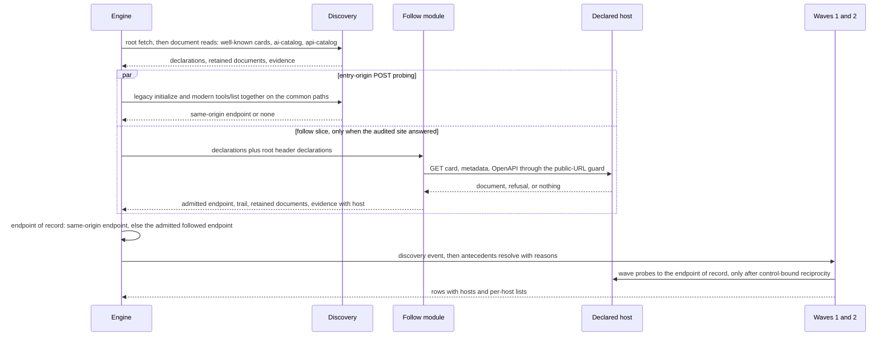
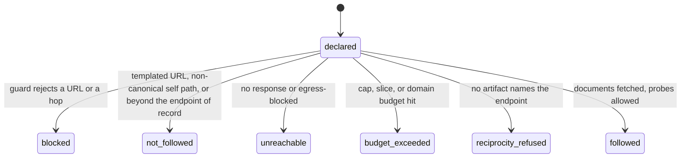
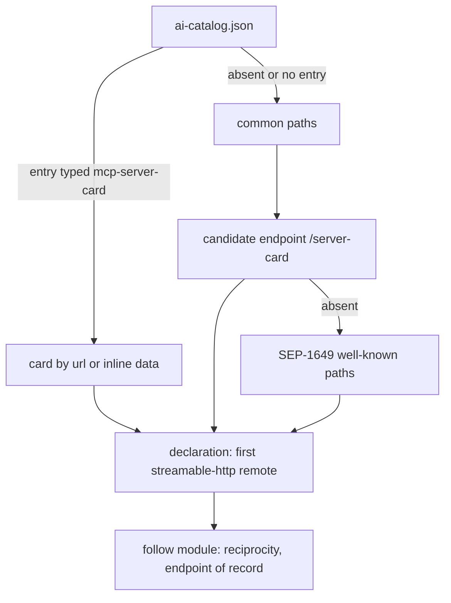

# Declared-Host Evaluation, SEP-2127 Cards, and Spec-Drift Poll - Plan

## Goal Capsule

- **Objective:** A site whose agent surfaces live on other origins it declares (its MCP server, its API host, its
  OpenAPI description) is scored on those surfaces, and every scorecard row says which host the evidence came from. A
  site that publishes the current server-card model is recognized as such, and an OAuth-protected MCP server is scored
  as present and correctly secured rather than absent. When a specification the registry relies on moves, a maintainer
  learns within the poll cadence instead of from a mis-scored audit.
- **Means:** a control-bound, one-hop follow module beside discovery (KTD1, KTD2, KTD16), every declared document
  fetched once and scored from its retained body (KTD21), provenance carried as additive scorecard fields (KTD4),
  SEP-2127 as the discovery path and preferred card shape within the SHOULD tier (KTD8, KTD9), and a scheduled GitHub
  Actions drift poll over a pinned manifest (KTD11, KTD12).
- **Authority hierarchy:** Product Contract requirements (R-IDs) win on behavior. Key Technical Decisions (KTD-IDs) win
  on mechanism within their cited R constraints. Units carry only local deltas.
- **Execution profile:** three phases, each shippable on its own. Phase A (cross-origin evaluation) is U10, U14, U1,
  U13, U2, U3, U4, U5, U6, U7, U12 in that order; U10 (the drift manifest and compare script) opens the phase so its
  inputs exist when U13 pins the vendored schema, and U14 (MCP lane sub-blocks, display-only) may release to `main` on
  its own ahead of the rest. Phase B (SEP-2127 scoring and anc.dev's own surfaces) is U8 and U9. Phase C
  (spec-drift poll) is U11. U12 lands with Phase A and is re-verified at each later release. Each unit is its own PR to
  `dev`; a phase may release to `main` before the next starts.
- **Stop conditions:** stop and report if the curated seeds cannot complete inside the audit deadline with the follow
  slice at the KTD2 values, or if the SEP-2127 PR merges with a card shape that differs from the vendored extension
  schema before U13 lands (re-cut U13 against the merged text).
- **Tail ownership:** the implementer owns build, unit, integration, and staging verification per unit, including the
  failing-first proof for each new test and the conformance corpus regeneration in every unit that changes engine output
  (KTD22). When it has the access, the implementer also owns the tail: creating the `WEB_AUDIT_FOLLOW_ENABLED`
  production secret before the release that reads it, cutting each phase's `release/*` branch and PR to `main` with its
  preflight, the Rollout section's pre- and post-deploy checks including the reflow observation, and the sibling-repo
  doc edit under Deferred to Follow-Up Work (the stability-tier solutions doc, committed with `sd-commit-doc`). Every
  merge to `dev` or `main` waits for Brett's explicit approval, and a step the implementer lacks access for goes back to
  Brett with the exact command to run.

---

## Product Contract

### Summary

Let the web audit follow the hosts a site declares and evaluate them there, attributing the evidence to the entry site's
scorecard with per-row provenance. Move MCP server-card discovery to the SEP-2127 model with SEP-1649 as a legacy shape.
Score OAuth-protected MCP servers as present. Add a scheduled poll that opens an issue when a watched specification
moves. Ship as one plan in three releasable phases.

### Problem Frame

The audit of stripe.dev on 2026-09-10 scored 70 relative and 26 global while the site publishes a server card, an RFC
9727 api-catalog with three anchors, a Link header carrying the RFC 8631 service relations, and markdown negotiation.
Three design choices in the audit produced that result, not Stripe's work. Discovery drops a server card's endpoint when
it is off the audited origin, so a card pointing at mcp.stripe.com yields no endpoint and every MCP row, including the
card check itself, resolves N/A. The API hygiene probes are same-origin, so when the catalog anchors api.stripe.com the
audit charges a blog for a missing OpenAPI, an HTML 404, and no rate-limit headers. The card parser reads
`transport.endpoint` from SEP-1649, a draft closed in January 2026, while the successor SEP-2127 replaces the envelope,
the endpoint field, and the discovery path. An OAuth-protected MCP server that answers `initialize` with a spec-correct
401 and RFC 9728 metadata reads as no server at all. No mechanism tells a maintainer when a specification the registry
encodes has moved.

### Key Decisions

- KD1. **Follow declared hosts and evaluate there, attributing evidence to the entry site's scorecard**
  (session-settled: user-directed — chosen over credit-only and over linked per-host scorecards: the fairest result for
  multi-origin organizations without a new result model). Governs R1, R8.
- KD2. **Declared documents fetch freely off-origin; MCP wire probes need control-bound reciprocity** (session-settled:
  user-directed — chosen over any-declared-host and over same-registrable-domain-only, then tightened after security
  review from "any MCP-shaped GET answer" to artifacts the target published that name the probed URL: a 405 or a
  JSON-RPC envelope is what any POST-only route emits). Governs R2, R3, R4.
- KD3. **SEP-2127 is canonical now, SEP-1649 is legacy, and canonical means preferred shape within the SHOULD tier the
  card check already holds** (session-settled: user-directed — chosen over dual-recognize-then-flip and over demoting
  the card check to MAY: the check is recommended today, both generations keep full credit, and no existing score moves;
  the legacy-alias check is kept unchanged until SEP-2127 is approved). Governs R20, R21, R22, R23.
- KD4. **An OAuth-protected MCP endpoint is present, with checks split so it passes everything observable, including
  auth enforcement** (session-settled: user-directed — chosen over absent-until-authenticated: it zeroes every
  enterprise MCP server). Governs R13, R14, R15, R16.
- KD5. **The API category resolves against api-catalog anchor hosts** (session-settled: user-directed — chosen over
  credit-only and over on-origin-only: a catalog pointing at the real API host earns the category). Governs R17, R18,
  R19.
- KD6. **The spec-drift poll is a GitHub Actions cron over a checked-in manifest that opens issues** (session-settled:
  user-approved — chosen over a Worker cron with a freshness page: no runtime coupling, PR-reviewed manifest). Governs
  R28, R29, R30, R31.
- KD7. **Engine-first, with provenance as additive fields the unified audit funnel's shared surfaces carry**
  (session-settled: user-approved — chosen over folding into the funnel plan: fairness fixes ship as engine changes, and
  the funnel's envelope, event union, transact endpoint, and progress page take the new fields without a shape change).
  Governs R8, R33.
- KD8. **Curated seeds re-score on release; other cached audits refresh lazily with a registry marker**
  (session-settled: user-approved — chosen over a full backfill and over no rescore: bounded cost, honest boards).
  Governs R32, R33, R34.
- KD9. **In scope: anc.dev's own card and catalog, provenance in every reader, a follow-declarations opt-out. Out: the
  local skill scorer** (session-settled: user-directed). Governs R25, R26, R27, R35, R36.
- KD10. **One row per check id on the entry-point record, one MCP endpoint of record, API anchors aggregated in the row
  with an additive per-host list; provider clusters deferred** (session-settled: user-directed — chosen over composite
  (check id, host) rows after sizing: two to three times the result-model work for detail a followed host's own
  scorecard already provides). Governs R9, R10, R11.
- KD11. **An opted-out audit is transient: returned inline, never cached, never listed** (session-settled: user-directed
  — chosen over a variant cache key and over overwriting the stored scorecard: one canonical score per domain, no
  downgrade path for third parties). Governs R36.
- KD12. **No robots.txt gating in this plan; a robots parser is deferred** (session-settled: user-directed — chosen over
  honoring Disallow on the anchor probe: real machinery for a marginal courtesy, and the entry origin gets no such check
  today). Governs R19.

### Requirements

**Cross-origin evaluation**

- R1. After MCP discovery, the audit follows hosts the entry site declares: the server card's remote or transport URL,
  each api-catalog anchor, the catalog's service-desc target, and RFC 9728 protected-resource metadata for a discovered
  MCP endpoint.
- R2. Declared documents are fetched by GET off-origin through the public-URL guard, one hop from the entry origin, with
  no transitive following.
- R3. An MCP wire probe to an off-origin endpoint runs only after reciprocity: a SEP-2127 card at the endpoint's
  `/server-card` location or in the endpoint host's own `/.well-known/ai-catalog.json` whose remote URL equals the
  endpoint after normalization, or RFC 9728 metadata whose `resource` equals it after the same normalization. Normalization is RFC 3986 syntax only:
  lowercase scheme and punycoded host, default port dropped, empty path and `/` treated as equal, fragment dropped; the
  scheme, host, port, path, and query must then match exactly, so a card naming one path never admits another. A 405,
  an `Allow` header, or a JSON-RPC envelope never admits an endpoint. Every reciprocity failure mode collapses into one
  outcome.
- R4. A followed host that is unreachable, refuses reciprocity, is blocked by the guard, or exceeds a budget degrades
  the rows that depend on it to not-applicable with a stated reason and never marks the entry audit incomplete.
  Exhaustion of the per-audit cap or the slice caches the entry result as today; exhaustion of the shared per-domain
  budget is not a property of the site, so that result is returned inline like an opted-out run, the prior stored
  object is kept, and when no prior object exists the result is written like any audit, so the 60-second serve window
  (`WEB_AUDIT_STALE_AFTER_MS`) applies and a request after it re-audits.
- R5. Followed-host responses do not count toward the entry site's reachability decision.
- R6. Per audit, the number of distinct off-origin hosts and the number of follow-phase document requests are capped
  (KTD2). Per declared registrable domain, an hourly budget across audits, reserved once per audit and expressed in
  audits per hour, with a burst floor, caps how often anc probes it; one reservation covers every request the audit
  sends to that domain, including wire probes and notifications (KTD2).
- R7. An operator can disable following globally without disabling audits (KTD14).

**Result model and provenance**

- R8. Every scorecard row carries the host or hosts its evidence was evaluated at, as additive fields that readers
  without the fields ignore. The declaration that led to a host lives on the trail (R11), not on the row.
- R9. A row that evaluated several hosts (API anchors) carries an additive per-host list of outcome and evidence; the
  row's own outcome aggregates them (all must pass) and scoring stays per check id.
- R10. One MCP endpoint of record per audit: the entry origin's own endpoint if one exists, else the first followed
  remote; other remotes are recorded in the trail as not-followed. Presence established through a 401 admits at most one
  endpoint of record.
- R11. The scorecard carries a top-level declared-hosts trail with one entry per declared host: the declaring surface,
  the declared URL, the final URL when a redirect changed it, and the outcome: followed, reciprocity-refused,
  not-followed, blocked, unreachable, or budget-exceeded. A budget-exceeded entry also names its cause: per-audit cap,
  slice, or domain budget. A followed MCP entry also names how it was confirmed, `admitted_by`: card, ai-catalog, or
  metadata.
- R12. New not-applicable reasons are closed values agents can branch on: follow-disabled, reciprocity-refused,
  declared-host-unreachable, declared-host-blocked, declared-host-budget-exceeded, auth-required.

**OAuth-protected MCP**

- R13. A 401 whose `WWW-Authenticate` names a `resource_metadata` URL on the endpoint's own host that resolves with a
  `resource` equal to the probed endpoint after the R3 normalization, or RFC 9728 metadata that resolves at the
  well-known locations with that `resource`, establishes MCP presence with auth required. A bare 401 or 403 stays
  refusal evidence. A host whose nonsense path also answers 401 with metadata echoing that path's URL grants no
  presence.
- R14. MCP checks that work without a session still run against a protected endpoint; checks that need a session resolve
  not-applicable with reason auth-required, never absent or broken.
- R15. New positive checks score auth enforcement: the 401 carries a well-formed `WWW-Authenticate` with
  `resource_metadata`; the metadata carries valid https `authorization_servers`; an unauthenticated `tools/list` is
  rejected. A failure is priced by KTD25: the challenge and enforcement checks fail noncompliant, and the
  authorization-server check fails broken only when no listed server is usable from the audit's vantage.
- R16. A correctly protected endpoint is never priced as broken.

**API category on anchor hosts**

- R17. The api-catalog is fetched as a declared document before the API antecedent resolves. The API hosts the category
  evaluates are the anchors that carry a `service-desc` whose target is not an MCP surface; every other anchor is
  recorded on the trail as not-followed with a stated reason. Those anchors add API hosts; the existing API signals (a
  declared `api` site type, an on-origin OpenAPI, a REST `service-desc` link, `llms.txt` or sitemap links) still hold the
  API surface on their own, and when the anchor set is empty the category evaluates at the audited origin as today.
- R18. The OpenAPI check accepts the catalog's service-desc wherever it is hosted, subject to the document size cap
  (KTD7).
- R19. The JSON-error and rate-limit probes send one GET to a nonsense path under each API anchor host (R17) and never
  to the entry site when every anchor is off-origin; each anchor's outcome is recorded per R9.

**Server-card model**

- R20. Discovery walks the SEP-2127 path first: entries of type `application/mcp-server-card+json` in
  `/.well-known/ai-catalog.json`, then `<streamable-http-url>/server-card`, then the SEP-1649 well-known paths.
- R21. The card parser accepts `remotes[].url`, `transport.url`, `transport.endpoint`, `mcp_endpoint`, and `url`.
- R22. The card check keeps its recommended tier (SHOULD, weight 3) under its new id: a SEP-2127 card and a SEP-1649
  card both earn full credit, a SEP-1649-only card carries a superseded reason and SEP-2127 remediation, and a missing
  card costs what it costs today. No check changes tier or weight in this plan.
- R23. The SEP-1649 card check id is retired in favor of `mcp-server-card`; a stored row carrying the retired id still
  renders, names its successor, and links a live skill page for as long as the object can be served. The legacy-alias
  redirect check stays as it is, with its canonical target unchanged until SEP-2127 is approved.
- R24. Remediation text teaches the SEP-2127 shape and names the SEP-1649 path only as legacy. A reciprocity-refused
  trail entry renders, once, the guidance naming what the declared host must publish to be evaluated, as the exact URLs
  anc checked: a SEP-2127 card at `<endpoint>/server-card`, an entry in `https://<host>/.well-known/ai-catalog.json`, or
  RFC 9728 metadata at `https://<host>/.well-known/oauth-protected-resource[/<path>]`, each naming the endpoint. Rows
  keep their reason phrase, and none of it enters the fix-prompt assembler.

**anc.dev's own surfaces**

- R25. anc.dev publishes a SEP-2127 card at `/mcp/server-card` and an `/.well-known/ai-catalog.json` entry pointing at
  it, and continues to serve the SEP-1649 path with the fields the MCP smoke reads.
- R26. The card's `$schema` is the SEP-2127 v1 URL, and the origin-rewrite path covers `remotes[].url` and the catalog
  entry URL so staging serves staging URLs.
- R27. anc.dev's own audit passes the new card and catalog checks in production and on staging.

**Spec-drift poll**

- R28. A checked-in manifest lists each watched source with its stability tier, source type, pinned value, and
  canonicalization rule, and lives outside the registry's build inputs.
- R29. A scheduled workflow compares each source's live value against the manifest and opens or updates exactly one
  labeled issue per drifted source.
- R30. The workflow pins every action to a commit SHA, grants `issues: write` only in the job that writes, and
  serializes runs.
- R31. A deliberate manifest change proves the issue path end to end: a forced-drift run opens one issue and a second
  run updates it.

**Release and cache**

- R32. Registry changes and follow-policy changes alter the registry fingerprint so the post-deploy rescore reflows the
  curated seeds; the follow kill-switch state is recorded separately and also forces a reflow on its next trigger.
- R33. Every reader treats a missing provenance, trail, follow-state, or marker field as not evaluated, never as
  evaluated-and-empty or as following-on, so scorecards cached before this work render truthfully until they refresh.
- R34. A scorecard page, its markdown twin, and the board metadata carry the registry fingerprint prefix the score was
  computed under.

**Controls**

- R35. A follow-declarations flag, default on, exists on the MCP tool, the transact endpoint body, the web form, and the
  local runner, and the WebMCP page state reports the form's choice; the effective value after the kill switch is stored
  in the scorecard and on the run record.
- R36. An opted-out run bypasses the serve-cached path, never joins or hosts a shared in-flight run, streams and returns
  its result with no result URLs, rejects a public-listing change, writes nothing to storage, rebuilds no aggregate, and
  never appears on a board. Telemetry still records the run with its effective flag.
- R37. The MCP tool description and the server instructions disclose that a default-on audit probes third-party hosts a
  site declares, distinguishing MCP endpoints (wire-probed only after an artifact on the endpoint's own host names them) from API
  anchor hosts (document fetches and one nonsense-path GET on the entry site's declaration alone), name the caps, and
  state that following lengthens wall time.

**Operability**

- R38. The audit run record carries the follow phase's outcome counts, request count, and elapsed time, and the
  per-domain budget is inspectable by key prefix.

### Success Criteria

- A fresh audit of stripe.dev shows the MCP category evaluated at mcp.stripe.com with auth-required reasons where a
  session is needed and passes on the auth-enforcement checks, the API category evaluated at api.stripe.com, and the
  card check passing with the SEP-1649 card marked superseded.
- anc.dev's own production scorecard keeps its score of 100 and passes the SEP-2127 card and ai-catalog checks.
- No probe in the follow phase reaches a private, loopback, link-local, or metadata destination, and no wire probe
  reaches a host that did not publish an artifact naming it, proven by the SSRF suite extended with the KTD16 collapse
  cases.
- A forced manifest change opens one issue with the diff and a second run updates it instead of opening another.

### Scope Boundaries

- The local `~/.claude` web-audit skill scorer keeps its own registry; parity is a separate task (KD9).
- Followed hosts never get their own scorecard page or board entry from an audit of another site.
- Following stops at one hop; a followed host's own declarations are not followed.
- Wire probes reach an off-origin MCP endpoint only when its host publishes a SEP-2127 card or RFC 9728 metadata naming
  it; an open server that publishes neither is recorded reciprocity-refused with remediation (R24), not evaluated.
- Robots.txt is not consulted for any probe in this plan (KD12).
- The unified audit funnel's routes, envelope shape, and event union stay as that plan built them; this plan adds
  optional fields to them and no funnel route (KD7).

#### Surfaces on the unified audit funnel

The funnel's shared surfaces carry this plan's fields, and the units edit them in place:

- Streamed discovery event: the engine yields `discovery` after the follow slice, carrying the endpoint of record, so
  the progress page's first line names the endpoint the MCP rows are scored at; the event shape is unchanged and
  discovery evidence stays entry-origin (U2).
- Streamed check event: the `check` variant of the shared event union in `src/shared/audit-events.ts` gains optional
  `host` and `na_reason`, and the web core's `checkEvent` mapping copies both from the engine result instead of dropping
  the reason (U6). Only the web lane emits check events.
- Rows and scorecard: rows gain `hosts[]` and `host` (KTD4); the scorecard gains `declared_hosts[]`,
  `follow_declarations`, and `registry_fingerprint`. The shared envelope carries them inside `scorecard` with no
  envelope change (U1).
- Freshness: the fingerprint prefix renders in the markdown twin's freshness line from `summary-freshness.ts`; the HTML
  page keeps its freshness sentence unchanged and shows the prefix as a muted caption line at the end of "Checks by
  category"; the envelope's `freshness` object stays lane-neutral, and JSON readers read the value from the scorecard
  (U12).
- Transient results: an opted-out run ends in an envelope with null result URLs, the `NO_URLS` shape the CLI lane
  returns for a binary that shadows a curated slug, and the progress page's null-URL branch renders it in place (KTD23,
  U5).
- Single-flight: an opted-out request neither reads the in-flight flags nor claims an `AuditJob`, so it never joins a
  followed run and no followed request joins it (KTD23, U5).
- The funnel's cross-surface fixtures pin `WEB_SCHEMA_VERSION` 0.5 from U1 on.

#### Deferred to Follow-Up Work

- A robots parser honoring `Disallow` for the audit user agent on the anchor nonsense-path probe, applied to the entry
  origin as well.
- A related-audits link between entry-point scorecards for provider clusters (KD10).
- A standalone `list_declared_hosts` read tool for agents that want to preview third-party probing before spending
  budget.
- Raising the MCP-lane audit deadline if the incomplete rate exceeds the Rollout baseline.
- Once SEP-2127 is approved, driven by the drift issue the poll opens: making it the only canonical card generation,
  re-pointing the legacy-alias check's canonical target to the SEP-2127 location, and dropping SEP-1649 parsing.
- A repo test that scans every workflow's `uses:` lines for full SHAs, generalized from the U11 scanner.
- Sibling-repo edits: the stability-tier solutions doc naming SEP-1649 as the MCP card.
- The Rust web-audit port in `agentnative-cli` reproducing each regenerated conformance golden (KTD22).

### Acceptance Examples

- AE1. Stripe-shaped site
  - **Covers:** R1, R3, R8, R10, R13, R17, R19
  - **Given:** an entry site whose card names an off-origin MCP URL that answers `initialize` with 401 and metadata
    whose `resource` equals that URL, and whose api-catalog anchors an off-origin API host with a `service-desc` that
    returns JSON errors and no rate-limit headers, plus a second anchor carrying no `service-desc`
  - **When:** the site is audited with following on
  - **Then:** MCP rows carry the MCP host as provenance, session-required rows read auth-required, the auth-enforcement
    checks pass, the JSON-error check passes at the API anchor host, the rate-limit check is missing there, the second
    anchor is recorded not-followed and never probed, and no probe hit a nonsense path on the entry site
- AE2. Opted out
  - **Covers:** R35, R36, R12
  - **Given:** the same site, with a cached followed scorecard less than a minute old
  - **When:** audited with following off
  - **Then:** the cached scorecard is not served, MCP and API hygiene rows read follow-disabled, the result streams with
    no result URLs and renders in place, no in-flight flag or audit job is claimed, no Cloudflare R2 object or aggregate
    is written, and the board is unchanged
- AE3. Reciprocity refused
  - **Covers:** R3, R4, R11
  - **Given:** a card naming an off-origin URL that answers GET with 405 and `Allow: POST` but publishes no card and no
    metadata
  - **When:** audited
  - **Then:** no POST reaches that URL, the trail records reciprocity-refused, MCP rows read reciprocity-refused, and
    the entry result caches
- AE4. Budget exhausted
  - **Covers:** R4, R6
  - **Given:** a declared host that accepts connections but never answers
  - **When:** audited with an injected clock
  - **Then:** the follow slice ends at its budget, dependent rows read declared-host-budget-exceeded with the slice
    cause on the trail, and the entry result is complete and cached; the same site whose declared domain is at its
    shared hourly budget gets the domain-budget cause, a result returned inline, and no cache write
- AE5. Old scorecard
  - **Covers:** R33, R34
  - **Given:** a cached scorecard written before this work
  - **When:** its page, markdown twin, board row, and MCP read are served
  - **Then:** every surface renders with no host shown, the follow state shown as not evaluated, no trail, and the
    registry marker shown as unknown
- AE6. Card generations
  - **Covers:** R20, R21, R22
  - **Given:** one site with only a SEP-1649 card at the well-known path, and another with an ai-catalog entry pointing
    at a SEP-2127 card
  - **When:** both are audited
  - **Then:** both earn full SHOULD credit, the first carries a superseded reason and SEP-2127 remediation, and neither
    site's score differs from what the card check gives it today
- AE7. Redirected endpoint
  - **Covers:** R3, R11, KTD15
  - **Given:** a card naming an endpoint that answers the reciprocity GET with a redirect to another public host, which
    publishes a card naming itself
  - **When:** audited
  - **Then:** the trail records both URLs, the final host is the endpoint of record and counts toward the host cap, and
    no wire probe is sent to the declared URL

### Sources

- Audit evidence: the vault note `projects/brettdavies-agentnative/2026-09-10-stripe-surface-audits.md` and the hosted
  scorecards at `https://anc.dev/score/stripe.dev` and `https://anc.dev/score/docs.stripe.com`.
- SEP-2127 PR and branch text: `https://github.com/modelcontextprotocol/modelcontextprotocol/pull/2127`; extension repo
  with `schema.json`, `schema.ts`, `docs/discovery.md`, and examples:
  `https://github.com/modelcontextprotocol/experimental-ext-server-card`. Status at planning: PR open, extension labeled
  experimental, `$schema` URL 404.
- SEP-1649 issue (closed, moved to 2127): `https://github.com/modelcontextprotocol/modelcontextprotocol/issues/1649`.
- AI Catalog specification: `https://github.com/Agent-Card/ai-catalog/blob/main/specification/ai-catalog.md`.
- MCP authorization, revision 2026-07-28: `https://modelcontextprotocol.io/specification/2026-07-28/basic/authorization`
  and its authorization-server-discovery page; RFC 9728 §7.7 for the private-range guidance when fetching declared
  metadata.
- Observed on 2026-09-10: stripe.dev's card declares `transport.url` `https://mcp.stripe.com/`, and
  `https://mcp.stripe.com/.well-known/oauth-protected-resource` returns `resource` `https://mcp.stripe.com` with no
  trailing slash; `/server-card` and `/.well-known/ai-catalog.json` on that host both 404, so the metadata comparison
  is the flagship case's only admission route.
- RFC 9727, RFC 9264, RFC 8631: multi-anchor linksets and cross-origin `service-desc` targets.
- Repo learnings: `docs/solutions/architecture-patterns/agent-readiness-audit-surface-2026-07-01.md`,
  `docs/solutions/design-patterns/web-audit-fairness-scoring-model.md`,
  `docs/solutions/integration-issues/cdn-tarpit-ua-less-probes-web-audit-deadline-exhaustion.md`,
  `docs/solutions/integration-issues/web-audit-display-only-registry-change-skips-board-reflow.md`,
  `docs/solutions/design-patterns/carry-forward-stored-stateful-flags-through-a-rebuild-write-path.md`,
  `docs/solutions/design-patterns/denormalized-gating-flag-write-always-emit-read-coerce-missing-to-closed.md`,
  `docs/solutions/design-patterns/fail-closed-proof-of-control-gates-a-caller-claimed-security-binding.md`,
  `docs/solutions/integration-issues/origin-rewrite-consistency-across-worker-discovery-surfaces.md`,
  `docs/solutions/integration-issues/nondeterministic-upstream-scope-serialization-defeats-byte-drift-gate.md`,
  `docs/solutions/conventions/verify-the-real-implementation-when-a-di-seam-sits-above-the-risk.md`,
  `docs/solutions/conventions/registry-walk-coverage-tests-prevent-silent-omission.md`,
  `docs/solutions/developer-experience/cloudflare-workers-same-account-fetch-reachability-dev-vs-prod-2026-07-20.md`.
- Related plans: `docs/plans/2026-09-09-1123-feat-unified-audit-funnel-plan.md` (the envelope, event union, transact
  endpoint, and progress page this plan's inputs and readers extend),
  `docs/plans/2026-08-26-001-feat-mcp-baseline-adoption-plan.md` (the `na_reason` schema bump precedent),
  `docs/plans/2026-08-07-001-feat-web-public-listing-opt-in-plan.md` (additive-field precedent).

---

## Planning Contract

### Key Technical Decisions

- KTD1. **Following is a sibling module of discovery, and discovery stays entry-origin.** Discovery keeps its contract
  (MCP on the entry origin, own budget, concurrent passes) and returns the same-origin endpoint plus the declarations it
  found without probing them. A new follow module consumes those declarations and the root header declarations, owns
  every off-origin request, the caps, the reciprocity gate, and the document fetches, and returns the endpoint of
  record, the trail, retained documents, and evidence. Discovery splits into its entry-origin document reads (cards,
  ai-catalog, api-catalog) and its POST probing, which sends the legacy `initialize` and modern `tools/list` POSTs to
  the common paths together under one timeout, legacy evidence taking precedence when both answer. After the document
  reads, the engine runs the POST probing and the follow slice concurrently, starting follow only when the root or a
  document read got an answer from the audited site, and composes once both finish: the endpoint is discovery's, else
  follow's. Evidence stays in fixed order whatever finishes first. Wire probes reach an off-origin endpoint only through
  that composition, which is the gate KD2 requires. Instantiates KD2 (R1, R3).
- KTD2. **The follow slice is bounded and every cap names what it protects.** The slice runs after discovery's document
  reads, concurrently with its POST probing (KTD1), and before wave 1 under a wall-clock budget of the smaller of 6 seconds and the remaining deadline, concurrent across declared
  hosts. Per audit: at most 4 distinct off-origin hosts and 12 follow-phase document requests, which bound fan-out and
  the auditor's deadline. A declared host whose hostname is an IP literal is refused before the slice and recorded on
  the trail as blocked. Per declared registrable domain (the registrable domain from `tldts` with private suffixes
  enabled, lowercased, trailing dot stripped, punycoded): an hourly budget across all audits, expressed in audits per
  hour and reserved once per audit and domain in the follow slice, before the first request to that domain: one unit
  per domain, consumed in one KV read and put through the limiter's existing hourly-bucket helper
  (`consumeHourlyBucketBudget`), with per-domain request counts going to the run record only (R38); when the
  reservation fails every dependent
  row resolves budget-exceeded with the domain-budget cause before wave 1, so no handler ever consults the budget. A
  rate-limit binding keyed by the same domain is the 60-second burst floor on that same reservation call, because KV
  alone is get-then-put on an eventually consistent store. The budget is injected into the engine as a port so the
  transact core, the MCP tool, and the rescore Workflow all supply it, and tests, the local runner, and the conformance
  runner supply memory. Exhaustion of any cap resolves dependent rows to not-applicable with the matching R12 reason and
  never sets the incomplete flag. Values are the implementer's to tune against the curated seeds within the stop
  condition. Instantiates R4, R6.
- KTD3. **Every evidence item carries a `host` field, and follow evidence lives in its own structure.** Discovery
  evidence stays entry-origin, so the reachability predicate is untouched and R5 holds by construction. The host field
  exists for provenance derivation (KTD4). Instantiates R5, R8.
- KTD4. **Provenance rides as additive fields derived from evidence; new reasons bump the schema version.** Each stored
  row gains `hosts[]` derived from the distinct evidence hosts in declaration order (per-entry status only on
  multi-target rows) and `host` as a convenience when exactly one host was evaluated; a row missing both reads as the
  entry host. The scorecard gains `declared_hosts[]` (R11), `follow_declarations`, and `registry_fingerprint`. Fields
  are additive with no bump, following the `public_listing` precedent. The six new `na_reason` values bump
  `WEB_SCHEMA_VERSION` from 0.4 to 0.5, following the 0.2 to 0.3 precedent. Readers: a missing `follow_declarations`
  reads as not evaluated and is never rendered as on; a missing trail reads as no trail, with copy distinct from an
  empty trail; a missing fingerprint reads as unknown. The Cloudflare R2 object key keeps the spec version; adding the
  schema version would orphan every cached object at once. Instantiates R8, R9, R11, R12, R33.
- KTD5. **Auth presence is decided by resolvable RFC 9728 metadata on the endpoint's host, and the auth-aware arm
  precedes every other arm.** The follow module captures `WWW-Authenticate` once and resolves the metadata URL in
  order: header value, then the path-suffixed well-known, then the root well-known. The URL must be https, pass the
  public-URL guard, and share the endpoint's host, since a third host would be transitive following; the fetch carries
  the 64 KiB cap and the follow budget. Presence requires `resource` equal to the probed endpoint after the R3
  normalization. A differential control closes echoing gateways: if the host's nonsense path also answers 401 with
  metadata whose `resource` echoes that path, the 401 is a gateway property and grants nothing. The
  `authorization_servers` values are never fetched; they are validated as https URLs, capped in count and length, and
  stored as opaque strings that every renderer escapes. In `runMcp`, immediately after the transport-error and
  rate-limit checks and before the discriminating, negotiation, and no-JSON-RPC arms, a 401 on an endpoint whose
  auth-required presence was established resolves not-applicable with reason auth-required, so `server/discover`
  answering 401 leaves the modern lane unknown; 401 is never added to the typed-refusal status set, which the
  conformance rows' accept probe shares. The follow module exports the resolver; U3 consumes it, including from
  discovery: a common-path 401 on the audited site's own host whose metadata resolves with a matching `resource` (echo
  differential included) is a found endpoint with auth required, and a card-declared same-origin endpoint of record gets
  the same resolution, so presence with auth required holds on either origin. Entry-origin metadata GETs draw no domain
  budget. Instantiates KD4 (R13, R14, R16).
- KTD6. **The MCP check split adds a session antecedent and an auth-required antecedent.** `mcp-present` holds
  when an endpoint of record exists, including auth-required. A new `mcp-session` antecedent holds when the endpoint
  answered a wire probe without auth; session-required checks declare it and resolve N/A auth-required when it fails.
  A new `mcp-auth-required` antecedent holds only when the endpoint of record answered a wire probe with a 401 whose
  metadata resolved with a matching `resource` (KTD5); it gates the three auth-enforcement checks, so an open server,
  including one whose card documents that no auth is required, gets N/A rather than absent. The existing `mcp-auth`
  antecedent (a 401 challenge or a card declaring auth) keeps gating `oauth-protected-resource` unchanged; metadata
  content is the scored fact, not the gate. Antecedent registration has four homes: the token union, the build
  allowlist, the resolver index, and the per-group evidence map. Instantiates R14, R15.
- KTD7. **The API category anchors on the retained api-catalog document.** The api-catalog is fetched as a declared
  document during discovery (KTD21), so its anchors exist before the follow slice and before wave 1. The shared
  linkset-anchor helper yields only anchors that carry a `service-desc` whose href is not an MCP surface, mirroring the
  existing MCP-target exclusion in the api antecedent; a non-empty filtered set holds the api-surface antecedent and
  adds API hosts, the existing signals still hold it on their own, an empty set leaves `openapi` and the hygiene probes
  on the audited origin as today, and other anchors are recorded on the trail as not-followed. `openapi` follows those `service-desc` hrefs
  off-origin under a 512 KiB cap and accepts YAML for presence while deriving probe URLs from JSON only. Hygiene probes
  target each API anchor host, one GET each, and never fall back to the entry site when every anchor is off-origin.
  Instantiates KD5 (R17, R18, R19).
- KTD8. **Discovery order under SEP-2127.** Read `/.well-known/ai-catalog.json` and take at most its first four entries
  typed `application/mcp-server-card+json`; for each, read its inline `data`, or fetch its `url` during discovery only
  when that URL is same-origin with the entry site; an off-origin `url` is recorded as a card-document declaration that
  the follow module fetches under the document-request cap, the domain budget, the kill switch, and the follow flag
  before its first `streamable-http` remote is taken. Take the first remote of type `streamable-http` as a declaration
  (R10 chooses the endpoint of record); else probe `<candidate-endpoint>/server-card` for endpoints found on the common
  paths; else the SEP-1649 well-known paths. The discovery config gains `ai_catalog` and `card_suffix` keys validated at
  build, and every test fixture that carries the config gains them. Templated remote URLs are recorded not-followed.
  Instantiates KD3 (R20, R21).
- KTD9. **Card scoring within SHOULD, from the retained card.** One `mcp-server-card` check replaces
  `well-known-mcp-card` at the same recommended tier and weight 3: it scores the card document retained by discovery
  (KTD21) with no request of its own; pass for a SEP-2127 card whose required fields validate against the top-level and
  `remotes[]` required-field names and types that the registry build step reads from the vendored extension
  `schema.json` into the built registry, and pass with reason superseded for a SEP-1649-shaped card. No hand-written copy
  of the schema exists. A JSON Schema validator is a devDependency used only in tests, for U9's full validation of
  anc.dev's own card, never in the Worker runtime. `well-known-mcp-card` moves to a `retired` map in the registry
  (id, successor, reason); the display layer renders a stored row with a retired id with its stored status chip, the
  caption "Retired check, replaced by <successor>. Re-audit to score it.", the successor's skill link, the successor's
  lane, no remediation, and no entry in the fix-prompt assembler or WebMCP worksheet prompts (markdown adds a "- Note:"
  line); the skill build emits pages for retired ids; the remediation validator accepts entries
  for retired ids. `mcp-card-legacy-aliases` and its eval rule stay unchanged. Instantiates KD3 (R22, R23).
- KTD10. **anc.dev emits its own SEP-2127 card and catalog at build.** The discovery-emit build step writes
  `/mcp/server-card` and `/.well-known/ai-catalog.json`; the Worker routes `/mcp/server-card` explicitly (the MCP branch
  matches `/mcp` exactly today) with the card media type; the descriptor rewrite gains `remotes[].url` and the catalog
  entry URL; the SEP-1649 path keeps serving the legacy shape with `protocolVersion` and `mcp_endpoint`, which the MCP
  smoke reads; `$schema` is the SEP-2127 v1 URL even though it 404s until graduation, because the poll watches that URL
  and validation runs against the vendored schema. Instantiates R25, R26.
- KTD11. **The drift manifest lives at `src/data/standards/watch.yaml`, outside registry build inputs; the vendored
  extension schema lives with the registry.** Each manifest entry carries id, tier, source type (`github-pr`,
  `github-file`, `url-status`, `ietf-draft`, `json-field`), the pinned value, and the canonicalization rule; the compare
  script canonicalizes both sides before hashing so serializer jitter cannot trip it. The vendored `schema.json`
  snapshot is a check input and lives under `src/data/web-audit/`, refreshed by a sync script listed in the syncs index.
  Instantiates R28.
- KTD12. **The workflow mirrors `mcp-sweep.yml` and `deep-check.yml`.** Off-hour cron plus `workflow_dispatch`,
  `permissions: contents: read` at the workflow level with `issues: write` on the writing job only, a concurrency group,
  SHA-pinned `uses:` with version comments, the Node 24 env the sibling workflows set, no `continue-on-error`, and an
  issue upsert that lists open issues by the `spec-drift` label and a marker-owned title rather than searching.
  Scheduled and dispatched runs resolve from `main`, so the R31 proof runs after the workflow ships, with `--ref`
  pointing at a forced-drift branch. Instantiates KD6 (R29, R30, R31).
- KTD13. **The registry fingerprint hashes the registry plus a follow-policy version constant; the switch is recorded
  beside it.** The fingerprint helper moves to the registry module with its exclusion of site-only registry fields
  intact, so the transact core, the MCP tool, and the rescore Workflow stamp the same value. The write paths stamp it
  after the engine returns and the engine never does, so conformance goldens carry no fingerprint and the CLI port needs
  no registry hash. The rescore gate compares the fingerprint and a separately recorded normalized switch boolean,
  forcing a reflow on its next trigger when either moves; hashing the live secret would make staging and production
  disagree and mint a reflow for `TRUE` versus `true`. The stored prefix is the first 12 characters, written into the
  scorecard and read from it by the single board-metadata writer, so listing patches and the backfill carry it forward.
  Instantiates R32, R34.
- KTD14. **`WEB_AUDIT_FOLLOW_ENABLED` is a surgical kill switch** with the same shape as `WEB_AUDIT_ENABLED`: a `vars`
  binding on staging, a secret in production created before the code that reads it ships, absent reads as off, bound in
  the Worker env and the rescore Workflow env, and stored as the effective follow state. Instantiates R7, R35.
- KTD15. **Redirect accounting.** Reciprocity artifact fetches (the endpoint's server card, the target's ai-catalog, the
  RFC 9728 metadata) and every wire probe to a followed endpoint run with redirects disabled; a 3xx collapses to
  reciprocity-refused or refusal. Follow-phase document GETs also run with redirects disabled: on a 3xx the follow
  module validates the `Location` through the guard, charges the hop host against the distinct-host cap and the domain
  reservation, refuses with budget-exceeded or blocked when either fails, and only then issues the single further GET,
  again with redirects disabled. The final URL is pinned as the endpoint of record, reciprocity is attributed to the
  final host, and the declared URL is never re-traversed. The handler context carries a followed flag set by the engine
  so the MCP, CORS-preflight, HTTP, and notification handlers pass no-redirect for a followed endpoint. Requests to an
  endpoint on the audited origin follow same-origin hops only and never replay a method or body across origins: a
  common path whose POST answers a cross-origin 3xx becomes a declaration of the redirect target, which reaches the
  follow slice and passes reciprocity like any other declared endpoint. Instantiates R3, R11.
- KTD16. **Reciprocity is control-bound** (session-settled: user-directed — chosen over keeping 405-with-Allow and
  JSON-RPC-envelope signals: security review showed those admit any POST-only route and any public RPC gateway). An
  endpoint is admitted only by a SEP-2127 card at `<endpoint>/server-card` or in the endpoint host's own
  `/.well-known/ai-catalog.json` (never the audited site's catalog) whose `remotes[].url` equals the endpoint after the
  R3 normalization, or by RFC 9728 metadata whose `resource` equals it after the same normalization (KTD5); an
  origin-only comparison is never used, so one artifact naming `/mcp` admits no other path, scheme, or port on that
  host. Metadata admission passes KTD5's echo differential too: when the endpoint's path is not root, one GET to
  `/.well-known/oauth-protected-resource/<nonsense>` on that host, counted toward the document cap, and a `resource`
  echoing the nonsense path admits nothing; a root-path endpoint skips that GET. A catalog entry counts only when its
  card is inline `data` or its `url` shares the endpoint's host and passes the public-URL guard; an entry whose `url`
  sits on another host collapses to reciprocity-refused with no request to that host. DNS failure, a missing or
  unparseable card, a card naming another URL, mismatched or timed-out metadata, and any GET body all collapse to
  reciprocity-refused with a byte-identical trail entry apart from the host, and zero POST or OPTIONS requests to the
  host. Instantiates KD2 (R3).
- KTD17. **Auditor self-targeting.** A declaration naming the auditor's own zone is admitted only for the canonical
  `/mcp` endpoint; any other self path is refused before reciprocity. The domain budget applies to the auditor like any
  host. Every `workers.dev` host takes the ordinary follow path; one that is edge-blocked (a same-account Worker, for
  example) lands as unreachable or reciprocity-refused under R4 and KTD16, never broken. A staging fetch of a known
  third-party Workers MCP endpoint, recorded in the U7 PR, confirms the ordinary path reaches `workers.dev`.
- KTD18. **Test posture.** A shared `stubFetch` helper replaces the per-suite copies before the new suites land;
  multi-host coverage keys routers by full URL; write-path tests drive the real `auditDomainToCache` with fake fetch and
  R2 rather than the DI seam above it; every new test is observed failing before its unit lands; stripe.dev runs as a
  live smoke through the local runner and is not CI-gated.
- KTD19. **Logging.** The run record gains follow outcome counts, the follow request count, and the follow elapsed time,
  read from the trail on the complete event, through the telemetry emitter; the domain budget key prefix is documented
  so hot hosts are listable. No new log scope. Instantiates R38.
- KTD20. **Antecedent resolutions carry a reason.** The resolver result widens from a bare token to a token plus
  optional reason, and the gate stamps that reason instead of always stamping antecedent-unmet. All six R12 reasons are
  decided before a handler runs, so this one signature change is the mechanism for follow-disabled, reciprocity-refused,
  declared-host-unreachable, declared-host-blocked, declared-host-budget-exceeded, and auth-required. Instantiates R12.
- KTD21. **Every declared document is fetched once and scored from its retained body.** Discovery and the follow module
  retain the server card, the ai-catalog, the api-catalog, the OpenAPI description, and the RFC 9728 metadata under
  stable keys, with location and shape recorded in evidence. Every document GET carries a cap: 64 KiB for metadata,
  512 KiB for OpenAPI, and 256 KiB for every other document (server cards, the ai-catalog, the api-catalog, off-origin
  card documents, `<endpoint>/server-card`); `guardedFetch` sets `truncated: true` on `ProbeResponse` when a body stops
  at its cap, and a truncated JSON document is recorded truncated and parses as unparseable. A new `retained-document`
  eval rule lets a check score a
  retained body in wave 2 with no request. `api-catalog` and `mcp-server-card` use it; `openapi` uses it for an
  off-origin description. This removes the double fetch of the card and the wave-1 dependency that would otherwise sit
  between the follow slice and the API category. Instantiates R17, R20, R22.
- KTD22. **Every unit that changes engine output regenerates the conformance corpus in the same PR.**
  `tests/web-audit-conformance-corpus.test.ts` pins the engine for the CLI's Rust port on every PR: the committed corpus
  under `tests/fixtures/web-audit-conformance/` must equal a fresh `bun scripts/web-audit/gen-fixtures.ts` run byte for
  byte, two generations must be identical, every registry check id must be some scenario's subject, and no registry
  pattern may use lookaround or a backreference. U1, U13, U2, U3, U4, and U8 each regenerate it and add scenarios for
  what they introduce. Scenarios reach declared hosts through ordinary exchanges, since matching is by full URL. The
  conformance runner is an engine caller: it reads an optional `follow_declarations` input from `scenario.json` (default
  true, documented in the corpus README) and supplies an always-admit memory budget, so no budget state reaches a
  golden. New ordered output (the trail, `hosts[]`) follows declaration order, never completion order, because the
  two-generation gate and the port both need determinism. The generator also writes a committed
  `tests/fixtures/web-audit-conformance/scores.json` index (scenario id to `score.relative`, `score.global`,
  `score_pct`, and each row's id, status, and `na_reason`) under the same byte-equality gate. Each engine-changing unit's
  PR names every scenario whose index entry changed and why; an entry outside that unit's intentional changes blocks the
  PR. The intentional changes are: U1, U13, and U7 none (schema version and additive fields sit outside the index); U2
  MCP rows on scenarios with off-origin declarations; U3 rows on protected endpoints; U4 API rows on scenarios with
  catalog anchors; U8 the `well-known-mcp-card` entry replaced by `mcp-server-card` with the same status.
- KTD23. **An opted-out run stays outside single-flight and returns through the null-URL path.** For a request with
  `follow_declarations: false`, the transact endpoint skips the in-flight read, the `AuditJob` claim, and the flag
  marks, extending the explicit-listing no-attach rule so neither an opted-out nor a followed request receives the
  other's run, and the job log holds nothing for it. The serve tier and the disabled-with-cache stale serve both step
  aside: an opted-out request is never answered from a stored followed scorecard, and with audits disabled it receives
  the disabled error. The web envelope builder gains a transient variant with null result URLs and a transient `summary_html`
  (unlinked spine, no Re-audit control, no closing re-audit note, one reason line in place of the freshness sentence;
  the CLI collision summary is the precedent), so the progress page's existing null-URL branch renders the result in
  place. The MCP tool
  applies the same rules on its inline path: no in-flight wait, no fresh-window serve, no stale serve. A followed
  `audit_website` fresh run claims the `AuditJob` and marks the in-flight flags as `handleWeb` does, keeping the
  explicit-listing no-attach rule, so MCP-initiated runs are single-flight hosts as well as consumers. Instantiates KD11
  (R36).
- KTD24. **The global universe counts design alternatives once.** `score.global` divides earned points by the most a
  single site could earn at full access: every registry check, except that checks forming alternatives (site designs
  that cannot both be satisfied at full access; an access limit never forms or joins a group, KTD25) count only the
  alternatives the site presents, or the largest alternative when it presents none. MCP access is the one group:
  `protected` (the `mcp-auth-required` checks) and `open` (no checks of its own, presented when a handshake answered
  without sign-in). The session checks count for every site, so an open server's universe is 155, a protected or hybrid
  server's 158, and a site without MCP 158, since the maximal site requires sign-in. On a public audit a protected
  server's session and handshake rows read auth-required and stay in its denominator like every access-limited row, so
  its public global tops out near 68; a local credentialed run evaluates them and can reach 100. Presentation is read
  from stored rows alone. Global is capped at 100 and floored at 0. The groups are declared in the registry, so
  declaring or changing one moves the fingerprint; `universeMaxOf`, the dev-only `score_model.py`, and the CLI's Rust
  port of the scorer change together. Instantiates KD4 (R16) under KTD25.
- KTD25. **Access-limited checks have one scoring definition across vantages.** A score covers what an agent at the
  audit's vantage can verify: public (anc.dev: the public internet, no credentials) or local (`anc web <target>`: the
  runner's network, optionally a credential for the audited MCP endpoint). Each scorecard records it in an additive
  `vantage` field (`network` public or local, `credentialed`), written public/false by the public engine and riding the
  unreleased 0.5 schema; the public board lists public-vantage scorecards only. A row the vantage could not reach
  (sign-in without a credential, a private or unreachable host, or the audit's own follow policy) reads `n_a` with its
  reason, earns nothing, leaves relative, and stays in the global denominator: one treatment for every access limit.
  Alternatives are site designs, never access (KTD24). The outcome scale is read from the vantage: noncompliant when an
  agent there gets what it asked for despite a defect, broken when the surface leads it to a dead end. So
  `mcp-auth-challenge` and `mcp-auth-enforced` fail noncompliant, and `mcp-auth-servers` fails broken only when no
  listed sign-in server is usable from the vantage (none, not https, or a private address while the endpoint is public)
  and noncompliant when a usable one sits beside bad entries. A local credential goes only to the audited endpoint's
  handshake and session probes, never to followed hosts, metadata, sign-in servers, or the enforcement probe, and is
  never written to the scorecard. Every access-limited row is disclosed with its remedy, `anc web <target>` plus
  `--token` for sign-in (U6). A new check takes its score from its tier, its antecedent, and the access limits it can
  hit, and joins a group only as a design alternative. Instantiates R12, R14, R15, R16 (ledger R17).

### High-Level Technical Design

Audit pipeline with the follow module between discovery and wave 1:


```mermaid
sequenceDiagram
  participant E as Engine
  participant D as Discovery
  participant F as Follow module
  participant H as Declared host
  participant W as Waves 1 and 2
  E->>D: root fetch, then document reads: well-known cards, ai-catalog, api-catalog
  D-->>E: declarations, retained documents, evidence
  par entry-origin POST probing
    E->>D: legacy initialize and modern tools/list together on the common paths
    D-->>E: same-origin endpoint or none
  and follow slice, only when the audited site answered
    E->>F: declarations plus root header declarations
    F->>H: GET card, metadata, OpenAPI through the public-URL guard
    H-->>F: document, refusal, or nothing
    F-->>E: admitted endpoint, trail, retained documents, evidence with host
  end
  E->>E: endpoint of record: same-origin endpoint, else the admitted followed endpoint
  E->>W: discovery event, then antecedents resolve with reasons
  W->>H: wave probes to the endpoint of record, only after control-bound reciprocity
  W-->>E: rows with hosts and per-host lists
```

Declared-host trail states:


```mermaid
stateDiagram-v2
  [*] --> declared
  declared --> blocked: guard rejects a URL or a hop
  declared --> not_followed: templated URL, non-canonical self path, or beyond the endpoint of record
  declared --> unreachable: no response or egress-blocked
  declared --> budget_exceeded: cap, slice, or domain budget hit
  declared --> reciprocity_refused: no artifact names the endpoint
  declared --> followed: documents fetched, probes allowed
```

Card discovery order:


```mermaid
flowchart TB
  A[ai-catalog.json] -->|entry typed mcp-server-card| B[card by url or inline data]
  A -->|absent or no entry| C[common paths]
  C --> D[candidate endpoint /server-card]
  D -->|absent| E[SEP-1649 well-known paths]
  B --> F[declaration: first streamable-http remote]
  D --> F
  E --> F
  F --> G[follow module: reciprocity, endpoint of record]
```

Follow flag and kill switch:

| Request flag | Switch | Effective     | Stored and logged as | Result persistence                        |
| ------------ | ------ | ------------- | -------------------- | ----------------------------------------- |
| on or absent | on     | following     | `true`               | cached, listed per existing rules         |
| on or absent | off    | not following | `false`              | cached, listed; rows read follow-disabled |
| off          | on     | not following | `false`              | transient (R36)                           |
| off          | off    | not following | `false`              | transient (R36)                           |

Antecedents:

| Antecedent            | Holds when                                                    | Gates                                                         |
| --------------------- | ------------------------------------------------------------- | ------------------------------------------------------------- |
| `mcp-present`         | an endpoint of record exists, including auth-required         | unauthenticated-observable MCP checks, `mcp-server-card`      |
| `mcp-session`         | the endpoint answered a wire probe without auth               | tools, resources, capabilities, modern discover               |
| `mcp-auth-required`   | 401 and matching-`resource` metadata on the endpoint (KTD5)   | the three auth-enforcement checks                             |
| `mcp-auth` (existing) | a 401 challenge was observed or the card declares auth        | `oauth-protected-resource`                                    |
| `api-surface`         | the retained api-catalog has API anchors, or existing signals | `openapi`, `json-errors`, `rate-limit-headers`                |

Result page structure (design review, D5 to D15), `/score/<host>` for a multi-origin site:

```text
+--------------------------------------------------------------------------------+
| result spine: crumb | stripe.dev [Website] | tier · freshness sentence · md/json |
| big score 70 + meter | 26 global-ready                                          |
| score note: "...relative to the checks that apply to this site, including 2     |
|             hosts it declares (see Declared hosts)"                     (D12)  |
| [fix-prompt assembler panel, inserted by clipboard.js]                          |
| Declared hosts                                                    (D7, id)      |
|   one row per trail entry: surface · host/URL · outcome · why                   |
| Checks by category                                                              |
|   C4 API       3 / 4 checks pass                                   [partial]    |
|      Evaluated at api.stripe.com, anchored in stripe.dev's api-catalog   (D5)   |
|      rows ... (a row on stripe.dev gets its own host note)                      |
|   C5 MCP       6 / 6 checks pass · 18 not run                  (D13) [pass]    |
|      Evaluated at mcp.stripe.com, declared by stripe.dev's server card   (D5)   |
|      Every MCP server        4 / 4 pass                              (U14)      |
|         rows (card row: host note "stripe.dev")                                 |
|      Legacy lane · 2025-06-18   0 / 0 pass · 10 not run                         |
|         [10 checks not run: needs a signed-in session]  closed group    (D6)    |
|      Modern lane · 2026-07-28   0 / 0 pass · 7 not run                          |
|         [7 checks not run: needs a signed-in session]   closed group            |
|      In-page tools · WebMCP  ...                                               |
|   "Scored against registry 3f2a9c1b04de."  muted caption              (D14)     |
| closing note: "...public agent-facing surface and the hosts it declares..."     |
+--------------------------------------------------------------------------------+
```

Interaction states (design review, D16 to D24):

| Surface | Waiting | Empty or not evaluated | Error or refused | Success | Partial |
|---|---|---|---|---|---|
| `/scoring` website lane | "Started.", then "Reading <target> and any hosts it declares…"; expectation "Usually under 30 seconds; longer when the site declares other hosts." (D24) | n/a | existing bounce panels | first line "MCP endpoint found at <url>, declared by <target>." (D8, D15) | rows stream; host phrase only on exceptions (D15) |
| Transient result on `/scoring` | as above | n/a | opt-out: "Not saved: declared hosts were not followed for this run."; budget: "Not saved: <domain> reached anc's hourly probe limit; the saved scorecard from <date> is unchanged." + retry hour (D22) | subline "This result was not saved."; Run again keeps the opt-out (D22) | n/a |
| Declared hosts slot | n/a (server-rendered) | "not recorded for this audit" / "not followed; following is paused" / "not followed for this run" / "none declared" (D18) | "not confirmed by <host>" + the three URLs to publish (D19, D20); "no answer"; "not probed: <cause>" | "evaluated" per entry (D19) | mixed entries in declaration order |
| Check rows | n/a | "Not evaluated: <host> requires sign-in" and four sibling phrases (D16); 3+ grouped (D6) | existing broken/absent/noncompliant rows | pass; superseded card adds the advisory caption (D21) | retired row: stored chip + "Retired check, replaced by <successor>..." (D23) |
| Category line | n/a | empty category: "<reason phrase>. See Declared hosts." or today's sentence (D17) | n/a | "n / n checks pass" | "n / n checks pass · N not run" (D13) |

Site-owner journey (design review): auditing stripe.dev from `/audit`.

| Step | User does | User feels | Plan specifies |
|---|---|---|---|
| 1 | Types stripe.dev; sees "Include hosts this site declares (MCP server, API)" checked, with its help line | informed before anything is sent | D26 |
| 2 | Clicks Audit; `/scoring` reads "Started.", then "Reading stripe.dev and any hosts it declares…" | patient, not stuck | D24 |
| 3 | First line: "MCP endpoint found at https://mcp.stripe.com/, declared by stripe.dev." | oriented: knows why another host appears | D8, D15 |
| 4 | Lands on `/score/stripe.dev`; the score note says "including 2 hosts it declares (see Declared hosts)" | trusts what the number covers | D12 |
| 5 | Reads Declared hosts: two "evaluated", one "not followed: no service description" | understands the credit and the exclusion | D7, D18, D19 |
| 6 | Opens MCP: "6 / 6 checks pass · 18 not run", lane blocks, "18 checks not run: mcp.stripe.com requires sign-in" | reassured that OAuth is not a failure | U14, D6, D13, D16 |
| 7 | Sees the server-card PASS with "Superseded shape (SEP-1649)…" | knows the next improvement | D21 |
| Alt | A declared host reads "not confirmed by <host>" with the three URLs to publish | has a concrete fix, not blame | D19, D20 |
| Alt | Unticks follow: listing box disables; result renders in place, "Not saved: declared hosts were not followed for this run." | no surprise about the missing page | D22, D25 |

Time horizons: in 5 seconds the score and its "including N hosts" clause frame the result; in 5 minutes the Declared
hosts list, lane blocks, and not-run groups explain it; over years the registry caption (D14) and retired-row captions
(D23) keep old scorecards honest.

### Sequencing

Phase A runs U10, U14, U1, U13, U2, U3, U4, U5, U6, U7, U12 in that order: U10 creates the drift manifest and compare script
that U13 pins the vendored schema into and the Phase B gate runs; U1 defines fields and the reason-carrying resolver;
U13 supplies the SEP-2127 parser, discovery order, and retained documents that U2 needs for reciprocity; U2 and U3
change the engine; U4 the API category; U5 the inputs and the switch; U14 the MCP lane blocks U6 builds inside; U6 the readers; U7 the budget port and logging;
U12 the fingerprint and marker, which depends on the switch from U5. Phase B runs U8 then U9. Phase C runs U11, which
depends only on U10 and has no code dependency on Phases A and B beyond it.

### System-Wide Impact

- Rate limits stay keyed by caller IP; the per-domain budget is a new dimension, injected into the engine so the rescore
  Workflow honors it, with its own rate-limit binding for the burst floor.
- The schema bump touches the schema doc, its drift-guard test, the Python scoring parity model, and every `na_reason`
  copy site, which U1 gathers into one shared phrase table the worker renderers and the progress page both read.
- Followed-host findings publish under the entry domain's `public_listing`. An MCP endpoint is wire-probed only after
  its own host published an artifact naming it; API anchor hosts receive document fetches and one nonsense-path GET each
  on the entry site's declaration alone, bounded by the KTD2 caps, and the tool description states both.
- The Worker's descriptor rewrite gains a field; staging and production diverge if it is missed, and the deploy smoke
  must cover the new paths.
- The legacy-alias eval rule and its helpers stay; a wide rename touches the engine and the assert module.
- The three R15 checks form the protected alternative of the MCP access group (KTD24) at optional tier, weight 1: an
  open server's universe is unchanged, a protected server and a site without MCP gain 3 points under the published
  universe-growth rule, and no site's relative score moves unless it actively fails enforcement; the card check keeps
  its tier and weight under its new id, so the id replacement moves no score.
- Board metadata gains the fingerprint prefix through its single writer; the board ranks 0.4 and 0.5 objects together
  until seeds reflow and user objects refresh.
- Every engine change reaches the CLI's Rust port through the conformance corpus; a unit that changes engine output
  without regenerating it fails the PR gate (KTD22).
- The shared `check` event gains optional fields; only the web lane emits it, so the CLI lane's stream is unchanged.

### Risks & Dependencies

- SEP-2127 may merge with a changed shape before U13 lands; the stop condition covers it and the drift poll catches it
  afterwards.
- Following adds up to 12 document requests and the wave probes to one more host inside a 25 second deadline; the follow
  slice and the degrade-to-N/A rule bound the incomplete rate, and the Rollout baseline sets the stop threshold.
- A declared host can be anyone's; the distinct-host cap, the document-request cap, the per-domain hourly budget with
  its burst floor, control-bound reciprocity, redirect refusal on wire probes, and the identifying user agent bound the
  amplification a hostile entry site can cause.
- The scheduled poll runs only from `main`, so Phase C is inert until a release; R31 is proven after the workflow ships,
  against a forced-drift branch.
- Off-origin OpenAPI documents can be large; the 512 KiB cap accepts presence without full validation.
- Seeds that share a declared host drain that domain's budget when they reflow together; the reflow does not persist a
  seed whose rows carry a domain-budget-caused budget-exceeded, and the hourly ceiling bounds how many same-domain seeds
  can reflow in one hour.
- The CLI port trails the corpus: each regenerated golden is parity work in `agentnative-cli` until its Rust engine
  reproduces it, and the corpus README's scenario format changes once, when `scenario.json` gains `follow_declarations`.

### Rollout

Standing facts: a Cloudflare rollback fires no deploy hook, so a post-rollback reflow is triggered by hand through the
`POST /api/web-rescore` hook; a switch flip changes the recorded state but reflows only on the next rescore trigger;
staging can audit public third parties but cannot audit itself or reproduce production egress; 53 curated seeds include
anc.dev, docs.stripe.com, and stripe.dev (added in U12), so the reflow itself yields the self-audit and the AE1
observation on stripe.dev, which appears on the public board like every seed; docs.stripe.com declares no hosts.

Phase A:

- Pre-deploy: the four local gates green; the wrangler dry run green with the new var declared on staging only, pinned
  by the wrangler-config test; a staging audit of stripe.dev whose terminal scorecard carries a non-empty trail, MCP
  rows hosted at mcp.stripe.com, and a 12-character fingerprint; an opted-out staging audit from the `/audit` form that
  streams, renders in place on `/scoring`, runs beside a concurrent followed audit of the same site without joining it,
  is not served from cache on an immediate repeat, and leaves the board unchanged; the local runner against production
  anc.dev content scoring 100; a recorded baseline of the incomplete count and elapsed p95 from the last weekly
  rescore's run records; every seed's relative and global score from the board; a render check that the currently
  deployed build renders a 0.5 fixture without throwing, since the rollback window serves 0.5 objects to 0.4 readers.
- Deploy: record the last-good deployment id; create the production secret before the release merges (an unset secret
  reads as off, and a name shared with a var is rejected); cut the release branch, run the release preflight, merge, and
  watch the run to completion including the production-smoke job's own conclusion.
- Post-deploy: the rescore Workflow instance shows the fingerprint step, one audit step per seed, and the record step;
  the KV fingerprint equals the prefix the anc.dev twin shows; the twin scores 100; the stripe.dev read carries a
  followed mcp.stripe.com, auth-required rows, no broken MCP row, and the API category evaluated at api.stripe.com; the
  MCP sweep is green; zero audit errors across the reflow; every seed whose relative or global score moved from the
  pre-deploy baseline is attributed to a followed host, an auth-required row, an API anchor host, or a universe change
  a unit's PR names, and any other move is a stop.
- Rollback: the switch off, then a manual rescore trigger, reverts every off-origin behavior and reflows the seeds with
  following off; a code rollback plus a manual rescore reverts the rest, with the 0.5-under-0.4 window covered by the
  pre-deploy render check.
- First 24 hours: the incomplete share against the baseline, with any previously complete seed now incomplete as a stop;
  follow outcome counts on run records, with a domain-budget-caused budget-exceeded on a seed's own declared host or a
  third-party domain at its hourly cap from two audits or fewer as a stop (slice and cap exhaustion do not count); the
  stripe.dev scorecard re-checked at the end of the window; the domain budget key prefix listed for hot hosts.

Phase B:

- Pre-deploy: the compare script from U10 reports no drift on the SEP-2127 sources (PR state and extension schema hash
  against the vendored snapshot); the MCP smoke against staging still reads `protocolVersion` and
  `mcp_endpoint` from the legacy card; the staging card's remote URL and the catalog entry URL carry the staging host;
  the local runner against the built site passes the card and catalog checks.
- Deploy: no new secret; the retired ids' remediation entries and skill pages ship in this release and stay.
- Post-deploy: full reflow observed as in Phase A with a new prefix recorded; the production card, catalog, and legacy
  path each answer as specified; the anc.dev twin scores 100 with the card and catalog checks passing; no curated
  seed's card row changes credit from the id replacement, and no seed's relative or global score moves from the
  pre-deploy baseline recorded for this release; the MCP sweep is green; the deploy smoke covers the two new
  paths with the production host absent and the staging host present.
- Rollback: code rollback plus manual rescore; the card path 404s until re-release.

Phase C:

- Pre-deploy: the workflow lints; the SHA-pin scanner passes; the compare script reports no drift on the day the release
  is cut, re-pinning if a source moved since pin day.
- Deploy: the merge triggers an incremental rescore only; a full reflow means the manifest leaked into registry inputs.
- Post-deploy: a dispatched run is green with no issue opened; the R31 proof runs with `--ref` against a forced-drift
  branch, opening one issue then updating it; the first scheduled run appears with a schedule event and success.
- Rollback: disable the workflow and close stray issues.

### Documentation / Operational Notes

- `AGENTS.md` discovery-siblings, kill-switches, and spec-revision-drift-gate paragraphs, `content/mcp-skill.md`,
  `content/_audit-web.md` (the web lane of `/audit`), `content/web-scorecard-schema.md`, and
  `docs/runbooks/web-audit-operations.md` change with their units.
- `docs/runbooks/mcp-operator.md` gains the follow kill switch beside the existing four.
- A new `docs/runbooks/spec-drift-poll.md` describes the manifest fields, how to re-pin after a reviewed change, the
  forced-drift proof, and the `main`-only execution rule.
- `CONCEPTS.md` carries entries for declared host, follow phase, reciprocity, endpoint of record, the declared-hosts
  trail, the registry fingerprint, and watched source; its server-card entry moves to the SEP-2127 model in U9.
- `tests/fixtures/web-audit-conformance/README.md` documents the `follow_declarations` scenario input when U2 adds it.

---

## Implementation Units

| U-ID | Title                                                    | Key files                                                                                                                                                            | Depends on  |
| ---- | -------------------------------------------------------- | -------------------------------------------------------------------------------------------------------------------------------------------------------------------- | ----------- |
| U10  | Drift manifest and compare script                        | `src/data/standards/watch.yaml`, `scripts/standards/check-drift.ts`                                                                                                  | none        |
| U1   | Scorecard fields, reasons, resolver reasons, schema bump | `scorecard.ts`, `handlers/types.ts`, `antecedents/index.ts`, `engine.ts`, `shared/web-audit-findings.ts`, `content/web-scorecard-schema.md`, `scripts/scoring/score_model.py` | none        |
| U13  | SEP-2127 discovery order, parser, retained documents     | `discovery.ts`, `registry.ts`, `13-web-audit-registry.mjs`, `handlers/http.ts`, `assert.ts`                                                                          | U1, U10     |
| U2   | Follow module with control-bound reciprocity             | `follow.ts` (new), `discovery.ts`, `engine.ts`, `ssrf.ts`, `assert.ts`, `antecedents/context.ts`                                                                     | U1, U13     |
| U3   | Auth-aware MCP presence and check split                  | `handlers/mcp.ts`, `antecedents/mcp.ts`, `registry.yaml`, `remediation.yaml`                                                                                         | U1, U2      |
| U4   | API category on catalog anchors                          | `antecedents/api.ts`, `handlers/api-hygiene.ts`, `registry.yaml`                                                                                                     | U1, U2, U13 |
| U5   | Follow flag, opt-out mode, kill switch, disclosure       | `mcp/tools/web-audit.ts`, `audit/api.ts`, `audit-web/core.ts`, `audit-form.mjs`, `audit-stash.ts`, `scoring.ts`, `scripts/web-audit/audit.ts`, `wrangler.jsonc`, `rescore-workflow.ts` | U1, U2      |
| U14  | MCP lanes and phone row layout                           | `registry.yaml`, `13-web-audit-registry.mjs`, `registry.ts`, `summary-model.ts`, `summary-render.ts`, `summary-markdown.ts`, `site.css`                              | none        |
| U6   | Provenance in every reader                               | `summary-model.ts`, `summary-markdown.ts`, `summary-render.ts`, `display.ts`, `remediation.ts`, `core.ts`, `scoring-view.ts`, `mcp/tools/web-remediation.ts`         | U1, U14     |
| U7   | Per-domain budget port, self-target handling, logging    | `limiter.ts`, `engine.ts`, `follow.ts`, `core.ts`, `audit-log.ts`, `wrangler.jsonc`                                                                                  | U2          |
| U12  | Release: fingerprint helper, marker, reflow rules        | `registry.ts`, `rescore-workflow.ts`, `cache.ts`, `summary-freshness.ts`, `core.ts`, `mcp/tools/web-audit.ts`                                                        | U1, U5, U7  |
| U8   | Card scoring and the retired card id                     | `registry.yaml`, `remediation.yaml`, `13-web-audit-registry.mjs`, `15-web-audit-skills.mjs`, `display.ts`, `engine.ts`, `assert.ts`, `handlers/http.ts`              | U13, U6     |
| U9   | anc.dev's own card and catalog                           | `11a-discovery-emit.mjs`, `worker/index.ts`, `mcp/descriptor-paths.ts`, `AGENTS.md`, `content/mcp-skill.md`, `CONCEPTS.md`                                           | U8          |
| U11  | Drift workflow and issue upsert                          | `.github/workflows/spec-drift.yml`, `docs/runbooks/spec-drift-poll.md`                                                                                               | U10         |

### Phase A: Cross-origin evaluation

### U1. Scorecard fields, reasons, resolver reasons, schema bump

- **Goal:** Give provenance, the trail, the follow state, the registry marker, and the new reasons a place to live, let
  antecedents carry a reason, and make every reader tolerant of absent fields.
- **Requirements:** R8, R9, R11, R12, R33, R34; KTD4, KTD20.
- **Dependencies:** none.
- **Files:** `src/worker/audit-web/scorecard.ts`, `src/worker/audit-web/handlers/types.ts`,
  `src/worker/audit-web/antecedents/index.ts`, `src/worker/audit-web/engine.ts`, `src/worker/audit-web/cache.ts`,
  `src/worker/audit-web/display.ts`, `src/worker/audit-web/summary-model.ts`, `src/worker/audit-web/remediation.ts`,
  `src/shared/web-audit-findings.ts`, `content/web-scorecard-schema.md`, `scripts/scoring/score_model.py`,
  `tests/fixtures/web-audit-score-parity.json`, `scripts/web-audit/conformance-scenarios.ts`,
  `tests/fixtures/web-audit-conformance/`, `tests/helpers/stub-fetch.ts` (new, extracted),
  `tests/web-audit-scorecard-format.test.ts`, `tests/web-audit-display-enrich.test.ts`,
  `tests/web-audit-two-score.test.ts`, `tests/web-audit-remediation-assembly.test.ts`.
- **Approach:**
  0. In its own commit before any engine change, teach `scripts/web-audit/gen-fixtures.ts` to write the KTD22
     `scores.json` index and commit it at today's engine output, so every later diff of the index reads as a change.
  1. Add `hosts[]` and `host` per KTD4 to the stored row type and to the compact-row builder, deriving them from
     evidence hosts.
  2. Add `declared_hosts[]`, `follow_declarations`, and `registry_fingerprint` at the top level; add them to the
     documented top-level set the drift guard pins, and to the schema doc's example.
  3. Widen `NaReason` with the six R12 values and move the union and its phrase table into
     `src/shared/web-audit-findings.ts`, so `resultLine` and the progress page (U6) read one table; bump
     `WEB_SCHEMA_VERSION` to 0.5 with the doc's version literal. The table takes the reason and the row's host and
     reads: follow-disabled "Not evaluated: declared hosts were not followed for this audit"; reciprocity-refused "Not
     evaluated: <host> did not confirm this endpoint"; declared-host-unreachable "Not evaluated: <host> did not
     answer"; declared-host-blocked "Not evaluated: <host> is a private or IP address"; declared-host-budget-exceeded
     "Not evaluated: anc's hourly probe limit for <host> was reached";
     auth-required "Not evaluated: <host> requires sign-in". The U6 not-run group summary reuses the text after "Not
     evaluated: ".
  4. Widen the antecedent resolution to carry an optional reason and make the gate stamp it (KTD20).
  5. Apply the KTD4 coercions in the display enrichment, the summary model, and the remediation result line; the scoring
     input shape does not change, so the Python parity model gets an assertion, not a change.
  6. Extract the shared `stubFetch` helper from the existing suites (KTD18).
  7. Regenerate the conformance corpus (KTD22) so every golden carries the 0.5 literal and any new field the engine
     emits.
- **Patterns to follow:** the `public_listing` additive-field change; the `na_reason` widening in the MCP baseline
  adoption plan; the `unprobed` field's path through the five hops; the registry-walk coverage convention for closed
  unions.
- **Test scenarios:**
  - A row built with two evidence hosts yields a two-entry `hosts[]` and no `host`; a row with one host yields both; a
    row missing both reads as the entry host in enrichment.
  - A scorecard object missing every new field enriches and renders with the follow state shown as not evaluated, no
    trail, and an unknown marker; no reader throws.
  - The schema doc's version literal and documented top-level set match the code after the bump; the drift guard fails
    when one of the three new top-level fields is removed from the doc example.
  - A registry-walk test over the `NaReason` union proves every value has an entry in the shared phrase table and none
    falls through to the generic line.
  - A resolver returning a reason produces a row whose `na_reason` is that reason, and a resolver returning none still
    stamps antecedent-unmet.
  - The corpus gate passes against the regenerated goldens.
- **Verification:** the scorecard-format, display-enrich, and two-score suites pass; the schema doc shows 0.5 and the
  new fields; the parity model test asserts no scoring-input change; the corpus gate passes.

### U13. SEP-2127 discovery order, parser, retained documents

- **Goal:** Walk the SEP-2127 discovery path, parse both card generations, fetch each declared document once, and expose
  retained documents to later checks.
- **Requirements:** R17, R20, R21; KTD8, KTD21.
- **Dependencies:** U1, U10.
- **Files:** `src/worker/audit-web/discovery.ts`, `src/worker/audit-web/registry.ts`, `src/worker/audit-web/engine.ts`,
  `src/worker/audit-web/handlers/http.ts`, `src/worker/audit-web/assert.ts`, `src/worker/audit-web/ssrf.ts`,
  `tests/web-audit-ssrf.test.ts`, `src/build/13-web-audit-registry.mjs`,
  `src/data/web-audit/registry.yaml`, `src/data/web-audit/server-card.schema.json` (vendored, new),
  `scripts/sync-server-card-schema.sh` (new), `scripts/SYNCS.md`, `scripts/web-audit/conformance-scenarios.ts`,
  `tests/fixtures/web-audit-conformance/`, `tests/web-audit-discovery.test.ts`, `tests/web-audit-mcp-tools.test.ts`,
  `tests/web-audit-rescore-workflow.test.ts`, and the other inline discovery-config literals:
  `tests/web-audit-handlers.test.ts` (four), `tests/web-audit-api-hygiene.test.ts`,
  `tests/web-audit-antecedents-engine.test.ts`, `tests/web-audit-scoring.test.ts`, `tests/web-audit-llms-quality.test.ts`,
  `tests/web-audit-markdown-rewards.test.ts`, `tests/web-audit-agent-recovery.test.ts`.
- **Approach:**
  1. Add `ai_catalog` and `card_suffix` to the discovery config with build validation, and add them to every fixture
     that carries the config.
  2. Implement the KTD8 order in discovery: at most four typed catalog entries, same-origin card URLs fetched here,
     off-origin card URLs handed to the follow module as declarations and never probed from discovery; retain the
     ai-catalog, the api-catalog, and each card body under stable keys with location and shape in evidence. Split the
     document reads from the POST probing (KTD1), and send the legacy `initialize` and modern `tools/list` POSTs to the
     common paths together under one timeout, legacy evidence taking precedence when both answer.
  3. Extend the parser to the R21 field set; classify a card with `remotes[]` as SEP-2127-shaped and one with
     `transport`, `mcp_endpoint`, or `url` as SEP-1649-shaped.
  4. Add the `retained-document` eval rule to the registry vocabulary and the engine (KTD21); pass the KTD21 caps on
     every discovery document GET, and add the `truncated` flag to `ProbeResponse` in `guardedFetch`.
  5. Vendor the extension `schema.json` with a sync script and list it in the syncs index.
  6. Add the requests the new discovery order makes (the ai-catalog read and the `<endpoint>/server-card` probe) to
     every scenario that disallows unmatched requests, add scenarios for the catalog, suffix, and legacy card paths, and
     regenerate the corpus (KTD22); the new registry entries use no lookaround or backreference.
- **Execution note:** Pin the vendored schema's commit in the drift manifest (U10) so the poll flags a shape change.
- **Patterns to follow:** the discovery config validation in the registry build step; `scripts/sync-spec.sh` for the
  pinned-SHA sync convention; `retain_body` handling for retained bodies.
- **Test scenarios:**
  - An ai-catalog with one MCP entry by URL yields a declaration whose URL is the card's first streamable-http remote;
    an inline `data` entry behaves the same.
  - No catalog, an endpoint on a common path, and a card at `<endpoint>/server-card` yields a SEP-2127-shaped retained
    card.
  - Only a SEP-1649 card at the well-known path yields a SEP-1649-shaped retained card and a same-origin endpoint.
  - A card with `transport.url` (Stripe's shape) yields a declaration and the SEP-1649 classification.
  - A templated remote URL is recorded as a not-followed declaration and is never fetched.
  - An ai-catalog entry whose card `url` is off-origin yields a card-document declaration and no discovery-phase
    request; a catalog with six typed entries reads only the first four.
  - The api-catalog is retained during discovery and is absent from wave 1.
  - With hanging POSTs on every common path, discovery's POST probing ends after one timeout; when both lanes answer,
    legacy evidence wins.
  - A 2 MiB ai-catalog is read to 256 KiB, recorded truncated, and treated as unparseable; a body under its cap carries
    no `truncated` flag.
  - The registry build rejects a check declaring `retained-document` without a retained key, and rejects a discovery
    config missing the two new keys.
  - The corpus gate passes with one scenario per card generation.
- **Verification:** the discovery suite covers all three generations and the catalog paths; the registry builds; the
  MCP-tool and rescore fixtures carry the new config keys; the corpus gate passes.

### U2. Follow module with control-bound reciprocity

- **Goal:** Follow declared hosts inside a bounded slice, admit an off-origin endpoint only through a published artifact
  naming it, record the trail, and pin the endpoint of record.
- **Requirements:** R1, R2, R3, R4, R5, R10, R11; KTD1, KTD2, KTD3, KTD5, KTD15, KTD16, KTD17.
- **Dependencies:** U1, U13.
- **Files:** `src/worker/audit-web/follow.ts` (new), `src/worker/audit-web/discovery.ts`,
  `src/worker/audit-web/engine.ts`, `src/worker/audit-web/ssrf.ts`, `src/worker/audit-web/assert.ts`,
  `src/worker/audit-web/antecedents/context.ts`, `src/worker/audit-web/handlers/shared.ts`,
  `src/worker/audit-web/handlers/types.ts`, `src/worker/audit-web/handlers/mcp.ts`,
  `src/worker/audit-web/handlers/cors-preflight.ts`, `src/worker/audit-web/handlers/http.ts`,
  `tests/web-audit-discovery.test.ts`, `tests/web-audit-ssrf.test.ts`, `tests/web-audit-follow.test.ts` (new),
  `scripts/web-audit/conformance-corpus.ts`, `scripts/web-audit/conformance-scenarios.ts`,
  `tests/fixtures/web-audit-conformance/`.
- **Approach:**
  1. Extract discovery's budget, concurrent-probe, and exhaustion idioms into the follow module and have discovery
     import them, so neither the engine nor discovery grows.
  2. Implement the follow slice per KTD2: the smaller of 6 seconds and the remaining deadline, concurrent across hosts,
     with the distinct-host and document-request caps and the injected domain budget; the engine runs it concurrently
     with discovery's POST probing after the document reads, starts it only when the root or a document read got an
     answer from the audited site, and picks the endpoint of record once both finish (KTD1).
  3. Implement reciprocity per KTD16 and the metadata resolver per KTD5, exported for U3; collapse every failure to one
     trail outcome.
  4. Apply KTD15: artifact fetches and wire probes run with redirects disabled; document GETs run with redirects
     disabled and the module performs the single permitted hop itself after validating and charging the hop host; the
     final host is pinned; the handler context gains the followed flag and the MCP, CORS-preflight, HTTP, and
     notification handlers pass no-redirect when it is set.
  5. Apply KTD17: refuse non-canonical self paths; follow `workers.dev` hosts on the ordinary path; refuse IP-literal
     hosts before the slice and record them blocked.
  6. Choose the endpoint of record per R10 and populate the trail per R11, recording `admitted_by` on a followed MCP
     entry at the moment reciprocity admits it; add a `follow` result to the antecedent context so resolvers can stamp
     the R12 reasons.
  7. Thread the follow flag from the engine input so a false value skips the slice.
  8. Emit the trail in declaration order; teach the conformance runner the optional `follow_declarations` scenario input
     and document it in the corpus README; add scenarios for a reciprocity admit, a collapse case, a redirect hop, the
     host cap, and follow-disabled; and regenerate the corpus (KTD22).
- **Execution note:** Start with a failing test that a card pointing off-origin, with a card at the target naming that
  endpoint, yields an endpoint of record; observe today's drop first.
- **Patterns to follow:** the fail-closed proof-of-control pattern in `docs/solutions/design-patterns/`; `guardedFetch`
  options for timeouts, redirects, and body caps; the tarpit learning's budget shape.
- **Test scenarios:**
  - An off-origin endpoint whose `/server-card` names it yields that endpoint of record, a followed trail entry, and no
    wire probe before the reciprocity GET.
  - An endpoint named only in the endpoint host's own ai-catalog entry is admitted; an endpoint whose card names a
    different URL is refused.
  - The audited site's own ai-catalog names an off-origin endpoint and the endpoint host publishes nothing: the trail
    reads reciprocity-refused and zero POST or OPTIONS requests reach that host.
  - RFC 9728 metadata whose `resource` equals the endpoint admits it; mismatched `resource`, a metadata URL on another
    host, a private metadata URL, and a timed-out metadata fetch each refuse, with the private URL never fetched and
    recorded blocked.
  - A gateway that answers path-suffixed metadata echoing any requested path collapses to reciprocity-refused with zero
    POST or OPTIONS requests; a root-path endpoint admitted by root metadata sends no differential GET.
  - Metadata whose `resource` omits the trailing slash the card carries still admits the endpoint; a card naming
    `https://h/mcp` admits neither `https://h/mcp/other`, `http://h/mcp`, nor `https://h:8443/mcp`.
  - An off-origin card document over 256 KiB collapses to reciprocity-refused.
  - A catalog entry whose card `url` sits on a third host collapses to reciprocity-refused with no request to that
    host; an inline `data` entry naming the endpoint admits it.
  - Eight collapse fixtures (DNS failure, 404 card, card naming another URL, unparseable card, mismatched metadata,
    metadata timeout, HTML GET answer, 405 with `Allow: POST` and no card) produce byte-identical trail entries apart
    from the host, identical row reasons, and zero POST or OPTIONS requests to the host.
  - A card with three remotes yields one endpoint of record and two not-followed entries.
  - Each admission route records its `admitted_by`: a card at `<endpoint>/server-card` records card, an entry in the
    endpoint host's catalog records ai-catalog, and matching RFC 9728 metadata records metadata.
  - Five distinct declared hosts hit the cap of 4: the fifth is budget-exceeded and no request is sent to it.
  - A declared host that never answers exhausts the slice under an injected clock; the entry audit completes, caches,
    and dependent rows carry declared-host-budget-exceeded.
  - A dead entry site with a live followed host is still judged unreachable.
  - A declared URL that redirects to a private address is refused on the hop and recorded blocked; one that redirects to
    another public host whose card names itself pins the final URL, counts the final host toward the cap, and records
    both URLs; an endpoint that answers a wire probe with a 307 is refused with no follow; a card location that answers
    302 to another host serving a matching card is refused with zero POSTs; a declared host redirecting to a domain at
    its hourly cap yields budget-exceeded and zero requests to that domain.
  - A chain of four hops counts every hop host toward the cap or is refused at the second hop.
  - A declaration naming the auditor's token path is refused before reciprocity; one naming the canonical MCP path is
    admitted.
  - A declared `workers.dev` host whose fetches fail at the edge produces no broken row; a third-party `workers.dev`
    host is followed.
  - IPv4 and IPv6 literal endpoints are never fetched and are recorded blocked.
  - With the follow flag false, no off-origin request is made and dependent rows carry follow-disabled.
  - For a Stripe-shaped fixture, the `discovery` event carries the followed endpoint of record and precedes the first
    `result` event.
  - Two generations of the follow scenarios are byte-identical even though the slice probes hosts concurrently and runs
    beside discovery's POST probing.
  - With an injected clock, hanging POSTs on the audited site and a slow declared host take the longer of the two phases
    before wave 1, not their sum; an audited site that answered nothing starts no follow request.
- **Verification:** the discovery and SSRF suites pass with the inverted drop expectation; the new follow suite and the
  corpus gate pass; the curated seeds still complete under the local runner within the deadline.

### U3. Auth-aware MCP presence and check split

- **Goal:** Score an OAuth-protected MCP endpoint as present, run what can run without a session, mark the rest
  auth-required, and add positive auth-enforcement checks.
- **Requirements:** R13, R14, R15, R16; KTD5, KTD6.
- **Dependencies:** U1, U2.
- **Files:** `src/worker/audit-web/handlers/mcp.ts`, `src/worker/audit-web/antecedents/mcp.ts`,
  `src/worker/audit-web/antecedents/index.ts`, `src/worker/audit-web/antecedents/context.ts`,
  `src/worker/audit-web/registry.ts`, `src/build/13-web-audit-registry.mjs`, `src/data/web-audit/registry.yaml`,
  `src/data/web-audit/remediation.yaml`, `src/worker/audit-web/discovery.ts`, `tests/web-audit-handlers.test.ts`,
  `tests/web-audit-antecedents-mcp.test.ts`, `tests/web-audit-discovery.test.ts`, `tests/web-audit-auth-aware.test.ts`
  (new), `scripts/web-audit/conformance-scenarios.ts`,
  `tests/fixtures/web-audit-conformance/`.
- **Approach:**
  1. Consume the U2 metadata resolver to establish presence with auth required, including the differential control from
     KTD5, for followed endpoints and on the audited site's own origin: discovery's common-path passes keep a 401 whose
     same-host metadata resolves as a found endpoint with auth required, and a card-declared same-origin endpoint of
     record is resolved the same way.
  2. Register `mcp-session` and `mcp-auth-required` in the four antecedent homes (KTD6); point the three enforcement
     checks at `mcp-auth-required` and leave `mcp-auth` gating `oauth-protected-resource`.
  3. Re-tag each MCP check in the registry per this classification, confirming each row against its handler:
     - `mcp-present` (probed; a 401 reads auth-required through the KTD5 arm): `mcp-initialize`, `mcp-unknown-method`,
       `mcp-malformed-body`, `mcp-batch-reject`, `mcp-modern-unknown-method`, `mcp-modern-clientcaps`,
       `mcp-modern-header-mismatch`, `mcp-modern-version-reject`, `mcp-get-fast-fail`, `mcp-cors-preflight`,
       `mcp-cors-actual`, and the non-wire `mcp-server-card`, `mcp-card-legacy-aliases`, `mcp-usage-doc`.
     - `mcp-session` (N/A auth-required when no probe answered without auth): `mcp-server-discover`,
       `mcp-capabilities`, `mcp-tools-list`, `mcp-modern-tools-list`, `mcp-unknown-tool`, `mcp-accept-json`,
       `mcp-accept-unsatisfiable`.
     - `mcp-resources` (unchanged token): `mcp-resources-list` and `mcp-modern-resources-miss`; the resolver checks
       `mcp-session` first and returns n_a with reason auth-required when it fails (KTD20).
  4. Add the three R15 checks in category `mcp` at `tier: optional`, weight 1, `site_types: [mcp]`, principle P1,
     antecedent `mcp-auth-required`, `lane: shared` (U14), matching the `oauth-protected-resource` entry's tier, weight, and site types (that
     entry sits in category `agent-discovery-auth`), with remediation entries; add an
     MCP op for the unauthenticated `tools/list` rejection probe.
  5. In `runMcp`, place the auth-required arm immediately after the transport-error and rate-limit checks and before
     the discriminating, negotiation, and no-JSON-RPC arms, so a 401 on an endpoint with established auth-required
     presence resolves not-applicable and `server/discover` answering 401 leaves the modern lane unknown; leave the
     typed-refusal status set unchanged, since the conformance rows' accept probe shares it.
  6. Add corpus scenarios for a protected endpoint and an open one so each new check id is some scenario's subject, and
     regenerate (KTD22).
  7. Apply KTD24 and KTD25: declare the MCP access group in the registry (`protected` the sign-in checks; `open`
     presented by a handshake answered without sign-in), make `universeMaxOf` count the alternatives the site presents
     (or the largest when it presents none), cap global at 100, price `mcp-auth-servers` failures by what an agent at
     the vantage can use, write `vantage` public/false on every scorecard, and state the access rules and the protected
     public ceiling in the published scoring copy. Open MCP sites keep their universe, sites without MCP gain 3 points,
     and protected endpoints move; the PR names every moved entry.
- **Patterns to follow:** the existing `mcp-auth` resolver and challenge helper; the MCP op table; the typed-refusal
  vocabulary; the registry sync rule.
- **Test scenarios:**
  - A 401 with `WWW-Authenticate: Bearer resource_metadata=<url>` where the URL resolves with `resource` equal to the
    endpoint yields presence with auth required; the same 401 with an unresolvable URL yields refusal evidence and no
    presence.
  - Metadata whose `resource` names a different endpoint does not grant presence; a host whose nonsense path answers 401
    with echoing metadata grants no presence.
  - On an auth-required endpoint, GET fast-fail, CORS preflight, malformed-body typing, and version rejection run and
    can pass; `tools/list`, `resources/list`, capabilities, and modern discover resolve N/A with auth-required and no
    broken outcome anywhere.
  - The three auth-enforcement checks pass for a correctly protected fixture, and resolve N/A for an open endpoint,
    including one whose card declares `authentication.required: false`.
  - `authorization_servers` with a private or non-https value fails the metadata check and is never fetched; a value
    containing markup renders escaped in HTML, markdown, and the MCP read.
  - A protected endpoint whose unauthenticated `tools/list` returns tools fails the rejection check.
  - A protected endpoint leaves `mcp-modern-version-reject` probed rather than absent-unprobed, and a 401 answering the
    malformed-body probe reads auth-required, not pass.
  - Every new check id has a remediation entry; the build fails when one is missing.
  - A same-origin `/mcp` answering 401 with same-host metadata whose `resource` matches is discovered with auth required
    and passes the enforcement checks; a bare same-origin 401 yields no endpoint; a card-declared same-origin endpoint
    answering 401 with matching metadata holds `mcp-auth-required`.
  - A registry-walk test pins each MCP row's antecedent to the U3 step 3 classification; on a protected fixture,
    `mcp-resources-list` and `mcp-modern-resources-miss` read auth-required.
  - The corpus gate passes with each new check id covered.
- **Verification:** the handler, antecedent, and new auth-aware suites pass; the registry build validates the new
  antecedent; the corpus gate passes.

### U4. API category on catalog anchors

- **Goal:** Resolve the API category against the hosts the retained api-catalog anchors instead of the entry origin.
- **Requirements:** R17, R18, R19; KTD7.
- **Dependencies:** U1, U2, U13.
- **Files:** `src/worker/audit-web/antecedents/api.ts`, `src/worker/audit-web/handlers/api-hygiene.ts`,
  `src/worker/audit-web/handlers/shared.ts`, `src/data/web-audit/registry.yaml`,
  `tests/web-audit-antecedents-api.test.ts`, `tests/web-audit-antecedents-waves.test.ts`,
  `tests/web-audit-api-hygiene.test.ts`, `scripts/web-audit/conformance-scenarios.ts`,
  `tests/fixtures/web-audit-conformance/`.
- **Approach:**
  1. Extend the api-surface antecedent to hold when the retained linkset has API anchors, through a linkset-parsing
     helper shared with the handler that yields only anchors carrying a non-MCP `service-desc` (mirroring the existing
     MCP-target exclusion) and records the rest on the trail as not-followed.
  2. Let `openapi` score the retained off-origin description under the KTD7 cap; accept YAML for presence.
  3. Derive one hygiene probe URL per API anchor host; remove the entry-origin fallback when all anchors are off-origin
     and update the handler's same-origin header comment; write per-anchor outcomes into `hosts[]` and aggregate the
     row.
  4. Add a Stripe-shaped two-anchor scenario with `hosts[]` in anchor declaration order, and regenerate the corpus
     (KTD22).
- **Patterns to follow:** the existing OpenAPI-derived probe URL logic; KTD4 per-host list; the wave-1 pin test.
- **Test scenarios:**
  - A catalog with one off-origin anchor and an off-origin JSON OpenAPI: `openapi` passes with the OpenAPI host as
    provenance; the hygiene probes hit the anchor host only, and the nonsense path never touches the entry site.
  - Two anchors where one returns JSON errors and one returns HTML: the row aggregates to broken with both anchors
    listed in `hosts[]`.
  - A YAML OpenAPI passes presence; hygiene falls back to the nonsense path on the anchor host.
  - An OpenAPI larger than the cap counts as present and records the truncation in evidence from the `truncated` flag.
  - No catalog and no on-origin OpenAPI: the API checks stay N/A as today.
  - An MCP-only catalog beside an on-origin `/openapi.json` evaluates the API category at the audited origin, with the
    hygiene probes on the audited origin.
  - A catalog whose only anchor's `service-desc` is an MCP card (anc.dev's shape), on a site with no other API signal,
    leaves the API surface N/A and sends no hygiene probe; a catalog with an OpenAPI-bearing anchor plus an anchor without a `service-desc` probes only the
    former and records the other not-followed.
  - The wave-1 pin test shows `api-catalog` absent from wave 1.
  - The corpus gate passes with the two-anchor scenario.
- **Verification:** the antecedent and handler suites pass; a fixture shaped like stripe.dev produces a passing
  `json-errors` and a missing `rate-limit-headers` at the anchor host; the corpus gate passes.

### U5. Follow flag, opt-out mode, kill switch, disclosure

- **Goal:** Expose the follow flag on every input surface, make an opted-out run transient and keep it outside
  single-flight, add the kill switch, and disclose third-party probing to agents.
- **Requirements:** R7, R35, R36, R37; KTD14, KTD23.
- **Dependencies:** U1, U2.
- **Files:** `src/worker/mcp/tools/web-audit.ts`, `src/worker/mcp/instructions.ts`, `src/worker/audit/api.ts`,
  `src/worker/audit-web/core.ts`, `src/worker/audit-web/engine.ts`, `src/worker/audit-web/rescore-workflow.ts`,
  `src/worker/index.ts`, `src/shared/audit-events.ts`, `src/shared/audit-envelope.ts`, `src/build/audit-form.mjs`,
  `src/client/audit-entry.ts`, `src/client/audit-start.ts`, `src/client/audit-stash.ts`, `src/client/scoring.ts`,
  `src/client/webmcp-lib.ts`, `scripts/web-audit/audit.ts`, `wrangler.jsonc`, `content/_audit-web.md`,
  `content/mcp-skill.md`, `AGENTS.md`, `docs/runbooks/mcp-operator.md`, `tests/wrangler-config.test.ts`,
  `tests/web-audit-mcp-tools.test.ts`, `tests/audit-api.test.ts`, `tests/audit-job-attach.test.ts`,
  `tests/audit-stash.test.ts`, `tests/audit-form.test.ts`, `tests/webmcp.test.ts`, `tests/e2e/scoring.e2e.ts`.
- **Approach:**
  1. Add `follow_declarations` (boolean, default true) to the `audit_website` input schema; to the transact body parser,
     with a per-field 400 under a new shared code in the error union and message table of `audit-events.ts`, following
     `invalid_public_listing`; to the entry form's checkbox and the stash, where `buildScoreBody` sends the field only
     when the visitor opted out; and to the local runner's arguments. The WebMCP `get_page_state` tool reports the
     checkbox beside the listing checkbox; no WebMCP tool starts an audit, and the source guard keeps it that way.
     The Website-pane checkbox is checked by default and reads "Include hosts this site declares (MCP server, API)",
     with an `aria-describedby` help line "anc sends a few requests to each host the site points to. Unchecked, the
     result is not saved or listed." (the same form renders on `/` and `/audit`). Unticking the follow checkbox disables
     the listing checkbox and shows "Results without declared hosts are not
     saved or listed."; `listingChoice` then returns null so `public_listing` is omitted, and `get_page_state` reports
     that null listing choice while the box is disabled, and the server's rejection of
     a differing listing stays as the guard for API callers.
  2. Bind `WEB_AUDIT_FOLLOW_ENABLED` in the Worker env and the rescore Workflow env; read it per request with absent as
     off; pass the effective value into the engine input and store it in the scorecard and on the run record.
  3. When the request flag is false, apply KTD23 in `handleWeb` and the web core: skip the serve tier, the
     disabled-with-cache stale serve, the in-flight read, the job claim, and the flag marks; reject a `public_listing`
     that differs from the stored choice; run the engine; skip `put`, the purge queue, and the aggregate rebuild; and
     end with the transient envelope. The MCP tool applies the same rules on its inline path.
  3a. Give `audit_website`'s followed fresh runs the `AuditJob` claim and the in-flight flag marks `handleWeb` uses
     (`src/worker/audit/api.ts:506-513`), keeping the explicit-listing and opted-out no-attach rules, so a browser or
     MCP request arriving mid-run attaches instead of starting a second audit.
  4. On the progress page, a web `complete` with null result URLs takes the existing `inline()` branch with web-lane
     copy: the subline reads "This result was not saved." instead of the CLI curated-tool sentence, and Run again
     starts a fresh audit that carries the same opt-out from the stash. The client never navigates. The Worker's
     transient summary carries the reason line: opt-out "Not saved: declared hosts were not followed for this run.";
     domain budget (R4, a prior object exists) "Not saved: <domain> reached anc's hourly probe limit; the saved
     scorecard from <date> is unchanged." linking to `/score/<host>`, plus "Try again after HH:00 UTC.".
  5. Update the tool description, the server instructions, the client skill doc, the tool signature in the web lane of
     `/audit`, and the kill-switch paragraph.
- **Patterns to follow:** the `public_listing` inbound plumbing through the MCP schema, the transact parser, and the
  form-to-stash chain; the explicit-listing no-attach rule in `handleWeb`; the CLI lane's null-URL envelope;
  `WEB_AUDIT_ENABLED` handling; the wrangler-config test's vars pins; the TOOL_COUNT drift gate if a tool description
  changes shape.
- **Test scenarios:**
  - `audit_website` with `follow_declarations: false` returns a scorecard with `follow_declarations: false` and null
    result URLs; the fake R2 records zero puts on the domain key and both aggregate keys; the purge queue is empty; the
    run record shows the effective flag.
  - An opted-out transact request inside the one-minute serve window is not served the cached followed scorecard; with
    audits disabled it gets the disabled error, not the stale followed scorecard.
  - An opted-out transact request while a followed run of the same site is in flight runs its own audit and claims no
    job; a followed request while an opted-out run is in flight finds no flag and claims its own job; the opted-out run
    leaves no job log.
  - While an `audit_website` fresh run is in flight, a followed transact request for the same site attaches to it and a
    second `audit_website` call attaches too; neither starts a second audit.
  - An opted-out request carrying a `public_listing` that differs from the stored choice is rejected.
  - The transact parser rejects a non-boolean value with a 400 naming the field and the new shared code; the MCP schema
    rejects it through zod.
  - With the kill switch off and the flag true, the stored scorecard shows `follow_declarations: false` and the trail is
    empty; an absent switch reads as off.
  - The form checkbox round-trips through the stash and the POST body, and `buildScoreBody` omits the field when
    following stays on.
  - An opt-out from the form on a listed domain, listing box untouched, sends no `public_listing` and runs (no 400);
    the listing box is disabled with its note while the follow box is unticked.
  - An opted-out form run ends in place on `/scoring` with the not-saved copy and never navigates; Run again resends the
    opt-out.
  - A domain-budget transient result (prior object exists) renders "Not saved: <domain> reached anc's hourly probe
    limit; the saved scorecard from <date> is unchanged." linking to `/score/<host>` plus the retry hour, with no
    Re-audit control and no "control above" note.
  - `get_page_state` reports the checkbox; the WebMCP source guard still passes.
  - The wrangler-config test pins the var on staging and its absence from the top-level vars.
  - The tool description contains the cap values and the third-party disclosure; the instructions test pins it.
- **Verification:** the MCP-tool, transact, job-attach, stash, form, WebMCP, and wrangler-config suites pass; the
  scoring e2e covers the in-place transient result; staging serves the checkbox and the tool description. The follow
  checkbox's help line and the disabled listing box's note are wired with `aria-describedby`, checked with a keyboard
  and screen-reader pass on `/` and `/audit`.

### U14. MCP lane sub-blocks and phone row layout on the result page

- **Goal:** Split the MCP category's rows into labeled lane blocks so a reader sees which protocol lane each check
  exercises, with rows in registry order instead of probe-completion order, and make check rows readable at phone
  width.
- **Requirements:** design decisions D8 to D11 and D35 (display-only; no R-ID, no engine output change, no corpus
  regeneration).
- **Dependencies:** none.
- **Files:** `src/data/web-audit/registry.yaml`, `src/build/13-web-audit-registry.mjs`, `src/worker/audit-web/registry.ts`,
  `src/worker/audit-web/rescore-workflow.ts` (the site-only field set beside the fingerprint helper),
  `src/worker/audit-web/summary-model.ts`, `src/worker/audit-web/summary-render.ts`,
  `src/worker/audit-web/summary-markdown.ts`, `src/styles/site.css`, `tests/web-audit-display-enrich.test.ts`,
  `tests/web-audit-scorecard-format.test.ts`, `tests/audit-result-route.test.ts`,
  `tests/web-audit-rescore-workflow.test.ts`.
- **Approach:**
  1. Add `lane: shared | legacy | modern | browser` to every check in category `mcp`, and a registry lane map giving
     each lane its label and one-line explanation: "Every MCP server" (transport, discovery, and card checks that apply
     whichever protocol the server speaks), "Legacy lane · 2025-06-18" (initialize, then a session), "Modern lane ·
     2026-07-28" (header-routed and stateless; no initialize or session), "In-page tools · WebMCP" (browser tools
     exposed by the site's HTML, not by the MCP server). The build fails when an MCP check lacks a lane or names one
     missing from the map; a registry test binds each check that carries `with.op` to its op's era in `MCP_OPS`.
  2. Add `lane` and the lane map's key to the site-only registry fields beside `breadcrumb`, so the fingerprint ignores
     them (no reflow); the CLI's normalizer reads registry keys by name and ignores unknown ones
     (`build_support/web_registry.rs`), so the port is unaffected. Restate the set's comment, which today calls
     membership "a claim that the Worker never reads the field", as the criterion it serves: no stored scorecard depends
     on the field, because the field is build-only or read from the live registry at render time.
  3. The summary model reads each row's lane from the live registry by check id at render time, so scorecards stored
     before U14 gain lanes at once; an unknown id falls to "Every MCP server" (U8 adds the retired-id lookup through its
     successor). The MCP category keeps its rollup and pill and renders the blocks in the order above, each with an h4
     label, the explanation line, and its own "n / n pass" over counted rows (a lane with nothing counted shows only its
     "N not run" count, per the combined reference); an empty block is omitted; rows sit in registry order within each
     block.
  4. The markdown twin renders `### <lane label> (n/n)` sub-headings under the MCP category heading, rows in the same
     order.
  5. Style the lane head from existing tokens (`--fg-heading`, `--fg-secondary`, `--fg-muted`, `--border-subtle`,
     tabular numerals); no new colors.
  6. Phone row layout (D35): below 40rem a check summary stacks the mark and a full-width label on the first line and the
     tier chip and status on a second; nested checks drop most of their indentation; the category pill sits beside the
     category title. Today at 390 px the label gets 63 px of a 276 px summary and wraps one word per line. Implement
     through `/design-review` on staging against the combined reference, per the repo's rule that visual fixes route
     through the design skills.
- **Patterns to follow:** the `breadcrumb` site-only field; read-time display enrichment in `display.ts`; the approved
  reference `~/.gstack/projects/brettdavies-agentnative-site/designs/declared-host-result-20260930/final-reference-desktop-light.png`
  (lanes first chosen as `designs/mcp-lanes-20260930/lanes-V1-desktop-light.png`).
- **Test scenarios:**
  - A dual-stack scorecard (anc.dev's shape) renders four blocks with counts 4 / 4, 10 / 10, 7 / 7, 1 / 1.
  - A scorecard stored before U14, rows in completion order, renders lanes in registry order.
  - A legacy-only server renders the modern block with its absent rows and a 0 / 7 count.
  - The build fails for an MCP check with no lane; the registry test fails when an op row's lane disagrees with its era.
  - Changing only `lane` values leaves the registry fingerprint unchanged.
  - The markdown twin carries the four sub-headings with counts.
- **Verification:** the suites above pass; browser-verify both themes at desktop and 390 px against the combined
  reference (`final-reference-desktop-light.png`, `final-reference-phone-dark.png`); at 390 px a check label occupies
  the full row width with no chip overlap;
  lane labels are h4 under the category's h3, and the lane-head caption contrast measures WCAG AA and APCA Lc 60 in both
  themes.

### U6. Provenance in every reader

- **Goal:** Show the host behind each row and the declared-hosts trail on the `/score/<target>` page and its markdown
  twin, on the `/scoring` progress page, and in the MCP read and remediation tools, concentrated in the model layer,
  with one reason phrase shared by the live and final pages.
- **Requirements:** R8, R11, R12; KTD4.
- **Dependencies:** U1, U14.
- **Files:** `src/worker/audit-web/summary-model.ts`, `src/worker/audit-web/summary-markdown.ts`,
  `src/worker/audit-web/summary-render.ts`, `src/worker/audit-web/display.ts`, `src/worker/audit-web/remediation.ts`,
  `src/worker/audit-web/core.ts`, `src/worker/mcp/tools/web-remediation.ts`, `src/shared/audit-events.ts`,
  `src/client/scoring.ts`, `src/client/scoring-view.ts`, `src/client/webmcp-result.ts`, `src/shared/scoring-copy.ts`,
  `src/styles/site.css`,
  `tests/web-audit-display-enrich.test.ts`, `tests/web-audit-scorecard-format.test.ts`,
  `tests/web-audit-remediation-assembly.test.ts`, `tests/web-audit-mcp-tools.test.ts`,
  `tests/audit-result-route.test.ts`, `tests/webmcp.test.ts`, `tests/e2e/scoring.e2e.ts`.
- **Approach:**
  1. Carry `host` and `hosts[]` into the summary row once. Provenance renders once where it applies: a category shows
     "Evaluated at `<host>`, declared by <surface>" as a caption line under its rollup when all its evaluated rows share
     one host other than the audited site; a row whose host differs from that line, including a row evaluated on the
     audited site, gets a host note on its own caption line under the label, never inside `<summary>`; multi-host rows
     (API anchors) list each host's own outcome in the Result paragraph (for example `api.example.com: pass,
     api2.example.com: broken`) from the per-entry status; every row keeps `data-host`. The markdown twin puts the
     category line under the category heading and a `- Host:` line on each differing row. Render a visible
     declared-hosts section on the HTML page, after the score note and the fix-prompt assembler and immediately before
     "Checks by category" (clipboard.js keeps inserting the assembler after the score note), and an equivalent heading
     in the markdown twin before the first category heading listing each trail entry's
     declaring surface, declared URL, final URL when redirected, and outcome when the trail is non-empty; otherwise the
     slot carries one line (HTML and twin): missing follow field "Declared hosts: not recorded for this audit.", stored
     false "Declared hosts: not followed; following is paused.", transient false "Declared hosts: not followed for this
     run.", true with an empty trail "Declared hosts: none declared."; keep
     a machine copy in the audit-context element, omitting the follow attribute rather than emitting a value when the
     field is absent.
  1a. When 3 or more rows in the same block share one of the six declared-host reasons (follow-disabled,
     reciprocity-refused, declared-host-unreachable, declared-host-blocked, declared-host-budget-exceeded,
     auth-required), where a block is one
     MCP lane (U14) or a whole category elsewhere, render them as one closed group whose summary reads "<N> checks not
     run: <host> requires sign-in" (the U1 phrase's why) and whose body holds each row as a closed nested
     `.web-check[data-id]`, so the fix-prompt assembler, WebMCP, and the counts still read every row. The
     markdown twin keeps every row and adds one sentence under the category heading (for example "18 checks not run:
     mcp.stripe.com requires sign-in."). Component vocabulary (no new color tokens): row host notes, the U8 superseded
     advisory, and the retired caption share one `.web-check__note` class (`--text-caption`, `--fg-secondary`,
     hostnames in `--font-mono`, own line under the label); the category host line reuses the `.pscore__evidence`
     treatment; the not-run group is a `details.web-check` with the n/a mark and status.
  1b. When the trail has at least one evaluated host, the score note appends "including N hosts it declares (see
     Declared hosts)" linking to the Declared hosts section's `id`, and the closing note (`WEB_CTA_NOTE`) reads
     "...public agent-facing surface and the hosts it declares..."; the markdown twin carries both. Single-origin pages
     keep today's wording.
  1c. When a category has rows N/A for one of the six declared-host reasons, its line reads "6 / 6 checks pass · 18 not
     run" (U14's lane counts use the same form) and the markdown heading reads "## MCP (6/6, 18 not run)"; the rollup
     and pill logic are unchanged, and optional-absent and other N/A rows are not counted as not run.
  1d. When a category counts zero rows and most of its N/A rows share one of the six declared-host reasons, its note
     reads "<U1 phrase>. See Declared hosts." linking to the section; otherwise it keeps "No checks in this category
     apply to this site." (`summary-render.ts:107`, `summary-markdown.ts:64`); the markdown twin matches.
  1e. Declared hosts rows render human labels in HTML and markdown while the scorecard JSON, the audit-context copy, and
     the MCP read keep the R11 values. Outcomes: followed "evaluated"; reciprocity-refused "not confirmed by <host>";
     blocked "not probed: private or IP address"; unreachable "no answer"; not-followed "not followed: <reason>"
     (templated URL, not the endpoint of record, no service description, or self path); budget-exceeded "not probed:
     <cause>" (more than 4 hosts, time limit, or hourly limit, try after HH:00 UTC). Surfaces: "server card
     (remotes[].url)", "server card (transport.url)", "ai-catalog entry", "api-catalog anchor", "api-catalog
     service-desc", "Link header service-desc", "OAuth protected-resource metadata". A "not confirmed by <host>" entry
     renders the R24 guidance beneath it, once, with the three exact URLs; the markdown twin matches. An evaluated MCP
     entry's why line reads "confirmed by <endpoint>/server-card", "confirmed by <host>'s ai-catalog", or "confirmed by
     RFC 9728 metadata" from `admitted_by`; an evaluated API anchor reads "OpenAPI description found" only when the
     retained description exists. The section is
     unboxed: an h2 at the "Checks by category" level, a one-line lede, and entries split by the `--border-subtle`
     hairline, with no background, border, or radius (the fix-prompt assembler stays the page's one boxed tool).
     Outcomes stay off the grading axis (DESIGN.md §4.15): caption text in `--fg-secondary`, with `--band-mid` text (no
     chip, no background) only on "no answer" and "not confirmed by <host>"; no `.stpill` in the section. Each entry
     leads with the bare host as its mono token and shows the full URL on a second caption line only when its path is
     not "/"; HTML (never markdown) inserts `<wbr>` after "." and "/" so lines break only at boundaries; below 40rem an
     entry stacks surface, host, then outcome; verify at 390 px in both themes.
  1f. Every access-limited group or row (the six declared-host reasons and auth-required) is disclosed with its remedy
     (KTD25): the group's body opens with one caption line naming why the public audit could not evaluate those rows and
     `anc web <target>` to evaluate them from the reader's own network, adding `--token` for auth-required rows; a
     scorecard holding any access-limited row adds one sentence to the score note saying the global score keeps those
     rows in its maximum and pointing to the same command. The markdown twin and the MCP read carry the same sentences.
     Verify at 390 px in both themes.
  2. Add optional `host` and `na_reason` to the shared `check` event, and have the web core's `checkEvent` copy both
     from the engine result.
  3. On the progress page, pass both through `scoring.ts` to the row view: the evidence paragraph carries the result
     line built from the shared phrase table (U1), so a reason reads the same words live and on the final page. Every
     row carries `data-host`. The discovery status line reads "MCP endpoint found at <url>, declared by <target>." when
     the endpoint is off-origin (client-side, no event change), and a streamed row shows "evaluated at <host>" in its
     title cell only when its host differs from both the target and that endpoint. No new cells.
  3a. On the website lane, after "Started." the status reads "Reading <target> and any hosts it declares…" until the
     first event (client-side), and `LANE_EXPECTATION.web` becomes "Usually under 30 seconds; longer when the site
     declares other hosts."; the CLI lane is unchanged.
  4. Add a `Host:` line to remediation built from the row, and an optional `host` argument to `get_web_remediation` so
     the standalone prompt equals the inline one.
  5. Teach `get_worksheet` in the WebMCP result client to read the row's `data-host`.
- **Patterns to follow:** the `unprobed` field's path through the five hops; the remediation invariant that catalog text
  is identical per check id and only evidence varies; the funnel surfaces under Scope Boundaries; the browser-verify
  rule in `AGENTS.md` for the new row phrase in both themes.
- **Test scenarios:**
  - For one followed-host check, the markdown host line, the HTML `data-host`, the `get_website_audit` row, and the
    WebMCP worksheet item carry the same host and reason.
  - `get_web_remediation` with a host argument returns a prompt byte-equal to the inline prompt for that row.
  - A row with a two-entry `hosts[]` renders both hosts with their own outcomes in HTML, markdown, and the MCP read.
  - A category with 18 auth-required rows renders one closed group; `findingRowsFromElements` and the WebMCP worksheet
    still read all 18 rows, the page counts match, and the markdown twin lists all 18 plus the one-sentence summary; a
    category with 2 such rows renders them ungrouped. With U14's lanes, a stripe-shaped MCP category renders a 10-row
    group in the legacy lane, a 7-row group in the modern lane, and 1 ungrouped row in Every MCP server.
  - A non-empty trail renders a visible declared-hosts section on the page and the twin; each of the four other states
    (field missing, paused by the kill switch, off for this run, none declared) renders its own one-line text.
  - A streamed check event for a refused host carries `na_reason: reciprocity-refused` and its host, and the progress
    page shows the result line the final page shows for that row before completion.
  - For a followed-MCP audit, the progress page's first status line reads "MCP endpoint found at" the followed URL.
  - A pre-change cached scorecard renders every surface with no host phrase, no trail, the "not recorded" line, and the
    follow attribute omitted.
  - A card `name` containing markup renders escaped on every surface.
  - With an evaluated trail entry the score note carries "including N hosts it declares (see Declared hosts)" linking to
    the section id and the closing note adds "and the hosts it declares"; a single-origin scorecard keeps today's
    wording.
  - A category with declared-host N/A rows reads "6 / 6 checks pass · 18 not run" in HTML and "## MCP (6/6, 18 not
    run)" in markdown; optional-absent rows are not counted as not run.
  - An empty category whose N/A rows are reciprocity-refused prints the U1 phrase plus "See Declared hosts."; an empty
    category of antecedent-unmet rows keeps "No checks in this category apply to this site."
  - Trail entries render the D19 outcome and surface labels, a "not confirmed by <host>" entry renders the R24 guidance
    with its three URLs, an evaluated MCP entry renders its "confirmed by ..." line, and the scorecard JSON keeps the
    enum values.
- **Verification:** parity tests pass across the five surfaces (built with the build-before-test order the WebMCP suite
  needs); a staging audit's progress page and result page show hosts on followed rows in both themes. Accessibility:
  Declared hosts is a `<section aria-labelledby>` with an h2 and a stable `id` (the D12 link target); the not-run group
  summary's accessible name reads "<N> checks not run, <why>", starts closed, and its nested rows stay keyboard-reachable;
  `--fg-secondary` and `--fg-muted` captions at `--text-caption` and `--band-mid` outcome text measure WCAG AA and APCA
  Lc 60 in both themes in the browser before merge.

### U7. Per-domain budget port, self-target handling, logging

- **Goal:** Bound how often anc probes any declared domain across audits, with a burst floor, and log the follow slice.
- **Requirements:** R6, R38; KTD2, KTD17, KTD19.
- **Dependencies:** U2.
- **Files:** `src/worker/audit-web/limiter.ts`, `src/worker/audit-web/engine.ts`, `src/worker/audit-web/follow.ts`,
  `src/worker/audit-web/core.ts`, `src/worker/audit-web/rescore-workflow.ts`, `src/worker/mcp/tools/web-audit.ts`,
  `src/worker/audit-web/audit-log.ts`, `scripts/web-audit/audit.ts`, `scripts/web-audit/conformance-corpus.ts`,
  `wrangler.jsonc`, `package.json`, `bun.lock`, `tests/web-audit-follow.test.ts`,
  `tests/web-audit-observability.test.ts`.
- **Approach:**
  1. Add a reservation wrapper over the limiter's existing hourly-bucket helper keyed by hashed registrable domain
     (derived with `tldts`, private suffixes enabled), and a rate-limit binding keyed the same way as the burst floor.
  2. Inject the budget into the engine input as a port supplied by the transact core, the MCP tool, and the rescore
     Workflow, with a memory implementation in tests and an always-admit one in the local runner and the conformance
     runner (KTD22); fail open when KV is missing, following the flip-limit precedent.
  3. Reserve one unit per audit and declared registrable domain in the follow slice, before the first request to that
     domain, in one read and put; the ceiling is tuned in audits per hour; resolve every dependent row budget-exceeded with the domain-budget cause before wave 1 when the reservation fails; handlers never
     consult the budget.
  4. Emit follow outcome counts, request count, and elapsed time on the run record through the emitter; document the key
     prefix in the runbook.
- **Patterns to follow:** the per-domain flip-rate limit; the hourly KV window; the emitter sink capture in tests; the
  KV fake helper.
- **Test scenarios:**
  - A reservation that would exceed the hourly ceiling for one registrable domain, across two audits, is refused with
    budget-exceeded before wave 1 and no request is sent; a followed audit performs exactly one KV write per domain;
    `a1.victim` and `a2.victim` share one budget; `https://victim`, `https://victim:8443`, and `http://victim` share
    one budget; `a.github.io` and `b.github.io` hold separate budgets while `x.example.co.uk` and `y.x.example.co.uk`
    share one.
  - The burst floor refuses beyond the 60-second ceiling under concurrent audits (memory implementation).
  - A declared `workers.dev` host whose fetches fail at the edge produces no broken row; a third-party `workers.dev`
    host is followed (pre-condition: one staging fetch of a known third-party Workers MCP endpoint, recorded in the PR).
  - The run log record lists follow outcome counts, request count, and elapsed time, captured through the emitter sink.
  - Regenerating the conformance corpus after the port lands produces no diff.
- **Verification:** the follow and observability suites pass; the wrangler dry run accepts the new binding; the corpus
  regenerates with no diff.

### U12. Release: fingerprint helper, marker, reflow rules

- **Goal:** Make each phase's release reflow the curated seeds, mark scorecards and board rows with their registry, and
  keep write paths in parity.
- **Requirements:** R32, R33, R34; KTD13.
- **Dependencies:** U1, U5, U7.
- **Files:** `src/worker/audit-web/registry.ts`, `src/worker/audit-web/rescore-workflow.ts`,
  `src/worker/audit-web/cache.ts`, `src/worker/audit-web/summary-freshness.ts`, `src/worker/audit-web/core.ts`,
  `src/worker/audit/result.ts`, `src/worker/mcp/tools/web-audit.ts`, `src/data/web-audit/seed.yaml`,
  `docs/runbooks/web-audit-operations.md`, `tests/web-audit-rescore-workflow.test.ts`, `tests/audit-api.test.ts`,
  `tests/web-audit-cache.test.ts`, `tests/audit-result-route.test.ts`.
- **Approach:**
  1. Hoist the fingerprint helper to the registry module with its site-only field exclusion and add the follow-policy
     version constant to its input; stamp the prefix after the engine returns at the three write paths (the transact
     core's `put`, the MCP tool's `put`, and `auditDomainToCache`, which derives `public_listing` from seed membership); the
     single board-metadata writer reads it from the scorecard with a coercion to unknown, so listing patches and the
     backfill carry it forward (KTD13).
  2. Record the normalized switch boolean beside the fingerprint in the rescore gate so either moving forces a reflow.
  3. Do not persist a seed whose rows carry a domain-budget-caused budget-exceeded (slice and cap exhaustion persist as
     today): `auditDomainToCache` returns a typed deferred outcome instead of throwing, so the Workflow step's retries
     never re-run a refusal that cannot change within the hour, and the loop records the domain as skipped with the
     domain-budget cause; its old `scored_at` keeps it eligible for the next trigger. Apply the same rule to the
     transact and MCP write paths per R4, returning the fresh result inline and keeping the prior object.
  4. Render the prefix in the markdown twin's freshness line (`summary-freshness.ts`); on the HTML page, leave the
     freshness sentence unchanged and render "Scored against registry <prefix>." (or "Registry version not recorded."
     when the field is missing) as a muted caption line at the end of "Checks by category"; the board HTML shows no
     fingerprint, while JSON and board metadata carry it; document the manual rescore trigger
     after a switch flip or a rollback, and after the hour bucket turns when the release reflow logs domain-budget
     deferrals.
  5. Add `stripe.dev` to the curated seeds so the reflow observes the Stripe-shaped case in production.
- **Patterns to follow:** the registry-fingerprint gate; the carry-forward write-path pattern; the single board-metadata
  writer; the real-write-path test convention.
- **Test scenarios:**
  - Three non-`true` switch values produce one recorded state; the fingerprint is byte-identical with the switch on and
    off; changing the policy constant changes it.
  - A transact audit whose rows carry the domain-budget cause returns the fresh result, keeps the prior object, and
    writes nothing; a slice-caused budget-exceeded caches as today.
  - A first-ever transact audit with the domain-budget cause writes a scorecard; a request inside 60 seconds is served
    it, and a request after 60 seconds re-audits.
  - A rescore of a curated seed through the real `auditDomainToCache` with fake fetch and fake Cloudflare R2 storage
    writes the fingerprint prefix into the scorecard and the board metadata and keeps `public_listing` true; the
    transact and MCP write paths stamp the same prefix, and a listing patch keeps it.
  - A seed whose rows hit budget-exceeded is skipped by the reflow and its prior object stays; it runs exactly one audit
    (no step retry), and its other declared domains are charged one unit each.
  - A scorecard and a board row without a fingerprint render as unknown: the HTML page shows "Registry version not
    recorded." at the end of the checks, and a fingerprinted page shows "Scored against registry <prefix>." there while
    its freshness sentence carries no prefix and its markdown freshness line does.
  - No conformance golden carries a fingerprint.
- **Verification:** the rescore suite passes against the real write path; the boards show the new fingerprint after the
  release-day reflow.

### Phase B: SEP-2127 scoring and anc.dev's own surfaces

### U8. Card scoring and the retired card id

- **Goal:** Score cards at the recommended tier from the retained document with the superseded reason, retire the
  legacy card check id without breaking stored rows, and update the copy.
- **Requirements:** R22, R23, R24; KTD9.
- **Dependencies:** U13, U6.
- **Files:** `src/data/web-audit/registry.yaml`, `src/data/web-audit/remediation.yaml`,
  `src/worker/audit-web/handlers/server-card.ts` (new), `src/worker/audit-web/registry.ts`,
  `src/worker/audit-web/engine.ts`, `src/worker/audit-web/assert.ts`, `src/worker/audit-web/handlers/http.ts`,
  `src/worker/audit-web/display.ts`, `src/build/13-web-audit-registry.mjs`, `src/build/15-web-audit-skills.mjs`,
  `src/build/06-homepage.mjs`, `scripts/scoring/score_model.py`, `package.json`, `tests/web-audit-discovery.test.ts`,
  `tests/web-audit-skills.test.ts`, `tests/web-audit-display-enrich.test.ts`,
  `scripts/web-audit/conformance-scenarios.ts`, `tests/fixtures/web-audit-conformance/`.
- **Approach:**
  1. Add the `mcp-server-card` check (`lane: shared`, U14) on the `retained-document` rule with a new handler that validates required fields
     against the lists the registry build step reads from the vendored `schema.json` (top level and `remotes[]` items,
     names and types), at `tier: recommended`, weight 3; register the handler in its three homes and rename the
     `well-known-mcp-card` key in the Python score model's `UNIVERSE`, a partial list no test compares to the registry.
  2. Add the `retired` map to the registry with `well-known-mcp-card`; teach the build
     validator to accept remediation entries for retired ids, the skill build to emit their pages, and the display layer
     to render retired rows per KTD9 (stored chip, retired caption, successor link and lane, no remediation, excluded
     from the assembler and worksheet prompts); U14's lane lookup resolves a retired id through its successor.
  3. Leave `mcp-card-legacy-aliases`, its eval rule, and its helpers unchanged; add the JSON Schema validator as a
     devDependency for tests only (U9's full validation of anc.dev's own card).
  4. Update the homepage category copy and the remediation text per R24.
  4a. Carry "superseded" as an optional additive row field `advisory` (closed values; `superseded` now), documented in
     the schema doc and passed through the same hops as `unprobed` (handler outcome, engine result, stored row, summary
     model, renderers); a superseded pass row renders the caption "Superseded shape (SEP-1649). SEP-2127 moves the card to
     <endpoint>/server-card, listed in /.well-known/ai-catalog.json." under its label with the Fix skill link, the
     markdown twin adds a "- Note:" line, and the row stays out of the fix-prompt assembler. A row carrying an
     advisory renders `open`, like failing rows, so the advisory shows without a click; rows with only a host note stay
     closed.
  5. Move the corpus scenario that covers `well-known-mcp-card` to `mcp-server-card`, since the gate rejects a `covers`
     entry that names no registry check, add a SEP-2127 card scenario, and regenerate (KTD22).
- **Patterns to follow:** the handler three-way sync; the remediation one-to-one rule as amended; the `unprobed` skip
  rule for rows without remediation.
- **Test scenarios:**
  - A retained SEP-2127 card with required fields passes; one missing `name` reads broken with the missing field named;
    a SEP-1649-shaped card passes with `advisory: "superseded"` and renders the caption in HTML and the "- Note:" line in
    markdown, and the assembler omits it; no card reads absent at the recommended tier as today.
  - A stored row with the retired id renders through enrichment with its stored chip, no remediation, the successor's
    skill URL and lane, and the caption "Retired check, replaced by mcp-server-card. Re-audit to score it."; the
    assembler and the worksheet omit it; markdown carries the "- Note:" line.
  - The registry build accepts a remediation entry for a retired id and rejects one for an unknown id.
  - The skill build emits a page for the retired id.
  - The built registry's required-field lists equal the vendored schema's `required` arrays (top level and `remotes`
    items), and the handler rejects each required-field omission the vendored schema rejects; the registry build fails
    when the vendored file is missing or carries no `required` array.
  - The legacy-alias suite still passes unchanged; knip is clean with the dev-only validator.
  - The corpus gate passes with `mcp-server-card` covered and no scenario naming the retired id.
- **Verification:** the discovery, display-enrich, and skills suites pass; the registry builds; lint including knip is
  clean; the corpus gate passes.

### U9. anc.dev's own card and catalog

- **Goal:** Publish anc.dev's SEP-2127 card and ai-catalog, route the card path, fix the schema URL, keep the legacy
  path, and cover the new fields in the origin rewrite.
- **Requirements:** R25, R26, R27; KTD10.
- **Dependencies:** U8.
- **Files:** `src/build/11a-discovery-emit.mjs`, `src/worker/index.ts`, `src/worker/mcp/descriptor-paths.ts`,
  `.github/workflows/deploy.yml`, `AGENTS.md`, `content/mcp-skill.md`, `CONCEPTS.md`,
  `tests/build-discovery-emit.test.ts`, `tests/site-origin.test.ts`, `tests/e2e/discoverability.e2e.ts`,
  `tests/e2e/mcp-card.e2e.ts`.
- **Approach:**
  1. Emit `/mcp/server-card` with the SEP-2127 required fields and one streamable-http remote, and
     `/.well-known/ai-catalog.json` with one entry typed for the card.
  2. Route `/mcp/server-card` in the Worker with the card media type, mirroring the descriptor seed asset and rewrite
     path.
  3. Keep the legacy path serving a SEP-1649-shaped card carrying `protocolVersion` and `mcp_endpoint`, with the legacy
     `$schema` removed and the supersession noted in its documentation field.
  4. Add `remotes[].url` and the catalog entry URL to the descriptor rewrite list; extend the deploy smoke's
     deployment-relative link check to both new paths.
  5. Update the discovery-siblings paragraph, the client skill doc, and move the concepts entry to the SEP-2127 model.
- **Patterns to follow:** `buildOriginAwareJsonBody` for the catalog; the existing rewrite field list; the
  origin-rewrite consistency learning.
- **Test scenarios:**
  - The built card validates against the vendored schema; the catalog entry's `type` and `url` match the card's
    location.
  - On staging, the rewritten card's `remotes[0].url` and the catalog entry URL carry the staging origin; the
    site-origin suite covers both paths.
  - The legacy path still returns 200 with the SEP-1649 shape and the two fields the MCP smoke reads.
  - anc.dev's own audit through the local runner against the built site passes `mcp-server-card` and `ai-catalog`.
- **Verification:** build and e2e discoverability suites pass; the deploy smoke covers the new paths; the production
  self-audit on release day shows 100.

### Phase C: Spec-drift poll

### U10. Drift manifest and compare script

- **Goal:** Pin every watched specification source with a canonical comparison so drift is detected deterministically.
- **Requirements:** R28; KTD11.
- **Dependencies:** none.
- **Files:** `src/data/standards/watch.yaml` (new), `scripts/standards/check-drift.ts` (new), `scripts/SYNCS.md`,
  `tests/standards-drift.test.ts` (new).
- **Approach:**
  1. Define the manifest entry shape per KTD11 and seed it with: the SEP-2127 PR (merge state and head SHA), the
     extension repo's `schema.json` and `docs/discovery.md` content hashes, both `$schema` URLs' status, the AI Catalog
     spec's `specVersion` and file hash, the IETF draft revisions for DNS-AID, Web Bot Auth, and Content Signals, and
     the registry `server.schema.json` version in use.
  2. Implement the compare script with one fetcher per source type, canonicalization before hashing, and a JSON report
     of drifted entries with old and new values.
  3. Record the manifest in the syncs index.
- **Patterns to follow:** `scripts/sync-spec.sh` for the pinned-SHA convention; the canonicalize-before-compare
  learning.
- **Test scenarios:**
  - Each source type's fetcher is exercised against a fixture and reports no drift when the pinned value matches.
  - Reordered keys in a fetched JSON document do not report drift after canonicalization.
  - A changed PR head SHA, a changed file hash, a schema URL that starts resolving, and a bumped draft revision each
    report exactly one drifted entry with old and new values.
- **Verification:** the drift suite passes; running the script locally against the live sources reports no drift on the
  day the manifest is pinned.

### U11. Drift workflow and issue upsert

- **Goal:** Run the compare on a schedule from `main` and open or update one issue per drifted source.
- **Requirements:** R29, R30, R31; KTD12.
- **Dependencies:** U10.
- **Files:** `.github/workflows/spec-drift.yml` (new), `scripts/standards/check-drift.ts`,
  `docs/runbooks/spec-drift-poll.md` (new), `tests/workflow-pins.test.ts` (new).
- **Approach:**
  1. Cron at an off-hour offset plus `workflow_dispatch`; a check job with `contents: read`; a second job with `issues:
     write` that runs only when the report lists drift.
  2. Upsert by listing open issues with the `spec-drift` label and matching a marker-owned title per source id; update
     the body with the diff when found, create otherwise.
  3. Pin every action to the SHA and version comment the sibling workflows carry; set a concurrency group; no
     `continue-on-error`; the Node 24 env the sibling workflows set.
  4. Document in the runbook: manifest fields, re-pin procedure, the forced-drift proof, and the `main`-only execution
     rule.
- **Execution note:** The R31 proof runs after the workflow is on `main`: pin a deliberately wrong value on a branch,
  dispatch with `--ref` at that branch, observe the issue open, dispatch again and observe an update, then restore the
  pin.
- **Patterns to follow:** `mcp-sweep.yml` and `deep-check.yml`; GitHub's documented scheduled-issue pattern; the
  automation-PR dedupe learning.
- **Test scenarios:**
  - `actionlint` passes on the workflow file.
  - Every `uses:` line in the new workflow carries a 40-character SHA and a version comment (the new pin scanner).
  - On a forced-drift branch, the first dispatched run opens one issue and the second run updates it with no new issue
    (verified by observation and recorded in the PR).
- **Verification:** the workflow file lints; the pin scanner passes; the forced-drift proof is recorded in the PR
  description; after release, the first scheduled run appears on `main`.

---

## Verification Contract

| Gate                 | Command                                                                    | Applies to       | Done signal                                                                                            |
| -------------------- | -------------------------------------------------------------------------- | ---------------- | ------------------------------------------------------------------------------------------------------ |
| Build before tests   | `bun run build`                                                            | every unit       | `dist/` is current for the branch; run before `bun test` after any checkout                            |
| Lint                 | `bun run lint`                                                             | every unit       | biome, markdownlint-cli2, and knip clean, including after the eval-rule removal in U8                  |
| Typecheck            | `bun run typecheck`                                                        | every unit       | all three tsconfigs pass, including the antecedent and handler unions and the resolver result widening |
| Unit and integration | `bun test`                                                                 | every unit       | suites named in each unit pass; each new test was observed failing first                               |
| Conformance corpus   | `bun scripts/web-audit/gen-fixtures.ts`, then `bun test tests/web-audit-conformance-corpus.test.ts` | U1, U13, U2 to U4, U7, U8 | the committed corpus and `scores.json` equal a fresh generation, every registry check id is covered, and each changed `scores.json` entry is named in the PR                  |
| Browser e2e          | `bun run test:e2e`                                                         | U5, U6, U9       | discoverability, mcp-card, and scoring suites pass against the built site                              |
| Live web-audit suite | `ANC_STAGING_BASE_URL=<staging> bun x playwright test --project=web-audit` | U2 to U6, U8, U9 | followed-host rows and the opt-out path behave on staging                                              |
| Stripe smoke         | local runner in `scripts/web-audit/audit.ts` against `https://stripe.dev`  | U2, U3, U4, U13  | AE1 outcomes observed; not CI-gated                                                                    |
| Workflow lint        | `actionlint .github/workflows/spec-drift.yml`                              | U11              | clean                                                                                                  |
| Wrangler dry run     | part of `ci.yml`                                                           | U5, U7, U12      | the new var and the new rate-limit binding deploy on staging                                           |

---

## Definition of Done

Global:

- Every unit's tests pass with the build-before-test order, and each new test's failing-first run is quoted in its PR.
- Every unit that changes engine output ships its regenerated conformance corpus and `scores.json`, the corpus gate is
  green, and its PR names every changed `scores.json` entry within that unit's intentional changes (KTD22).
- anc.dev's own production audit scores 100 after each phase's release.
- No abandoned-approach code remains in any diff; experiments that did not pan out are removed, not left behind.
- The schema doc, the client skill doc, `AGENTS.md`, `CONCEPTS.md`, and the runbooks match the shipped behavior.
- Each phase's Rollout checklist has been executed and its recorded values (last-good id, fingerprint prefix, baseline)
  appear in the release PR.

Per unit:

| U-ID | Done when                                                                                                                                                                                            |
| ---- | ---------------------------------------------------------------------------------------------------------------------------------------------------------------------------------------------------- |
| U1   | New fields survive the compact-row builder and enrichment; missing fields coerce to not evaluated; resolvers carry reasons; schema at 0.5 with the drift guard and the corpus gate green             |
| U13  | All three card generations and the catalog paths discover; documents are retained once; the retained-document rule builds; the corpus covers each generation                                         |
| U2   | Control-bound reciprocity, the collapse fixtures, caps, slice, reachability, redirect, self-target, and opt-out scenarios pass; no wire probe without an artifact naming the endpoint in any test; the follow scenarios regenerate identically |
| U3   | A protected fixture is present, passes the enforcement checks, and has no broken row; an open fixture resolves them N/A; the corpus covers the new checks                                           |
| U4   | A stripe-shaped fixture evaluates the API category at the API anchor host and records non-API anchors not-followed; `api-catalog` is out of wave 1; the corpus carries the two-anchor scenario       |
| U5   | The flag exists on all four input surfaces and the WebMCP page state reports it; an opted-out run bypasses the cache, claims no job, writes nothing, renders in place, and rejects a listing change; the switch stores its effective state and the var is pinned |
| U14  | The MCP category renders four lane blocks with counts in registry order on stored and fresh scorecards; `lane` is site-only and leaves the fingerprint unchanged; check labels span the row at 390 px |
| U6   | One followed-host check reads identically across markdown, HTML, the progress page, MCP read, and WebMCP; the live and final pages share one reason phrase; markup in card fields renders escaped    |
| U7   | The per-domain budget refuses before sending across audits and variants; the run record carries the follow counts                                                                                    |
| U12  | The fingerprint helper is shared by all write paths; the switch state is recorded beside it; the reflow and the write paths skip domain-budget-caused budget-exceeded seeds; markers render on pages and board rows |
| U8   | Cards score per R22 from the retained document; the retired id renders with its successor; the alias check is untouched; knip is clean; the corpus covers `mcp-server-card`                       |
| U9   | The built card validates; the card path is routed; staging rewrites both new URLs; the legacy path keeps the smoke fields; the self-audit passes the new checks                                      |
| U10  | Every source type has a passing fixture and the live run reports no drift on pin day                                                                                                                 |
| U11  | A forced drift opens then updates one issue; every action is SHA-pinned; the runbook exists                                                                                                          |

---

## Eng Review Record

Target: `docs/plans/2026-09-10-1315-feat-declared-host-evaluation-spec-drift-plan.md` (plan review, `/plan-eng-review`,
2026-09-30, base `dev` at `b47a2a2`).

### Scope record

- Feature answers: no cuts or deferrals proposed; the opt-out (KD9, KD11), provenance in every reader (KD9), and the
  drift poll (KD6) are settled user decisions.
- Structure: B, Smaller arrangement (D1, answered 2026-09-30).
- Accepted scope: all 13 units, every R and KTD contract unchanged; U8 derives the server card's top-level and
  `remotes[]` required-field names and types from the vendored `server-card.schema.json` in the registry build step and
  `handlers/server-card.ts` validates against them, with no hand-written mirror and no mirror-binding test; the dev-only
  JSON Schema validator stays for U9's full validation of anc.dev's own card.
- Pending remedies: none.
- Upstream state at review: SEP-2127 PR open, labels `SEP`, `in-review`, `extension`; no PR commits since 2026-08-24;
  extension repo head last committed 2026-08-12; the SEP-2127 `$schema` URL answers 404. The U13 stop condition has not
  fired.

### Scope Challenge result

Scope accepted as-is (the D1 arrangement preserves scope). Factual corrections applied to the plan text, none of which
changes behavior:

- C1. `tests/web-audit-api-hygiene.test.ts` already exists (U4 extends it); the plan listed it as new.
- C2. `auditDomainToCache` derives `public_listing` from seed membership (`rescore-workflow.ts:138`,
  `const publicListing = await isSeededDomain(...)`); it does not read the stored object.
- C3. The null-URL envelope is `NO_URLS` (`src/shared/audit-envelope.ts:108`), returned for a binary that shadows a
  curated slug or cannot be routed (`:239-240`), not for curated names in general.
- C4. `oauth-protected-resource` sits in category `agent-discovery-auth` (`registry.yaml:1016`); the R15 checks match
  its tier, weight, and site types, not its category.
- C5. `score_model.py` `UNIVERSE` (`:41`) is a partial list (no `mcp-server-discover`, `json-errors`, or modern rows)
  that no test compares to the registry; the parity test scores the fixture's own `universe_tiers`.
- C6. The units table listed U13 as depending on U1 only and U12 on U1 and U5; U13 also depends on U10 (its execution
  note) and U12 on U7 (the domain-budget cause its step 3 reads).
- C7. Confirmed as stated: `registryFingerprint` (`rescore-workflow.ts:122-129`) excludes only `breadcrumb`; seeds are
  52 today, 53 with `stripe.dev`; `checkEvent` (`core.ts:191-199`) drops `na_reason`; `WEB_SCHEMA_VERSION` is `0.4`.

## Decision ledger

Section 2 correction, no behavior change: U13 step 1 adds the two discovery-config keys "to every fixture that carries
the config", but its file list named 3 of the 10 test files holding the 13 inline literals (`tests/web-audit-*.test.ts`,
e.g. `web-audit-handlers.test.ts:1638`, `:1766`, `:2697`, `:2804`); the list now names all 10. A shared fixture helper
was considered and not proposed: the literals are one-liners with per-test variations, so it saves little.

### R1: whose ai-catalog counts as reciprocity

Finding: A1, P1, confidence 8/10, plan R3 (line 116-117), KTD16 (line 511-513), U2 test (line 900); reviewer: Claude
(plan-eng-review).
Plan baseline: original proposal; R3 and KTD16 admit an endpoint named by a card "in the target's own ai-catalog", and
the U2 test reads "An endpoint named only in the target's ai-catalog entry is admitted".
Runtime evidence: proposed code, unverified; discovery retains the audited site's ai-catalog (KTD8), and the funnel
code names the audited site `target` (`src/worker/audit/api.ts:457`, `readInFlight(env, 'web', classified.target)`).
Comparison grid:

| Choice | Current | A | B |
|---|---|---|---|
| R1 reciprocity catalog source | "the target's own ai-catalog", readable as the audited site's | the endpoint host's own `/.well-known/ai-catalog.json`, stated in R3, KTD16, R37, and the U2 test | wording unchanged |
| R1 negative test | none | U2 collapse test: the audited site's catalog names an off-origin endpoint, the endpoint host publishes nothing; reciprocity-refused, zero POST or OPTIONS to that host | none |

Question D2:
D2 — Pin whose ai-catalog counts as reciprocity
Project/branch/task: dev; eng review of the declared-host plan, Section 1 (architecture).
ELI10: Reciprocity is the security gate: anc may POST to another host's MCP URL only after that host publishes something naming the URL. R3 and KTD16 say a card "in the target's own ai-catalog" counts. In the funnel code "target" means the audited site, and discovery already holds that site's ai-catalog in memory (KTD8). Read that way, the audited site vouches for itself. The Scope Boundaries line and the Stripe evidence show the intent is the endpoint's own host, but R3, KTD16, R37, and the U2 test don't say so.
Stakes if we pick wrong: an implementer who takes the easy reading removes KD2's control-bound rule, and any submitted site can make anc POST to any URL on any other host.
Recommendation: A because four wording edits and one test close the only reading that defeats the gate.
Completeness: A=9/10, B=4/10
Pros / cons:
A) Pin to endpoint host (recommended)
  ✅ The security rule reads one way in R3, KTD16, R37, and U2, matching Scope Boundaries and the Stripe evidence
  ✅ A negative test fails the build if an implementation ever reads the audited site's own catalog
  ❌ Four small plan edits and one more U2 fixture to write and maintain
B) Leave wording
  ✅ No plan churn; Scope Boundaries already states the intent in plain words
  ❌ The ambiguous reading is also the cheaper implementation, and no test would catch it
Net: a few words and one test against a reading that turns anc into a POST relay.
Header: Reciprocity
Options:
A) Pin to endpoint host (recommended)
Say "the endpoint host's own /.well-known/ai-catalog.json" in R3, KTD16, R37, and the U2 test. Add a U2 collapse test: the audited site's own ai-catalog names an off-origin endpoint and the endpoint host publishes nothing; the trail reads reciprocity-refused and zero POST or OPTIONS requests reach that host. Effort: human ~30min / CC ~5min.
B) Leave wording
Keep R3, KTD16, R37, and the U2 test as written, relying on the Scope Boundaries line and the Stripe evidence to steer the implementer. No edits, no new test.

State: approved
Actual answer: A) Pin to endpoint host (recommended), D2 answered 2026-09-30
Accepted scope: R3, KTD16, R37, and the U2 admit test name the endpoint host's own `/.well-known/ai-catalog.json`
(KTD16 adds "never the audited site's catalog"); U2 gains the collapse test in which the audited site's catalog names an
off-origin endpoint, the endpoint host publishes nothing, the trail reads reciprocity-refused, and zero POST or OPTIONS
requests reach that host.
History: none

### R2: echo control on metadata-based reciprocity

Finding: A2, P2, confidence 7/10, plan KTD5 (line 427-429), KTD16 (line 513-516), R13 (line 157-158), U2 tests (line
905-908); reviewer: Claude (plan-eng-review).
Plan baseline: original proposal; the echo differential ("if the host's nonsense path also answers 401 with metadata
whose `resource` echoes that path ... grants nothing") guards auth presence only; KTD16 admits an endpoint on "RFC 9728
metadata whose `resource` equals it" with no differential, and no U2 test covers an echoing gateway.
Runtime evidence: proposed code, unverified. RFC 9728 places path-suffixed metadata at
`/.well-known/oauth-protected-resource/<path>`, so a gateway that generates metadata for any requested path answers with
a matching `resource` for whatever path the audited site declares.
Comparison grid:

| Choice | Current | A | B |
|---|---|---|---|
| R2 echo control on metadata admission | none; presence only (KTD5) | when metadata admits an endpoint with a non-root path, one GET to `/.well-known/oauth-protected-resource/<nonsense>` on that host through KTD5's shared differential; a `resource` echoing the nonsense path admits nothing and collapses to reciprocity-refused; the GET counts toward the document cap; root-path endpoints (stripe.dev's `https://mcp.stripe.com/`) skip it | unchanged |
| R2 test | none | U2 collapse fixture: a gateway echoing any path-suffixed metadata yields reciprocity-refused and zero POST or OPTIONS; a root-path metadata admit sends no differential GET | none |

Question D3:
D3 — Apply the echo-gateway control to metadata-based reciprocity
Project/branch/task: dev; eng review of the declared-host plan, Section 1 (architecture).
ELI10: RFC 9728 metadata can admit an off-origin endpoint: anc GETs `/.well-known/oauth-protected-resource/<path>` on the endpoint host and admits the URL if `resource` matches. Some gateways generate that document for any path they're asked about. Against such a host, the audited site can declare any path, the metadata "matches", and anc POSTs JSON-RPC to it. KTD5 already defends auth presence against this echo with a nonsense-path control, but reciprocity, the gate that allows the POSTs in the first place, has no such check.
Stakes if we pick wrong: on an echoing host, an audited site picks the path anc POSTs to, which is the exposure KD2 was tightened to remove.
Recommendation: A because it reuses KTD5's control, costs one GET only on non-root paths, and leaves the Stripe path untouched.
Completeness: A=9/10, B=6/10
Pros / cons:
A) Extend the differential (recommended)
  ✅ Closes the last path by which an audited site picks what anc POSTs to on a third-party host
  ✅ One shared control for presence and admission; root-path endpoints such as mcp.stripe.com skip the extra GET
  ❌ One more GET per metadata-admitted non-root endpoint, charged to the per-audit document cap
B) Keep presence-only
  ✅ No extra request and no change to KTD16 or U2
  ❌ An echoing gateway admits every path the audited site names, with POSTs following
Net: one GET on non-root paths against letting an echoing gateway admit any declared path.
Header: Echo control
Options:
A) Extend the differential (recommended)
KTD16 and U2 apply KTD5's echo differential to metadata-based admission: when metadata admits an endpoint whose path is not root, one GET to `/.well-known/oauth-protected-resource/<nonsense>` on that host; a `resource` echoing the nonsense path admits nothing and collapses to reciprocity-refused. The GET counts toward the document cap. Root-path endpoints skip it. U2 adds the echoing-gateway collapse fixture and a root-path case asserting no differential GET. Effort: human ~1h / CC ~10min.
B) Keep presence-only
Leave KTD16 and U2 as written: metadata whose `resource` matches admits the endpoint with no differential, and the echo control stays in KTD5's presence decision only.

State: approved
Actual answer: A) Extend the differential (recommended), D3 answered 2026-09-30
Accepted scope: KTD16 applies KTD5's echo differential to metadata admission (one GET to
`/.well-known/oauth-protected-resource/<nonsense>` on non-root endpoints, counted toward the document cap; an echoing
`resource` admits nothing; root-path endpoints skip it); U2 adds the echoing-gateway collapse test and the root-path
no-differential case.
History: none

### R3: OAuth-protected MCP on the audited site's own origin

Finding: A3, P2, confidence 8/10, plan KD4 (line 78-80), R13 (line 154-158), KTD1 (line 386-392), KTD5 (line 421-422),
KTD8 (line 457); reviewer: Claude (plan-eng-review).
Plan baseline: original proposal; KD4 and R13 make an OAuth-protected MCP endpoint present with no origin limit, but
KTD1 keeps discovery entry-origin and gives the follow module "every off-origin request", KTD5 has the follow module
resolve metadata, and KTD8 probes `<candidate-endpoint>/server-card` only "for endpoints found on the common paths".
AE1 covers only an off-origin endpoint.
Runtime evidence: `src/worker/audit-web/discovery.ts:122-128` keeps a common-path answer only when
`result.serverInfo` is present and otherwise records `{ source: p, status: resp.status, probed: 'initialize (no
serverInfo)' }` without the `WWW-Authenticate` header; pass 3 (`:150-156`) keeps only a `tools` array. A 401 on the
audited site's own `/mcp` therefore ends as "no MCP endpoint discovered" today and under the plan as written.
Comparison grid:

| Choice | Current | A | B |
|---|---|---|---|
| R3 same-origin protected endpoint | a common-path 401 is dropped; a card-declared same-origin endpoint answering 401 gets no metadata resolution, so `mcp-auth-required` cannot hold | discovery's common-path passes treat a 401 whose KTD5 resolver finds same-host metadata with a matching `resource` (differential included) as a found endpoint with auth required; the resolver also runs for a card-declared same-origin endpoint of record; entry-origin metadata GETs draw no domain budget; U3 owns it and adds `discovery.ts` to its files | deferred: KD4 and R13 apply to off-origin endpoints in this plan; a Scope Boundaries line and a Deferred to Follow-Up Work entry name same-origin protected endpoints |
| R3 tests | none | U3 fixtures: same-origin `/mcp` 401 with same-host metadata yields presence with auth required and passing enforcement checks; a bare same-origin 401 yields no endpoint; a card-declared same-origin 401 with metadata holds `mcp-auth-required` | none |

Question D4:
D4 — Cover OAuth-protected MCP on the audited site's own origin
Project/branch/task: dev; eng review of the declared-host plan, Section 1 (architecture).
ELI10: KD4 says an OAuth-protected MCP server counts as present. The plan builds that for followed hosts only. Discovery stays on the audited site and keeps a common-path answer only when it carries serverInfo (`discovery.ts:122-128`); a 401 is logged without its `WWW-Authenticate` header and dropped. Only the follow module resolves RFC 9728 metadata, and it never runs on the audited site's own origin. So a site that hosts an OAuth-protected `/mcp` itself, with no ai-catalog, still reads "no MCP endpoint", which is the failure KD4 exists to fix. The three new enforcement checks can never apply to it.
Stakes if we pick wrong: self-hosted enterprise MCP servers keep scoring as absent after this plan ships, while the same server on a separate subdomain scores as present.
Recommendation: A because KD4 is already your call with no origin limit, and the resolver KTD5 builds does the work; this only calls it from discovery too.
Completeness: A=9/10, B=6/10
Pros / cons:
A) Cover same-origin (recommended)
  ✅ One rule for protected servers wherever they live; the R15 checks apply to self-hosted servers too
  ✅ Reuses the KTD5 resolver and differential; no new module, only a call from discovery's common-path passes
  ❌ Up to four extra GETs on the audited site's own host when a common path answers 401, inside discovery's 12 s budget
B) Defer same-origin
  ✅ Keeps discovery.ts out of U3 and the unit's scope where the plan drew it
  ❌ Self-hosted protected servers stay "no MCP endpoint" until a follow-up, and the board ranks them below the same server on a subdomain
Net: a call from discovery into the resolver U2 already builds, against leaving KD4 half-applied.
Header: Same-origin
Options:
A) Cover same-origin (recommended)
Discovery's common-path passes treat a 401 whose KTD5 resolver finds same-host RFC 9728 metadata with a matching `resource` (echo differential included) as a found endpoint with auth required, and the resolver also runs for a card-declared same-origin endpoint of record, so `mcp-auth-required` can hold there. Entry-origin metadata GETs draw no domain budget. U3 owns this and adds `discovery.ts` to its files, with fixtures for a protected same-origin `/mcp` (presence with auth required, enforcement checks pass), a bare same-origin 401 (no endpoint), and a card-declared same-origin 401 with metadata (`mcp-auth-required` holds). Effort: human ~3h / CC ~20min.
B) Defer same-origin
KD4 and R13 apply to off-origin endpoints in this plan. Add a Scope Boundaries line and a Deferred to Follow-Up Work entry naming OAuth-protected endpoints on the audited site's own origin. No code or test changes.

State: approved
Actual answer: A) Cover same-origin (recommended), D4 answered 2026-09-30
Accepted scope: KTD5 and U3 step 1 run the metadata resolver (echo differential included) from discovery's common-path
passes on a 401 from the audited site's own host and for a card-declared same-origin endpoint of record; entry-origin
metadata GETs draw no domain budget; U3 adds `discovery.ts` and `tests/web-audit-discovery.test.ts` to its files and
three fixtures (protected same-origin `/mcp` present with enforcement checks passing, bare same-origin 401 yields no
endpoint, card-declared same-origin 401 with metadata holds `mcp-auth-required`).
History: none

### R4: whether a catalog without API anchors switches off the API category

Finding: A4, P2, confidence 8/10, plan R17 (line 168-170), KTD7 (line 450-452), antecedents table (line 638), U4 test
(line 1030); reviewer: Claude (plan-eng-review).
Plan baseline: original proposal; R17 and KTD7 say the API surface "holds only when that set is non-empty" (the set of
anchors carrying a non-MCP `service-desc`), while the antecedents table says "the retained api-catalog has anchors, or
the existing signals". The authority hierarchy makes R17 win.
Runtime evidence: `src/worker/audit-web/antecedents/api.ts:202-209`, `apiSurfaceHolds`, holds today on any of a declared
`api` site type, a 200 from the `openapi` probe, a REST `service-desc` link, an OpenAPI or `/api/` link in `llms.txt`,
or an OpenAPI link in the sitemap. Read literally, R17 drops all five whenever the anchor set is empty, including when a
site publishes an MCP-only catalog (anc.dev's shape, per the U4 test) beside an on-origin `/openapi.json`.
Comparison grid:

| Choice | Current | A | B |
|---|---|---|---|
| R4 api-surface rule | R17 and KTD7: holds only when the API-anchor set is non-empty; table: anchors or existing signals | catalog API anchors add hosts; the five existing signals still hold the antecedent on their own; with an empty anchor set, `openapi` and the hygiene probes run on the audited origin as today; R17, KTD7, and the table say the same thing | the catalog is authoritative: whenever a catalog is retained, only its API anchors decide the API category, and the existing signals apply only to sites with no catalog; R17, KTD7, and the table say that |
| R4 test | none | U4: an MCP-only catalog beside an on-origin `/openapi.json` evaluates the API category at the audited origin | U4: an MCP-only catalog beside an on-origin `/openapi.json` leaves the API category N/A |

Question D5:
D5 — Does a catalog with no API anchors switch off the API category?
Project/branch/task: dev; eng review of the declared-host plan, Section 1 (architecture).
ELI10: R17 and KTD7 say the API category applies "only when" the api-catalog lists an anchor with a non-MCP service-desc. The antecedents table says anchors "or the existing signals" (an `api` site type, an on-origin OpenAPI, a REST service-desc link, llms.txt or sitemap links; `antecedents/api.ts:202-209`). R17 outranks the table, so an implementer follows R17, and a site with an MCP-only catalog (anc.dev's shape) and a working `/openapi.json` loses its whole API category. The two texts need to agree one way or the other.
Stakes if we pick wrong: under the literal R17, a site that adds an api-catalog for its MCP server silently drops its OpenAPI, JSON-error, and rate-limit rows from the score.
Recommendation: A because the catalog should add evidence, not erase evidence the audit already collects; it keeps every score that has no API anchors exactly where it is today.
Note: options differ in kind, not coverage — no completeness score.
Pros / cons:
A) Anchors add, signals stay (recommended)
  ✅ No site loses API rows by publishing a catalog; scores for catalogs without API anchors don't move
  ✅ Matches the antecedents table and the U4 "as today" test, so only R17 and KTD7 change wording
  ❌ A site whose catalog deliberately omits its API still gets probed on its own origin when other signals exist
B) Catalog is authoritative
  ✅ One source decides the API category whenever a catalog exists, which is simpler to explain on the result page
  ❌ Publishing an MCP-only catalog removes three existing rows from a site with a live OpenAPI
Net: whether the catalog adds API hosts or overrides what the audit already sees.
Header: API surface
Options:
A) Anchors add, signals stay (recommended)
R17, KTD7, and the antecedents table say: catalog anchors carrying a non-MCP `service-desc` add API hosts; the existing five signals still hold the `api-surface` antecedent on their own; when the anchor set is empty, `openapi` and the hygiene probes run on the audited origin as today. U4 adds a test: an MCP-only catalog beside an on-origin `/openapi.json` evaluates the API category at the audited origin. Effort: human ~30min / CC ~5min.
B) Catalog is authoritative
R17, KTD7, and the antecedents table say: whenever an api-catalog is retained, only its API anchors decide the API category, and the existing signals apply only to sites with no catalog. U4 adds a test: an MCP-only catalog beside an on-origin `/openapi.json` leaves the API category N/A. Effort: human ~30min / CC ~5min.

State: approved
Actual answer: A) Anchors add, signals stay (recommended), D5 answered 2026-09-30
Accepted scope: R17, KTD7, and the antecedents table say catalog API anchors add hosts, the existing signals hold the
`api-surface` antecedent on their own, and an empty anchor set leaves `openapi` and the hygiene probes on the audited
origin as today; U4 adds the MCP-only-catalog-plus-on-origin-OpenAPI test and scopes the anc.dev-shape N/A test to a site
with no other API signal.
History: none

### R5: the unit of the per-domain budget

Finding: A5, P2, confidence 8/10, plan R6 (line 130-133), KTD2 (line 400-405), U7 step 3 (line 1166-1169); reviewer:
Claude (plan-eng-review).
Plan baseline: original proposal; the budget is "expressed in audits per hour and reserved once per audit and domain",
yet "the follow module counts the document fetches, the wave probes the endpoint of record will draw from the registry,
and the notification, then consumes that allowance in one KV read and put through the limiter's existing hourly-bucket
helper".
Runtime evidence: `src/worker/audit-web/limiter.ts:257-270`, `consumeHourlyBucketBudget(kv, prefix, id, ceiling)`,
reads the bucket and writes `String(current + 1)`: it consumes exactly one unit per call and takes no amount. The wave
probes the endpoint of record draws are known only after reciprocity, and reciprocity itself sends GETs to that domain.
Comparison grid:

| Choice | Current | A | B |
|---|---|---|---|
| R5 budget unit | audits per hour and a request count, both stated | audits per hour: one unit per declared registrable domain per audit, reserved through the existing helper before the first request to that domain; request counts go to the run record only (R38); the ceiling is tuned in audits per hour | requests per hour: the helper gains an amount; one reservation per domain after reciprocity sized to document fetches plus the endpoint's wave probes plus the notification; reciprocity GETs before it are bounded only by the per-audit document cap; the ceiling is tuned in requests per hour |
| R5 wording | R6, KTD2, and U7 step 3 carry both units | R6, KTD2, and U7 step 3 state audits per hour and drop the counting clause | R6, KTD2, U7 step 3, and the Rollout stop rule state requests per hour and the post-reciprocity reservation point |

Question D6:
D6 — Is the per-domain budget counted in audits or in requests?
Project/branch/task: dev; eng review of the declared-host plan, Section 1 (architecture).
ELI10: The per-domain budget caps how often anc hits a third-party domain across all audits. R6 and KTD2 say it is "expressed in audits per hour and reserved once per audit", then say the follow module "counts the document fetches, the wave probes ..., and the notification" and consumes that. Those are two different units. The helper the plan names (`limiter.ts:257-270`) adds exactly 1 per call. A request count also can't be known up front: the endpoint's wave probes are settled only after reciprocity, which already sends GETs to that domain.
Stakes if we pick wrong: the implementer picks a unit at random, and the ceiling you tune against the curated seeds means something different from what the Rollout stop rule ("a third-party domain at its hourly cap from two audits or fewer") assumes.
Recommendation: A because it matches the existing helper and the Rollout stop rule, and it reserves before the first request instead of after reciprocity.
Note: options differ in kind, not coverage — no completeness score.
Pros / cons:
A) Audits per hour (recommended)
  ✅ Uses consumeHourlyBucketBudget unchanged, and the reservation happens before any request reaches the domain
  ✅ Matches the Rollout stop rule, which already reasons in audits ("from two audits or fewer")
  ❌ An audit that sends 3 requests and one that sends 30 cost the domain the same unit
B) Requests per hour
  ✅ The budget tracks actual load on the third party, request for request
  ❌ Needs a helper change, reserves only after reciprocity GETs have gone out, and the Rollout stop rule must be rewritten in requests
Net: a unit the existing helper and stop rule already speak, against a finer unit that reserves late.
Header: Budget unit
Options:
A) Audits per hour (recommended)
R6, KTD2, and U7 step 3 say: one unit per declared registrable domain per audit, reserved through the existing `consumeHourlyBucketBudget` before the first request to that domain; per-domain request counts go to the run record only (R38); the ceiling is tuned in audits per hour. The counting clause is dropped. Effort: human ~20min / CC ~5min.
B) Requests per hour
R6, KTD2, and U7 step 3 say: the hourly helper gains an amount; one reservation per domain after reciprocity, sized to document fetches plus the endpoint's wave probes plus the notification; reciprocity GETs before it are bounded only by the per-audit document cap; the ceiling and the Rollout stop rule are stated in requests per hour. Effort: human ~1.5h / CC ~15min.

State: approved
Actual answer: A) Audits per hour (recommended), D6 answered 2026-09-30
Accepted scope: R6, KTD2, and U7 step 3 state one unit per declared registrable domain per audit, reserved through the
existing `consumeHourlyBucketBudget` before the first request to that domain, with per-domain request counts on the run
record only (R38) and the ceiling tuned in audits per hour; the counting clause is dropped.
History: none

### R6: a domain-budget skip inside a retrying Workflow step

Finding: A6, P2, confidence 8/10, plan U12 step 3 (line 1206-1208), U12 test (line 1223), Risks (line 674-676);
reviewer: Claude (plan-eng-review).
Plan baseline: original proposal; "Do not persist a seed whose rows carry a domain-budget-caused budget-exceeded,
extending the complete-only rule".
Runtime evidence: the complete-only rule throws (`src/worker/audit-web/rescore-workflow.ts:160-161`, `throw new
Error(\`audit did not complete within the deadline for ${targetUrl}\`)`) inside `step.do(\`audit:${domain}\`,
AUDIT_STEP_CONFIG, ...)`, and `AUDIT_STEP_CONFIG` is `retries: { limit: 2, delay: '30 seconds', backoff: 'exponential'
}` (`:77-80`); the loop's catch (`:252-255`) records the domain as skipped only after the retries are spent. Extending
that rule by throwing re-runs the whole audit twice more inside the same hour bucket: the exhausted domain refuses again,
the seed's own site takes two more full audits, and every other domain it declares is charged two more units.
Comparison grid:

| Choice | Current | A | B |
|---|---|---|---|
| R6 domain-budget skip in the rescore step | extends the throwing complete-only rule, so the step retries twice | `auditDomainToCache` returns a typed deferred outcome from inside the step (no throw, so no retry); the loop records the domain as skipped with the domain-budget cause; its old `scored_at` keeps it eligible for the next trigger | unchanged: throw, retried twice, then skipped |
| R6 test | "A seed whose rows hit budget-exceeded is skipped by the reflow and its prior object stays" | that test plus: the seed runs exactly one audit, and its other declared domains are charged one unit each | unchanged |
| R6 runbook | none | `docs/runbooks/web-audit-operations.md`: when the release reflow logs domain-budget deferrals, fire the on-demand rescore after the hour bucket turns | none |

Question D7:
D7 — Keep domain-budget skips out of the Workflow's step retries
Project/branch/task: dev; eng review of the declared-host plan, Section 1 (architecture).
ELI10: U12 says a curated seed whose declared domain is out of hourly budget is not saved, "extending the complete-only rule". That rule works by throwing (`rescore-workflow.ts:160-161`) inside a Workflow step configured to retry twice with 30 s exponential backoff (`:77-80`). So the skip re-runs the whole audit two more times within the same hour: the exhausted domain says no again, the seed's own site gets two extra full audits, and every other domain it declares is charged two more units. On release day, seeds that share a declared domain drain it faster, which is the risk the plan's Risks section already names.
Stakes if we pick wrong: the budget meant to protect third parties spends itself on retries that cannot succeed, and more seeds hit the Rollout stop rule on release day.
Recommendation: A because a deferral is a known outcome, not a transient failure, and returning it from the step costs a few lines.
Completeness: A=9/10, B=5/10
Pros / cons:
A) Return a deferred outcome (recommended)
  ✅ One audit per deferred seed; no retry spends budget on a refusal that cannot change within the hour
  ✅ The deferred seed keeps its old scored_at, so any next trigger picks it up by age with no new bookkeeping
  ❌ auditDomainToCache's signature changes from void to a typed outcome, and the loop gains one branch
B) Throw and retry
  ✅ No change to the Workflow loop or the helper's signature
  ❌ Two wasted full audits per deferred seed, each charging its other declared domains again
Net: a few lines in the loop against spending third-party budget on retries that must fail.
Header: Rescore skip
Options:
A) Return a deferred outcome (recommended)
U12 step 3: `auditDomainToCache` returns a typed deferred outcome for a domain-budget-caused budget-exceeded instead of throwing, so the Workflow step does not retry; the loop records the domain as skipped with the domain-budget cause, and its old `scored_at` keeps it eligible for the next trigger. The U12 test adds that the seed runs exactly one audit and its other declared domains are charged one unit each. `docs/runbooks/web-audit-operations.md` says to fire the on-demand rescore after the hour bucket turns when the release reflow logs deferrals. Effort: human ~1h / CC ~10min.
B) Throw and retry
Keep U12 step 3 as written: the domain-budget skip extends the throwing complete-only rule, and the step's two retries run before the loop records the skip.

State: approved
Actual answer: A) Return a deferred outcome (recommended), D7 answered 2026-09-30
Accepted scope: U12 step 3 has `auditDomainToCache` return a typed deferred outcome for a domain-budget-caused
budget-exceeded (no throw, no step retry) and the loop record the skip with its cause; the U12 test asserts one audit
per deferred seed and one unit per other declared domain; U12 step 4's runbook line covers firing the on-demand rescore
after the hour bucket turns when the release reflow logs deferrals.
History: none

### R7: when the discovery event streams

Finding: A7, P2, confidence 8/10, plan KTD1 (line 386-392), Surfaces on the unified audit funnel (line 259-276), AE1
(line 294-301); reviewer: Claude (plan-eng-review).
Plan baseline: original proposal; KTD1 runs the follow slice after discovery, and the funnel-surfaces list changes the
`check` event only; the `discovery` event is not mentioned.
Runtime evidence: `src/worker/audit-web/engine.ts:304-310` yields `{ type: 'discovery', endpoint: discovery.endpoint,
... }` as soon as discovery returns; `src/worker/audit-web/core.ts:228-229` forwards it as `{ type: 'discovery',
mcp_endpoint: event.endpoint }`; `src/client/scoring.ts:219-224` prints `MCP endpoint found at ${event.mcp_endpoint}.`
or `No MCP endpoint found.`. For stripe.dev the live page prints "No MCP endpoint found." and then streams MCP rows
evaluated at mcp.stripe.com.
Comparison grid:

| Choice | Current | A | B |
|---|---|---|---|
| R7 discovery event timing | yielded when discovery returns, carrying discovery's same-origin endpoint | the engine yields `discovery` after the follow slice with the endpoint of record; the event shape is unchanged and discovery evidence stays entry-origin (R5); the funnel-surfaces list names it | unchanged |
| R7 test | none | U2: for a Stripe-shaped fixture the `discovery` event carries the followed endpoint of record and precedes the first `result`; U6 e2e: the progress page prints "MCP endpoint found at" the followed URL | none |

Question D8:
D8 — Stream the discovery line after the follow slice
Project/branch/task: dev; eng review of the declared-host plan, Section 1 (architecture).
ELI10: The progress page prints its first status line from the `discovery` event: "MCP endpoint found at X" or "No MCP endpoint found" (`scoring.ts:219-224`). The engine emits that event the moment discovery returns (`engine.ts:304-310`), and the plan runs the follow slice after that. So on stripe.dev, the plan's flagship case, the page says "No MCP endpoint found." and then streams MCP rows evaluated at mcp.stripe.com. Moving the emit to after the follow slice fixes it with no event-shape change.
Stakes if we pick wrong: every followed-MCP audit tells the visitor there is no MCP server and then scores one, on the exact case the release is built to show off.
Recommendation: A because it is a one-line move in the engine plus a test, and the event shape and the CLI lane stay as they are.
Completeness: A=9/10, B=5/10
Pros / cons:
A) Emit after follow (recommended)
  ✅ The first live line names the endpoint the MCP rows are scored at, on the page and in any event consumer
  ✅ No event-shape change; the web lane is the only emitter, so the CLI stream is untouched
  ❌ The discovery line appears up to the follow slice's 6 s later on a site with declarations
B) Leave as is
  ✅ The discovery line stays as early as it is today
  ❌ Followed-MCP audits print "No MCP endpoint found." and then score an MCP endpoint
Net: a line that is up to 6 s later and correct, against one that is early and wrong on the flagship case.
Header: Live line
Options:
A) Emit after follow (recommended)
The engine yields the `discovery` event after the follow slice, carrying the endpoint of record, with the event shape unchanged and discovery evidence still entry-origin (R5); the funnel-surfaces list in Scope Boundaries names the change. U2 adds a test that the event carries the followed endpoint and precedes the first result, and the U6 scoring e2e asserts the progress page prints "MCP endpoint found at" the followed URL. Effort: human ~45min / CC ~10min.
B) Leave as is
Keep the `discovery` event where it is: emitted when discovery returns, carrying only discovery's same-origin endpoint. No test.

State: approved
Actual answer: A) Emit after follow (recommended), D8 answered 2026-09-30
Accepted scope: the engine yields `discovery` after the follow slice with the endpoint of record (shape unchanged,
discovery evidence entry-origin); the funnel-surfaces list names it; U2 tests that the event carries the followed
endpoint and precedes the first result; U6's scoring e2e asserts the "MCP endpoint found at" line for a followed URL.
History: none

### R8: the per-check auth classification U3 re-tags against

Finding: Q1, P2, confidence 8/10, plan U3 step 3 (line 974), antecedents table (line 641-642), R14 (line 159-160);
reviewer: Claude (plan-eng-review).
Plan baseline: original proposal; U3 step 3 reads "Re-tag each MCP check in the registry as unauthenticated-observable
or session-required per the design table", and the antecedents table names groups ("tools, resources, capabilities,
modern discover") rather than rows. No per-row table exists in the plan.
Runtime evidence: the registry carries 24 MCP-category rows (`src/data/web-audit/registry.yaml:149-479`), 23 tied to the
endpoint plus `webmcp` on `html-root`, each with one `antecedent` token; `mcp-resources-list` (`:193`) and `mcp-modern-resources-miss` (`:340`) declare `mcp-resources`,
whose resolver (`src/worker/audit-web/antecedents/mcp.ts`, `mcpResources`) reads capabilities from the `mcp-initialize`
and `mcp-server-discover` evidence and otherwise stamps "neither initialize nor server/discover advertises
capabilities.resources". On a protected endpoint both rows would read that, not auth-required, which R14 forbids.
Comparison grid:

| Choice | Current | A | B |
|---|---|---|---|
| R8 classification | "per the design table", which does not exist | U3 carries the table: `mcp-present`, probed, a 401 reads auth-required through KTD5's arm: `mcp-initialize`, `mcp-unknown-method`, `mcp-malformed-body`, `mcp-batch-reject`, `mcp-modern-unknown-method`, `mcp-modern-clientcaps`, `mcp-modern-header-mismatch`, `mcp-modern-version-reject`, `mcp-get-fast-fail`, `mcp-cors-preflight`, `mcp-cors-actual`, plus the non-wire `mcp-server-card`, `mcp-card-legacy-aliases`, `mcp-usage-doc`; `mcp-session`: `mcp-server-discover`, `mcp-capabilities`, `mcp-tools-list`, `mcp-modern-tools-list`, `mcp-unknown-tool`, `mcp-accept-json`, `mcp-accept-unsatisfiable` | the implementer derives the classification |
| R8 resource-gated rows | `mcp-resources` stamps a resources reason on a protected endpoint | the `mcp-resources` resolver checks `mcp-session` first and returns n_a with reason auth-required when it fails (KTD20), so both rows keep one token | unchanged |
| R8 test | none per row | a registry-walk test pins each MCP row's class to the table; a protected fixture shows both resource rows as auth-required | none |

Question D9:
D9 — Put the per-check auth classification in U3
Project/branch/task: dev; eng review of the declared-host plan, Section 2 (code quality).
ELI10: U3 re-tags each MCP check as "unauthenticated-observable or session-required per the design table", but the plan has no such table; the antecedents table names groups, not rows. The registry holds 23 endpoint-bound MCP rows with one antecedent each. Two of them (`mcp-resources-list`, `mcp-modern-resources-miss`) already use `mcp-resources`, so they can't also declare `mcp-session`; on an OAuth-protected server they'd read "no resources advertised" instead of auth-required, which R14 forbids. The classification decides which rows send a request to a protected server and which read N/A without one, so it belongs in the plan.
Stakes if we pick wrong: the implementer invents the list under time pressure, and a protected server shows a wrong reason or a broken row on the release-day reflow.
Recommendation: A because it turns an invented list into a reviewed one and fixes the two resource rows with the KTD20 reason mechanism the plan already builds.
Completeness: A=9/10, B=5/10
Pros / cons:
A) Add the table (recommended)
  ✅ Every MCP row's behavior on a protected server is decided in review, and a registry-walk test holds it there
  ✅ The resource rows reach auth-required through KTD20's reason field with no second antecedent token
  ❌ The table in this record is my draft from the registry and runMcp; the implementer must still confirm each row against the handler
B) Leave to implementer
  ✅ No plan edit; the implementer classifies with the handler code open in front of them
  ❌ The two resource rows read the wrong reason unless the implementer spots the single-token limit on their own
Net: a reviewed 23-row table and a resolver tweak against a list invented during implementation.
Header: Auth classes
Options:
A) Add the table (recommended)
U3 step 3 carries the classification in this record's grid: `mcp-present` (probed; a 401 reads auth-required through KTD5's arm) for mcp-initialize, the seven conformance rows other than mcp-unknown-tool, mcp-get-fast-fail, both CORS rows, and the three non-wire card and doc rows; `mcp-session` for mcp-server-discover, mcp-capabilities, both tools-list rows, mcp-unknown-tool, and both accept-negotiation rows. The `mcp-resources` resolver checks `mcp-session` first and returns n_a with reason auth-required when it fails. A registry-walk test pins each row's class; a protected fixture shows both resource rows as auth-required. Effort: human ~1.5h / CC ~15min.
B) Leave to implementer
Keep U3 step 3 as written ("per the design table") and let the implementer derive the per-row classification and the resource-row handling during U3.

State: approved
Actual answer: A) Add the table (recommended), D9 answered 2026-09-30
Accepted scope: U3 step 3 carries the per-row classification from this record's grid (14 `mcp-present` rows, 7
`mcp-session` rows, 2 `mcp-resources` rows whose resolver returns auth-required when `mcp-session` fails), confirmed
against each handler during U3; U3 adds a registry-walk test pinning each row's class and a protected fixture showing
both resource rows as auth-required.
History: none

### R9: body caps on retained and followed documents

Finding: Q2, P2, confidence 7/10, plan KTD5 (line 432), KTD7 (line 460), KTD21 (line 544-550), U4 test (line 1049);
reviewer: Claude (plan-eng-review).
Plan baseline: original proposal; RFC 9728 metadata carries a 64 KiB cap and the OpenAPI description a 512 KiB cap;
the server cards, the ai-catalog, the api-catalog, off-origin card documents, and `<endpoint>/server-card` carry none,
and KTD21 retains them for the audit. The U4 test expects an oversize OpenAPI to "record the truncation in evidence".
Runtime evidence: `src/worker/audit-web/ssrf.ts:353-355` (`if (maxBodyBytes === undefined) { return await
response.text(); }`) reads an unbounded body when no cap is passed, and discovery's card pass passes none
(`src/worker/audit-web/discovery.ts:72-73`, `guardedFetch(url, init, { ...opts.fetchOptions, timeoutMs })`).
`readBody` returns only the string, and `ProbeResponse` (`src/worker/audit-web/assert.ts:9-17`) has no truncation
field, so nothing can record a truncation.
Comparison grid:

| Choice | Current | A | B |
|---|---|---|---|
| R9 document cap | 64 KiB metadata, 512 KiB OpenAPI, every other document unbounded | every discovery and follow document GET other than metadata and OpenAPI (server cards, ai-catalog, api-catalog, off-origin card documents, `<endpoint>/server-card`) carries a 256 KiB cap; metadata and OpenAPI keep theirs | unchanged |
| R9 truncation signal | none | `guardedFetch` sets `truncated: true` on `ProbeResponse` when `readBody` stops at the cap; a truncated JSON document is recorded truncated and parses as unparseable | U4 infers truncation from body length equal to the cap |
| R9 tests | none | U13: a 2 MiB ai-catalog is read to 256 KiB, recorded truncated, and treated as unparseable; U2: an oversize off-origin card collapses to reciprocity-refused; U4: an oversize OpenAPI records truncation from the flag | U4 length check only |

Question D10:
D10 — Cap every retained and followed document, and report truncation
Project/branch/task: dev; eng review of the declared-host plan, Section 2 (code quality).
ELI10: The plan caps two documents: RFC 9728 metadata at 64 KiB and OpenAPI at 512 KiB. Everything else it fetches and keeps for the whole audit has no cap: server cards, ai-catalogs, api-catalogs, and card documents on third-party hosts. With no cap, `guardedFetch` reads the whole body (`ssrf.ts:353-355`), and discovery's card pass passes none today. Separately, U4 expects an oversize OpenAPI to "record the truncation", but `guardedFetch` can't say it truncated: `ProbeResponse` has no such field.
Stakes if we pick wrong: any site, or any host a site declares, can make the auditor buffer an arbitrarily large body in a 128 MB Worker, and the U4 truncation test has nothing to assert against.
Recommendation: A because one cap constant and one boolean close both gaps, and 256 KiB leaves room for large real cards and catalogs.
Completeness: A=9/10, B=5/10
Pros / cons:
A) Cap and flag (recommended)
  ✅ Every body the audit holds has a stated ceiling, including documents served by hosts the audited site names
  ✅ Truncation becomes an observed fact on ProbeResponse, so U4's evidence and U13's malformed handling test against it
  ❌ A real card or catalog over 256 KiB now reads as unparseable where it parses today, which can move a score
B) Leave uncapped
  ✅ No behavior change for any card or catalog a site serves today, whatever its size
  ❌ Unbounded buffering of third-party bodies, and U4 guesses truncation from a length that can match by chance
Net: one constant and one field against unbounded third-party bodies and a guessed truncation.
Header: Body caps
Options:
A) Cap and flag (recommended)
Every discovery and follow document GET other than metadata and OpenAPI (server cards, ai-catalog, api-catalog, off-origin card documents, `<endpoint>/server-card`) carries a 256 KiB cap; metadata keeps 64 KiB and OpenAPI 512 KiB. `guardedFetch` sets `truncated: true` on `ProbeResponse` when `readBody` stops at the cap, and a truncated JSON document is recorded truncated and parses as unparseable. Tests: U13, a 2 MiB ai-catalog is read to 256 KiB, recorded truncated, and treated as unparseable; U2, an oversize off-origin card collapses to reciprocity-refused; U4, an oversize OpenAPI records truncation from the flag. Effort: human ~1.5h / CC ~15min.
B) Leave uncapped
Keep only the metadata and OpenAPI caps; other documents read in full as discovery's card pass does today. U4 infers truncation when the OpenAPI body length equals the cap.

State: approved
Actual answer: A) Cap and flag (recommended), D10 answered 2026-09-30
Accepted scope: KTD21 caps every document GET (64 KiB metadata, 512 KiB OpenAPI, 256 KiB for cards, catalogs, off-origin
card documents, and `<endpoint>/server-card`); U13 adds `ssrf.ts` and its test to its files, passes the caps in
discovery, and adds `truncated` to `ProbeResponse`; a truncated JSON document is recorded truncated and parses as
unparseable; tests in U13 (2 MiB ai-catalog), U2 (oversize off-origin card collapses), and U4 (OpenAPI truncation from
the flag).
History: none

### R10: the own-account `workers.dev` branch in KTD17

Finding: Q4, P3, confidence 7/10, plan KTD17 (line 537-540), U2 step 5 (line 908), U2 test (line 953), U7 test (line
1207); reviewer: Claude (plan-eng-review).
Plan baseline: original proposal; "A declared host under the auditor's own configured account subdomain of
`workers.dev` is recorded unreachable with an egress reason, never broken".
Runtime evidence: no configuration names the account subdomain: `wrangler.jsonc` top-level vars are
`TURNSTILE_SITEKEY`, `MCP_LEGACY_ENABLED`, `TELEMETRY_ENVIRONMENT` (`:274-282`), staging adds only feature flags
(`:486-501`), and no source constant carries it. The same-account block has no stable error signature
(`docs/solutions/developer-experience/cloudflare-workers-same-account-fetch-reachability-dev-vs-prod-2026-07-20.md:81`,
"Neither mistake announces itself with an error pointing at the actual cause"). Without the branch, R4 and KTD16 already
resolve such a host as unreachable or reciprocity-refused, never broken; the branch changes only the reason text.
Comparison grid:

| Choice | Current | A | B |
|---|---|---|---|
| R10 own-account `workers.dev` host | special-cased as unreachable with an egress reason, keyed on a subdomain nothing configures | branch dropped; the host takes the ordinary follow path and lands as unreachable or reciprocity-refused per R4 and KTD16; KTD17 keeps the self-zone `/mcp` rule and the third-party `workers.dev` staging confirmation | branch kept; a `WORKERS_DEV_SUBDOMAIN` secret per environment (absent reads as no own-account host) keys it; U7 adds the binding to the env types and the operator runbook |
| R10 tests | U2 and U7: own-account host records unreachable with the egress reason | U2 and U7: a declared `workers.dev` host whose fetches fail at the edge produces no broken row; the third-party `workers.dev` follow test stays | U2 and U7 as written, run with the secret set |

Question D11:
D11 — Drop KTD17's own-account workers.dev branch
Project/branch/task: dev; eng review of the declared-host plan, Section 2 (code quality).
ELI10: KTD17 special-cases a declared host under anc's own Cloudflare account subdomain of workers.dev, recording it unreachable with an egress reason, because Cloudflare blocks same-account Worker-to-Worker fetches. Nothing configures that subdomain: it isn't a var in `wrangler.jsonc` or a constant anywhere, and the solutions doc says the block has no recognizable error to detect instead. Without the branch, such a host already lands as unreachable or reciprocity-refused under R4 and KTD16, never broken. The only thing the branch adds is nicer reason text, at the cost of a new secret per environment.
Stakes if we pick wrong: under B, anc carries a per-environment secret and a code path for a case that only arises if some site declares anc's own staging Worker.
Recommendation: A because the outcome the branch protects (never broken) already holds without it, so it's config and code for a reason string.
Note: options differ in kind, not coverage — no completeness score.
Pros / cons:
A) Drop the branch (recommended)
  ✅ No new secret or var, and one less self-targeting path in follow.ts to test and keep in sync
  ✅ The scoring outcome stays the same: an edge-blocked host is unreachable or refused, never broken
  ❌ The trail shows a generic unreachable or refused reason instead of naming the same-account egress block
B) Keep with a secret
  ✅ The trail names the exact cause for an own-account host
  ❌ A per-environment secret to create and rotate, plus a code path covering a case no real site produces
Net: a precise reason string for a near-impossible case against a secret and a branch.
Header: workers.dev
Options:
A) Drop the branch (recommended)
KTD17 loses the own-account `workers.dev` sentence; such a host takes the ordinary follow path and lands as unreachable or reciprocity-refused under R4 and KTD16. KTD17 keeps the self-zone `/mcp` rule and the third-party `workers.dev` staging confirmation. U2 step 5 and the U2 and U7 tests change to: a declared `workers.dev` host whose fetches fail at the edge produces no broken row; the third-party `workers.dev` follow test stays. Effort: human ~20min / CC ~5min.
B) Keep with a secret
KTD17 keeps the branch, keyed by a `WORKERS_DEV_SUBDOMAIN` secret created in each environment (absent reads as no own-account host); U7 adds the binding to the env types and the operator runbook, and the U2 and U7 tests run with the secret set. Effort: human ~1h / CC ~10min.

State: approved
Actual answer: A) Drop the branch (recommended), D11 answered 2026-09-30
Accepted scope: KTD17 drops the own-account `workers.dev` branch (every `workers.dev` host follows the ordinary path; an
edge-blocked one lands unreachable or reciprocity-refused, never broken) and keeps the self-zone `/mcp` rule and the
third-party staging confirmation; U2 step 5 and the U2 and U7 tests assert no broken row for an edge-failed
`workers.dev` host, and the third-party follow test stays.
History: none

### R11: regression contract for existing scores

Finding: T1, P1 (regression rule), confidence 9/10, plan KTD22 (line 564-575), U1 step 7, U13 step 6, U2 step 8, U3
step 6, U4 step 4, U8 step 5; reviewer: Claude (plan-eng-review).
Plan baseline: original proposal; six units regenerate the corpus in the same PR, and the gate is that "the committed
corpus under `tests/fixtures/web-audit-conformance/` must equal a fresh `bun scripts/web-audit/gen-fixtures.ts` run byte
for byte". No step names which existing scores may move.
Runtime evidence: the corpus holds 94 scenarios, each a `scenario.json` plus a roughly 30 KB `scorecard.json`
(`tests/fixtures/web-audit-conformance/scenarios/`); `tests/web-audit-conformance-corpus.test.ts:52-60` compares the
committed files to a fresh generation, which a regeneration satisfies by construction. U1's schema bump alone rewrites
all 94 goldens, so an unintended status or score change in an existing scenario ships inside a diff no reviewer reads.
Behavior to preserve: for every pre-existing scenario, `score.relative`, `score.global`, `score_pct`, and each row's
`status` and `na_reason`. Intentional changes: U1 `schema_version` and additive fields; U2 MCP rows on scenarios with
off-origin declarations; U3 rows on protected endpoints, protected endpoints' global denominators, the 3-point universe
growth for sites without MCP (KTD24, KTD25), and the additive `vantage` field; U4 API rows on scenarios with catalog
anchors; U8 the `well-known-mcp-card` id replaced by `mcp-server-card` with the same status and credit. A unit that adds
checks outside an alternative group shifts every global score by the published universe-growth rule; its PR names the
shift.
Comparison grid:

| Choice | Current | A | B |
|---|---|---|---|
| R11 regression visibility | byte equality to a fresh generation only | `gen-fixtures.ts` also writes a committed `tests/fixtures/web-audit-conformance/scores.json` index (scenario id to relative, global, `score_pct`, and each row's id, status, `na_reason`), under the same byte-equality gate; each engine-changing unit's PR names every scenario whose index entry changed and why, and an entry outside the unit's intentional changes blocks the PR | a local script diffs the same fields between the PR base and head goldens, and its output is pasted into each engine-changing PR with the same naming rule |
| R11 seed check | anc.dev stays at 100; Phase B: no card row changes credit | the Rollout records every seed's relative and global score before each release and attributes every post-reflow move to a followed host, an auth-required row, or an API anchor host | same as A |

Question D12:
D12 — How the plan proves existing scores don't move by accident
Project/branch/task: dev; eng review of the declared-host plan, Section 3 (tests).
ELI10: Six units regenerate the conformance corpus in their own PR (KTD22), and the corpus gate only checks that the committed files equal a fresh generation, which is true right after regenerating. There are 94 scenarios, each with a scorecard of about 30 KB, and U1's schema bump alone rewrites all 94. A real regression, like an unrelated row flipping from pass to absent, would ride in on a diff nobody can read. The behavior to protect: each existing scenario's relative and global scores and every row's status and reason, except the changes each unit is supposed to make (listed in the record). This question picks how to make that visible. Skipping coverage isn't on the menu.
Stakes if we pick wrong: a scoring regression in an unrelated check lands, the CLI's Rust port copies it from the goldens, and the board reflows it into production.
Recommendation: A because a committed score index turns every engine PR's scoring impact into a few readable diff lines, runs under the existing byte-equality gate with no git plumbing, and gives the CLI port the same summary.
Completeness: A=9/10, B=7/10
Pros / cons:
A) Committed score index (recommended)
  ✅ Every engine PR shows its scoring impact as a short diff of one file, reviewed like code, under a gate CI already runs
  ✅ No dependence on git history in CI, and the agentnative-cli port gets a compact parity target
  ❌ One more generated file to commit, and each engine PR must explain every entry that changed
B) Local diff script
  ✅ Nothing new committed; the report shows up only where it's needed, in the PR description
  ❌ Relies on the implementer running it and pasting honest output; CI never checks it, so a skipped run passes
Net: a committed, CI-gated score summary against a report that exists only if someone remembers to run it.
Header: Regression
Options:
A) Committed score index (recommended)
`gen-fixtures.ts` also writes `tests/fixtures/web-audit-conformance/scores.json` (scenario id to `score.relative`, `score.global`, `score_pct`, and each row's id, status, and `na_reason`), covered by the existing byte-equality gate. Each engine-changing unit's PR names every scenario whose index entry changed and why; an entry outside the unit's intentional changes blocks the PR. The Rollout records every seed's relative and global score before each release and attributes every post-reflow move to a followed host, an auth-required row, or an API anchor host. Effort: human ~2h / CC ~15min.
B) Local diff script
A script compares `score.relative`, `score.global`, `score_pct`, and each row's status and `na_reason` between the PR base's goldens and the head's, and each engine-changing unit pastes its output into the PR with the same naming rule. The Rollout seed-score attribution is the same as in A. Effort: human ~1.5h / CC ~10min.

State: approved
Actual answer: A) Committed score index (recommended), D12 answered 2026-09-30
Accepted scope: KTD22 adds the committed `scores.json` index under the byte-equality gate and the per-unit intentional
changes; U1 step 0 lands the index in its own commit at today's output; each engine-changing PR names every changed
entry, and an entry outside the unit's intentional changes blocks it; Rollout Phase A records every seed's scores
pre-deploy and attributes every post-reflow move (others are a stop); Phase B requires no seed score move; the
Verification Contract and Definition of Done carry the index.
History: none

### R12: what "cached under the stale-serve window" means for a first-ever domain-budget result

Finding: T2, P3, confidence 8/10, plan R4 (line 124-128), U12 step 3, U12 tests; reviewer: Claude (plan-eng-review).
Plan baseline: original proposal; R4: "exhaustion of the shared per-domain budget ... that result is returned inline like
an opted-out run, the prior stored object is kept, and when no prior object exists the result is cached under the
stale-serve window so the next request re-audits". U12 tests cover the kept-prior-object branch only.
Runtime evidence: `src/worker/audit-web/core.ts:96-97` serves a stored scorecard only while `!isStale(cached.scored_at,
WEB_AUDIT_STALE_AFTER_MS)`, and `WEB_AUDIT_STALE_AFTER_MS` is `60_000` (`src/shared/audit-envelope.ts:52`). A normal
write is served for 60 seconds, then re-audited. "The next request re-audits" can mean after that window (a normal
write) or immediately (the write must be marked so the serve tier skips it, which no field supports today).
Comparison grid:

| Choice | Current | A | B |
|---|---|---|---|
| R12 first-ever domain-budget result | ambiguous: "cached under the stale-serve window so the next request re-audits" | a normal cache write through `cachePut`; the 60 s serve window applies as for any audit, and a request after it re-audits; R4 says so | the write carries a stored marker the serve tier reads as stale, so the very next request re-audits; R4 says so and U12 adds the field, the serve-tier branch, and a missing-field-reads-as-fresh rule for older objects |
| R12 test | none for this branch | U12: first-ever audit with the domain-budget cause writes a scorecard; a request inside 60 s is served it; a request after 60 s re-audits | U12: first-ever audit with the domain-budget cause writes a scorecard carrying the marker; the next request re-audits at once |

Question D13:
D13 — First-ever audit at a domain's budget: normal write or re-audit at once?
Project/branch/task: dev; eng review of the declared-host plan, Section 3 (tests).
ELI10: When a site's declared domain is out of hourly budget, R4 returns the result inline and keeps the stored scorecard. When nothing is stored yet, R4 says the result is "cached under the stale-serve window so the next request re-audits". The serve tier serves any stored scorecard for 60 s and re-audits after that (`core.ts:96-97`, `WEB_AUDIT_STALE_AFTER_MS = 60_000`). So the phrase is either a normal write, re-audited after 60 s, or a write the serve tier must treat as stale immediately, which needs a new stored field. No U12 test covers this branch yet, and both readings get one.
Stakes if we pick wrong: an implementer builds a stored marker and a serve-tier branch R4 never needed, or skips one R4 did need; either way the branch ships untested.
Recommendation: A because the only difference is at most 60 s of serving a result whose budget rows are N/A and unscored, and A needs no new field.
Note: options differ in kind, not coverage — no completeness score.
Pros / cons:
A) Normal write (recommended)
  ✅ No new stored field or serve-tier branch; the existing 60 s window already guarantees a prompt re-audit
  ✅ The result page exists right away, so the visitor's link to /score/<host> works
  ❌ For up to 60 s a repeat request is served the budget-limited result instead of a fresh try
B) Stale marker
  ✅ The very next request re-audits, matching the literal R4 wording
  ❌ A new stored field, a serve-tier branch, and a reader rule for objects that lack it, to save at most 60 s
Net: at most a 60 s window of a partly unscored result against a new field and branch.
Header: R4 write
Options:
A) Normal write (recommended)
R4 says the first-ever domain-budget result is written through `cachePut` like any audit; the 60 s serve window applies and a request after it re-audits. U12 adds the test: the first-ever audit writes a scorecard, a request inside 60 s is served it, and one after 60 s re-audits. Effort: human ~30min / CC ~5min.
B) Stale marker
R4 says the first-ever domain-budget result is written with a stored marker the serve tier reads as stale, so the next request re-audits at once; U12 adds the field, the serve-tier branch, a missing-field-reads-as-fresh rule for older objects, and the test that the next request re-audits. Effort: human ~2h / CC ~15min.

State: approved
Actual answer: A) Normal write (recommended), D13 answered 2026-09-30
Accepted scope: R4 states the first-ever domain-budget result is written like any audit, so the 60-second serve window
applies and a request after it re-audits; U12 adds the test (scorecard written, served inside 60 seconds, re-audited
after).
History: none

### R13: a time floor for the check waves after the follow slice

Finding: Perf-1, P2, confidence 6/10 (medium: depends on how often discovery spends its full budget), plan KTD2 (line 400),
U2 step 2 (line 913), Stop conditions (line 33-35); reviewer: Claude (plan-eng-review).
Plan baseline: original proposal; the follow slice runs "after discovery and before wave 1 under a wall-clock budget of
the smaller of 6 seconds and the remaining deadline".
Runtime evidence: `src/worker/audit-web/discovery.ts:44` caps discovery at `DISCOVERY_BUDGET_MS = 12_000`;
`src/worker/audit-web/engine.ts:50-51` sets `DEFAULT_PER_CHECK_TIMEOUT_MS = 8_000` and `DEFAULT_PER_AUDIT_DEADLINE_MS =
25_000`. A site that lets discovery's POSTs hang spends 12 s there; a slow declared host then takes the full 6 s slice,
leaving 7 s for wave 1, the notification, and wave 2 at concurrency 6. An audit that runs out of time is incomplete, and
`core.ts:246-247` persists only complete runs, so a site that completes today can stop getting a stored scorecard. The
stop condition and the Rollout baseline notice this only for seeds, after release.
Comparison grid:

| Choice | Current | A | B |
|---|---|---|---|
| R13 follow slice budget | min(6 s, remaining deadline) | min(6 s, remaining deadline minus a 10 s wave floor); when that is not positive the slice is skipped and dependent rows resolve budget-exceeded with the slice cause, which caches as today | unchanged; rely on the stop condition and the Rollout incomplete-share baseline |
| R13 test | the slice-exhaustion test with a host that never answers | U2: with an injected clock where discovery spends 12 s of a 25 s deadline, the slice gets 3 s, and at 16 s spent it is skipped with the slice cause; the audit completes | unchanged |

Question D14:
D14 — Reserve time for the check waves after the follow slice
Project/branch/task: dev; eng review of the declared-host plan, Section 4 (performance).
ELI10: Interactive audits have 25 s. Discovery may use up to 12 s (`discovery.ts:44`) when a site lets its POSTs hang, and the plan then gives the follow slice up to 6 s more. That can leave 7 s for all the actual checks, whose per-check timeout is 8 s. An audit that runs out of time is incomplete, and only complete audits are stored (`core.ts:246-247`), so a site that scores fine today could stop getting a result page once it declares a slow host. The plan's stop condition would catch this only for curated seeds, after release.
Stakes if we pick wrong: sites with slow discovery plus a slow declared host go from a stored score to an incomplete, unsaved run, and the first signal is a rise in incomplete audits after release.
Recommendation: A because it bounds the new phase so it can't starve the checks that already worked, and a skipped slice degrades to the cached, complete outcome KTD2 already defines.
Note: options differ in kind, not coverage — no completeness score.
Pros / cons:
A) Reserve a wave floor (recommended)
  ✅ The follow phase can no longer eat into the last 10 s the checks need, so it can't starve an audit that completes today
  ✅ A skipped slice lands on the existing slice-cause outcome, which caches, so nothing new is built
  ❌ On a slow site, following is cut short or skipped and those rows read budget-exceeded instead of evaluated
B) Keep as written
  ✅ Following always gets its full 6 s when the deadline allows, maximizing evaluated rows on slow sites
  ❌ The waves can be squeezed into 7 s, and incomplete audits are found only through the post-release baseline
Net: guaranteed room for the checks that already work, against more time for the new phase on slow sites.
Header: Wave floor
Options:
A) Reserve a wave floor (recommended)
KTD2 and U2 step 2: the follow slice gets min(6 s, remaining deadline minus a 10 s wave floor); when that is not positive, the slice is skipped and dependent rows resolve budget-exceeded with the slice cause, which caches as today. U2 adds a test with an injected clock: with 12 s spent of 25 s the slice gets 3 s, and with 16 s spent it is skipped with the slice cause while the audit completes. Effort: human ~45min / CC ~10min.
B) Keep as written
The follow slice keeps min(6 s, remaining deadline); the stop condition and the Rollout incomplete-share baseline remain the guard.

State: withdrawn, irrelevant after D15
Actual answer: D14 answered with a request (see History); no option chosen
Accepted scope: none. Under R14's arrangement the document reads take at most 8 s (one per-check timeout), the POST
probing gets what is left of discovery's 12 s budget (at most 4 s after an 8 s read), and the 6 s follow slice runs
beside it, so wave 1 starts by about 14 s of 25 s. A 10 s wave floor would cap the slice at min(6 s, remaining minus
10 s) = 6 s whenever the reads finish by 9 s, which they always do, so it never binds under current constants.
History: D14 (2026-09-30) was answered with a request rather than an option: "can we parallize discovery or otherwise
limit the damage discover/POST can do to the overall test?". R13 stays pending until R14 settles discovery's timing,
then returns with the wave arithmetic recomputed.

### R14: bounding discovery's POST time

Finding: Perf-2, P2, confidence 8/10, raised from the D14 answer (2026-09-30); plan KTD1 (line 386-392), KTD2 (line 400),
KTD8; reviewer: Claude (plan-eng-review), prompted by Brett's D14 reply.
Plan baseline: original proposal; discovery keeps its three sequential passes (KTD1: "own budget, concurrent passes"),
and the follow slice runs after discovery.
Runtime evidence: `src/worker/audit-web/discovery.ts:75-158` runs pass 1 (well-known card GETs), pass 2 (legacy
`initialize` POSTs), and pass 3 (modern `tools/list` POSTs) one after another, each under `passBudget()`, which is
min(per-check timeout, what is left of the 12 s `DISCOVERY_BUDGET_MS`); pass 3 runs only when pass 2 found nothing
(`:126` returns early). The common paths are `/mcp`, `/sse`, `/message` (`src/data/web-audit/registry.yaml:49-52`).
A site whose paths let POSTs hang costs 8 s in pass 2 plus 4 s in pass 3, and the plan's follow slice then adds up to
6 s, 18 s in all before wave 1.
Comparison grid:

| Choice | Current | A | B | C |
|---|---|---|---|---|
| R14 POST passes | legacy then modern, sequential, up to 12 s | legacy and modern POSTs to the three common paths sent together under one timeout; legacy evidence keeps precedence when both answer | same as A | unchanged |
| R14 overlap with follow | follow starts after discovery ends | after the entry-origin document reads (cards, ai-catalog, api-catalog), the POST probing and the follow slice run concurrently; the follow slice starts only when the root or a document read got an answer from the audited site; the endpoint of record is chosen after both finish (the audited site's own endpoint wins, R10) | follow starts after discovery ends | follow starts after discovery ends |
| R14 worst case before wave 1 | about 18 s (12 s discovery plus 6 s follow) | about 8 s plus the document reads | about 14 s (8 s discovery plus 6 s follow) | about 18 s |
| R14 cost | none | up to 3 extra modern POSTs when legacy answers; follow work discarded when the audited site has its own endpoint; discovery and engine sequencing rewritten in U13 and U2 | up to 3 extra modern POSTs when legacy answers; discovery rewritten in U13 | none |
| R14 tests | none | injected clock, POSTs hang and the declared host is slow: time to wave 1 is the longer of the two, not the sum; both lanes answer: legacy evidence wins; a dead audited site starts no follow request; two generations stay byte-identical | injected clock, POSTs hang: discovery ends after one timeout; both lanes answer: legacy evidence wins | none |

Question D15:
D15 — Bound how long discovery's POSTs can hold up the audit
Project/branch/task: dev; eng review of the declared-host plan, Section 4 (performance), from your D14 reply.
ELI10: Yes, both are possible. Discovery runs three passes in a row (`discovery.ts:75-158`): card GETs, then legacy `initialize` POSTs to `/mcp`, `/sse`, `/message`, then modern `tools/list` POSTs to the same paths, but only when the legacy pass found nothing. Each waits up to 8 s inside a 12 s budget, so a site whose paths let POSTs hang burns 12 s, and the plan then adds up to 6 s of follow slice: 18 s of a 25 s audit gone before any check runs. Two changes shrink that. (1) Send the legacy and modern POSTs together, so a hang costs one timeout, not two. (2) Run the POST probing at the same time as the follow slice: they hit different hosts, and follow needs only the documents, which are read first. The endpoint of record is picked after both finish (the site's own endpoint still wins, R10).
Stakes if we pick wrong: a slow-POST site with a slow declared host keeps losing its checks to the deadline; with the overlap, the worst case drops from about 18 s to about 8 s before wave 1.
Recommendation: A because the two phases hit different hosts and neither waits on the other's results, so running them side by side removes the stacking at its source; a smaller POST timeout was considered and rejected because it would miss real MCP servers that cold-start slowly.
Note: options differ in kind, not coverage — no completeness score.
Pros / cons:
A) Merge passes and overlap (recommended)
  ✅ Worst case before wave 1 drops from about 18 s to about 8 s plus the document reads, with no endpoint missed
  ✅ Follow waits for the document reads and never starts against a dead audited site, so no third-party budget is spent on one
  ❌ Up to 3 extra modern POSTs per audit when legacy answers, and follow work is discarded when the site has its own endpoint
B) Merge passes only
  ✅ A POST hang costs one timeout instead of two, with a contained change to discovery.ts
  ❌ Follow still stacks after discovery, so the worst case is about 14 s before wave 1
C) Keep sequential
  ✅ No change to discovery's request pattern or the engine's sequencing
  ❌ The 18 s worst case stands, and R13's wave floor would have to absorb it by skipping follow
Net: overlap removes the stacking; merging alone halves discovery's POST cost; keeping it leaves R13 to clean up.
Header: Discovery
Options:
A) Merge passes and overlap (recommended)
U13 sends legacy `initialize` and modern `tools/list` POSTs to the common paths together under one timeout, with legacy evidence taking precedence when both answer. U2 runs the POST probing and the follow slice concurrently after the entry-origin document reads; follow starts only when the root or a document read got an answer from the audited site; the endpoint of record is chosen after both finish (the site's own endpoint wins, R10). Evidence stays in fixed order. Tests: injected clock with hanging POSTs and a slow declared host shows time to wave 1 is the longer phase, not the sum; both lanes answering keeps legacy evidence; a dead audited site starts no follow request; two generations stay byte-identical. Effort: human ~3h / CC ~20min.
B) Merge passes only
U13 sends legacy and modern POSTs to the common paths together under one timeout, legacy evidence taking precedence; follow still runs after discovery. Tests: with hanging POSTs discovery ends after one timeout; both lanes answering keeps legacy evidence. Effort: human ~1.5h / CC ~10min.
C) Keep sequential
Discovery keeps its three sequential passes and the follow slice runs after it; R13's wave floor is the only guard on wave time.

State: approved
Actual answer: A) Merge passes and overlap (recommended), D15 answered 2026-09-30
Accepted scope: KTD1 and U13 split discovery into document reads and POST probing, with the legacy and modern POSTs sent
together under one timeout (legacy evidence wins when both answer); KTD1, KTD2, and U2 run the POST probing and the
follow slice concurrently after the document reads, start follow only when the audited site answered, and pick the
endpoint of record once both finish; evidence stays in fixed order; the pipeline diagram shows the overlap; tests in
U13 (one-timeout POST probing, legacy precedence) and U2 (longer-phase-not-sum timing, no follow for a silent site,
two-generation determinism).
History: none

### R15: TODO proposal, put `audit_website`'s own runs under single-flight

Finding: TODO-1, P3, confidence 9/10, surfaced while verifying KTD23; reviewer: Claude (plan-eng-review).
Plan baseline: not in this plan; KTD23 only says the MCP tool applies the opted-out rules "on its inline path".
Runtime evidence: `src/worker/mcp/tools/web-audit.ts:256-258` attaches to an in-flight run
(`awaitInFlightTerminal(env, 'web', domain, signal)`) but the file never calls `claimJob` or `InFlightFlags`, while the
HTTP lane claims and marks (`src/worker/audit/api.ts:506-513`). The unified funnel plan makes MCP tools attach as
consumers (`docs/plans/2026-09-09-1123-feat-unified-audit-funnel-plan.md:1604`) and does not decide whether they host.
So two agents auditing one site each run a full audit, and a browser request arriving mid-run starts a second one.
TODO item (What / Why / Pros / Cons / Context / Depends on):
- What: have `audit_website` claim the `AuditJob` and mark the in-flight flags for its own fresh runs, as `handleWeb`
  does, keeping the explicit-listing and opted-out no-attach rules.
- Why: MCP-initiated audits are invisible to single-flight, so concurrent MCP and browser audits of one site duplicate
  the full probe set against that site, and with this plan against its declared hosts too.
- Pros: one single-flight rule across every surface; fewer duplicate audits against third-party hosts.
- Cons: the MCP inline path gains the claim and flag bookkeeping and its failure modes (a stuck claim holds other
  callers until the job's timeout).
- Context: start from `handleWeb` in `src/worker/audit/api.ts:435-513` and `src/worker/audit/job.ts`; the MCP tool is
  `src/worker/mcp/tools/web-audit.ts`; the existing TODO "Move the MCP transact tools onto admitTransact" touches the
  same file.
- Depends on: none; interacts with this plan's KTD23 (opted-out MCP runs keep skipping the claim).
Comparison grid:

| Choice | Current | A | B | C |
|---|---|---|---|---|
| R15 disposition | not tracked | added to `docs/TODOS.md` under Scoring funnel, P3, effort S (local edit, never committed) | not tracked | built in this plan: U5 adds the claim and flag marks to `audit_website`'s fresh runs, with a test that a browser request during an MCP-run audit attaches |

Question D16:
D16 — TODO: put audit_website's own runs under single-flight
Project/branch/task: dev; eng review of the declared-host plan, TODO proposals.
ELI10: While checking KTD23 I found that the `audit_website` MCP tool attaches to an audit already in flight (`web-audit.ts:256-258`) but never claims the job or marks the in-flight flags for its own runs, unlike the browser path (`api.ts:506-513`). So two agents auditing the same site each run a full audit, and a browser request arriving mid-run starts a second one. The unified funnel plan made MCP tools attach as consumers and didn't decide whether they host. It predates this plan, but this plan makes each duplicate audit also hit the site's declared third-party hosts.
Stakes if we pick wrong: duplicate audits keep running against a site and, after this plan, against its declared hosts, spending the per-domain budget twice.
Recommendation: A because it's a pre-existing gap outside this plan's requirements; tracking it keeps this plan's scope while the domain budget already caps the third-party cost.
Note: options differ in kind, not coverage — no completeness score.
Pros / cons:
A) Add to TODOS.md (recommended)
  ✅ Keeps this plan's 13 units at their reviewed scope while the gap stays visible with its context
  ✅ Sits next to the existing admitTransact TODO for the same file, so both can land together
  ❌ Duplicate MCP-initiated audits continue until someone picks it up
B) Skip
  ✅ No tracking cost; the per-domain budget already bounds how often declared hosts get probed
  ❌ The gap is known only from this review record and will likely be rediscovered from scratch
C) Build it in this plan
  ✅ Closes duplicate audits in the same release that adds third-party probing
  ❌ Adds claim and flag bookkeeping, and a stuck-claim failure mode, to U5, which is already the widest unit
Net: track it beside the related TODO, or pull it into the widest unit of this plan.
Header: TODO
Options:
A) Add to TODOS.md (recommended)
Add the item to `docs/TODOS.md` under Scoring funnel with What, Why, Context, Effort S, Priority P3, and Depends on none, as a local edit that is never committed.
B) Skip
Do not track it; the gap stays recorded only in this review's ledger.
C) Build it in this plan
U5 adds the `AuditJob` claim and in-flight flag marks to `audit_website`'s fresh runs, keeping the explicit-listing and opted-out rules, with a test that a browser request during an MCP-run audit attaches instead of starting a second run.

State: approved
Actual answer: C) Build it in this plan, D16 answered 2026-09-30
Accepted scope: KTD23 and U5 step 3a give `audit_website`'s followed fresh runs the `AuditJob` claim and in-flight flag
marks, keeping the explicit-listing and opted-out no-attach rules; U5 adds the test that a transact request and a second
`audit_website` call arriving mid-run both attach.
History: none

### R16: what the global score's maximum is when checks are alternatives

Finding: surfaced while implementing U3. The three auth-enforcement checks and the session checks cannot both pass on
one endpoint, so "every check in the registry" stopped describing a site any audit can reach: open MCP servers top out
at 98 global, protected ones near 80, and no site reaches 100. Reviewer: Claude (ce-work, U3).
Plan baseline: the global universe is the full registry (`content/web-scorecard-schema.md`, "a maximally agent-ready
site (every check in the registry)"; the web-audit refinements plan's universe decision).
Runtime evidence: `universeMaxOf` (`src/worker/audit-web/score.ts`) sums every registry check for every site; on the U3
branch `run-all-pass` reads global 98 and stripe.dev reads relative 74, global 32. The website board ranks by relative,
so global drives the board's tie-break, the secondary global number, and the agent list order.
Options: A) every registry check, documenting the ceilings; B) the most one site could earn, alternatives counted once;
C) a universe per declared site type; D) retire or demote the global score.
State: approved
Actual answer: B) the most one site could earn (KTD24), answered 2026-10-01. The scoring copy is corrected first in its
own PR (relative excludes `n_a`; global excludes only alternatives; the board ranks by relative), then U3 implements
KTD24.
History: 2026-10-01, refined by R17: the open alternative holds no checks of its own, because the session checks are
access-limited rather than a design alternative.

### R17: one scoring definition for access-limited checks across public and local audits

Finding: surfaced in U3's code review. A protected server's handshake rows stayed in its global denominator while its
session rows left it, though one sign-in blocked both; a correctly protected server topped out near 84; and the price of
a failed sign-in check had no rule. Each access feature (sign-in, private hosts, follow, the CLI's local run) was
getting its own scoring decision. Reviewer: Claude (ce-code-review, U3).
Plan baseline: KTD24 as first built (the session checks formed the open alternative); R15 named what the sign-in checks
score, not what a failure costs.
Runtime evidence: the U3 corpus `auth-own-endpoint` scorecard reads six mcp-present rows n_a auth-required, 20 points
kept in a 127-point universe; `metadataOutcome` read any bad authorization server as broken; the agentnative-cli local
web audit plan defers authenticated targets.
Options: A) one definition built for the end state where `anc web` runs locally with an optional credential: vantage on
every scorecard, access limits cost global and never relative, alternatives are designs at full access, the outcome
scale is read from the vantage, credentials stay narrow, every access limit is disclosed with `anc web`, and a new check
needs no scoring decision; B) adopt it but keep the session checks as the open alternative; C) revise first.
State: approved
Actual answer: A, answered 2026-10-01 (KTD25; KTD24 rewritten). A public protected server's global tops out near 68 and
a local credentialed run can reach 100; sites without MCP gain 3 points of universe; the public scorecard points to `anc
web <target>` for every not-run reason (U6); the CLI plan takes authenticated targets in scope.
History: none

Approval readiness: PASS. Checked R1 (D2 A), R2 (D3 A), R3 (D4 A), R4 (D5 A), R5 (D6 A), R6 (D7 A), R7 (D8 A), R8 (D9
A), R9 (D10 A), R10 (D11 A), R11 (D12 A), R12 (D13 A), R14 (D15 A), R15 (D16 C), and the structure answer (D1 B); R13
is withdrawn with no accepted scope; no remedy is applied without its own answer.

## Eng Review Body

### Test coverage diagram

Planned tests after this review's decisions (the code is proposed, so "tested" means a test scenario the plan now
requires).

```text
CODE PATHS (planned)                                              USER FLOWS
[+] discovery.ts (U13, U3)                                        [+] Visitor audits stripe.dev on /audit
  |-- ai-catalog entries, inline or URL, max 4     [*** U13]        |-- [**  PLANNED] first line names followed endpoint (D8) [->E2E]
  |-- <endpoint>/server-card, SEP-1649 fallback    [**  U13]        |-- [*** PLANNED] rows show "evaluated at" host (U6)
  |-- legacy+modern POSTs, one timeout             [**  U13, D15]   `-- [**  PLANNED] staging live web-audit suite [->E2E]
  |-- same-origin 401 + metadata -> auth presence  [*** U3, D4]   [+] Opted-out form run
  `-- document caps + truncated flag               [*** U13, D10]   |-- [*** PLANNED] renders in place, not saved (U5) [->E2E]
[+] follow.ts (U2, U7)                                              |-- [**  PLANNED] Run again keeps the opt-out (U5)
  |-- slice, host cap, document cap                [*** U2]         `-- [**  PLANNED] not joined by a followed run (U5)
  |-- reciprocity: card, endpoint-host catalog,    [*** U2, D2, D3] [+] Agent calls audit_website
  |   metadata with echo differential                                |-- [*** PLANNED] follow_declarations false is transient (U5)
  |-- eight collapse fixtures, byte-identical      [*** U2]         |-- [*** PLANNED] mid-run callers attach (D16)
  |-- redirect hop accounting                      [*** U2]         `-- [**  PLANNED] description discloses caps (U5)
  |-- IP literal, self path, edge-failed workers.dev [** U2, D11] [+] Old scorecard on page, twin, board, MCP
  `-- domain budget, audits per hour               [*** U7, D6]     `-- [*** PLANNED] renders not-evaluated (AE5)
[+] engine.ts: overlap, composition, discovery event [** U2, D8, D15] [+] Release reflow
[+] handlers/mcp.ts auth-required arm              [*** U3]         |-- [**  PLANNED] fingerprint and switch record (U12)
[+] antecedents: reasons, mcp-session, resources,  [*** U1, U3, U4,   |-- [*** PLANNED] deferral runs one audit (D7)
    api-surface anchors plus signals                   D5, D9]      `-- [**  PLANNED] seed score moves attributed (D12)
[+] api-hygiene per anchor host                    [*** U4]
[+] server-card handler, build-derived fields      [*** U8, D1]
[+] retired id rendering                           [**  U8]
[+] drift compare script, workflow upsert          [**  U10; U11 by observation ->E2E manual]
[+] conformance scores.json regression index       [*** U1, D12]

COVERAGE: every planned code path and user flow has a planned test; GAPS closed by this review: 2 (D12, D13)
QUALITY: *** behavior plus edge and error cases, ** happy path; no smoke-only coverage
```

LLM and eval scope: the MCP tool description and server instructions change (U5, R37); the instructions test pins the
text and no eval suite exists in this repo, so no eval is added.

### What already exists

- `guardedFetch` (`src/worker/audit-web/ssrf.ts`): public-URL guard, manual redirect hops, `followRedirects: false`,
  body caps. Reused by every follow request; gains a `truncated` flag (D10).
- `consumeHourlyBucketBudget` (`src/worker/audit-web/limiter.ts:257-270`) and the per-domain flip limit: reused
  unchanged for the per-domain budget at one unit per audit (D6).
- `registryFingerprint` (`src/worker/audit-web/rescore-workflow.ts:122-129`): hoisted, not rebuilt (U12).
- `writeAuditObject` and `boardMetadataOf` (`src/worker/audit-web/cache.ts:317-338`): the single board-metadata writer
  the fingerprint prefix rides.
- `NO_URLS` envelope (`src/shared/audit-envelope.ts:108`) and the progress page's `inline()` branch
  (`src/client/scoring.ts:275-286`): reused for transient results.
- `claimJob` and `InFlightFlags` (`src/worker/audit/api.ts:506-513`): reused for `audit_website`'s own runs (D16).
- `buildOriginAwareJsonBody` and `rewriteMcpDescriptorUrls` (`src/worker/index.ts:249-292`): extended for the SEP-2127
  card and catalog (U9).
- Conformance corpus gate (`tests/web-audit-conformance-corpus.test.ts`): extended with the `scores.json` index (D12).
- The discovery-config literal repeated in 10 test files: a shared helper was considered and not proposed (one-liners
  with per-test variations).

### NOT in scope

- Everything under the plan's Deferred to Follow-Up Work, unchanged.
- A wave-time floor after the follow slice (R13): withdrawn once D15 bounded discovery's POST time.
- A shorter discovery POST timeout: rejected in D15 because it would miss slow-starting MCP servers.
- A per-host scorecard for followed hosts, provider clusters, robots.txt gating: unchanged plan boundaries.
- Routing docs for the new website-audit issue template (`CONTRIBUTING.md`, `content/contribute.md`, `README.md`): a
  separate change on `feat/web-audit-issue-template`, outside this plan.

### Failure modes

| New path | Realistic failure | Test | Handling | Visible to the user |
|---|---|---|---|---|
| Reciprocity | the audited site's own catalog admits an off-origin URL | D2 negative test | collapse to reciprocity-refused | yes, trail and row reason |
| Metadata admission | an echoing gateway admits any path | D3 fixture | differential GET, collapse | yes, trail |
| Follow slice | a declared host tarpits | AE4, U2 | slice cause, result cached | yes, budget-exceeded reason |
| Discovery overlap | completion order leaks into goldens | two-generation test (D15) | fixed evidence order | not user-facing |
| Domain budget | shared domain drained on release day | U7, D7 | deferred, not retried; next trigger picks it up | yes, rescore log and Rollout stop |
| Domain budget | `SCORE_KV` missing | none | fails open by precedent | silent; operator-only config fault |
| Document fetch | a 2 MiB catalog or card | D10 tests | 256 KiB cap, truncated, unparseable | yes, truncated evidence |
| Protected MCP | resource rows read the wrong reason | D9 fixture | resolver returns auth-required | yes, row reason |
| Engine regeneration | an unrelated row changes status | D12 index | PR blocked on unexplained entry | yes, in review |
| Schema 0.5 | rollback serves 0.5 objects to 0.4 readers | pre-deploy render check | readers ignore unknown fields | none if the check passes |

Critical gaps: 0. The only silent row (`SCORE_KV` missing) has deliberate handling, so it is not a critical gap.

### Worktree parallelization strategy

| Step | Modules touched | Depends on |
|---|---|---|
| U10, U11 drift poll | `scripts/standards/`, `.github/workflows/`, `src/data/standards/` | none |
| U1 fields and index | `src/worker/audit-web/`, `src/shared/`, `scripts/web-audit/`, `tests/fixtures/` | none |
| U6 readers | `src/worker/audit-web/summary-*`, `src/client/`, `src/worker/mcp/tools/` | U1 |
| U13, U2, U3, U4, U7 engine chain | `src/worker/audit-web/`, `src/data/web-audit/`, `tests/fixtures/` | U1, then in order |
| U5 flag, opt-out, single-flight | `src/worker/audit/`, `src/worker/audit-web/core.ts`, `src/client/`, `src/worker/mcp/` | U2, U6 |
| U12 release | `src/worker/audit-web/`, `src/data/web-audit/seed.yaml` | U5, U7 |
| U8, U9 Phase B | `src/data/web-audit/`, `src/build/`, `src/worker/index.ts` | Phase A released |

- Lane A: U1, then U13, U2, U3, U4, U7 in order. Every engine unit regenerates the corpus and `scores.json`, so they
  cannot overlap.
- Lane B: U10, then U11 (U11 proves R31 only after it reaches `main`).
- Lane C: U6 after U1, merged before U5 starts, since both edit `core.ts`, `scoring.ts`, and `audit-events.ts`.
- Execution order: launch A and B, and start C once U1 merges. Merge C, then run U5 after U2, then U12. Phase B follows
  the Phase A release.
- Conflict flags: `tests/fixtures/web-audit-conformance/` and `src/data/web-audit/registry.yaml` are shared by every
  engine unit; keep those units sequential.

## Implementation Tasks

Synthesized from this review's findings. Each task derives from a specific finding above. Run with Claude Code or
Codex; checkbox as you ship.

- [ ] **T1 (P1, human: ~30min / CC: ~5min)** - follow - pin reciprocity to the endpoint host's own catalog
  - Surfaced by: Architecture A1, R1 (D2)
  - Files: `src/worker/audit-web/follow.ts`, `tests/web-audit-follow.test.ts`
  - Verify: `bun test tests/web-audit-follow.test.ts`; the audited-site-catalog case sends zero POST or OPTIONS
- [ ] **T2 (P1, human: ~1h / CC: ~10min)** - follow - apply the echo differential to metadata admission
  - Surfaced by: Architecture A2, R2 (D3)
  - Files: `src/worker/audit-web/follow.ts`, `tests/web-audit-follow.test.ts`
  - Verify: echoing-gateway fixture collapses; root-path admit sends no differential GET
- [ ] **T3 (P1, human: ~2h / CC: ~15min)** - corpus - add the committed `scores.json` regression index
  - Surfaced by: Test T1, R11 (D12)
  - Files: `scripts/web-audit/gen-fixtures.ts`, `tests/fixtures/web-audit-conformance/scores.json`,
    `tests/web-audit-conformance-corpus.test.ts`
  - Verify: `bun scripts/web-audit/gen-fixtures.ts && bun test tests/web-audit-conformance-corpus.test.ts`, landed
    before U1's schema bump
- [ ] **T4 (P2, human: ~3h / CC: ~20min)** - discovery, engine - merge the POST passes and overlap them with follow
  - Surfaced by: Performance Perf-2, R14 (D15)
  - Files: `src/worker/audit-web/discovery.ts`, `src/worker/audit-web/engine.ts`, `tests/web-audit-discovery.test.ts`,
    `tests/web-audit-follow.test.ts`
  - Verify: injected-clock test shows the longer phase, not the sum; two generations byte-identical
- [ ] **T5 (P2, human: ~3h / CC: ~20min)** - discovery, MCP - OAuth-protected MCP on the audited site's own origin
  - Surfaced by: Architecture A3, R3 (D4)
  - Files: `src/worker/audit-web/discovery.ts`, `src/worker/audit-web/handlers/mcp.ts`, `tests/web-audit-auth-aware.test.ts`
  - Verify: the three same-origin fixtures pass
- [ ] **T6 (P2, human: ~1.5h / CC: ~15min)** - MCP antecedents - encode the per-check auth classification
  - Surfaced by: Code Quality Q1, R8 (D9)
  - Files: `src/data/web-audit/registry.yaml`, `src/worker/audit-web/antecedents/mcp.ts`, `tests/web-audit-antecedents-mcp.test.ts`
  - Verify: registry-walk test pins each row; resource rows read auth-required on a protected fixture
- [ ] **T7 (P2, human: ~1.5h / CC: ~15min)** - SSRF guard - cap every document and report truncation
  - Surfaced by: Code Quality Q2, R9 (D10)
  - Files: `src/worker/audit-web/ssrf.ts`, `src/worker/audit-web/assert.ts`, `src/worker/audit-web/discovery.ts`,
    `tests/web-audit-ssrf.test.ts`
  - Verify: the 2 MiB catalog reads to 256 KiB and is flagged truncated
- [ ] **T8 (P2, human: ~30min / CC: ~5min)** - API antecedent - catalog anchors add hosts, existing signals stay
  - Surfaced by: Architecture A4, R4 (D5)
  - Files: `src/worker/audit-web/antecedents/api.ts`, `tests/web-audit-antecedents-api.test.ts`
  - Verify: an MCP-only catalog beside `/openapi.json` evaluates the API category at the audited origin
- [ ] **T9 (P2, human: ~20min / CC: ~5min)** - limiter - one budget unit per declared domain per audit
  - Surfaced by: Architecture A5, R5 (D6)
  - Files: `src/worker/audit-web/limiter.ts`, `src/worker/audit-web/follow.ts`, `tests/web-audit-follow.test.ts`
  - Verify: one KV write per domain per audit; refusal before the first request
- [ ] **T10 (P2, human: ~1h / CC: ~10min)** - rescore - return a deferred outcome for domain-budget skips
  - Surfaced by: Architecture A6, R6 (D7)
  - Files: `src/worker/audit-web/rescore-workflow.ts`, `tests/web-audit-rescore-workflow.test.ts`,
    `docs/runbooks/web-audit-operations.md`
  - Verify: a deferred seed runs exactly one audit
- [ ] **T11 (P2, human: ~45min / CC: ~10min)** - engine, progress page - emit the discovery event after follow
  - Surfaced by: Architecture A7, R7 (D8)
  - Files: `src/worker/audit-web/engine.ts`, `tests/web-audit-follow.test.ts`, `tests/e2e/scoring.e2e.ts`
  - Verify: the stripe-shaped fixture's discovery event carries the followed endpoint; e2e prints it
- [ ] **T12 (P2, human: ~2h / CC: ~15min)** - MCP tool - claim the job and mark flags for `audit_website` runs
  - Surfaced by: TODO proposal, R15 (D16)
  - Files: `src/worker/mcp/tools/web-audit.ts`, `tests/audit-job-attach.test.ts`, `tests/web-audit-mcp-tools.test.ts`
  - Verify: a transact request and a second `audit_website` call mid-run both attach
- [ ] **T13 (P3, human: ~2h / CC: ~10min)** - registry build - derive the card's required fields from the vendored schema
  - Surfaced by: Scope Challenge structure, D1
  - Files: `src/build/13-web-audit-registry.mjs`, `src/worker/audit-web/handlers/server-card.ts`, `tests/web-audit-skills.test.ts`
  - Verify: the built lists equal the vendored `required` arrays; the build fails without the vendored file
- [ ] **T14 (P3, human: ~20min / CC: ~5min)** - follow - drop the own-account `workers.dev` branch
  - Surfaced by: Code Quality Q4, R10 (D11)
  - Files: `src/worker/audit-web/follow.ts`, `tests/web-audit-follow.test.ts`
  - Verify: an edge-failed `workers.dev` host produces no broken row
- [ ] **T15 (P3, human: ~30min / CC: ~5min)** - write path - test the first-ever domain-budget write
  - Surfaced by: Test T2, R12 (D13)
  - Files: `tests/audit-api.test.ts`
  - Verify: written, served inside 60 s, re-audited after

Effort ratios assumed: features ~30x, tests ~50x, architecture ~5x human-to-CC.

### Unresolved decisions

None. R13 was withdrawn after D15 made it moot; every other record is approved.

### Completion summary

- Step 0: Scope Challenge: scope accepted as-is (D1 chose the smaller arrangement, which preserves scope); 8 factual
  corrections applied
- Architecture Review: 7 issues found
- Code Quality Review: 4 issues found (1 resolved as a file-list correction)
- Test Review: diagram produced, 2 gaps identified
- Performance Review: 2 issues found (1 withdrawn after D15)
- NOT in scope: written
- What already exists: written
- TODOS.md updates: 1 item proposed to user (built into U5 instead, D16)
- Failure modes: 0 critical gaps flagged
- Unresolved decisions: 0 in this review
- Outside voice: codex, disabled (`codex_reviews` disabled in gstack config; no native replacement by design)
- Parallelization: 3 lanes, 2 parallel / 1 sequential engine chain
- Lake Score: 8/8 answered coverage choices took the most complete option (each scored 9/10; none scored 10/10)

### Suppressed findings (appendix)

- (4/10) U2 step 1 moves discovery's budget idioms into `follow.ts` and has discovery import them; with D4 discovery
  also calls the follow module's resolver, so a leaf module (for example `probe-slice.ts`) would avoid a possible
  import cycle if follow ever imports discovery's types. Unverified until the code exists.
- (5/10) Reserve the per-domain budget for up to 4 domains concurrently rather than one after another; a few KV round
  trips per audit.
- (5/10) Memoize the registry fingerprint per isolate; it is one SHA-256 over the registry per write.
- (6/10) `tldts` bundles the public suffix list into the Worker; check the bundle-size delta in U7's PR.
- (6/10) `src/data/web-audit/registry.yaml:34` names `src/worker/audit-web/antecedents.ts`, which is now a directory;
  `rescore-workflow.ts:106` carries a stray duplicate JSDoc. Both sit in files U3 and U12 edit.
- (5/10) The drift workflow's issue matching is proven only by the R31 observation; a unit test of the title matcher
  would catch a later title-format edit.

## Design Review Record

Target: this plan (`/plan-design-review`, 2026-09-30, base `dev` at `b47a2a2`). Visual reference: variant B,
`~/.gstack/projects/brettdavies-agentnative-site/designs/declared-host-result-20260930/variant-B-desktop-light.png`
(chosen D2, confirmed D3), built from the live `anc.dev/score/stripe.dev` page with the site's CSS. Outside voice: one
fresh-context Claude subagent (Codex not installed); its findings are folded into the passes below.

### Decisions

- D5 (1A, Pass 1): host provenance renders once per category ("Evaluated at `<host>`, declared by <surface>") with a host
  note on a separate caption line for any row whose host differs, never inside `<summary>`; multi-host outcomes sit in
  the Result paragraph; markdown mirrors it. Applied to U6 step 1.
- D6 (1B, Pass 1): 3+ rows in a category sharing one declared-host reason render as one closed group of nested
  `.web-check[data-id]` rows; markdown keeps every row plus one summary sentence. Applied to U6 step 1a and its tests.
- D7 (1C, Pass 1): the Declared hosts section sits after the score note and assembler, immediately before "Checks by
  category"; markdown puts its heading before the first category. Applied to U6 step 1.
- D8, D9 (your request, Pass 1): the MCP category splits into four labeled lane blocks (Every MCP server; Legacy lane ·
  2025-06-18; Modern lane · 2026-07-28; In-page tools · WebMCP), each with its own count, rows in registry order.
  Reference: `~/.gstack/projects/brettdavies-agentnative-site/designs/mcp-lanes-20260930/lanes-V1-desktop-light.png`.
- D10 (1D): the lane is a site-only registry field read at render time by check id, excluded from the fingerprint like
  `breadcrumb`, build-validated against the MCP op table's era.
- D11 (1E): a new display-only unit U14 ships the lanes before U6 and may release on its own; U6 depends on it.
- D12 (1F): the score note says "including N hosts it declares (see Declared hosts)" and the closing note adds "and the
  hosts it declares" when any host was evaluated. Applied to U6 step 1b.
- D13 (1G): category lines (and U14 lane counts) append "· N not run" for rows N/A on a declared-host reason; scoring
  unchanged. Applied to U6 step 1c.
- D14 (1H): the fingerprint leaves the HTML freshness sentence and renders as a muted caption at the end of the checks
  ("Scored against registry <prefix>." or "Registry version not recorded."); markdown, JSON, and board metadata keep it.
  Applied to U12 step 4 and the funnel-surfaces list.
- D15 (1I): on /scoring, the discovery line adds ", declared by <target>" for an off-origin endpoint, and rows show the
  host phrase only when it differs from both the target and that endpoint; `data-host` stays on every row. Applied to
  U6 step 3.
- D16 (2A): the five new reasons read "Not evaluated: <why>" with the host named (see U1 step 3), and the not-run group
  summary reuses the same why. Applied to U1 step 3 and U6 step 1a.
- D17 (2B): an empty category whose N/A rows mostly share a declared-host reason prints that reason plus "See Declared
  hosts." instead of "No checks in this category apply to this site." Applied to U6 step 1d.
- D18 (2C): the Declared hosts slot always renders: the list for a non-empty trail, else one line per state (not
  recorded / paused / off for this run / none declared). Applied to U6 step 1 and its tests.
- D19 (2D): Declared hosts rows use human outcome and surface labels in HTML and markdown; JSON and MCP keep the machine
  values. Applied to U6 step 1e.
- D20 (2E): R24's publish guidance renders once on the "not confirmed by <host>" trail entry with the three exact URLs
  anc checked; rows keep their reason phrase; nothing enters the assembler. Applied to R24 and U6 step 1e.
- D21 (2F): a superseded card pass carries an additive `advisory: "superseded"` row field and renders a caption line
  plus a markdown "- Note:"; it stays out of the assembler. Applied to U8 step 4a and its test.
- D22 (2G): unsaved results render a transient summary (unlinked spine, no control, no re-audit note, one reason line
  per cause, the budget case linking the saved scorecard and the retry hour) and the web subline "This result was not
  saved."; no envelope change. Applied to KTD23 and U5 step 4.
- D23 (2H): a stored retired-id row keeps its chip, adds "Retired check, replaced by <successor>. Re-audit to score
  it.", takes the successor's lane, and stays out of the assembler and worksheet prompts. Applied to KTD9 and U8.
- D24 (2I): the website lane on /scoring shows "Reading <target> and any hosts it declares…" while waiting and promises
  "Usually under 30 seconds; longer when the site declares other hosts." Applied to U6 step 3a.
- D25 (3A): unticking follow on the form disables the listing checkbox, shows "Results without declared hosts are not
  saved or listed.", and omits `public_listing`, so an opt-out on a listed site no longer returns a 400. Applied to U5
  step 1 and its tests.
- D26 (3B): the follow checkbox reads "Include hosts this site declares (MCP server, API)", checked by default, with the
  help line "anc sends a few requests to each host the site points to. Unchecked, the result is not saved or listed."
  Applied to U5 step 1.
- D27 (4A): Declared hosts renders as an unboxed section (h2, lede, hairline-divided entries), not variant B's boxed
  panel; the assembler stays the one boxed tool. Applied to U6 step 1e.
- D28 (5A): trail outcomes render as `--fg-secondary` caption text, with `--band-mid` text only on "no answer" and "not
  confirmed by <host>"; no status chips, keeping the grading axis for verdicts. Applied to U6 step 1e.
- D29 (5B): one `.web-check__note` caption class for host notes, the superseded advisory, and the retired caption; the
  category host line reuses `.pscore__evidence`; the not-run group is a `details.web-check`; no new tokens. Applied to
  U6 step 1a.
- D30 (6A): Declared hosts entries lead with the bare host, add the full URL only for a non-root path, break only at
  "." and "/" via HTML-only `<wbr>`, and stack below 40rem. Applied to U6 step 1e.
- D31 (6B): element-level accessibility (section landmark and id, h4 lane heads, named closed not-run groups, measured
  caption contrast in both themes, aria-describedby on the form's help and note). Applied to U5, U6, and U14
  verification.
- D32 (7A): followed MCP trail entries carry `admitted_by` (card | ai-catalog | metadata), rendered as a "confirmed by
  ..." why line. Applied to R11, U2 step 6, and U6 step 1e.
- D33 (post-pass): the reference is re-rendered with every decision applied:
  `~/.gstack/projects/brettdavies-agentnative-site/designs/declared-host-result-20260930/final-reference-desktop-light.png`
  and `final-reference-phone-dark.png`; it supersedes variant B and lanes V1 as the implementer's visual reference.
- D34 (found in the combined render): a row carrying an advisory renders open so the superseded hint shows without a
  click; host-note-only rows stay closed. Applied to U8 step 4a.
- D35 (your layout request): U14 also fixes phone-width check rows (stacked summary, reduced nesting, pill beside the
  category title), implemented through /design-review and verified at 390 px in both themes. Applied to U14.

### Pass scores

| Pass | Before | After | Remaining gap |
|---|---|---|---|
| Step 0 (overall impression) | 4/10 | n/a | n/a |
| 1 Information architecture | 3/10 | 9/10 | lanes are not applied to the live `/scoring` stream (by choice) |
| 2 Interaction states | 3/10 | 9/10 | copy for every state is written; final wording is checked in browser at build |
| 3 User journey | 4/10 | 9/10 | none beyond verifying the storyboard on staging |
| 4 AI slop risk | 7/10 | 9/10 | none; no hard rejections, one boxed tool remains by design |
| 5 Design system | 6/10 | 9/10 | lane-head and note styles are new classes on existing tokens |
| 6 Responsive and a11y | 4/10 | 9/10 | contrast values are measured at build, not in this review |
| 7 Decisions | n/a | 29 resolved, 0 deferred | none |

Overall (lowest rated pass): 3/10 before, 9/10 after.

### NOT in scope (design)

- MCP lane blocks on the live `/scoring` stream: rows keep streaming flat; lanes apply to the result page and twin.
- A `lane` value in the scorecard JSON or the MCP read: it stays a site-only display field (D10).
- A broader restyle of non-MCP categories beyond the phone row fix (D35).
- Image mockups from the gstack designer: no OpenAI key is configured; references were rendered from the live page with
  the site's CSS instead (web fonts did not load from `file://`, so typography is not represented).

### What already exists (design)

- The result spine, `.pscore__row` category rows, `details.web-check` rows, `.stpill`, `.tier` chips, and
  `.pscore__evidence` captions (DESIGN.md §4.15): every new element reuses them, plus one `.web-check__note` class.
- `breadcrumb` as a site-only registry field excluded from the fingerprint: the precedent for `lane` (D10).
- Read-time display enrichment in `display.ts`: why stored scorecards gain lanes without a reflow.
- The fix-prompt assembler and WebMCP read `.web-check[data-id]`: why grouped rows stay nested checks (D6).
- The CLI collision summary's null-URL render: the precedent for the transient web summary (D22).

### TODOS

None proposed: every approved fix is implementation work inside U1, U2, U5, U6, U8, U12, or U14.

### Approved Mockups

| Screen/Section | Mockup Path | Direction | Notes |
|---|---|---|---|
| `/score/<host>` result page, desktop | `~/.gstack/projects/brettdavies-agentnative-site/designs/declared-host-result-20260930/final-reference-desktop-light.png` | combined reference: D5 to D32, D34, U14 lanes | supersedes variant B (D2) and lanes V1 (D8); fonts fell back in render |
| `/score/<host>` result page, 390 px dark | `~/.gstack/projects/brettdavies-agentnative-site/designs/declared-host-result-20260930/final-reference-phone-dark.png` | same, phone width | check rows still show today's squeezed layout; D35 fixes them in U14 |
| MCP section lanes | `~/.gstack/projects/brettdavies-agentnative-site/designs/mcp-lanes-20260930/lanes-V1-desktop-light.png` | four lane blocks with counts | anc.dev's real 22-pass data |

### Design Implementation Tasks

- [ ] **DT1 (P1, human: ~45min / CC: ~10min)** - `/audit` form - disable listing and omit `public_listing` when follow
  is unticked; label and help line
  - Surfaced by: Pass 3, D25 (opt-out returned 400 on listed sites), D26
  - Files: `src/build/audit-form.mjs`, `src/client/audit-entry.ts`, `tests/audit-form.test.ts`, `tests/audit-stash.test.ts`
  - Verify: an opt-out on a listed domain with the listing box untouched runs; keyboard and screen-reader pass
- [ ] **DT2 (P2, human: ~6h / CC: ~40min)** - result page - MCP lane blocks and phone row layout (U14)
  - Surfaced by: Pass 1, D8 to D11; D35
  - Files: `src/data/web-audit/registry.yaml`, `src/build/13-web-audit-registry.mjs`, `src/worker/audit-web/summary-*.ts`,
    `src/styles/site.css`
  - Verify: four blocks with counts; 390 px labels span the row; both themes against the combined reference
- [ ] **DT3 (P2, human: ~8h / CC: ~1h)** - result page - provenance, not-run groups, Declared hosts section, score and
  category copy (U6)
  - Surfaced by: Passes 1, 2, 4, 5, 6: D5, D6, D7, D12, D13, D17 to D20, D27 to D30
  - Files: `src/worker/audit-web/summary-model.ts`, `summary-render.ts`, `summary-markdown.ts`, `src/styles/site.css`
  - Verify: stripe-shaped fixture matches the combined reference in both themes and at 390 px; findingRows reads grouped
    rows
- [ ] **DT4 (P2, human: ~1h / CC: ~10min)** - `/scoring` - discovery line with "declared by", exception-only host
  phrases, waiting copy (U6)
  - Surfaced by: D15, D24
  - Files: `src/client/scoring.ts`, `src/client/scoring-view.ts`, `src/shared/scoring-copy.ts`, `tests/e2e/scoring.e2e.ts`
  - Verify: stripe-shaped run shows the waiting line, then "MCP endpoint found at ..., declared by stripe.dev."
- [ ] **DT5 (P2, human: ~1.5h / CC: ~15min)** - transient result - reason-specific summary and web subline (U5, KTD23)
  - Surfaced by: D22
  - Files: `src/worker/audit-web/summary-render.ts`, `src/shared/audit-envelope.ts`, `src/client/scoring.ts`
  - Verify: opt-out and budget cases render their reason lines; no "control above" note; no curated-tool sentence
- [ ] **DT6 (P2, human: ~30min / CC: ~5min)** - phrase table - five "Not evaluated" phrases with host (U1)
  - Surfaced by: D16
  - Files: `src/shared/web-audit-findings.ts`, `src/worker/audit-web/remediation.ts`
  - Verify: registry-walk test covers every reason; live and final pages print the same words
- [ ] **DT7 (P2, human: ~1.5h / CC: ~15min)** - card rows - advisory field, caption, open-when-advisory; retired rows
  (U8)
  - Surfaced by: D21, D23, D34
  - Files: `src/worker/audit-web/display.ts`, `summary-render.ts`, `summary-markdown.ts`, `content/web-scorecard-schema.md`
  - Verify: superseded pass row renders open with the caption; retired row keeps its chip and caption; assembler omits
    both
- [ ] **DT8 (P2, human: ~45min / CC: ~10min)** - trail - `admitted_by` recorded at admission and rendered (U2, U6)
  - Surfaced by: D32
  - Files: `src/worker/audit-web/follow.ts`, `summary-render.ts`, `content/web-scorecard-schema.md`
  - Verify: evaluated MCP entries read "confirmed by ..." matching the admission route
- [ ] **DT9 (P3, human: ~20min / CC: ~5min)** - result page - registry caption instead of the freshness-line hash (U12)
  - Surfaced by: D14
  - Files: `src/worker/audit-web/summary-render.ts`, `summary-freshness.ts`
  - Verify: HTML freshness sentence unchanged; caption present; markdown carries the prefix

### Completion Summary (design)

```text
+====================================================================+
|         DESIGN PLAN REVIEW — COMPLETION SUMMARY                    |
+====================================================================+
| System Audit         | DESIGN.md + PRODUCT.md present; UI scope on |
|                      | /audit, /scoring, /score/<host>, homepage   |
| Step 0               | 4/10; focus: all 7 passes                   |
| Pass 1  (Info Arch)  | 3/10 -> 9/10 after fixes                    |
| Pass 2  (States)     | 3/10 -> 9/10 after fixes                    |
| Pass 3  (Journey)    | 4/10 -> 9/10 after fixes                    |
| Pass 4  (AI Slop)    | 7/10 -> 9/10 after fixes                    |
| Pass 5  (Design Sys) | 6/10 -> 9/10 after fixes                    |
| Pass 6  (Responsive) | 4/10 -> 9/10 after fixes                    |
| Pass 7  (Decisions)  | 29 resolved, 0 deferred                     |
+--------------------------------------------------------------------+
| NOT in scope         | written (4 items)                           |
| What already exists  | written                                     |
| TODOS.md updates     | 0 items proposed                            |
| Approved Mockups     | 3 variant sets rendered, 3 references kept  |
| Decisions made       | 29 added to plan                            |
| Decisions deferred   | 0                                           |
| Overall design score | 3/10 -> 9/10                                |
+====================================================================+
```

### Unresolved Decisions (design)

None.

## Eng Re-review Record (design-review deltas)

Target: this plan, `/plan-eng-review` re-run 2026-09-30 after `/plan-design-review`, scoped to what the design review
added (U14, the `advisory` and `admitted_by` fields, D25, D22, D6, D17). Earlier eng decisions R1 to R15 and design
decisions D5 to D35 stand; none is reopened.

### Scope record (re-review)

- Complexity gate: resolved by exact prior answers, eng D1 (structure B) and design D11 (U14 as its own unit); no cuts
  proposed. Scope accepted as-is.
- Carried-forward corrections, no behavior change beyond the approved decisions:
  - RC1 (D10): the site-only field set's comment calls membership "a claim that the Worker never reads the field"
    (`src/worker/audit-web/rescore-workflow.ts:116-120`), but `lane` is read at render time; U14 step 2 restates the
    criterion and lists the lane map's key too. The CLI normalizer ignores unknown keys, so the port is unaffected.
  - RC2 (sequencing): the retired-id lane lookup moves from U14 to U8, since U8 introduces the retired map.
  - RC3 (D21, D25): `advisory` travels the `unprobed` hops; `get_page_state` reports the null listing choice while the
    listing box is disabled.

### RR1: where the not-run groups form when MCP rows sit in lanes

Finding: A-R1, P2, confidence 8/10, U6 step 1a (D6: "When 3 or more rows in a category share one of the five
declared-host reasons") against U14 step 3 (rows render inside lane blocks); reviewer: Claude (plan-eng-review re-run).
Plan baseline: D6 groups per category; U14 places MCP rows in four lane blocks; the combined reference (D33) shows the
groups inside each lane (10 in the legacy lane, 7 in the modern lane, 1 ungrouped row in Every MCP server).
Runtime evidence: proposed code, unverified; a category-level group of 18 would pull rows out of their lane blocks or
straddle three of them.
Comparison grid:

| Choice | Current | A | B |
|---|---|---|---|
| RR1 grouping scope | per category (D6), which conflicts with U14's lanes | per smallest block: each MCP lane is its own block, every other category is one block; the 3-row threshold counts within that block | per category: one MCP group of 18 rendered after the lane blocks, lanes keep only their remaining rows |
| RR1 test | D6's 18-row category test | U6 test: stripe-shaped MCP renders a 10-row group in the legacy lane, a 7-row group in the modern lane, and 1 ungrouped row in Every MCP server | U6 test: one 18-row group after the lanes |

Question D37:
D37 — Where not-run groups form once MCP rows sit in lanes
Project/branch/task: dev; eng re-review of the declared-host plan, Section 1 (architecture), design-review deltas.
ELI10: D6 groups 3 or more not-run rows "in a category". U14 then splits the MCP category into lane blocks. For stripe.dev the 18 sign-in rows are spread across lanes: 10 legacy, 7 modern, 1 in Every MCP server. Grouping per category would make one 18-row group that pulls rows out of their lanes, while the combined reference you approved shows a group inside each lane. The rule needs to say which one: group per smallest block (each MCP lane is a block, every other category is one block), or keep the single category-wide group.
Stakes if we pick wrong: the implementer follows D6's text and builds a category-wide group, contradicting both the lanes and the approved reference.
Recommendation: A because it matches the approved reference and keeps each lane self-contained, and outside MCP it behaves exactly as D6 says.
Note: options differ in kind, not coverage — no completeness score.
Pros / cons:
A) Group per smallest block (recommended)
  ✅ Matches the approved combined reference: each lane shows its own group and count
  ✅ Outside MCP nothing changes, since every other category is a single block
  ❌ The same reason can appear as two groups in one category (legacy and modern), each stating it once
B) One group per category
  ✅ The reason is stated once for the whole MCP category
  ❌ Rows leave their lanes, so a lane block can't show which of its own checks weren't run
Net: groups that respect lanes, or one group that cuts across them.
Header: Group scope
Options:
A) Per smallest block (recommended)
U6 step 1a: the not-run group forms within the smallest block, where each MCP lane (U14) is a block and every other category is one block; the 3-row threshold counts within that block. U6 test: a stripe-shaped MCP category renders a 10-row group in the legacy lane, a 7-row group in the modern lane, and 1 ungrouped row in Every MCP server. Effort: human ~20min / CC ~5min.
B) Per category
U6 step 1a keeps D6's per-category rule: one MCP group of 18 renders after the lane blocks, and lanes keep only their remaining rows. U6 test: one 18-row group after the lanes.

State: approved
Actual answer: A) Per smallest block (recommended), D37 answered 2026-09-30
Accepted scope: U6 step 1a groups within the smallest block (each MCP lane, or a whole category elsewhere) with the
3-row threshold counted per block; U6 adds the per-lane group test.
History: none

### Test additions (re-review, required proof of approved behavior)

- T-R1: the design decisions D12, D13, D14, D17, D19, D20, D22, and D32 had no test in their units; tests added to U2
  (`admitted_by` per route), U5 (budget transient copy), U6 (score clause, not-run count, empty-category reason, trail
  labels and guidance), and U12 (registry caption). No new behavior; proof only.

### Sections 2 and 4 (re-review)

- Code quality: no issues found. The CLI normalizer tolerates the new keys, the lane lookup is a map by check id, and
  the new copy tables sit beside U1's phrase table.
- Performance: no issues found. Render-time lane lookup and grouping are linear in the row count; no new request.

### Re-review completion

Approval readiness: PASS. RR1 cites D37 (A); RC1 to RC3 carry D10, D21, D25 and the U8 sequencing; T-R1 is required proof
of D12, D13, D14, D17, D19, D20, D22, and D32. No remedy lacks its own answer.

- Step 0: Scope Challenge: scope accepted as-is (gate resolved by eng D1 and design D11); 3 carried-forward corrections
- Architecture Review: 1 issue found (RR1, resolved by D37)
- Code Quality Review: 0 issues found
- Test Review: diagram unchanged except the lane, per-lane group, and listed-site opt-out rows; 1 gap identified (T-R1)
- Performance Review: 0 issues found
- Failure modes: 0 critical gaps flagged
- Unresolved decisions: 0 in this re-review
- Outside voice: codex, disabled (`codex_reviews` disabled; no native replacement by design)
- Parallelization: U14 joins Lane C ahead of U6 (display-only, independent of the engine chain); release U14 before U1
  merges to `dev`, or cherry-pick it into its own release branch
- Lake Score: n/a (the one question differed in kind)


## GSTACK REVIEW REPORT

| Review | Trigger | Why | Runs | Status | Findings |
|--------|---------|-----|------|--------|----------|
| CEO Review | `/plan-ceo-review` | Scope & strategy | 0 | not run | none |
| Outside Review | codex via plan-review outside voice; design outside voice | Independent 2nd opinion | 4 plan-review (latest disabled), 2 design (latest in-host only) | disabled (eng); unavailable (design, codex not installed) | design: 18 findings from a native Claude subagent, folded into the design passes |
| Eng Review | `/plan-eng-review` | Architecture & tests (required) | 5 (latest 2026-09-30, re-review of design deltas) | ISSUES OPEN | 2 issues, 0 critical gaps (RR1 resolved by D37; T-R1 tests added); first run: 15 issues, all resolved |
| Design Review | `/plan-design-review` | UI/UX gaps | 2 (latest 2026-09-30, this plan) | CLEAR | score: 3/10 to 9/10, 29 decisions |
| DX Review | `/plan-devex-review` | Developer experience gaps | 0 | not run | none |

- **OUTSIDE COVERAGE:** plan-review phase: codex disabled by config on both eng runs (2026-09-30), no outside findings.
  Design phase: codex unavailable (not installed); a native Claude subagent reviewed independently (in-host, not
  outside coverage).
- **VERDICT:** DESIGN CLEARED. Eng Review is ISSUES OPEN because its status counts resolved findings (this re-review: 2
  found, 2 resolved, 0 unresolved, 0 critical gaps); eng review required. Every finding from both eng runs is resolved
  into the plan.

NO UNRESOLVED DECISIONS
