# Cross-repo sync map

How CLI / spec / skill data flows into this repo, and how site artifacts flow out.

This is the source of truth for sync mechanisms — the scripts, the directions, the drift checks, and what is *planned
but not built*. Update this file whenever a sync script, workflow, endpoint, or vendored artifact changes shape.

Existing top-level docs cover adjacent concerns but none give a single map:

- `RELEASES.md` documents the skill-release procedure (the downstream-facing `/skill.json` re-pin) and the deploy
  pipeline, but treats syncs as one step in a larger runbook.
- `docs/DESIGN.md` §3.9 / §3.10 cover the `/skill` and `/install` build contracts, not the cross-repo data flow.
- `AGENTS.md` describes endpoints and content authorship, not sync direction.

This file gives the bidirectional view in one place. Per-script detail still lives in each script's header comment.

## Cross-repo data map

```mermaid
flowchart LR
    subgraph In ["Inbound"]
        spec[brettdavies/agentnative<br/>spec @ pinned tag]
        cliRegistry[brettdavies/agentnative-cli<br/>coverage/matrix.json]
        dockerImage[docker/score/ image<br/>anc + scored binaries pre-installed]
    end

    site[("agentnative-site<br/>this repo")]

    subgraph Out ["Outbound"]
        cliFixture[brettdavies/agentnative-cli<br/>src/skill_install/skill.json<br/><i>(SoT lives here, fixture lives there)</i>]
        cf[Cloudflare Workers<br/>anc.dev]
        agentHosts[External agents,<br/>scorecard consumers,<br/>badge embedders]
    end

    spec -- "scripts/sync-spec.sh<br/>(remote-first, manual)" --> site
    cliRegistry -- "scripts/sync-coverage-matrix.sh<br/>(manual)" --> site
    dockerImage -- "docker/score/build.sh --run<br/>(anc check JSON inside container)" --> site

    site -- "git pull from CLI's<br/>sync-skill-fixture.sh" --> cliFixture
    site -- "wrangler deploy<br/>via deploy.yml" --> cf
    cf -- "anc.dev endpoints<br/>(serves the rendered site)" --> agentHosts
```

## Upstream — data flowing INTO this repo

| Source                                                                                                                                                                                                                                               | Mechanism                                                                                                                                                                      | What's synced                                                                                                           | Trigger / cadence                                                                                  | Drift check                                                                                                                                                                                                                                                                                                                                                               |
| ---------------------------------------------------------------------------------------------------------------------------------------------------------------------------------------------------------------------------------------------------- | ------------------------------------------------------------------------------------------------------------------------------------------------------------------------------ | ----------------------------------------------------------------------------------------------------------------------- | -------------------------------------------------------------------------------------------------- | ------------------------------------------------------------------------------------------------------------------------------------------------------------------------------------------------------------------------------------------------------------------------------------------------------------------------------------------------------------------------- |
| `brettdavies/agentnative-cli` `coverage/matrix.json`                                                                                                                                                                                                 | `scripts/sync-coverage-matrix.sh` (manual `cp` from `$ANC_ROOT/coverage/matrix.json`)                                                                                          | → `src/data/coverage-matrix.json`                                                                                       | After CLI bumps the matrix (new checks, registry changes)                                          | CLI's CI enforces `anc generate coverage-matrix --check` against the committed CLI artifact. Site trusts the synced copy; no site-side `--check` mode. Resync is manual; `git diff` after sync is the review surface.                                                                                                                                                     |
| `brettdavies/agentnative` (spec) `principles/p*-*.md` + `VERSION` + `CHANGELOG.md`                                                                                                                                                                   | `scripts/sync-spec.sh` (manual; remote-first via `SPEC_REMOTE_URL`, falls back to local `SPEC_ROOT`; auto-picks latest v* tag; extracts via `git show "$tag:<path>" >dest`)    | → `src/data/spec/{VERSION,CHANGELOG.md,principles/p*-*.md}` (`principles/AGENTS.md` filtered out — spec-side internal)  | After a spec release. Spec's `repository_dispatch:spec-release` already fires here on tag publish. | None automated on this side (consumer-side handler that auto-PRs the resync is tracked as follow-up). Spec repo's `scripts/hooks/pre-push` enforces source-side correctness. `git diff src/data/spec/` after sync is the review surface. `src/data/spec/README.md` documents the workflow.                                                                                |
| `docker/score/` image — pre-installs the full ANC 100 toolset (`anc` + 96 scored binaries) inside a reproducible Ubuntu container; iterates `registry.yaml` and runs `anc check --command <bin> [--audit-profile <category>] --output json` for each | `bash docker/score/build.sh --run` (builds `anc` from local cli checkout, builds image, runs `score-anc100.sh` inside container with bind-mounted `scorecards/` + `out/` dirs) | → `scorecards/<name>-v<version>.json` (96 files) + `docker/score/out/score-failures.txt` for any install/score failures | After a new `anc` release, after registry changes, or to refresh the full leaderboard              | Build-time schema 0.5 invariant validation in `src/build/scorecards.mjs`; auto-discovery picks the highest-versioned scorecard per slug, silently superseding stale ones. Filename's `-v<version>` suffix is the version anchor (registry no longer carries `version:` per entry post-U4). The container is the source of truth — host-side ad-hoc scoring is deprecated. |

### How spec version flows into rendering

After this PR ships, the only place the spec version literal lives in source is `src/data/spec/VERSION`. Read-time
chain:

```mermaid
flowchart LR
    versionFile[src/data/spec/VERSION<br/>vendored, single line]
    util[src/build/util.mjs<br/>readFileSync at module load<br/>exports SPEC_VERSION]
    badge[src/build/badge.mjs<br/>badge URL versioning]
    shell[src/build/shell.mjs<br/>footer: v$&#123;SPEC_VERSION&#125;]
    og[scripts/og/generate.ts<br/>OG card data-version]

    versionFile --> util
    util --> badge
    util --> shell
    util --> og
```



Bumping is a one-line file edit (or, more typically, a re-run of `scripts/sync-spec.sh`); footer + OG card + badge URL
all flow from it. There is no site-own version (`package.json` is `"0.0.0"` deliberately — see
`docs/solutions/best-practices/agentnative-version-model-2026-05-01.md`).

## Downstream — data flowing OUT of this repo

### Build-time vendoring by other repos

| Consumer                                                     | Mechanism                                                                          | What's exported               | Trigger / cadence                                                                                   | Drift check                                                                                                                                                                                                                                                                  |
| ------------------------------------------------------------ | ---------------------------------------------------------------------------------- | ----------------------------- | --------------------------------------------------------------------------------------------------- | ---------------------------------------------------------------------------------------------------------------------------------------------------------------------------------------------------------------------------------------------------------------------------- |
| `brettdavies/agentnative-cli` `src/skill_install/skill.json` | CLI's `scripts/sync-skill-fixture.sh` pulls from this repo's `src/data/skill.json` | Skill bundle metadata fixture | When this repo bumps `src/data/skill.json` (skill release re-pin per RELEASES.md §"Skill releases") | CLI's `skill-fixture-drift` GitHub Actions workflow runs the fixture's `--check` equivalent on every PR; CLI side fails if its vendored copy lags this repo. Effectively the inverse of the coverage-matrix arrangement: source-of-truth lives here, drift gate lives there. |

### Deploy-time emission to Cloudflare Workers

| Surface                        | Mechanism                                                   | What's emitted                                                                                                                                                                                                               | Trigger / cadence                                                                                                                                               | Drift check                                                                                                                                             |
| ------------------------------ | ----------------------------------------------------------- | ---------------------------------------------------------------------------------------------------------------------------------------------------------------------------------------------------------------------------- | --------------------------------------------------------------------------------------------------------------------------------------------------------------- | ------------------------------------------------------------------------------------------------------------------------------------------------------- |
| `anc.dev` (Cloudflare Workers) | `wrangler deploy` invoked by `.github/workflows/deploy.yml` | `dist/` — HTML pages, CSS, JS, 107 per-tool scorecard HTML pages + markdown twins, 96 badge SVGs, OG image, fonts, `skill.{json,html,md}`, `install.{html,md}` (no `install.json` — see DESIGN §3.10), llms.txt, sitemap.xml | Push to `dev` (staging Worker `agentnative-site-staging`) or `main` (production `anc.dev`); `paths-ignore: docs/**, *.md` skips deploy on planning-only commits | None automated — production canary is by hand. The pre-deploy CI pipeline (`ci.yml`) gates on `bun install → lint → build → test → wrangler --dry-run`. |

## Release / sync orchestration

The four flows interact, but each is independently triggered:

1. **CLI registry changes upstream** → maintainer runs `bun run scripts/sync-coverage-matrix.sh` locally → commits the
   updated `src/data/coverage-matrix.json` → next site build picks up the new matrix. CLI-side CI is the integrity gate;
   this repo trusts the bytes.

2. **A scored tool ships a new version** (or `anc` itself does) → maintainer runs `bash docker/score/build.sh --run`
   from the repo root → `docker/score/build.sh` rebuilds the `anc` binary from the local `agentnative-cli` checkout,
   bakes it into the image, and runs `score-anc100.sh` against the full registry inside the container; bind-mounts write
   the new `scorecards/<tool>-v<new>.json` files back to the host. Old per-tool files are silently superseded by
   auto-discovery → next build refreshes the badge SVG and `/score/<tool>` page. The container is the source of truth
   for scoring; host-side ad-hoc scoring (the prior `regen-scorecards.sh` flow) is deprecated.

3. **Spec cuts a new tag** → maintainer runs `bash scripts/sync-spec.sh` (auto-picks the latest v* tag from the spec
   remote) → vendored `src/data/spec/{VERSION,CHANGELOG.md,principles/p*-*.md}` updates → next site build picks up the
   new `SPEC_VERSION` automatically (footer, OG card, badge URLs all flow from the vendored `VERSION` file). Site
   contributor reviews `git diff src/data/spec/principles/` and decides whether to manually reconcile any prose changes
   into `content/principles/p*-*.md` (the two file shapes are intentionally different — see `src/data/spec/README.md`
   for the workflow). Spec's `repository_dispatch:spec-release` event already fires here on tag publish; a consumer-side
   handler that auto-PRs the resync is tracked as follow-up work.

4. **Skill repo cuts a release** → maintainer fast-forwards `agentnative-skill:main` to the new tag → edits this repo's
   `src/data/skill.json` (`version`, `source.commit`, `verify.expected`) → PR to `dev` → release flow to `main` →
   `wrangler deploy` updates `/skill.json` on `anc.dev` → Cloudflare cache purge → CLI's next PR exercises
   `skill-fixture-drift` against the new fixture. Full runbook in `RELEASES.md` §"Skill-release procedure".

5. **Site code/content change** → push to `dev` (auto-deploys to staging Worker) → PR `dev` → `main` → push to `main`
   (auto-deploys to `anc.dev`).

## Reference

- `scripts/sync-coverage-matrix.sh` — header comment for usage and `ANC_ROOT` env var.
- `scripts/sync-spec.sh` — header comment for usage, `SPEC_REMOTE_URL` / `SPEC_ROOT` env vars, and the
  remote-first-with-local-fallback resolution flow.
- `docker/score/README.md` + `docker/score/build.sh` — the canonical scoring pipeline. `build.sh --run` builds the image
  and runs `score-anc100.sh` inside the container, writing scorecards back to the host via bind mount. The container is
  the single source of truth for scoring; host-side `regen-scorecards.sh` is deprecated.
- `src/data/spec/README.md` — what's vendored, why, and the manual reconciliation workflow when spec prose drifts.
- `RELEASES.md` §"Skill releases" — the downstream re-pin procedure for `src/data/skill.json` end-to-end (commit →
  cache-purge → live verify).
- `docs/DESIGN.md` §3.9 (`/skill` + `/skill.json` build contract) and §3.10 (`/install` HTML-only contract).
- `AGENTS.md` — repo conventions and the `content/principles/` vs `src/data/spec/principles/` separation rule.
- `docs/plans/2026-04-23-001-feat-sync-spec-plan.md` (dev branch only, gated off main) — the plan that introduced
  `sync-spec.sh` + vendored `src/data/spec/` + the SPEC_VERSION wiring.
- `docs/solutions/best-practices/agentnative-version-model-2026-05-01.md` — cross-repo version model: what version means
  in each of the four agentnative repos, why the site has no own version, where each version is read or displayed.
- `docs/solutions/best-practices/cross-repo-artifact-consumption-static-sites-2026-04-21.md` — governing pattern
  (commit-a-copy over build-time fetch over symlinks).
- CLI's reference implementation of `sync-spec.sh`: `~/dev/agentnative-cli/scripts/sync-spec.sh`.
- CLI's `scripts/sync-skill-fixture.sh` and `skill-fixture-drift` workflow — the inverse-direction drift gate that
  protects the `src/data/skill.json` → CLI fixture flow.
