# Cross-repo sync map

How CLI / spec / skill data flows into this repo, and how site artifacts flow out.

This is the source of truth for sync mechanisms: the scripts, the directions, the drift checks, and what is *planned but
not built*. Update this file whenever a sync script, workflow, endpoint, or vendored artifact changes shape.

Existing top-level docs cover adjacent concerns but none give a single map:

- `RELEASES.md` documents the skill-release procedure (the downstream-facing `/skill.json` manifest bump) and the deploy
  pipeline, but treats syncs as one step in a larger runbook.
- `docs/DESIGN.md` §3.9 / §3.10 cover the `/skill` and `/install` build contracts, not the cross-repo data flow.
- `AGENTS.md` describes endpoints and content authorship, not sync direction.

This file gives the bidirectional view in one place. Per-script detail still lives in each script's header comment.

## Cross-repo data map

```mermaid
flowchart LR
    subgraph In ["Inbound"]
        spec[brettdavies/agentnative<br/>spec @ pinned tag]
        cliRegistry[brettdavies/agentnative-cli<br/>coverage/matrix.json]
        dockerImage[docker/score/ image<br/>anc + scored binaries pre-installed]
    end

    site[("agentnative-site<br/>this repo")]

    subgraph Out ["Outbound"]
        cliFixture[brettdavies/agentnative-cli<br/>src/skill_install/skill.json<br/><i>(SoT lives here, fixture lives there)</i>]
        cf[Cloudflare Workers<br/>anc.dev]
        agentHosts[External agents,<br/>scorecard consumers,<br/>badge embedders]
    end

    spec -- "scripts/sync-spec.sh<br/>(gh api, manual, latest v* tag<br/>or --ref &lt;branch|tag|SHA&gt;)" --> site
    spec -- "scripts/sync-prose-tooling.sh<br/>(remote-first, manual, main HEAD)" --> site
    cliRegistry -- "scripts/sync-coverage-matrix.sh<br/>(manual)" --> site
    dockerImage -- "docker/score/build.sh --run<br/>(anc audit JSON inside container)" --> site

    site -- "git pull from CLI's<br/>sync-skill-fixture.sh" --> cliFixture
    site -- "wrangler deploy<br/>via deploy.yml" --> cf
    cf -- "anc.dev endpoints<br/>(serves the rendered site)" --> agentHosts
```

## Upstream: data flowing INTO this repo

| Source                                                                                                                                                                                                                                              | Mechanism                                                                                                                                                                                                                                                                         | What's synced                                                                                                           | Trigger / cadence                                                                                                                                                                                                                                                                                                  | Drift check                                                                                                                                                                                                                                                                                                                                                                                                                                                                                                                                                                                                                                                                                                                                                                                                                                                                                                                                                                                                                                                           |
| --------------------------------------------------------------------------------------------------------------------------------------------------------------------------------------------------------------------------------------------------- | --------------------------------------------------------------------------------------------------------------------------------------------------------------------------------------------------------------------------------------------------------------------------------- | ----------------------------------------------------------------------------------------------------------------------- | ------------------------------------------------------------------------------------------------------------------------------------------------------------------------------------------------------------------------------------------------------------------------------------------------------------------ | --------------------------------------------------------------------------------------------------------------------------------------------------------------------------------------------------------------------------------------------------------------------------------------------------------------------------------------------------------------------------------------------------------------------------------------------------------------------------------------------------------------------------------------------------------------------------------------------------------------------------------------------------------------------------------------------------------------------------------------------------------------------------------------------------------------------------------------------------------------------------------------------------------------------------------------------------------------------------------------------------------------------------------------------------------------------- |
| `brettdavies/agentnative-cli` `coverage/matrix.json`                                                                                                                                                                                                | `scripts/sync-coverage-matrix.sh` (manual `cp` from `$ANC_ROOT/coverage/matrix.json`)                                                                                                                                                                                             | → `src/data/coverage-matrix.json`                                                                                       | After CLI bumps the matrix (new checks, registry changes)                                                                                                                                                                                                                                                          | CLI's CI enforces `anc generate coverage-matrix --check` against the committed CLI artifact. Site trusts the synced copy; no site-side `--check` mode. Resync is manual; `git diff` after sync is the review surface.                                                                                                                                                                                                                                                                                                                                                                                                                                                                                                                                                                                                                                                                                                                                                                                                                                                 |
| `brettdavies/agentnative` (spec) `principles/p*-*.md` + `VERSION` + `CHANGELOG.md`                                                                                                                                                                  | `scripts/sync-spec.sh` (manual; `gh api` against `SPEC_REMOTE_URL`, falls back to local `SPEC_ROOT` when offline; default resolves latest `v*` tag; `--ref <branch\|tag\|SHA>` or `SPEC_REF` env var vendors any explicit ref for cross-repo coordination of in-flight spec work) | → `src/data/spec/{VERSION,CHANGELOG.md,principles/p*-*.md}` (`principles/AGENTS.md` filtered out, spec-side internal)   | After a spec release. Spec's `repository_dispatch:spec-release` already fires here on tag publish. Cross-repo coordination: rerun with `--ref dev` (or a SHA) to consume in-flight spec work before a release cuts; record the resolved SHA the script prints in the consumer PR body for post-merge traceability. | None automated on this side (consumer-side handler that auto-PRs the resync is tracked as follow-up). Spec repo's `scripts/hooks/pre-push` enforces source-side correctness. `git diff src/data/spec/` after sync is the review surface. `src/data/spec/README.md` documents the workflow.                                                                                                                                                                                                                                                                                                                                                                                                                                                                                                                                                                                                                                                                                                                                                                            |
| `brettdavies/agentnative` (spec) prose-check tooling: `BRAND.md`, `styles/brand/*.yml` + `README.md`, `styles/config/vocabularies/brand/{accept,reject}.txt`, `scripts/generate-pack-readme.mjs`                                                    | `scripts/sync-prose-tooling.sh` (manual; remote-first / local-fallback like `sync-spec.sh`, but tracks `main` HEAD instead of the latest v* tag because prose tooling is not contract; extracts via `git show "main:<path>" >dest`)                                               | → repo-rooted: `BRAND.md`, `styles/brand/`, `styles/config/vocabularies/brand/`, `scripts/generate-pack-readme.mjs`     | After spec's `main` advances with changes touching the prose-check stack. Separate sync clock from `sync-spec.sh` because prose tooling and the principles/contract release on different cadences and the tooling has no release ceremony.                                                                         | None automated on this side. Sync-script atomicity is the integrity guarantee: brand `*.yml` AND its `README.md` come from the same `main` HEAD SHA, so no downstream regeneration / drift surface. `git diff` after sync is the review surface. Idempotent at a fixed `main` HEAD SHA: re-running produces no diff until upstream `main` moves. **Consumer-owned (un-vendored 2026-05-13):** `scripts/prose-check.sh` is no longer vendored by this script because the upstream copy kept clobbering the SITE-LOCAL DIVERGENCE block (consumer-specific path exclusions and LT denylist additions). Universal pipeline changes (new check stage, LT URL change, severity routing) now require coordinated PRs across all four channel repos (spec / site / cli / skill). Long-term fix is the sidecar-config migration tracked at `agentnative-spec/.context/compound-engineering/todos/`; once shipped, vendoring can resume with universal logic vendored and consumer config in a sidecar file. See `scripts/prose-check.sh`'s CONSUMER-OWNED header for context. |
| `docker/score/` image: pre-installs the full ANC 100 toolset (`anc` + 96 scored binaries) inside a reproducible Ubuntu container; iterates `registry.yaml` and runs `anc audit --command <bin> [--audit-profile <category>] --output json` for each | `bash docker/score/build.sh --run` (default: brew-installs the latest `anc` from `brettdavies/tap/agentnative`; with `--from-source <cli-repo>` cargo-builds anc on the host and injects the binary into the image instead, bypassing brew)                                       | → `scorecards/<name>-v<version>.json` (96 files) + `docker/score/out/score-failures.txt` for any install/score failures | After a new `anc` release, after registry changes, or to refresh the full leaderboard. Inject mode is also the way to score against an unreleased anc (feature branch in agentnative-cli before tag + bottle).                                                                                                     | Build-time schema 0.5 invariant validation in `src/build/scorecards.mjs`; auto-discovery picks the highest-versioned scorecard per slug, silently superseding stale ones. Filename's `-v<version>` suffix is the version anchor (registry no longer carries `version:` per entry post-U4). The container is the source of truth; host-side ad-hoc scoring is deprecated.                                                                                                                                                                                                                                                                                                                                                                                                                                                                                                                                                                                                                                                                                              |

### How spec version flows into rendering

### How spec versions flow into rendering surfaces

The site shows version labels in three places. **Each pulls from a different source by design** because the three
sources move at different cadences (vendoring, scoring, manual reconciliation), and conflating them into one would lie
about at least one of those movements.

```mermaid
flowchart LR
    vendoredVersion[src/data/spec/VERSION<br/>vendored snapshot]
    siteVersion[content/principles/VERSION<br/>site reconciliation marker]
    scorecardJsons[scorecards/&lt;tool&gt;-v&lt;ver&gt;.json<br/>per-tool, embeds spec_version]

    util[src/build/util.mjs<br/>exports SPEC_VERSION + SITE_SPEC_VERSION]

    footer[src/build/shell.mjs<br/>footer: v$&#123;SITE_SPEC_VERSION&#125;]
    badges[src/build/build.mjs:377<br/>renderBadgeSvg&#40;score, scorecard.spec_version&#41;]
    og[scripts/og/generate.ts<br/>reads anc-v*.json's spec_version]
    diff[git diff workflow<br/>operator-only — no rendered surface]

    vendoredVersion --> util
    siteVersion --> util
    util -- "SITE_SPEC_VERSION" --> footer
    scorecardJsons -- "scorecard.spec_version" --> badges
    scorecardJsons -- "anc-v*.json's spec_version" --> og
    util -. "SPEC_VERSION (reference only)" .-> diff
```



| Surface         | Source                                             | Bumped by                                                                                                |
| --------------- | -------------------------------------------------- | -------------------------------------------------------------------------------------------------------- |
| Footer          | `SITE_SPEC_VERSION` ← `content/principles/VERSION` | Manual, by the contributor who reconciles `content/principles/p*-*.md` after a `sync-spec.sh` run.       |
| Per-tool badges | Each scorecard's `spec_version` field              | Automatic; bumps when the scorecard is regenerated against a newer `anc` build (via `docker/score/`).    |
| OG card         | `anc`'s self-scorecard's `spec_version`            | Automatic on `bun run og` after `anc`'s scorecard is refreshed.                                          |
| (no surface)    | `SPEC_VERSION` ← `src/data/spec/VERSION`           | Automatic; `./scripts/sync-spec.sh` overwrites whenever the spec ships a new tag. Reference / diff only. |

Why three sources, not one: vendoring (we got a snapshot), scoring (anc was compiled against this spec), and site
reconciliation (the prose has been updated to match) are three independent events. Conflating them into one constant
forces at least one surface to lie about its actual currency. Full rationale in `src/data/spec/README.md` and the
cross-repo version-model doc at `docs/solutions/best-practices/agentnative-version-model-2026-05-01.md`. There is no
site-own version (`package.json` is `"0.0.0"` deliberately: the spec version IS the site's "version" by intent).

## Downstream: data flowing OUT of this repo

### Build-time vendoring by other repos

| Consumer                                                     | Mechanism                                                                          | What's exported               | Trigger / cadence                                                                                          | Drift check                                                                                                                                                                                                                                                                  |
| ------------------------------------------------------------ | ---------------------------------------------------------------------------------- | ----------------------------- | ---------------------------------------------------------------------------------------------------------- | ---------------------------------------------------------------------------------------------------------------------------------------------------------------------------------------------------------------------------------------------------------------------------- |
| `brettdavies/agentnative-cli` `src/skill_install/skill.json` | CLI's `scripts/sync-skill-fixture.sh` pulls from this repo's `src/data/skill.json` | Skill bundle metadata fixture | When this repo bumps `src/data/skill.json` (skill release manifest bump per RELEASES.md §"Skill releases") | CLI's `skill-fixture-drift` GitHub Actions workflow runs the fixture's `--check` equivalent on every PR; CLI side fails if its vendored copy lags this repo. Effectively the inverse of the coverage-matrix arrangement: source-of-truth lives here, drift gate lives there. |

### Deploy-time emission to Cloudflare Workers

| Surface                        | Mechanism                                                   | What's emitted                                                                                                                                                                                                             | Trigger / cadence                                                                                                                                               | Drift check                                                                                                                                            |
| ------------------------------ | ----------------------------------------------------------- | -------------------------------------------------------------------------------------------------------------------------------------------------------------------------------------------------------------------------- | --------------------------------------------------------------------------------------------------------------------------------------------------------------- | ------------------------------------------------------------------------------------------------------------------------------------------------------ |
| `anc.dev` (Cloudflare Workers) | `wrangler deploy` invoked by `.github/workflows/deploy.yml` | `dist/`: HTML pages, CSS, JS, 107 per-tool scorecard HTML pages + markdown twins, 96 badge SVGs, OG image, fonts, `skill.{json,html,md}`, `install.{html,md}` (no `install.json`; see DESIGN §3.10), llms.txt, sitemap.xml | Push to `dev` (staging Worker `agentnative-site-staging`) or `main` (production `anc.dev`); `paths-ignore: docs/**, *.md` skips deploy on planning-only commits | None automated; production canary is by hand. The pre-deploy CI pipeline (`ci.yml`) gates on `bun install → lint → build → test → wrangler --dry-run`. |

## Release / sync orchestration

The flows interact, but each is independently triggered:

1. **CLI registry changes upstream** → maintainer runs `bun run scripts/sync-coverage-matrix.sh` locally → commits the
   updated `src/data/coverage-matrix.json` → next site build picks up the new matrix. CLI-side CI is the integrity gate;
   this repo trusts the bytes.

2. **A scored tool ships a new version** (or `anc` itself does) → maintainer runs `bash docker/score/build.sh --run`
   from the repo root → `docker/score/build.sh` brew-installs the latest `anc` from `brettdavies/tap/agentnative` inside
   the image, bakes it in, and runs `score-anc100.sh` against the full registry inside the container; bind-mounts write
   the new `scorecards/<tool>-v<new>.json` files back to the host. Old per-tool files are silently superseded by
   auto-discovery → next build refreshes the badge SVG and `/score/<tool>` page. The container is the source of truth
   for scoring; host-side ad-hoc scoring (the prior `regen-scorecards.sh` flow) is deprecated.

3. **Spec cuts a new tag (principles/contract)** → maintainer runs `bash scripts/sync-spec.sh` (auto-picks the latest v*
   tag from the spec remote via `gh api`) → vendored `src/data/spec/{VERSION,CHANGELOG.md,principles/p*-*.md}` updates →
   next site build picks up the new `SPEC_VERSION` automatically (footer, OG card, badge URLs all flow from the vendored
   `VERSION` file). For cross-repo coordination of in-flight spec work that hasn't tagged yet, pass `--ref dev` (or a
   specific commit SHA, or set `SPEC_REF=<ref>`) — the script prints the resolved short SHA on every run so the consumer
   PR body can record the exact pin. Site contributor reviews `git diff src/data/spec/principles/` and decides whether
   to manually reconcile any prose changes into `content/principles/p*-*.md` (the two file shapes are intentionally
   different; see `src/data/spec/README.md` for the workflow). Spec's `repository_dispatch:spec-release` event already
   fires here on tag publish; a consumer-side handler that auto-PRs the resync is tracked as follow-up work.

4. **Spec's `main` advances with prose-tooling changes** → maintainer runs `bash scripts/sync-prose-tooling.sh` (same
   remote-first / local-fallback resolution as `sync-spec.sh`, but tracks `main` HEAD instead of the latest v* tag
   because prose tooling is not contract: it's tooling, faster cadence, no release ceremony) → vendored `BRAND.md`,
   `styles/brand/`, `styles/config/vocabularies/brand/`, and `scripts/generate-pack-readme.mjs` update in place.
   `scripts/prose-check.sh` is consumer-owned (un-vendored 2026-05-13) and is no longer touched by this sync; universal
   pipeline changes there require coordinated PRs across all four channel repos. Separate sync clock from item 3 because
   prose tooling and the principles/contract release on different cadences. Brand pack `*.yml` AND its companion
   `README.md` come from the same `main` HEAD SHA (no downstream regeneration of the brand README, which would invite
   tooling-version drift).

5. **Skill repo cuts a release** → maintainer fast-forwards `agentnative-skill:main` to the new tag → if any user-facing
   manifest fields changed (per-host install commands, version, description), edits this repo's `src/data/skill.json` to
   bump `version` plus the changed fields → PR to `dev` → release flow to `main` → `wrangler deploy` updates
   `/skill.json` on `anc.dev` → Cloudflare cache purge → CLI's next PR exercises `skill-fixture-drift` against the new
   fixture. If the release didn't change any manifest fields, skip the manifest bump entirely; installed users learn
   about the new release via the skill bundle's `bin/check-update`, not via a manifest change here. Full runbook in
   `RELEASES.md` §"Skill-release procedure".

6. **Site code/content change** → push to `dev` (auto-deploys to staging Worker) → PR `dev` → `main` → push to `main`
   (auto-deploys to `anc.dev`).

## Reference

- `scripts/sync-coverage-matrix.sh`: header comment for usage and `ANC_ROOT` env var.
- `scripts/sync-spec.sh`: header comment for usage; `--ref <branch|tag|SHA>` flag and `SPEC_REF` env var for vendoring
  explicit refs; `SPEC_REMOTE_URL` / `SPEC_ROOT` env vars; `gh api`-based resolution with local-checkout fallback for
  offline use.
- `scripts/sync-prose-tooling.sh`: header comment for the prose-check vendor manifest and rationale (separate sync clock
  from `sync-spec.sh`; tracks `main` HEAD instead of v* tags because tooling is not contract; brand README is a released
  artifact, not regenerated downstream). Shares `SPEC_REMOTE_URL` / `SPEC_ROOT` env vars with `sync-spec.sh`. Note:
  `scripts/prose-check.sh` is consumer-owned (un-vendored 2026-05-13) and intentionally NOT in the manifest; see that
  file's CONSUMER-OWNED header for context.
- `docker/score/README.md` + `docker/score/build.sh`: the canonical scoring pipeline. `build.sh --run` builds the image
  and runs `score-anc100.sh` inside the container, writing scorecards back to the host via bind mount. The container is
  the single source of truth for scoring; host-side `regen-scorecards.sh` is deprecated.
- `src/data/spec/README.md`: what's vendored, why, and the manual reconciliation workflow when spec prose drifts.
- `RELEASES.md` §"Skill releases": the downstream manifest-bump procedure for `src/data/skill.json` end-to-end (manifest
  edit → cache-purge → live verify).
- `docs/DESIGN.md` §3.9 (`/skill` + `/skill.json` build contract) and §3.10 (`/install` HTML-only contract).
- `AGENTS.md`: repo conventions and the `content/principles/` vs `src/data/spec/principles/` separation rule.
- `docs/plans/2026-04-23-001-feat-sync-spec-plan.md` (dev branch only, gated off main): the plan that introduced
  `sync-spec.sh` + vendored `src/data/spec/` + the SPEC_VERSION wiring.
- `docs/solutions/best-practices/agentnative-version-model-2026-05-01.md`: cross-repo version model. What version means
  in each of the four agentnative repos, why the site has no own version, where each version is read or displayed.
- `docs/solutions/best-practices/cross-repo-artifact-consumption-static-sites-2026-04-21.md`: governing pattern
  (commit-a-copy over build-time fetch over symlinks).
- CLI's reference implementation of `sync-spec.sh`: `~/dev/agentnative-cli/scripts/sync-spec.sh`.
- CLI's `scripts/sync-skill-fixture.sh` and `skill-fixture-drift` workflow: the inverse-direction drift gate that
  protects the `src/data/skill.json` → CLI fixture flow.
